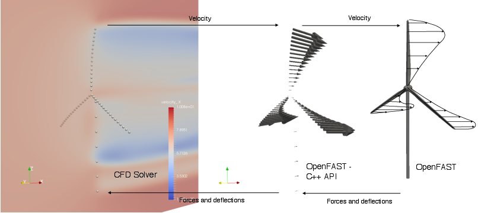
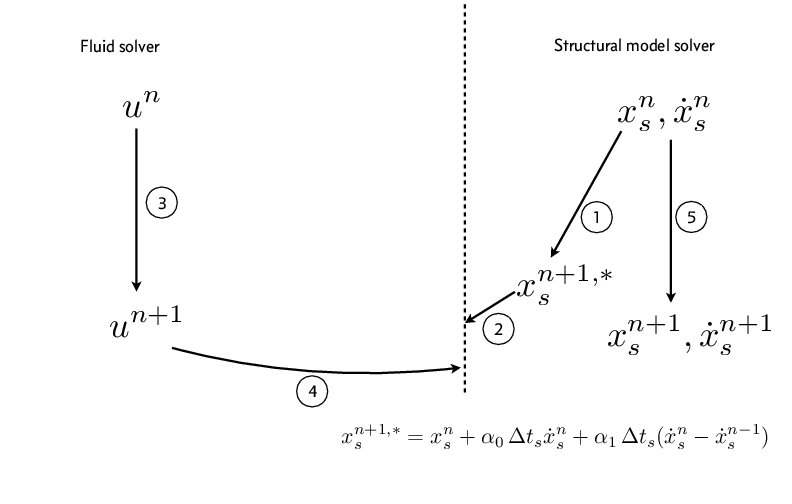
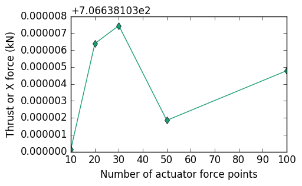
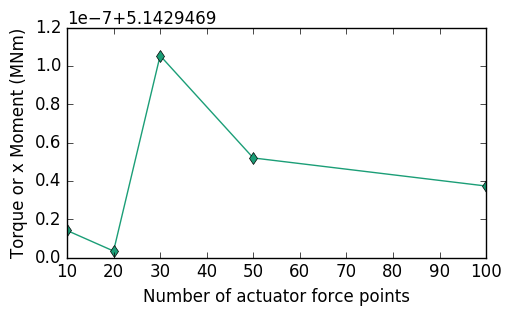

.. _cppapi:

OpenFAST C++ Application Programming Interface
==============================================

OpenFAST provides a C++ application programming interface (API) to drive wind turbine simulations from an external program in C++. The C++ API was developed mainly to integrate OpenFAST with Computational Fluid Dynamics (CFD) solvers for Fluid-Structure Interaction (FSI) applications. It currently supports FSI simulations using the actuator line method with plans to support blade-resolved FSI simulations in the near future. The C++ API can also be used to create an external driver program or glue code that runs OpenFAST simulations of several wind turbines in parallel.

The C++ API is defined and implemented in the :class:`~fast::OpenFAST` class. Any user who wants to write a glue-code for OpenFAST in C++ should instantiate an object of the OpenFAST class and use it to drive the simulation of turbines. A sample glue-code `FAST_Prog.cpp <https://github.com/OpenFAST/openfast/blob/dev/glue-codes/openfast-cpp/src/FAST_Prog.cpp>`_ is provided as a demonstration of the usage of the C++ API. The glue-code allows for the simulation of multiple turbines using OpenFAST in serial or in parallel over multiple processors. The message passing interface (MPI) is used to run the different instances of turbines in parallel. An abbrievated version of FAST_Prog.cpp is shown below. The highlighted lines indicate the use of the OpenFAST class.

.. literalinclude:: files/FAST_Prog.cpp
   :emphasize-lines: 1,27,28,32,36,38,40,45,49
   :language: C++

All inputs to the OpenFAST class are expected through an object of the :class:`fast::fastInputs`.

FIXME: **doxygenclass** is needed to render the :class:`fast::fastInputs` class structure

..
 .. doxygenclass:: fast::fastInputs
   :members:
   :private-members:
   :protected-members:
   :undoc-members:

The object of :class:`~fast::fastInputs` class is expected hold a struct vector of type :class:`~fast::turbineDataType` and size of the number of turbines in the simulation.

FIXME: **doxygenstruct** is needed to render the :class:`fast::turbineDataType` class structure

..
 .. doxygenstruct:: fast::turbineDataType
   :members:
   :private-members:

Use of C++ API for Actuator Line Simulations
--------------------------------------------

The C++ API was developed mainly to integrate OpenFAST with Computational Fluid Dynamics (CFD) solvers for Fluid-Structure Interaction (FSI) applications. The workhorse FSI algorithm for wind energy applications today is the Actuator Line algorithm :cite:`cpp-churchfield2012`. The Actuator Line algorithm represents the effect of a turbine on a flow field as a series of point forces at **actuator points** along aerodynamic surfaces. The use of Blade Element Momentum theory in AeroDyn is modified to interface OpenFAST with CFD solvers for actuator line simulations. The CFD solver becomes the inflow module for OpenFAST that provides velocity information near the turbine. The calculation of the induction factors is turned off in OpenFAST and AeroDyn simply uses look up tables and an optional dynamic stall model to calculate the loads on the turbine based on the inflow field information received from the CFD solver. The induction model should be turned off in OpenFAST by selecting :samp:`WakeMod=0` in the AeroDyn input file. OpenFAST lumps the line forces along the blades and tower into a series of point forces for the actuator line algorithm. :numref:`actuatorline-viz` illustrates the transfer of information between OpenFAST and a CFD solver for actuator line applications.

.. _actuatorline-viz:

   Illustration of transfer of velocity, loads and deflection between a CFD solver and OpenFAST through the C++ API for actuator line applications.

The CFD solver is expected to be the *driver program* for actuator line FSI simulations coupled to OpenFAST. The C++ API allows for *substepping* where the driver timestep is an integral multiple of the OpenFAST time step (:math:`\Delta_t^{CFD} = n \Delta_t^{OpenFAST}`). The current implementation of the C++ API for OpenFAST allows for a serial staggered FSI scheme between the fluid (CFD) and structural (OpenFAST) solver. :numref:`actuatorline-css` shows a suggested implementation of a loosely coupled serial staggered FSI scheme to move the simulation from time step `n` to `n+1` for actuator line applications. A strongly coupled FSI scheme can be constructed through the repetition of the coupling algorithm in :numref:`actuatorline-css` through "outer" iterations.

.. _actuatorline-css:

   A conventional serial staggered FSI scheme that can be constructed through the C++ API for actuator line applications.

OpenFAST uses different spatial meshes for the various modules :cite:`cpp-fastv8ModFramework`. We define the actuator points to be along the mesh defined in the structural model (ElastoDyn/BeamDyn) of the turbine. The user defines the required number of actuator points along each blade and the tower through the input parameters :samp:`numForcePtsBlade` and :samp:`numForcePtsTower` for each turbine. The number of actuator points have to be the same on all blades. The C++ API uses OpenFAST to create the requested number of actuator points through linear interpolation of the nodes in the structural model. The mesh mapping algorithm in OpenFAST :cite:`cpp-fastv8AlgorithmsExamples` is used to transfer deflections from the structural model and loads from AeroDyn to the actuator points. To distinguish the *actuator points* from the Aerodyn points, the OpenFAST C++ uses the term :samp:`forceNodes` for the actuator points and :samp:`velNodes` (velocity nodes) for the Aerodyn points. The following piece of code illustrates how one can use the C++ API to implement a strongly coupled FSI scheme with "outer" iterations for actuator line applications. This sample piece of code sets the velocity at the :samp:`velNodes` and access the coordinates and the lumped forces at the :samp:`forceNodes`.

.. code-block:: c++

   std::vector<double> currentCoords(3);
   std::vector<double> sampleVel(3);

   for (int iOuter=0; iOuter < nOuterIterations; iOuter++) {

      FAST.predict_states(); //Predict the location and force at the actuator points at time step 'n+1'.

      for(iTurb=0; iTurb < nTurbines; iTurb++) {
         for(int i=0; i < FAST.get_numVelPts(iTurb); i++) {
            // Get actuator node co-ordinates at time step 'n+1'
            FAST.getForceNodeCoordinates(currentCoords, i, iTurb, fast::np1);
            //Move the actuator point to this co-ordinate if necessary
            // Get force at actuator node at time step 'n+1'
            FAST.getForce(actForce, i, iTurb, fast::np1);
            //Do something with this force
         }
      }

      // Predict CFD solver to next time step here

      for(iTurb=0; iTurb < nTurbines; iTurb++) {
         for(int i=0; i < FAST.get_numVelPts(iTurb); i++) {
            // Get velocity node co-ordinates at time step 'n+1'
            FAST.getVelNodeCoordinates(currentCoords, i, iTurb, fast::np1);
            //Sample velocity from CFD solver at currentCoords into sampleVel here
            // Set velocity at the velocity nodes at time step 'n+1'
            FAST.setVelocity(sampleVel, i, iTurb, fast::np1);
         }
      }

      FAST.update_states_driver_time_step(); // Predict the state of OpenFAST at the next time step

   }

   // Move OpenFAST to next CFD time step
   FAST.advance_to_next_driver_time_step();

.. toctree::
   :maxdepth: 1

   api.rst

Implementation
--------------

The C++ API uses the C-Fortran interface to call the same functions as the Fortran driver internally to advance the OpenFAST in time. FAST_Library.f90 contains all the functions that can be called from the C++ API. Some of the corresponding functions between the C++ API and the Fortran module are shown in the following table.

.. table::

   +------------------------------------+---------------------------------+-------------------------------+
   | C++ API - OpenFAST.cpp             | Fortran - FAST_Library.f90      | FAST_Subs.f90                 |
   +====================================+=================================+===============================+
   | init()                             | FAST_AL_CFD_Init                | FAST_InitializeAll_T          |
   +------------------------------------+---------------------------------+-------------------------------+
   | solution0()                        | FAST_CFD_Solution0              | FAST_Solution0_T              |
   +------------------------------------+---------------------------------+-------------------------------+
   | prework()                          | FAST_CFD_Prework                | FAST_Prework_T                |
   +------------------------------------+---------------------------------+-------------------------------+
   |                                    | FAST_CFD_Store_SS               | FAST_Store_SS                 |
   +------------------------------------+---------------------------------+-------------------------------+
   | update_states_driver_time_step()   | FAST_CFD_UpdateStates           | FAST_UpdateStates_T           |
   +------------------------------------+---------------------------------+-------------------------------+
   |                                    | FAST_CFD_Reset_SS               | FAST_Reset_SS                 |
   +------------------------------------+---------------------------------+-------------------------------+
   | advance_to_next_driver_time_step() | FAST_CFD_AdvanceToNextTimeStep  | FAST_AdvanceToNextTimeStep_T  |
   +------------------------------------+---------------------------------+-------------------------------+

The `FAST_Solution_T` subroutine in `FAST_Subs.f90` is split into three different subroutines `FAST_Prework_T`, `FAST_UpdateStates_T` and `FAST_AdvanceToNextTimeStep_T` to allow for multiple *outer* iterations with external driver programs. Extra subroutines `FAST_Store_SS` and `FAST_Reset_SS` are introduced to move OpenFAST back by more than 1 time step when using *sub-stepping* with external driver programs. The typical order in which the Fortran subroutines will be accessed when using the C++ API from an external driver program is shown below.

.. code-block:: fortran

   call FAST_AL_CFD_Init

   call FAST_CFD_Solution0

   do i=1, nTimesteps

      if (nSubsteps .gt. 1)
            call FAST_CFD_Store_SS
      else
            call FAST_CFD_Prework
      end if

      do iOuter=1, nOuterIterations

         if (nSubsteps .gt. 1)

            if (iOuter .ne. 1) then
               ! Reset OpenFAST back when not the first pass
               call FAST_CFD_Reset_SS

            end if

            do j=1, nSubsteps

               ! Set external inputs into modules here for the substep
               call FAST_CFD_Prework
               call FAST_CFD_UpdateStates
               call FAST_CFD_AdvanceToNextTimeStep

            end do !Substeps

         else

            call FAST_CFD_UpdateStates

         end if

      end do !Outer iterations

      if (nSubsteps .gt. 1) then

         ! Nothing to do here

      else

         call FAST_CFD_AdvanceToNextTimeStep

      end if

   end do

The mapping of loads and deflections to the actuator points is performed in the :class:`ExternalInflow` module in OpenFAST. The C++ API supports the use of both BeamDyn and ElastoDyn to model the blades. When using BeamDyn to model the blade, the C++ API requires the use of only 1 finite element for each blade along with the choice of trapezoidal quadrature for actuator line simulations.

Test for mapping procedure
--------------------------

The test for the implementation of the mapping procedure is as follows. OpenFAST is run using the C++ API to simulate the NREL-5MW turbine for one time step with a prescribed velocity of :math:`8 m/s` at all the velocity nodes and no induction (:samp:`WakeMod=0`). The number of actuator force nodes is varied from 10 to 100 while the number of velocity nodes is fixed at 17. :numref:`actuator-force-nodes-mapping-test-thrust` and :numref:`actuator-force-nodes-mapping-test-torque` show that the thrust and torque vary by less than :math:`1.1 \times 10^{-6}\%` and :math:`2 \times 10^{-6}\%` respectively when the number of actuator force nodes is varied from :math:`10-100`.

.. _actuator-force-nodes-mapping-test-thrust:

   Variation of thrust using different number of actuator force nodes in `OpenFAST` for the same number of velocity nodes.

.. _actuator-force-nodes-mapping-test-torque:

   Variation of torque using different number of actuator force nodes in `OpenFAST` for the same number of velocity nodes.

References
----------

.. bibliography:: bibliography.bib
   :labelprefix: cpp-
