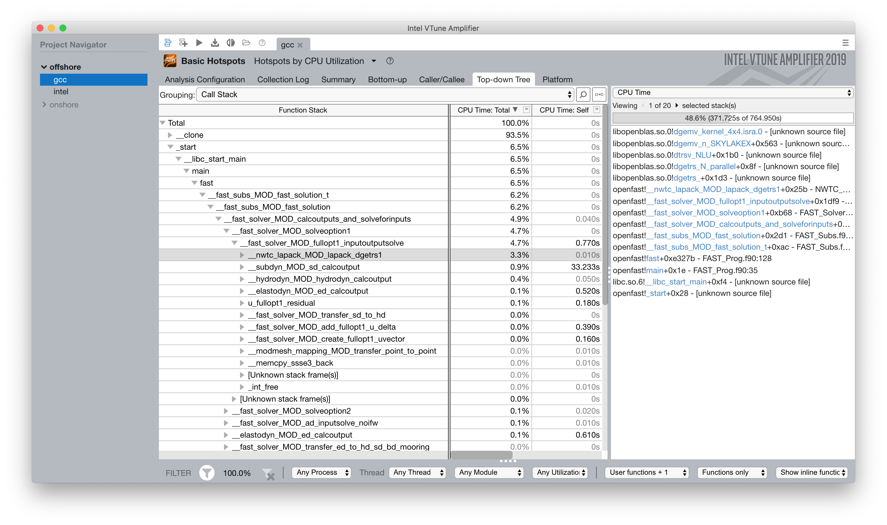
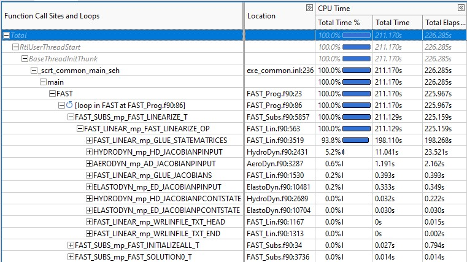

Performance Profiling and Tuning
================================
A major focus of the OpenFAST team is performance-profiling and optimization
of the OpenFAST software with the goal of improving time-to-solution performance
for the most computationally expensive use cases. The process generally involves
initial profiling and hotspot analysis, then identifying specific subroutines to
target for optimization in the physics modules and glue-codes.

A portion of this work was supported by Intel® through its designation of NREL as an
`Intel® Parallel Computing Center (IPCC) <https://software.intel.com/en-us/ipcc>`_.

The procedures, findings, and recommended programming practices are presented here.
This is a working document and will be updating as additional studies are completed.

High-performance programming techniques
---------------------------------------
Being a compiled language designed for scientific and engineering
applications, Fortran is well suited for producing very efficient
code. However, the process of tuning code requires developers to
understand the language as well as the tools available (compilers,
performance libraries, etc) in order to generate the highest
performance. This section identifies programming patterns to use
Fortran and the Intel® Fortran compiler effectively. Developers
should also reference the Intel® Fortran compiler documentation
regarding `optimization <https://software.intel.com/content/www/us/en/develop/documentation/fortran-compiler-oneapi-dev-guide-and-reference/top/optimization-and-programming-guide.html>`_,
in general, and especially the sections on
`automatic vectorization <https://software.intel.com/content/www/us/en/develop/documentation/fortran-compiler-oneapi-dev-guide-and-reference/top/optimization-and-programming-guide/vectorization/automatic-vectorization.html>`_
and `coarrays <https://software.intel.com/content/www/us/en/develop/documentation/fortran-compiler-oneapi-dev-guide-and-reference/top/optimization-and-programming-guide/coarrays-1.html>`_.

Optimization report
~~~~~~~~~~~~~~~~~~~
When evaluating compiler optimization performance in a complex
software, timing tests alone are not a good indication for the
compiler's ability to optimize particular lines of code. For
low-level information on the compilers attempts in optimization,
developers should generate optimization reports to get
line-by-line reporting on various metrics such as vectorization,
parallelization, memory and cache usage, threading, and others.
Developers should refer to the Intel® Fortran compiler documentation
on `optimization reports <https://software.intel.com/content/www/us/en/develop/articles/vectorization-and-optimization-reports.html>`_.

For Linux and macOS, the OpenFAST CMake configuration has compiler
flags for generating optimization reports available but commented
in the ``set_fast_intel_fortran_posix`` macro in ``openfast/cmake/OpenfastFortranOptions.cmake``.
Primarily, the ``qopt-report-phase`` and ``qopt-report`` flags should
be used. See the optimization report options `documentation <https://software.intel.com/content/www/us/en/develop/documentation/fortran-compiler-developer-guide-and-reference/top/compiler-reference/compiler-options/compiler-option-details/optimization-report-options/qopt-report-qopt-report.html>`_
for more information on additional flags and configurations.

With compiler flags correctly configured, the copmiler will output
files with the extension ``.optrpt`` alongside the intermediate compile
artifacts like ``.o`` files. The compile process will state that
additional files are being generated:

.. code-block::

  ifort: remark #10397: optimization reports are generated in *.optrpt files in the output location

And the additional files should be located in the corresponding
``CMakeFiles`` directory for each compile target. For example,
the optimization report for the VersionInfo module in OpenFAST
are at:

.. code-block::

  >> ls -l openfast/build/modules/version/CMakeFiles/versioninfolib.dir/src/
  -rw-r--r--  2740 May 12 23:10 VersionInfo.f90.o
  -rw-r--r--     0 May 12 23:10 VersionInfo.f90.o.provides.build
  -rw-r--r--   668 May 12 23:10 VersionInfo.f90.optrpt

Operator Strength Reduction
~~~~~~~~~~~~~~~~~~~~~~~~~~~
Each mathematical operation has an effective "strength", and some
operations can be equivalently represented as a combination of multiple
reduced-strength operations that have better performance than the
original. As part of the code optimization step, compilers may be
able to identify areas where a mathetical operation's strength can
be reduced. Compilers are not able to optimize all expensive operations. For
example, cases where a portion of an expensive mathematical operation
is a variable contained in a derived data type are frequently skipped.
Therefore, it is recommended that expensive subroutines be profiled
and searched for possible strength reduction opportunities.

A concrete example of operator strength reduction is in dividing
many elements of an array by a constant.

.. code-block:: fortran

  module_type%scale_factor = 10.0

  do i = 1
    if array(i) < 30.0
      array(i) = array(i) / module_type%scale_factor
    end if
  end do

In this case, a multiplication of real numbers is less expensive
than a division of real numbers. The code can be factored so that
the inverse of the scale factor is computed outside of the loop
and the mathematical operation in the loop is converted to a
multiplication.

.. code-block:: fortran

  module_type%scale_factor = 10.0
  inverse_scale_factor = 1.0 / module_type%scale_factor

  do i = 1
    if array(i) < 30.0
      array(i) = array(i) * inverse_scale_factor
    end if
  end do

Coarrays
~~~~~~~~
Coarrays are a feature introduced to the Fortran language in the 2008
standard to provide language-level parallelization for array operations
in a Single Program, Multiple Data (SPMD) programming paradigm.
The Fortran standard leaves the method of parallelization up to the
compiler, and the Intel® Fortran compiler uses MPI.

Coarrays are used to split an array operation across multiple copies
of the program. The copies are called "images". Each image has its
own local variables, plus a portion of any coarrays as shared
variables. A coarray can be thought of as having extra dimensions,
referred to as "codimensions". A single image (typically the 1-th
index) controls the I/O and problem setup, and images can read
from memory in other images.

For operations on large arrays such as constructing a super-array
from many sub-arrays (as in the construction of a Jacobian matrix),
the coarray feature of Fortran 08 can parallelize the procedure
improving overall computational efficiency.

.. TODO: Add example of coarray implementation in Fortran

Data modeling and access rules
~~~~~~~~~~~~~~~~~~~~~~~~~~~~~~
Fortran represents arrays in column-major order. This means that a
multidimensional array is represented in memory with column elements
being adjacent. If a given element in an array is at a location in
memory, one element before in memory corresponds to the element
above it in its column.

In order to make use of the single instruction, multiple data
features of modern processors, array construction and access
should happen in column-major order. That is, loops should loop
over the left-most index quickest. Slicing should occur with
the ``:`` also on the left-most index when possible.

With this in mind, data should be represented as structures of arrays
rather than arrays of structures. Concretely, this means that data
types within OpenFAST should contain the underlying arrays and arrays
should generally contain only numeric types.

The short program below displays the distance in memory in units
of bytes between elements of an array and neighboring elements.

.. code-block:: fortran

  program memloc

  implicit none

  integer(kind=8), dimension(3, 3) :: r, distance_up, distance_left

  ! Take the element values as their "ID"
  ! r(row, column)
  r(1,:) = (/ 1, 2, 3 /)
  r(2,:) = (/ 4, 5, 6 /)
  r(3,:) = (/ 7, 8, 9 /)
  print *, "Reference array:"
  call pretty_print_array(r)

  ! Compute the distance between matrix elements. Inputs to the `calculate_distance` function
  ! are indices for elements in the equation loc(this_element) - loc(other_element)
  distance_up(1,:) = (/ calculate_distance( 1,1 , 1,1), calculate_distance( 1,2 , 1,2), calculate_distance( 1,3 , 1,3) /)
  distance_up(2,:) = (/ calculate_distance( 2,1 , 1,1), calculate_distance( 2,2 , 1,2), calculate_distance( 2,3 , 1,3) /)
  distance_up(3,:) = (/ calculate_distance( 3,1 , 2,1), calculate_distance( 3,2 , 2,2), calculate_distance( 3,3 , 2,3) /)
  print *, "Distance in memory (bytes) for between an element and the one above it (top row zeroed):"
  call pretty_print_array(distance_up)

  distance_left(1,:) = (/ calculate_distance( 1,1 , 1,1), calculate_distance( 1,2 , 1,1), calculate_distance( 1,3 , 1,2) /)
  distance_left(2,:) = (/ calculate_distance( 2,1 , 2,1), calculate_distance( 2,2 , 2,1), calculate_distance( 2,3 , 2,2) /)
  distance_left(3,:) = (/ calculate_distance( 3,1 , 3,1), calculate_distance( 3,2 , 3,1), calculate_distance( 3,3 , 3,2) /)
  print *, "Distance in memory (bytes) for between an element and the one to the its left (first column zeroed):"
  call pretty_print_array(distance_left)

  contains

  integer(8) function calculate_distance(c1, r1, c2, r2)

      integer, intent(in) :: c1, r1, c2, r2
      calculate_distance = loc(r(c1, r1)) - loc(r(c2, r2))

  end function

  subroutine pretty_print_array(array)

      integer(8), dimension(3,3), intent(in) :: array
      print *, "["
      print '(I4, I4, I4)', array(1,1), array(1,2), array(1,3)
      print '(I4, I4, I4)', array(2,1), array(2,2), array(2,3)
      print '(I4, I4, I4)', array(3,1), array(3,2), array(3,3)
      print *, "]"

  end subroutine

  end program

Optimization Studies
--------------------
This section describes specific efforts to profile sections of
OpenFAST and improve performance with the Intel® compiler suite.

BeamDyn Performance Profiling and Optimization (IPCC Year 1 and 2)
~~~~~~~~~~~~~~~~~~~~~~~~~~~~~~~~~~~~~~~~~~~~~~~~~~~~~~~~~~~~~~~~~~
The general mechanisms identified for performance improvements in OpenFAST were:

* Intel® compiler suite and Intel® Math Kernel Library (Intel® MKL)
* Algorithmic improvements
* Memory-access optimization enabling more efficient cache usage
* Data type alignment allowing for SIMD vectorization
* Multithreading with OpenMP

To establish a path forward with these options, OpenFAST was first
profiled with Intel® VTune™ Amplifier to get a clear breakdown of
time spent in the simulation. Then, the optimization report generated from the
Intel® Fortran compiler was analyzed to determine areas that were not
autovectorized. Finally, Intel® Advisor was used to highlight areas of the code
that the compiler identified as potentially improved with multithreading.

Two OpenFAST test cases have been chosen to provide meaningful and
realistic timing benchmarks. In addition to real-world turbine and
atmospheric models, these cases are computationally expensive and expose
the areas where performance improvements would make a difference.

**5MW_Land_BD_DLL_WTurb**

Download case files `here <https://github.com/OpenFAST/r-test/tree/dev/glue-codes/openfast/5MW_Land_BD_DLL_WTurb>`_.

The physics modules used in this case are:

* BeamDyn
* InflowWind
* AeroDyn 15
* ServoDyn

This is a land based NREL 5-MW turbine simulation using BeamDyn as the
structural module. It simulates 20 seconds with a time step size of 0.001
seconds and executes in `3m 55s <https://my.cdash.org/testDetails.php?test=40171217&build=1649048>`__
on NREL's `Peregrine <https://www.nrel.gov/hpc/peregrine-system.html>`__
supercomputer.

**5MW_OC4Jckt_DLL_WTurb_WavesIrr_MGrowth**

Download case files `here <https://github.com/OpenFAST/r-test/tree/dev/glue-codes/openfast/5MW_OC4Jckt_DLL_WTurb_WavesIrr_MGrowth>`__.

This is an offshore, fixed-bottom NREL 5-MW turbine simulation with the
majority of the computational expense occurring in the HydroDyn wave-dynamics
calculation.

The physics modules used in this case are:

* ElastoDyn
* InflowWind
* AeroDyn 15
* ServoDyn
* HydroDyn
* SubDyn

It simulates 60 seconds with a time step size of 0.01 seconds and executes in
`20m 27s <https://my.cdash.org/testDetails.php?test=40171219&build=1649048>`__
on NREL's `Peregrine <https://www.nrel.gov/hpc/peregrine-system.html>`__
supercomputer.

Profiling
+++++++++
The OpenFAST test cases were profiled with Intel® VTune™ Amplifier to
identify performance hotspots. Being that the two test cases exercise
difference portions of the OpenFAST software, different hotspots were
identified. In all cases and environment settings, the majority of the
CPU time was spent in ``fast_solution`` loop which is a high-level subroutine
that coordinates the solution calculation from each physics module.

LAPACK
......
In the offshore case, the LAPACK usage was identified as a performance load.
Within the ``fast_solution`` loop, the calls to the LAPACK function ``dgetrs``
consume 3.3% of the total CPU time.

BeamDyn
.......
While BeamDyn provides a high-fidelity blade-response calculation, it is a
computationally expensive module. Initial profiling highlighted the
``bd_elementmatrixga2`` subroutine as a hotspot. However, initial
attempts to improve performance in BeamDyn revealed needs for algorithmic
improvements and refinements to the module's data structures.

Results
+++++++
Though work is ongoing, OpenFAST time-to-solution performance has improved
and the performance potential is better understood.

Some keys outcomes from the first year of the IPCC project are as follows:

* Use of Intel® compiler and MKL library provides dramatic speedup over GCC
  and LAPACK

  * Additional significant gains are possible through MKL threading for
    offshore simulations

* Offshore-wind-turbine simulations are poorly load balanced
  across modules

  * Land-based-turbine configuration better balanced
  * OpenMP Tasks are employed to achieve better load-balancing

* OpenMP module-level parallelism provides significant, but limited speed
  up due to imbalance across different module tasks
* Core algorithms need significant modification to enable OpenMP and SIMD
  benefits

Tuning the Intel® tools to perform best on NREL's hardware and adding high level
multithreading yielded a maximum 3.8x time-to-solution improvement for one
of the benchmark cases.

Speedup - Intel® Compiler and MKL
.................................
By employing the standard Intel® developer tools tech stack, a performance
improvement over GNU tools was demonstrated:

========= ================= ===================== ======================================
Compiler  Math Library      5MW_Land_BD_DLL_WTurb 5MW_OC4Jckt_DLL_WTurb_WavesIrr_MGrowth
========= ================= ===================== ======================================
GNU       LAPACK            2265 s (1.0x)         673 s (1.0x)
Intel® 17 LAPACK            1650 s (1.4x)         251 s (2.7x)
Intel® 17 MKL               1235 s (1.8x)         ---
Intel® 17 MKL Multithreaded 722 s (3.1x)          ---
========= ================= ===================== ======================================

Speedup - OpenMP at FAST_Solver
...............................
A performance improvement was domenstrated by adding OpenMP directives to the
``FAST_Solver`` module. Although the solution scheme is not well balanced,
parallelizing mesh mapping and calculation routines resulted in the following
speedup:

========= =============== ===================== ======================================
Compiler  Math Library    5MW_Land_BD_DLL_WTurb 5MW_OC4Jckt_DLL_WTurb_WavesIrr_MGrowth
========= =============== ===================== ======================================
Intel® 17 MKL - 1 thread  1073 s (2.1x)         100 s (6.7x)
Intel® 17 MKL - 8 threads 597 s (3.8x)          ---
========= =============== ===================== ======================================

Ongoing Work
++++++++++++
The next phase of the OpenFAST performance improvements are focused in two key
areas:

1. Implementing the outcomes from previous work throughout OpenFAST modules and
   glue codes
2. Preparing OpenFAST for efficient execution on Intel®'s next generation
   platforms

.. Year 2 stuff:

.. Further, `Envision Energy USA, Ltd <http://www.envision-group.com/en/energy.html>`_
.. has continuously contributed code and expertise in this area.

.. Furthermore, NREL is optimizing OpenFAST for the future through profiling on
.. Intel next generation platform (NGP) simulators.

.. bd_5MW_dynamic
.. ~~~~~~~~~~~~~~
.. Download files `here <https://github.com/OpenFAST/r-test/tree/dev/modules/beamdyn/bd_5MW_dynamic>`__.

.. This is a standalone BeamDyn case of the NREL 5MW wind turbine. It simulates 30
.. seconds with a time step size of 0.002 seconds and executes in 24s on NREL's
.. Peregrine supercomputer.

.. BeamDyn dynamic solve

.. Performance Improvements
.. ------------------------
.. BeamDyn chosen as the module to improve from year 1

.. How to improve vectorization

.. BeamDyn Memory Alignment
.. ~~~~~~~~~~~~~~~~~~~~~~~~
.. Work accomplished to align beamdyn types in the dervive types module
.. - Ultimately, this needs to be done in the registry

.. Multithreading
.. ~~~~~~~~~~~~~~
.. OpenMP at the highest level
.. OpenMP added to BeamDyn dynamic solve

.. Speedup
.. -------

.. These are the areas where we have demonstrated performance improvements

.. BeamDyn Dynamic
.. ---------------
.. This improved beamdyn's time to solution by XX%

.. - VTune / Advisor
.. - Vectorization report
.. - SIMD report

.. Optimization Reports
.. The optimization reports provided by the Intel fortran compiler give a static
.. analysis of code optimization. Specifically, the vectorization and openmp
.. reports were analyzed to determine

Linearization routine profiling
~~~~~~~~~~~~~~~~~~~~~~~~~~~~~~~
As a portion of the `ARPA-E WEIS <https://arpa-e.energy.gov/technologies/projects/wind-energy-integrated-servo-control-weis-toolset-enable-controls-co-design>`_
project, the linearization capability within OpenFAST has been profiled
in an effort to characterize the performance and current bottlenecks.
This work specifically targetted the linearization routines within the
FAST Library, primarily in `FAST_Lin.f90 <https://github.com/OpenFAST/openfast/blob/main/modules/openfast-library/src/FAST_Lin.f90>`_,
as well as the routines constructing the Jacobian matrices within individual
physics modules. Because these routines require
constructing large matrices, this is a computationally intensive process
with a high rate of memory access.

A high-level flow of data in the linearization algorithm in the
``FAST_Linearize_OP`` subroutine is given below.

.. mermaid::

  graph TD;
    D[Construct Module Jacobian]-->A[Calculate Module OP];
    A[Calculate Module OP]-->B[Construct Glue Code Jacobians];
    A[Calculate Module OP]-->C[Construct Glue Code State Matrices];

Each enabled physics module constructs module-level matrices in their respective
``<Module>_Jacobian`` and ``<Module>_GetOP`` routines, and the collection of these
are assembled into global matrices in ``Glue_Jacobians`` and ``Glue_StateMatrices``.
In a top-down comparison of total CPU time in ``FAST_Linearize_OP``, we see that
the construction of the glue-code state matrices is the most expensive step.
The HydroDyn Jacobian computation also stands out relative to other module
Jacobian computations.

The Jacobian and state matrices are sized based on the total number of inputs, outputs,
and continuous states. Though the size varies, these matrices generally contain thousands
of elements in each dimension and are mostly zeroes. That is to say, the Jacobian
and state matrices are large and sparse. To reduce the overhead of memory
allocation and access, a sparse matrix representation is recommended.

