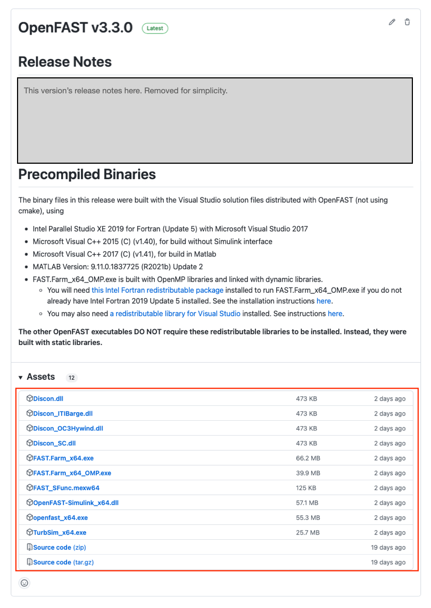

.. _installation:

Installing OpenFAST
===================
Guidelines and procedures for obtaining precompiled binaries or compiling
OpenFAST from source code are described here. While there
are multiple ways to achieve the same outcome, the OpenFAST team has developed
a comprehensive and well-thought out system for installation, so the methods
described here are the only officially supported and
maintained paths for obtaining an OpenFAST executable.

Most users of OpenFAST will not require modifying or compiling the source
code. **For the simplest installation of OpenFAST without changing the source
code,** refer to the table in the :ref:`download_binaries` section and read
the corresponding documentation for specific instructions.
For instructions on compiling, see :ref:`compile_from_source`.

.. _download_binaries:

Download binaries
~~~~~~~~~~~~~~~~~
For users who intend to run OpenFAST simulations without changing the
source code, installation with precompiled binaries is recommended.
The installation procedures are specific for each supported operating
system, and the table below maps operating systems to the method for
obtaining binaries. "Release" versions are well tested and stable versions
of OpenFAST. A new release corresponds to a merge from the ``dev``
branch of the repository to the ``main`` branch along with a version tag.
"Prerelease" versions contain the latest commits to the ``dev`` branch
and may contain unstable code but will always have the latest features.

================== ================= ===================== ======================
 Operating System   Method            OpenFAST Version      Docs Section
================== ================= ===================== ======================
Linux               Conda             Release, Prerelease   :ref:`conda_install`
macOS               Conda             Release, Prerelease   :ref:`conda_install`
macOS               Homebrew          Release               :ref:`brew_install` 
Windows             GitHub Releases   Release               :ref:`gh_install`
================== ================= ===================== ======================

.. _conda_install:

Conda Installation
------------------
OpenFAST releases are distributed through the `Anaconda <https://anaconda.org/>`_
package manager via the `OpenFAST Conda Forge <https://anaconda.org/conda-forge/openfast/>`_
channel for macOS and Linux. The installation includes

- OpenFAST glue-code executable
- Available module drivers
- C++ header files

The following commands describe how to create a new environment, install
OpenFAST, and test the installation.

.. code-block:: bash

    # Create a new conda environment
    conda create -n openfast_env

    # Install OpenFAST through the Conda Forge channel
    conda install -c conda-forge openfast

    # Test OpenFAST
    which openfast
    openfast -v

    # Test the HydroDyn driver
    which hydrodyn_driver
    hydrodyn_driver -v

Prereleases can be installed via conda by specifying the ``dev`` label,
as shown below.

.. code-block:: bash

    conda install -c conda-forge/label/dev openfast

These are always the latest commits to the ``dev`` branch
of the repository and contain the latest changes to OpenFAST, but these
builds are not as well tested as the full release versions.

.. _brew_install:

Homebrew Installation
---------------------
For macOS systems, OpenFAST releases are distributed through
the `Homebrew <https://brew.sh>`_ package manager. The installation includes
only the OpenFAST glue-code executable.

To install with Homebrew and test the installation, use the following
commands. 

.. code-block:: bash

    # Update Homebrew
    brew update

    # Install OpenFAST
    brew search openfast
    brew install openfast
    
    # Test OpenFAST
    which openfast
    openfast -v

.. _gh_install:

GitHub Releases
---------------
For Windows systems only, precompiled binaries are made available for each
release on the OpenFAST GitHub `Releases <https://github.com/openfast/openfast/releases/latest>`_
page. The binaries are compiled with the Intel Fortran compiler
version 2020.

.. important::

    The precompiled binaries require either the Intel Fortran
    compiler or the Intel MKL redistributable libraries, which are
    not by default included with the binaries. To configure the
    libraries, download the installers from the bottom of
    `this page <https://software.intel.com/content/www/us/en/develop/articles/redistributable-libraries-for-intel-c-and-fortran-2020-compilers-for-windows.html>`__.
    If you have a Command Prompt open, you will need to close it after
    installing the libraries in order for the changes to take effect.
    Admin privileges are required to install the Intel libraries.

The OpenFAST executables can be downloaded from the "Assets" dropdown
in each Release. The two assets named "Source code" are not needed.

The zipped file contains the following items:

================================================== ==============================================
 File Name                                              Description
================================================== ==============================================
openfast_Win32.exe                                  32-bit single precision
openfast_x64.exe                                    64-bit single precision
openfast_x64_double.exe                             64-bit double precision
Map_Win32.dll                                       32-bit MAP++ library
Map_x64.dll                                         64-bit MAP++ library
DISCON_DLLS/<64bit or Win32>/DISCON.dll             Controller library for NREL 5MW
DISCON_DLLS/<64bit or Win32>/DISCON_ITIBarge.dll    Controller library for NREL 5MW - ITI Barge
DISCON_DLLS/<64bit or Win32>/DISCON_OC3Hywind.dll   Controller library for NREL 5MW - OC3 Hywind
================================================== ==============================================

After extracting the contents, the OpenFAST executables
can be tested by opening a command prompt, moving into the directory
containing the executables, and running a simple test command:

.. code-block:: bash

    cd C:\your\path\Desktop\openfast_binaries\
    openfast_x64.exe /h

.. _compile_from_source:

Compile from source
~~~~~~~~~~~~~~~~~~~
To compile from source code, the NREL OpenFAST team has developed an
approach that uses CMake to generate build files for all platforms. Currently,
CMake support for Visual Studio while doing active development
is not well supported, so OpenFAST maintains a Visual Studio Solution
giving Windows developers another option for writing code, compiling
and debugging in a streamlined manner. See :ref:`vs_windows`
for more information. If Visual Studio is not a requirement in Windows
development, CMake is adequate. Background on CMake is given in
:ref:`understanding_cmake`, and procedures for configuring and
compiling are given in :ref:`cmake_unix` and :ref:`cmake_windows`.

Generally, the steps required to compile are:

1. Install Dependencies (Section :numref:`dependencies`)
2. Configure the build system (Visual Studio: :numref:`vs_windows`, CMake: :numref:`understanding_cmake`)
3. Compile and test binaries (Visual Studio: :numref:`vs_windows`,  CMake: :numref:`cmake_unix` and :numref:`cmake_windows` )

.. _dependencies:

Dependencies
------------
Compiling OpenFAST from source requires additional libraries and tools that
are not distributed with the OpenFAST repository. Each of the following
components are required for the minimum OpenFAST compilation.

- C++, C, and Fortran compiler
- BLAS and LAPACK math library
- Build system

In many cases, these tools can be installed with a system's package
manager (e.g. ``homebrew`` for macOS, ``yum`` for CentOS/Red Hat, or
``apt`` for Debian-based systems like Ubuntu). For Ubuntu and macOS,
the following commands install all required dependencies.

============== ================================
 System         Dependency Installation Command
============== ================================
 Ubuntu 20.04   ``apt install git cmake libblas-dev liblapack-dev gfortran-10 g++``
 macOS 10.15    ``brew install git cmake make openblas gcc``
============== ================================

If dependencies are downloaded from vendors directly, they must be
installed in a standard location for your system so that the OpenFAST
build systems can find them.

Compilers
+++++++++
Compiling OpenFAST requires a C, C++, and Fortran compiler. Though many
options exist, the most common and best supported compilers are listed
below.

============================================== ==================== ================= =======
 Vendor / Compiler                              Applicable systems   Minimum version   Link
============================================== ==================== ================= =======
 GNU Compiler Collection (gfortran, gcc, g++)   macOS, Linux         4.6.0             https://gcc.gnu.org
 Intel Compilers (ifort, icc)                   All                  2013              https://software.intel.com/content/www/us/en/develop/tools/oneapi/hpc-toolkit.html
============================================== ==================== ================= =======

Other compiler packages may work and can be well suited to a particular
hardware, but their mileage may vary with OpenFAST. For instance, MinGW,
CygWin, and LLVM are options for obtaining compilers on various systems.
It is highly recommended to use the latest version of one of the above.

Math libraries
++++++++++++++
Math libraries with the BLAS and LAPACK interfaces are also required. All major
options can be obtained as free downloads. The most common options are listed
in the table below.

============ ============= ============== ======
Library       Distributor   Open Source?   Link
============ ============= ============== ======
BLAS/LAPACK   NetLib        Yes            http://www.netlib.org/blas/, http://www.netlib.org/lapack/
BLAS/LAPACK   OpenBLAS      Yes            https://www.openblas.net
MKL           Intel         No             https://software.intel.com/content/www/us/en/develop/tools/oneapi/components/onemkl.html
============ ============= ============== ======

Build tools
+++++++++++
An environment-specific build system is required and may consist of a
combination of the packages listed in the table below.

============================================== ==================== ================= =======
 Package                                        Applicable systems   Minimum version   Link
============================================== ==================== ================= =======
 CMake                                          All                  3.12              https://cmake.org
 GNU Make                                       macOS, Linux         1.8               https://www.gnu.org/software/make/
 Visual Studio                                  Windows              2015              https://visualstudio.microsoft.com>
============================================== ==================== ================= =======

For Windows, CMake may be used to generate a Visual Studio Solution that
can then be used to compile OpenFAST. OpenFAST also contains a standalone
Visual Studio project, see :ref:`vs_windows`.

For macOS and Linux, the recommended tools are CMake and GNU Make. CMake is
used to generate Makefiles that are inputs to the GNU Make program. Other
build tools exist for both Linux and macOS (Xcode, Ninja), but these
are not well supported by the OpenFAST system.

Get the code
------------
OpenFAST can be cloned (i.e., downloaded) from its `Github repository <https:// github.com/OpenFAST/OpenFAST>`_
via the command line:

.. code-block:: bash

    git clone https://github.com/OpenFAST/OpenFAST.git

An archive of the source code can also be downloaded directly from these links:

- `"main" branch <https://github.com/OpenFAST/openfast/archive/main.zip>`__ - Stable release
- `"dev" branch <https://github.com/OpenFAST/openfast/archive/dev.zip>`__ - Latest updates

.. _vs_windows:

Visual Studio Solution for Windows
----------------------------------
A complete Visual Studio solution is maintained for working with the OpenFAST
on Windows systems. The procedure for configuring the system and proceeding
with the build process are documented in the following section:

.. toctree::
   :maxdepth: 1

   install_vs_windows.rst

.. _understanding_cmake:

Understanding CMake
-------------------
To more fully understand CMake and its methodology, visit this guide on
`running CMake <https://cmake.org/runningcmake/>`__.

CMake is a build configuration system that creates files as input to a build
tool like GNU Make, Visual Studio, or Ninja. CMake does not compile code
or run compilers directly, but
rather creates the environment needed for another tool to run compilers and
create binaries. A CMake project is described by a series of files called
``CMakeLists.txt`` located in directories throughout the project. The main
CMake file for OpenFAST is located at ``openfast/CMakeLists.txt`` and each
module and glue-code has its own ``CMakeLists.txt``; for example, AeroDyn
and BeamDyn have one at ``openfast/modules/aerodyn/CMakeLists.txt`` and
``openfast/modules/beamdyn/CMakeLists.txt``, respectively.

Running CMake
+++++++++++++
Running CMake and a build tool will create many files (text files and binaries)
used in the various stages of the build. For this reason, a ``build`` folder
should be created to contain all of the generated files associated with the
build process. Here, an important file called ``CMakeCache.txt`` contains the
user-defined settings for the CMake configuration. This file functions like
memory storage for the build. It is initially created the first time the CMake
command is run and populated with the initial settings. Then, any subsequent
changes to the settings will be updated and stored there.

CMake can be executed in a few ways:

- Command line interface: ``cmake``
- Command line curses interface: ``ccmake``
- Official CMake GUI

The CMake GUI is only distributed for Windows, but it can be built from source
for other platforms. OpenFAST's build process focuses on the command line
execution of CMake for both the Linux/macOS and Windows terminals. The command
line syntax to run CMake for OpenFAST is generally:

.. code-block:: bash

    cmake <path-to-primary-CMakeLists.txt> [options]

    Options
        -D <var>[:<type>]=<value>    = Create or update a cmake cache entry.

For example, a common CMake command issued from the ``openfast/build``
directory is:

.. code-block:: bash

    # cmake <path-to-primary-CMakeLists.txt> [options]
    #   where
    #     <path-to-primary-CMakeLists.txt> is ".."
    #     [options] can be
    #       -DBUILD_SHARED_LIBS:BOOL=ON or
    #       -DBUILD_SHARED_LIBS=ON

    cmake .. -DBUILD_SHARED_LIBS=ON

The command line curses interface can be invoked similarly:

.. code-block:: bash

    ccmake ..

The interface will be rendered in the terminal window and all navigation
happens through keyboard inputs.

OpenFAST CMake options
++++++++++++++++++++++
CMake has a large number of general configuration variables available. A good
resource for useful CMake variables is at this link: `GitLab CMake variables <https://gitlab.kitware.com/cmake/community/wikis/doc/cmake/Useful-Variables>`_.
The `CMake API documentation <https://cmake.org/cmake/help/latest/>`_
is also helpful for searching through variables and determining the resulting
action. Note that the CMake process should be well understood before
customizing the general options.

The CMake options specific to OpenFAST and their default settings are:

::

    BUILD_DOCUMENTATION            - Build documentation (Default: OFF)
    BUILD_FASTFARM                 - Enable FAST.Farm capabilities (Default: OFF)
    BUILD_OPENFAST_CPP_API         - Enable building OpenFAST - C++ API (Default: OFF)
    BUILD_OPENFAST_SIMULINK_API    - Enable building OpenFAST for use with Simulink (Default: OFF)
    BUILD_SHARED_LIBS              - Enable building shared libraries (Default: OFF)
    BUILD_TESTING                  - Build the testing tree (Default: OFF)
    CMAKE_BUILD_TYPE               - Choose the build type: Debug Release (Default: Release)
    CMAKE_Fortran_MODULE_DIRECTORY - Set the Fortran Modules directory
    CMAKE_INSTALL_PREFIX           - Install path prefix, prepended onto install directories.
    CODECOV                        - Enable infrastructure for measuring code coverage (Default: OFF)
    DOUBLE_PRECISION               - Treat REAL as double precision (Default: ON)
    FPE_TRAP_ENABLED               - Enable Floating Point Exception (FPE) trap in compiler options (Default: OFF)
    GENERATE_TYPES                 - Use the openfast-registry to autogenerate types modules (Default: OFF)
    OPENMP                         - Enable OpenMP support (Default: OFF)
    ORCA_DLL_LOAD                  - Enable OrcaFlex library load (Default: OFF)
    USE_DLL_INTERFACE              - Enable runtime loading of dynamic libraries (Default: ON)

Additional system-specific options may exist for a given system, but those
should not impact the OpenFAST configuration. As mentioned above, the
configuration variables are set initially but can be changed at any time.
For example, the defaults may be accepted to initially configure the project,
but then the settings may be configured individually:

.. code-block:: bash

    # Initial configuration with the default settings
    cmake ..

    # Change the build to Debug mode rather than Release
    cmake .. -DCMAKE_BUILD_TYPE=Debug

    # Use dynamic linking rather than static linking
    cmake .. -DBUILD_SHARED_LIBS=ON

The commands above are equivalent to having run this command the first time:

.. code-block:: bash

    # Initial configuration in Debug mode with dynamic linking
    cmake .. -DCMAKE_BUILD_TYPE=Debug -DBUILD_SHARED_LIBS=ON

CMAKE_BUILD_TYPE
****************
This option allows to set the compiler optimization level and debug
information. The value and its effect are listed in the table below.

================== ================================================================================================================
 CMAKE_BUILD_TYPE   Effect
================== ================================================================================================================
 Release            ``-O3`` optimization level
 RelWithDebInfo     ``-O2`` optimization level with ``-g`` flag for debug info
 MinSizeRel         ``-O1`` optimization level
 Debug              No optimization and `-g` flag for debug info; additional debugging flags: ``-fcheck=all -pedantic -fbacktrace``
================== ================================================================================================================

Use ``Debug`` during active development to add debug symbols for use with a
debugger. This build type also adds flags for generating runtime checks that
would otherwise result in undefined behavior. ``MinSizeRel`` adds basic
optimizations and targets a minimal size for the generated executable. The next
level, ``RelWithDebInfo``, enables vectorization and other more aggressive
optimizations. It also adds debugging symbols and results in a larger
executable size. Finally, use ``Release`` for best performance at the cost
of increased compile time.

This flag can be set with the following command:

.. code-block:: bash

    cmake .. -DCMAKE_BUILD_TYPE=RelWithDebInfo

CMAKE_INSTALL_PREFIX
********************
This flag sets the location of the compiled binaries when the build
tool runs the ``install`` command. It should be a full path in a carefully
chosen location. The binaries will be copied into ``include``, ``lib``,
and ``bin`` subfolders under the value of this flag. The default is to
install binaries within the repository in a folder called ``install``.

This flag can be set with the following command:

.. code-block:: bash

    cmake .. -DCMAKE_INSTALL_PREFIX="/usr/local/"

Setting the build tool
++++++++++++++++++++++
CMake can target a variety of build tools or *generators*. To obtain a list
of available generators on the current system, run with the empty generator
flag, select the target from the list, and rerun with the generator flag
populated:

.. code-block:: bash

    # Run with the empty -G flag to get a list of available generators
    cmake .. -G

    # CMake Error: No generator specified for -G
    #
    # Generators
    # * Unix Makefiles               = Generates standard UNIX makefiles.
    # Ninja                        = Generates build.ninja files.
    # Xcode                        = Generate Xcode project files.
    # CodeBlocks - Ninja           = Generates CodeBlocks project files.
    # CodeBlocks - Unix Makefiles  = Generates CodeBlocks project files.
    # CodeLite - Ninja             = Generates CodeLite project files.
    # CodeLite - Unix Makefiles    = Generates CodeLite project files.
    # Sublime Text 2 - Ninja       = Generates Sublime Text 2 project files.
    # Sublime Text 2 - Unix Makefiles
    #                              = Generates Sublime Text 2 project files.
    # Kate - Ninja                 = Generates Kate project files.
    # Kate - Unix Makefiles        = Generates Kate project files.
    # Eclipse CDT4 - Ninja         = Generates Eclipse CDT 4.0 project files.
    # Eclipse CDT4 - Unix Makefiles= Generates Eclipse CDT 4.0 project files.

    # Choose one from the list above and pass it as an argument after -G
    #   NOTE: wrap this is in quotes!
    cmake .. -G"Sublime Text 2 - Ninja"

.. note::

    If the chosen generator name contains spaces, be sure to wrap it in quotes.

Math libraries
++++++++++++++
The CMake project is configured to search for the required math libraries
in default locations. However, if math libraries are not found, they can
be specified directly to CMake. The two required libraries are ``BLAS``
and ``LAPACK``, and their location can be passed to CMake with this command
syntax:

.. code-block:: bash

    cmake .. -DBLAS_LIBRARIES="/path/to/blas" -DLAPACK_LIBRARIES="/path/to/lapack"

The paths given should be to the directory which contains the libraries,
not to the libraries themselves.

.. _cmake_unix:

CMake with Make for Linux/macOS
-------------------------------
After installing all dependencies and reading :ref:`understanding_cmake`,
proceed with configuring OpenFAST. The CMake project is well developed for
Linux and macOS systems, so the default settings should work as given.
These settings should only be changed when a custom build is required.

The full procedure for installing dependencies, configuring CMake and 
compiling with GNU Make on Linux and macOS systems is given below.

.. code-block:: bash

    # For Ubuntu Linux, this installs all dependencies
    apt install git cmake libblas-dev liblapack-dev gfortran-10 g++

    # For macOS using Homebrew, this installs all dependencies
    brew install git cmake make openblas gcc

    # Clone the repository from GitHub using git
    git clone https://github.com/OpenFAST/OpenFAST.git

    # Move into the OpenFAST directory
    cd OpenFAST

    # Create the build directory and move into it
    mkdir build
    cd build

    # Execute CMake with the default options;
    # this step creates the Makefiles
    cmake ..

    # Execute the Make-help command to list all available targets
    make help

    # Choose a particular target or give no target to compile everything
    make hydrodyn_driver
    # or
    make openfast
    # or
    make

    # Test the compiled binary, for example
    ./glue-codes/openfast/openfast -v
    ./modules/hydrodyn/hydrodyn_driver -v

    # Move the binaries and other run-time files to the install location
    # The default is `openfast/install`
    make install

.. tip::

    Compile in parallel by adding "-jN" to the ``make`` command where N is
    the number of parallel processes to use; i.e. ``make -j4 openfast``.

This will build the OpenFAST project in the ``build`` directory. Binaries are
located in ``openfast/build/glue-codes/`` and ``openfast/build/modules/``. Since
all build-related files are located in the ``build`` directory, a new fresh build
process can be accomplished by simply deleting the build directory and starting
again.

.. _cmake_windows:

CMake with Visual Studio for Windows
------------------------------------
After installing all dependencies and reading :ref:`understanding_cmake`,
proceed with configuring OpenFAST. The result of this configuration
process will be a Visual Studio solution which will be fully functional
for compiling any of the targets within OpenFAST. However, this method
lacks support for continued active development. Specifically, any settings
that are configured in the Visual Studio solution directly will be lost
any time CMake is executed. Therefore, this method should only be used to
compile binaries, and the procure described in :ref:`vs_windows` should
be used for active OpenFAST development on Windows.

The procedure for configuring CMake and compiling with Visual Studio
on Windows systems is given below.

.. code-block:: bash

    # Clone the repository from GitHub using git
    git clone https://github.com/OpenFAST/OpenFAST.git

    # Move into the OpenFAST directory
    cd OpenFAST

    # Create the build directory and move into it
    mkdir build
    cd build

    # Execute CMake with the default options and a specific Visual Studio version
    # and build architecture. For a list of available CMake generators, run
    # ``cmake .. -G``.
    # This step creates the Visual Studio solution.
    cmake .. -G "Visual Studio 16 2019"

    # Open the generated Visual Studio solution
    start OpenFAST.sln

Visual Studio will open a solution containing all of the OpenFAST projects,
and any module library, module driver, or glue-code can be compiled from there.
The compiled binaries are located within a directory determined by the Visual
Studio build type (Release, Debug, or RelWithDebInfo) in
``openfast/build/glue-codes/`` and ``openfast/build/modules/``. For example, the
OpenFAST executable will be located at ``openfast/build/glue-codes/Release/openfast.exe``
when compiling in *Release* mode.

**The CMake-generated Visual Studio build is not currently fully functional.**
Any configurations made to the Solution in the Visual Studio UI will be
lost when CMake is executed, and this can happen whenever a change is made to
the structure of the file system or if the CMake configuration is changed. It
is recommended that this method **not** be used for debugging or active
development on Windows. Instead, see :ref:`vs_windows`.

C++ API
~~~~~~~
When compiling the C++ API, the following additional dependencies are required:

- `HDF5 <https://support.hdfgroup.org/HDF5/>`_
- `yaml-cpp <https://github.com/jbeder/yaml-cpp>`_
- `libxml++ <http://libxmlplusplus.sourceforge.net/docs/manual/html/>`_

The C++ API is compiled only with CMake and it is possible to hint to CMake
where to find some dependencies. The following commands configure CMake and
compile the C++ interface.

.. code-block:: bash

    # Enable compiling the C++ API
    cmake .. -DBUILD_OPENFAST_CPP_API:BOOL=ON -DBUILD_SHARED_LIBS:BOOL=ON

    # If CMake doesn't find HDF5, provide a hint
    cmake .. -DHDF5_ROOT:STRING=/usr/lib/

    # Compile the C++ API
    make openfastcpplib

FAST.Farm
~~~~~~~~~
The FAST.Farm glue-code is included in the CMake project similar to the
OpenFAST glue-code. See :ref:`compile_from_source` for a full description
on installing dependencies, configuring the project, and compiling.
FAST.Farm is enabled in the CMake project with an additional flag:

.. code-block:: bash

    # Enable compiling FAST.Farm
    cmake .. -DBUILD_FASTFARM:BOOL=ON

    # Compile FAST.Farm
    make FAST.Farm

OpenMP-Fortran is an additional dependency for FAST.Farm. These libraries
can be installed with any package manager for macOS and Linux or
through the Intel oneAPI distributions.

.. _installation_appendix:

Appendix
~~~~~~~~
The following are additional methods for installation which may not be fully
test or may be deprecated in the future.

.. toctree::
   :maxdepth: 1

   install_spack.rst
   install_cygwin.rst

.. TODO: Check the windows paths: math library command, installation location
