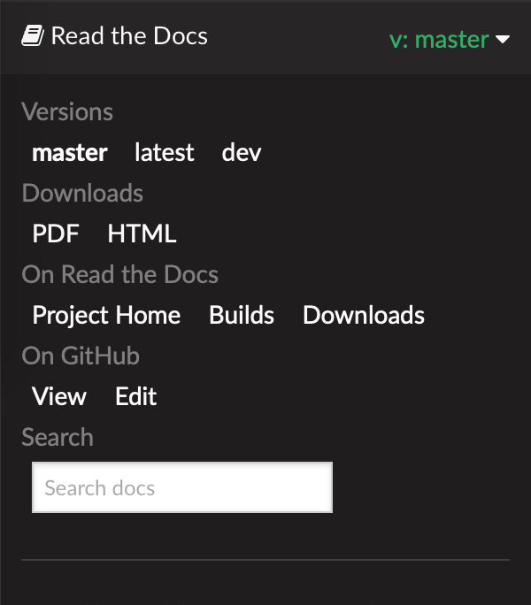

.. _this_doc:

This documentation
==================

OpenFAST documentation is hosted on
`readthedocs <http://readthedocs.org/>`_, and is automatically
generated from both the
`main <http://github.com/openfast/openfast/tree/main/>`_ and
`dev <http://github.com/openfast/openfast/tree/dev/>`_ branches whenever
new commits are added. Clicking on the bar on the lower left corner of the
page reveals a panel (see image below) containing options to select the branch
of the repository, download the documentation other formats (PFD, HTML, EPub),
and link to other relevant websites.

While OpenFAST developer documentation is being enhanced here, developers are
encouraged to consult the legacy FAST v8
`Programmer's Handbook <https://nwtc.nrel.gov/system/files/ProgrammingHandbook_Mod20130717.pdf>`_.
Instructions on obtaining and installing OpenFAST are available in
:ref:`installation`, and documentation for verifying an installation with the
automated tests is at :ref:`testing`.

The majority of this documentation is divided into two parts:

:ref:`user_guide`

   Directed towards end-users, this part provides detailed documentation
   regarding usage of the OpenFAST and its underlying modules,
   as well as theory and verification documentation.

:ref:`dev_guide`

   The developer guide is targeted towards users wishing to extend the
   functionality provided within OpenFAST. Here you will find details
   regarding the code structure, API supported by various classes, and links to
   source code documentation extracted using Doxygen.
