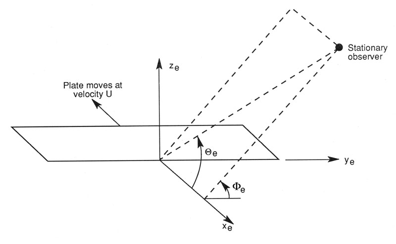

.. _AA-noise-models:

Aeroacoustics Noise Models
--------------------------

The aeroacoustics noise of wind turbine rotors emanates from pressure
oscillations that are generated along the blades and propagate in the
atmosphere. This source of noise has been historically simulated with models
characterized by different fidelity levels. At lower fidelity, models correlated
aeroacoustics noise with rotor thrust and torque
(:cite:`aa-Lowson:1970,aa-Viterna:1981`). At higher fidelity, three-dimensional
incompressible computational fluid dynamics models are coupled with the Ffowcs
Williams-Hawkings model to propagate pressure oscillations generated along the
surface of the rotor blades to the far field (:cite:`aa-Klein:2018`). The latter
models are often only suitable to estimate noise at low frequency because
capturing noise in the audible range, which is commonly defined between 20
(hertz) Hz and 20 kilohertz (kHz), requires a very fine space-time
discretization with enormous computational costs.

For the audible range, a variety of models is available in the public
domain, and :cite:`aa-Sucameli:2018` offers the most recent literature
review. These models have inputs that match the inputs and outputs of
modern aeroservoelastic solvers, such as OpenFAST, and have therefore
often been coupled together. Further, the computational costs of these
acoustic models are similar to the costs of modern aeroservoelastic
solvers, which has facilitated the coupling.

Models have targeted different noise generation mechanisms following the
distinction defined by :cite:`aa-Brooks:1989`, and the
mechanism of turbulent inflow noise. The latter represents a broadband
noise source that is generated when a body of arbitrary shape
experiences an unsteady lift because of the presence of an incident
turbulent flow. For an airfoil, this phenomenon can be interpreted as
leading-edge noise. Turbulent inflow noise was the topic of multiple
investigations over the past decades and, as a result, multiple models
have been published (:cite:`aa-Sucameli:2018`). The BPM model includes five
mechanisms of noise generation for an airfoil immersed in a flow:

1. Turbulent boundary layer – trailing edge (TBL-TE)

2. Separation stall

3. Laminar boundary layer – vortex shedding

4. Tip vortex

5. Trailing-edge bluntness – vortex shedding.

For the five mechanisms, semiempirical models were initially defined for
the NACA 0012 airfoil. The BPM model is still a popular model for wind
turbine noise prediction, and subsequent studies have improved the model
by removing some of the assumptions originally adopted. Recent studies
have especially focused on the TBL-TE mechanism, which is commonly the
dominant noise source of modern wind turbines. As a result, each noise
source defined in the BPM model now has a variety of permutations.

The following subsections describe the details of each mechanism and the
models implemented in this model of OpenFAST.

.. _aa-turbinflow:

Turbulent Inflow
~~~~~~~~~~~~~~~~

A body of any arbitrary shape, when immersed in a turbulent flow,
generates surface pressure fluctuations. Over the years, several
formulations of the turbulent inflow noise model have been developed
(:cite:`aa-Sucameli:2018`). In this model of OpenFAST, the formulation
defined in :cite:`aa-MoriartyGuidatiMigliore:2004` is adopted. The formulation is based
on the model of Amiet (:cite:`aa-Amiet:1975,aa-Paterson:1976`) and is
presented in :numref:`aa-amiet`. Additionally, the user can activate the
correction defined by :cite:`aa-MoriartyHansen:2005`, which builds upon the
Amiet model and accounts for the thickness of the airfoils adopted along
the blade span. This second model is named Simplified Guidati and is
presented in :numref:`aa-guidati`.

.. _aa-amiet:

Amiet model
^^^^^^^^^^^

The formulation is based on work from :cite:`aa-Amiet:1975` and
:cite:`aa-Paterson:1976`, and it represents the blade as a
flat plate and neglects the shape of the airfoil.

The model starts by first computing the wave number, :math:`k_{1}`, for
a given frequency :math:`f`:

.. math::
   k_{1} = \frac{2\text{πf}}{U_{1}}
   :label:  aa-eq:1

where :math:`U_{1}` is the incident inflow velocity on the profile. From
:math:`k_{1}`, the wave numbers :math:`{\overline{k}}_{1}` and
:math:`{\widehat{k}}_{1}` are computed:

.. math::
   {\overline{k}}_{1} = \frac{k_{1}c_{i}}{2}
   :label:  aa-eq:2

.. math::
   {\widehat{k}}_{1} = \frac{k_{1}}{k_{e}}  
   :label:  aa-eq:3

where :math:`c_{i}` is the local chord, and :math:`k_{e}` is the wave
number range of energy containing eddies, defined as:

.. math::
   k_{e} = \frac{3}{4L_{t}}.
   :label:  aa-eq:4

L\ :sub:`t` is the turbulent length scale, and many different
formulations have been proposed over the years. As default
implementation, :math:`L_{t}` is defined following the formulation
proposed in :cite:`aa-Zhu:2005`:

.. math::
   L_{t} = 25z^{0.35}z_{0}^{- 0.063}
   :label:  aa-eq:5

where :math:`z` is the height above the ground of the leading edge of
section :math:`i` at a given instant, :math:`t`, while :math:`z_{0}` is
the surface roughness. Note that setting :math:`L_{t}` appropriately is
a challenge, and advanced users of this model may want to validate this
formulation against experimental data.

The value of sound pressure level (:math:`\text{SPL}`) is expressed in
one-third octave bands at the given frequency, :math:`f`, originated at
the given blade station, :math:`i`, which can be computed as:

.. math::
   \text{SPL}_{\text{TI}} = 10\log_{10}{\left( \rho^{2}c^{4}\frac{L_{t}d}{{2r}_{e}^{2}}M^{5}I_{1}^{2}
      \frac{{\widehat{k}}_{1}^{3}}{\left( 1 + {\widehat{k}}_{1}^{2} \right)^{\frac{7}{3}}}
      \overline{D} \right) +}78.4
   :label:  aa-eq:6

where :math:`\rho` is the air density, :math:`c` the speed of sound,
:math:`d` the blade element span, :math:`r_{e}` the effective distance
between leading edge and observer, :math:`M` the Mach number,
:math:`I_{1}` the turbulence intensity of the airfoil inflow, and
:math:`\overline{D}` the directivity term. :math:`\overline{D}` is
different below (:math:`{\overline{D}}_{l}`) and above
(:math:`{\overline{D}}_{h}`) a certain frequency, which is named
“cut-off” and defined as:

.. math::
   f_{\text{co}} = \frac{10U_{1}}{\pi c_{i}}.
   :label:  aa-eq:7

The formulations of :math:`{\overline{D}}_{h}\ `\ and
:math:`{\overline{D}}_{l}` are presented in :numref:`aa-directivity`.

The current implementation offers two approaches to estimate
:math:`I_{1}`. The first one is through a user-defined grid of
:math:`I_{1}`; see :numref:`aa-sec-TIgrid`. The second option is to have the code
reconstructing :math:`I_{1}` from the turbulent wind grid, where the
code computes the airfoil relative position of each blade section,
:math:`i`, at every time instant and, given the rotor speed,
reconstructs the inflow component, :math:`I_{1}`, of the turbulence
intensity.

Two corrections to this model are also implemented. The first one
comprises a correction for the angle of attack, :math:`\alpha`, in which
the effect is neglected in the original formulation from :cite:`aa-Amiet:1975`
and Amiet and Peterson (1976). This correction is formulated as:

.. math::
   \text{SPL}_{\text{TI}} = \text{SPL}_{\text{TI}} + 10\log_{10}{\left( 1 + 9a^{2} \right).}
   :label:  aa-eq:8

The second correction is called low-frequency correction
(:math:`\text{LFC}`), and is formulated as:

.. math::
   S^{2} = \left( \frac{2\pi{\overline{k}}_{1}}{\beta^{2}}
      + \left( 1 + 2.4\frac{{\overline{k}}_{1}}{\beta^{2}} \right)^{- 1} \right)^{- 1}
   :label:  aa-eq:9
.. math::
   LFC = 10S^{2}M{\overline{k}}_{1}^{2}\beta^{- 2}   
   :label:  aa-eq:10
.. math::
   \text{SPL}_{\text{TI}} = \text{SPL}_{\text{TI}} + 10\log_{10}\left( \frac{\text{LFC}}{1 + LFC} \right).       
   :label:  aa-eq:11

In :eq:`aa-eq:9` and :eq:`aa-eq:10`, :math:`S^{2}` represents the squared Sears
function, and :math:`\beta^{2}` is the Prandtl-Glauert correction
factor, which is defined as:

.. math::
   \beta^{2} = 1 - M^{2}.
   :label:  aa-eq:12

It is worth stressing that numerous alternative formulations of the
turbulent inflow noise model exist (:cite:`aa-Sucameli:2018`), where the
main differences comprise different definitions of :math:`L_{t}` and
:math:`k_{1}`.

.. _aa-guidati:

Simplified Guidati
^^^^^^^^^^^^^^^^^^

Sound spectra are often overpredicted by the Amiet model implemented here.
Guidatai (:cite:`aa-Guidati:1997`) derived a correction to the sound pressure
levels by adding a term considering shape and camber of the airfoil profiles,
but the method proved computationally too expensive for wind turbine
simulations. Moriarty et al. (:cite:`aa-MoriartyGuidatiMigliore:2005`) proposed
a simplified model based on geometric characteristics of six wind turbine
airfoils. The validity of the correction is limited to Mach numbers on the order
of 0.1 ≈ 0.2 and Strouhal number :math:`\text{St}` below 75.  :math:`\text{St}`
is defined based on airfoil chord and mean inflow velocity:

.. math::
   St = \frac{fc_{i}}{U_{1}}.
   :label:  aa-eq:13

The formula for the correction to the noise spectra is provided in Eq. 4
in :cite:`aa-MoriartyGuidatiMigliore:2005`:

.. math::
   t = t_{1\%} + t_{10\%}                            
   :label:  aa-eq:14
.. math::
   {\mathrm{\Delta}SPL}_{\text{TI}} = -\left( 1.123t + 5.317t^{2} \right)\left( 2\pi St + 5 \right)
   :label:  aa-eq:15

where :math:`t_{x\%}` is the relative thickness of the profile at
:math:`x` position along the chord (i.e., 0% being the leading edge and
100% the trailing edge).

It should be highlighted here that a validation campaign was conducted in a wind
tunnel on two-dimensional airfoils (:cite:`aa-MoriartyGuidatiMigliore:2004`),
returning a fairly poor match between the Simplified Guidati model and the
experimental results. Therefore, a correction of +10 decibels (dB) on the SPL
levels across the whole frequency spectrum was proposed. This correction is
still implemented, but a validation at turbine level should assess the accuracy
of the models for turbulent inflow. It should also be noted that the code
currently does not check whether Mach and Strouhal numbers are within the range
of validity of this model.

.. _aa-turb-TE:

Turbulent Boundary Layer – Trailing Edge
~~~~~~~~~~~~~~~~~~~~~~~~~~~~~~~~~~~~~~~~

Airfoils immersed in a flow develop a boundary layer, which at high
Reynolds numbers is turbulent. When the turbulence passes over the
trailing edge, noise is generated. This noise source was named TBL-TE in
:cite:`aa-Brooks:1989` and it is a relevant source of aeroacoustics noise
for modern wind turbine rotors. Two formulations of TBL-TE noise are
implemented in the code: (1) the original formulation from the BPM
model, described in :numref:`aa-amiet`, and (2) a more recent model developed
at the Dutch research institute, TNO, described in :numref:`aa-guidati`. Both
models take as input the characteristics of the airfoil boundary layer.
These must be provided by the user and are discussed in :numref:`aa-sec-BLinputs`.

.. _aa-turb-TE-bpm:

BPM
^^^

The :math:`\text{SPL}` of the TBL-TE noise in the BPM model is made from
three contributions:

.. math::
   \text{SPL}_{TBL - TE} = 10\log_{10}\left( 10^{\frac{\text{SPL}_{p}}{10}}
      + 10^{\frac{\text{SPL}_{s}}{10}} + 10^{\frac{\text{SPL}_{\alpha}}{10}} \right)
   :label:  aa-eq:16

where the subscripts :sub:`p`, :sub:`s`, and :sub:`α` refer to the
contributions of pressure side, suction side, and angle of attack,
respectively. The equations describing the three contributions are
described in great detail in Section 5.1.2, in :cite:`aa-Brooks:1989`, and
are summarized here.

For the suction and pressure contributions, the equations are:

.. math::
   \text{SPL}_{p} = 10\log_{10}\left( \frac{\delta_{p}^{*}M^{5}d{\overline{D}}_{h}}{r_{e}^{2}} \right) 
      + A\left( \frac{\text{St}_{p}}{\text{St}_{1}}\right) + \left( K_{1} - 3 \right) + {\mathrm{\Delta}K}_{1}
   :label:  aa-eq:17
.. math::
   \text{SPL}_{s} = 10\log_{10}\left( \frac{\delta_{s}^{*}M^{5}d{\overline{D}}_{h}}{r_{e}^{2}} \right)
      + A\left( \frac{\text{St}_{s}}{\text{St}_{1}} \right) + \left( K_{1} - 3 \right).
   :label:  aa-eq:18

The terms in the equations, which are also described in the nomenclature
at the beginning of this document, list :math:`\delta^{*}` as the
boundary layer displacement thickness on either side of the airfoil,
:math:`St,` as the Strouhal number based on :math:`\delta^{*}`, and
:math:`A`, :math:`A'`, :math:`B`, :math:`{\Delta K}_{1}`, :math:`K_{1}`,
and :math:`K_{2}` as empirical functions based on :math:`\text{St}`.

For the angle-of-attack contribution, a distinction is made above and
below the stall angle, which in the original BPM model is set equal to
12.5 degrees, whereas it is here assumed to be the actual stall angle of
attack of the airfoil at blade station i. Below stall,
:math:`\text{SPL}_{\alpha}` is equal to:

.. math::
   \text{SPL}_{\alpha} = 10\log_{10}\left( \frac{\delta_{s}^{*}M^{5}d{\overline{D}}_{h}}{r_{e}^{2}} \right)
      + B\left( \frac{\text{St}_{s}}{\text{St}_{2}} \right) + K_{2}.
   :label:  aa-eq:19

At angles of attack above the stall point, the flow along the profile is
fully separated and noise radiates from the whole
chord.\ :math:`\ \text{SPL}_{p}` and :math:`\text{SPL}_{s}` are then set
equal to -∞, whereas :math:`\text{SPL}_{\alpha}` becomes:

.. math::
   \text{SPL}_{\alpha} = 10\log_{10}\left( \frac{\delta_{s}^{*}M^{5}d{\overline{D}}_{l}}{r_{e}^{2}} \right)
      + A'\left( \frac{\text{St}_{s}}{\text{St}_{2}} \right) + K_{2.}
   :label:  aa-eq:20

Notably, above stall the low-frequency directivity :math:`{\overline{D}}_{l}` is adopted in Eqs. 18 and 19 (see
:numref:`aa-directivity`).

.. _aa-turb-TE-tno:

TNO model
^^^^^^^^^

The TNO model is a more recent model to simulate the noise emitted by
the vortices shed at the trailing edge of the blades and was formulated
by Parchen (:cite:`aa-Parchen:1998`). The implementation adopted here is the one described
in Moriarty et al. (2005). The TNO model uses the spectrum of the wave
number, :math:`\overline{k}`, of unsteady surface pressures to estimate
the far-field noise. The spectrum, :math:`P`, is assumed to be:

.. math::
   P\left( k_{1},k_{3},\omega \right) = 4\rho_{0}^{2}\frac{k_{1}^{2}}{k_{1}^{2}
   + k_{3}^{2}}\int_{0}^{10\frac{\omega}{Mc}}{L_{2}\overline{u_{2}^{2}}
   \left( \frac{\partial U_{1}}{\partial x_{2}} \right)^{2}
   \phi_{22}\left( k_{1},k_{3},\omega \right)} \\
   \phi_{m}\left( \omega - U_{c}\left( x_{2} \right)k_{1} \right)
   e^{\left( - 2\left| \overline{k} \right|x_{2} \right)}dx_{2}.
   :label:  aa-eq:21

In the equation, the indices 1, 2, and 3 refer to the directions
parallel to the airfoil chord, normal to the airfoil chord, and along
span, respectively; :math:`\phi_{22}` is the vertical velocity
fluctuation spectrum; :math:`\phi_{m}` is the moving axis spectrum; and
:math:`U_{c}` is the convection velocity of the eddies along the
trailing edge. Lastly, :math:`L_{2}` is the vertical correlation length,
perpendicular to the chord length, which indicates the vertical
extension of the vortices that convect over the trailing edge. In this
work, :math:`L_{2}` is assumed equal to the mixing length, :math:`L_{m}`
(Moriarty et al. 2005). This decision is partially arbitrary, and
dedicated research should better assess the correct integral length to
be adopted within the TNO model.

From :math:`P`, the far-field spectrum, :math:`S\left( \omega \right)`,
is computed as:

.. math::
   S\left( \omega \right) = \frac{d{\overline{D}}_{h}}{4\pi r_{e}^{2}}\int_{0}^{\delta}
   {\frac{\omega}{ck_{1}}P\left( k_{1},0,\omega \right)}\text{dk}_{1}.
   :label:  aa-eq:22

The implementation of the TNO model is identical to the one described in
:cite:`aa-MoriartyGuidatiMigliore:2005`. The inputs to the model are generated from the
boundary layer characteristics provided by the user (see :numref:`aa-sec-BLinputs`).

.. _aa-laminar-vortex:

Laminar Boundary Layer – Vortex Shedding
~~~~~~~~~~~~~~~~~~~~~~~~~~~~~~~~~~~~~~~~

Another source of airfoil self-noise noise included in the BPM model is
the noise generated by a feedback loop between vortices being shed at
the trailing edge and instability waves in the laminar boundary layer.
This noise is typically distributed on a narrow band of frequencies and
occurs when the boundary layer of the airfoil remains laminar. This may
occur in the inboard region of smaller wind turbines, where the Reynolds
number can be smaller than 1 million, but hardly occurs in modern rotors
that operate at a Reynolds number one order of magnitude larger. The
formula to estimate the noise spectrum in a one-third-octave
presentation is:

.. math::
   \text{SPL}_{LBL - VS} = 10\log_{10}{
      \left( \frac{\delta_{p}M^{5}d{\overline{D}}_{h}}{r_{e}^{2}} \right)
      + G_{1}\left( \frac{St'}{{St'}_{\text{peak}}} \right) \\
      + G_{2}\left\lbrack \frac{\text{Re}_{c}}{\left( \text{Re}_{c} \right)_{0}} \right\rbrack
      + G_{3}\left( \alpha_{*} \right)}
   :label:  aa-eq:23

where :math:`G` represents empirical functions,
:math:`{St'}_{\text{peak}}` is the peak Strouhal number function of
:math:`\text{Re}_{c}`, which is the Reynolds number at chord,
:math:`c_{i}`. The subscript :sub:`0` refers to a reference Reynolds
number that is a function of the angle of attack (Brooks et al. 1989).

.. _aa-tip-vortex:

Tip Vortex
~~~~~~~~~~

The vortices generated at blade tips are another source of noise of the
BPM model. Although rarely relevant in modern wind turbines, the
possibility to include this noise source is offered. The sound pressure
level is estimated as:

.. math::
   \text{SPL}_{\text{Tip}} = 10\log_{10}{\left(
      \frac{M^{2}M_{\max}^{2}l^{2}{\overline{D}}_{h}}{r_{e}^{2}} \right)
      - 30.5\left( \log_{10}{St^{''}} + 0.3 \right)^{2} + 126}
   :label:  aa-eq:24

where :math:`M_{\max}\  = \ M_{\max}\left( \alpha_{\text{tip}} \right)`
is the maximum Mach number, measured near the blade tip within the
separated flow region that is assumed to depend on
:math:`\alpha_{\text{tip}}`, which is the angle of attack at the tip;
:math:`l` is the spanwise extent of the separation zone; and
:math:`St'''` is the Strouhal number based on :math:`l`. For a round
shape of the tip, :math:`l` is estimated as:

.. math::
   l = c_{i}0.008\alpha_{\text{tip}}
   :label:  aa-eq:25

where :math:`\alpha_{\text{tip}}` is the angle of attack of the tip
region to the incoming flow. For a square tip, the BPM model estimates
:math:`l` based on the quantity, :math:`{\alpha'}_{\text{tip}}`, which
is defined as:

.. math::
   \left. \ {\alpha^{'}}_{\text{tip}} = \left\lbrack \left(
      \frac{\frac{\partial L'}{\partial y}}{\left(
         \frac{\partial L'}{\partial y} \right)_{\text{ref}}}
      \right)_{y\rightarrow tip}
         \right\rbrack \right.\ \alpha_{\text{tip}}
   :label:  aa-eq:26

where :math:`L'` is the lift per unit span along the blade at position
:math:`y`. For :math:`{\alpha'}_{\text{tip}}` between 0 and 2 degrees,
:math:`l` becomes:

.. math::
   l = c_{i}\left( 0.0230 + 0.0169{\alpha^{'}}_{\text{tip}} \right),
   :label:  aa-eq:27

while for :math:`{\alpha'}_{\text{tip}}` larger than 2 degrees,
:math:`l` is:

.. math::
   l = c_{i}\left( 0.0378 + 0.0095{\alpha^{'}}_{\text{tip}} \right).
   :label:  aa-eq:28

However, it must be noted that, unfortunately,
:math:`\alpha_{\text{tip}}` is not a reliable output of standard
aeroelastic models and the impossibility to accurately determine
:math:`\alpha_{\text{tip}}` weakens the formulation of the tip vortex
noise.

.. _aa-TE-vortex:

Trailing-Edge Bluntness – Vortex Shedding
~~~~~~~~~~~~~~~~~~~~~~~~~~~~~~~~~~~~~~~~~

Lastly, wind turbine blades are often characterized by a finite height of the
trailing edge, which generates noise as a result of vortex shedding. The
frequency and amplitude of this noise source depends on the geometry of the
trailing edge and is typically characterized by a tonal nature. Adopting
flatback and truncated airfoils far outboard along the blade may strengthen this
noise source. When this noise source is activated, the user is asked to provide
the distribution along the blade span of the blunt thickness of the trailing
edge, :math:`h`, and the solid angle between the suction and pressure sides of
the airfoil, :math:`\Psi` (see :numref:`aa-turb-TE`). :math:`h` and
:math:`\Psi` are inputs to the equation:

.. math::
   \text{SPL}_{TEB - VS} = 10\log_{10}{
      \left( \frac{\delta_{p}^{*}M^{5}d{\overline{D}}_{h}}{r_{e}^{2}} \right)
      + G_{4}\left( \frac{h}{\delta_{\text{avg}}^{*}},\Psi \right) \\
      + G_{5}\left( \frac{h}{\delta_{\text{avg}}^{*}},\Psi,
         \frac{St''}{{St''}_{\text{peak}}} \right)}.
   :label:  aa-eq:29

In the equation, :math:`\delta_{\text{avg}}^{*}` is the average
displacement thickness for both sides of the airfoil. Note that this
noise source is very sensitive to :math:`h` and :math:`\Psi`, which,
therefore, should be estimated accurately.

.. _aa-directivity:

Directivity
~~~~~~~~~~~

The position of one or more observers is specified by the user, as described in
:numref:`aa-sec-ObsPos`. The directivity from the BPM model is adopted in this
implementation (:cite:`aa-Brooks:1989`). The directivity term,
:math:`\overline{D}`, corrects the :math:`\text{SPL}` depending on the relative
position of the observer to the emitter. The position is described by the
spanwise directivity angle, :math:`\Phi_{e}`, and by the chordwise directivity
angle, :math:`\Theta_{e}`, which are schematically represented in
:numref:`aa-fig:directivity` and defined as:

.. math::
   \Phi_{e} = \text{atan}\left( \frac{z_{e}}{y_{e}} \right)
   :label:  aa-eq:30
.. math::
   \Theta_{e} = \text{atan}\left( \frac{y_{e} \bullet \cos\left( \Phi_{e} \right)
      + z_{e} \bullet \sin\left( \Phi_{e} \right)}{x_{e}} \right)
   :label:  aa-eq:31

   Angles used in the directivity function (:cite:`aa-Brooks:1989,aa-MoriartyMigliore:2003`)

The reference axis is located at each blade node and :math:`x_{e}` is aligned
with the chord, :math:`y_{e}` is aligned with the span pointing to the blade
tip, and :math:`z_{e}` is aligned toward the airfoil suction side. Note that in
OpenFAST the local airfoil-oriented reference system is used, and a rotation is
applied.

Given the angles :math:`\Theta_{e}` and :math:`\Phi_{e}`, at high frequency,
:math:`\overline{D}` for the trailing edge takes the expression:

.. math::
   {\overline{D}}_{h-TE}\left( \Theta_{e},\Phi_{e} \right) = \frac{
      2\sin^{2}\left( \frac{\Theta_{e}}{2} \right)\sin^{2}\Phi_{e}}
      {\left( 1 + M\cos\Theta_{e} \right)
         \left( 1 + \left( M - M_{c} \right)
         \cos\Theta_{e} \right)^{2}}
   :label:  aa-eq:32

where :math:`M_{c}` represents the Mach number past the trailing edge
and that is here for simplicity assumed equal to 80% of free-stream M. 

For the leading edge, and therefore for the turbulent inflow noise model,
at high frequency, :math:`\overline{D}` is:

.. math::
   {\overline{D}}_{h-LE}\left( \Theta_{e},\Phi_{e} \right) = \frac{
      2\cos^{2}\left( \frac{\Theta_{e}}{2} \right)\sin^{2}\Phi_{e}}
      {\left( 1 + M\cos\Theta_{e} \right)^{3}}
   :label:  aa-eq:33

Note that this equation was not reported in the NREL Tech Report NREL/TP-5000-75731!

At low frequency, the equation is identical for both leading and trailing edges:

.. math::
   {\overline{D}}_{l}\left( \Theta_{e},\Phi_{e} \right) =
      \frac{\sin^{2}\left. \ \Theta_{e} \right.\ \sin^{2}\Phi_{e}}
      {\left( 1 + M\cos\Theta_{e} \right)^{4}}.
   :label:  aa-eq:34

Each model distinguishes a different value between low and high
frequency. For the TI noise model, the shift between low and high
frequency is defined based on :math:`{\overline{k}}_{1}`. For the TBL-TE
noise, the model differences instead shift between below and above
stall, where\ :math:`\ {\overline{D}}_{h}`\ and
:math:`{\overline{D}}_{l}` are used, respectively.

.. _aa-A-weighting:

A-Weighting
~~~~~~~~~~~

The code offers the possibility to weigh the aeroacoustics outputs by
A-weighting, which is an experimental coefficient that aims to take into
account the sensitivity of human hearing to different frequencies. 
The A-weight, :math:`A_{w}`, is computed as:

.. math::
   A_{w} = \frac{10\log\left( 1.562339\frac{f^{4}}
         {\left( f^{2} + {107.65265}^{2} \right)
            \left( f^{2} + {737.86223}^{2} \right)}
         \right)}{\log 10}\qquad\qquad\\
      + \frac{10\log\left( 2.422881e16\frac{f^{4}}
         {\left( f^{2} + {20.598997}^{2} \right)^{2}
            \left( f^{2} + {12194.22}^{2} \right)^{2}} \right)}
         {\log 10}
   :label:  aa-eq:35

The A-weighting is a function of frequency and is added to the values of
sound pressure levels:

.. math::
   SPL_{A_{w}} = SPL + A_{w} 
   :label:  aa-eq:36

