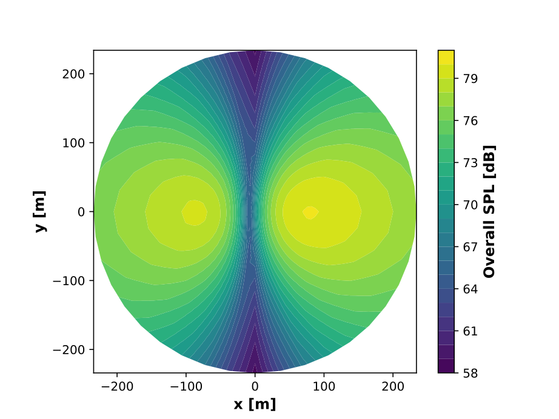
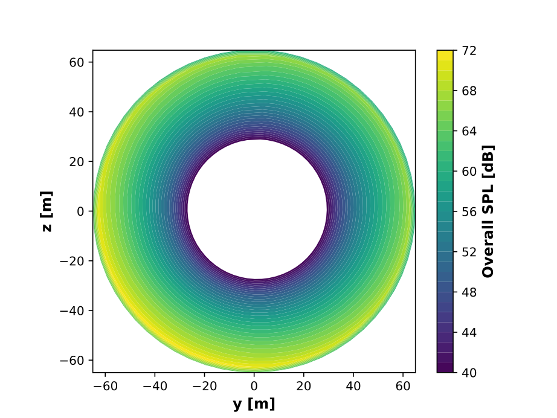

.. _AA-model-verification:

Model Verification
------------------

Reference Wind Turbine
~~~~~~~~~~~~~~~~~~~~~~

The noise model of OpenFAST is exercised by simulating the aeroacoustics noise
emissions of the IEA Wind Task 37 land-based reference wind turbine
(:cite:`aa-Bortolotti:2019`). The main characteristics of the reference wind
turbine are presented in :numref:`tab:ref-turb`.

.. table:: Main Characteristics of the IEA Wind Task 37 Land-Based Reference Wind Turbine
   :name: tab:ref-turb

   +------------------+---------------------+------------------+-------------------+
   | **Data**         | **Value**           | **Data**         | **Value**         |
   +==================+=====================+==================+===================+
   | Wind class       | | International     | | Rated          | 3.37 megawatts    |
   |                  | | Electrotechnical  |   electrical     |                   |
   |                  | | Commision 3A      | | power          |                   |
   +------------------+---------------------+------------------+-------------------+
   | | Rated          | 3.6 megawatts       | | Drivetrain &   | 93.60%            |
   |   aerodynamic    |                     | | generator      |                   |
   | | power          |                     |   efficiency     |                   |
   +------------------+---------------------+------------------+-------------------+
   | Rotor diameter   | 130 meters          | Hub height       | 110 meters        |
   +------------------+---------------------+------------------+-------------------+
   | Cut-in wind      | 4                   | Cut-out wind     | 25                |
   | speed            | meters/second       | speed            | meters/second     |
   +------------------+---------------------+------------------+-------------------+
   | Rotor cone       | 3 degrees           | Nacelle tilt     | 5 degrees         |
   | angle            |                     | angle            |                   |
   +------------------+---------------------+------------------+-------------------+
   | Max blade tip    | 80                  | | Rated          | 8.16              |
   | speed            | meters/second       |   tip-speed      |                   |
   |                  |                     | | ratio          |                   |
   +------------------+---------------------+------------------+-------------------+
   | | Maximum        | 0.481               | Rated rotor      | | 11.75           |
   | | aerodynamic Cp |                     | speed            |   revolutions per |
   |                  |                     |                  | | minute          |
   +------------------+---------------------+------------------+-------------------+

The OpenFAST model of the wind turbine is available at
https://github.com/OpenFAST/r-test and is optionally coupled to the
Reference OpenSource Controller. [2]_

Code-to-Code Comparison
~~~~~~~~~~~~~~~~~~~~~~~

A detailed code-to-code comparison was conducted to verify the implementation of
the noise models linked to OpenFAST with the implementation available at the
Wind Energy Institute of the Technical University of Munich, Germany. The latter
is described in Sucameli (:cite:`aa-Sucameli:2018`) and is implemented in the wind
turbine design framework Cp-Max, which adopts the multibody-based
aeroservoelastic solver Cp-Lambda.

The comparison is conducted for the main noise sources—turbulent inflow and the
TBL-TE noise—for both the single airfoil profile and full turbine. This helped
resolve a few implementation mistakes and small inconsistencies. The comparison
is performed with a steady wind of 8 meters per second (m/s), no shear, a rated
pitch angle of 1.17 degrees (deg), and a fixed rotor speed of 10.04 revolutions
per minute (rpm). A fixed value of 0.1 is assumed for the incident turbulent
intensity, :math:`I_{1}`.

:numref:`aa-fig:TI-compare` shows the predictions in terms of SPL for the Amiet
model with the angle-of-attack correction from OpenFAST, the Simplified Guidati
model generated by OpenFAST, and the Amiet model from Cp-Max.

   Code-to-code comparison for the TI models

The two implementations of the turbulent inflow Amiet model return a perfect
match between OpenFAST and Cp-Max. The chosen scenario sees the blade operating
at optimal angles of attack and, therefore, the effect of the angle of attack
correction is negligible. The plots also show the great difference between the
Amiet model and the Simplified Guidati model. It may be useful to keep in mind
that the Simplified Guidati model has, in the past, been corrected with a factor
of +10 dB, which is applied here.

For the same inflow and rotor conditions, the BPM and TNO TBL-TE noise models
are compared in :numref:`aa-fig:BPM-TNO-compare`. The match is again satisfactory,
although slightly larger differences emerge that are attributed to differences
in the angles of attack between the two aeroelastic solvers and in different
integration schemes in the TNO formulations.

   Code-to-code comparison for the BPM and TNO TBL-TE models. The
   boundary layer properties are estimated from either the BPM model (BPM
   BL) or defined by the user (Ext BL)

The last comparison looked at the directivity models and the overall sound
pressure levels at various observer locations. Simulations are run distributing
200 observers in a horizontal square of 500 meters (m) by 500 m (see
:numref:`aa-fig:obs-loc`). The noise is computed from the Amiet and the BPM turbulent boundary layer-trailing edge models. 
The code-to-code comparison returns similar predictions
between OpenFAST and Cp-Max. The comparison is shown in :numref:`aa-fig:SPL-obs`.

The main conclusion of this code-to-code comparison is that, to the best of
authors’ knowledge, the models are now implemented correctly and generate
similar SPL and overall SPL levels for any arbitrary observer.  Nonetheless, it
is clear that all of the presented models are imperfect, and improvements could
be made both at the theoretical implementation levels.

   Location and numbering of the observers

   Comparison of overall sound pressure levels for the observers
   distributed, as shown in the previous figure 

.. _aa-sec-ModelUsage:

Model Usage
~~~~~~~~~~~

The aeroacoustics model of OpenFAST has four options for the outputs:

1. Overall sound pressure level (dB/A-weighted decibels [dBA])—one value
   per time step per observer is generated

2. Total sound pressure level spectra (dB/dBA)—one spectrum per time
   step per observer is generated between 10 Hz and 20 kHz

3. Mechanism-dependent sound pressure level spectra (dB/dBA)—one
   spectrum per active noise mechanism per time step per observer is
   generated between 10 Hz and 20 kHz.

4. Overall sound pressure level (dB/A-weighted decibels [dBA])—one value per blade per node per time step per observer is generated

The overall SPL from the first option can be used to plot directivity maps of the noise. An example,
which was generated using a Python script, [3]_ is shown in
:numref:`aa-fig:SPL-map`. The noise map, which shows the overall SPL averaged over
1 rotor revolution, is generated for a steady wind speed of 8 m/s, a fixed rotor
speed of 10.04 rpm, and a 1.17-deg pitch angle. In a horizontal circle of 500 m
in diameter, 1681 observers are placed at a 2-m height.  Only the Simplified
Guidati and the BPM TBL-TE noise models are activated.

   Map of the overall SPL of the reference wind turbine at a 2-m height from
   Simplified Guidati and BPM TBL-TE noise models. The wind turbine is located
   at x=0, y=0. A steady wind of 8 m/s blows from left (-x) to right (+x).

The second output can be used to generate SPL spectra. These spectra can be
computed for various observers and optionally A-weighted to account for human
hearing. :numref:`aa-fig:A-SPL` shows the total SPL spectra computed for the same
rotor conditions of the previous example. The A-weight greatly reduces the curve
at frequency below 1,000 Hz while slightly increasing those between 1 kHz and 8
kHz.

   Comparison between absolute and A-weighted SPL

The third output distinguishes the SPL spectrum per mechanism.
:numref:`aa-fig:SPL-spectra` shows the various SPL spectra estimated by each noise
model for the same rotor conditions reported earlier. The total spectrum is
visibly dominated by the turbulent inflow, TBL-TE, and trailing-edge bluntness
noise mechanisms. Notably, the latter is extremely sensitive to its inputs,
:math:`\Psi` and :math:`h`. The reference wind turbine is a purely numerical
model, and these quantities have been arbitrarily set. Users should pay
attention to these inputs when calling the trailing-edge bluntness model.
Consistent with literature, the laminar boundary layer-vortex shedding and tip
vortex noise mechanisms have negative dB values and are, therefore, not visible.
Notably, these spectra are not A-weighted, but users can activate the flag and
obtain A-weighted spectra.

   Nonweighted SPL spectra of the various noise mechanisms

Finally, the fourth output can be used to visualize the noise emission across the rotor. 
:numref:`aa-fig:rotor-map` shows the noise generation of the rotor as seen from an observer located 175 meters 
downwind at a height of 2 meters. The map is generated by plotting the overall SPL generated 
by one blade during one rotor revolution. The plot shows that higher noise is observed 
when the blade is descending (the rotor from behind is seen rotating counterclockwise). 
This effect, which matches the results shown in :cite:`aa-MoriartyMigliore:2003`, 
is explained by the asymmetry of :eq:`aa-eq:31`. Noise is indeed higher when the observer 
faces the leading edge of an airfoil (high :math:`\Theta_e`), than when it faces the
trailing edge (low :math:`\Theta_e`).

   Map of the overall SPL of the rotor of the reference wind turbine
   from Simplified Guidati and BPM TBL-TE noise models. The observer
   is located 175 meters downwind at a height of 2 meters.

.. [2]
   https://github.com/NREL/ROSCO

.. [3]
   https://github.com/OpenFAST/python-toolbox

