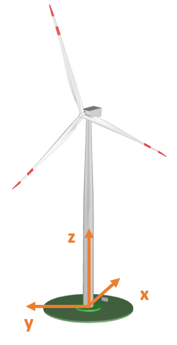

.. _AA-usage:

Using the Aeroacoustics Model in AeroDyn
----------------------------------------

A live version of this documentation is available at
https://openfast.readthedocs.io/. To run the aeroacoustics model, the
flag CompAA needs to be set to True at line 13 of the AeroDyn15 main
input file in the inputs block General Options. When the flag is set to
True, the following line must include the name of the file containing
the inputs to the aeroacoustics model, which is discussed in Appendix
A.2.

------- AERODYN v15.03.\* INPUT FILE
------------------------------------------------

IEA Wind Task 37 land-based reference wind turbine

====== General Options
===================================================

False Echo - Echo the input to "<rootname>.AD.ech"? (flag)

"default" DT_AA - Time interval for aerodynamic calculations {or
"default"} (s)

1 WakeMod - Type of wake/induction model (switch) {0=none, 1=BEMT}

2 AFAeroMod - Type of blade airfoil aerodynamics model (switch

0 TwrPotent - Type tower influence on wind around the tower (switch)

False TwrShadow - Calculate tower influence on wind (flag)

False TwrAero - Calculate tower aerodynamic loads? (flag)

False FrozenWake - Assume frozen wake during linearization? (flag

False CavitCheck - Perform cavitation check? (flag)

True CompAA - Flag to compute AeroAcoustics calculation

"AeroAcousticsInput.dat" AA_InputFile

====== Environmental Conditions
==========================================

1.225. AirDens - Air density (kg/m^3)

File continues...

1. Main Input File

The aeroacoustics main input file comprises a series of inputs and flags
that should be set appropriately depending on the analysis that should
be run. These are split into the subfields General Options,
Aeroacoustics Models, Observer Input, and Outputs.

Starting from the General Options, these are:

-  Echo – True/False: option to rewrite the input file with the correct
   template

-  DT_AA – Float: time step of the aeroacoustics computations. Only
   multiples of the time step DTAero of AeroDyn can be used. If set to
   default, the time step DTAero is adopted.

-  AAStart – Float: time step when the aeroacoustics model starts.

-  BldPrcnt – Float: percentage value of blade span measured from blade
   tip that contributes to the noise emissions; 100% corresponds to the
   entire blade from tip to root.

The field Aeroacoustics Models lists all the flags for the actual noise
models:

-  TIMod – Integer 0/1/2: flag to set the turbulent inflow noise model;
   0 turns it off, 1 corresponds to the Amiet model discussed in Section
   2.1.1, and 2 corresponds to the Simplified Guidati model presented in
   Section 2.1.2.

-  TICalcMeth – Integer 1/2: flag to set the calculation method for the
   turbulence intensity. When set to 1, turbulence intensity is
   reconstructed from a user-defined grid; see Appendix A.4. When set to
   2, turbulence intensity is estimated from the time history of the
   incident flow.

-  TICalcTabFile – String: name of the text file with the user-defined
   turbulence intensity grid; see Appendix A.4.

-  SurfRoughness – Float: value of :math:`z_{0}` used to estimate
   :math:`L_{t}` in the Amiet model.

-  TBLTEMod – Integer 0/1/2: flag to set the TBL-TE noise model; 0 turns
   off the model, 1 uses the Brooks-Pope-Marcolini (BPM) airfoil noise
   model (see Section 2.2.1), and 2 uses the TNO model described in
   Section 2.2.2.

-  BLMod – Integer 1/2: flag to set the calculation method for the
   boundary layer characteristics; 1 uses the simplified equations from
   the BPM model, 2 loads the files as described in Appendix A.2. Only
   used if TBLTEMod is different than zero.

-  TripMod – Integer 0/1/2: if BLMod is set to 1, different
   semiempirical parameters are used for a nontripped boundary layer
   (TRipMod=0), heavily tripped boundary layer (TRipMod=1), or lightly
   tripped boundary layer (TRipMod=2); 2 is typically used for
   operational wind turbines, whereas 1 is often used for wind tunnel
   airfoil models.

-  LamMod – Integer 0/1: flag to activate the laminar boundary layer –
   vortex shedding model, presented in Section 2.3.

-  TipMod – Integer 0/1: flag to activate the tip vortex model,
   presented in Section 2.4.

-  RoundedTip – True/False: if TipMod=1, this flag switches between a
   round tip (True) and a square tip (False), see Section 2.4.

-  Alprat – Float: value of the slope of the lift coefficient curve at
   blade tip; see Section 2.4.

-  BluntMod – Integer 0/1: flag to activate (BluntMod=1) the
   trailing-edge bluntness – vortex shedding model, see Section 2.5. If
   the flag is set to 1, the trailing-edge geometry must be specified in
   the file(s) listed in the field Blade Properties.

Next, the field Blade Properties lists three file names, often but not
necessarily identical, which contain the distributed properties
describing the detailed geometry of the trailing edge. These are
described in Appendix A.5.

The field Observer Locations contains the path to the file where the
number of observers (NrObsLoc) and the respective locations are
specified; see Appendix A.3.

Finally, the set Outputs contains a few options for the output data:

-  AWeighting – True/False: flag to set whether the sound pressure
   levels are reported with (True) or without (False) the A-weighting
   correction; see Section 3.3.

-  NAAOutFile – Integer 1/2/3: flag to set the desired output file. When
   set to 1, a value of overall sound pressure level at every DT_AA time
   step per observer is printed to file. When set to 2, the first output
   is accompanied by a second file where the total sound pressure level
   spectrum is printed per time step per observer. Finally, when set to
   3, the two first outputs are accompanied by a third file where the
   sound pressure level spectrum per noise mechanism is printed per time
   step per observer.

-  The following line contains the file name used to store the outputs.
   The file name is attached with a 1, 2, and 3 flag based on the
   NAAOutFile options.

The file must be closed by an END command.

------- AeroAcoustics Model v1.00.\* INPUT FILE
------------------------------------------------

Row for Turbine Name and characteristics.

====== General Options
============================================================================

False Echo - Echo the input to "<rootname>.AD.ech"? (flag)

"default" DT_AA - Time interval for AA calculations (s), must be a
multiple of DT_Aero (or "default")

0 AAStart - Time step after which the AeroAcoustics model is run
(integer)

70 BldPrcnt - Percentage of the span, starting from blade tip, that
contributes to noise levels. (float)

====== Aeroacoustics Models
================================================

2 TIMod - Turbulent Inflow noise model {0: none, 1: Amiet 2: Amiet +
Simplified Guidati} (switch)

1 TICalcMeth - Method to estimate turbulence intensity incident to the
profile {1: given table, 2: computed on the fly} (switch) [Only used if
TIMod!=0]

"TIGrid_In.txt" TICalcTabFile - Name file containing the table for
incident TI (-) [Only used if TiCalcMeth==1]

0.5 SurfRoughness- Surface roughness value used to estimate the
turbulent length scale in Amiet model (m)

1 TBLTEMod - Turbulent Boundary Layer-Trailing Edge noise calculation
{0: none, 1:BPM, 2: TNO} (switch)

2 BLMod - Calculation method for boundary layer properties, {1: BPM, 2:
Pretabulated} (switch)

0 TripMod - BL trip model {0:no trip, 1: heavy trip, 2: light trip}
(switch) [Only used if BLMod=1]

0 LamMod - Laminar boundary layer noise model {0:none, 1: BPM} (switch)

0 TipMod - Tip vortex noise model {0:none, 1: BPM} (switch)

True RoundedTip - Logical indicating rounded tip (flag) [Only used if
TipMod=1]

1.0 Alprat - Tip lift curve slope (Default = 1.0) [Only used if
TipMod=1]

0 BluntMod - Trailing-edge-bluntness – Vortex-shedding model {0:none, 1:
BPM} (switch)

"AABlade1.dat" AABlFile(1) - Name of file containing TE geometry for
Blade #1 (-) [Only used if BluntMod == 1]

"AABlade1.dat" AABlFile(2) - Name of file containing TE geometry for
Blade #2 (-) [Only used if BluntMod == 1]

"AABlade1.dat" AABlFile(3) - Name of file containing TE geometry for
Blade #3 (-) [Only used if BluntMod == 1]

====== Observer Input
==========================================================

"AA_ObserverLocations.dat" ObserverLocations - Name of file containing
all observer locations X Y Z (-)

====== Outputs
=================================================================

False AWeighting - A-weighting Flag (flag)

3 NAAOutFile - Number of Output files. 1 for Time Dependent Overall SPL,
2 for both 1 and Frequency and Time Dependent SPL as well or 3 for both
1 and 2 and Acoustics mechanism dependent

"AAOutputFile" AAOutFile - No Extension needed the resulting file will
have .out Name of file containing

END of input file (the word "END" must appear in the first 3 columns of
this last OutList line)

----------------------------------------------------------------------------------

1. 

2. Boundary Layer Inputs

When the flag BLMod is set equal to 2, pretabulated properties of the
boundary layer must be provided and are used by the turbulent boundary
layer – trailing-edge noise models. The file name is to be specified in
the field BL_file among the inputs of the file with the airfoil polar
coefficients. One airfoil file must be specified per aerodynamic
station.

! ------------ AirfoilInfo v1.01.x Input File ------------------

! AeroElasticSE FAST driver

!

!

! --------------------------------------------------------------

DEFAULT InterpOrd !

1 NonDimArea !

@"AF20_Coords.txt" NumCoords !

AF20_BL.txt BL_file !

1 NumTabs !

! --------------------------------------------------------------

The file, in this example named AF20_BL.txt, contains 8 inputs, which
are tabulated for a given number of Reynolds numbers, ReListBL, and a
given number of angles of attack, aoaListBL. The inputs, which are
defined nondimensionally and must be provided for the suction and
pressure side of the airfoil above and below the trailing edge, are:

-  Ue_Vinf – flow velocity at the top of the boundary layer

-  Dstar – :math:`\delta^{*}`, boundary layer displacement thickness

-  Delta – :math:`\delta`, nominal boundary layer thickness

-  Cf – friction coefficient.

In the following example, the file was generated thanks to a Python
script [4]_ that runs the boundary layer solver, XFoil. Notably, XFoil,
by default, does not return :math:`\delta`, but the boundary layer
momentum thickness, :math:`\theta`. :math:`\delta` can be reconstructed
using the expression from Drela and Giles (1987):

+--------------------------------------------------------------+------+
| .. math:: \delta = \theta \                                  | (35) |
| bullet \left( 3.15 + \frac{1.72}{H - 1} \right) + \delta^{*} |      |
+--------------------------------------------------------------+------+

| where :math:`H` is the kinematic shape factor, which is also among the
  standard outputs of XFoil.
| Because it is usually impossible to obtain these values for the whole
  ranges of Reynolds numbers and angles of attack, the code is set to
  adopt the last available values and print to screen a warning.

! Boundary layer characteristics at the trailing edge for the airfoil
coordinates of AF20_Coords.txt

! Legend: aoa - angle of attack (deg), Re - Reynolds number (-,
millions), PS - pressure side, SS - suction side, Ue_Vinf - edge
velocity (-), Dstar - displacement thickness (-), Delta - nominal
boundary layer thickness (-) Cf - friction coefficient (-)

4 ReListBL - Number of Reynolds numbers (it corresponds to the number of
tables)

30 aoaListBL - Number of angles of attack (it corresponds to the number
of rows in each table)

0.50 - Re

aoa Ue_Vinf_SS Ue_Vinf_PS Dstar_SS Dstar_PS Delta_SS Delta_PS Cf_SS
Cf_PS

(deg) (-) (-) (-) (-) (-) (-) (-) (-)

-5.00000 8.39390e-01 -8.37360e-01 7.43700e-03 1.07730e-02 2.75094e-02
5.15849e-02 1.13200e-03 1.58200e-03

-3.96552 8.42050e-01 -8.40230e-01 8.26600e-03 9.29500e-03 2.98650e-02
4.87153e-02 1.04400e-03 1.85700e-03

-2.93103 8.45320e-01 -8.43690e-01 9.08800e-03 8.10000e-03 3.19790e-02
4.70045e-02 9.58000e-04 2.16500e-03

-1.89655 8.48230e-01 -8.46710e-01 9.97400e-03 7.33700e-03 3.44024e-02
4.50456e-02 8.90000e-04 2.35800e-03

-0.86207 8.51550e-01 -8.50140e-01 1.09130e-02 6.54100e-03 3.68822e-02
4.30884e-02 8.26000e-04 2.59900e-03

0.17241 8.55000e-01 -8.53670e-01 1.18900e-02 5.92900e-03 3.96199e-02
4.27416e-02 7.79000e-04 2.87100e-03

1.20690 8.63820e-01 -1.04207e+00 1.22130e-02 9.89500e-03 4.18890e-02
1.68156e-02 8.18000e-04 -1.77000e-04

2.24138 8.61500e-01 -8.60210e-01 1.40420e-02 4.88700e-03 4.51813e-02
3.93105e-02 6.78000e-04 3.28700e-03

3.27586 8.64430e-01 -8.63080e-01 1.52900e-02 4.57300e-03 4.85938e-02
3.82233e-02 6.39000e-04 3.44000e-03

4.31034 8.67960e-01 -8.66600e-01 1.65660e-02 4.09100e-03 5.17768e-02
3.63749e-02 5.96000e-04 3.69000e-03

5.34483 8.72300e-01 -8.70850e-01 1.81000e-02 3.81700e-03 5.43379e-02
3.52278e-02 5.09000e-04 3.86300e-03

6.37931 8.77930e-01 -8.76410e-01 1.98500e-02 3.39700e-03 5.69109e-02
3.31481e-02 4.18000e-04 4.13900e-03

7.41379 8.86840e-01 -8.85140e-01 2.22250e-02 3.15000e-03 5.81316e-02
3.19040e-02 2.64000e-04 4.36900e-03

8.44828 9.00620e-01 -8.98660e-01 2.54290e-02 2.75900e-03 5.91946e-02
2.95298e-02 1.01000e-04 4.76300e-03

9.48276 9.20300e-01 -9.17700e-01 2.99830e-02 2.48300e-03 6.07767e-02
2.75551e-02 5.00000e-06 5.16000e-03

10.51724 9.48080e-01 -9.44440e-01 3.80160e-02 2.13200e-03 6.65531e-02
2.48447e-02 -1.60000e-05 5.76800e-03

11.55172 9.89560e-01 -9.84930e-01 5.83630e-02 1.85700e-03 8.76076e-02
2.18890e-02 -1.50000e-05 6.49000e-03

12.58621 1.02883e+00 -1.02353e+00 8.80990e-02 1.66700e-03 1.21588e-01
2.00072e-02 -1.30000e-05 7.20200e-03

13.62069 1.05789e+00 -1.05226e+00 1.18914e-01 1.51000e-03 1.57264e-01
1.78004e-02 -1.10000e-05 7.74800e-03

14.65517 1.07975e+00 -1.07394e+00 1.48726e-01 1.41900e-03 1.91423e-01
1.65710e-02 -1.00000e-05 8.15600e-03

15.68966 1.09657e+00 -1.09067e+00 1.76430e-01 1.34400e-03 2.22657e-01
1.56180e-02 -9.00000e-06 8.50600e-03

16.72414 1.11040e+00 -1.10441e+00 2.02883e-01 1.26100e-03 2.52158e-01
1.43276e-02 -9.00000e-06 8.80900e-03

17.75862 1.12290e+00 -1.11682e+00 2.29606e-01 1.20600e-03 2.81695e-01
1.35432e-02 -8.00000e-06 9.07600e-03

18.79310 1.13461e+00 -1.12844e+00 2.55478e-01 1.15500e-03 3.10143e-01
1.28744e-02 -8.00000e-06 9.34700e-03

19.82759 1.14605e+00 -1.13974e+00 2.80923e-01 1.08200e-03 3.37970e-01
1.16844e-02 -8.00000e-06 9.61200e-03

20.86207 1.15722e+00 -1.15073e+00 3.05117e-01 1.03800e-03 3.64240e-01
1.10866e-02 -7.00000e-06 9.87000e-03

21.89655 1.16808e+00 -1.16138e+00 3.27770e-01 9.81000e-04 3.88826e-01
1.02373e-02 -7.00000e-06 1.01370e-02

22.93103 1.17845e+00 -1.17148e+00 3.48909e-01 9.33000e-04 4.11299e-01
9.52780e-03 -7.00000e-06 1.03870e-02

23.96552 1.18930e+00 -1.18205e+00 3.70277e-01 8.93000e-04 4.34300e-01
9.01762e-03 -7.00000e-06 1.06550e-02

25.00000 1.19987e+00 -1.19227e+00 3.90503e-01 8.36000e-04 4.55921e-01
8.12755e-03 -7.00000e-06 1.09080e-02

1.00 - Re

aoa Ue_Vinf_SS Ue_Vinf_PS Dstar_SS Dstar_PS Delta_SS Delta_PS Cf_SS
Cf_PS

(deg) (-) (-) (-) (-) (-) (-) (-) (-)

-5.00000 8.34300e-01 -8.32480e-01 6.49600e-03 7.74600e-03 2.28566e-02
3.97467e-02 8.39000e-04 1.54900e-03

-3.96552 8.37330e-01 -8.35790e-01 7.10100e-03 6.55800e-03 2.45059e-02
3.67266e-02 7.84000e-04 1.80000e-03

-2.93103 8.40670e-01 -8.39370e-01 7.75600e-03 5.65600e-03 2.62162e-02
3.42658e-02 7.27000e-04 2.03700e-03

-1.89655 8.44170e-01 -8.43070e-01 8.45300e-03 4.96000e-03 2.79616e-02
3.22259e-02 6.72000e-04 2.25700e-03

-0.86207 8.47840e-01 -8.46890e-01 9.21600e-03 4.45100e-03 2.98142e-02
3.07238e-02 6.18000e-04 2.45400e-03

0.17241 8.51730e-01 -8.50900e-01 1.00790e-02 3.95100e-03 3.18738e-02
2.89503e-02 5.65000e-04 2.66300e-03

1.20690 8.55470e-01 -8.54730e-01 1.09340e-02 3.54400e-03 3.37289e-02
2.74209e-02 5.12000e-04 2.86100e-03

2.24138 8.59040e-01 -8.58320e-01 1.18130e-02 3.25200e-03 3.55603e-02
2.64490e-02 4.62000e-04 3.03800e-03

3.27586 8.63480e-01 -8.62770e-01 1.29500e-02 2.91700e-03 3.78947e-02
2.47691e-02 4.08000e-04 3.23200e-03

4.31034 8.67590e-01 -8.66830e-01 1.40320e-02 2.69800e-03 3.97441e-02
2.39342e-02 3.50000e-04 3.40400e-03

5.34483 8.72380e-01 -8.71540e-01 1.53110e-02 2.43000e-03 4.18407e-02
2.22446e-02 2.92000e-04 3.59200e-03

6.37931 8.78360e-01 -8.77360e-01 1.68420e-02 2.23600e-03 4.38267e-02
2.12352e-02 2.20000e-04 3.78300e-03

7.41379 8.86030e-01 -8.84810e-01 1.87390e-02 2.00100e-03 4.60113e-02
1.94428e-02 1.44000e-04 4.00100e-03

8.44828 8.96310e-01 -8.94850e-01 2.13480e-02 1.83100e-03 4.88127e-02
1.83696e-02 5.90000e-05 4.24200e-03

9.48276 9.25990e-01 -9.23230e-01 2.81520e-02 1.56900e-03 5.51012e-02
1.62260e-02 -1.00000e-06 4.73700e-03

10.51724 9.66170e-01 -9.62320e-01 4.28900e-02 1.36700e-03 7.03103e-02
1.45187e-02 -9.00000e-06 5.34800e-03

11.55172 1.00255e+00 -9.97860e-01 6.33540e-02 1.21700e-03 9.26255e-02
1.29836e-02 -7.00000e-06 5.90200e-03

12.58621 1.03100e+00 -1.02578e+00 8.62500e-02 1.10600e-03 1.18923e-01
1.16999e-02 -6.00000e-06 6.34900e-03

13.62069 1.05406e+00 -1.04857e+00 1.10634e-01 1.04100e-03 1.47132e-01
1.09721e-02 -6.00000e-06 6.70700e-03

14.65517 1.07334e+00 -1.06769e+00 1.35720e-01 9.66000e-04 1.76016e-01
9.96935e-03 -5.00000e-06 7.01900e-03

15.68966 1.08881e+00 -1.08308e+00 1.60129e-01 9.17000e-04 2.03832e-01
9.33244e-03 -5.00000e-06 7.27400e-03

16.72414 1.10158e+00 -1.09579e+00 1.83765e-01 8.82000e-04 2.30423e-01
8.89329e-03 -5.00000e-06 7.49000e-03

17.75862 1.11342e+00 -1.10758e+00 2.08205e-01 8.32000e-04 2.57695e-01
8.20477e-03 -4.00000e-06 7.69800e-03

18.79310 1.12407e+00 -1.11817e+00 2.32504e-01 8.01000e-04 2.84583e-01
7.81234e-03 -4.00000e-06 7.88600e-03

19.82759 1.13501e+00 -1.12904e+00 2.57953e-01 7.76000e-04 3.12682e-01
7.52201e-03 -4.00000e-06 8.07500e-03

20.86207 1.14614e+00 -1.14008e+00 2.83630e-01 7.33000e-04 3.41005e-01
6.90325e-03 -4.00000e-06 8.27100e-03

21.89655 1.15868e+00 -1.15248e+00 3.10888e-01 7.07000e-04 3.71055e-01
6.60979e-03 -4.00000e-06 8.48600e-03

22.93103 1.17050e+00 -1.16410e+00 3.35623e-01 6.81000e-04 3.98279e-01
6.28286e-03 -3.00000e-06 8.69100e-03

23.96552 1.18348e+00 -1.17683e+00 3.61314e-01 6.45000e-04 4.26528e-01
5.81057e-03 -3.00000e-06 8.91700e-03

25.00000 1.19753e+00 -1.19058e+00 3.87323e-01 6.21000e-04 4.54991e-01
5.52432e-03 -3.00000e-06 9.15800e-03

5.00 - Re

aoa Ue_Vinf_SS Ue_Vinf_PS Dstar_SS Dstar_PS Delta_SS Delta_PS Cf_SS
Cf_PS

(deg) (-) (-) (-) (-) (-) (-) (-) (-)

-5.00000 8.23420e-01 -8.21880e-01 4.67200e-03 4.76700e-03 1.77334e-02
2.96859e-02 6.92000e-04 1.41000e-03

-3.96552 8.25550e-01 -8.24400e-01 5.04400e-03 4.14000e-03 1.88321e-02
2.75480e-02 6.57000e-04 1.55000e-03

-2.93103 8.27930e-01 -8.27220e-01 5.46200e-03 3.53900e-03 2.00407e-02
2.52464e-02 6.21000e-04 1.70500e-03

-1.89655 8.30490e-01 -8.30120e-01 5.91700e-03 3.10400e-03 2.13254e-02
2.34284e-02 5.86000e-04 1.84000e-03

-0.86207 8.33100e-01 -8.33000e-01 6.40000e-03 2.77600e-03 2.26264e-02
2.19701e-02 5.50000e-04 1.95800e-03

0.17241 8.35520e-01 -8.35690e-01 6.86100e-03 2.45300e-03 2.37731e-02
2.03359e-02 5.15000e-04 2.08300e-03

1.20690 8.38270e-01 -8.38660e-01 7.40600e-03 2.17500e-03 2.51176e-02
1.87906e-02 4.79000e-04 2.20700e-03

2.24138 8.41350e-01 -8.41880e-01 8.04900e-03 1.95800e-03 2.66635e-02
1.75032e-02 4.40000e-04 2.31900e-03

3.27586 8.43950e-01 -8.44520e-01 8.65200e-03 1.80300e-03 2.79650e-02
1.65339e-02 4.03000e-04 2.40900e-03

4.31034 8.48180e-01 -8.48810e-01 9.58300e-03 1.61000e-03 3.00737e-02
1.51804e-02 3.59000e-04 2.53200e-03

5.34483 8.53570e-01 -8.54090e-01 1.08300e-02 1.48600e-03 3.27612e-02
1.43249e-02 3.08000e-04 2.63700e-03

6.37931 8.72880e-01 -8.73060e-01 1.51570e-02 1.28200e-03 4.16833e-02
1.28096e-02 1.92000e-04 2.88700e-03

7.41379 8.92130e-01 -8.91760e-01 1.98220e-02 1.14700e-03 4.87740e-02
1.17767e-02 8.30000e-05 3.11600e-03

8.44828 9.17360e-01 -9.16020e-01 2.50640e-02 9.92000e-04 5.31945e-02
1.04181e-02 2.00000e-06 3.41900e-03

9.48276 9.42910e-01 -9.40410e-01 3.17040e-02 8.85000e-04 5.85499e-02
9.42477e-03 -1.00000e-06 3.70700e-03

10.51724 9.64800e-01 -9.61630e-01 4.02300e-02 7.96000e-04 6.64893e-02
8.47323e-03 -2.00000e-06 3.96100e-03

11.55172 9.86420e-01 -9.82570e-01 5.11880e-02 7.23000e-04 7.76623e-02
7.65452e-03 -2.00000e-06 4.20700e-03

12.58621 1.00657e+00 -1.00210e+00 6.43270e-02 6.71000e-04 9.20001e-02
7.06023e-03 -2.00000e-06 4.43100e-03

13.62069 1.02475e+00 -1.01984e+00 7.93340e-02 6.16000e-04 1.09051e-01
6.35528e-03 -1.00000e-06 4.64000e-03

14.65517 1.04370e+00 -1.03850e+00 9.84840e-02 5.79000e-04 1.31195e-01
5.91001e-03 -1.00000e-06 4.84500e-03

15.68966 1.06004e+00 -1.05467e+00 1.18503e-01 5.43000e-04 1.54410e-01
5.44594e-03 -1.00000e-06 5.02500e-03

16.72414 1.07448e+00 -1.06905e+00 1.39604e-01 5.14000e-04 1.78759e-01
5.05912e-03 -1.00000e-06 5.18500e-03

17.75862 1.08720e+00 -1.08175e+00 1.61656e-01 4.93000e-04 2.03997e-01
4.79726e-03 -1.00000e-06 5.32500e-03

18.79310 1.09867e+00 -1.09324e+00 1.84226e-01 4.68000e-04 2.29525e-01
4.45243e-03 -1.00000e-06 5.45500e-03

19.82759 1.10970e+00 -1.10430e+00 2.08500e-01 4.51000e-04 2.56774e-01
4.24858e-03 -1.00000e-06 5.57800e-03

20.86207 1.11936e+00 -1.11397e+00 2.32097e-01 4.34000e-04 2.83065e-01
4.03443e-03 -1.00000e-06 5.69000e-03

21.89655 1.12815e+00 -1.12274e+00 2.54679e-01 4.14000e-04 3.07965e-01
3.77358e-03 -1.00000e-06 5.79400e-03

22.93103 1.13774e+00 -1.13227e+00 2.78750e-01 4.00000e-04 3.34530e-01
3.60784e-03 -1.00000e-06 5.90600e-03

23.96552 1.14721e+00 -1.14164e+00 3.02299e-01 3.84000e-04 3.60352e-01
3.41109e-03 -1.00000e-06 6.01800e-03

25.00000 1.15816e+00 -1.15244e+00 3.27151e-01 3.68000e-04 3.87710e-01
3.21949e-03 -1.00000e-06 6.14600e-03

10.00 - Re

aoa Ue_Vinf_SS Ue_Vinf_PS Dstar_SS Dstar_PS Delta_SS Delta_PS Cf_SS
Cf_PS

(deg) (-) (-) (-) (-) (-) (-) (-) (-)

-5.00000 8.19760e-01 -8.18060e-01 4.17800e-03 4.54900e-03 1.65706e-02
2.88150e-02 6.56000e-04 1.23100e-03

-3.96552 8.21540e-01 -8.20450e-01 4.52500e-03 3.74000e-03 1.76308e-02
2.59028e-02 6.23000e-04 1.39100e-03

-2.93103 8.23580e-01 -8.22970e-01 4.89400e-03 3.21700e-03 1.87333e-02
2.38284e-02 5.91000e-04 1.51700e-03

-1.89655 8.25560e-01 -8.25320e-01 5.25400e-03 2.85300e-03 1.97567e-02
2.22669e-02 5.60000e-04 1.62100e-03

-0.86207 8.27870e-01 -8.28060e-01 5.67900e-03 2.46600e-03 2.09522e-02
2.03860e-02 5.28000e-04 1.74400e-03

0.17241 8.30330e-01 -8.30840e-01 6.14400e-03 2.18100e-03 2.22219e-02
1.88758e-02 4.96000e-04 1.84900e-03

1.20690 8.32880e-01 -8.33650e-01 6.64800e-03 1.94100e-03 2.35312e-02
1.74735e-02 4.63000e-04 1.94900e-03

2.24138 8.35130e-01 -8.36090e-01 7.13000e-03 1.75100e-03 2.46910e-02
1.62700e-02 4.31000e-04 2.03800e-03

3.27586 8.39970e-01 -8.41060e-01 8.09900e-03 1.56800e-03 2.72181e-02
1.50508e-02 3.88000e-04 2.14300e-03

4.31034 8.50470e-01 -8.51560e-01 1.01990e-02 1.37300e-03 3.25448e-02
1.36378e-02 3.18000e-04 2.29400e-03

5.34483 8.64450e-01 -8.65280e-01 1.32660e-02 1.23700e-03 3.92329e-02
1.26866e-02 2.31000e-04 2.45100e-03

6.37931 8.78610e-01 -8.79110e-01 1.65810e-02 1.08900e-03 4.49765e-02
1.14397e-02 1.47000e-04 2.62200e-03

7.41379 8.91030e-01 -8.91080e-01 1.96290e-02 9.93000e-04 4.89936e-02
1.06282e-02 7.60000e-05 2.76500e-03

8.44828 9.08900e-01 -9.08620e-01 2.35230e-02 8.71000e-04 5.22284e-02
9.45732e-03 2.00000e-06 2.96800e-03

9.48276 9.32700e-01 -9.30700e-01 2.84210e-02 7.79000e-04 5.52443e-02
8.61055e-03 -0.00000e+00 3.20000e-03

10.51724 9.51380e-01 -9.48770e-01 3.46600e-02 6.96000e-04 6.05165e-02
7.64709e-03 -1.00000e-06 3.39700e-03

11.55172 9.71740e-01 -9.68450e-01 4.35850e-02 6.37000e-04 6.90670e-02
6.98615e-03 -1.00000e-06 3.59500e-03

12.58621 9.91260e-01 -9.87290e-01 5.44080e-02 5.84000e-04 8.03205e-02
6.33577e-03 -1.00000e-06 3.78700e-03

13.62069 1.00996e+00 -1.00542e+00 6.74960e-02 5.36000e-04 9.47613e-02
5.73102e-03 -1.00000e-06 3.97000e-03

14.65517 1.02771e+00 -1.02275e+00 8.31660e-02 5.06000e-04 1.12645e-01
5.35979e-03 -1.00000e-06 4.13700e-03

15.68966 1.04427e+00 -1.03905e+00 1.00836e-01 4.71000e-04 1.33082e-01
4.88548e-03 -1.00000e-06 4.29600e-03

16.72414 1.06019e+00 -1.05485e+00 1.21136e-01 4.45000e-04 1.56673e-01
4.55077e-03 -1.00000e-06 4.44600e-03

17.75862 1.07407e+00 -1.06868e+00 1.42220e-01 4.22000e-04 1.81035e-01
4.24533e-03 -1.00000e-06 4.57900e-03

18.79310 1.08623e+00 -1.08087e+00 1.64037e-01 4.01000e-04 2.06006e-01
3.94306e-03 -0.00000e+00 4.69600e-03

19.82759 1.09748e+00 -1.09215e+00 1.87080e-01 3.86000e-04 2.32142e-01
3.76503e-03 -0.00000e+00 4.80500e-03

20.86207 1.10794e+00 -1.10267e+00 2.10804e-01 3.67000e-04 2.58816e-01
3.50553e-03 -0.00000e+00 4.90800e-03

21.89655 1.11776e+00 -1.11253e+00 2.35256e-01 3.54000e-04 2.86067e-01
3.34709e-03 -0.00000e+00 5.00500e-03

22.93103 1.12664e+00 -1.12138e+00 2.58366e-01 3.43000e-04 3.11568e-01
3.20986e-03 -0.00000e+00 5.09600e-03

23.96552 1.13635e+00 -1.13106e+00 2.83067e-01 3.28000e-04 3.38816e-01
3.02058e-03 -0.00000e+00 5.19400e-03

25.00000 1.14573e+00 -1.14034e+00 3.06604e-01 3.16000e-04 3.64612e-01
2.86692e-03 -0.00000e+00 5.29100e-03

1. Observer Positions

The number of observers is set by the field NrObsLoc, which is explained
in Appendix A.1. The position of the observers is specified in the same
text file. The positions must be specified in the OpenFAST global
inertial frame coordinate system, which is located at the tower base and
has the x-axis pointing downwind, the y-axis pointing laterally, and the
z-axis pointing vertically upward. A scheme of the coordinate system for
the observers is shown in :numref:`aa-fig:ObsRefSys`.

   Reference system for the observers

The International Energy Agency Wind Task 37 land-based reference wind
turbine, which is shown in Table 1, has a hub height of 110 meters and a
rotor radius of 65 meters, and has the International Electrotechnical
Commission 61400-11 standards compliant observer located at:

x = 175 [m]

y = 0 [m]

z = 0 [m].

An example of a file listing four observers located at a 2-meter height
is shown here:

4 NrObsLoc - Total Number of observer locations

X Observer location in tower-base coordinate X horizontal (m), Y
Observer location in tower-base coordinate Y Lateral (m), Z Observer
location in tower-base coordinate Z Vertical (m)

-200 -200 2

-200 +200 2

+200 -200 2

+200 +200 2

2. Turbulence Grid

When the flag TICalcMeth is set equal to 1, the grid of incident
turbulent intensity :math:`I_{1}` must be defined by the user. This is
done by creating a file called TIGrid_In.txt, which mimics a TurbSim
output file and contains a grid of turbulence intensity, which is
defined as a fraction value. The file defines a grid centered at hub
height and oriented with the OpenFAST global inertial frame coordinate
system; see :numref:`aa-fig:ObsRefSys`. A user-defined number of lateral and vertical
points equally spaced by a user-defined number of meters must be
specified. An example file for a 160 (lateral) by 180 (vertical) meters
grid looks like the following:

Total Grid points In Y (lateral), Starts from - radius goes to + radius+

4

Total Grid points In Z (vertical), Starts from bottom tip (hub-radius)

3

Grid spacing In Y (lateral)

40

Grid spacing In Z (vertical)

60

0.1200 0.1200 0.1200 0.1200

0.1100 0.1100 0.1100 0.1100

0.1000 0.1000 0.1000 0.1000

3. Trailing-Edge Geometry

When the flag BluntMod is set to 1, the detailed geometry of the
trailing edge must be defined along the span. Two inputs must be
provided, namely the angle, :math:`\Psi,` between the suction and
pressure sides of the profile, right before the trailing-edge point, and
the height, :math:`h`, of the trailing edge. :math:`\Psi` must be
defined in degrees, while :math:`h` is in meters. Note that the BPM
trailing-edge bluntness model is very sensitive to these two parameters,
which, however, are often not easy to determine for real blades. 
:numref:`aa-fig:GeomParamTE` shows the two inputs.

.. figure:: media/NoiseN011.png
   :alt:    Geometric parameters of the trailing-edge bluntness
   :name:   aa-fig:GeomParamTE
   :width:  100.0%

   Geometric parameters :math:`\mathbf{\Psi}` and
   :math:`\mathbf{h}` of the trailing-edge bluntness

The two distributions must be defined with the same spanwise resolution
of the AeroDyn15 blade file, such as:

Example aerodynamic blade input properties

====== Blade Properties
=================================================================

30 NumBlNds - Number of blade nodes used in the analysis (-)

TEAngle TEThick

(deg) (m)

10.000000E+00 0.03000E+00

10.000000E+00 0.02900E+00

10.000000E+00 0.02800E+00

10.000000E+00 0.02700E+00

10.000000E+00 0.02600E+00

10.000000E+00 0.02500E+00

10.000000E+00 0.02400E+00

10.000000E+00 0.02300E+00

10.000000E+00 0.02200E+00

10.000000E+00 0.02100E+00

10.000000E+00 0.02000E+00

10.000000E+00 0.01900E+00

10.000000E+00 0.01800E+00

10.000000E+00 0.01700E+00

10.000000E+00 0.01600E+00

10.000000E+00 0.01500E+00

10.000000E+00 0.01400E+00

10.000000E+00 0.01300E+00

10.000000E+00 0.01200E+00

10.000000E+00 0.01100E+00

10.000000E+00 0.01000E+00

10.000000E+00 0.01000E+00

10.000000E+00 0.01000E+00

10.000000E+00 0.01000E+00

10.000000E+00 0.01000E+00

10.000000E+00 0.01000E+00

10.000000E+00 0.01000E+00

10.000000E+00 0.01000E+00

10.000000E+00 0.01000E+00

10.000000E+00 0.01000E+00

.. [4]
   https://github.com/OpenFAST/python-toolbox

