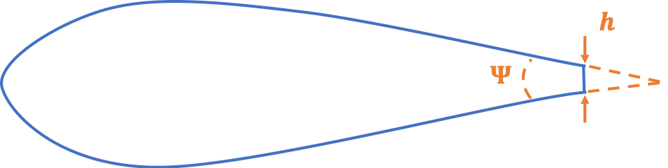
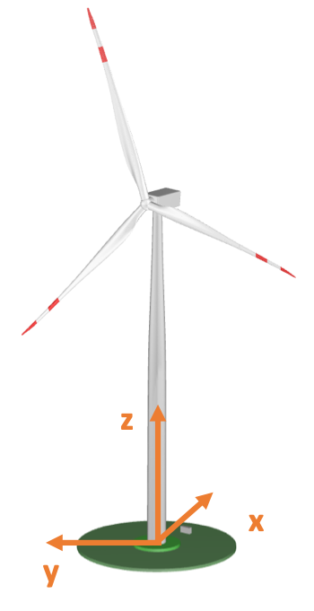

.. _AA-usage:

Using the Aeroacoustics Model in AeroDyn
========================================

A live version of this documentation is available at
https://openfast.readthedocs.io/. To run the aeroacoustics model, the
flag **CompAA** needs to be set to **True** at line 13 of the AeroDyn15 main
input file in the inputs block **General Options**. When the flag is set to
**True**, the following line must include the name of the file containing
the inputs to the aeroacoustics model, which is discussed in
:numref:`aa-sec-BLinputs`.

.. container::
   :name: aa-tab:AD15

   .. literalinclude:: example/AD15.ipt
      :linenos:
      :language: none

.. _aa-sec-MainInput:

Main Input File
---------------

The aeroacoustics main input file comprises a series of inputs and flags
that should be set appropriately depending on the analysis that should
be run. These are split into the subfields General Options,
Aeroacoustics Models, Observer Input, and Outputs.

Starting from the General Options, these are:

-  **Echo** – True/False: option to rewrite the input file with the correct
   template

-  **DT_AA** – Float: time step of the aeroacoustics computations. Only
   multiples of the time step **DTAero** of AeroDyn can be used. If set to
   default, the time step DTAero is adopted.

-  **AAStart** – Float: time after which the AeroAcoustics module is run.

-  **BldPrcnt** – Float: percentage value of blade span measured from blade
   tip that contributes to the noise emissions; 100% corresponds to the
   entire blade from tip to root.

The field Aeroacoustics Models lists all the flags for the actual noise
models:

-  **TIMod** – Integer 0/1/2: flag to set the turbulent inflow noise model;
   0 turns it off, 1 corresponds to the Amiet model discussed in 
   :numref:`aa-amiet`, and 2 corresponds to the Simplified Guidati model presented in
   :numref:`aa-guidati`.

-  **TICalcMeth** – Integer 1/2: flag to set the calculation method for the
   incident turbulence intensity. When set to 1, incident turbulence intensity is
   defined in a user-defined grid; see :numref:`aa-sec-TIgrid`. When set to
   2, incident turbulence intensity is estimated from the time history of the
   incident flow.

-  **TICalcTabFile** – String: name of the text file with the user-defined
   turbulence intensity grid; see :numref:`aa-sec-TIgrid`.

-  **Lturb** – Float: value of :math:`L_{turb}` used to estimate the turbulent
   lengthscale used in the Amiet model.

-  **TBLTEMod** – Integer 0/1/2: flag to set the TBL-TE noise model; 0 turns
   off the model, 1 uses the Brooks-Pope-Marcolini (BPM) airfoil noise
   model (see :numref:`aa-turb-TE-bpm`), and 2 uses the TNO model described in
   :numref:`aa-turb-TE-tno`.

-  **BLMod** – Integer 1/2: flag to set the calculation method for the
   boundary layer characteristics; 1 uses the simplified equations from
   the BPM model, 2 loads the files as described in :numref:`aa-sec-BLinputs`. Only
   used if **TBLTEMod** is different than zero.

-  **TripMod** – Integer 0/1/2: if BLMod is set to 1, different
   semiempirical parameters are used for a nontripped boundary layer
   (**TRipMod=0**), heavily tripped boundary layer (**TRipMod=1**), or lightly
   tripped boundary layer (**TRipMod=2**); 2 is typically used for
   operational wind turbines, whereas 1 is often used for wind tunnel
   airfoil models.

-  **LamMod** – Integer 0/1: flag to activate the laminar boundary layer –
   vortex shedding model, presented in :numref:`aa-laminar-vortex`.

-  **TipMod** – Integer 0/1: flag to activate the tip vortex model,
   presented in :numref:`aa-tip-vortex`.

-  **RoundedTip** – True/False: if **TipMod=1**, this flag switches between a
   round tip (True) and a square tip (False), see :numref:`aa-tip-vortex`.

-  **Alprat** – Float: value of the slope of the lift coefficient curve at
   blade tip; see :numref:`aa-tip-vortex`.

-  **BluntMod** – Integer 0/1: flag to activate (**BluntMod=1**) the
   trailing-edge bluntness – vortex shedding model, see :numref:`aa-TE-vortex`. If
   the flag is set to 1, the trailing-edge geometry must be specified in
   the files as described in :numref:`aa-sec-BLinputs`.

The field Observer Locations contains the path to the file where the
number of observers (NrObsLoc) and the respective locations are
specified; see :numref:`aa-sec-ObsPos`.

Finally, the set Outputs contains a few options for the output data:

-  **AWeighting** – True/False: flag to set whether the sound pressure
   levels are reported with (True) or without (False) the A-weighting
   correction; see :numref:`aa-sec-ModelUsage`.

-  **NAAOutFile** – Integer 1/2/3: flag to set the desired output file. When
   set to 1, a value of overall sound pressure level at every **DT_AA** time
   step per observer is printed to file. When set to 2, the first output
   is accompanied by a second file where the total sound pressure level
   spectrum is printed per time step per observer. When set to
   3, the two first outputs are accompanied by a third file where the
   sound pressure level spectrum per noise mechanism is printed per time
   step per observer. When set to 4, a fourth file is generated with the
   values of overall sound pressure levels per node, per blade, 
   per observer, and per time step.

-  The following line contains the file name used to store the outputs.
   The file name is attached with a 1, 2, 3, and 4 flag based on the
   **NAAOutFile** options.

The file must be closed by an END command.

.. container::
   :name: aa-tab:AeroAcousticsInput

   .. literalinclude:: example/AeroAcousticsInput.dat
      :linenos:
      :language: none

.. _aa-sec-BLinputs:

Boundary Layer Inputs and Trailing Edge Geometry
------------------------------------------------

When the flag **BLMod** is set equal to 2, pretabulated properties of the
boundary layer must be provided and are used by the turbulent boundary
layer – trailing-edge noise models. The file name is to be specified in
the field BL_file among the inputs of the file with the airfoil polar
coefficients. One airfoil file must be specified per aerodynamic
station.

.. container::
   :name: aa-tab:AFtab

   .. literalinclude:: example/AFtab.dat
      :linenos:
      :language: none

The file, in this example named **AF20_BL.txt**, contains 8 inputs, which
are tabulated for a given number of Reynolds numbers, ReListBL, and a
given number of angles of attack, aoaListBL. The inputs, which are
defined nondimensionally and must be provided for the suction and
pressure side of the airfoil above and below the trailing edge, are:

-  **Ue_Vinf** – flow velocity at the top of the boundary layer

-  **Dstar** – :math:`\delta^{*}`, boundary layer displacement thickness

-  **Delta** – :math:`\delta`, nominal boundary layer thickness

-  **Cf** – friction coefficient.

In the following example, the file was generated thanks to a Python
script [4]_ that runs the boundary layer solver, XFoil. Notably, XFoil,
by default, does not return :math:`\delta`, but the boundary layer
momentum thickness, :math:`\theta`. :math:`\delta` can be reconstructed
using the expression from :cite:`aa-Drela:1987`:

.. math::
   \delta = \theta \bullet \left( 3.15 + \frac{1.72}{H - 1} \right) + \delta^{*}
   :label:  eq:35

where :math:`H` is the kinematic shape factor, which is also among the standard
outputs of XFoil.  Because it is usually impossible to obtain these values for
the whole ranges of Reynolds numbers and angles of attack, the code is set to
adopt the last available values and print to screen a warning.

When the flag **BluntMod** is set to 1, the detailed geometry of the
trailing edge must also be defined along the span. Two inputs must be
provided, namely the angle, :math:`\Psi` between the suction and
pressure sides of the profile, right before the trailing-edge point, and
the height, :math:`h`, of the trailing edge. :math:`\Psi` must be
defined in degrees, while :math:`h` is in meters. Note that the BPM
trailing-edge bluntness model is very sensitive to these two parameters,
which, however, are often not easy to determine for real blades. 
:numref:`aa-fig:GeomParamTE` shows the two inputs.

   Geometric parameters :math:`\mathbf{\Psi}` and
   :math:`\mathbf{h}` of the trailing-edge bluntness

One value of :math:`\Psi` and one value of :math:`h` per file must be defined.
These values are not used if the flag **BluntMod** is set to 0.

.. container::
   :name: aa-tab:AF20_BL

   .. literalinclude:: example/AF20_BL.txt
      :linenos:
      :language: none

.. _aa-sec-ObsPos:

Observer Positions
------------------

The number and position of observers is set in the file ObserverLocations,
which is explained in :numref:`aa-sec-MainInput`. The positions must be specified in the OpenFAST global
inertial frame coordinate system, which is located at the tower base and
has the x-axis pointing downwind, the y-axis pointing laterally, and the
z-axis pointing vertically upward. A scheme of the coordinate system for
the observers is shown in :numref:`aa-fig:ObsRefSys`.

   Reference system for the observers

The International Energy Agency Wind Task 37 land-based reference wind
turbine, which is shown in :numref:`tab:ref-turb`, has a hub height of 110 meters and a
rotor radius of 65 meters, and has the International Electrotechnical
Commission 61400-11 standards compliant observer located at:

x = 175 [m]

y = 0 [m]

z = 0 [m].

An example of a file listing four observers located at a 2-meter height
is shown here:

.. container::
   :name: aa-tab:observer

   .. literalinclude:: example/Observer.txt
      :linenos:
      :language: none

.. _aa-sec-TIgrid:

Turbulence Grid
---------------

When the flag **TICalcMeth** is set equal to 1, the grid of turbulence
intensity of the wind :math:`TI` must be defined by the user. This is
done by creating a file called **TIGrid_In.txt**, which mimics a TurbSim
output file and contains a grid of turbulence intensity, which is
defined as a fraction value. The file defines a grid centered at hub
height and oriented with the OpenFAST global inertial frame coordinate
system; see :numref:`aa-fig:ObsRefSys`. A user-defined number of lateral and vertical
points equally spaced by a user-defined number of meters must be
specified. Note that an average wind speed must be defined to convert
the turbulence intensity of the wind to the incident turbulent intensity :math:`I_{1}`.
An example file for a 160 (lateral) by 180 (vertical) meters
grid looks like the following:

.. container::
   :name: aa-tab:TIgrid

   .. literalinclude:: example/TIGrid.txt
      :linenos:
      :language: none

.. [4]
   https://github.com/OpenFAST/python-toolbox
