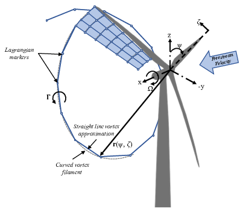

.. _Introduction:

Introduction
============

cOnvecting LAgrangian Filaments (OLAF) is a free vortex wake (FVW)
module used to compute the aerodynamic forces on a set of moving wings,
which, in particular, can be applied to two- or three-bladed
horizontal-axis wind turbines. This module has been incorporated into
the National Renewable Energy Laboratory physics-based engineering tool,
OpenFAST, which solves the aero-hydro-servo-elastic dynamics of
individual wind turbines. OLAF is incorporated into the OpenFAST module,
*AeroDyn15*, as an alternative to the traditional blade-element momentum
(BEM) option, as shown in Figures :numref:`figOpenFAST_a` and
:numref:`figOpenFAST_b`.

..   _figOpenFAST_a:

.. figure:: Schematics/OpenFAST.png
   :alt: OpenFAST schematic
   :width: 100%
   :align: center

   OpenFAST schematic

..   _figOpenFAST_b:

.. figure:: Schematics/FVWwithOpenFAST.png
   :alt: OpenFAST overview schematic and OLAF integration
   :width: 100%
   :align: center

   OLAF and BEM integration with AeroDyn

Incorporating the FVW module within OpenFAST allows for the modeling of
highly flexible turbines along with the aero-hydro-servo-elastic
response capabilities of OpenFAST. The OLAF module follows the
requirements of the OpenFAST modularization framework 
(:cite:`Sprague15_1,Jonkman13_1`).

The OLAF module uses a lifting-line representation of the blades, which
is characterized by a distribution of bound circulation. The spatial and
time variation of the bound circulation results in free vorticity being
emitted in the wake. OLAF solves for the turbine wake in a time-accurate
manner, which allows the vortices to convect, stretch, and diffuse. The
FVW model is based on a Lagrangian approach, in which the turbine wake
is discretized into Lagrangian markers. There are many methods of
representing the wake with Lagrangian
markers (:cite:`Branlard17_1`). In this work, a hybrid
lattice/filament method is used, as depicted in
Figure :numref:`Lagrangian`.

   Evolution of near-wake lattice, blade-tip vortex, and Lagrangian
   markers

Here, the position of the Lagrangian markers is defined in terms of wake
age, :math:`\zeta`, and azimuthal position, :math:`\psi`. A lattice
method is used in the near wake of the blade. The near wake spans over a
user-specified angle or distance for nonrotating cases. Though past
research has indicated that a near-wake region of :math:`30^\circ` is
sufficient (:cite:`Leishman_book,Ananthan02_1`), it has
been shown that a larger near wake is required for high thrust and other
challenging conditions. After this period, the wake is assumed to
instantaneously roll up into a tip vortex and, optionally, a root
vortex, which are assumed to be the most dominant features for the
remainder of the wake (:cite:`Leishman02_1`). Each
Lagrangian marker is connected to adjacent markers by straight-line
vortex filaments, approximated to second-order
accuracy (:cite:`Gupta05_1`). The wake is discretized based
on the spanwise location of the blade sections and a specified time step
(:math:`dt`), which may be different from the time step of AeroDyn.
After an optional initialization period, the wake is allowed to move and
distort, thus changing the wake structure as the markers are convected
downstream. To limit computational expense, the tip vortex is truncated
after a specified distance (:math:`d_\text{trunc}`) downstream of the
turbine. The wake truncation violates Helmholtz’s first law and hence
introduces an erroneous boundary condition. To alleviate this, the wake
is "frozen" in a buffer zone between a distance,
:math:`d_\text{buffer}`, and the distance, :math:`d_\text{trunc}`. In
this buffer zone, the markers convect at the average ambient velocity.
In this way, truncation error is
minimized (:cite:`Leishman02_1`). The buffer zone is
typically chosen as the convected distance over one rotor revolution.

As part of OpenFAST, induced velocities at the lifting line/blade are
transferred to *AeroDyn15* and used to compute the effective blade angle
of attack at each blade section, which is then used to compute the
aerodynamic forces on the blades. The FVW method returns the same
information as the BEM method, but allows for more accurate calculations
in areas where BEM assumptions are violated. As the FVW method is more
computationally expensive than BEM, both methods remain available in
OpenFAST, and the user may specify in the *AeroDyn15* input file which
method is used.

The OLAF input file defines the wake convection and circulation solution
methods; wake size and length options; the Lagrangian marker
regularization (viscous core) method; and other simulation and output
parameters. The extent of the near and far wake are specified by a
nondimensional length in terms of rotor diameter. Different
regularization functions for the vortex elements are available.
Additionally, different methods to compute the regularization parameters
of the bound and wake vorticity may be selected. In particular, viscous
diffusion may be accounted for by dynamically changing the
regularization parameter. Wake visualization output options are also
available.

This document is organized as follows. Section 2 details downloading,
compiling, and running OLAF on common operating systems. Section 3
describes the OLAF input file and modifications to the *AeroDyn15* input
file. Section 4 details the OLAF output file. Section 5 provides an
overview of the OLAF theory, including the free vortex wake method as
well as integration into the *AeroDyn15* module. Section 6 presents
future work. Example input files and a list of output channels are
detailed in Appendices A, B, and C.
