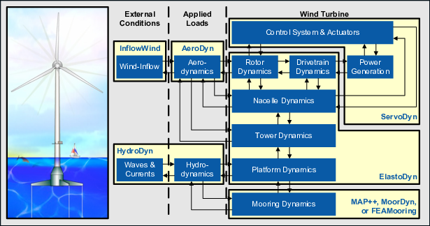
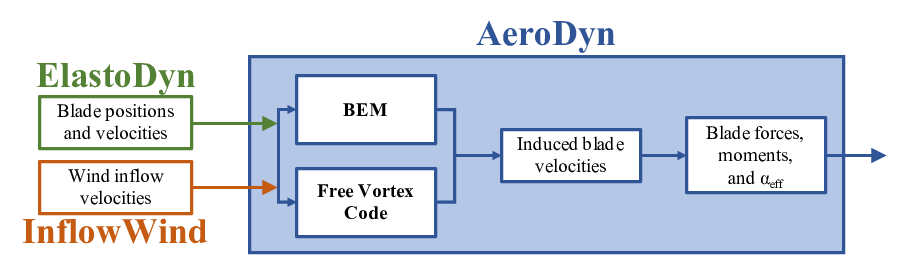
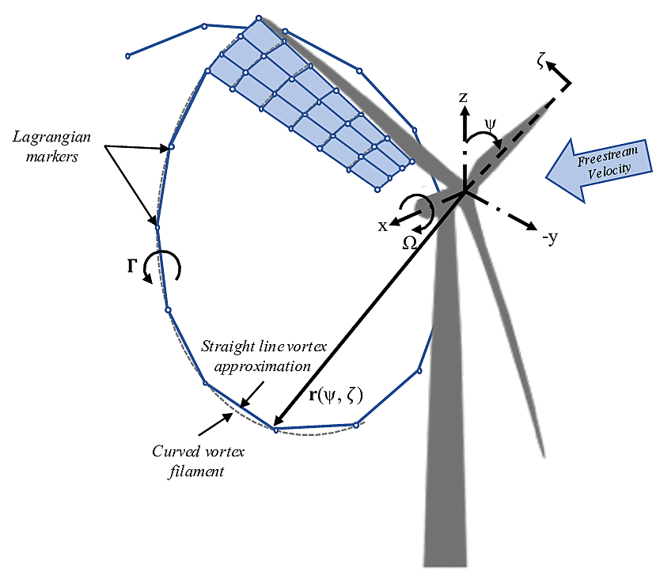

.. _Introduction:

Introduction
============
Over the past few decades, substantial reductions in the cost of wind energy
have come from large increases in rotor size. One important consideration for
such large turbines is increased blade flexibility. In particular, large blade
deflections may lead to a swept area that deviates significantly from the rotor
plane. Such deviations violate assumptions used by common aerodynamic models,
such as the blade element momentum (BEM) method. Such methods rely on
actuator-disk assumptions that are only valid for axisymmetric rotor loads
contained in a plane. Large blade deflections may also cause near wake of the
turbine to diverge from a uniform helical shape. Further, interactions between
turbine blades and the local near wake may increase, thus violating assumptions
of models that do not account for the position and dynamics of the near wake.
Additionally, highly flexible blades will likely cause increased unsteadiness
and three-dimensionality of aerodynamic effects, increasing the importance of
accurate and robust dynamic stall models. There are many other complex wind
turbine situations that violate simple engineering assumptions. Such situations
include obtaining accurate aerodynamic loads for nonstraight blade geometries
(e.g., built-in curvature or sweep); skewed flow caused by yawed inflow or
turbine tilt; and large rotor motion as a result of placing the turbine atop a
compliant offshore floating platform.

Higher-fidelity aerodynamic models are necessary to account for the increased
complexity of flexible and floating rotors. Although computational fluid
dynamics (CFD) methods are able to capture such features, their computational
cost limits the number of simulations that can be feasibly performed, which is
an important consideration in load analysis for turbine design. FVW methods are
less computationally expensive than CFD methods while modeling similarly complex
physics. As opposed to the BEM methods, FVW methods do not rely on ad-hoc
engineering models to account for dynamic inflow, skewed wake, tip losses, or
ground effects. These effects are inherently part of the model. Numerous
vorticity-based tools have been implemented, ranging from the early treatments
by Rosenhead (:cite:`olaf-Rosenhead31_1`), the formulation of vortex particle methods
by Winckelmans and Leonard (:cite:`olaf-Winckelmans93_1`), to the recent mixed
Eulerian-Lagrangian compressible formulations of
Papadakis (:cite:`olaf-Papadakis14_1`). Examples of long-standing codes that have been
applied in the field of wind energy are GENUVP (:cite:`olaf-Voutsinas06_1`), using
vortex particles methods, and AWSM (:cite:`olaf-Garrel03_1`), using vortex filament
methods. Both tools have successfully been coupled to structural solvers. The
method was extended by Branlard et al. (:cite:`olaf-Branlard15_1`) to consistently use
vortex methods to perform aero-elastic simulations of wind turbines in sheared
and turbulent inflow. Most formulations rely on a lifting-line representation of
the blades, but recently, a viscous-inviscid representation was used in
combination with a structural solver (:cite:`olaf-Miras17_1`).

cOnvecting LAgrangian Filaments (OLAF) is a free vortex wake (FVW) module used
to compute the aerodynamic forces on moving two- or three-bladed horizontal-axis
wind turbines.  This module has been incorporated into the National Renewable
Energy Laboratory physics-based engineering tool, OpenFAST, which solves the
aero-hydro-servo-elastic dynamics of individual wind turbines. OLAF is
incorporated into the OpenFAST module, *AeroDyn15*, as an alternative to the
traditional blade-element momentum (BEM) option, as shown in
Figures :numref:`figOpenFAST_a` and :numref:`figOpenFAST_b`.

..   _figOpenFAST_a:

   OpenFAST schematic

..   _figOpenFAST_b:

   OLAF and BEM integration with *AeroDyn15*

Incorporating the OLAF module within OpenFAST allows for the modeling of
highly flexible turbines along with the aero-hydro-servo-elastic
response capabilities of OpenFAST. The OLAF module follows the
requirements of the OpenFAST modularization framework 
(:cite:`olaf-Sprague15_1,olaf-Jonkman13_1`).

The OLAF module uses a lifting-line representation of the blades, which
is characterized by a distribution of bound circulation. The spatial and
time variation of the bound circulation results in free vorticity being
emitted in the wake. OLAF solves for the turbine wake in a time-accurate
manner, which allows the vortices to convect, stretch, and diffuse. The
OLAF model is based on a Lagrangian approach, in which the turbine wake
is discretized into Lagrangian markers. There are many methods of
representing the wake with Lagrangian
markers (:cite:`olaf-Branlard17_1`). In this work, a hybrid
lattice/filament method is used, as depicted in
Figure :numref:`Lagrangian`.

   Evolution of near-wake lattice, blade-tip vortex, and Lagrangian
   markers

Here, the position of the Lagrangian markers is defined in terms of wake
age, :math:`\zeta`, and azimuthal position, :math:`\psi`. A lattice
method is used in the near wake of the blade. The near wake spans over a
user-specified angle or distance for nonrotating cases. Though past
research has indicated that a near-wake region of :math:`30^\circ` is
sufficient (:cite:`olaf-Leishman_book,olaf-Ananthan02_1`), it has been shown that a larger
near wake is required for high thrust and other challenging conditions. After
the near wake region, the wake is assumed to instantaneously roll up into a tip
vortex and a root vortex, which are assumed to be the most dominant features for
the remainder of the wake (:cite:`olaf-Leishman02_1`). Each Lagrangian marker is
connected to adjacent markers by straight-line vortex filaments, approximated to
second-order accuracy (:cite:`olaf-Gupta05_1`). The wake is discretized based on the
spanwise location of the blade sections and a specified time step (:math:`dt`),
which may be different from the time step of AeroDyn.  After an optional
initialization period, the wake is allowed to move and distort, thus changing
the wake structure as the markers are convected downstream.  To limit
computational expense, the root and tip vortices are truncated after a specified
distance (**WakeLength**) downstream from the turbine. The wake truncation
violates Helmholtz's first law and hence introduces an erroneous boundary
condition. To alleviate this, the wake is "frozen" in a buffer zone between a
specified buffer distance, **FreeWakeLength**, and **WakeLength**. In this
buffer zone, the markers convect at the average ambient velocity. In this way,
truncation error is minimized~(:cite:`olaf-Leishman02_1`). The buffer zone is
typically chosen as the convected distance over one rotor revolution.

As part of OpenFAST, induced velocities at the lifting line/blade are
transferred to *AeroDyn15* and used to compute the effective blade angle of
attack at each blade section, which is then used to compute the aerodynamic
forces on the blades. The OLAF method returns the same information as the BEM
method, but allows for more accurate calculations in areas where BEM assumptions
are violated, such as those discussed above. As the OLAF method is more
computationally expensive than BEM, both methods remain available in OpenFAST,
and the user may specify in the *AeroDyn15* input file which method is
used.

The OLAF input file defines the wake convection and circulation solution
methods; wake size and length options; Lagrangian marker regularization (viscous
core) method; and other simulation and output parameters. The extents of the
near and far wakes are specified by a nondimensional length in terms of rotor
diameter. Different regularization functions for the vortex elements are
available. Additionally, different methods to compute the regularization
parameters of the bound and wake vorticity may be selected. In particular,
viscous diffusion may be accounted for by dynamically changing the
regularization parameter. Wake visualization output options are also available.

This document is organized as follows. :numref:`Running-OLAF` covers
downloading, compiling, and running OLAF. :numref:`OLAF-Input-Files` describes the
OLAF input file and modifications to the *AeroDyn15* input file.
:numref:`Output-Files` details the OLAF output file.  :numref:`OLAF-Theory`
provides an overview of the OLAF theory, including the free vortex wake method
as well as integration into the *AeroDyn15* module. Example input files and a
list of output channels are detailed in Appendices A, B, and C.

