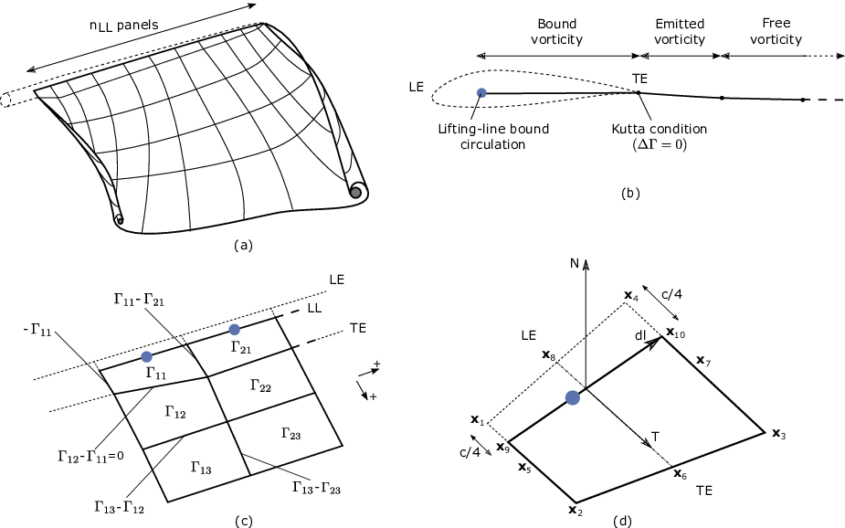

.. _OLAF-Theory:

OLAF Theory
===========

This section details the OLAF method and provides an overview of the
computational method, followed by a brief explanation of its integration
with OpenFAST.

.. _sec:vorticityformulation:

Introduction - Vorticity Formulation
------------------------------------

The vorticity equation for incompressible homogeneous flows in the
absence of non-conservative force is given by
Eq. :eq:`eq:vorticityconservationincompr`

.. math::
   \begin{aligned}
   \frac{d\vec{\omega}}{dt} = \frac{\partial\vec{\omega}}{\partial{t}} + \underbrace{(\vec{u} \cdot \nabla)}_{\text{convection}}\vec{\omega} = \underbrace{(\vec{\omega}\cdot\nabla)\vec{u}}_{\text{strain}} +\underbrace{\nu\Delta\vec{\omega}}_{\text{diffusion}}
   \end{aligned}
   :label: eq:vorticityconservationincompr

Here, :math:`\vec{\omega}` is the vorticity, :math:`\vec{u}` is the
velocity, and :math:`\nu` is the viscosity. In free vortex wake methods,
the vorticity equation is used to describe the evolution of the wake
vorticity. Different approximations are introduced to ease its
resolution, such as projecting the vorticity onto a discrete number of
vortex elements (here vortex filaments), and separately treating the
convection and diffusion steps, known as viscous-splitting. Several
complications arise from the method; in particular, the discretization
requires a regularization of the vorticity field (or velocity field) to
ensure a smooth approximation.

The forces exerted by the blades onto the flow are expressed in
vorticity formulation as well. This vorticity is bound to the blade and
has a circulation associated with the lift force. A lifting-line
formulation is used here to model the bound vorticity.

The different models of the implemented free vortex code are described
in the following sections.

.. _sec:discretization:

Discretization - Projection
---------------------------

The numerical method uses a finite number of states to model the
continuous vorticity distribution. To achieve this, the vorticity
distribution is projected onto basis function which is referred to
as vortex elements. Vortex filaments are here used as elements that
represents the vorticity field. A vortex filament is delimited by two
points and hence assumes a direction formed by these two points. A
vorticity tube is oriented along the unit vector :math:`\vec{e}_x` of
cross section :math:`dS` and length :math:`l`. It can then be
approximated by a vortex filament of length :math:`l` oriented along the
same direction. The total vorticity of the tube and the vortex filaments
are the same and related by:

.. math::
   \begin{aligned}
       \vec{\omega} \,  dS  = \vec{\Gamma}
   \end{aligned}
   :label: OmegaGamma

where :math:`\vec{\Gamma}` is the circulation intensity of the vortex
filament. If the vorticity tubes are complex and occupy a large volume,
the projection onto vortex filaments is difficult and the projection
onto vortex particle is more appropriate. Assuming the wake is confined
to a thin vorticity layer which defines a velocity jump of know
direction, it is possible to approximate the wake vorticity sheet as a
mesh of vortex filaments. This is the basis of vortex filament wake
methods. Vortex filaments are a singular representation of the vorticity
field, as they occupy a line instead of a volume. To better represent
the vorticity field, the filaments are “inflated”, a process referred to
as regularization (see :numref:`sec:Regularization`). The
regularization of the vorticity field also regularizes the velocity
field and avoids the singularities that would otherwise occur.

.. _sec:circ:

Lifting-Line Representation
---------------------------

The code relies on a lifting-line formulation. Lifting-line methods effectively
lump the loads at each cross-section of the blade onto the mean line of the
blade and do not account directly for the geometry of each cross-section. In the
vorticity-based version of the lifting-line method, the blade is represented by
a line of varying circulation. The line follows the motion of the blade and is
referred to as “bound” circulation. The bound circulation does not follow the
same dynamic equation as the free vorticity of the wake. Instead, the intensity
is linked to airfoil lift via the Kutta-Joukowski theorem. Spanwise variation of
the bound circulation results in vorticity being emitted into the the wake. This
is referred to as “trailed vorticity”. Time changes of the bound circulation are
also emitted in the wake, referred to as “shed” vorticity. The subsequent
paragraphs describe the representation of the bound vorticity.

Lifting-Line Panels and Emitted Wake Panels
~~~~~~~~~~~~~~~~~~~~~~~~~~~~~~~~~~~~~~~~~~~

The lifting-line and wake representation is illustrated in
:numref:`fig:VortexLatticeMethod`. The blade lifting-line is discretized into a
finite number of panels, each of them forming a four sided vortex rings. The
spanwise discretization follows the discretization of the AeroDyn blade input
file. The number of spanwise panels, :math:`n_\text{LL}`, is one less than the
total number of AeroDyn nodes, **NumBlNds**. The sides of the panels coincide
with the lifting-line and the trailing edge of the blade. The lifting-line is
currently defined as the 1/4 chord location from the leading edge (LE). More
details on the panelling is provided in :numref:`sec:Panelling`. At a given time
step, the circulation of each lifting-line panel is determined according to one
of the three methods developed in :numref:`sec:CirculationMethods`. At the end
of the time step, the circulation of each lifting-line panel is emitted into the
wake, forming free vorticity panels. To satisfy the Kutta condition, the
circulation of the first near wake panel and the bound circulation are
equivalent (see :numref:`fig:VortexLatticeMethod` b). The wake panels model the
thin shear layer resulting from the continuation of the blade boundary layer.
This shear layer can be modelled using a continuous distribution of vortex
doublets. A constant doublet strength is assumed on each panel, which in turn is
equivalent to a vortex ring of constant circulation.

   Wake and lifting-line vorticity discretized into vortex ring panels.
   (a) Overview. (b) Cross-sectional view, defining the leading-edge,
   trailing edge, and lifting-line. (c) Circulation of panels and
   corresponding circulation for vorticity segments between panels. (d)
   Geometrical quantities for a lifting-line panel.

The current implementation stores the positions and circulations of the panel
corner points. In the vortex ring formulation, the boundary between two panels
corresponds to a vortex segment of intensity equal to the difference of
circulation between the two panels. The convention used to define the segment
intensity based on the panels intensity is shown in
:numref:`fig:VortexLatticeMethod` c. Since the circulation of the bound panels
and the first row of near wake panels are equal, the vortex segments located on
the trailing edge have no circulation.

.. _sec:Panelling:

Panelling
~~~~~~~~~

The definitions used for the panelling of the blade are given in
:numref:`fig:VortexLatticeMethod` d, following the notations of van
Garrel (:cite:`olaf-Garrel03_1`). The leading edge and
trailing edge (TE) locations are directly obtained from the AeroDyn
mesh. At two spanwise locations, the LE and TE define the corner points:
:math:`\vec{x}_1`, :math:`\vec{x}_2`, :math:`\vec{x}_3`, and
:math:`\vec{x}_4`. The current implementation assumes that the
aerodynamic center, the lifting-line, and the 1/4 chord location all
coincide. For a given panel, the lifting-line is then delimited by the
points :math:`\vec{x}_9= 3/4\,\vec{x}_1 + 1/4\, \vec{x}_2` and
:math:`\vec{x}_{10}=3/4\,\vec{x}_4 + 1/4\, \vec{x}_3`. The mid points of
the four panel sides are noted :math:`\vec{x}_5`, :math:`\vec{x}_6`,
:math:`\vec{x}_7`, and :math:`\vec{x}_8`. The lifting-line vector
(:math:`\vec{dl}`) as well as the vectors tangential (:math:`\vec{T}`)
and normal (:math:`\vec{N}`) to the panel are defined as:

.. math::
   \begin{aligned}
       \vec{dl} = \vec{x}_{10}-\vec{x}_9
      ,\qquad
      \vec{T}  = \frac{\vec{x}_6-\vec{x}_8}{|\vec{x}_6-\vec{x}_8|}
      ,\qquad
      \vec{N}  = \frac{\vec{T}\times\vec{dl}}{|\vec{T}\times\vec{dl}|}
   \end{aligned}
   :label: eq:GeometricDefinitions

The area of the panel is obtained as :math:`dA =
|(\vec{x}_6-\vec{x}_8)\times(\vec{x}_{7}-\vec{x}_5)|`. For
**CircSolvMethod=[1]**, the control points are located on the lifting-line at
the location :math:`\vec{x}_9+\eta_j \vec{dl}`. The factor :math:`\eta_j` is
determined based on the full-cosine approximation of van Garrel. This is based
on the spanwise widths of the current panel, :math:`w_j`, and the neighboring
panels :math:`w_{j-1}` and :math:`w_{j+1}`:

.. math::
   \begin{aligned}
      \eta_1 &= \frac{w_1}{w_1+w_2},\\
      \eta_j &= \frac{1}{4}\left[\frac{w_{j-1}}{w_{j-1}+w_j} + \frac{w_j}{w_j+w_{j+1}} +1 \right]
      ,\ j=2..n-1,\\
      \eta_{n} &= \frac{w_{n-1}}{w_{n-1}+w_{n}}
   \end{aligned}

For an equidistant spacing, this discretization places the control points at the
middle of the lifting-line (:math:`\eta=0.5`). Theoretical circulation results
for an elliptic wing with a cosine spacing are retrieved with such
discretization since it places the control points closer to stronger trailing
segments at the wing extremities (see e.g. :cite:`olaf-Kerwin:lecturenotes`).

.. _sec:CirculationMethods:

Circulation Solving Methods
~~~~~~~~~~~~~~~~~~~~~~~~~~~

Three methods are implemented to determine the bound circulation strength. They
are selected using the input **CircSolvMethod**, and are presented in the
following sections.

Cl-Based Iterative Method
^^^^^^^^^^^^^^^^^^^^^^^^^

The Cl-based iterative method determines the circulation within a
nonlinear iterative solver that makes use of the polar data at each
control point located on the lifting line. The algorithm ensures that
the lift obtained using the angle of attack and the polar data matches
the lift obtained with the Kutta-Joukowski theorem. At present, it is
the preferred method to compute the circulation along the blade span. It is
selected with **CircSolvMethod=[1]**. The method is described in the work from
van Garrel (:cite:`olaf-Garrel03_1`). The algorithm is implemented in at iterative
approach using the following steps:

#. The circulation distribution from the previous time step is used as a
   guessed circulation, :math:`\Gamma_\text{prev}`.

#. The velocity at each control points :math:`j` is computed as the sum
   of the wind velocity, the structural velocity, and the velocity
   induced by all the vorticity in the domain, evaluated at the control
   point location.

   .. math::
      \begin{aligned}
          \vec{v}_j = \vec{V}_0 - \vec{V}_\text{elast} + \vec{v}_{\omega,\text{free}} + \vec{v}_{\Gamma_{ll}}
      \end{aligned}

   :math:`\vec{v}_{\omega,\text{free}}` is the velocity induced by all free
   vortex filaments, as introduced in Eq. :eq:`eq:eq510` . The contribution
   of :math:`\vec{v}_{\Gamma_{ll}}` comes from the lifting-line panels and
   the first row of near wake panels, for which the circulation is set to
   :math:`\Gamma_\text{prev}`

#. The circulation for all lifting-line panels :math:`j` is obtained as
   follows.

   .. math::
      \begin{aligned}
         \Gamma_{ll,j} =\frac{1}{2} C_{l,j}(\alpha_j) \frac{\left[ (\vec{v}_j  \cdot \vec{N})^2 +  (\vec{v}_j  \cdot \vec{T})^2\right]\,dA}{
         \sqrt{\left[(\vec{v}_j\times \vec{dl})\cdot\vec{N}\right]^2 + \left[(\vec{v}_j\times \vec{dl})\cdot\vec{T}\right]^2}
         }   %\label{eq:}
      ,\quad\text{with}
      \quad
      \alpha_j = \operatorname{atan}\left(\frac{\vec{v}_j\cdot\vec{N}}{\vec{v}_j \cdot \vec{T}} \right)
      \end{aligned}

   The function :math:`C_{l,j}` is the lift coefficient obtained from
   the polar data of blade section :math:`j` and :math:`\alpha_j` is the
   angle of attack at the control point.

#. The new circulation is set using the relaxation factor
   :math:`k_\text{relax}` (**CircSolvRelaxation**):

   .. math::
      \begin{aligned}
        \Gamma_\text{new}= \Gamma_\text{prev} + k_\text{relax} \Delta \Gamma
            ,\qquad
         \Delta \Gamma = \Gamma_{ll} - \Gamma_\text{prev}   %\label{eq:}
      \end{aligned}

#. Convergence is checked using the criterion :math:`k_\text{crit}`
   (**CircSolvConvCrit**):

   .. math::
      \begin{aligned}
             \frac{ \operatorname{max}(|\Delta \Gamma|}{\operatorname{mean}(|\Gamma_\text{new}|)} <  k_\text{crit}
       \end{aligned}

   If convergence is not reached, steps 2-5 are repeated using
   :math:`\Gamma_\text{new}` as the guessed circulation
   :math:`\Gamma_\text{prev}`.

No-flow-through Method
^^^^^^^^^^^^^^^^^^^^^^

A no-flow-through circulation solving method
(sometimes called Weissinger-L-based method)
might be implemented in the future
(:cite:`olaf-Weissinger47_1,olaf-Bagai94_1,olaf-Gupta06_1,olaf-Ribera07_1`).
In this method, the circulation is solved by satisfying a no-flow through
condition at the 1/4-chord points.  
It would be selected with **CircSolvMethod=[2]** but is currently no implemented.

Prescribed Circulation
^^^^^^^^^^^^^^^^^^^^^^

The final available method prescribes a constant circulation. A user
specified spanwise distribution of circulation is prescribed onto the
blades. It is selected with **CircSolvMethod=[3]**.

.. _sec:vortconv:

Free Vorticity Convection
-------------------------

The governing equation of motion for a vortex filament is given by the
convection equation of a Lagrangian marker:

.. math::
   \frac{d\vec{r}}{dt}=\vec{V}(\vec{r},t)
   :label: VortFilCart

where :math:`\vec{r}` is the position of a Lagrangian marker. The Lagrangian
markers are the end points of the vortex filaments. The Lagrangian convection of
the filaments stretches the filaments and thus automatically accounts for strain
in the vorticity equation.

At present, the Runge-Kutta 4th order (**IntMethod=[1]**) or first order forward Euler
(**IntMethod=[5]**) methods are implemented to numerically solve the
left-hand side of Eq. :eq:`VortFilCart` for the vortex filament location.
In the case of the first order Euler method, the convection is then simply:
Eq. :eq:`eq:Euler`. 

.. math::
   \vec{r}  = \vec{r} + \vec{V} \Delta t
   :label: eq:Euler

.. _sec:vortconvPolar:

Free Vorticity Convection in Polar Coordinates
----------------------------------------------

The governing equation of motion for a vortex filament is given by:

.. math:: 
   \frac{d\vec{r}(\psi,\zeta)}{dt}=\vec{V}[\vec{r}(\psi,\zeta),t]
   :label: VortFil

Using the chain rule, Eq. :eq:`VortFil` is rewritten as:

.. math::
   \frac{\partial\vec{r}(\psi,\zeta)}{\partial\psi}+\frac{\partial\vec{r}(\psi,\zeta)}{\partial\zeta}=\frac{\vec{V}[\vec{r}(\psi,\zeta),t]}{\Omega}
   :label: VortFil_expanded

where :math:`d\psi/dt=\Omega` and
:math:`d\psi=d\zeta` (:cite:`olaf-Leishman02_1`). Here,
:math:`\vec{r}(\psi,\zeta)` is the position vector of a Lagrangian
marker, and :math:`\vec{V}[\vec{r}(\psi,\zeta)]` is the velocity.

.. _sec:vortconvfrozen:

Frozen Vorticity Convection
---------------------------

For computational efficiency, the user can define "frozen" near wake and far wake zones.
In these zones, the Lagrangian markers are convected using an common induced velocity
which is independent of the radial location of the marker, and potentially a function of the wake age. 
The convection equation of the Lagrangian markers in the frozen zone is:

.. math::
   \frac{d\vec{r}_\zeta}{dt}=\vec{V}_0(\vec{r}_\zeta,t) + \vec{V}_\text{avg}(t)*k(\zeta)

where :math:`\vec{V}_\text{avg}(t)` is an average induced velocity computed based on the convection velocity of a subset of the "free" markers.
:math:`k(\zeta)` is a decay factor between 1 and 0 based on the wake age :math:`\zeta`.
A constant decay factor of 1 would result in a uniform convection velocity across the frozen wake. 
This is what is used for the far-wake. 
For the near-wake, typical values are such that the decay factor is 1 at the beginning of the frozen wake, and
0.5 at the end of the frozen wake.
In fact, current verification indicated that starting at :math:`k(0)=0.75` was better, as otherwise the 
average convection velocity (computed over a subset of the free markers) ended up too low, and the 
frozen wake would be more condensed, leading to higher inductions at the rotor.
Clearly, the choice of the average velocity and its decay are tuning parameters that might change in future releases. 
These parameters are currently not directly exposed in the input file.

In general, convecting the whole "frozen" wake with a unique induced velocity introduces some error, but greatly reduces the computational time.
The advantage of having a "frozen" far-wake region, is that it mitigates the impact of wake truncation which is an erroneous boundary condition (vortex lines cannot end in the fluid). If the wake is truncated while still being "free", then the vorticity will rollup on itself in this region. 
Another advantage is that in the absence of diffusion, the wake tends to become excessively distorted downstream, reaching limit on the validity of the vortex filament representation. 

Induced Velocity and Velocity Field
-----------------------------------

The velocity term on the right-hand side of
Eq. :eq:`VortFilCart` is a nonlinear function of the
vortex position, representing a combination of the freestream and
induced velocities (:cite:`olaf-Hansen08_1`). The induced
velocities at point :math:`\vec{x}`, caused by each straight-line
filament, are computed using the Biot-Savart law, which considers the
locations of the Lagrangian markers and the intensity of the vortex
elements (:cite:`olaf-Leishman02_1`):

.. math::
   d\vec{v}(\vec{x})=\frac{\Gamma}{4\pi}\frac{d\vec{l}\times\vec{r}}{r^3}
   :label: BiotSavart

Here, :math:`\Gamma` is the circulation strength of the filament,
:math:`\vec{dl}` is an elementary length along the filament, :math:`\vec{r}` is
the vector between a point on the filament and the control point
:math:`\vec{x}`, and :math:`r=|\vec{r}|` is the norm of the vector. The
integration of the Biot-Savart law along the filament length, delimited by the
points :math:`\vec{x}_1` and :math:`\vec{x}_2` leads to:

.. math::
   \begin{aligned}
     \vec{v}(\vec{x}) 
     =  F_\nu \frac{\Gamma}{4\pi} \frac{(r_1+r_2)}{r_1r_2(r_1r_2+\vec{r}_1\cdot\vec{r}_2)  }\vec{r}_1\times\vec{r}_2
   \end{aligned}
   :label: eq:BiotSavartSegment

with :math:`\vec{r}_1= \vec{x}-\vec{x}_1` and :math:`\vec{r}_2=
\vec{x}-\vec{x}_2`. The factor :math:`F_\nu` is a regularization parameter,
discussed in :numref:`sec:RegularizationFunction`.  :math:`r_0` is the filament
length, where :math:`\vec{r}_0= \vec{x}_2-\vec{x}_1`. The distance orthogonal to
the filament is:

.. math::
   \begin{aligned}
      \rho = \frac{|\vec{r}_1\times\vec{r}_2|}{r_0}
   \end{aligned}

The velocity at any point of the domain is obtained by superposition of
the velocity induced by all vortex filaments, and by superposition of
the primary flow, :math:`\vec{V}_0`, (here assumed divergence free):

.. math::
   \begin{aligned}
    \vec{V}(\vec{x}) = \vec{V}_0(\vec{x}) + \vec{v}_\omega(\vec{x}), \quad\text{with}\quad \vec{v}_\omega(\vec{x}) = \sum_{k} \vec{v}_k(\vec{x}) 
   \end{aligned}
   :label: eq:eq510

where the sum is over all the vortex filaments, each of intensity
:math:`\Gamma_k`. The intensity of each filament is determined by spanwise and
time changes of the bound circulation, as discussed in :numref:`sec:circ`. In
tree-based methods, the sum over all vortex elements is reduced by lumping
together the elements that are far away from the control points.

.. _sec:Regularization:

Regularization
--------------

Regularization and viscous diffusion
~~~~~~~~~~~~~~~~~~~~~~~~~~~~~~~~~~~~

The singularity that occurs in Eq. :eq:`BiotSavart` greatly affects the
numerical accuracy of vortex methods. By regularizing the “1-over-r” kernel of
the Biot-Savart law, it is possible to obtain a numerical method that converges
to the Navier-Stokes equations. The regularization is used to improve the
regularity of the discrete vorticity field, as compared to the “true” continuous
vorticity field. This regularization is usually obtained by convolution with a
smooth function. In this case, the regularization of the vorticity field and the
velocity field are the same. Some engineering models also perform regularization
by directly introducing additional terms in the denominator of the Biot-Savart
velocity kernel.  The factor, :math:`F_\nu`, was introduced in
Eq. :eq:`eq:BiotSavartSegment` to account for this regularization.

In the convergence proofs of vortex methods, regularization and viscous
diffusion are two distinct aspects. It is common practice in vortex filament
methods to blur the notion of regularization with the notion of viscous
diffusion. Indeed, for a physical vortex filament, viscous effects prevent the
singularity from occurring and diffuse the vortex strength with time. The
circular zone where the velocity drops to zero around the vortex is referred to
as the vortex core. A length increase of the vortex segment will result in a
vortex core radius decrease, and vice versa. Diffusion, on the other hand,
continually spreads the vortex radially. 

Because of the previously mentioned analogy, practitioners of vortex filament
methods often refer to regularization as "viscous-core" models and
regularization parameters as "core-radii." Additionally, viscous diffusion is
often introduced by modifying the regularization parameter in space and time
instead of solving the diffusion from the vorticity equation. The distinction is
made explicit in this document when clarification is required, but a loose
terminology is used when the context is clear. 

Determination of the regularization parameter
~~~~~~~~~~~~~~~~~~~~~~~~~~~~~~~~~~~~~~~~~~~~~

The regularization parameter is both a function of the physics being modeled
(blade boundary layer and wake) and the choice of discretization. Contributing
factors are the chord length, the boundary layer height, and the volume that
each vortex filament is approximating.  Currently the choice is left to the user
(**RegDeterMethod=[0]**).  Empirical results for a rotating blade are found in the
work of Gupta (:cite:`olaf-Gupta06_1`). As a guideline, the regularization parameter
may be chosen as twice the average spanwise discretization of the blade. This
guideline is implemented when the user chooses **RegDeterMethod=[1]**. Further
refinement of this option will be considered in the future.

.. _sec:RegularizationFunction:

Implemented regularization functions
~~~~~~~~~~~~~~~~~~~~~~~~~~~~~~~~~~~~

Several regularization functions have been
developed (:cite:`olaf-Rankine58_1,olaf-Scully75_1,olaf-Vatistas91_1`).  At present, five
options are available: 1) No correction, 2) the Rankine method, 3) the
Lamb-Oseen method, 4) the Vatistas method, or 5) the denominator offset method.
If no correction method is used, (**RegFunction=[0]**), :math:`F_\nu=1`. The
remaining methods are detailed in the following sections.  Here, :math:`r_c` is
the regularization parameter (**WakeRegParam**) and :math:`\rho` is the distance
to the filament. Both variables are expressed in meters.

Rankine
^^^^^^^

The Rankine method (:cite:`olaf-Rankine58_1`) is the simplest
regularization model. With this method, the Rankine vortex has a finite
core with a solid body rotation near the vortex center and a potential
vortex away from the center. If this method is used
(**RegFunction=[1]**), the viscous core correction is given by
Eq. :eq:`rankine`.

.. math::
       F_\nu= \begin{cases} \rho^2/r_c^2 & 0 < \rho < 1 \\
       1 & \rho > 1 \end{cases}
   :label: rankine

Here, :math:`r_c` is the viscous core radius of a vortex filament,
detailed in :numref:`sec:corerad`.

Lamb-Oseen
^^^^^^^^^^

If the Lamb-Oseen method is used [**RegFunction=[2]**], the viscous core
correction is given by Eq. :eq:`lamboseen`.

.. math::
   F_\nu= \bigg[1-\text{exp}(-\frac{\rho^2}{r_c^2})\bigg]
   :label: lamboseen

Vatistas
^^^^^^^^

If the Vatistas method is used [**RegFunction=[3]**], the viscous core
correction is given by Eq. :eq:`vatistas`.

.. math::
   F_\nu
   = \frac{\rho^2}{(\rho^{2n}+r_c^{2n})^{1/n}}
   = \frac{(\rho/r_c)^2}{(1 + (\rho/r_c)^{2n})^{1/n}}
   :label: vatistas

Here, :math:`\rho` is the distance from a vortex segment to an arbitrary
point (:cite:`olaf-Abedi16_1`). Research from rotorcraft applications suggests a
value of :math:`n=2`, which is used in this work (:cite:`olaf-Bagai93_1`).

Denominator Offset/Cut-Off
^^^^^^^^^^^^^^^^^^^^^^^^^^

If the denominator offfset method is used [**RegFunction=[4]**], the viscous
core correction is given by Eq. :eq:`denom`

.. math::
   \begin{aligned}
     \vec{v}(\vec{x}) 
     =   \frac{\Gamma}{4\pi} \frac{(r_1+r_2)}{r_1r_2(r_1r_2+\vec{r}_1\cdot\vec{r}_2) + r_c^2  r_0^2} \vec{r}_1\times\vec{r}_2
   \end{aligned}
   :label: denom

Here, the singularity is removed by introducing an additive factor in the
denominator of Eq. :eq:`eq:BiotSavartSegment`, proportional to the filament
length :math:`r_0`. In this case, :math:`F_\nu=1`. This method is found in the
work of van Garrel (:cite:`olaf-Garrel03_1`).

.. _sec:corerad:

Time Evolution of the Regularization Parameter–Core Spreading Method
~~~~~~~~~~~~~~~~~~~~~~~~~~~~~~~~~~~~~~~~~~~~~~~~~~~~~~~~~~~~~~~~~~~~

There are four available methods by which the regularization parameter may
evolve with time: 1) constant value, 2) stretching, 3) wake age, or 4)
stretching and wake age. The three latter methods blend the notions of viscous
diffusion and regularization. The notation :math:`r_{c0}` used in this section
corresponds to input file parameter value **WakeRegParam**.

Constant
^^^^^^^^

If a constant value is selected, (**WakeRegMethod=[1]**), the value of
:math:`r_c` remains unchanged for all Lagrangian markers throughout the
simulation and is taken as the value given with the parameter **WakeRegParam**
in meters.

.. math::
   r_c(\zeta) = r_{c0}
   :label: cst

Here, :math:`\zeta` is the vortex wake age, measured from its emission time.

Stretching
^^^^^^^^^^

If the stretching method is selected, (**WakeRegMethod=[2]**), the viscous core
radius is modeled by Eq. :eq:`stretch`.

.. math::
   r_c(\zeta,\epsilon) = r_{c0} (1+\epsilon)^{-1}
   :label: stretch

.. math::
   \epsilon = \frac{\Delta l}{l}

Here, :math:`\epsilon` is the vortex-filament strain, :math:`l` is the filament
length, and :math:`\Delta l` is the change of length between two time steps. The
integral in Eq. :eq:`stretch` represents strain effects.

This option is not yet implemented.

Wake Age / Core-Spreading
^^^^^^^^^^^^^^^^^^^^^^^^^

If the wake age method is selected, (**WakeRegMethod=[3]**), the viscous core
radius is modeled by Eq. :eq:`age`.

.. math::
   r_c(\zeta) = \sqrt{r_{c0}^2+4\alpha\delta\nu \zeta}
   :label: age

where :math:`\alpha=1.25643`, :math:`\nu` is kinematic viscosity, and
:math:`\delta` is a viscous diffusion parameter (typically between :math:`1` and
:math:`1,000`). The parameter :math:`\delta` is provided in the input file as
**CoreSpreadEddyVisc**. Here, the term :math:`4\alpha\delta\nu \zeta`, accounts
for viscous effects as the wake propagates downstream. The higher the background
turbulence, the more diffusion of the vorticity with time, and the higher the
value of :math:`\delta` should be. This method partially accounts for viscous
diffusion of the vorticity while neglecting the interaction between the wake
vorticity itself or between the wake vorticity and the background flow. It is
often referred to as the core-spreading method. Setting **DiffusionMethod=[1]**
is the same as using the wake age method (**WakeRegMethod=[3]**).

The time evolution of the core radius is implemented as:

.. math::

    \frac{d r_c}{dt} = \frac{2\alpha\delta\nu}{r_c(t)}

and :math:`\frac{d r_c}{dt}=0` on the blades.

Stretching and Wake Age
^^^^^^^^^^^^^^^^^^^^^^^

If the stretching and wake-age method is selected (**WakeRegMethod=[4]**),
the viscous core radius is modeled by
Eq. :eq:`stretchandage`.

.. math::
   r_c(\zeta,\epsilon) = \sqrt{r_{c0}^2 + 4\alpha\delta\nu \zeta  \big(1+\epsilon\big)^{-1} }
   :label: stretchandage

This option is not yet implemented.

.. _sec:diffusion:

Diffusion
---------

The viscous-splitting assumption is used to solve for the convection and
diffusion of the vorticity separately. The diffusion term :math:`\nu \Delta
\vec{\omega}` represents molecular diffusion. This term allows for viscous
connection of vorticity lines. Also, turbulent flows will diffuse the vorticity
in a similar manner based on a turbulent eddy viscosity.

The parameter **DiffusionMethod** is used to switch between viscous diffusion
methods.  Currently, only the core-spreading method is implemented. The method
is described in :numref:`sec:corerad` since it is equivalent to the increase of
the regularization parameter with the wake age.

