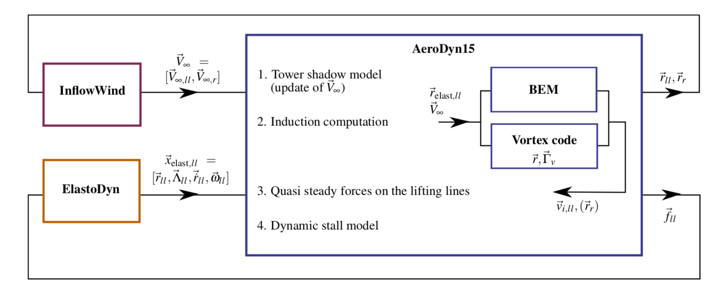

.. role:: raw-latex(raw)
   :format: latex
..

State-Space Representation and Integration with OpenFAST
========================================================

State, Constraint, Input, and Output Variables
----------------------------------------------

The OLAF module has been integrated into the latest version of OpenFAST via
*AeroDyn15*, following the OpenFAST modularization
framework (:cite:`olaf-Jonkman13_1,olaf-Sprague15_1`). To follow the OpenFAST framework,
the vortex code is written as a module, and its formulation comprises state,
constraint, and output equations. The data manipulated by the module include the
following vectors: constant parameters, :math:`\vec{p}`;  inputs,
:math:`\vec{u}`; constrained state, :math:`\vec{z}`; states, :math:`\vec{x}`;
and outputs, :math:`\vec{y}`. The vectors are defined as follows:

-  Parameters, :math:`\vec{p}~-` a set of internal system values that are
   independent of the states and inputs. The parameters can be fully defined at
   initialization and characterize the system state and output equations.

-  Inputs, :math:`\vec{u}~-` a set of values supplied to the module that, along
   with the states, are needed to calculate future states and the system output.

-  Constraint states, :math:`\vec{z}~-` algebraic variables that are calculated
   using a nonlinear solver, based on values from the current time step.

-  States, :math:`\vec{x}~-` a set of internal values of the module. They are
   influenced by the inputs and used to calculate future state values and
   output. Continuous states are employed, meaning that the states are
   differentiable in time and characterized by continuous time-differential
   equations.

-  Outputs, :math:`\vec{y}~-`  a set of values calculated and returned by the
   module that depend on the states, inputs, and/or parameters through output
   equations.

The parameters of the vortex code include:

-  Fluid characteristics: kinematic viscosity, :math:`\nu`.

-  Airfoil characteristics: chord :math:`c` and polar data --
   :math:`C_l(\alpha)`, :math:`C_d(\alpha)`, :math:`C_m(\alpha)`).

-  Algorithmic methods and parameters, e.g., regularization, viscous
   diffusion, discretization, wake geometry, and acceleration.

The inputs of the vortex code are:

-  Position, orientation, translational velocity, and rotational
   velocity of the different nodes of the lifting lines
   (:math:`\vec{r}_{ll}`, :math:`\Lambda_{ll}`,
   :math:`\vec{\dot{r}}_{ll}`, and :math:`\vec{\omega}_{ll}`,
   respectively), gathered into the vector,
   :math:`\vec{x}_{\text{elast},ll}`, for conciseness. These quantities
   are handled using the mesh-mapping functionality and data structure
   of OpenFAST.

-  Disturbed velocity field at requested locations, written
   :math:`\vec{V}_0=[\vec{V}_{0,ll}, \vec{V}_{0,m}]`. Locations are requested
   for lifting-line points, :math:`\vec{r}_{ll}`, and Lagrangian markers,
   :math:`\vec{r}_m`. Based on the parameters, this disturbed velocity field may
   contain the following influences: freestream, shear, veer, turbulence, tower,
   and nacelle disturbance.  The locations where the velocity field is requested
   are typically the location of the Lagrangian markers.

The constraint states are:

-  The circulation intensity along the lifting lines,
   :math:`\Gamma_{ll}`.

The continuous states are:

-  The position of the Lagrangian markers, :math:`\vec{r}_m`

-  The vorticity associated with each vortex element, :math:`\vec{\omega}_e`.
   For a projection of the vorticity onto vortex segments, this corresponds to
   the circulation, :math:`\vec{\Gamma}_e`. For each segment,
   :math:`\vec{\Gamma}_e= \Gamma_e \vec{dl}_e =\vec{\omega}_e dV_e`, with
   :math:`\vec{dl}_e` and :math:`dV_e`, the vortex segment length and its
   equivalent vortex volume.

The outputs are  [1]_:

-  The induced velocity at the lifting-line nodes,
   :math:`\vec{v}_{i,ll}`

-  The locations where the undisturbed wind is computed, :math:`\vec{r}_{r}`
   (typically :math:`\vec{r_{r}}=\vec{r}_m`).

State, Constraint, and Output Equations
---------------------------------------

An overview of the states, constraints, and output equations is given here. More
details are provided in :numref:`OLAF-Theory`. The constraint equation is used
to determine the circulation distribution along the span of each lifting line.
For the van Garrel method, this circulation is a function of the angle of attack
along the blade and the airfoil coefficients. The angle of attack at a given
lifting-line node is a function of the undisturbed velocity,
:math:`\vec{v}_{0,ll}`, and the velocity induced by the vorticity,
:math:`\vec{v}_{i,ll}`, at that point. Part of the induced velocity is caused by
the vorticity being shed and trailed at the current time step, which in turn is
a function of the circulation distribution along the lifting line. This
constraint equation may be written as:

.. math::
   \vec{Z} = \vec{0} = \vec{\Gamma}_{ll} - \vec{\Gamma}_p\bigg(\vec{\alpha}(\vec{x},\vec{u}),\vec{p}\bigg)  

where :math:`\vec{\Gamma}_p` is the function that returns the circulation along
the blade span, according to one of the methods presented in :numref:`sec:circ`.

The state equation specifies the time evolution of the vorticity and the
convection of the Lagrangian markers:

.. math::
   \begin{aligned}
       \frac{d \vec{\omega}_e}{dt} &= \bigg[(\vec{\omega}\cdot\nabla)\vec{v} + \nu\nabla^2 \vec{\omega} \bigg]_e
   \end{aligned}

.. math::
   \begin{aligned}
       \frac{d \vec{r}_m}{dt} &= \vec{V}(\vec{r}_m)
    =\vec{V}_0(\vec{r}_m)  + \vec{v}_\omega(\vec{r}_m)
    =\vec{V}_0(\vec{r}_m)  + \vec{V}_\omega(\vec{r}_m, \vec{r}_m, \vec{\omega})
   \end{aligned}
   :label: eq:Convection

Here,

-  :math:`\vec{v}_\omega` is the velocity induced by the vorticity in the
   domain; 
-  :math:`\vec{V}_\omega(\vec{r},\vec{r}_m,\vec{\omega})` is the function that
   computes this induced velocity at a given point, :math:`\vec{r}`, based on
   the location of the Lagrangian markers and the intensity of the vortex elements;
-  the subscript :math:`e` indicates that a quantity is applied to an element;
   and 
-  the vorticity, :math:`\vec{\omega}`, is recovered from the vorticity of the
   vortex elements by means of discrete convolutions.

For vortex-segment simulations, the viscous-splitting algorithm is used, and the
convection step (Eq. :eq:`eq:Convection`) is the main state equation being
solved for. The vorticity stretching is automatically accounted for, and the
diffusion is performed *a posteriori*. The velocity function,
:math:`\vec{V}_\omega`, uses the Biot-Savart law. The output equation is:

.. math::
   \begin{aligned}
      \vec{y}_1&=\vec{v}_{i,ll} = \vec{V}_\omega ( \vec{r}_{ll}, \vec{r}_m, \vec{\omega}) \\
      \vec{y}_2&=\vec{r}_{r}
   \end{aligned}

Integration with AeroDyn15
--------------------------

The vortex code has been integrated as a submodule of the aerodynamic module of
OpenFAST, *AeroDyn15*. The data workflow between the different modules and
submodules of OpenFAST is illustrated in :numref:`AD15-OLAF`. 
AeroDyn inputs such as BEM options (e.g., tip-loss factor), skew model, and
dynamic inflow are discarded when the vortex code is used. The environmental
conditions, tower shadow, and dynamic stall model options are used. This
integration required a restructuring of the *AeroDyn15* module to isolate the
parts of the code related to tower shadow modeling, induction computation,
lifting-line-forces computations, and dynamic stall. The dynamic stall model is
adapted when used in conjunction with the vortex code to ensure the effect of
shed vorticity is not accounted for twice. The interface between *AeroDyn15* and
the inflow module, *InflowWind*, was accommodated to include the additionally
requested points by the vortex code.

..   _AD15-OLAF:

   OpenFAST-OLAF code integration workflow

.. [1]
   The loads on the lifting line are not an output of the vortex code;
   their calculation is handled by a separate submodule of *AeroDyn*.
