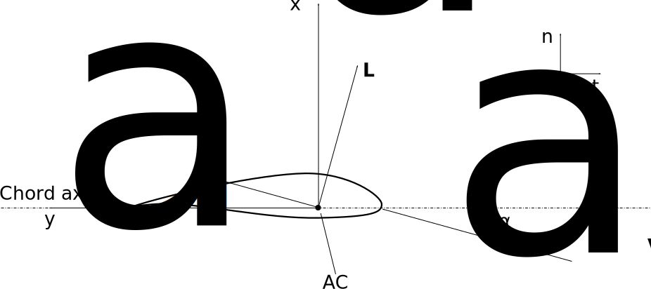
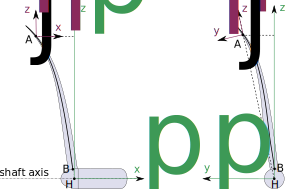
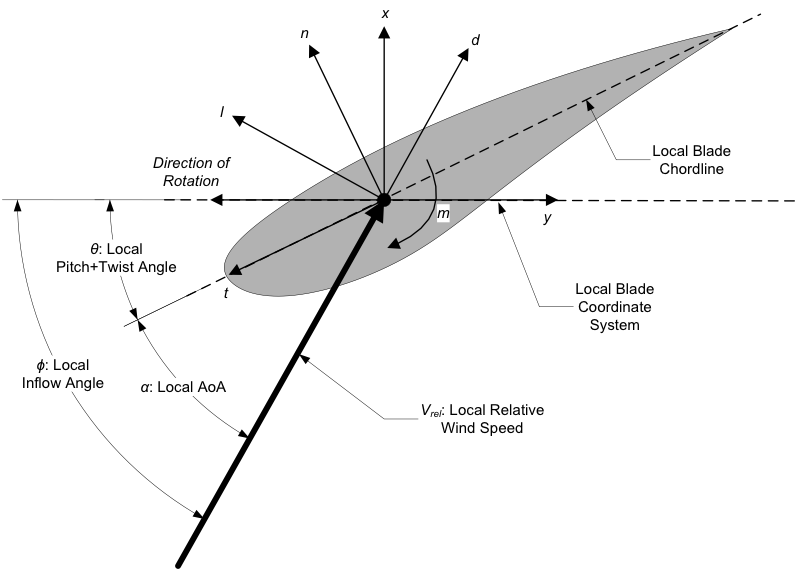

.. _ad_coordsys:

Coordinate systems
==================

AeroDyn uses different coordinate system for its internal computations and its outputs.
The output channels are typically suffixed with a letter corresponding to the coordinate system being used:

* (i): inertial system
* (h): hub system
* (p): polar system
* (l): local-polar system
* None or (w): the legacy output system.
* (n-t): the legacy airfoil system.

The different systems are described below.

Inertial system (i)
-------------------

The inertial system  :math:`(i)` is the global system used by OpenFAST (see ElastoDyn documentation).

Hub system (h)
--------------

The hub system  :math:`(h)` rotates along the :math:`x_h` axis based on the shaft azimuthal position :math:`\psi` (see ElastoDyn documentation).

Cone system (c)
---------------

The cone system  :math:`(c)` is not directly used by AeroDyn (see ElastoDyn documentation).

Blade system (b)
----------------

The blade system  :math:`(c)` is not directly used by AeroDyn (see ElastoDyn documentation).

Polar system (p)
----------------

The polar system :math:`(p_k)` is constructed from the hub coordinate system :math:`(h)` 
by a rotation about the :math:`x_h` axis, which corresponds to the fixed azimuthal offset :math:`psi_{0,k}` of each blade :math:`k` (the blades are distributed evenly across the azimuth).
For conciseness we refer to this system as the :math:`(p)` system.
If the number of blade is written :math:`n_B`, the azimuthal offset for blade :math:`k` is:

.. math::

   \begin{aligned}
      \psi_{0,k} = 2 \pi \frac{k-1}{n_B}
   \end{aligned}

For blade 1, :math:`\psi_{0,1}=0`.

The :math:`x_{p,k}` axis is along the hub x-axis.
The :math:`z_{p,k}` axis would correspond to the :math:`z` axis of the blade if no coning was present.

Airfoil system (a)
------------------

The airfoil section system :math:`(a_{_{kj}})`, or :math:`(a)` for short, is the coordinate system where Blade Element Theory is applied, and where the airfoil shape and polar data are given. 
The airfoil coordinate system, :math:`(a_{_{kj}})` is defined for each blade :math:`k` and each blade node :math:`j`. 
The :math:`y_a` axis is along the airfoil chord (tangential to chord), towards the trailing
edge.
The :math:`x_a` axis is normal to chord, towards the suction side (for an asymmetric airfoil).
See :numref:`ad_cs_airfoil`.

.. _ad_cs_airfoil:

   The airfoil (a) coordinate system.

The :math:`(a)` system is where Blade Element Theory (BET) is applied: the angle of attack, :math:`\alpha`, the lift, :math:`L`, and drag, :math:`D`, are all defined in the :math:`x_a-y_a` plane.
The lifting line loads are computed in this system.
The relative wind in this system is the projection of the 3D
relative wind into the 2D plane of the :math:`(a)`-system, noted :math:`{}^{\perp_a}\boldsymbol{V}_\text{rel}` or :math:`\boldsymbol{V}_\text{rel,a}`. 

In the airfoil system, we have:

.. math::

   \begin{aligned}
      C_{x_a}  =  C_l(\alpha) \cos\alpha + C_d(\alpha)\sin\alpha % that's Cn
      ,\quad
      C_{y_a}  = -C_l(\alpha) \sin\alpha + C_d(\alpha)\cos\alpha % that's -Ct for the t of AeroDyn
      ,\quad
      C_{m_a} = C_m(\alpha)
     \end{aligned}

and the loads (per unit length) are:

.. math::

   \begin{aligned}
     f_{x_a} = \frac{1}{2}\rho V_{\text{rel},a}^2 c C_{x_a} 
     ,\quad
     f_{y_a} = \frac{1}{2}\rho V_{\text{rel},a}^2 c C_{y_a}
     ,\quad
     m_{z_a} = \frac{1}{2}\rho V_{\text{rel},a}^2 c^2 C_{m_a}
     \end{aligned}

Legacy (n-t) system
-------------------

In legacy AeroDyn code and documentation, the :math:`(n-t)` system is sometimes used.
The :math:`n`-axis corresponds to the :math:`x_a` axis (normal to chord).
The :math:`t`-axis corresponds to the :math:`-y_a` axis (opposite direction).

Local polar system (l)
----------------------

**Currently the local polar system is only used for output purposes. It will be used in the BEM implementation in future releases.**

The local polar coordinate system :math:`(l_{_{kj}})`, or :math:`(l)` for short, is similar to the polar coordinate system, but is rotated about the :math:`x_h` axis, such that the :math:`z_{l,kj}` axis passes through the deflected position of node :math:`j` of blade :math:`k`.

:math:`x_l` is along the hub :math:`x_h` axis,
and :math:`z_l` is the radial coordinate in the plane normal to the shaft axis. 
The coordinate system is illustrated in :numref:`ad_cs_localpolar` for a case with prebend only (left) and presweep only (right).

.. _ad_cs_localpolar:

   
   The polar (p) and local polar (l) coordinate systems. 
   Left: pure prebend. 
   Right: pure sweep.

The local polar coordinate system is defined for each blade node as follows. The position of a deflected blade node :math:`A_j` with respect to the hub :math:`H` is :

   .. math::

      \begin{aligned}
         \boldsymbol{r}_{HA_j} = \boldsymbol{r}_{A_j}-\boldsymbol{r}_H
      \end{aligned}

This vector is projected onto the rotor plane as follows:

   .. math::

      \begin{aligned}
         \boldsymbol{r}_{HA_j}^\perp = \mathop{\mathrm{\boldsymbol{\mathrm{P}}}}_{\boldsymbol{\hat{x}}_h}(\boldsymbol{r}_{HA_j}) = \boldsymbol{r}_{HA_j} - (\boldsymbol{\hat{x}}_h \cdot {\boldsymbol{r}_{HA_j}}) \boldsymbol{\hat{x}}_h
      \end{aligned}

The vectors of the local polar coordinate system are then defined as:

   .. math::

      \begin{aligned}
         \boldsymbol{\hat{x}}_{l} = \boldsymbol{\hat{x}}_h 
         ,\quad
         \boldsymbol{\hat{z}}_{l} = \frac{ \boldsymbol{r}_{HA_j}^\perp }{\lVert\boldsymbol{r}_{HA_j}\rVert}
         ,\quad
         \boldsymbol{\hat{y}}_{l} = \boldsymbol{\hat{z}}_h \times \boldsymbol{\hat{x}}_h
       \end{aligned}

The local polar coordinate systems of the different blade nodes differ from
an azimuthal rotation about the :math:`x_h` axis (and a translation
of origin about the :math:`x_h`-axis, which is mostly irrelevant).

Legacy local output system (w)
------------------------------

**Outputs of AeroDyn labeled "x" or "y" without any other letters defining the coordinate system are currently provided in the legacy output system.** (for instance :math:`F_x`, :math:`V_x`, or :math:`V_{dis,y}`).

We write :math:`(w)` the legacy output system of OpenFAST. The legacy output system has previously been documented using Figure :numref:`ad_blade_local_cs`.
The figure also shows the direction of the local angles and force components.
In this figure, :math:`x` should be understood as :math:`x_w` and :math:`y` as :math:`y_w`.
The figure is mostly valid if there is no prebend, precone or presweep. 

.. _ad_blade_local_cs:

   AeroDyn Legacy Local Output Coordinate System (Looking Toward the Tip, 
   from the Root) – l: Lift, d: Drag, m: Pitching, x: Normal (to Plane), 
   y: Tangential (to Plane), n: Normal (to Chord), 
   and t: Tangential (to Chord)

The :math:`(w_{kj})` is defined for each blade :math:`k` and node :math:`j`, written :math:`(w)` for conciseness. 
The :math:`(w)` system is a transformation of the airfoil system such that this system has no
rotation about the :math:`x` (sweep) or :math:`z` (pitch/twist) axis compared to the coned coordinate system.

   -  The :math:`y_w`-axis (in plane) of this system is orthogonal to
      the pitch axis, neglecting presweep and in-plane deflection.

   -  The :math:`x_w`-axis (out of plane) is normal to the deflected
      blade, including precurve and out-of-plane deflection.

   -  The :math:`z_w`-axis (radial) is tangent to the deflected blade,
      including precurve and out-of-plane deflection.

The system is constructed as follows in AeroDyn. First, the coned
coordinate system :math:`(c)` (located at the blade root, coned, but
without pitching) is defined using the following substeps and
matrices:

   -  :math:`\boldsymbol{R}_{bi}`: from inertial to blade root (the
      blade root is pitched by :math:`\theta_p`).

   -  :math:`\boldsymbol{R}_{hi}`: from inertial to hub.

   -  :math:`\boldsymbol{R}_{bh} = \boldsymbol{R}_{bi} \boldsymbol{R}_{hi}^t=\mathop{\mathrm{Euler}}(\theta_1, \theta_2, -\theta_p)`:
      from hub to blade. The third Euler angle from
      :math:`\boldsymbol{R}_{bh}` is the opposite of the pitch angle
      :math:`\theta_p` (wind turbines use a negative convention of pitch
      and twist about the :math:`z` axis). By setting this Euler angle
      to zero and constructing the transformation matrix from the two
      first angles, one obtains:

   -  :math:`\boldsymbol{R}_{ch}=\mathop{\mathrm{Euler}}(\theta_1, \theta_2,0)`:
      from hub to the coned coordinate system.

   -  :math:`\boldsymbol{R}_{ci}=\boldsymbol{R}_{ch} \boldsymbol{R}_{hi}`:
      from inertial to coned coordinate system.

Then, the :math:`(w)` system is defined for each airfoil cross
section:

   -  :math:`\boldsymbol{R}_{ai}`: from inertial to blade airfoil
      section (include elastic motions)

   -  From coned system to blade airfoil section:

      .. math::

         \begin{aligned}
                     \boldsymbol{R}_{ac}=\boldsymbol{R}_{ai}\boldsymbol{R}_{ci}^t=\mathop{\mathrm{Euler}}({}^w\!\tau,{}^w\!\kappa,-{}^w\!\beta)
                       \label{eq:R_acBetaFull}
           \end{aligned}

   where :math:`{}^w\!\beta` contains the full twist (aerodynamic,
   elastic and pitch), :math:`{}^w\!\tau` would be the toe angle (but
   it is not used) :math:`{}^w\!\kappa` is the cant angle (stored as
   ``Curve``). We use the supperscript :math:`w` because these angles
   are defined as part of the :math:`(w)` system.

   -  :math:`\boldsymbol{R}_{wc}=\mathop{\mathrm{Euler}}(0,{}^w\!\kappa,0)`:
      from coned system to :math:`w`-system. The :math:`(w)` system
      keeps only the rotation about :math:`y_c`
      (:math:`\approx`\ prebend), thereby neglecting the ones about
      :math:`x` (sweep) and :math:`z` (:math:`\approx` twist+pitch).

   -  :math:`\boldsymbol{R}_{wi}=\boldsymbol{R}_{wc}\boldsymbol{R}_{ci}`:
      from inertial system to :math:`w`-system

Tower system
------------

The local tower coordinate system is shown in :numref:`ad_tower_geom`.
