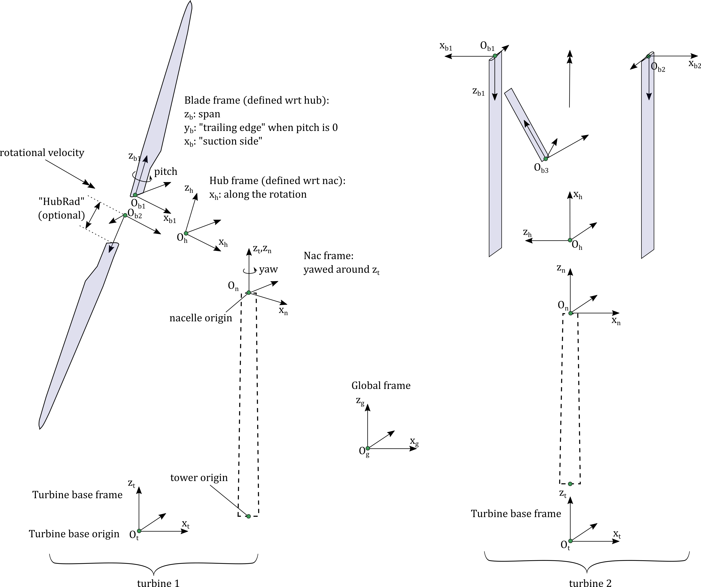

.. _ad_driver:

AeroDyn Driver
==============

A standalone AeroDyn driver is provided to perform aerodynamic simulations of rigid turbines 
undergoing rigid body motion (fixed, sinusoidal, or arbitrary). 
The standalone AeroDyn driver code improves on the functionality previously
available in the separate wind turbine rotor-performance tool WT\_Perf.
The driver also supports turbine configurations that are not currently supported by OpenFAST.

Examples of applications are:

- Simulation of horizontal/vertical axis wind turbine, kites, quad-rotors, multiple rotors and wings.
- Simulation with prescribed time series of wind speed, pitch, yaw, rotor speed.
- Combined case analyses to evaluate the turbine response at different operating conditions, for instance to compute the surfaces of power coefficient (C\ :sub:`P`), thrust coefficient (C\ :sub:`T`), and/or torque coefficient (C\ :sub:`Q`) as a function of tip-speed ratio (TSR) and blade-pitch angle. 
- Simulations with oscillatory motion of the tower base at different amplitudes and frequencies.

More details are provided below.

Compiling the driver
--------------------

The compilation steps for the AeroDyn driver are similar to the ones of OpenFAST (see :numref:`installation`).  When using the CMake workflow, the driver is compiled automatically when running `make`. To compile only the driver, use `make aerodyn_driver`. The driver will be located in the folder `/build/modules/aerodyn/`. A Visual Studio solution is available for Windows, in the folder  `/vs-build/AeroDyn`.

.. _addm_driver-input-file:

Driver inputs and options
-------------------------

**Main concepts**

The driver supports:

- two kinds of turbine definitions: basic (HAWT), and advanced. 
- two kinds of inflow definition: basic (uniform power law), and advanced (InflowWind)
- three types of analyses (`AnalysisType`): 1) one simulation of one or multiple turbines, 2) one simulation of one wind turbine under time-dependent inputs, 3) combined cases of one wind turbine

The current limitations are:

- The number of nodes per blades have to be the same for all blades and all rotors 
- A turbine has only one (optional) tower
- Analysis Types 2 and 3 are limited to 1 turbine

More details are provided below, where the different sections of the input file are described.

**Header and input configuration**

The input file starts with a header, the user can place a relevant description of the model on the second line.
The input configuration section follows. 
The user can toggle the flag `Echo` to write back the input file, as parsed by the driver, to disk.
The `MHK` switch allows the user to specify whether or not the turbine is an MHK turbine. `MHK=0` denotes not an MHK turbine, `MHK=1` denotes a fixed MHK turbine, and `MHK=2` denotes a floating MHK turbine.
The driver supports three kinds of analyses, but not all turbine formats and inflow types are available for each analysis type: 

- `AnalysisType=1`: Simulation of one or multiple rotors with basic (HAWT) or arbitrary geometries (HAWT/VAWT, quad-rotor, etc.), with basic or advanced wind inputs, and optional time-varying motion of the tower base, nacelle and individual pitch angles. Arbitrary motion or sinusoidal motion of the tower base are possible.
- `AnalysisType=2`: Simulation of one turbine with basic time-varying wind, nacelle motion, pitch. See "Time-dependent analysis" below.
- `AnalysisType=3`: Combined cases analyses of one turbine with basic steady wind. A table of cases is run sequentially by the driver. See "Combined-Case analysis" below.

The section follows with the definition of the total simulation time (`TMax`) and the time step used for the simulation (`DT`). These inputs are used for `AnalysisType=1` and `AnalysisType=2`.
The user specifies the location of the AeroDyn primary file via the variable `AeroFile`. The path can be absolute or relative to the AeroDyn driver file.

An example of header and input configuration is given below:

.. code::

    ----- AeroDyn Driver Input File ---------------------------------------------------------
    Three bladed wind turbine, using basic geometry input
    ----- Input Configuration -------------------------------------------------------
    False           Echo         - Echo input parameters to "<rootname>.ech"?
            0       MHK          - MHK turbine type (switch) {0: not an MHK turbine, 1: fixed MHK turbine, 2: floating MHK turbine}
            3       AnalysisType - {1: multiple turbines, one simulation, 2: one turbine, one time-dependent simulation, 3: one turbine, combined-cases}
           11.0     TMax         - Total run time [used only when AnalysisType/=3] (s)
            0.5     DT           - Simulation time step [used only when AnalysisType/=3] (s)
    "AD.dat"        AeroFile     - Name of the primary AeroDyn input file

**Environmental conditions**

Environmental conditions are specified here and passed to AeroDyn. `FldDens` (equivalent to `AirDens` in the AeroDyn primary input file) specifies the fluid density and must be a value greater than zero; a typical value is around 1.225 kg/m\ :sup:`3` for air (wind turbines) and 1025 kg/m\ :sup:`3` for seawater (MHK turbines). `KinVisc` specifies the kinematic viscosity of the fluid (used in the Reynolds number calculation); a typical value is around 1.460E-5 m\ :sup:`2`/s for air (wind turbines) and 1.004E-6 m\ :sup:`2`/s for seawater (MHK turbines). `SpdSound` is the speed of sound in the fluid (used to calculate the Mach number within the unsteady airfoil aerodynamics calculations); a typical value is around 340.3 m/s for air (wind turbines) and 1500 m/s for seawater (MHK turbines). The next two parameters in this section are only used when `CavitCheck = TRUE` for MHK turbines. `Patm` is the atmospheric pressure above the free surface; typically around 101,325 Pa. `Pvap` is the vapor pressure of the fluid; for seawater this is typically around 2,000 Pa. `WtrDpth` is the water depth from the seabed to the mean sea level (MSL).

**Inflow data**

The inflow can be provided in two ways:

- basic (`CompInflow=0`): uniform wind with a power law shear. The wind is defined using a reference height (`RefHt`), a power law exponent (`PLExp`), and the wind speed at reference height (`HWindSpeed`). With `AnalysisType=2`, the reference wind speed and power law are defined separately as time series (see "time-dependent analysis"). With `AnalysisType=3`, these parameters are provided in a separate table (see "Combined-Case analyses"). The reference height is used for all analyses types, since this height may be different than the hub height. The wind at a given node is determined using the following equation, where :math:`Z` is the instantaneous elevation of the node above the ground for land-based wind turbines, above the mean sea level (MSL) for offshore wind turbines, or above the seabed for fixed and floating MHK turbines.

.. math::

   U(Z) = \mathrm{HWindSpeed} \left( \frac{Z}{\mathrm{RefHt}} \right)^\mathrm{PLExp}

- advanced (`CompInflow=1`): the InflowWind module is used to compute the inflow, and all available options of InflowWind are then available. The user needs to provide the (relative or absolute) path of the InflowWind input file (`InflowFile`). This feature is limited to `AnalysisType=1`.

An example of inputs is given below:

.. code::

    ----- Inflow Data ---------------------------------------------------------------
              0   CompInflow  - Compute inflow wind velocities (switch) {0=Steady Wind; 1=InflowWind}
    "unused"      InflowFile  - Name of the InflowWind input file [used only when CompInflow=1]
            9.0   HWindSpeed  - Horizontal wind speed   [used only when CompInflow=0 and AnalysisType=1] (m/s)
            140   RefHt       - Reference height for horizontal wind speed [used only when CompInflow=0]  (m)
           0.10   PLExp       - Power law exponent   [used only when CompInflow=0 and AnalysisType=1]                        (-)

**Turbine data**

The user specifies the number of turbines as follows:

.. code:: 

    ----- Turbine Data --------------------------------------------------------------
    1   NumTurbines  - Number of turbines (should be 1 for AnalysisType=2 or AnalysisType=3)

As noted in the comment, the number of turbines should be 1 for `AnalysisType=2` and `AnalysisType=3`.
After this section, the geometry and motion is provided for each turbine. Inputs for each turbine must have the suffix `(i)` where `i` is the turbine number (even with `NumTurbines=1`, then `i=1`).
Outputs for each turbine will be written to distinct files, with the suffix `.Ti` where `i` is the turbine number (the suffix is not added when only 1 turbine is used).

An example of configuration with two wind turbines is shown in :numref:`fig:MultiRotor`. The figure defines the different frames and origin associated with each turbine: the turbine base frame (t), nacelle frame (n), hub frame (h), and blade frames (b). The notations and conventions follow the OpenFAST frames, except that the turbine frame does not have its origin at the tower base.
Prescribed motions of the turbine occur at the turbine origin.
Yawing occurs around the :math:`z_n` axis,  the rotor rotates about the :math:`x_h` axis, and blade pitching occurs around the individual :math:`z_b` axes. The definitions of the different frames are standardized when using a basic (HAWT) input format definition, and are arbitrarily defined when using the advanced input format. More details are given in the next paragraph.

           
   Definition of multiple rotors. 

**Turbine geometry definition**

Two turbine input formats are supported:

- basic (`BasicHAWTFormat=True`): Basic horizontal axis wind turbine (HAWT) format.
  In this format, the turbine geometry is entirely determined by the number of blades (`NumBlades`), the hub radius (`HubRad`), the hub height  (`HubHt`), the overhang (`Overhang`), the shaft tilt (`ShftTilt`), the precone (`Precone`), and the vertical distance from the tower-top to the rotor shaft (`Twr2Shft`), as shown in :numref:`fig:BasicGeometry`.
  The definition of each parameter follows the ElastoDyn convention. For example, `HubRad` specifies the radius from the center-of-rotation to the blade root along the (possibly preconed) blade-pitch axis and must be greater than zero. `HubHt` specifies the elevation of the hub center above the ground for land-based wind turbines, relative to the mean sea level (MSL) for offshore wind and floating MHK turbines, or relative to the seabed for fixed MHK turbines. For floating MHK turbines with the hub positioned below the MSL, `HubHt` should be negative. `Overhang` specifies the distance along the (possibly tilted) rotor shaft between the tower centerline and hub center and is positive downwind (use a negative number for upwind rotors). `ShftTilt` is the angle (in degrees) between the rotor shaft and the horizontal plane, and positive `ShftTilt` means that the downwind end of the shaft is the highest (upwind turbines have negative `ShftTilt` for improved tower clearance). For floating MHK turbines, the sign of `ShftTilt` should be flipped to achieve an equivalent shaft tilt. For example, floating, upwind MHK turbines have positive `ShftTilt` for improved tower clearance. `Precone` is the angle (in degrees) between a flat rotor disk and the cone swept by the blades, positive downwind (upwind turbines have negative `Precone` for improved tower clearance). `Twr2Shft` is the vertical distance from the tower-top to the rotor shaft. For floating MHK turbines with the rotor below the tower-top, this value should be negative.

  .. figure:: figs/aerodyn_driver_geom.png
   :width: 60%
   :name: fig:BasicGeometry

   Definition of basic turbine geometry.

  Additionally, the user needs to provide the origin of the turbine base at `t=0` (`BaseOriginInit`). For fixed MHK turbines, `BaseOriginInit` is input relative to the seabed. For floating MHK turbines, `BaseOriginInit` is input relative to the MSL, and the vertical component is negative if the turbine base is below the MSL. An example of basic input is given below:

.. code::

    ----- Turbine(1) Geometry -------------------------------------------------------
            True    BasicHAWTFormat(1) - Flag to switch between basic or generic input format {True: next 7 lines are basic inputs, False: Base/Twr/Nac/Hub/Bld geometry and motion must follow}
           0,0,0    BaseOriginInit(1) - Coordinates of turbine base in global coordinates (m)
               3    NumBlades(1)    - Number of blades (-)
              3.    HubRad(1)       - Hub radius (m)
          140.82513 HubHt(1)        - Hub height (m)
              -7    Overhang(1)     - Overhang (m)
              -6    ShftTilt(1)     - Shaft tilt (deg)
              -4    Precone(1)      - Blade precone (deg)
         3.09343    Twr2Shft(1)     - Vertical distance from the tower-top to the rotor shaft (m)

- advanced (`BasicHAWTFormat=False`): The position and orientation of the tower base, nacelle, hub, and individual blades can be arbitrarily defined. This can be used for HAWT and any other turbine concepts. 
  The definition of the different frames are given in :numref:`fig:MultiRotor`.
  The position (`BaseOriginInit`) and orientation (`BaseOrientationInit`) of the turbine base frame are defined with respect to the global frame. The vertical component of `BaseOriginInit` is defined relative to the seabed for fixed MHK turbines and relative to the MSL for floating MHK turbines. Orientations are given using the values of three successive rotations (x-y-z Euler angle sequence). If the base undergoes a motion, the orientation of the base frame will consist of the time-varying rotations followed by these initial rotations.

  A flag indicating whether the turbine has a tower is given on the next line (`HasTower`). This flag currently affects the VTK outputs and does not have an impact on AeroDyn yet. The user still has to provide tower input data in AeroDyn for each turbine (see :numref:`ad_inputs_multirot`).
  The next line indicates which projection AeroDyn is to use in its calculation. It is recommended to use `HAWTprojection=True` for HAWT, which is the default projection used in AeroDyn (projects on the coned-pitched axis). For other rotor concepts, set `HAWTprojection=False`.
  The following lines indicate the position and orientations of the tower, nacelle and hub. 

  The tower and the nacelle are defined with respect to the turbine base (t) origin and frame.
  The tower top is assumed to coincide with the nacelle origin. 
  The tower stations defined in the AeroDyn input file are assumed to be given with respect to the tower origin, unlike OpenFAST which uses ground/MSL as a reference (see :numref:`ad_inputs_multirot`).
  For floating MHK turbines, the vertical components of `TwrOrigin_t` and `NacOrigin_t` are negative if the tower origin and nacelle origin are below the turbine base.
  The hub is defined with respect to the nacelle origin and frame (n). The vertical component of `HubOrigin_n` is negative for floating MHK turbines if the hub origin is below the nacelle origin (i.e., tower top).

  The definitions of the blades follow, starting with the number of blades `NumBlades`. A rotor with zero blades is supported and can be used to model an isolated tower.
  If tower shadow/potential is used in AeroDyn, then the isolated tower will disturb the flow of the vortex wake when OLAF is used.
  When BEM is used, the flow of the blades of a given turbine are disturbed only by that turbine's tower.
  The inputs for turbine `i` and blade `j` are labelled `(i_j)`.
  The origin (`BldOrigin_h`) and orientation (`BldOrientation_h`) of each blade are given with respect to the hub origin and frame (h).
  Hub radius inputs (`BldHubRad_Bl`) are provided for convenience. They will effectively offset the blades origin along the :math:`z_b` axis.
  An example of input for an advanced geometry definition is given below. 
  This example corresponds to typical values for a 3-bladed upwind HAWT, with 6 degrees of tilt (-6 in OpenFAST) and -4 degrees of precone (blades inclined upstream).

.. code::

    ----- Turbine(1) Geometry -------------------------------------------------------
         False      BasicHAWTFormat(1) - Flag to switch between basic or generic input format {True: next 7 lines are basic inputs, False: Base/Twr/Nac/Hub/Bld geometry and motion must follow}
    0,0,0           BaseOriginInit(1)      - x,y,z coordinates of turbine base origin (m)
    0,0,0           BaseOrientationInit(1) - successive rotations (theta_x, theta_y, theta_z) defining initial orientation of the base frame from the global frame (e.g. roll, tilt, yaw) (deg)
    True            HasTower(1)            - True if turbine has a tower (flag)
    True            HAWTprojection(1)      - True if turbine is a horizontal axis turbine (for AeroDyn projections) (flag)
    0,0,0           TwrOrigin_t(1)         - Coordinate of tower base in base coordinates [used only when HasTower is True] (m)
    0,0,137         NacOrigin_t(1)         - x,y,z coordinates of nacelle origin (and tower top) from base, in base coordinates (m)
    -6.96,0.,3.82   HubOrigin_n(1)         - x,y,z coordinates of hub origin from nacelle origin, in nacelle coordinates (m)
    0,6,0           HubOrientation_n(1)    - successive rotations (theta_x, theta_y, theta_z) defining initial orientation of the hub frame from the nacelle frame (e.g. roll, tilt, yaw). The x axis needs to be aligned with the rotational speed. (deg)
    ----- Turbine(1) Blades -----------------------------------------------------------------
    3               NumBlades(1)          - Number of blades for current rotor (-)
    0,0,0           BldOrigin_h(1_1)      - Origin of blade 1 wrt. hub origin in hub coordinates (m)
    0,0,0           BldOrigin_h(1_2)      - Origin of blade 2 wrt. hub origin in hub coordinates (m)
    0,0,0           BldOrigin_h(1_3)      - Origin of blade 3 wrt. hub origin in hub coordinates (m)
    0  ,-4,0        BldOrientation_h(1_1) - successive rotations (theta_x, theta_y, theta_z) defining initial orientation of the blade frame from the hub frame such that the "z" is along span, "y" along trailing edge without pitch (azimuth, precone, pitch) (deg)
    120,-4,0        BldOrientation_h(1_2) - successive rotations (theta_x, theta_y, theta_z) defining initial orientation of the blade frame from the hub frame such that the "z" is along span, "y" along trailing edge without pitch (azimuth, precone, pitch) (deg)
    240,-4,0        BldOrientation_h(1_3) - successive rotations (theta_x, theta_y, theta_z) defining initial orientation of the blade frame from the hub frame such that the "z" is along span, "y" along trailing edge without pitch (azimuth, precone, pitch) (deg)
    3.0             BldHubRad_bl(1_1)     - z-offset in blade coordinates of blade 1 where radial input data start (m)
    3.0             BldHubRad_bl(1_2)     - z-offset in blade coordinates of blade 2 where radial input data start (m)
    3.0             BldHubRad_bl(1_3)     - z-offset in blade coordinates of blade 3 where radial input data start (m)

**Turbine motion definition**

The definition of the turbine motion is only used when `AnalysisType=1`, but must always be present in the input file. 

The base motion is given in the same way for basic or advanced geometries.
The motion of the base may be: fixed (`BaseMotionType=0`), sinusoidal (`BaseMotionType=1`) or arbitrary (`BaseMotionType=2`). 
The turbine base motion is applied at each time step before applying the initial position and orientation of the turbine base.
A sinusoidal motion implies that one degree of freedom (`DegreeOfFreedom`) of the turbine base is moving according to a sine function of a given amplitude (`Amplitude`) and frequency (`Frequency`, in Hz), with zero phase.
The 6 possible degrees of freedom correspond to translations or rotations of the base frame in global coordinates (g) (e.g. surge, sway, heave, roll, pitch, yaw).
An arbitrary motion is specified via a CSV file (`BaseMotionFileName`) which contains 19 columns: time, 3 translations (global), three successive rotations (global), 3 translation velocities, 3 rotational velocities (omega, in global), 3 translational accelerations and 3 rotational accelerations (alpha, in global). Example of arbitrary input files are given in :numref:`ad_inputfiles_examples`.
The time vector in the motion file has to be ascending, but does not need to be linear. Linear interpolation is used by the driver to determine inputs at a given time.
The displacements/orientations, velocities, and accelerations are not checked internally for consistency.

An example of inputs for a sinusoidal surge motion is given below:

.. code::

    ----- Turbine(1) Motion [used only when AnalysisType=1] --------------------------
    1         BaseMotionType(1)      - Type of motion prescribed for this base {0: fixed, 1: Sinusoidal motion, 2: arbitrary motion} (flag)
    1         DegreeOfFreedom(1)     - {1:xg, 2:yg, 3:zg, 4:theta_xg, 5:theta_yg, 6:theta_zg} [used only when BaseMotionType=1] (flag)
    5.0       Amplitude(1)           - Amplitude of sinusoidal motion  [used only when BaseMotionType=1] (m or rad)
    0.1       Frequency(1)           - Frequency of sinusoidal motion  [used only when BaseMotionType=1] (Hz)
    "unused"  BaseMotionFileName(1)  - Filename containing arbitrary base motion (19 columns: Time, x, y, z, theta_x, ..., alpha_z)  [used only when BaseMotionType=2]

The different inputs for the basic and advanced geometries are given below:

- basic: The motion of a basic turbine consists of a constant nacelle yaw (`NacYaw`, positive rotation of the nacelle about the vertical tower axis, counterclockwise when looking downward), rotor speed (`RotSpeed`, positive clockwise looking downwind), and blade pitch (`BldPitch`, negative around :math:`z_b`). For floating MHK turbines, `NacYaw` should be flipped to achieve the same global yaw direction (i.e., positive rotation of the nacelle about the vertical tower axis, clockwise when looking downward).
  Examples are given below:

.. code::

    0         NacYaw(1)        - Yaw angle (about z_t) of the nacelle (deg)
    7         RotSpeed(1)      - Rotational speed of rotor in rotor coordinates (rpm)
    1         BldPitch(1)      - Blades pitch (deg)

- advanced: When an advanced geometry is provided and when the number of blades is non-zero, the motion section contains options for the nacelle motion, rotor motion and individual blade pitch motion. 
  The syntax for each of these motions consists of defining a type (fixed or time-varying), a value for the fixed case or a file for the time-varying case.
  The input files are CSV files containing time, position, speed and acceleration. Examples of files are given in :numref:`ad_inputfiles_examples`.
  The displacements/orientations, velocities, and accelerations are not checked internally for consistency.
  The time vector in the motion file has to be ascending, but does not need to be linear. Linear interpolation is used by the driver to determine inputs at a given time.
  The angular and rotational data in the CSV file are defined in rad and rad/s, whereas they are defined in deg and rpm in the driver input file.
  An example is given below for a fixed rotational speed:

.. code::

    0         NacMotionType(1)       - Type of motion prescribed for the nacelle {0: fixed yaw, 1: time varying yaw angle} (flag)
    0         NacYaw(1)              - Yaw angle (about z_t) of the nacelle [user only when NacMotionType=0] (deg)
    "unused"  NacMotionFileName(1)   - Filename containing yaw motion [used only when NacMotionType=1]
    0         RotMotionType(1)       - Type of motion prescribed for this rotor {0: constant rotation, 1: time varying rotation} (flag)
    6.0       RotSpeed(1)            - Rotational speed of rotor in rotor coordinates [used only when RotorMotionType=0] (rpm)
    "unused"  RotMotionFileName(1)   - Filename containing rotor motion [used only when RotorMotionType=1]
    0         BldMotionType(1)       - Type of pitch motion prescribed for the blades {0: fixed, 1: time varying pitch} (flag)
    0         BldPitch(1_1)          - Blade 1 pitch [used only when BldMotionType=0] (deg)
    0         BldPitch(1_2)          - Blade 2 pitch [used only when BldMotionType=0] (deg)
    0         BldPitch(1_3)          - Blade 3 pitch [used only when BldMotionType=0] (deg)
    "unused"  BldMotionFileName(1_1) - Filename containing blade pitch motion [used only when BldMotionType=1]
    "unused"  BldMotionFileName(1_2) - Filename containing blade pitch motion [used only when BldMotionType=1]
    "unused"  BldMotionFileName(1_3) - Filename containing blade pitch motion [used only when BldMotionType=1]

  

**Time-dependent analysis**

Time-dependent analyses are used to vary a few standard variables during the simulation.
The variables are: reference wind speed (`HWndSpeed`), power law exponent (`PLExp`), rotor speed (`RotSpd`), collective pitch (`Pitch`), and nacelle yaw (`Yaw`).
The time series of each variable are provided in a CSV file (`TimeAnalysisFileName`).
Time-dependent analyses are selected using `AnalysisType=2`. They are restricted to one turbine (`numTurbines=1`).

.. code:: 

    ----- Time-dependent Analysis [used only when AnalysisType=2 and numTurbines=1] ------
    "TimeSeries.csv" TimeAnalysisFileName - Filename containing time series (6 column: Time, HWndSpeed, PLExp, RotSpd, Pitch, Yaw). 

**Combined-case analyses**

Combined-case analyses are used to run parametric studies in one single run.
They are selected using `AnalysisType=3`, and are restricted to one turbine (`numTurbines=1`).
The variables that can be changed for each simulation are: reference wind speed (`HWndSpeed`),  power law exponent (`PLExp`), rotor speed (`RotSpd`), collective pitch (`Pitch`), nacelle yaw (`Yaw`), time step (`dT`), simulation time (`Tmax`), and sinusoidal motion parameters (degree of freedom, `DOF`, amplitude and frequency).
When `DOF=0`, the turbine base is fixed.

.. code::

    ----- Combined-Case Analysis [used only when AnalysisType=3 and numTubines=1] ------
             4  NumCases     - Number of cases to run
    HWndSpeed  PLExp   RotSpd   Pitch   Yaw    dT      Tmax   DOF   Amplitude  Frequency 
    (m/s)      (-)     (rpm)    (deg)  (deg)   (s)     (s)    (-)  (m or rad)  (Hz)
       8.      0.0       6.     0.      0.     1.0     100     0      0         0.0
       8.      0.0       6.     0.      0.     1.0     100     0      0         0.0
       9.      0.1       7.     1.      0.     0.5      50     1      5.0       0.1 
       9.      0.2       8.     2.      0.     0.5      50     1      2.0       0.2 

**Outputs**

The output section controls the format of the tabular output file and VTK files, similar to the OpenFAST outputs.
The user can control the hub radius and nacelle dimension for the VTK visualization. The hub is represented as a sphere of radius (`VTKHubRad`), and the nacelle with a parallelepiped defined using an origin and three lengths parallel to the nacelle coordinates (`VTKNacDim`).

.. code::

    ----- Output Settings -------------------------------------------------------------------
      "ES15.8E2"     OutFmt      - Format used for text tabular output, excluding the time channel.  Resulting field should be 10 characters. (quoted string)
    2                OutFileFmt  - Format for tabular (time-marching) output file (switch) {1: text file [<RootName>.out], 2: binary file [<RootName>.outb], 3: both}
    0                WrVTK       - VTK visualization data output: (switch) {0=none; 1=init; 2=animation}
    2                VTKHubRad   - HubRadius for VTK visualization (m)
    -1,-1,-1,2,2,2   VTKNacDim   - Nacelle Dimension for VTK visualization x0,y0,z0,Lx,Ly,Lz (m)

.. _ad_inputs_multirot:

AeroDyn inputs for multiple turbines
------------------------------------

No changes are required to the AeroDyn input files when one turbine is used. 
To minimize the impact of the multiple-turbines implementation, the driver currently uses only one AeroDyn input file for all turbines. 
This means that the AeroDyn options are currently the same for all rotors.

The definition of the blade files and the tower, hub, and nacelle inputs needs to be adapted when more than three blades are used and more than one turbine is used.

**Blade files**

The legacy AeroDyn format requires a minimum of three blade file names. 
For this reason, the blades of all rotors are currently indicated successively in the `ADBlFile` list. 
The list is populated by looping on turbines and turbine blades, with the blade index being the fastest index.
For now, the number of stations have to be the same for all blades.

An example is given below for two turbines, the first one having 3 blades, the second 2 blades:

.. code::

    ======  Rotor/Blade Properties  =====================================================================
    True                   UseBlCm     - Include aerodynamic pitching moment in calculations?  (flag)
    "AD_Turbine1_blade1.dat" ADBlFile(1) - Name of file containing distributed aerodynamic properties for Blade #1 (-)
    "AD_Turbine1_blade1.dat" ADBlFile(2) - Name of file containing distributed aerodynamic properties for Blade #2 (-)
    "AD_Turbine1_blade3.dat" ADBlFile(3) - Name of file containing distributed aerodynamic properties for Blade #3 (-)
    "AD_Turbine2_blade1.dat" ADBlFile(4) - Name of file containing distributed aerodynamic properties for Blade #4 (-)
    "AD_Turbine2_blade2.dat" ADBlFile(5) - Name of file containing distributed aerodynamic properties for Blade #5 (-) 

**Hub and nacelle inputs**

The sections defining the hub and nacelle buoyancy parameters must also be reproduced for each turbine.

An example is given below for two turbines:

.. code::

    ======  Hub Properties ============================================================================== [used only when Buoyancy=True]
    7.0   VolHub             - Hub volume (m^3)
    0.0   HubCenBx           - Hub center of buoyancy x direction offset (m)
    ======  Hub Properties ============================================================================== [used only when Buoyancy=True]
    5.0   VolHub             - Hub volume (m^3)
    0.2   HubCenBx           - Hub center of buoyancy x direction offset (m)
    ======  Nacelle Properties ========================================================================== [used only when Buoyancy=True]
    32.0  VolNac             - Nacelle volume (m^3)
    0.3, 0.0, 0.05 NacCenB   - Position of nacelle center of buoyancy from yaw bearing in nacelle coordinates (m)
    ======  Nacelle Properties ========================================================================== [used only when Buoyancy=True]
    30.0  VolNac             - Nacelle volume (m^3)
    0.5, 0.1, 0.05 NacCenB   - Position of nacelle center of buoyancy from yaw bearing in nacelle coordinates (m)

**Aerodynamic tower inputs**

The entire tower input section of AeroDyn has to be reproduced for each turbine, including turbines that are set not to have a tower (`hasTower=False`).
The number of stations may differ for each turbine.
The tower stations defined in the AeroDyn input file are assumed to be given with respect to the tower origin, unlike OpenFAST which uses ground/MSL as a reference.

An example is given below for two turbines:

.. code::

    ======  Turbine(1) Tower Influence and Aerodynamics ================================================ [used only when TwrPotent/=0, TwrShadow/=0, TwrAero=True, or Buoyancy=True]
    2   NumTwrNds   - Number of tower nodes used in the analysis  (-) [used only when TwrPotent/=0, TwrShadow/=0, TwrAero=True, or Buoyancy=True]
    TwrElev TwrDiam  TwrCd    TwrTI   TwrCb
    (m)       (m)     (-)     (-)     (-)
     0.0      2.0     1.0    0.1      0.0
    10.0      1.0     1.0    0.1      0.0
    ======  Turbine(2) Tower Influence and Aerodynamics ================================================ [used only when TwrPotent/=0, TwrShadow/=0, TwrAero=True, or Buoyancy=True]
    3   NumTwrNds   - Number of tower nodes used in the analysis  (-) [used only when TwrPotent/=0, TwrShadow/=0, TwrAero=True, or Buoyancy=True]
    TwrElev TwrDiam  TwrCd   TwrTI   TwrCb
    (m)       (m)     (-)    (-)     (-)
     0.0      4.0     1.0    0.1     0.0
    15.0      3.0     1.0    0.1     0.0
    30.0      2.0     1.0    0.1     0.0

.. _ad_inputfiles_examples:

Examples of driver input files
------------------------------

Working examples that use the different features of the driver are given in the r-test repository:

- `Dev branch <https://github.com/OpenFAST/r-test/tree/dev/modules/aerodyn/>`_ .
- `Main branch <https://github.com/OpenFAST/r-test/tree/main/modules/aerodyn/>`_ .

Main Driver Input Files
~~~~~~~~~~~~~~~~~~~~~~~

An example of an AeroDyn driver for a basic inflow, basic HAWT, and combined case analyses is given below:

.. code::

    ----- AeroDyn Driver Input File ---------------------------------------------------------
    Three bladed wind turbine, using basic geometry input
    ----- Input Configuration ---------------------------------------------------------------
    False           Echo         - Echo input parameters to "<rootname>.ech"?
            0       MHK          - MHK turbine type (switch) {0: not an MHK turbine, 1: fixed MHK turbine, 2: floating MHK turbine}
            3       AnalysisType - {1: multiple turbines, one simulation, 2: one turbine, one time-dependent simulation, 3: one turbine, combined cases}
           11.0     TMax         - Total run time [used only when AnalysisType/=3] (s)
            0.5     DT           - Simulation time step [used only when AnalysisType/=3] (s)
    "./AD.dat"      AeroFile - Name of the primary AeroDyn input file
    ----- Environmental Conditions ----------------------------------------------------------
    1.225000000000000e+00     FldDens      - Density of working fluid (kg/m^3)
    1.477551020408163e-05     KinVisc      - Kinematic viscosity of working fluid (m^2/s)
    3.350000000000000e+02     SpdSound     - Speed of sound in working fluid (m/s)
    1.035000000000000e+05     Patm         - Atmospheric pressure (Pa) [used only for an MHK turbine cavitation check]
    1.700000000000000e+03     Pvap         - Vapour pressure of working fluid (Pa) [used only for an MHK turbine cavitation check]
                        0     WtrDpth      - Water depth (m)
    ----- Inflow Data -----------------------------------------------------------------------
              0      CompInflow  - Compute inflow wind velocities (switch) {0=Steady Wind; 1=InflowWind}
    "unused"         InflowFile  - Name of the InflowWind input file [used only when CompInflow=1]
            9.0      HWindSpeed  - Horizontal wind speed   [used only when CompInflow=0 and AnalysisType=1] (m/s)
            140      RefHt       - Reference height for horizontal wind speed [used only when CompInflow=0]  (m)
           0.10      PLExp       - Power law exponent   [used only when CompInflow=0 and AnalysisType=1]                        (-)
    ----- Turbine Data ----------------------------------------------------------------------
    1               NumTurbines  - Number of turbines
    ----- Turbine(1) Geometry ---------------------------------------------------------------
            True    BasicHAWTFormat(1) - Flag to switch between basic or generic input format {True: next 7 lines are basic inputs, False: Base/Twr/Nac/Hub/Bld geometry and motion must follow}
           0,0,0    BaseOriginInit(1) - Coordinate of tower base in base coordinates (m)
               3    NumBlades(1)    - Number of blades (-)
              3.    HubRad(1)       - Hub radius (m)
          140.82513 HubHt(1)        - Hub height (m)
              -7    Overhang(1)     - Overhang (m)
              -6    ShftTilt(1)     - Shaft tilt (deg)
              -4    Precone(1)      - Blade precone (deg)
         3.09343    Twr2Shft(1)     - Vertical distance from the tower-top to the rotor shaft (m)
    ----- Turbine(1) Motion [used only when AnalysisType=1] ---------------------------------
    1               BaseMotionType(1)      - Type of motion prescribed for this base {0: fixed, 1: Sinusoidal motion, 2: arbitrary motion} (flag)
    1               DegreeOfFreedom(1)     - {1:xg, 2:yg, 3:zg, 4:theta_xg, 5:theta_yg, 6:theta_zg} [used only when BaseMotionType=1] (flag)
    5.0             Amplitude(1)           - Amplitude of sinusoidal motion  [used only when BaseMotionType=1] (m or rad)
    0.1             Frequency(1)           - Frequency of sinusoidal motion  [used only when BaseMotionType=1] (Hz)
    ""              BaseMotionFileName(1)  - Filename containing arbitrary base motion (19 columns: Time, x, y, z, theta_x, ..., alpha_z)  [used only when BaseMotionType=2]
    0               NacYaw(1)              - Yaw angle (about z_t) of the nacelle (deg)
    7               RotSpeed(1)            - Rotational speed of rotor in rotor coordinates (rpm)
    1               BldPitch(1)            - Blade 1 pitch (deg)
    ----- Time-dependent Analysis [used only when AnalysisType=2, numTurbines=1] ------------
    "unused"         TimeAnalysisFileName - Filename containing time series (6 column: Time, HWndSpeed, PLExp, RotSpd, Pitch, Yaw). 
    -----  Combined-Case Analysis [used only when AnalysisType=3, numTurbines=1 -------------
             4  NumCases     - Number of cases to run
    HWndSpeed  PLExp  RotSpd  Pitch   Yaw   dT    Tmax  DOF  Amplitude Frequency 
    (m/s)      (-)    (rpm)   (deg)  (deg)  (s)   (s)   (-)   (-)       (Hz)
      8.0      0.0     6.      0.      0.   1.0   100    0    0          0 
      8.0      0.0     6.      0.      0.   1.0   100    0    0          0 
      9.0      0.1     7.      1.      0.   0.5   51     1    5.0        0.1 
      9.0      0.2     8.      2.      0.   0.51  52     1    2.0        0.2 
    ----- Output Settings -------------------------------------------------------------------
    "ES15.8E2"       OutFmt      - Format used for text tabular output, excluding the time channel.  Resulting field should be 10 characters. (quoted string)
    2                OutFileFmt  - Format for tabular (time-marching) output file (switch) {1: text file [<RootName>.out], 2: binary file [<RootName>.outb], 3: both}
    0                WrVTK       - VTK visualization data output: (switch) {0=none; 1=init; 2=animation}
    2                VTKHubRad   - HubRadius for VTK visualization (m)
    -1,-1,-1,2,2,2   VTKNacDim   - Nacelle Dimension for VTK visualization x0,y0,z0,Lx,Ly,Lz (m)

Motion input files
~~~~~~~~~~~~~~~~~~

The time vector in the motion files has to be ascending, but does not need to be linear. Linear interpolation is used by the driver to determine inputs at a given time.

Arbitrary base motion file:

.. code::

    time_[s] , x_[m]    , y_[m]    , z_[m]    , theta_x_[rad] , theta_y_[rad] , theta_z_[rad] , xdot_[m/s] , ydot_[m/s] , zdot_[m/s] , omega_x_g_[rad/s] , omega_y_g_[rad/s] , omega_z_g_[rad/s] , xddot_[m^2/s] , yddot_[m^2/s] , zddot_[m^2/s] , alpha_x_g_[rad/s] , alpha_y_g_[rad/s] , alpha_z_g_[rad/s]
    0.000000 , 0.000000 , 0.000000 , 0.000000 , 0.000000      , 0.000000      , 0.000000      , 0.000000   , 0.000000   , 10.053096  , 0.000000          , 0.000000          , 0.000000          , 0.000000      , 0.000000      , -0.000000     , 0.000000          , 0.000000          , 0.000000
    0.100000 , 0.000000 , 0.000000 , 0.963507 , 0.000000      , 0.000000      , 0.000000      , 0.000000   , 0.000000   , 8.809596   , 0.000000          , 0.000000          , 0.000000          , 0.000000      , 0.000000      , -24.344157    , 0.000000          , 0.000000          , 0.000000

Yaw motion file:

.. code::

    time_[s] , yaw_[rad] , yaw_rate_[rad/s] , yaw_acc_[rad/s^2]
    0.000000 , 0.000000  , 0.000000         , 0.000000
    0.100000 , 0.007277  , 0.212647         , 4.029093

Rotor motion file:

.. code::

    time_[s] , azimuth_[rad] , omega_[rad/s] , rotacc_[rad/s^2]
    0.000000 , 0.000000      , 0.000000      , 0.000000
    0.100000 , 0.000000      , 0.000000      , 0.000000

Pitch motion file:

.. code::

    time_[s] , pitch_[rad] , pitch_rate_[rad/s] , pitch_acc_[rad/s^2]
    0.000000 , 0.000000    , 0.000000           , 0.000000
    0.100000 , 0.000000    , 0.000000           , 0.000000
    0.200000 , 0.000000    , 0.000000           , 0.000000

