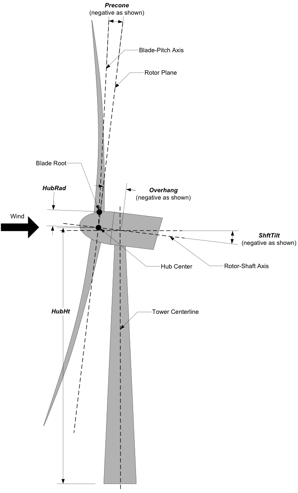
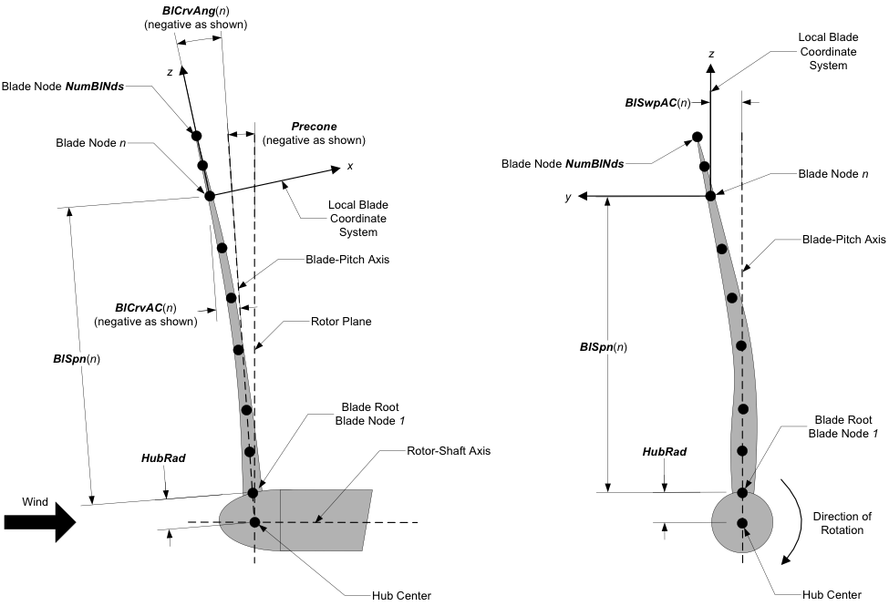

.. _ad_input:

Input Files
===========

The user configures the aerodynamic model parameters via a primary
AeroDyn input file, as well as separate input files for airfoil and
blade data. When used in standalone mode, an additional driver input
file is required. This driver file specifies initialization inputs
normally provided to AeroDyn by OpenFAST, as well as the per-time-step
inputs to AeroDyn.

As an example,  the ``driver.dvr`` file is the main driver, the ``input.dat`` is
the primary input file, the ``blade.dat`` file contains the blade geometry data,
and the ``airfoil.dat`` file contains the airfoil angle of attack, lift, drag,
moment coefficients, and pressure coefficients.  Example input files are
included in :numref:`ad_appendix`.

No lines should be added or removed from the input files, except in
tables where the number of rows is specified and comment lines in the
AeroDyn airfoil data files.

Units
-----

AeroDyn uses the SI system (kg, m, s, N). Angles are assumed to be in
radians unless otherwise specified.

AeroDyn Driver Input File
-------------------------

The driver input file is only needed for the standalone version of
AeroDyn and contains inputs normally generated by OpenFAST, and necessary to
control the aerodynamic simulation for uncoupled models. A sample
AeroDyn driver input file is given in 
:numref:`ad_appendix`.

Set the ``Echo`` flag in this file to TRUE if you wish to have the
``AeroDyn_Driver`` executable echo the contents of the driver input file (useful
for debugging errors in the driver file). The echo file has the naming
convention of *OutFileRoot.ech*, where ``OutFileRoot`` is
specified in the I/O SETTINGS section of the driver input file below.
``AD_InputFile`` is the filename of the primary AeroDyn input file.
This name should be in quotations and can contain an absolute path or a
relative path.

The TURBINE DATA section defines the AeroDyn-required turbine geometry
for a rigid turbine, see Figure 1. ``NumBlades`` specifies the number
of blades; only one-, two-, or three-bladed rotors are permitted.
``HubRad`` specifies the radius to the blade root from the
center-of-rotation along the (possibly preconed) blade-pitch axis;
``HubRad`` must be greater than zero. ``HubHt`` specifies the
elevation of the hub center above the ground (or above the mean sea
level (MSL) for offshore wind turbines or above the seabed for MHK
turbines). ``Overhang`` specifies the distance along the (possibly
tilted) rotor shaft between the tower centerline and hub center;
``Overhang`` is positive downwind, so use a negative number for upwind
rotors. ``ShftTilt`` is the angle (in degrees) between the rotor shaft
and the horizontal plane. Positive ``ShftTilt`` means that the
downwind end of the shaft is the highest; upwind turbines have negative
``ShftTilt`` for improved tower clearance. ``Precone`` is the angle
(in degrees) between a flat rotor disk and the cone swept by the blades,
positive downwind; upwind turbines have negative ``Precone`` for
improved tower clearance.

The I/O SETTINGS section controls the creation of the results file. If
``OutFileRoot`` is specified, the results file will have the filename
*OutFileRoot.out*. If an empty string is provided for
``OutFileRoot``, then the driver file’s root name will be used
instead. If ``TabDel`` is ``TRUE``, a TAB character is used between
columns in the output file; if FALSE, fixed-width is used otherwise.
``OutFmt`` is any valid Fortran numeric format string, which is used
for text output, excluding the time channel. The resulting field should
be 10 characters, but AeroDyn does not check ``OutFmt`` for validity.
If you want a sound generated on program exit, set ``Beep`` to true.

   AeroDyn Driver Turbine Geometry

The COMBINED-CASE ANALYSIS section allows you to execute ``NumCases``
number of simulations for the given TURBINE DATA with a single driver
input file. There will be one row in the subsequent table for each of
the ``NumCases`` specified (plus two table header lines). The
information within each row of the table fully specifies each
simulation. Each row contains the following columns: ``WndSpeed``,
``ShearExp``, ``RotSpd``, ``Pitch``, ``Yaw``, ``dT``, and
``Tmax``. The local undisturbed wind speed for any given blade or
tower node is determined using,

.. math::
   :label: windspeed

   U(Z) = \mathrm{WndSpeed} \times \left( \frac{Z}{\mathrm{HubHt}} \right)^\mathrm{ShearExp}

where :math:`\mathrm{WndSpeed}` is the steady wind speed (fluid flow speed in the
case of an MHK turbine) located at elevation :math:`\mathrm{HubHt}`, :math:`Z` is the
instantaneous elevation of the blade or tower node above the ground (or
above the MSL for offshore wind turbines or above the seabed for MHK
turbines), and :math:`\mathrm{ShearExp}` is the power-law shear exponent. The fixed
rotor speed (in rpm) is given by ``RotSpd`` (positive clockwise
looking downwind), the fixed blade-pitch angle (in degrees) is given by
``Pitch`` (positive to feather, leading edge upwind), and the fixed
nacelle-yaw angle (in degrees) is given by ``Yaw`` (positive rotation
of the nacelle about the vertical tower axis, counterclockwise when
looking downward). While the flow speed and direction in the AeroDyn
driver is uniform and fixed (depending only on elevation above ground),
``Yaw`` and ``ShftTilt`` (from the TURBINE DATA section above) can
introduce skewed flow. ``dT`` is the simulation time step, which must
match the time step for the aerodynamic calculations (``DTAero``) as
specified in the primary AeroDyn input file, and ``Tmax`` is the total
simulation time.

Note that ``dT`` should be the same for each of the cases listed in the 
COMBINED-CASE ANALYSIS section. All of the cases will be output to the same
file, with a ``Case`` column listed next to the ``Time`` output column 
for help with data processing.

For further debugging capability, the AeroDyn driver now also has the
ability to read the combined case input data as a time-history file. 
In place of a row in the COMBINED-CASE ANALYSIS table, a separate input file
can be listed instead. The name of the file should be preceded with the ``@``
character, to indicate the data is a time-history file in a separate text
input file. An example is provided in 
:numref:`ad_appendix`

AeroDyn Primary Input File
--------------------------
 
The primary AeroDyn input file defines modeling options, environmental
conditions (except freestream flow), airfoils, tower nodal
discretization and properties, as well as output file specifications.

The file is organized into several functional sections. Each section
corresponds to an aspect of the aerodynamics model. A sample AeroDyn
primary input file is given in 
:numref:`ad_appendix`.

The input file begins with two lines of header information which is for
your use, but is not used by the software.

General Options
~~~~~~~~~~~~~~~

Set the ``Echo`` flag to TRUE if you wish to have AeroDyn echo the
contents of the AeroDyn primary, airfoil, and blade input files (useful
for debugging errors in the input files). The echo file has the naming
convention of *OutRootFile.AD.ech*. ``OutRootFile`` is either
specified in the I/O SETTINGS section of the driver input file when
running AeroDyn standalone, or by the OpenFAST program when running a
coupled simulation.

``DTAero`` sets the time step for the aerodynamic calculations. For
accuracy and numerical stability, we recommend that ``DTAero`` be set
such that there are at least 200 azimuth steps per rotor revolution.
However, when AeroDyn is coupled to OpenFAST, OpenFAST may require time steps
much smaller than this rule of thumb. If UA is enabled while using very
small time steps, you may need to recompile AeroDyn in double precision
to avoid numerical problems in the UA routines. The keyword ``DEFAULT``
for ``DTAero`` may be used to indicate that AeroDyn should employ the
time step prescribed by the driver code (OpenFAST or the standalone driver
program).

Set ``WakeMod`` to 0 if you want to disable rotor wake/induction effects or 1 to
include these effects using the (quasi-steady) BEM theory model. When
``WakeMod`` is set to 2, a dynamic BEM theory model (DBEMT) is used (also
referred to as dynamic inflow or dynamic wake model).  When ``WakeMod`` is set
to 3, the free vortex wake model is used, also referred to as OLAF (see
:numref:`OLAF`). ``WakeMod`` cannot be set to 2 or 3 during linearization
analyses.

Set ``AFAeroMod`` to 1 to include steady blade airfoil aerodynamics or 2
to enable UA; ``AFAeroMod`` must be 1 during linearization analyses
with AeroDyn coupled to OpenFAST. 

Set ``TwrPotent`` to 0 to disable the
potential-flow influence of the tower on the fluid flow local to the
blade, 1 to enable the standard potential-flow model, or 2 to include
the Bak correction in the potential-flow model. 

Set the ``TwrShadow`` to 0 to disable to the tower shadow model,
1 to enable the Powles tower shadow model, or 2 to use the Eames tower
shadow model. These models calculate the influence of the tower on the 
flow local to the blade based on the downstream tower shadow model. If
the tower influence from potential flow and tower shadow are both
enabled, the two influences will be superimposed. 

Set the ``TwrAero`` flag to TRUE to calculate fluid drag loads on the
tower or FALSE to disable these effects. 

During linearization analyses
with AeroDyn coupled OpenFAST and BEM enabled (``WakeMod = 1``), set the
``FrozenWake`` flag to TRUE to employ frozen-wake assumptions during
linearization (i.e. to fix the axial and tangential induces velocities,
and, at their operating-point values during linearization) or FALSE to
recalculate the induction during linearization using BEM theory. 

Set the ``CavitCheck`` flag to TRUE to perform a cavitation check for MHK
turbines or FALSE to disable this calculation. If ``CavitCheck`` is
TRUE, ``AFAeroMod`` must be set to 1 because the cavitation check does
not function with unsteady airfoil aerodynamics.

Set the ``CompAA`` flag to TRUE to run aero-acoustic calculations.  This
option is only available for ``WakeMod = 1`` or ``2``.  See section
:numref:`AeroAcoustics` for information on how to use this feature.

The ``AA_InputFile`` is used to specify the input file for the aeroacoustics
sub-module. See :numref:`AeroAcoustics` for information on how to use this
feature.

Environmental Conditions
~~~~~~~~~~~~~~~~~~~~~~~~

``AirDens`` specifies the fluid density and must be a value greater
than zero; a typical value is around 1.225 kg/m\ :sup:`3` for air (wind
turbines) and 1025 kg/m\ :sup:`3` for seawater (MHK turbines).
``KinVisc`` specifies the kinematic viscosity of the air (used in the
Reynolds number calculation); a typical value is around 1.460E-5
m\ :sup:`2`/s for air (wind turbines) and 1.004E-6 m\ :sup:`2`/s for
seawater (MHK turbines). ``SpdSound`` is the speed of sound in air
(used to calculate the Mach number within the unsteady airfoil
aerodynamics calculations); a typical value is around 340.3 m/s. The
last three parameters in this section are only used when
``CavitCheck = TRUE`` for MHK turbines. ``Patm`` is the atmospheric
pressure above the free surface; typically around 101,325 Pa. ``Pvap``
is the vapor pressure of the fluid; for seawater this is typically
around 2,000 Pa. ``FluidDepth`` is the distance from the hub center to
the free surface.

Blade-Element/Momentum Theory Options
~~~~~~~~~~~~~~~~~~~~~~~~~~~~~~~~~~~~~

The input parameters in this section are not used when ``WakeMod = 0``.

``SkewMod`` determines the skewed-wake correction model. Set
``SkewMod`` to 1 to use the uncoupled BEM solution technique without
an additional skewed-wake correction. Set ``SkewMod`` to 2 to include
the Pitt/Peters correction model. **The coupled model ``SkewMod=
3`` is not available in this version of AeroDyn.**

``SkewModFactor`` is used only when  ``SkewMod = 1``. Enter a scaling factor to use
in the Pitt/Peters correction model, or enter ``"default"`` to use the default 
value of :math:`\frac{15 \pi}{32}`.

Set ``TipLoss`` to TRUE to include the Prandtl tip-loss model or FALSE
to disable it. Likewise, set ``HubLoss`` to TRUE to include the
Prandtl hub-loss model or FALSE to disable it.

Set ``TanInd`` to TRUE to include tangential induction (from the
angular momentum balance) in the BEM solution or FALSE to neglect it.
Set ``AIDrag`` to TRUE to include drag in the axial-induction
calculation or FALSE to neglect it. If ``TanInd = TRUE``, set
``TIDrag`` to TRUE to include drag in the tangential-induction
calculation or FALSE to neglect it. Even when drag is not used in the
BEM iteration, drag is still used to calculate the nodal loads once the
induction has been found,

``IndToler`` sets the convergence threshold for the iterative
nonlinear solve of the BEM solution. The nonlinear solve is in terms of
the inflow angle, but ``IndToler`` represents the tolerance of the
nondimensional residual equation, with no physical association possible.
When the keyword ``DEFAULT`` is used in place of a numerical value,
``IndToler`` will be set to 5E-5 when AeroDyn is compiled in single
precision and to 5E-10 when AeroDyn is compiled in double precision; we
recommend using these defaults. ``MaxIter`` determines the maximum
number of iterations steps in the BEM solve. If the residual value of
the BEM solve is not less than or equal to ``IndToler`` in
``MaxIter``, AeroDyn will exit the BEM solver and return an error
message.

Dynamic Blade-Element/Momentum Theory Options
~~~~~~~~~~~~~~~~~~~~~~~~~~~~~~~~~~~~~~~~~~~~~

The input parameters in this section are used only when ``WakeMod = 2``.

Set ``DBEMT_Mod`` to 1 for the constant-tau1 model, or set ``DBEMT_Mod`` to 2
to use a model where tau1 varies with time.

If ``DBEMT_Mod=1`` (constant-tau1 model), set ``tau1_const`` to the time 
constant to use for DBEMT.

OLAF -- cOnvecting LAgrangian Filaments (Free Vortex Wake) Theory Options
~~~~~~~~~~~~~~~~~~~~~~~~~~~~~~~~~~~~~~~~~~~~~~~~~~~~~~~~~~~~~~~~~~~~~~~~~

The input parameters in this section are used only when ``WakeMod = 3``.

The settings for the free vortex wake model are set in the OLAF input file
described in :numref:`OLAF-Input-Files`.  ``OLAFInputFileName`` is the filename
for this input file.

Unsteady Airfoil Aerodynamics Options
~~~~~~~~~~~~~~~~~~~~~~~~~~~~~~~~~~~~~

The input parameters in this section are only used when ``AFAeroMod
= 2``.

``UAMod`` determines the UA model. Setting ``UAMod`` to 1 enables
original theoretical developments of B-L, 2 enables the extensions to
B-L developed by González, and 3 enables the extensions to B-L developed
by Minnema/Pierce. **While all of the UA models are documented in this
manual, the original B-L model is not yet functional. Testing has shown
that the González and Minnema/Pierce models produce reasonable
hysteresis of the normal force, tangential force, and pitching-moment
coefficients if the UA model parameters are set appropriately for a
given airfoil, Reynolds number, and/or Mach number. However, the
results will differ a bit from earlier versions of AeroDyn, (which was
based on the Minnema/Pierce extensions to B-L) even if the default UA
model parameters are used, due to differences in the UA model logic
between the versions. We recommend that users run test cases with
uniform inflow and fixed yaw error (e.g., through the standalone AeroDyn
driver) to examine the accuracy of the normal force, tangential force,
and pitching-moment coefficient hysteresis and to adjust the UA model
parameters appropriately.**

``FLookup`` determines how the nondimensional separation distance
value, *f’*, will be calculated. When ``FLookup`` is set to TRUE, *f’*
is determined via a lookup into the static lift-force coefficient and
drag-force coefficient data. **Using best-fit exponential equations
(``FLookup = FALSE``) is not yet available, so ``FLookup`` must be
``TRUE`` in this version of AeroDyn.**

.. _airfoil_information:

Airfoil Information
~~~~~~~~~~~~~~~~~~~

This section defines the airfoil data input file information. The
airfoil data input files themselves (one for each airfoil) include
tables containing coefficients of lift force, drag force, and optionally
pitching moment, and minimum pressure versus AoA, as well as UA model
parameters, and are described in :numref:`airfoil_data_input_file`.

The first 5 lines in the AIRFOIL INFORMATION section relate to the
format of the tables of static airfoil coefficients within each of the
airfoil input files. ``InCol_Alfa``, ``InCol_Cl``,
``InCol_Cd``, ``InCol_Cm,`` and ``InCol_Cpmin`` are column
numbers in the tables containing the AoA, lift-force coefficient,
drag-force coefficient, pitching-moment coefficient, and minimum
pressure coefficient, respectively (normally these are 1, 2, 3, 4, and
5, respectively). If pitching-moment terms are neglected with
``UseBlCm = FALSE``, ``InCol_Cm`` may be set to zero, and if the
cavitation check is disabled with ``CavitCheck = FALSE``,
``InCol_Cpmin`` may be set to zero.

Specify the number of airfoil data input files to be used using
``NumAFfiles``, followed by ``NumAFfiles`` lines of filenames. The
file names should be in quotations and can contain an absolute path or a
relative path e.g., “C:\\airfoils\\S809_CLN_298.dat” or
“airfoils\\S809_CLN_298.dat”. If you use relative paths, it is
relative to the location of the file in which it is specified. The blade
data input files will reference these airfoil data using their line
identifier, where the first airfoil file is numbered 1 and the last
airfoil file is numbered ``NumAFfiles``.

Rotor/Blade Properties
~~~~~~~~~~~~~~~~~~~~~~

Set ``UseBlCm`` to TRUE to include pitching-moment terms in the blade
airfoil aerodynamics or FALSE to neglect them; if ``UseBlCm = TRUE``,
pitching-moment coefficient data must be included in the airfoil data
tables with ``InCol_Cm`` not equal to zero.

The blade nodal discretization, geometry, twist, chord, and airfoil
identifier are set in separate input files for each blade, described in
:numref:`blade_data_input_file`. ``ADBlFile(1)`` is the filename for blade 1,
``ADBlFile(2)`` is the filename for blade 2, and ``ADBlFile(3)`` is
the filename for blade 3, respectively; the latter is not used for
two-bladed rotors and the latter two are not used for one-bladed rotors.
The file names should be in quotations and can contain an absolute path
or a relative path. The data in each file need not be identical, which
permits modeling of aerodynamic imbalances.

Tower Influence and Aerodynamics
~~~~~~~~~~~~~~~~~~~~~~~~~~~~~~~~

The input parameters in this section pertain to the tower influence
and/or tower drag calculations and are only used when ``TwrPotent`` >
0, ``TwrShadow`` > 0, or ``TwrAero = TRUE``.

``NumTwrNds`` is the user-specified number of tower analysis nodes and
determines the number of rows in the subsequent table (after two table
header lines). ``NumTwrNds`` must be greater than or equal to two; the
higher the number, the finer the resolution and longer the computational
time; we recommend that ``NumTwrNds`` be between 10 and 20 to balance
accuracy with computational expense. For each node, ``TwrElev``
specifies the local elevation of the tower node above ground (or above
MSL for offshore wind turbines or above the seabed for MHK turbines),
``TwrDiam`` specifies the local tower diameter, ``TwrCd`` specifies the
local tower drag-force coefficient, and ``TwrTI`` specifies the
turbulence intensity used in the Eames tower shadow model
(``TwrShadow`` = 2) as a fraction (rather than a percentage) of the
wind fluctuation. ``TwrElev`` must be entered in monotonically
increasing order—from the lowest (tower-base) to the highest 
(tower-top) elevation. Values of ``TwrTI`` between 0.05 and 0.4 are
recommended.  Values larger than 0.4 up to 1 will trigger a warning
that the results will need to be interpretted carefully, but the code
will allow such values for scientific investigation purposes.
See :numref:`fig:TwrGeom`.

.. _AD-Outputs:

Outputs
~~~~~~~

Specifying ``SumPrint`` to TRUE causes AeroDyn to generate a summary
file with name ``OutFileRoot**.AD.sum*. ``OutFileRoot`` is either
specified in the I/O SETTINGS section of the driver input file when
running AeroDyn standalone, or by the OpenFAST program when running a
coupled simulation. See :numref:`sec:ad_SumFile` for summary file details.

AeroDyn can output aerodynamic and kinematic quantities at up to nine
nodes specified along the tower and up to nine nodes along each blade.
For outputs at every blade node, see :numref:`AD-Nodal-Outputs`.

``NBlOuts`` specifies the number of blade nodes that output is
requested for (0 to 9) and ``BlOutNd`` on the next line is a list
``NBlOuts`` long of node numbers between 1 and ``NumBlNds``
(corresponding to a row number in the blade analysis node table in the
blade data input files), separated by any combination of commas,
semicolons, spaces, and/or tabs. All blades have the same output node
numbers. ``NTwOuts`` specifies the number of tower nodes that output
is requested for (0 to 9) and ``TwOutNd`` on the next line is a list
``NTwOuts`` long of node numbers between 1 and ``NumTwrNds``
(corresponding to a row number in the tower analysis node table above),
separated by any combination of commas, semicolons, spaces, and/or tabs.
The outputs specified in the ``OutList`` section determine which
quantities are actually output at these nodes.

.. _ad_tower_geom:

.. figure:: figs/ad_tower_geom.png
   :width: 60%
   :name: fig:TwrGeom
   :align: center

   AeroDyn Tower Geometry

The ``OutList`` section controls output quantities generated by
AeroDyn. Enter one or more lines containing quoted strings that in turn
contain one or more output parameter names. Separate output parameter
names by any combination of commas, semicolons, spaces, and/or tabs. If
you prefix a parameter name with a minus sign, “-”, underscore, “_”, or
the characters “m” or “M”, AeroDyn will multiply the value for that
channel by –1 before writing the data. The parameters are written in the
order they are listed in the input file. AeroDyn allows you to use
multiple lines so that you can break your list into meaningful groups
and so the lines can be shorter. You may enter comments after the
closing quote on any of the lines. Entering a line with the string “END”
at the beginning of the line or at the beginning of a quoted string
found at the beginning of the line will cause AeroDyn to quit scanning
for more lines of channel names. Blade and tower node-related quantities
are generated for the requested nodes identified through the
``BlOutNd`` and ``TwOutNd`` lists above. If AeroDyn encounters an
unknown/invalid channel name, it warns the users but will remove the
suspect channel from the output file. Please refer to Appendix E for a
complete list of possible output parameters.

.. _AD-Nodal-Outputs:

.. include:: ADNodalOutputs.rst

.. _airfoil_data_input_file:

Airfoil Data Input File
-----------------------

The airfoil data input files themselves (one for each airfoil) include
tables containing coefficients of lift force, drag force, and pitching
moment versus AoA, as well as UA model parameters. In these files, any
line whose first non-blank character is an exclamation point (!) is
ignored (for inserting comment lines). The non-comment lines should
appear within the file in order, but comment lines may be intermixed as
desired for reading clarity. A sample airfoil data input file is given
:numref:`ad_appendix`.

``InterpOrd`` is the order the static airfoil data is interpolated
when AeroDyn uses table look-up to find the lift-, drag-, and optional
pitching-moment, and minimum pressure coefficients as a function of AoA.
When ``InterpOrd`` is 1, linear interpolation is used; when
``InterpOrd`` is 3, the data will be interpolated with cubic splines;
if the keyword ``DEFAULT`` is entered in place of a numerical value,
``InterpOrd`` is set to 1.

``NonDimArea`` is the nondimensional airfoil area (normalized by the
local ``BlChord`` squared), but is currently unused by AeroDyn.
``NumCoords`` is the number of points to define the exterior shape of
the airfoil, plus one point to define the aerodynamic center, and
determines the number of rows in the subsequent table; ``NumCoords``
must be exactly zero or greater than or equal to three. For each point,
the nondimensional *X* and *Y* coordinates are specified in the table,
``X_Coord`` and ``Y_Coord`` (normalized by the local
``BlChord``). The first point must always locate the aerodynamic
center (reference point for the airfoil lift and drag forces, likely not
on the surface of the airfoil); the remaining points should define the
exterior shape of the airfoil. The airfoil shape is currently unused by
AeroDyn, but when AeroDyn is coupled to OpenFAST, the airfoil shape will be
used by OpenFAST for blade surface visualization when enabled.

``BL_file`` is the name of the file containing boundary-layer characteristics
of the profile. It is ignored if the aeroacoustic module is not used.

Specify the number of Reynolds number- or aerodynamic-control
setting-dependent tables of data for the given airfoil via the
``NumTabs`` setting. The remaining parameters in the
airfoil data input files are entered separately for each table.

``Re`` and ``UserProp`` are the Reynolds number (in millions) and
aerodynamic-control (or user property) setting for the included table.
These values are used only when the ``AFTabMod`` parameter in the 
primary AeroDyn input file is set to use 2D interpolation based on 
``Re`` or ``UserProp``. If 1D interpolation (based only on angle of attack)
is used, only the first table in the file will be used.

Set ``InclUAdata`` to TRUE if you are including the 32 UA model
parameters (required when ``AFAeroMod = 2`` in the AeroDyn primary
input file):

-  ``alpha0`` specifies the zero-lift AoA (in degrees);

-  ``alpha1`` specifies the AoA (in degrees) larger than ``alpha0``
   for which *f* equals 0.7; approximately the positive stall angle;

-  ``alpha2`` specifies the AoA (in degrees) less than ``alpha0``
   for which *f* equals 0.7; approximately the negative stall angle;

-  ``eta_e`` is the recovery factor and typically has a value in the
   range [0.85 to 0.95] for ``UAMod = 1``; if the keyword ``DEFAULT`` is
   entered in place of a numerical value, ``eta_e`` is set to 0.9 for
   ``UAMod = 1``, but ``eta_e`` is set to 1.0 for other ``UAMod``
   values and whenever ``FLookup = TRUE``;

-  ``C_nalpha`` is the slope of the 2D normal force coefficient curve
   in the linear region;

-  ``T_f0`` is the initial value of the time constant associated with
   *Df* in the expressions of *Df* and *f’*; if the keyword ``DEFAULT`` is
   entered in place of a numerical value, ``T_f0`` is set to 3.0;

-  ``T_V0`` is the initial value of the time constant associated with
   the vortex lift decay process, used in the expression of ``Cvn``; it
   depends on Reynolds number, Mach number, and airfoil; if the keyword
   ``DEFAULT`` is entered in place of a numerical value, ``T_V0`` is
   set to 6.0;

-  ``T_p`` is the boundary-layer leading edge pressure gradient time
   constant in the expression for *Dp* and should be tuned based on
   airfoil experimental data; if the keyword ``DEFAULT`` is entered in
   place of a numerical value, ``T_p`` is set to 1.7;

-  ``T_VL`` is the time constant associated with the vortex advection
   process, representing the nondimensional time in semi-chords needed
   for a vortex to travel from the leading to trailing edges, and used
   in the expression of *Cvn*; it depends on Reynolds number, Mach
   number (weakly), and airfoil; valued values are in the range [6 to
   13]; if the keyword ``DEFAULT`` is entered in place of a numerical
   value, ``T_VL`` is set to 11.0;

-  ``b1`` is a constant in the expression of :math:`\phi_\alpha^c` and
   :math:`\phi_q^c`; this value is
   relatively insensitive for thin airfoils, but may be different for
   turbine airfoils; if the keyword ``DEFAULT`` is entered in place of a
   numerical value, ``b1`` is set to 0.14, based on experimental
   results;

-  ``b2`` is a constant in the expression of :math:`\phi_\alpha^c` and 
   :math:`\phi_q^c`; this value is
   relatively insensitive for thin airfoils, but may be different for
   turbine airfoils; if the keyword ``DEFAULT`` is entered in place of a
   numerical value, ``b2`` is set to 0.53, based on experimental
   results;

-  ``b5`` is a constant in the expression of :math:`K^{'''}_q`, :math:`Cm_q^{nc}`, and :math:`K_{m_q}`; if the keyword
   ``DEFAULT`` is entered in place of a numerical value, ``b5`` is set
   to 5, based on experimental results;

-  ``A1`` is a constant in the expression :math:`\phi_\alpha^c` and :math:`\phi_q^c`; this value is relatively insensitive for thin airfoils, but may be different for
   turbine airfoils; if the keyword ``DEFAULT`` is entered in place of a
   numerical value, ``A1`` is set to 0.3, based on experimental
   results;

-  ``A2`` is a constant in the expression :math:`\phi_\alpha^c` and 
   :math:`\phi_q^c`; this value is
   relatively insensitive for thin airfoils, but may be different for
   turbine airfoils; if the keyword ``DEFAULT`` is entered in place of a
   numerical value, ``A2`` is set to 0.7, based on experimental
   results;

-  ``A5`` is a constant in the expression :math:`K^{'''}_q`, 
   :math:`Cm_q^{nc}`, and :math:`K_{m_q}`; if the keyword
   ``DEFAULT`` is entered in place of a numerical value, ``A5`` is set
   to 1, based on experimental results;

-  ``S1`` is the constant in the best fit curve of *f* for
   ``alpha0`` :math:`\le` AoA :math:`\le` ``alpha1`` for ``UAMod = 1`` (and is unused
   otherwise); by definition, it depends on the airfoil;

-  ``S2`` is the constant in the best fit curve of *f* for AoA >
   ``alpha1`` for ``UAMod = 1`` (and is unused otherwise); by
   definition, it depends on the airfoil;

-  ``S3`` is the constant in the best fit curve of *f* for
   ``alpha2`` :math:`\le` AoA :math:`\le` ``alpha0`` for ``UAMod = 1`` (and is unused
   otherwise); by definition, it depends on the airfoil;

-  ``S4`` is the constant in the best fit curve of *f* for AoA <
   ``alpha2`` for ``UAMod = 1`` (and is unused otherwise); by
   definition, it depends on the airfoil;

-  ``Cn1`` is the critical value of :math:`C^{\prime}_n` at leading-edge separation for
   positive AoA and should be extracted from airfoil data at a given
   Reynolds number and Mach number; ``Cn1`` can be calculated from
   the static value of *Cn* at either the break in the pitching moment
   or the loss of chord force at the onset of stall; ``Cn1`` is close
   to the condition of maximum lift of the airfoil at low Mach numbers;

-  ``Cn2`` is the critical value of :math:`C^{\prime}_n` at leading-edge separation for
   negative AoA and should be extracted from airfoil data at a given
   Reynolds number and Mach number; ``Cn2`` can be calculated from
   the static value of *Cn* at either the break in the pitching moment
   or the loss of chord force at the onset of stall; ``Cn2`` is close
   to the condition of maximum lift of the airfoil at low Mach numbers;

-  ``St_sh`` is the Strouhal’s shedding frequency; if the keyword
   ``DEFAULT`` is entered in place of a numerical value, ``St_sh`` is
   set to 0.19;

-  ``Cd0`` is the drag-force coefficient at zero-lift AoA;

-  ``Cm0`` is the pitching-moment coefficient about the quarter-chord
   location at zero-lift AoA, positive for nose up;

-  ``k0`` is a constant in the best fit curve of :math:`\hat{x}_{cp}` and equals for :math:`\hat{x}_{AC}-0.25`
   ``UAMod = 1`` (and is unused otherwise);

-  ``k1`` is a constant in the best fit curve of :math:`\hat{x}_{cp}` for ``UAMod = 1``
   (and is unused otherwise);

-  ``k2`` is a constant in the best fit curve of :math:`\hat{x}_{cp}` for ``UAMod = 1``
   (and is unused otherwise);

-  ``k3`` is a constant in the best fit curve of :math:`\hat{x}_{cp}` for ``UAMod = 1``
   (and is unused otherwise);

-  ``k1_hat`` is a constant in the expression of *Cc* due to
   leading-edge vortex effects for ``UAMod = 1`` (and is unused
   otherwise);

-  ``x_cp_bar`` is a constant in the expression of :math:`\hat{x}_{cp}^{\nu}` for ``UAMod =
   1`` (and is unused otherwise); if the keyword ``DEFAULT`` is entered in
   place of a numerical value, ``x_cp_bar`` is set to 0.2; and

-  ``UACutOut`` is the AoA (in degrees) in absolute value above which
   UA are disabled; if the keyword ``DEFAULT`` is entered in place of a
   numerical value, ``UACutOut`` is set to 45.

-  ``filtCutOff`` is the cut-off reduced frequency
   of the low-pass filter applied to the AoA input to UA, as
   well as to the pitch rate and pitch acceleration derived from AoA
   within UA; if the keyword ``DEFAULT`` is entered in place of a
   numerical value, ``filtCutOff`` is set to 0.5.

``NumAlf`` is the number of distinct AoA entries and determines the
number of rows in the subsequent table of static airfoil coefficients;
``NumAlf`` must be greater than or equal to one (``NumAlf = 1``
implies constant coefficients, regardless of the AoA). 

AeroDyn will
interpolate on AoA using the data provided via linear interpolation or via cubic
splines, depending on the setting of input ``InterpOrd`` above. 
If ``AFTabMod`` is set to ``1``, only the first airfoil table in each file
will be used. If ``AFTabMod`` is set to ``2``, AeroDyn will find the
airfoil tables that bound the computed Reynolds number,
and linearly interpolate between the tables, using the logarithm of the Reynolds numbers.
If ``AFTabMod`` is set to ``3``, it will find the bounding airfoil 
tables based on the ``UserProp`` field and linearly interpolate the tables
based on it. Note that OpenFAST currently sets the ``UserProp`` input value to ``0`` 
unless the DLL controller is used and sets the value, 
so using this feature may require a code change.

For each AoA, you must set the AoA (in degrees), ``alpha``, the lift-force
coefficient, ``Coefs``\ (:,1), the drag-force coefficient,
``Coefs(:,2)``, and optionally the pitching-moment coefficient,
``Coefs(:,3)``, and minimum pressure coefficient,
``Coefs(:,4)``, but the column order depends on the settings of
``InCol_Alfa``, ``InCol_Cl``, ``InCol_Cd``, ``InCol_Cm``,
and ``InCol_Cpmin`` in the AIRFOIL INFORMATION section of the AeroDyn
primary input file. AoA must be entered in monotonically increasing
order—from lowest to highest AoA—and the first row should be for AoA =
–180 and the last should be for AoA = +180 (unless ``NumAlf = 1``, in
which case AoA is unused). If pitching-moment terms are neglected with
``UseBlCm = FALSE`` in the ROTOR/BLADE PROPERTIES section of the
AeroDyn primary input file, the column containing pitching-moment
coefficients may be absent from the file. Likewise, if the cavitation
check is neglected with ``CavitCheck = FALSE`` in the GENERAL OPTIONS
section of the AeroDyn primary input file, the column containing the
minimum pressure coefficients may be absent from the file.

.. _blade_data_input_file:

Blade Data Input File
---------------------

The blade data input file contains the nodal discretization, geometry,
twist, chord, and airfoil identifier for a blade. Separate files are
used for each blade, which permits modeling of aerodynamic imbalances. A
sample blade data input file is given in :numref:`ad_appendix`.

The input file begins with two lines of header information which is for
your use, but is not used by the software.

``NumBlNds`` is the user-specified number of blade analysis nodes and
determines the number of rows in the subsequent table (after two table
header lines). ``NumBlNds`` must be greater than or equal to two; the
higher the number, the finer the resolution and longer the computational
time; we recommend that ``NumBlNds`` be between 10 and 20 to balance
accuracy with computational expense. Even though ``NumBlNds`` is
defined in each blade file, all blades must have the same number of
nodes. For each node:

-  ``BlSpn`` specifies the local span of the blade node along the
   (possibly preconed) blade-pitch axis from the root; ``BlSpn`` must
   be entered in monotonically increasing order—from the most inboard to
   the most outboard—and the first node must be zero, and when AeroDyn
   is coupled to OpenFAST, the last node should be located at the blade tip;

-  ``BlCrvAC`` specifies the local out-of-plane offset (when the
   blade-pitch angle is zero) of the aerodynamic center (reference point
   for the airfoil lift and drag forces), normal to the blade-pitch
   axis, as a result of blade curvature; ``BlCrvAC`` is positive
   downwind; upwind turbines have negative ``BlCrvAC`` for improved
   tower clearance;

-  ``BlSwpAC`` specifies the local in-plane offset (when the
   blade-pitch angle is zero) of the aerodynamic center (reference point
   for the airfoil lift and drag forces), normal to the blade-pitch
   axis, as a result of blade sweep; positive ``BlSwpAC`` is opposite
   the direction of rotation;

-  ``BlCrvAng`` specifies the local angle (in degrees) from the
   blade-pitch axis of a vector normal to the plane of the airfoil, as a
   result of blade out-of-plane curvature (when the blade-pitch angle is
   zero); ``BlCrvAng`` is positive downwind; upwind turbines have
   negative ``BlCrvAng`` for improved tower clearance;

-  ``BlTwist`` specifies the local aerodynamic twist angle (in
   degrees) of the airfoil; it is the orientation of the local chord
   about the vector normal to the plane of the airfoil, positive to
   feather, leading edge upwind; the blade-pitch angle will be added to
   the local twist;

-  ``BlChord`` specifies the local chord length; and

-  ``BlAFID`` specifies which airfoil data the local blade node is
   associated with; valid values are numbers between 1 and
   ``NumAFfiles`` (corresponding to a row number in the airfoil file
   table in the AeroDyn primary input file); multiple blade nodes can
   use the same airfoil data.

See :numref:`ad_blade_geom`. Twist is shown in :numref:`ad_blade_local_cs` of :numref:`ad_appendix`.

.. _ad_blade_geom:

   AeroDyn Blade Geometry – Left: Side View; Right: Front View (Looking Downwind)

