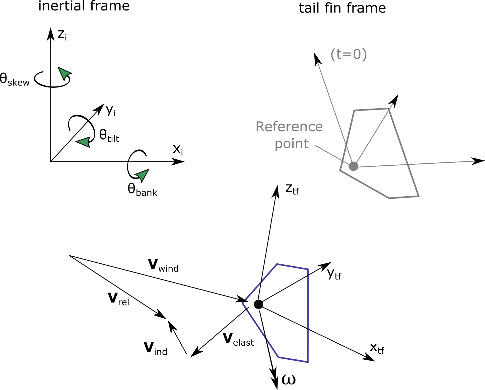
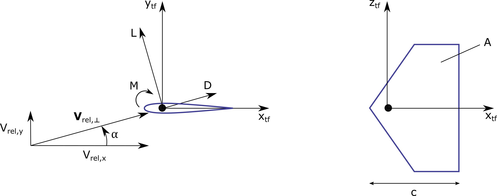

.. _TF-aerotheory:

Tail fin Aerodynamics Theory
============================

Notations
---------

**Tail fin aerodynamic reference point**

The tail fin aerodynamic reference point, :math:`\boldsymbol{x}_\text{ref}`, is the point where the aerodynamic loads are calculated on the tail fin. 
The structural solver computes the instantenous position, velocity, acceleration, of the reference point at each time step.
The initial position of the reference point with respect to the tower top is a user input. 
Typical choices are the 
leading edge/apex of the fin or a point close to the center of pressure at zero angle of attack.
The other aerodynamic inputs (e.g. aerodynamic moment coefficient) need to be consistent with the choice of the reference point.

**Tail fin coordinate system**

The inertial and tail fin coordinate systems are illustrated in :numref:`figTFcoord1`.
The transformation matrix from the inertial coordinate system to the tail fin coordinate system is given by :math:`\boldsymbol{R}_\text{tf,i}`. 

.. _figTFcoord1:

           
   Coordinate systems and velocity vectors used for the tail fin aerodynamics

The reference orientation (when the structure is un-deflected), the transformation matrix is:

.. math::  :label: tfRrfiinit

   \boldsymbol{R}_\text{tf,i} = \operatorname{EulerConstruct}(\theta_\text{bank}, \theta_\text{tilt}, \theta_\text{skew})

For a common application with a vertical fin, the three angles are zero.

.. :red:`TODO: The order of the angles might be different in the current implementation (3-2-1) instead of (1-2-3) above)`

**Velocities**

The following velocity vectors (3D vectors in global coordinates) are defined (see :numref:`figTFcoord1`):

- :math:`\boldsymbol{V}_\text{wind}`:
  Undisturbed Wind speed vector at the reference point 
- :math:`\boldsymbol{V}_\text{dist}`:
  Disturbed wind speed vector at the reference point (the disturbed wind contains the influence of the tower on the flow). AeroDyn has internal methods to compute :math:`\boldsymbol{V}_\text{dist}` from :math:`\boldsymbol{V}_\text{wind}`.
- :math:`\boldsymbol{V}_\text{elast}`:
  Structural translational velocity vector at the reference point
- :math:`\boldsymbol{V}_\text{ind}`:
  Induced velocity from the wake at the reference point (assumed to be zero for now)
- :math:`\boldsymbol{\omega}`:
  Structural rotational velocity of the fin

..  :red:`For now, we use "wind" but in the future we might use "dist". In the theory below we would simply replace all the "wind" by "dist"`.

All velocities (except for :math:`\boldsymbol{V}_\text{ind}` and :math:`\boldsymbol{V}_\text{dist}` which are computed internally by AeroDyn) are provided as input to the aerodynamic solver.
The relative wind experienced by the airfoil is given by:

.. math::  :label: tfVrel

   \boldsymbol{V}_\text{rel} = 
        \boldsymbol{V}_\text{wind} 
       -\boldsymbol{V}_\text{elast} 
       +\boldsymbol{V}_\text{ind} 
   

**Angle of attack**

The angle of attack is defined in the :math:`x_\text{tf}-y_\text{tf}` plane of the tail fin coordinate systems as illustrated in :numref:`figTFcoord2`.

.. _figTFcoord2:

           
   Tail fin airfoil coordinate system and definition of angle of attack in the x-y plane

We write :math:`V_{\text{rel},\perp}` the projection of :math:`\boldsymbol{V}_\text{rel}` in this plane. The angle of attack is given by the components of this vector:

.. math::  :label: tfalpha

   \alpha = \arctan\frac{V_{\text{rel},y_\text{tf}}}{V_{\text{rel},x_\text{tf}}}

In this implementation, the function `atan2` is used to compute the angle of attack.

**Loads**

If the dimensionless coefficients are known, they can be projected in the :math:`x_\text{tf}-y_\text{tf}` plane as follows:

.. math::  :label: tfCxCy

       C_{x_\text{tf}}(\alpha)  = -C_l(\alpha) \sin\alpha + C_d(\alpha)\cos\alpha
       ,\quad                                                     
       C_{y_\text{tf}}(\alpha)  =  C_l(\alpha) \cos\alpha + C_d(\alpha)\sin\alpha 

and the loads are therefore given by:

.. math::  :label: tffxfymz
   
      f_{x_\text{tf}} = \frac{1}{2}\rho V_{\text{rel},\perp}^2 A  \,C_{x_\text{tf}}(\alpha)
                   ,\quad
      f_{y_\text{tf}} = \frac{1}{2}\rho V_{\text{rel},\perp}^2 A  \,C_{y_\text{tf}}(\alpha)
                   ,\quad
      m_{z_\text{tf}} = \frac{1}{2}\rho V_{\text{rel},\perp}^2 Ac \, C_m(\alpha) 

Once the loads are known in the tail fin coordinate systems, they are transferred to the inertial system as follows:

.. math::  :label: tfforcesi

   \left.\boldsymbol{f}\right|_{i} = \boldsymbol{R}_\text{tf,i}^t  \left.\boldsymbol{f}\right|_\text{tf} 
    = \boldsymbol{R}_\text{tf,i}^t  
    \begin{bmatrix}
    f_{x_\text{tf}}\\
    f_{y_\text{tf}}\\
    0\\
    \end{bmatrix}
    ,\qquad
   \left.\boldsymbol{m}\right|_{i} = \boldsymbol{R}_\text{tf,i}^t  \left.\boldsymbol{m}\right|_\text{tf} 
    = \boldsymbol{R}_\text{tf,i}^t  
    \begin{bmatrix}
    0\\
    0\\
    m_{z_\text{tf}}\\
    \end{bmatrix}

**Induced velocity**

The induced velocity from the wake at the reference point will affect the relative wind and therefore the angle of attack of the tail fin.
Different models are implemented to compute this induced velocity.
As a first approximation, this velocity may be set to zero (corresponding to the input `TFinIndMod=0`): 

.. math::  :label: TFVindZero

    \boldsymbol{V}_\text{ind}=0

The rotor-averaged induced velocity can also be used as an estimate (`TFinIndMod=1`). It is computed as the mean induced velocity over all the blade and aerodynamic nodes 

.. math::  :label: TFVindRtAvg

    \boldsymbol{V}_\text{ind}=\frac{1}{n_B n_r}\sum_{i_b=1..n_B} \sum_{i_r=1..n_r}  \boldsymbol{V}_{\text{ind},\text{blade}}[i_b, i_r] 

Where :math:`\boldsymbol{V}_{\text{ind},\text{blade}}[i_b, i_r]` is the induced velocity vector for blade :math:`i_b` and at the radial node :math:`i_r`.

.. :red:`NOTE: This averaging corresponds to what is done for the disk-average of the inflow in AeroDyn. In the future, we can use something weighted by the radius, or using precomputed coefficients, as done by Envision`.

More advanced models could set the induced velocity to zero when outside of the wake boundary, or include a tower-shadow-like wake model. Such option is not yet available.
   

Polar-based model
-----------------

In the polar-based model, the user provides the aerodynamic coefficients :math:`C_l, C_d, C_m`, as tabulated data, functions of the angle of attack. The aerodynamic moment is assumed to be provided at the reference point. A common practice is to use the center of pressure at zero angle of attack for polar data, so the user might want to chose such a point as the reference point of the fin.
The tabulated data are provided as part of the list of airfoils given with `AFNames` in the AeroDyn input file.
The user only needs to indicate the index `TFinAFIndex` within the list `AFNames` to indicate which polar to use for the tail fin.

Unsteady slender body model
---------------------------

The unsteady aerodynamics of the tail fin is modeled based on Unsteady Slender Body Theory.
The theory is extended to include the effect of high yaw angle :cite:`ad-hammam_NREL:2023`.
To simplify the implementation, it is assumed that that arm length of the tail fin is much greater than the chord and the characteristic time (chord/wind speed) is small.

The normal force on the tail fin can be described as the sum of three contributions (potential lift, vortex lift, and drag), weighted by separation functions :math:`x_i` as:

.. math::  
    :label: tfusbforce
    
    N = \frac{\rho}{2} A_{tf} \bigg(  K_p x_1 V_{\text{rel},x} V_{\text{rel},y} +  \Big[x_2 K_v+(1- x_3)C_{Dc} \Big] V_{\text{rel},y}\big|V_{\text{rel},y}\big|\bigg)

where :math:`\rho` is the density of air, :math:`A_{tf}` is the tail fin area, :math:`K_p` is the potential lift coefficient and :math:`K_v` is the vortex lift coefficient, and :math:`C_{Dc}` is the drag coefficient.
Note that the sign convnetion of OpenFAST is slightly different than used in :cite:`ad-hammam_NREL:2023`.
This is reflected in Equation :eq:`tfusbforce`.
 

:math:`x_i` are the separation functions calculated using a quasi-steady approximation as:

.. math::  :label: TFUSBxiEquation

    x_i = (1+exp{[\sigma_i (|\gamma_{tf}|-\alpha^*_i)]})^{-1}

where :math:`\sigma_i` are empirical constants characterizing the decay of separation functions, :math:`\gamma_{tf}` is the yaw angle of the tail fin with respect to the free-stream wind (:math:`V_{\text{wind}}`), :math:`\alpha^*_i` are the characteristics angles for separation functions.
:math:`x_i` takes on a value between 0 and 1, and are used to activate or deactivate a the contribution of potential lift, vortex lift and drag to the normal force on the tail fin.

The normal force is assumed to act at the user defined reference point on the tail fin and the moment of the normal force is calculated accordingly.
