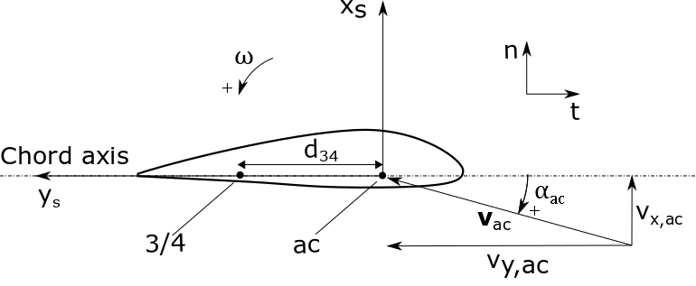

.. _AD_UA:

Unsteady aerodynamics
=====================

The Unsteady Aerodynamic (UA) models account for flow hysteresis, including unsteady attached
flow, trailing-edge flow separation, dynamic stall, and flow reattachment.
*Dynamic stall* refers to rapid aerodynamic changes that may bring about
or delay stall behavior :cite:`ad-Branlard:book`. Rapid changes in wind speed (for example, when
the blades pass through the tower shadow) cause a sudden detachment and
then reattachment of air flow along the airfoil. Such effects at the
blade surface cannot be predicted with steady state aerodynamics, but
may affect turbine operation, not only when the blades encounter tower
shadow, but also during operation in skewed flows and turbulent wind conditions. Dynamic
stall effects occur on time scales of the order of the time for the
relative wind at the blade to traverse the blade chord, approximately
:math:`c/\Omega r`. For large wind turbines, this might be on the order
of :math:`0.5` seconds at the blade root to :math:`0.001` seconds at the
blade tip. Dynamic stall can result in high transient forces as the wind
speed increases, but stall is delayed. 

Theory
------

The different dynamic stall models implemented in AeroDyn are presented below.

.. _ua_notations:

Notations and Definitions 
~~~~~~~~~~~~~~~~~~~~~~~~~

See :numref:`airfoil_data_input_file` for a comprehensive description of all
the inputs present in the profile input file (including some of the ones repeated below).

The airfoil section coordinate system and main variables are presented in :numref:`fig:UAAirfoilSystem` and further described below:

           
   Definition of aifoil section coordinate system used in the unsteady aerodynamics module

-  Aerodynamic Center (AC): point of the airfoil cross section where the
   aerodynamic forces and moment are assumed to act. Usually close to
   the 1/4 chord point for a regular airfoil and at the center for a
   circular cross section

-  “3/4” chord point: in the original formulation this point refers to
   the point on the chord axis located 3/4 chord behind the leading
   edge. This concept is here generalized to the point located mid-way
   between the aerodynamic center and the trailing edge, to account for
   aerodynamic center positions that differ strongly from a 1/4 chord
   point. The notation :math:`3/4` is kept in this document.

-  :math:`\omega`: rotational speed of the airfoil section
   (pitching/torsional rate) positive around z.

-  :math:`\boldsymbol{v}_{ac}`: velocity vector at the aerodynamic
   center
   :math:`\boldsymbol{v}_{ac}=[v_{x,ac}, v_{y,ac}]`
   (coordinates assumed to be expressed in the airfoil section
   coordinate system)

-  :math:`\boldsymbol{v}_{34}`: velocity vector at the 3/4 chord point
   :math:`\boldsymbol{v}_{34}=[v_{x,34}, v_{y,34}]`\ (coordinates
   assumed to be expressed in the airfoil section coordinate system)
   The velocity is obtained from the velocity at the 1/4 chord point and the 
   rotational speed of the section:
   :math:`\boldsymbol{v}_{34}=\boldsymbol{v}_{ac}+\omega d_{34} \hat{\boldsymbol{x}}_s`
   where :math:`d_{34}` is the distance between the aerodynamic center
   and the 3/4 chord point.

-  :math:`U_{ac}`: velocity norm at the aerodynamic center.
   :math:`U_{ac}=\lVert\boldsymbol{v}_{ac}\rVert=\sqrt{v_{x,ac}^2 + v_{y,ac}^2}`

-  :math:`\alpha_{ac}`: angle of attack at the aerodynamic center
   :math:`\alpha_{ac}=\operatorname{atan2}(v_{x,ac},v_{y,ac})`

-  :math:`\alpha_{34}`: angle of attack at the 3/4 chord point
   :math:`\alpha_{34}=\operatorname{atan2}(v_{x,34},v_{y,34})`

-  :math:`\boldsymbol{x}`: the vector of states used by the continuous formulations

-  :math:`c`: airfoil chord

-  :math:`C_l^{st}, C_d^{st}, C_m^{st}`: static airfoil coefficients 

-  :math:`\alpha_0`: angle of attack at zero lift, :math:`C_l^{st}(\alpha_0)=0`

-  :math:`\alpha_1`: angle of attack close to positive stall. 
-  :math:`\alpha_2`: angle of attack close to negative stall.

-  :math:`C_{l,\alpha}`:  slope of the steady lift curve about :math:`\alpha_0`.

-  :math:`f^{st}_s(\alpha)`: is the steady separation function, determined from the lift curve :math:`C_l^{st}(\alpha)` (see below, and e.g. :cite:`ad-Hansen:2004`)

-  :math:`A_1`, :math:`A_2`, :math:`b_1`, :math:`b_2`: are four constants, characteristic of the propagation of the wake vorticity (Wagner constants)

**Time constants:**

 - :math:`T_u(t) = \frac{c}{2U_{ac}(t)} \in [0.001, 50]`: Time for the flow to go over half the airfoil section. The value is plateaued to avoid unphysical values.
 - :math:`T_{f,0}`: Dimensionless time constant associated with leading edge separation. Default is 3.  
 - :math:`T_{p,0}`: Dimensionless time constant for the boundary-layer,leading edge pressure gradient. Default is 1.7

**Separation function:**

The steady separation function, :math:`f_s^{st}`, is defined as the separation
point on a flat plate for a potential Kirchhoff flow :cite:`ad-Hansen:2004`:

.. math::

   \begin{aligned}
   \text{Close to $\alpha_0$},
   f_s^{st}(\alpha) &= \operatorname{min}\left\{\left[2 \sqrt{ \frac{C_l^{st}(\alpha)}{C_{l,\alpha}(\alpha-\alpha_0) } } -1 \right]^2 , 1 \right\}
   ,\quad
   \text{away from $\alpha_0$},
   f_s^{st}(\alpha)=0
   \end{aligned}

When :math:`\alpha=\alpha_0`, :math:`f_s^{st}(\alpha_0)=1`. Away from
:math:`\alpha_0`, the function drops progressively to :math:`0`. As soon
as the function reaches :math:`0` on both sides of :math:`\alpha_0`,
then :math:`f_s^{st}` is kept at the constant value :math:`0`. 

**Inviscid and fully separated lift coefficient:**
The inviscid lift coefficient is
:math:`C_{l,\text{inv}}= C_{l,\alpha} (\alpha-\alpha_0)`.
The fully separated lift coefficient may
be modelled in different ways (:cite:`ad-Branlard:book`). 
In most engineering models, the slope of
the fully separated lift coefficient around :math:`\alpha_0` is
:math:`C_{l,\alpha}/2`. In the Unsteady AeroDynamics sub-module, 
the fully separated lift coefficient is derived from the steady separation
function as:

.. math::

   \begin{aligned}
      C_{l,\text{fs}}(\alpha) = \frac{C_l^{st}(\alpha) - C_{l,\alpha}(\alpha-\alpha_0)f_s^{st}(\alpha)}{1-f_s^{st}(\alpha)}
     \text{when $f_s^{st}\neq 1$}
      , \qquad 
      C_{l,\text{fs}}(\alpha) =\frac{C_l^{st}(\alpha)}{2}
    \text{when $f_s^{st}=1$}\end{aligned}

Beddoes-Leishman type models (UAMod=2,3)
~~~~~~~~~~~~~~~~~~~~~~~~~~~~~~~~~~~~~~~~

The Beddoes-Leishman model account for attached flows and trailing edge stall :cite:`ad-LeishmanBeddoes:1989`.

Two variants are implemented in the Unsteady Aerodynamic module. These two (compressible) models are currently described in the following reference: :cite:`ad-AeroDyn:manualUnsteady`. The models use :math:`C_n` and :math:`C_c` as main physical quantities.  The models use discrete states and cannot be used with linearization.

Beddoes-Leishman 4-states model (UAMod=4)
~~~~~~~~~~~~~~~~~~~~~~~~~~~~~~~~~~~~~~~~~

The 4-states (incompressible) dynamic stall model from Hansen-Gaunaa-Madsen (HGM) is described in :cite:`ad-Hansen:2004` and enabled using ``UAMod=4``.  The model uses :math:`C_l` as main physical quantity. 
Linearization of the model will be available in the future.

**State equation:**
The state equation of the model is:

.. math::

   \begin{aligned}
       \dot{x}_1 &= - T_u^{-1}  b_1\, x_1  +  T_u^{-1} b_1 A_1  \alpha_{34}\nonumber \\
       \dot{x}_2 &= - T_u^{-1}  b_2\, x_2  +  T_u^{-1} b_2 A_2  \alpha_{34}\nonumber \\
       \dot{x}_3 &= - T_p^{-1} x_3  +  T_p^{-1} C_l^p                \nonumber \\
       \dot{x}_4 &= - T_f^{-1} x_4  +  T_f^{-1} f_s^{st}(\alpha_F)      ,\qquad x_4 \in[0,1]
       \nonumber 
   \end{aligned}

with

.. math::

   \begin{aligned}
    \alpha_E(t) & =\alpha_{34}(t)(1-A_1-A_2)+ x_1(t) + x_2(t)                                      \nonumber \\
    C_{L}^p(t)  & =C_{l,\alpha} \, \left(\alpha_E(t)-\alpha_0\right) + \pi T_u(t) \omega(t) \nonumber \\
    \alpha_F(t) & =\frac{x_3(t)}{C_{l,\alpha}}+\alpha_0                                     \nonumber
    \end{aligned}

**Output equation:**
The unsteady airfoil coefficients
:math:`C_{l,\text{dyn}}`, :math:`C_{d,\text{dyn}}`,
:math:`C_{m,\text{dyn}}` are obtained from the states as follows:

.. math::

   \begin{aligned}
       C_{l,\text{dyn}}(t) &= x_4 (\alpha_E-\alpha_0) C_{l,\alpha} +  (1-x_4) C_{l,{fs}}(\alpha_E)+ \pi T_u \omega   \\
       C_{d,\text{dyn}}(t) &=  C_d(\alpha_E) + (\alpha_{ac}-\alpha_E) C_{l,\text{dyn}} + \left[ C_d(\alpha_E)-C_d(\alpha_0)\right ] \Delta C_{d,f}'' \\
   %     C_{m,\text{dyn}}(t) &=  C_m(\alpha_E) + C_{l,\text{dyn}} \Delta C_{m,f}'' - \frac{\pi}{2} T_u \omega\\
       C_{m,\text{dyn}}(t) &=  C_m(\alpha_E) - \frac{\pi}{2} T_u \omega\\
   \end{aligned}

with:

.. math::
   \begin{aligned}
       \Delta C_{d,f}'' &= \frac{\sqrt{f_s^{st}(\alpha_E)}-\sqrt{x_4}}{2} - \frac{f_s^{st}(\alpha_E)-x_4}{4} 
   ,\qquad
       x_4\ge 0
   \end{aligned}

Beddoes-Leishman 5-states model (UAMod=5)
~~~~~~~~~~~~~~~~~~~~~~~~~~~~~~~~~~~~~~~~~
The 5-states (incompressible) dynamic stall model is similar to the Beddoes-Leishman 4-states model (UAMod=4), but 
adds a 5th state to represent vortex generation. 
It is enabled using ``UAMod=5``. The model uses :math:`C_n` and :math:`C_c` as main physical quantities.  
Linearization of the model will be available in the future.

.. _ua_oye:

Oye model (UAMod=6)
~~~~~~~~~~~~~~~~~~~

Oye's dynamic stall model is a one-state (continuous) model, formulated in :cite:`ad-Oye:1991` and described e.g. in :cite:`ad-Branlard:book`.
The model attempts to capture trailing edge stall. 
Linearization of the model will be available in the future.

**State equation:**
Oye's dynamic stall model uses one state, :math:`\boldsymbol{x}=[f_s]`
where :math:`f_s` is the unsteady separation function.
The state equation is a first-order differential equation:

.. math::

   \begin{aligned}
     \frac{df_s(t)}{dt} =- \frac{1}{T_f} f_s(t)  + \frac{1}{T_f} f_s^{st}(\alpha_{34}(t))
    \end{aligned}

where :math:`T_f=T_{f,0} T_u` is the time constant of
the flow separation and :math:`f_s^{st}` is the steady state separation function described in :numref:`ua_notations`. 
The value :math:`T_{f,0}` is usually chosen around 6 (different from the default value).
It is readily seen that :math:`f_s`
reaches the value :math:`f_s^{st}` when the system is in a steady state
(i.e. when :math:`\frac{df_s(t)}{dt}=0`). 

**Output equation:**
The unsteady lift coefficient is computed as a linear combination of the inviscid lift
coefficient, :math:`C_{l, \text{inv}}`, and the fully separated lift
coefficient :math:`C_{l,\text{fs}}`. Both of these lift coefficients are
determined from the steady lift coefficient, usually provided as
tabulated data, noted :math:`C_l^{st}(\alpha)`, where the superscript
:math:`st` stands for “steady”. 
The unsteady lift coefficient is
modelled as:

.. math::

   \begin{aligned}
       C_{l,\text{dyn}}(\alpha_{34} ,t) = f_s(t)\; C_{l,\text{inv}}(\alpha_{34}) + (1-f_s(t))\; C_{l,\text{fs}}(\alpha_{34})
       \end{aligned}

where :math:`\alpha_{34}` is the instantaneous angle of attack at the 3/4 chord. 
:math:`f_s` is seen to act as a relaxation factor between the two flow situations. 

Boeing-Vertol model (UAMod=7)
~~~~~~~~~~~~~~~~~~~~~~~~~~~~~

The Boeing-Vertol is mentioned in the following paper :cite:`ad-Murray:2011`.  Details of the model were omitted in this reference, so the documentation presented here is inspired from the implementation done in the vortex code CACTUS, which was reproduced to quasi-identity in AeroDyn. Linearization is not possible with this model.

The model as presented in :cite:`ad-Murray:2011` is an output-only model, where the dynamic angle of attack is determined using the quasi steady angle of attack and the rate of change of the angle of attack:

.. math::

   \alpha_{dyn} = \alpha_{34} - k_1 \gamma \sqrt{\left| \dot{\alpha} T_u\right|}

where :math:`k_1` and :math:`\gamma` are constants of the model. In practice, the implementation is different for the lift and drag coefficients, and for negative and positive stall. The model needs a discrete state to calculate the rate of change of the angle of attack and two discrete states to keep track of whether the model is activated or not. 

**Airfoil constants:**

The constants :math:`k_1`, for positive and negative rates of angle of attack, are set to:

.. math::

   k_{1,p}= 1 ,\quad k_{1,n} = 1/2

The extent of the transition region is computed as:

.. math::

   \Delta \alpha_\text{max} = \frac{0.9 \operatorname{min}\left(|\alpha_1-\alpha_0|, |\alpha_2-\alpha_0|\right)}{\operatorname{max}(k_{1,p},k_{1,n})}

where :math:`\alpha_1` and :math:`\alpha_2` are the angle of attack at positive and negative stall respectively (taken as the values from the airfoil input file).
The factor 0.9 is a margin to prevent the effective angle of attack to reach :math:`\alpha_0` during stall. 

**Intermediate variables:**

The variables :math:`\gamma` for the lift and drag are computed as function of the thickness to chord ratio of the airfoil :math:`t_c` and the Mach number :math:`M_a` (assumed to be 0 in the current implementation):

.. math::

   \begin{aligned}
     \gamma_L &= (1.4-6\delta)\left[1-\frac{\text{Ma}-(0.4+5\delta)}{0.9+2.5\delta-(0.4+5\delta)}\right] &&\\
     \gamma_D &= (1-2.5\delta) ,&&\text{if}\ \text{Ma} < 0.2  \\
     \gamma_D &= (1-2.5\delta)\left[1-\frac{\text{Ma}-0.2}{(0.7+2.5\delta-0.2)}\right] ,&& \text{otherwise}
   \end{aligned}

where :math:`\delta = 0.06-t_c`.

**Update of discrete states (and intermediate variables):**

The rate of change of the angle of attack is computed as:

.. math::

   \dot{\alpha} = \frac{\alpha_{34}(t+\Delta t) - \alpha_{34}(t)}{\Delta t}

An additional state was introduced to avoid sudden jump of :math:`\dot{\alpha}`, by storing its value. Rates that are beyond a fraction of :math:`\pi \Delta t` are replaced with the values at the previous time step. This feature is not present in the CACTUS implementation.

The dynamic angle of attack offsets (lags) for the lift and drag are computed as:

.. math::

   \begin{aligned}
       \Delta \alpha_L &= k_1 \operatorname{min} \left(\gamma_L \sqrt{\dot{|\alpha}T_u|} , \Delta \alpha_\text{max}\right)\\
       \Delta \alpha_D &= k_1 \operatorname{min}\left(\gamma_D \sqrt{\dot{|\alpha}T_u|}, \Delta \alpha_\text{max} \right)
   \end{aligned}

The value of :math:`k_1` is taken as :math:`k_{1,n}` if :math:`\dot{\alpha}(\alpha_{34}-\alpha_0)<0`, and taken as :math:`k_{1,p}` otherwise.
The lagged angle of attacks for the lift and drag are:

.. math::

   \begin{aligned}
       \alpha_{\text{Lag},L} &= \alpha_{34} - \Delta \alpha_L\operatorname{sign}(\dot{\alpha}) \\
       \alpha_{\text{Lag},D} &= \alpha_{34} - \Delta \alpha_D\operatorname{sign}(\dot{\alpha})
   \end{aligned}

The distances to positive and negative stall are computed as follows.
If :math:`\dot{\alpha}(\alpha_{34}-\alpha_0)<0` and the dynamic stall is active:

.. math::

           \Delta_n = \alpha_2  - \alpha_{\text{Lag},D} , \quad \Delta_p = \alpha_{\text{Lag},D} - \alpha_1

If :math:`\dot{\alpha}(\alpha_{34}-\alpha_0)<0` and the dynamic stall is not active:

.. math::

           \Delta_n = 0 , \quad \Delta_p = 0

If :math:`\dot{\alpha}(\alpha_{34}-\alpha_0)\ge0`:

.. math::

       \Delta_n = \alpha_2 - \alpha_{34}, \qquad
       \Delta_p = \alpha_{34} - \alpha_1

The effective angle of attack for the lift coefficient is taken as the lagged angle of attack:

.. math::

    \begin{aligned}
       \alpha_{e,L}  &= \alpha_{\text{Lag},L}
   \end{aligned}

The effective angle of attack for the drag coefficient is obtained from the lagged angle of attack and the deltas to stall:

.. math::

    \begin{aligned}
       \alpha_{e,D}  &= \alpha_{\text{Lag},D},                                                &&\text{if}\ \Delta_n>T \ \text{or} \  \Delta_p > T \\
       \alpha_{e,D}  &= \alpha_{34}+(\alpha_{\text{Lag},D}-\alpha_{34}) \frac{\Delta_n}{T}  , &&\text{if}\ \Delta_n>0 \ \text{and}\  \Delta_n < T \\
       \alpha_{e,D}  &= \alpha_{34}+(\alpha_{\text{Lag},D}-\alpha_{34}) \frac{\Delta_p}{T}  , &&\text{if}\ \Delta_p>0 \ \text{and}\  \Delta_p < T \\
       \alpha_{e,D}  &= \alpha_{34} ,                                                         &&\text{otherwise}
   \end{aligned}

where :math:`T=2\Delta\alpha_\text{max}` is the extent of the "transition" region.

The lift dynamic stall state is activated if :math:`\dot{\alpha}(\alpha_{34}-\alpha_0) \ge 0` 
and if the angle of attack is above :math:`\alpha_1` or below :math:`\alpha_2`.
The state is turned off if :math:`\dot{\alpha}(\alpha_{34}-\alpha_0) < 0` 
and the effective angle of attack is below :math:`\alpha_1` and above :math:`\alpha_2`.

The drag dynamic stall state is activated if any of the condition below are true: 

.. math::
    \begin{aligned}
        &\Delta_n > T \  \text{or }\  \Delta_p > T \\
        &\Delta_n > 0 \  \text{and}\  \Delta_n < T \\
        &\Delta_p > 0 \  \text{and}\  \Delta_p < T
    \end{aligned}

The state is turned off otherwise.

**Calculation of outputs:**
The calculation of the dynamic lift and drag coefficients is done as follows

.. math::
    \begin{aligned}
        C_{l,\text{dyn}}&=\frac{C_l^{st}(\alpha_{e,L})}{\alpha_{e,L}-\alpha_0} ,\quad  \text{if dynamic stall active for $C_l$}\  \\
        C_{l,\text{dyn}}&=C_l^{st}(\alpha_{34}) ,\quad\quad  \text{otherwise} \\
        C_{d,\text{dyn}}&=C_d^{st}(\alpha_{e,D})
    \end{aligned}

Recalculation of intermediate variables are necessary to obtain :math:`\alpha_{e,L}` and :math:`\alpha_{e,D}`.
The moment coefficient is calculated based on values at the aerodynamic center and mid-chord ("50"):

.. math::
       C_{m,\text{dyn}} = C_m^{st}(\alpha_{ac}) + \cos\alpha_{50}  \left[C_l^{st}(\alpha_{34}) - C_l^{st}(\alpha_{50})\right]/4

where :math:`\alpha_{50}` is computed the same way as :math:`\alpha_{34}` (using the velocity at the aerodynamic center and the rotational rate of the airfoil) but using the distance from the aerodynamic center to the mid-chord (see :numref:`ua_notations`).

Inputs
------

See :numref:`ad_ua_inputs` for a description of the inputs necessary in the AeroDyn primary file (e.g. ``UAMod``) 

See :numref:`airfoil_data_input_file` for a more comprehensive description of all the inputs present in the profile input file.

See :numref:`ua_notations` for a list of notations and definitions specific to unsteady aerodynamic inputs.

An example of profile data (containing some of the unsteady aerodynamic parameters) is available here
:download:`(here) <examples/ad_polar_example.dat>`.

Outputs
-------

Outputting variables of the dynamic stall models is possible, but requires
to set preprocessor variable ``UA_OUTS`` and recompile the program (OpenFAST, AeroDyn Driver, or Unsteady Aero driver). 
The outputs are written in output files with extension `*.UA.out`.
To activate these outputs with `cmake`, compile using ``-DCMAKE_Fortran_FLAGS="-DUA_OUTS=ON"``

Driver
------

A driver is available to run simulations for a single airfoil, using sinusoidal variation of the angle of attack, 
or user defined time series of angle of attack, relative wind speed and pitch rate.

Using `cmake`, the driver is compiled using `make unsteadyaero_driver`, resulting as an executable in the `aerodyn` folder.

An example of driver input file is available here: :download:`here <../aerodyn-dynamicStall/examples/UA-driver.dvr>`.
An example of time series input is available here: :download:`here <../aerodyn-dynamicStall/examples/UA-driver-timeseries.dat>`

