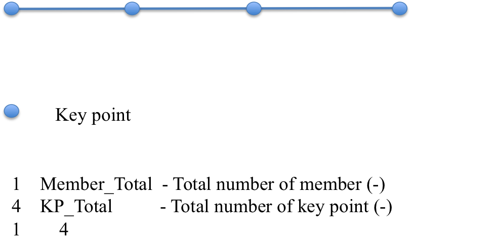
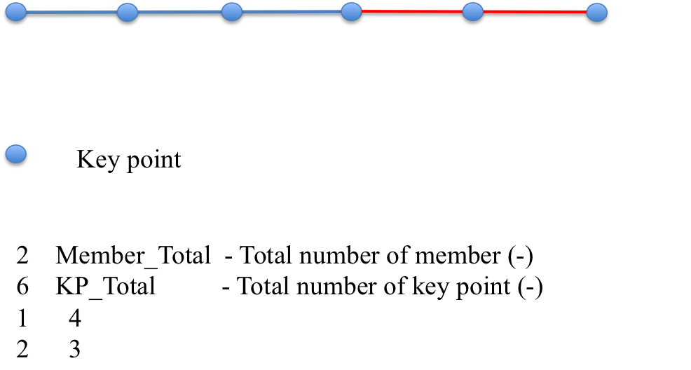
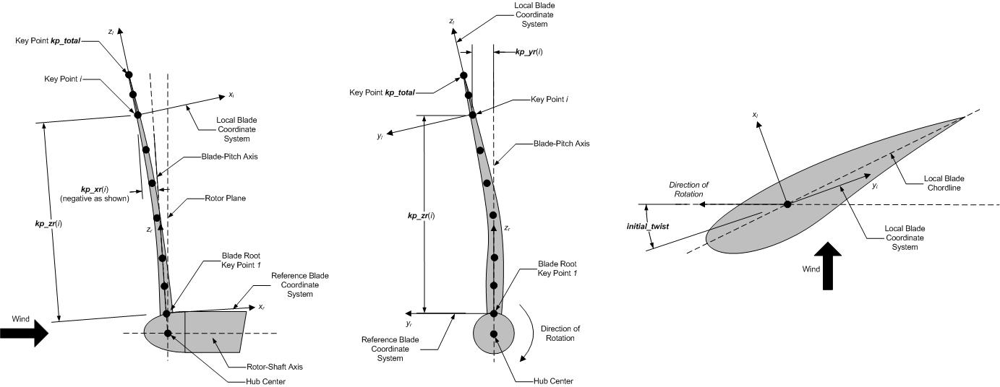

.. _bd-input-files:

Input Files
===========

Users specify the blade model parameters; including its geometry,
cross-sectional properties, and FE and output control parameters; via a
primary BeamDyn input file and a blade property input file. When used in
stand-alone mode, an additional driver input file is required. This
driver file specifies inputs normally provided to BeamDyn by FAST,
including simulation range, root motions, and externally applied loads.

No lines should be added or removed from the input files, except in
tables where the number of rows is specified.

Units
-----

BeamDyn uses the SI system (kg, m, s, N). Angles are assumed to be in
radians unless otherwise specified.

.. _driver-input-file:

BeamDyn Driver Input File
-------------------------

The driver input file is needed only for the stand-alone version of
BeamDyn. It contains inputs that are normally set by FAST and that are
necessary to control the simulation for uncoupled models.

The driver input file begins with two lines of header information, which
is for the user but is not used by the software. If BeamDyn is run in
the stand-alone mode, the results output file will be prefixed with the
same name of this driver input file.

A sample BeamDyn driver input file is given in :numref:`bd_input_files`.

Simulation Control Parameters
~~~~~~~~~~~~~~~~~~~~~~~~~~~~~
``DynamicSolve`` is a logical variable that specifies if BeamDyn should use dynamic analysis (``DynamicSolve = true``) 
or static analysis (``DynamicSolve = false``).
``t_initial`` and ``t_final`` specify the starting time of the simulation and ending time of the simulation, respectively. 
``dt`` specifies the time step size.

Gravity Parameters
~~~~~~~~~~~~~~~~~~

``Gx`` , ``Gy`` , and ``Gz`` specify the components of gravity vector along :math:`X`, :math:`Y`, and :math:`Z` directions in the global coordinate system, respectively.
In FAST, this is normally 0, 0, and -9.80665.

Inertial Frame Parameters
~~~~~~~~~~~~~~~~~~~~~~~~~

This section defines the relation between two inertial frames, the global coordinate system and initial blade reference coordinate system.
``GlbPos(1)``, ``GlbPos(2)``, and ``GlbPos(3)`` specify three components of the initial global position vector along :math:`X`, :math:`Y`, and :math:`Z` directions resolved in the global coordinate system, see Figure :numref:`frame`.
And the following :math:`3 \times 3` direction cosine matrix (``GlbDCM``) relates the rotations from the global coordinate system to the initial blade reference coordinate system.

.. _frame:

.. figure:: figs/frame.jpg
   :width: 80%
   :align: center

   Global and blade coordinate systems in BeamDyn.

Blade Floating Reference Frame Parameters
~~~~~~~~~~~~~~~~~~~~~~~~~~~~~~~~~~~~~~~~~

This section specifies the parameters that define the blade floating reference frame, which is a body-attached floating frame; the blade root is cantilevered at the origin of this frame. 
Based on the driver input file, the floating blade reference fame is assumed to be in a constant rigid-body rotation mode about the origin of the global coordinate system, that is,

.. math::
   :label: rootvelocity

   v_{rt} = \omega_r \times r_t

where :math:`v_{rt}` is the root (origin of the floating blade reference frame) translational velocity vector; :math:`\omega_r` is the constant root (origin of the floating blade reference frame) angular velocity vector; and :math:`r_t` is the global position vector introduced in the previous section at instant :math:`t`, see :numref:`frame`.
The floating blade reference frame coincides with the initial floating blade reference frame at the beginning :math:`t=0`.
``RootVel(4)``, ``RootVel(5)``, and ``RootVel(6)`` specify the three components of the constant root angular velocity vector about :math:`X`, :math:`Y`, and :math:`Z` axises in global coordinate system, respectively.
``RootVel(1)``, ``RootVel(2)``, and ``RootVel(3)``, which are the three components of the root translational velocity vector along :math:`X`, :math:`Y`, and :math:`Z` directions in global coordinate system, respectively, are calculated based on Eq. :eq:`rootvelocity`.

BeamDyn can handle more complicated root motions by changing, for example, the ``BD_InputSolve`` subroutine in the ``Driver_Beam.f90``
(requiring a recompile of stand-alone BeamDyn).

The blade is initialized in the rigid-body motion mode, i.e., based on the root velocity information defined in this section and the position information defined in the previous section, the motion of other points along the blade are initialized as

.. math::
    :label: ini-rootacct-travel-angvel

    a_{0} &= \omega_r \times (\omega_r \times (r_0 + P)) \\
    v_0 &= v_{r0} + \omega_r \times P \\
    \omega_0 &= \omega_r

where :math:`a_{0}` is the initial translational acceleration vector along the blade; :math:`v_0` and :math:`\omega_0` the initial translational and angular velocity vectors along the blade, respectively; and :math:`P` is the position vector along the blade relative to the root.
Note that these equations are actually implemented with a call to the NWTC Library's mesh mapping routines.

Applied Load
~~~~~~~~~~~~

This section defines the applied loads, including distributed, point (lumped), and
tip-concentrated loads, for the stand-alone analysis. 

The first six entries ``DistrLoad(i)``, :math:`i \in [1,6]`, specify three
components of uniformly distributed force vector and three components of
uniformly distributed moment vector in the global coordinate systems,
respectively. 

The following six entries ``TipLoad(i)``,
:math:`i \in [1,6]`, specify three components of concentrated tip force
vector and three components of concentrated tip moment vector in the
global coordinate system, respectively. 

``NumPointLoads`` defines how many point loads along the blade will be applied. The table 
following this input contains two header lines with seven columns and ``NumPointLoads`` rows. 
The first column is the non-dimensional distance along the local blade reference axis, 
ranging from :math:`[0.0,1.0]`. The next three columns, ``Fx``, ``Fy``, and ``Fz`` specify three
components of point-force vector. The remaining three columns, ``Mx``, ``My``, and ``Mz`` specify three
components of a moment vector.

The distributed load defined in this section is assumed to be uniform along the blade and constant
throughout the simulation. The tip load is a constant concentrated load applied at the tip of a blade.

It is noted that all the loads defined in
this section are dead loads, i.e., they are not rotating with the blade
following the rigid-body rotation defined in the previous section.

BeamDyn is capable of handling more complex loading cases, e.g.,
time-dependent loads, through customization of the source code
(requiring a recompile of stand-alone BeamDyn). The user can define such
loads in the ``BD_InputSolve`` subroutine in the ``Driver_Beam.f90`` file,
which is called every time step. The following section can be modified
to define the concentrated load at each FE node:

.. code-block:: fortran

       u%PointLoad%Force(1:3,u%PointLoad%NNodes)  = u%PointLoad%Force(1:3,u%PointLoad%NNodes)  + DvrData%TipLoad(1:3)
       u%PointLoad%Moment(1:3,u%PointLoad%NNodes) = u%PointLoad%Moment(1:3,u%PointLoad%NNodes) + DvrData%TipLoad(4:6)

where the first index in each array ranges from 1 to 3 for load vector
components along three global directions and the second index of each
array ranges from 1 to ``u%PointLoad%NNodes``, where the latter is the total
number of FE nodes. Note that ``u%PointLoad%Force(1:3,:)`` and ``u%PointLoad%Moment(1:3,:)`` 
have been populated with the point-load loads read from the BeamDyn driver input file 
using the call to ``Transfer_Point_to_Point`` earlier in the subroutine.

For example, a time-dependent sinusoidal force
acting along the :math:`X` direction applied at the :math:`2^{nd}` FE
node can be defined as

.. code-block:: fortran

       u%PointLoad%Force(:,:) = 0.0D0
       u%PointLoad%Force(1,2)  = 1.0D+03*SIN((2.0*pi)*t/6.0 )
       u%PointLoad%Moment(:,:) = 0.0D0

with ``1.0D+03`` being the amplitude and ``6.0`` being the
period. Note that this particular implementation overrides the tip-load and point-loads 
defined in the driver input file.

Similar to the concentrated load, the distributed loads can be defined
in the same subroutine

.. code-block:: fortran

       DO i=1,u%DistrLoad%NNodes
          u%DistrLoad%Force(1:3,i) = DvrData%DistrLoad(1:3)
          u%DistrLoad%Moment(1:3,i)= DvrData%DistrLoad(4:6)
       ENDDO

where ``u%DistrLoad%NNodes`` is the number of nodes input to BeamDyn (on the quadrature points),
and ``DvrData%DistrLoad(:)`` is the constant uniformly distributed load BeamDyn reads from the driver
input file. The user can modify ``DvrData%DistrLoad(:)`` to define the loads based on need.

We note that the distributed loads are defined at the quadrature points
for numerical integrations. For example, if Gauss quadrature is chosen, 
then the distributed loads are defined at
Gauss points plus the two end points of the beam (root and tip). For
trapezoidal quadrature, ``p%ngp`` stores the number of trapezoidal
quadrature points.

Primary Input File
~~~~~~~~~~~~~~~~~~

``InputFile`` is the file name of the primary BeamDyn input file. This
name should be in quotations and can contain an absolute path or a
relative path.

BeamDyn Primary Input File
--------------------------

The BeamDyn primary input file defines the blade geometry,
LSFE-discretization and simulation options, output channels, and name of
the blade input file. The geometry of the blade is defined by key-point
coordinates and initial twist angles (in units of degree) in the blade
local coordinate system (IEC standard blade system where :math:`Z_r`
is along blade axis from root to tip, :math:`X_r` directs normally
toward the suction side, and :math:`Y_r` directs normally toward the
trailing edge).

The file is organized into several functional sections. Each section
corresponds to an aspect of the BeamDyn model.

A sample BeamDyn primary input file is given in :numref:`bd_appendix`.

The primary input file begins with two lines of header information,
which are for the user but are not used by the software.

Simulation Controls
~~~~~~~~~~~~~~~~~~~

The user can set the ``Echo`` flag to ``TRUE`` to have BeamDyn echo the
contents of the BeamDyn input file (useful for debugging errors in the
input file).

The ``QuasiStaticInit`` flag indicates if BeamDyn should perform a quasi-static
solution at initialization to better initialize its states. In general, this should 
be set to true for better numerical performance (it reduces startup transients).

``rhoinf`` specifies the numerical damping parameter (spectral radius
of the amplification matrix) in the range of :math:`[0.0,1.0]` used in
the generalized-\ :math:`\alpha` time integrator implemented in BeamDyn
for dynamic analysis. For ``rhoinf = 1.0``, no
numerical damping is introduced and the generalized-\ :math:`\alpha`
scheme is identical to the Newmark scheme; for
``rhoinf = 0.0``, maximum numerical damping is
introduced. Numerical damping may help produce numerically stable
solutions.

``Quadrature`` specifies the spatial numerical integration scheme.
There are two options: 1) Gauss quadrature; and 2) Trapezoidal
quadrature. We note that in the current version, Gauss quadrature is
implemented in reduced form to improve efficiency and avoid shear
locking. In the trapezoidal quadrature, only one member (FE element) can
be defined in the following GEOMETRY section of the primary input file.
Trapezoidal quadrature is appropriate when the number of “blade input
stations” (described below) is significantly greater than the order of
the LSFE.

``Refine`` specifies a refinement parameter used in trapezoidal
quadrature. An integer value greater than unity will split the space
between two input stations into “Refine factor” of segments. The keyword
“DEFAULT” may be used to set it to 1, i.e., no refinement is needed.
This entry is not used in Gauss quadrature.

``N_Fact`` specifies a parameter used in the modified Newton-Raphson
scheme. If ``N_Fact = 1`` a full Newton
iteration scheme is used, i.e., the global tangent stiffness matrix is
computed and factorized at each iteration; if
``N_Fact > 1`` a modified Newton iteration
scheme is used, i.e., the global stiffness matrix is computed and
factorized every ``N_Fact`` iterations within each time step. The
keyword “DEFAULT” sets ``N_Fact = 5``.

``DTBeam`` specifies the constant time increment of the
time-integration in seconds. The keyword “DEFAULT” may be used to
indicate that the module should employ the time increment prescribed by
the driver code (FAST/stand-alone driver program).

``load_retries`` specifies the maximum number of load retries allowed. This option
currently works only for static analysis. For every load retry, the applied load is
halved to promote convergence of the Newton-Raphson scheme in iteration of smaller
load steps as opposed to one single large load step which may cause divergence of the
Newton-Raphson scheme. The keyword “DEFAULT” sets ``load_retries = 20``.

``NRMax`` specifies the maximum number of iterations per time step in
the Newton-Raphson scheme. If convergence is not reached within this
number of iterations, BeamDyn returns an error message and terminates
the simulation. The keyword “DEFAULT” sets
``NRMax = 10``.

``Stop_Tol`` specifies a tolerance parameter used in convergence
criteria of a nonlinear solution that is used for the termination of the
iteration. The keyword “DEFAULT” sets
``Stop_Tol = 1.0E-05``. Please refer to
:numref:`convergence-criterion` for more details.

``tngt_stf_fd`` is a boolean that sets the flag to compute the tangent stiffness
matrix using finite differencing instead of analytical differentiation. The
finite differencing is performed using a central scheme. The keyword “DEFAULT”
sets ``tngt_stf_fd = FALSE``.

``tngt_stf_comp`` is a boolean that sets the flag to compare the analytical tangent
stiffness matrix against the finite differenced tangent stiffness matrix. Information is
written to the terminal regarding the dof where the maximum difference is observed. If
``tngt_stf_fd = FALSE`` and ``tngt_stf_comp = TRUE``, the analytical tangent stiffness
matrix is used to solve the system of equations while the finite difference tangent stiffness
matrix is used only to perform the comparison of the two matrices. The keyword “DEFAULT”
sets ``tngt_stf_comp = FALSE``.

``tngt_stf_pert`` sets the perturbation size for finite differencing. The “DEFAULT” value
based on experience is set to ``1e-06``.

``tngt_stf_difftol`` is the maximum allowable relative difference between the analytical
and finite differenced tangent stiffness matrices. If for any entry in the matrices,
the relative difference exceeds this value the simulation will terminate. The “DEFAULT” value
is currently set to ``1e-01``.

``RotStates`` is a flag that indicates if BeamDyn's continuous states should be
oriented in the rotating frame during linearization analysis when coupled to OpenFAST. 
If multi-blade coordinate (MBC3) analysis is performed, ``RotStates`` must be ``true``.

Geometry Parameter
~~~~~~~~~~~~~~~~~~

The blade geometry is defined by a curvilinear local blade reference
axis. The blade reference axis locates the origin and orientation of
each a local coordinate system where the cross-sectional 6x6 stiffness
and mass matrices are defined in the BeamDyn blade input file. It should
not really matter where in the cross section the 6x6 stiffness and mass
matrices are defined relative to, as long as the reference axis is
consistently defined and closely follows the natural geometry of the
blade.

The blade beam model is composed of several *members* in contiguous
series and each member is defined by at least three key points in
BeamDyn. A cubic-spline-fit pre-processor implemented in BeamDyn
automatically generates the member based on the key points and then
interconnects the members into a blade. There is always a shared key
point at adjacent members; therefore the total number of key points is
related to number of members and key points in each member.

``member_total`` specifies the total number of beam members used in
the structure. With the LSFE discretization, a single member and a
sufficiently high element order, ``order_elem`` below, may well be
sufficient.

``kp_total`` specifies the total number of key points used to define
the beam members.

The following section contains ``member_total`` lines. Each line has
two integers providing the member number (must be 1, 2, 3, etc.,
sequentially) and the number of key points in this member, respectively.
It is noted that the number of key points in each member is not
independent of the total number of key points and they should satisfy
the following equality:

.. math::
   :label: keypoint

   kp\_total = \sum_{i=1}^{member\_total} n_i - member\_total +1

where :math:`n_i` is the number of key points in the :math:`i^{th}`
member. Because cubic splines are implemented in BeamDyn, :math:`n_i`
must be greater than or equal to three. Figures :numref:`geometry1-case1` and :numref:`geometry1-case2` show two
cases for member and key-point definition.

.. _geometry1-case1:

   Member and key point definition: one member defined by four key points;

.. _geometry1-case2:

   Member and key point definition: two members defined by six key points.

The next section defines the key-point information, preceded by two
header lines. Each key point is defined by three physical coordinates
(``kp_xr``, ``kp_yr``, ``kp_zr``) in the IEC standard blade
coordinate system (the blade reference coordinate system) along with a
structural twist angle (``initial_twist``) in the unit of degrees.
The structural twist angle is also following the IEC standard which is
defined as the twist about the negative :math:`Z_l` axis. The key points
are entered sequentially (from the root to tip) and there should be a
total of ``kp_total`` lines for BeamDyn to read in the information,
after two header lines. Please refer to :numref:`blade-geometry` for
more details on the blade geometry definition.

.. _blade-geometry:

   BeamDyn Blade Geometry - Top: Side View; Middle: Front View (Looking Downwind); Bottom: Cross Section View (Looking Toward the Tip, from the Root)

Mesh Parameter
~~~~~~~~~~~~~~

``Order_Elem`` specifies the order of shape functions for each finite
element. Each LSFE will have ``Order_Elem``\ +1 nodes located at the
GLL quadrature points. All LSFEs will have the same order. With the LSFE
discretization, an increase in accuracy will, in general, be better
achieved by increasing ``Order_Elem`` (i.e., :math:`p`-refinement)
rather than increasing the number of members (i.e.,
:math:`h`-refinement). For Gauss quadrature, ``Order_Elem`` should be
greater than one.

Material Parameter
~~~~~~~~~~~~~~~~~~

``BldFile`` is the file name of the blade input file. This name should
be in quotations and can contain an absolute path or a relative path.

Pitch Actuator Parameter
~~~~~~~~~~~~~~~~~~~~~~~~

In this release, the pitch actuator implemented in BeamDyn is not
available. The ``UsePitchAct`` should be set to “FALSE” in this
version, whereby the input blade-pitch angle prescribed by the driver
code is used to orient the blade directly. ``PitchJ``, ``PitchK``,
and ``PitchC`` specify the pitch actuator inertial, stiffness, and
damping coefficient, respectively. In future releases, specifying
``UsePitchAct`` :math:`=` TRUE will enable a second-order pitch
actuator, whereby the pitch angular orientation, velocity, and
acceleration are determined by the actuator based on the input
blade-pitch angle prescribed by the driver code.

.. _BD-Outputs:

Outputs
~~~~~~~

In this section of the primary input file, the user sets flags and
switches for the desired output behavior.

Specifying ``SumPrint = TRUE`` causes BeamDyn to generate a
summary file with name ``InputFile.sum``. See
:numref:`sum-file` for summary file details.

``OutFmt`` parameter controls the formatting of the results within the
stand-alone BeamDyn output file. It needs to be a valid Fortran format
string, but BeamDyn currently does not check the validity. This input is
unused when BeamDyn is used coupled to FAST.

``NNodeOuts`` specifies the number of nodes where output can be
written to a file. Currently, BeamDyn can output quantities at a maximum
of nine nodes.

``OutNd`` is a list ``NNodeOuts`` long of node numbers between 1 and the number of
nodes on the output mesh, separated by any
combination of commas, semicolons, spaces, and/or tabs. The nodal
positions are given in the summary file, if output. 
For Gassian quadrature, the number of nodes on the output mesh is the total number of FE nodes;
for trapezoidal quadrature, this is the number of quadrature nodes.

The ``OutList`` block contains a list of output parameters. Enter one
or more lines containing quoted strings that in turn contain one or more
output parameter names. Separate output parameter names by any
combination of commas, semicolons, spaces, and/or tabs. If you prefix a
parameter name with a minus sign, “-", underscore, “\_”, or the
characters “m” or “M”, BeamDyn will multiply the value for that channel
by -1 before writing the data. The parameters are written in the order
they are listed in the input file. BeamDyn allows you to use multiple
lines so that you can break your list into meaningful groups and so the
lines can be shorter. You may enter comments after the closing quote on
any of the lines. Entering a line with the string “END” at the beginning
of the line or at the beginning of a quoted string found at the
beginning of the line will cause BeamDyn to quit scanning for more lines
of channel names. Node-related quantities are generated for the
requested nodes identified through the OutNd list above. If BeamDyn
encounters an unknown/invalid channel name, it warns the users but will
remove the suspect channel from the output file. Please refer to
Appendix :numref:`app-output-channel` for a complete list of possible output
parameters and their names.

.. _BD-Nodal-Outputs:

.. include:: BDNodalOutputs.rst

Blade Input File
----------------

The blade input file defines the cross-sectional properties at various
stations along a blade and six damping coefficient for the whole blade.
A sample BeamDyn blade input file is given in :numref:`bd_appendix`.
The blade input file begins with two lines of header information, which
is for the user but is not used by the software.

Blade Parameters
~~~~~~~~~~~~~~~~

``Station_Total`` specifies the number cross-sectional stations along
the blade axis used in the analysis.

``Damp_Type`` specifies if structural damping is considered in the
analysis. If ``Damp_Type = 0``, then no damping is
considered in the analysis and the six damping coefficient in the next
section will be ignored. If ``Damp_Type = 1``, structural
damping will be included in the analysis.

Damping Coefficient
~~~~~~~~~~~~~~~~~~~

This section specifies six damping coefficients, :math:`\mu_{ii}` with
:math:`i \in [1,6]`, for six DOFs (three translations and three
rotations). Viscous damping is implemented in BeamDyn where the damping
forces are proportional to the strain rate. These are
stiffness-proportional damping coefficients, whereby the
:math:`6\times6` damping matrix at each cross section is scaled from the
:math:`6 \times 6` stiffness matrix by these diagonal entries of a
:math:`6 \times 6` scaling matrix:

.. math::
   :label: damping-force

   \mathcal{\underline{F}}^{Damp} = \underline{\underline{\mu}}~\underline{\underline{S}}~\dot{\underline{\epsilon}}

where :math:`\mathcal{\underline{F}}^{Damp}` is the damping force,
:math:`\underline{\underline{S}}` is the :math:`6 \times 6`
cross-sectional stiffness matrix, :math:`\dot{\underline{\epsilon}}` is
the strain rate, and :math:`\underline{\underline{\mu}}` is the damping
coefficient matrix defined as

.. math::
   :label: damp-matrix

   \underline{\underline{\mu}} =
   \begin{bmatrix}
       \mu_{11} & 0 & 0 & 0 & 0 & 0 \\
       0 & \mu_{22} & 0 & 0 & 0 & 0 \\
       0 & 0 & \mu_{33} & 0 & 0 & 0 \\
       0 & 0 & 0 & \mu_{44} & 0 & 0 \\
       0 & 0 & 0 & 0 & \mu_{55} & 0 \\
       0 & 0 & 0 & 0 & 0 & \mu_{66} \\
   \end{bmatrix}

Distributed Properties
~~~~~~~~~~~~~~~~~~~~~~

This section specifies the cross-sectional properties at each of the
``Station_Total`` stations. For each station, a non-dimensional
parameter :math:`\eta` specifies the station location along the local
blade reference axis ranging from :math:`[0.0,1.0]`. The first and last
station parameters must be set to :math:`0.0` (for the blade root) and
:math:`1.0` (for the blade tip), respectively.

Following the station location parameter :math:`\eta`, there are two
:math:`6 \times 6` matrices providing the structural and inertial
properties for this cross-section. First is the stiffness matrix and
then the mass matrix. We note that these matrices are defined in a local
coordinate system along the blade axis with :math:`Z_{l}` directing
toward the unit tangent vector of the blade reference axis. For a
cross-section without coupling effects, for example, the stiffness
matrix is given as follows:

.. math::
   :label: Stiffness

   \begin{bmatrix}
   K_{ShrFlp} & 0 & 0 & 0 & 0 & 0 \\
   0 & K_{ShrEdg} & 0 & 0 & 0 & 0 \\
   0 & 0& EA & 0 & 0 & 0 \\
   0 & 0 & 0 & EI_{Edg} & 0 & 0 \\
   0 & 0 & 0 & 0 & EI_{Flp} & 0 \\
   0 & 0 & 0 & 0 & 0 & GJ
   \end{bmatrix}

where :math:`K_{ShrEdg}` and :math:`K_{ShrFlp}` are the edge and flap
shear stiffnesses, respectively; :math:`EA` is the extension stiffness;
:math:`EI_{Edg}` and :math:`EI_{Flp}` are the edge and flap stiffnesses,
respectively; and :math:`GJ` is the torsional stiffness. It is pointed
out that for a generic cross-section, the sectional property matrices
can be derived from a sectional analysis tool, e.g. VABS, BECAS, or
NuMAD/BPE.

A generalized sectional mass matrix is given by:

.. math::
   :label: Mass

   \begin{bmatrix}
   m & 0 & 0 & 0 & 0 & -m Y_{cm} \\
   0 & m & 0 & 0 & 0 & m X_{cm}\\
   0 & 0& m & m Y_{cm} & -m X_{cm} & 0 \\
   0 & 0 & m Y_{cm} & i_{Edg} & -i_{cp} & 0 \\
   0 & 0 &-m X_{cm} & -i_{cp} & i_{Flp} & 0 \\
   -m Y_{cm} & m X_{cm} & 0 & 0 & 0 & i_{plr}
   \end{bmatrix}

where :math:`m` is the mass density per unit span; :math:`X_{cm}` and
:math:`Y_{cm}` are the local coordinates of the sectional center of
mass, respectively; :math:`i_{Edg}` and :math:`i_{Flp}` are the edge and
flap mass moments of inertia per unit span, respectively;
:math:`i_{plr}` is the polar moment of inertia per unit span; and
:math:`i_{cp}` is the sectional cross-product of inertia per unit span.
We note that for beam structure, the :math:`i_{plr}` is given as
(although this relationship is not checked by BeamDyn)

.. math::
   :label: PolarMOI

   i_{plr} = i_{Edg} + i_{Flp}
