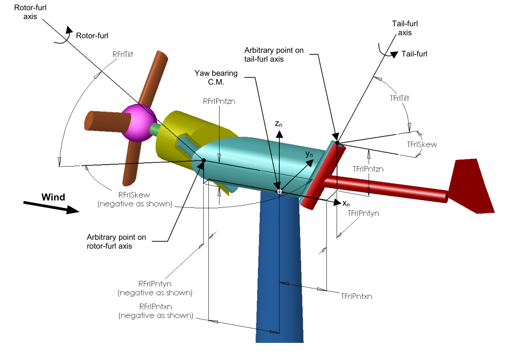
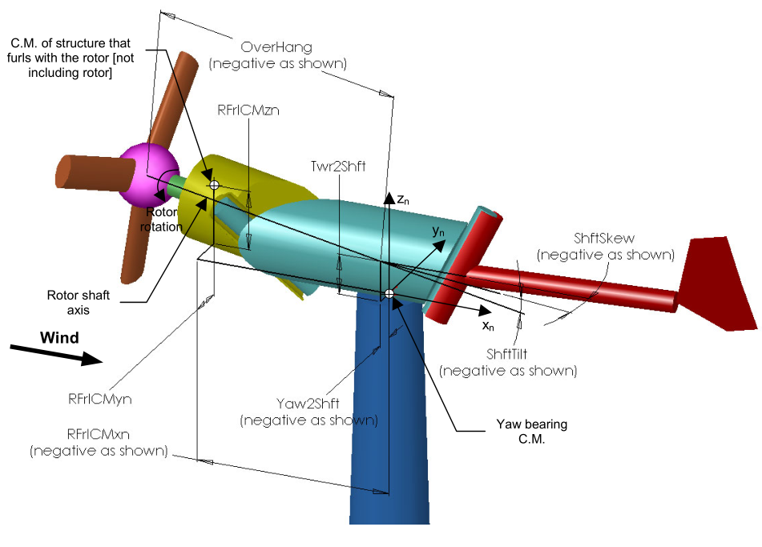
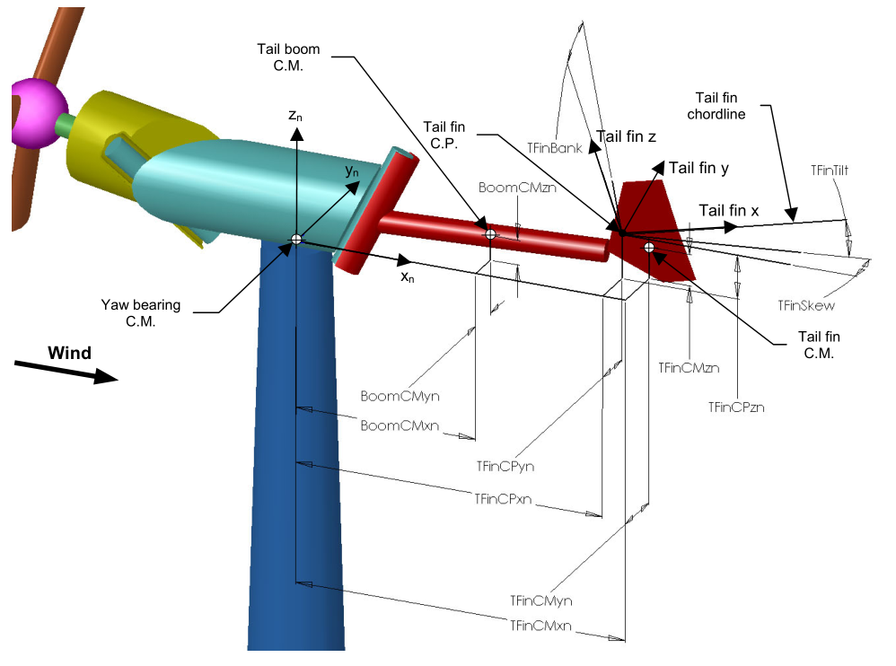

.. _ed_coordsys:

Coordinate systems
==================

For the coordinates system not detailed in subsections below, please refer to the following references:

- :download:`OpenFAST_coords.pdf <../../../OtherSupporting/OpenFAST_coords.pdf>`:
  Presentation from 2024 overviewing some coordinate systems in OpenFAST.

- `FAST 7 Manual <https://www.nrel.gov/docs/fy06osti/38230.pdf>`_

- `Technical report <https://www.nrel.gov/docs/fy04osti/34755.pdf>`_ on FAST_AD and modeling of the UAE wind turbine (in section 3)

- :download:`FASTCoordinateSystems.doc <../../../OtherSupporting/ElastoDyn/FASTCoordinateSystems.doc>`:
  Documents the transformation matrices relating each coordinate system in OpenFAST. Unfortunately, there are no pictures in this document that diagram these coordinate systems. They can hopefully be visualized by means of the transformation matrices.

.. _ed_rfrl_coordsys:

Rotor-Furl coordinate system
----------------------------
The rotor-furl DOF allows the user to model the
unusual configuration of a bearing that permits the
rotor and drivetrain to rotate about the yawing-portion
of the structure atop the tower. The rotor-furl DOF can
alternatively be used to model torsional flexibility in
the gearbox mounting if the rotor-furl axis is aligned
with the rotor shaft axis. In order to include rotor-
furling in the model, the user must designate the turbine
as a furling machine by setting input ``Furling`` from the
primary input file to True. Then, the user must assemble
the furling input file, ``FurlFile``, and use the rotor-furl
flag, RFrlDOF, to enable this feature.
The angular rotor-furl motion takes place about the
rotor-furl axis defined by inputs:
``RFrlPnt_n``,
``RFrlSkew``, and ``RFrlTilt``.
available in FurlFile. 
The input ``RFrlPnt_n`` locate an arbitrary point on the rotor-
furl axis relative to the tower-top. Inputs ``RFrlSkew``
and ``RFrlTilt`` then define the angular orientation of the
rotor-furl axis passing through this point. 
See :numref:`figTFAxes` for a schematic.

The geometries of the hub and rotor-furl structure
mass center, which are both components of the furling-
rotor assembly, are defined relative to the tower-top as
shown in :numref:`figTFFurl`.
This definition was chosen in
order to avoid having to define a coordinate system in
the furling-rotor assembly since such a coordinate
system would most likely have an obscure orientation,
making it difficult for users to input configuration
information relative to it. This definition also avoids
the complications involved in having to define
geometries differently, depending on whether or not a
rotor-furl assembly exists separately from the nacelle,
which depends on whether rotor-furl is present or
absent in the turbine. 

Since the component geometry of the furling-rotor
assembly is defined relative to the tower-top, this
geometry naturally changes with the rotor-furl angle.
In order to avoid having to define different geometries
for different rotor-furl positions (for example,
variations in the initial rotor-furl angle), ElastoDyn expects
the component geometry of the furling-rotor assembly
to be defined/input at a rotor-furl angle of zero. As
such, the initial rotor-furl angle does not affect the
specification of any other rotor-furl geometry. Stated
another way, the input geometries for the rotor-furl
assembly components define the rotor configuration
when the rotor-furl angle is zero regardless of initial
rotor-furl position. Users should be clear of this
convention when assembling their furling input file.

.. _ed_tfrl_coordsys:

Tail-Furl coordinate system
---------------------------
The tail-furl DOF allows the user to model the unusual
configuration of a bearing that permits the tail to rotate
about the yawing-portion of the structure atop the
tower. In order to include tail-furling in a model,
the user must designate the turbine as a furling machine by
setting the input ``Furling`` from the ElastoDyn input file to
True. Then you must assemble the furling input file,
``FurlFile``, and use the tail-furl flag, ``TFrlDOF``, to enable
this feature.
The angular tail-furl motion takes place about the
tail-furl axis defined by inputs ``TFrlPnt_n``, ``TFrlSkew``, and ``TFrlTilt`` available in
``FurlFile``.
The input ``TFrlPnt_n`` locate an arbitrary point on the tail-furl axis
relative to the tower-top. 
See :numref:`figTFAxes` for a schematic.

The geometries of the tail boom mass center, tail
fin mass center, and tail fin aerodynamic surface,
which are all components of the furling-tail assembly,
are defined relative to the tower-top as shown in :numref:`figTFGeom`.
This definition was chosen in order to avoid
having to define a coordinate system in the furling-tail
assembly since such a coordinate system would most
likely have an obscure orientation, making it difficult
for users to input configuration information relative to
it. This definition also avoids the complications
involved in having to define geometries differently,
depending on whether or not a tail-furl assembly exists
separately from the nacelle, which depends on whether
tail-furl is present or absent in the turbine.

Since the component geometry of the furling-tail
assembly is defined relative to the tower-top, this
geometry naturally changes with the tail-furl angle. In
order to avoid having to define different geometries for
different tail-furl positions (for example, variations in
the initial tail-furl angle), ElastoDyn expects the component
geometry of the furling-tail assembly to be
defined/input at a tail-furl angle of zero. As such, the
initial tail-furl angle does not affect the specification of
any other tail-furl geometry. Stated another way, the
input geometries for the tail-furl assembly components
define the tail configuration when the tail-furl angle is
zero regardless of initial tail-furl position. Users
should be clear of this convention when assembling
their furling input file. Further clarification on this
furling geometry convention is provided in the Rotor-
Furl section above.

.. _figTFAxes:

           
   Layout of a three-bladed, upwind, furling turbine: furl axes

.. _figTFFurl:

           
   Layout of a three-bladed, upwind, furling turbine: rotor-furl structure

.. _figTFGeom:

           
   Layout of a three-bladed, upwind, furling turbine: tail-furl structure.  
   NOTE: The tail fin "CP" (center of pressure) parameters are now replaced by the location of the reference point.

