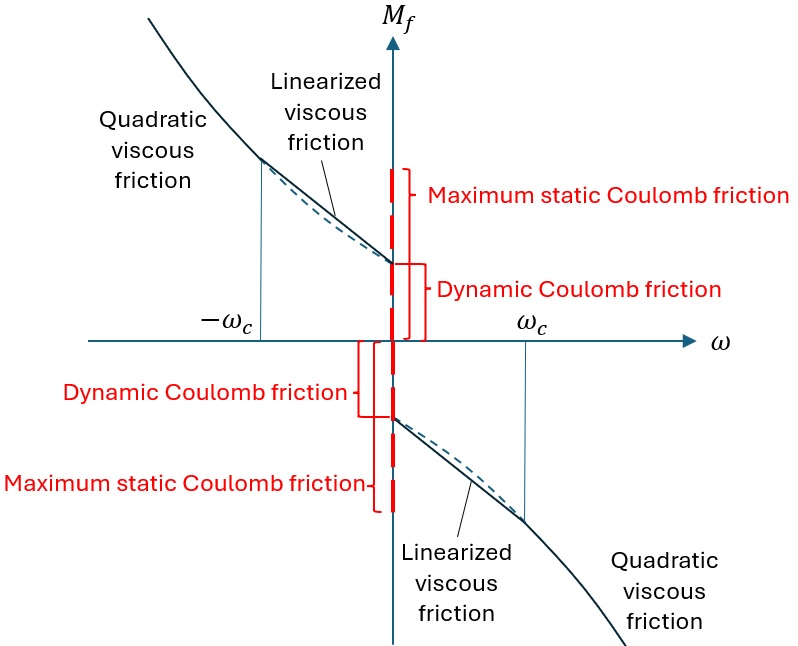

.. _ed_theory:

ElastoDyn Theory
================

Note this document is work in progress and is greatly incomplete. 
This documentation was started to document some code changes to the the tail furl and rotor furl part of ElastoDyn. 
Please refer to the different ressources provided in :numref:`ed_intro` for additional documents.

Notations
---------

**Points**

The following (partial) list of points are defined by ElastoDyn:

- ``Z``: the platform reference point
- ``O``: the tower-top/base plate point
- ``W``: the specified point on the tail-furl axis
- ``I``: the tail boom center of mass
- ``J``: the tail fin center of mass

**Bodies**

The following (partial) list of bodies are defined by ElastoDyn:

- ``E``: the earth/inertial frame
- ``X``: the platform body
- ``N``: the nacelle body
- ``A``: the tail-furl body

Kinematics
----------

ElastoDyn computes the position, velocity and accelerations of key points of the structure, starting from the platform reference point `Z` and going up in the structure.

The different position vectors are available in the data stucture ``RtHSdat``.
For instance, the global position of point J is given by:

.. math::  :label: TFPointJPos

   \boldsymbol{r}_J =  \boldsymbol{r}_Z +  \boldsymbol{r}_{ZO} +  \boldsymbol{r}_{OW} +  \boldsymbol{r}_{WJ}

The translational displacement vector (how much a point has moved compared to its reference position)  is calculated as follows: :math:`\boldsymbol{r}_J-\boldsymbol{r}_{J,\text{ref}}`.

The coordinate systems of ElastoDyn are stored in the variable ``CoordSys``.
The orientation matrix of a given coordinate system can be formed using the unit vectors (assumed to be column vectors) of a given coordinate system expressed in the inertial frame.
For instance for the tailfin coordinate system:

.. math::  :label: TFPointJOrientation

   \boldsymbol{R}_{Ai} = \begin{bmatrix}
      \left.\boldsymbol{\hat{x}_\text{tf}^t}\right|_i \\
      \left.\boldsymbol{\hat{y}_\text{tf}^t}\right|_i \\
      \left.\boldsymbol{\hat{z}_\text{tf}^t}\right|_i \\
   \end{bmatrix}

Angular velocities are stored in variables ``RtHSdat%AngVelE*`` with respect to the initial frame ("Earth", `E`). 
For instance, the angular velocity of the tail-furl body (body `A`) is:

.. math::  :label: TFPointJAngVel

   \boldsymbol{\omega}_{A/E} =  \boldsymbol{\omega}_{X/E} + \boldsymbol{\omega}_{N/X} + \boldsymbol{\omega}_{A/N}

where :math:`\boldsymbol{\omega}_{N/X}=\boldsymbol{\omega}_{B/X}+\boldsymbol{\omega}_{N/B}`

Linear (translational) velocities of the different points are found in the variables ``RtHSdat%LinVelE*``, and are computed based on Kane's partial velocities (which are Jacobians of the velocity with respect to the time derivatives of the degrees of freedom).
For instance, the linear velocity of point J is computed as:

.. math:: :label: TFPointJVel

    \boldsymbol{v}_J = \sum_{j} \frac{\partial v_J}{\partial \dot{q}_j} \dot{q}_j

where the Jacobians :math:`\frac{\partial v_J}{\partial \dot{q}_j}` are stored in ``RtHSdat%PLinVelEJ(:,0)`` 

Translational accelerations are computed as the sum of contribution from the first and second time derivatives of the degrees of freedom.
For instance, the acceleration of point `J` is computed as:

.. math:: :label: TFPointJAng

    \boldsymbol{\tilde{a}}_J &= \sum_{j\in PA} \frac{\partial a_J}{\partial \dot{q}_j} \dot{q}_j

    \boldsymbol{a}_J &= \boldsymbol{\tilde{a}}_J + \sum_{j\in PA} \frac{\partial v_J}{\partial \dot{q}_j} \ddot{q}_j

where  :math:`\frac{\partial a_J}{\partial \dot{q}_j}` are stored in ``RtHSdat%PLinVelEJ(:,1)``

Angular accelerations requires similar computations currently not documented.

.. _ed_rtfrl_theory:

Rotor and tail furl
-------------------

The user can select linear spring and damper models, together with 
up- and down-stop springs, and up- and down-stop dampers. 

The torque applied from the linear spring and damper is:

.. math::  :label: TFLinTorque

   Q_\text{lin} = - k \theta  - d \dot{\theta}

where :math:`\theta` is the degree of freedom (rotor or tail furl), 
:math:`k` is the linear spring constant (``RFrlSpr`` or ``TFrlSpr``)
:math:`d` is the linear damping constant (``RFrlDmp`` or ``TFrlDmp``).

The up-/down- stop spring torque is defined as:

.. math::  :label: TFStopTorqueSpring

   Q_\text{stop, spr} = \begin{cases} 
      - k_{US} (\theta-\theta_{k_{US}}),&\text{if } \theta>\theta_{k_{US}}  \\ 
      - k_{DS} (\theta-\theta_{k_{DS}}),&\text{if } \theta<\theta_{k_{DS}}  \\ 
        0 ,&\text{otherwise}
        \end{cases}

where 
:math:`k_{US}` is the up-stop spring constant (``RFrlUSSpr`` or ``TFrlUSSpr``),
:math:`\theta_{k_{US}}` is the up-stop spring angle (``RFrlUSSP`` or ``TFrlUSSP``),
and similar notations are used for the down-stop spring.

The up-/down- stop damping torque is defined as:

.. math::  :label: TFStopTorqueDamp

   Q_\text{stop, dmp} = \begin{cases} 
      - d_{US} \dot{\theta},&\text{if } \theta>\theta_{d_{US}}  \\ 
      - d_{DS} \dot{\theta},&\text{if } \theta<\theta_{d_{DS}}  \\ 
        0 ,&\text{otherwise}
        \end{cases}

where similar nnotations are used.
The total moment on the given degree of freedom is:

.. math::  :label: TFTotTorque

   Q = Q_\text{lin} + Q_\text{stop,spr} + Q_\text{stop,dmp}

.. _ed_yawfriction_theory:

Yaw-friction model
------------------
A yaw-friction model is implemented in ElastoDyn based on a Coulomb-viscous approach.
The yaw-friction moment as a function of yaw rate (:math:`\omega`) is shown below in :numref:`figYawFriction`

.. _figYawFriction:

           
   Yaw-friction model

When ``YawFrctMod`` = 1, the maximum static or dynamic Coulomb friction does not depend on the external load on the yaw bearing. The yaw-friction torque :math:`M_f` can be calculated as follows.
If :math:`\omega\neq0`, we have dynamic friction of the form

.. math::
   M_f = -(\mu_d\bar{D})\cdot\textrm{sign}(\omega) - M_{f,vis},

where :math:`\bar{D}` is the effective yaw-bearing diameter and :math:`\mu_d` is the dynamic Coulomb friction coefficient. Their product, :math:`\mu_d\bar{D}`, is specified in the input file through ``M_CD``. The first term on the right-hand side is the dynamic Coulomb friction.
The viscous friction, :math:`M_{f,vis}`, is of the form

.. math::
   M_{f,vis} = \sigma_v\omega + \sigma_{v2}\omega\left|\omega\right|\qquad\qquad\text{if}~\left|\omega\right|\ge\omega_c,

or 

.. math::
   M_{f,vis} = (\sigma_v + \sigma_{v2}\omega_c)\omega\qquad\qquad\text{if}~\left|\omega\right|\le\omega_c,

where :math:`\sigma_v` and :math:`\sigma_{v2}` are the linear and quadratic viscous friction coefficients and :math:`\omega_c` is the cutoff yaw rate below which viscous friction is linearized. Setting :math:`\omega_c=0` disables the linearization of viscous friction.

If :math:`\omega=0` and :math:`\dot{\omega}\neq 0`, we have a slightly modified dynamic Coulomb friction of the form

.. math::
   M_f = -\textrm{min}\!\left(\mu_d\bar{D},\left|M_z\right|\right)\cdot\textrm{sign}(M_z),

where :math:`M_z` is the external yaw torque.
If :math:`\omega=0` and :math:`\dot{\omega}=0`, we have static Coulomb friction of the form

.. math::
   M_f = -\textrm{min}\!\left(\mu_s\bar{D},\left|M_z\right|\right)\cdot\textrm{sign}(M_z),

where :math:`\mu_s` is the static Coulomb friction coefficient. The product :math:`\mu_s\bar{D}` is specified in the input file through ``M_CSmax``.

When ``YawFrctMod`` = 2, the maximum static or dynamic Coulomb friction depends on the external load on the yaw bearing, with proportional contributions from :math:`\left|F_z\right|`, the magnitude of the bearing axial load, if :math:`F_z<0`, from the bearing shear force magnitude, :math:`\sqrt{F_x^2+F_y^2}`, and from the bearing bending moment magnitude, :math:`\sqrt{M_x^2+M_y^2}`.
If :math:`\omega\neq0`, we have dynamic friction of the form

.. math::
   M_f = \left(\mu_d\bar{D}\cdot\textrm{min}\!\left(0,F_z\right)-\mu_{df}\bar{D}\sqrt{F_x^2+F_y^2}-\mu_{dm}\sqrt{M_x^2+M_y^2}\right)\cdot\textrm{sign}(\omega) - M_{f,vis},

where :math:`M_{f,vis}` is defined in the same way as when ``YawFrctMod`` = 1. The product :math:`\mu_{df}\bar{D}` and :math:`\mu_{dm}` are specified in the input file through ``M_FCD`` and ``M_MCD``, respectively. 
If :math:`\omega=0` and :math:`\dot{\omega}\neq 0`, we have a modified dynamic Coulomb friction of the form

.. math::
   M_f = -\textrm{min}\!\left(\mu_d\bar{D}\left|\textrm{min}(0,F_z)\right| + \mu_{df}\bar{D}\sqrt{F_x^2+F_y^2} + \mu_{dm}\sqrt{M_x^2+M_y^2},\left|M_z\right|\right)\cdot\textrm{sign}(M_z).

If :math:`\omega=0` and :math:`\dot{\omega}=0`, we have static Coulomb friction of the form

.. math::
   M_f = -\textrm{min}\!\left(\mu_s\bar{D}\left|\textrm{min}(0,F_z)\right| + \mu_{sf}\bar{D}\sqrt{F_x^2+F_y^2} + \mu_{sm}\sqrt{M_x^2+M_y^2},\left|M_z\right|\right)\cdot\textrm{sign}(M_z),

where the product :math:`\mu_{sf}\bar{D}` and :math:`\mu_{sm}` are specified in the input file through ``M_FCSmax`` and ``M_MCSmax``, respectively.

The static 'stiction' (where the static contribution exceeds the dynamic Coulomb friction) is only applied if both the yaw rotational velocity and acceleration at the current time-step are zero.
The static portion of the friction is omitted if the rotational acceleration is not null.
This is to account for the fact that a 'warm' joint may not feel stiction when crossing through zero velocity in a dynamic sense :cite:`ed-hammam2023`.
When :math:`\omega=0`, the yaw-bearing static or dynamic friction is formulated such that the frictional resistance opposes the external applied moment, :math:`M_z`, without overcoming it.

.. _ed_dev_notes:

Developer notes
===============

**Internal coordinate systems**

The different coordinate systems of ElastoDyn are stored in the variable ``CoordSys``.
The coordinate systems used internally by ElastoDyn are using a different convention than the OpenFAST input/output coordinate system. 

For instance, for the coordinate system of the nacelle, with unit axes noted :math:`x_n,y_n,z_n` in OpenFAST, and :math:`d_1,d_2,d_3` in ElastoDyn, the following conversions apply:
:math:`d_1 = x_n`,  
:math:`d_2 =z_n` and 
:math:`d_3 =-y_n`.

The following (partial) list of coordinate systems are defined internally by ElastoDyn:

-  `z` : inertial coordinate system 
-  `a` : tower base coordinate system 
-  `t` : tower-node coordinate system (one per node)
-  `d` : nacelle coordinate system 
-  `c` : shaft-tilted coordinate system 
-  `rf` : rotor furl coordinate system 
-  `tf` : tail furl coordinate system 
-  `g` : hub coordinate system 
