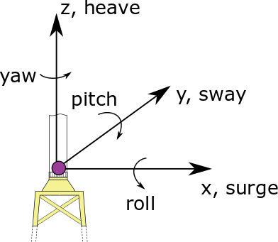

.. _ep-theory:

Theory
------

This section focuses on the theory behind the ExtPtfm module.
The theory was published in the following
article :cite:`ep-Branlard:2020superelement`
(`access article here <https://iopscience.iop.org/article/10.1088/1742-6596/1452/1/012033>`_)
which may be used to reference this documention.

ExtPtfm relies on a dynamics system reduction via 
the Craig-Bampton (C-B) method :cite:`ep-CraigBampton:1968`.

Reduction of the equations of motion
~~~~~~~~~~~~~~~~~~~~~~~~~~~~~~~~~~~~

The dynamics of a structure are defined by
:math:`\boldsymbol{M}\boldsymbol{\ddot{x}}+\boldsymbol{C}\boldsymbol{\dot{x}}+\boldsymbol{K}\boldsymbol{x}=\boldsymbol{f}`,
where :math:`\boldsymbol{M}`, :math:`\boldsymbol{C}`,
:math:`\boldsymbol{K}` are the mass, damping, and stiffness matrices;
:math:`\boldsymbol{x}` is the vector of DOF; and :math:`\boldsymbol{f}`
is the vector of loads acting on the DOF. 
This system of equations is typcally set up for the support structure by
a commercial software.
The 
typical number of DOF for a jacket substructure is about :math:`10^3` to
:math:`10^4`. The DOF are first partitioned and rearranged into a set of
leader and follower DOF, labelled with the subscript :math:`l` and
:math:`f`, respectively. In the case of the substructure, the six
degrees of freedom corresponding to the three translations and rotations
of the interface point between the substructure and the tower are
selected as leader DOF. Assuming symmetry of the system matrices, the
rearranged equation of motions are:

.. math:: :label: ReductionGeneralEq

   \begin{aligned}
       \begin{bmatrix}
           \boldsymbol{M}_{{\ell\!\ell}}   & \boldsymbol{M}_{{\ell\!f}} \\
           \boldsymbol{M}_{{\ell\!f}}^t & \boldsymbol{M}_{{\!f\!f}} \\
       \end{bmatrix}
       \begin{bmatrix}
           \boldsymbol{\ddot{x}}_{\ell}\\
           \boldsymbol{\ddot{x}}_{\!f}\\
       \end{bmatrix}
       +
       \begin{bmatrix}
           \boldsymbol{C}_{{\ell\!\ell}}   & \boldsymbol{C}_{{\ell\!f}} \\
           \boldsymbol{C}_{{\ell\!f}}^t & \boldsymbol{C}_{{\!f\!f}} \\
       \end{bmatrix}
       \begin{bmatrix}
           \boldsymbol{\dot{x}}_{\ell}\\
           \boldsymbol{\dot{x}}_{\!f}\\
       \end{bmatrix}
       +
       \begin{bmatrix}
           \boldsymbol{K}_{{\ell\!\ell}}   & \boldsymbol{K}_{{\ell\!f}} \\
           \boldsymbol{K}_{{\ell\!f}}^t & \boldsymbol{K}_{{\!f\!f}} \\
       \end{bmatrix}
       \begin{bmatrix}
           \boldsymbol{x}_{\ell}\\
           \boldsymbol{x}_{\!f}\\
       \end{bmatrix}
       =
       \begin{bmatrix}
           \boldsymbol{f}_{\ell}\\
           \boldsymbol{f}_{\!f}\\
       \end{bmatrix}
   \end{aligned}

The CB reduction assumes that the followers’ motion consists of two
parts: (1) the elastic motion that would occur in response to the motion
of the leader DOF if the inertia of the followers and the external
forces were neglected; and (2) the internal motion that would result
from the external forces directly exciting the internal DOF. The first
part is effectively obtained from 
Eq. :eq:`ReductionGeneralEq`
by assuming statics and solving
for :math:`\boldsymbol{x}_{\!f}`, leading to:

.. math:: :label: FollowMotion

   \begin{aligned}
       \boldsymbol{x}_{{\!f},\text{Guyan}}
       =  -\boldsymbol{K}_{{\!f\!f}}^{-1} \boldsymbol{K}_{{\ell\!f}}^t\,  \boldsymbol{x}_{{\ell},\text{Guyan}}
       =  \boldsymbol{\Phi}_1  \boldsymbol{x}_{{\ell},\text{Guyan}}
       ,\quad
           \text{where}
       \quad
   \boldsymbol{\Phi}_1 =-\boldsymbol{K}_{{\!f\!f}}^{-1} \boldsymbol{K}_{{\ell\!f}}^t
   \end{aligned}

Eq. :eq:`FollowMotion` provides the motion of the followers as a function of the leaders’
motion under the assumptions of the Guyan
reduction :cite:`ep-Guyan:1965`.

The CB method further considers the isolated and undamped eigenvalue
problem of the follower DOF:
:math:`\left(\boldsymbol{K}_{{\!f\!f}}-\nu_i^2 \boldsymbol{M}_{\text{ff}}\right) \boldsymbol{\phi}_i=0`
where :math:`\nu_i` and :math:`\boldsymbol{\phi}_i` are the
:math:`i^{th}` angular frequency and mode shape, respectively; this
problem is “constrained” because it inherently assumes that the leader
DOF are fixed (i.e., zero). The method next selects :math:`n_\text{CB}`
mode shapes, gathering them as column vectors into a matrix noted
:math:`\boldsymbol{\Phi}_2`. These mode shapes can be selected as the
ones with the lowest frequency or a mix of low- and high-frequency mode
shapes. Typically, :math:`n_\text{CB}` is several orders of magnitude
smaller than the original number of DOF, going from :math:`\sim10^3` DOF
to :math:`\sim 20` modes for a wind turbine substructure. The scaling of
the modes is chosen such that
:math:`\boldsymbol{\Phi}_2^t\boldsymbol{M}_{{\!f\!f}}\boldsymbol{\Phi}_2 = \boldsymbol{I}`,
where :math:`\boldsymbol{I}` is the identity matrix. Effectively, the CB
method performs a change of coordinates from the full set,
:math:`\boldsymbol{x}=[\boldsymbol{x}_l\ \boldsymbol{x}_{\!f}]^t`, to
the reduced set,
:math:`\boldsymbol{x}_r=[\boldsymbol{x}_{r1}\ \boldsymbol{x}_{r2}]^t`,
where :math:`\boldsymbol{x}_{r1}` corresponds directly to the leader
DOF, whereas :math:`\boldsymbol{x}_{r2}` are the modal coordinates
defining the amplitudes of each of the mode shapes selected. The change
of variable is formally written as:

.. math:: :label: CraigBampton

   \begin{aligned}
       \begin{bmatrix}
       \boldsymbol{x}_l \\
       \boldsymbol{x}_{\!f}\\
       \end{bmatrix}
       \approx
       \begin{bmatrix}
           \boldsymbol{I} & \boldsymbol{0} \\
           \boldsymbol{\Phi}_1 & \boldsymbol{\Phi}_2\\
       \end{bmatrix}
       \begin{bmatrix}
           \boldsymbol{x}_{r1}\\
           \boldsymbol{x}_{r2}\\
       \end{bmatrix}
       \quad\Leftrightarrow \quad
       \boldsymbol{x}\approx \boldsymbol{T} \boldsymbol{x}_r
           ,
       \quad
   \text{with}
       \quad
       \boldsymbol{T}=
       \begin{bmatrix}
           \boldsymbol{I} & \boldsymbol{0} \\
           \boldsymbol{\Phi}_1 & \boldsymbol{\Phi}_2\\
       \end{bmatrix}
   \end{aligned}

The equations of motion are rewritten in these coordinates by the
transformation:
:math:`\boldsymbol{M}_r =\boldsymbol{T}^t \boldsymbol{M} \boldsymbol{T}`,
:math:`\boldsymbol{K}_r =\boldsymbol{T}^t \boldsymbol{K} \boldsymbol{T}`,
:math:`\boldsymbol{f}_r =\boldsymbol{T}^t \boldsymbol{f}`,
leading to
:math:`\boldsymbol{M}_r \boldsymbol{\ddot{x}}_r + \boldsymbol{K_r}\boldsymbol{x}_r=\boldsymbol{f}_r`,
which is written in a developed form as:

.. math:: :label: CBLoadsReduction

   \begin{aligned}
       &
           \qquad
           \qquad
           \begin{bmatrix}
           \boldsymbol{M}_{r11} & \boldsymbol{M}_{r12} \\
           \boldsymbol{M}_{r12}^t & \boldsymbol{M}_{r22} \\
       \end{bmatrix}
       \begin{bmatrix}
           \boldsymbol{\ddot{x}}_{r1}\\
           \boldsymbol{\ddot{x}}_{r2}\\
       \end{bmatrix}
       +
       \begin{bmatrix}
           \boldsymbol{K}_{r11} & \boldsymbol{0} \\
       \boldsymbol{0} & \boldsymbol{K}_{r22} \\
       \end{bmatrix}
       \begin{bmatrix}
           \boldsymbol{x}_{r1}\\
           \boldsymbol{x}_{r2}\\
       \end{bmatrix}
       =
       \begin{bmatrix} 
           \boldsymbol{f}_{r1}\\
           \boldsymbol{f}_{r2}\\
       \end{bmatrix}
       \label{eq:CraigBampton}
   \end{aligned}

with

.. math::

   \begin{aligned}
      & \boldsymbol{M}_{r11} = \boldsymbol{M}_{{\ell\!\ell}}
                     + \boldsymbol{\Phi}_\text{1}^t \boldsymbol{M}_{f\!\ell}
                     + \boldsymbol{M}_{\ell\!f}\boldsymbol{\Phi}_\text{1}
                     + \boldsymbol{\Phi}_\text{1}^t \boldsymbol{M}_{\!f\!f}\boldsymbol{\Phi}_{1}
   ,\qquad
       \boldsymbol{M}_{r22}=\boldsymbol{\Phi}_2^t\boldsymbol{M}_{\!f\!f}\boldsymbol{\Phi}_2 =\boldsymbol{I}
   \nonumber
   \\
      & \boldsymbol{M}_{r12} = \left(\boldsymbol{M}_{\ell\!f}+ \boldsymbol{\Phi}_\text{1}^t \boldsymbol{M}_{\!f\!f}\right)\boldsymbol{\Phi}_2
   ,\qquad
       \boldsymbol{f}_{r2} = \boldsymbol{\Phi}_2^t \boldsymbol{f}_{\!f}
   ,\qquad
       \boldsymbol{f}_{r1} = \boldsymbol{f}_{\ell}+\boldsymbol{\Phi}_1^t \boldsymbol{f}_{\!f}
   \nonumber
   \\
      & \boldsymbol{K}_{r11} = \boldsymbol{K}_{{\ell\!\ell}} + \boldsymbol{K}_{\ell\!f}\boldsymbol{\Phi}_1
   ,\qquad
       \boldsymbol{K}_{r22}=\boldsymbol{\Phi}_2^t\boldsymbol{K}_{\!f\!f}\boldsymbol{\Phi}_2
       \nonumber
   \end{aligned}

The expressions for the reduced damping matrix,
:math:`\boldsymbol{C}_r=\boldsymbol{T}^t \boldsymbol{C} \boldsymbol{T}`,
are similar to the ones from the mass matrix, except that
:math:`\boldsymbol{C}_{r22}` is not equal to the identity matrix. Some
tools or practitioners may not compute the reduced damping matrix and
instead set it based on the Rayleigh damping assumption, using the
reduced mass and stiffness matrix. Setting
:math:`\boldsymbol{\Phi}_2\equiv 0` in Eq. :eq:`CraigBampton`, or equivalently
:math:`n_\text{CB}\equiv 0`, leads to the Guyan reduction equations.

Coupling with another structure
~~~~~~~~~~~~~~~~~~~~~~~~~~~~~~~

This section illustrates how the equations of motions are set when a
superelement is coupled to another structure. The modular approach
presented below is the one implemented in OpenFAST.
The superelement is here
assumed to represent the substructure (and foundation), but it may be
applied to other parts of the wind turbine, in particular the entire
support structure. For simplicity, it is assumed here that all
the substructure leader DOF have an interface with the remaining part of
the structure. The interface DOF are labelled as index :math:`1`, the
substructure internal DOF as index :math:`2`, and the remaining DOF are
labelled :math:`0`. The subscript :math:`r` used in the previous
paragraph is dropped for the DOF but kept for the matrices. With this
labelling, system :math:`0\text{--}1` consists of the tower and rotor
nacelle assembly, the system :math:`1\text{--}2` is the substructure,
and the vector, :math:`\boldsymbol{x}_1`, is the six degrees of freedom
at the top of the transition piece. The damping terms are omitted to
simplify the equations, but their inclusion is straightforward. Two ways
to set up the equations of motions are presented next, the monolithic or
modular approaches (see e.g. :cite:`ep-Branlard:2020superelement`).

**Monolithic approach**:

In this approach, the full system of equations
is solved with all the DOF gathered into one state vector. The system of
equations is obtained by assembling the individual mass and stiffness
matrices of the different subsystems. Using Eq. :eq:`CraigBampton`, the equations of motion of
the system written in a monolithic form are:

.. math:: :label: Monolith

   \begin{aligned}
       \begin{bmatrix}
           \boldsymbol{M}_{00} & \boldsymbol{M}_{01}             & \boldsymbol{0}       \\
                      & \boldsymbol{M}_{11}+\boldsymbol{M}_{r11} & \boldsymbol{M}_{r12} \\
          \text{sym} &                         & \boldsymbol{M}_{r22} \\
       \end{bmatrix}
       \begin{bmatrix}
           \boldsymbol{\ddot{x}}_0\\
           \boldsymbol{\ddot{x}}_1\\
           \boldsymbol{\ddot{x}}_2\\
       \end{bmatrix}
       +
       \begin{bmatrix}
           \boldsymbol{K}_{00}        & \boldsymbol{K}_{01}  &  \boldsymbol{0} \\
                             & \boldsymbol{K}_{11} + \boldsymbol{K}_{r11} &  \boldsymbol{0} \\
           \text{sym}        &             & \boldsymbol{K}_{r22}\\
       \end{bmatrix}
       \begin{bmatrix}
           \boldsymbol{x}_0\\
           \boldsymbol{x}_1\\
           \boldsymbol{x}_2\\
       \end{bmatrix}
       =
       \begin{bmatrix}
           \boldsymbol{f}_0\\
           \boldsymbol{f}_1 + \boldsymbol{f}_{r1}\\
           \boldsymbol{f}_{r2}\\
       \end{bmatrix}
       \end{aligned}

**Modular approach**:
In this approach, the equations of motion are
written for each subsystem. Couplings with other subsystems are
introduced using external loads and constraints (which are unnecessary
here). The coupling load vector at :math:`1` between the two systems,
usually consisting of three forces and three moments, is written as
:math:`\boldsymbol{f}_C` . The equations of motion for system
:math:`0\text{--}1` are:

.. math:: :label: moduleA

   \begin{aligned}
       \begin{bmatrix}
           \boldsymbol{M}_{00} & \boldsymbol{M}_{01} \\
           \text{sym} & \boldsymbol{M}_{11} \\
       \end{bmatrix}
       \begin{bmatrix}
           \boldsymbol{\ddot{x}}_0\\
           \boldsymbol{\ddot{x}}_1\\
       \end{bmatrix}
       +
       \begin{bmatrix}
           \boldsymbol{K}_{00}        & \boldsymbol{K}_{01} \\
           \text{sym}        & \boldsymbol{K}_{11} \\
       \end{bmatrix}
       \begin{bmatrix}
           \boldsymbol{x}_0\\
           \boldsymbol{x}_1\\
       \end{bmatrix}
       =
       \begin{bmatrix}
           \boldsymbol{f}_0\\
           \boldsymbol{f}_1\\
       \end{bmatrix}
       +
       \begin{bmatrix}
           \boldsymbol{0}\\
           \boldsymbol{f}_{C}\\
       \end{bmatrix}
       \end{aligned}

System :math:`1-2` receives the opposite , :math:`\boldsymbol{f}_C`,
from system :math:`0-1`, leading to the following set of equations for
system :math:`1\text{--}2`:

.. math:: :label: moduleB 

   \begin{aligned}
       \begin{bmatrix}
           \boldsymbol{M}_{r11} & \boldsymbol{M}_{r12} \\
           \text{sym}  & \boldsymbol{M}_{r22} \\
       \end{bmatrix}
       \begin{bmatrix}
           \boldsymbol{\ddot{x}}_1\\
           \boldsymbol{\ddot{x}}_2\\
       \end{bmatrix}
       +
       \begin{bmatrix}
          \boldsymbol{K}_{r11} & \boldsymbol{0}       \\
          \text{sym}  & \boldsymbol{K}_{r22} \\
       \end{bmatrix}
       \begin{bmatrix}
           \boldsymbol{x}_1\\
           \boldsymbol{x}_2\\
       \end{bmatrix}
       =
       \begin{bmatrix}
           \boldsymbol{f}_{r1}\\
           \boldsymbol{f}_{r2}\\
       \end{bmatrix}
       -
       \begin{bmatrix}
           \boldsymbol{f}_{C}\\
           \boldsymbol{0}\\
       \end{bmatrix}
       \end{aligned}

State-space representation of the module *ExtPtfm*
~~~~~~~~~~~~~~~~~~~~~~~~~~~~~~~~~~~~~~~~~~~~~~~~~~

The following sections detail the implementation of the CB approach into
*ExtPtfm* to model fixed-bottom substructures. 

*ExtPtfm* provides the coupling load at the interface,
:math:`\boldsymbol{f}_C`, given the motions of the interface node:
:math:`\boldsymbol{x}_1`, :math:`\boldsymbol{\dot{x}}_1`,
:math:`\boldsymbol{\ddot{x}}_1`. The six degrees of freedom,
:math:`\boldsymbol{x}_1` (surge, sway, heave, roll, pitch, and yaw) and
the coordinate system used at the interface are given in :numref:`epdof`.

.. _epdof:

           
   Interface degrees of freedom

*ExtPtfm* is written in a form that consists of state and output
equations. For a linear system, these equations take the following form:

.. math:: :label: StateSpaceForm

   \begin{aligned}
       \boldsymbol{\dot{x}}&=\boldsymbol{X}(\boldsymbol{x},\boldsymbol{u}, t) = \boldsymbol{A} \boldsymbol{x}+\boldsymbol{B}\boldsymbol{u} + \boldsymbol{f}_x \\
       \boldsymbol{y} &= \boldsymbol{Y}(\boldsymbol{x},\boldsymbol{u}, t) = \boldsymbol{C} \boldsymbol{x}+\boldsymbol{D}\boldsymbol{u} + \boldsymbol{f}_y
   \end{aligned}

where :math:`\boldsymbol{x}` is the state vector, :math:`\boldsymbol{u}`
the input vector, and :math:`\boldsymbol{y}` the output vector of the
module. The input vector of the module is the motion of the interface
node,
:math:`\boldsymbol{u}=[\boldsymbol{x}_1, \boldsymbol{\dot{x}}_1, \boldsymbol{\ddot{x}}_1]^t`,
whereas the output vector is the coupling load at the interface node,
:math:`\boldsymbol{y}=[\boldsymbol{f}_{C}]^t`. The state vector consists
of the motions and velocities of the CB modes,
:math:`\boldsymbol{x}=[\boldsymbol{x}_2, \boldsymbol{\dot{x}}_2]^t`. The
dimensions of each vector are:
:math:`\boldsymbol{x}(2n_\text{CB}\times 1)`,
:math:`\boldsymbol{u} (18\times 1)`, :math:`\boldsymbol{y} (6\times 1)`.

Eq. :eq:`moduleB` is rewritten in the state-space form of Eq. :eq:`StateSpaceForm` as follows. The second block row
of :eq:`moduleB` is developed to isolate :math:`\boldsymbol{\ddot{x}}_2`. 
Using
:math:`\boldsymbol{M}_{r22}=\boldsymbol{I}` and reintroducing the
damping matrix for completeness gives:

.. math:: :label: xddot2

   \begin{aligned}
   \boldsymbol{\ddot{x}}_2=\boldsymbol{f}_{r2}-\boldsymbol{M}_{r12}^t\boldsymbol{\ddot{x}}_1-\boldsymbol{K}_{r22} \boldsymbol{x}_2 -\boldsymbol{C}_{r12}^t\boldsymbol{\dot{x}}_1 -\boldsymbol{C}_{r22}\boldsymbol{\dot{x}}_2
   \end{aligned}

The matrices of the state-space relation from Eq. :eq:`StateSpaceForm` are then directly
identified as (:cite:`ep-Branlard:2020superelement`):

.. math::

   \begin{aligned}
       \boldsymbol{A}=
       \begin{bmatrix}
           \boldsymbol{0} & \boldsymbol{I}\\
           -\boldsymbol{K}_{r22} & -\boldsymbol{C}_{r22}\\
       \end{bmatrix}
       ,\qquad
       \boldsymbol{B}=
       \begin{bmatrix}
         \boldsymbol{0}& \boldsymbol{0}&  \boldsymbol{0}\\
         \boldsymbol{0}& -\boldsymbol{C}_{r12}^t&   -\boldsymbol{M}_{r12}^t \\
       \end{bmatrix}
       ,\qquad
       \boldsymbol{f}_x=
       \begin{bmatrix}
           \boldsymbol{0}  \\
         \boldsymbol{f}_{r2}\\
       \end{bmatrix}
      \end{aligned}

Isolating :math:`\boldsymbol{f}_{C}` from the first block row of Eq. :eq:`moduleB` and
using the expression of :math:`\boldsymbol{\ddot{x}}_2` from Eq. :eq:`xddot2` leads to:

.. math::

   \begin{aligned}
       \boldsymbol{f}_{C}
                  =& \boldsymbol{f}_{r1} - \boldsymbol{M}_{r11}\boldsymbol{\ddot{x}}_1 - \boldsymbol{C}_{r11}\boldsymbol{\dot{x}}_1 - \boldsymbol{C}_{r12}\boldsymbol{\dot{x}}_2 - \boldsymbol{K}_{r11}\boldsymbol{x}_1 \nonumber\\
                   &- \boldsymbol{M}_{r12}
   (\boldsymbol{f}_{r2}-\boldsymbol{M}_{r12}^t\boldsymbol{\ddot{x}}_1 -\boldsymbol{C}_{r12}^t\boldsymbol{\dot{x}}_1 -\boldsymbol{C}_{r22}\boldsymbol{\dot{x}}_2-\boldsymbol{K}_{r22} \boldsymbol{x}_2)\end{aligned}

The matrices of for the output :math:`\boldsymbol{y}` are then
identified as (:cite:`ep-Branlard:2020superelement`):

.. math::

   \begin{aligned}
       \boldsymbol{C}&=
       \begin{bmatrix}
           \boldsymbol{M}_{r12}\boldsymbol{K}_{r22} & \boldsymbol{M}_{r12}\boldsymbol{C}_{r22}-\boldsymbol{C}_{r12}\\
       \end{bmatrix}
       ,\qquad
       \qquad
       \boldsymbol{f}_y=
       \begin{bmatrix}
           \boldsymbol{f}_{r1} - \boldsymbol{M}_{r12}\boldsymbol{f}_{r2}\\
       \end{bmatrix} \\
       \boldsymbol{D}&=
       \begin{bmatrix}
           -\boldsymbol{K}_{r11} & -\boldsymbol{C}_{r11} + \boldsymbol{M}_{r12}\boldsymbol{C}_{r12}^t & -\boldsymbol{M}_{r11}+\boldsymbol{M}_{r12}\boldsymbol{M}_{r12}^t \\
       \end{bmatrix}
      \end{aligned}

All the block matrices and vectors labeled with “r” are provided to the
module via an input file. At a given time step, the loads,
:math:`\boldsymbol{f}_r(t)`, are computed by linear interpolation of the
loads given in the input file, and the state equation, , is solved for
:math:`\boldsymbol{x}` with the outputs returned to the glue code of
*OpenFAST*.

The glue code can also perform the linearization of the full system at a
given time or operating point, using the Jacobians of the state
equations of each module. Since the formulation of *ExtPtfm* is linear,
the Jacobian of the state and output equations, with respect to the
states and inputs of the module, are:

.. math::

   \begin{aligned}
       \frac{\partial \boldsymbol{X}}{\partial \boldsymbol{x}} = \boldsymbol{A}
       ,\quad
       \frac{\partial \boldsymbol{Y}}{\partial \boldsymbol{x}} = \boldsymbol{C}
       ,\quad
       \frac{\partial \boldsymbol{X}}{\partial \boldsymbol{u}} = \boldsymbol{B}
       ,\quad
       \frac{\partial \boldsymbol{Y}}{\partial \boldsymbol{u}} = \boldsymbol{D}
      \end{aligned}

The linearization of ExtPtfm was implemented in the module, but some work remains to be 
done at the glue-code (OpenFAST) level to allow for full system linearization.

