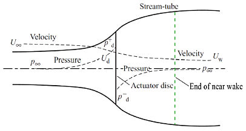
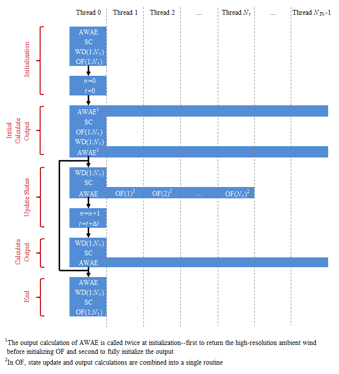
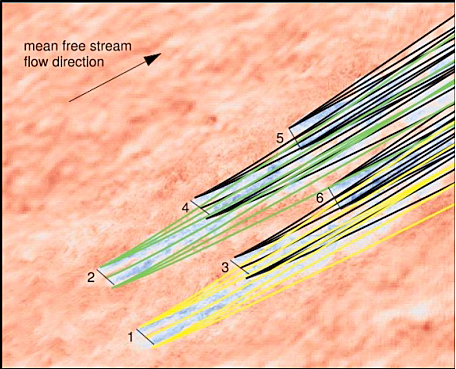
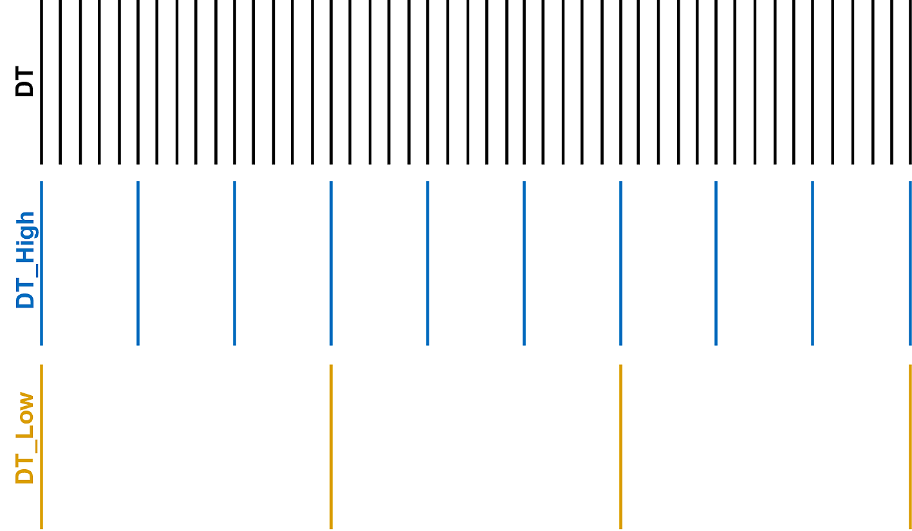

.. _FF:Theory:

FAST.Farm Theory
================

FAST.Farm is a multiphysics
engineering tool for predicting the performance and loads of wind
turbines within a wind farm. FAST.Farm uses
`OpenFAST <https://github.com/OpenFAST/openfast>`__ to solve the
aero-hydro-servo-elastic dynamics of each individual turbine, but
considers additional physics for wind-farm-wide ambient wind in the
atmospheric boundary layer; a wind-farm super controller; and wake
deficits, advection, deflection, meandering, and merging. FAST.Farm is
based on the principles of the DWM model -- including passive tracer
modeling of wake meandering -- but addresses many of the limitations of
previous DWM implementations.

.. _FF:DWMPrincipals:

Dynamic Wake Meandering Principles and Limitations Addressed
------------------------------------------------------------

The main idea behind the DWM model is to capture key wake features
pertinent to accurate prediction of wind farm power performance and wind
turbine loads, including the wake-deficit evolution (important for
performance) and the wake meandering and wake-added turbulence
(important for loads). Although fundamental laws of physics are applied,
appropriate simplifications have been made to minimize the computational
expense, and HFM solutions are used to inform and calibrate the
submodels. In the DWM model, the wake-flow processes are treated via the
“splitting of scales,” in which small turbulent eddies (less than two
diameters) affect wake-deficit evolution and large turbulent eddies
(greater than two diameters) affect wake meandering.

The presence of thrust from the wind turbine rotor causes the wind speed
to decrease and the pressure to increase just upwind of the rotor. In
the near-wake region just downwind of the rotor -- illustrated in
:numref:`FF:NearWake` -- coherent vortices break down, the pressure
recovers to free stream, the wind speed decreases further, and the wake
expands radially. In the far-wake region further downwind, the wake
deficit is approximately Gaussian and recovers to free stream due to the
turbulent transfer of momentum into the wake from the ambient wind
across the wake shear layer. This flow-speed reduction and gradual
recovery to free stream is known as the wake-deficit evolution. In most
DWM implementations, the wake-deficit evolution is modeled via the thin
shear-layer approximation of the Reynolds-averaged Navier-Stokes
equations under quasi-steady-state conditions in axisymmetric
coordinates -- illustrated in :numref:`FF:WakeAdv`. The
turbulence closure is captured by using an eddy-viscosity formulation,
dependent on small turbulent eddies. This wake-deficit evolution
solution is only valid in the far wake. This far wake is most important
for wind farm analysis because wind turbines are not typically spaced
closely. However, because the wake-deficit evolution solution begins at
the rotor, a near-wake correction is applied at the inlet boundary
condition to improve the accuracy of the far-wake solution.

   Near-wake region.

Wake meandering is the large-scale movement of the wake deficit
transported by large turbulent eddies. This wake-meandering process is
treated pragmatically in DWM (:cite:`ff-Larsen08_1`) by
modeling the meandering as a passive tracer, which transfers the wake
deficit transversely (horizontally and vertically) to a moving frame of
reference (MFoR) -- as illustrated in
:numref:`FF:WakeMeandering` -- based on the ambient wind
(including large turbulent eddies) spatially averaged across planes of
the wake.

Wake-added turbulence is the additional small-scale turbulence generated
from the turbulent mixing in the wake. It is often modeled in DWM by
scaling up the background (undisturbed) turbulence.

Several variations of DWM have been implemented, e.g., by the Technical
University of Denmark (:cite:`ff-Madsen10_1,ff-Madsen16_1`) and the University
of Massachusetts (:cite:`ff-Hao14_1,ff-Churchfield15_1,ff-Hao16_1`).  Although
the exact limitations of existing DWM implementations depend on the
implementation, specific limitations that are addressed in developing FAST.Farm
are summarized in :numref:`FF:tab:DWMImprovs` and are discussed where
appropriate in the next section.

.. table:: Dynamic Wake Meandering Limitations Addressed by FAST.Farm
   :name: FF:tab:DWMImprovs

   +----------------------------------+----------------------------------+
   | **Limitation**                   | **Solution/Innovation**          |
   +==================================+==================================+
   | -  Ambient wind is solved per    | -  Optionally compute ambient    |
   |    individual rotor and          |    wind-farm-wide from a         |
   |    generated synthetically based |    high-fidelity precursor.      |
   |    on the Taylor’s               |                                  |
   |    frozen-turbulence assumption; |                                  |
   |    not coherent across the wind  |                                  |
   |    farm or based on mesoscale    |                                  |
   |    conditions or local terrain.  |                                  |
   +----------------------------------+----------------------------------+
   | -  No treatment of a wind farm   | -  Optional inclusion of a wind  |
   |    super controller.             |    farm super controller.        |
   +----------------------------------+----------------------------------+
   | -  Wake advects at mean ambient  | -  Wake advects based on the     |
   |    wind speed, not accelerating  |    local spatially averaged      |
   |    from near wake to far wake or |    ambient wind speed and wake   |
   |    affected by local flow        |    deficit.                      |
   |    conditions.                   |                                  |
   +----------------------------------+----------------------------------+
   | -  Wake deficit is not distorted | -  Wake deficit solved in planes |
   |    by inflow skew (i.e., when    |    parallel to rotor disk.       |
   |    looking downwind, the wake    |                                  |
   |    looks circular, not           | -  Wake centerline deflected     |
   |    elliptical).                  |    based on inflow skew.         |
   |                                  |                                  |
   | -  Wake centerline is not        |                                  |
   |    deflected by inflow skew.     |                                  |
   +----------------------------------+----------------------------------+
   | -  Wake deficit and centerline   | -  Wake deficit and centerline   |
   |    based only on mean            |    updated based on              |
   |    conditions, not updated for   |    low-pass-filtered inflow,     |
   |    transients in inflow, turbine |    wind turbine control, and     |
   |    control, or wind turbine      |    wind turbine motion.          |
   |    motion (the latter is         |                                  |
   |    especially important for      |                                  |
   |    floating offshore wind        |                                  |
   |    turbines).                    |                                  |
   +----------------------------------+----------------------------------+
   | -  Individual wind turbine and   | -  Individual wind turbine and   |
   |    wake dynamics solved          |    wake dynamics solved in       |
   |    individually or serially, not |    parallel on multiple cores.   |
   |    considering two-way           |                                  |
   |    wake-merging interactions.    | -  Wake merging allowed to       |
   |                                  |    influence wake dynamics.      |
   | -  Wake impingement based only   |                                  |
   |    on the strongest wake         | -  Wake deficits of downwind     |
   |    deficit -- not considering    |    wind turbines dependent on    |
   |    cumulative effects from       |    impingement of wakes from     |
   |    multiple upwind wind          |    upwind wind turbines.         |
   |    turbines -- and/or the wake   |                                  |
   |    impingement approach is       | -  Wake deficits superimposed in |
   |    treated differently below and |    the axial direction based on  |
   |    above rated wind speed (i.e., |    the RSS method.               |
   |    a discrete change).           |                                  |
   |                                  |                                  |
   | -  No available method to        |                                  |
   |    calculate disturbed wind in   |                                  |
   |    zones of wake overlap.        |                                  |
   +----------------------------------+----------------------------------+
   | -  Wake meandering velocity      | -  Wake meandering velocity      |
   |    calculated with uniform       |    calculated with optional      |
   |    spatial averaging, resulting  |    weighted spatial averaging    |
   |    in less meandering than       |    based on the jinc function to |
   |    expected and at improper      |    result in closer-to-ideal     |
   |    frequencies.                  |    low-pass filtering.           |
   |                                  |                                  |
   | -  The wakes meander laterally,  | -  Wakes meander both laterally  |
   |    but not axially.              |    and axially.                  |
   +----------------------------------+----------------------------------+

.. _FF:TheoryBasis:

FAST.Farm Theory Basis
----------------------

FAST.Farm is a nonlinear time-domain multiphysics engineering tool
composed of multiple submodels, each representing different physics
domains of the wind farm. FAST.Farm is implemented as open-source
software that follows the programming requirements of the FAST
modularization framework (:cite:`ff-Jonkman13_1`), whereby the
submodels are implemented as modules interconnected through a driver
code. The submodel hierarchy of FAST.Farm is illustrated in
:numref:`FF:FFarm`. Wake advection, deflection, and meandering;
near-wake correction; and wake-deficit increment are submodels of the
wake-dynamics (*WD*) model, implemented in a single module. Ambient wind
and wake merging are submodels of the ambient wind and array effects
(*AWAE*) model, implemented in a single module. Combined with the super
controller (*SC*) and OpenFAST (*OF*) modules, FAST.Farm has four
modules and one driver. There are multiple instances of the *OF* and
*WD* modules -- one instance for each wind turbine/rotor. Each
submodel/module is described in the subsections below.

FAST.Farm can be compiled and run in serial or parallel mode.
Parallelization has been implemented in FAST.Farm through OpenMP, which
allows FAST.Farm to take advantage of multicore computers by dividing
computational tasks among the cores/threads within a node (but not
between nodes) to speed up a single simulation. This process is
illustrated in :numref:`FF:Parallel` for a node where the number of
threads (:math:`N_{Th}`) is greater than the number of wind turbines
(:math:`N_t`). There is one instance of the *AWAE* and *SC* modules and
:math:`N_t` instances of the *OF* and *WD* modules. The initialization,
update states, calculate output, and end calls to each module are shown.
The output calculation of *AWAE* is parallelized across all threads.
During time marching, each instance of *OF* is solved in parallel while
the ambient wind data are read by *AWAE*.

   FAST.Farm parallelization process.

The size of the wind farm and number of wind turbines is limited only by
the available RAM. In parallel mode, each instance of the OpenFAST
submodel can be run in parallel on separate threads. At the same time,
the ambient wind within the *AWAE* module is being read into memory on
another thread. Thus, the fastest simulations require at least one more
core than the number of wind turbines in the wind farm. Furthermore, the
output calculations within the *AWAE* module are parallelized into
separate threads. To support the modeling of large wind farms, single
simulations involving memory parallelization and parallelization between
nodes of a multinode HPC through MPI is likely required. MPI has not yet
been implemented within FAST.Farm. However, a multinode HPC can be used
to run multiple serial or parallelized simulations in parallel (in batch
mode) on separate nodes. In serial mode, multiple serial simulations can
be run in parallel (in batch mode) on separate cores and/or nodes.

.. _FF:Driver:

FAST.Farm Driver
~~~~~~~~~~~~~~~~

The FAST.Farm driver, also known as the “glue code,” is the code that
couples individual modules together and drives the overall time-domain
solution forward. Additionally, the FAST.Farm driver reads an input file
of simulation parameters, checks the validity of these parameters,
initializes the modules, writes results to a file, and releases memory
at the end of the simulation.

To simplify the coupling algorithm in the FAST.Farm driver and ensure
computational efficiency, all module states (:math:`x^d`), inputs
(:math:`u^d`), outputs (:math:`y^d`), and functions (:math:`X^d` for
state updates and :math:`Y^d` for outputs) in FAST.Farm are expressed in
discrete time, :math:`t=n\Delta t`, where :math:`t` is time, :math:`n`
is the discrete-time-step counter, and :math:`\Delta t` is the
user-specified discrete time step (increment). Thus, the most general
form of a module in FAST.Farm is simpler than that permitted by the FAST
modularization framework (:cite:`ff-Jonkman13_1`), represented
mathematically as: [1]_

.. math::

   \begin{aligned}
       x^d\left[ n+1 \right]=X^d\left( x^d\left[ n \right],u^d\left[ n \right],n \right)\\
       y^d\left[ n \right]=Y^d\left( x^d\left[ n \right],u^d\left[ n \right],n \right)\end{aligned}

The *SC*, *OF*, and *WD* modules do not have direct feedthrough of input
to output, meaning that the corresponding output functions simplify to
:math:`y^d\left[ n \right]=Y^d\left( x^d\left[ n \right],n \right)`. The
ability of the *OF* module to be written in the above form is explained
in :numref:`FF:OF`. Additionally, the *AWAE* module does not
have states, reducing the module to a feed-forward-only system and a
module form that simplifies to
:math:`y^d\left[ n \right]=Y^d\left( u^d\left[ n \right],n \right)`. For
functions in this manual, square brackets :math:`\left[\quad\right]`
denote discrete functions and round parentheses
:math:`\left(\quad\right)` denote continuous functions; the
brackets/parentheses are dropped when implied. The states, inputs, and
outputs of each of the FAST.Farm modules (*SC*, *OF*, *WD*, and *AWAE*)
are listed in :numref:`FF:tab:modules` and explained further in the
sections below.

.. table:: Module States, Inputs, and Outputs in FAST.Farm
   :name: FF:tab:modules

   +-----------------------------------------+---------------------------------------------------------------------------------+---------------------------------------------------------------------+----------------------------------------------------------------------+
   | **Module**                              | **States (Discrete Time)**                                                      | **Inputs**                                                          | **Outputs**                                                          |
   +=========================================+=================================================================================+=====================================================================+======================================================================+
   | *Super Controller (SC)*                 | - User-defined                                                                  | - Global measurements                                               | - Global controller commands                                         |
   |                                         |                                                                                 | - Commands/measurements from individual turbine controllers         | - Commands to individual turbine controllers                         |
   +-----------------------------------------+---------------------------------------------------------------------------------+---------------------------------------------------------------------+----------------------------------------------------------------------+
   | *OpenFAST (OF)*                         | -  None in the OpenFAST wrapper, but there are many states internal to OpenFAST | - Global controller commands                                        | - Commands/measurements from the individual turbine controller       |
   |                                         |                                                                                 | - Commands to the individual turbine controller                     | - :math:`\hat{x}^\text{Disk}`                                        |
   |                                         |                                                                                 | - :math:`\vec{V}_\text{Dist}^\text{High}`                           | - :math:`\vec{p}^\text{Hub}`                                         |
   |                                         |                                                                                 |                                                                     | - :math:`D^\text{Rotor}`                                             |
   |                                         |                                                                                 |                                                                     | - :math:`\gamma^\text{YawErr}`                                       |
   |                                         |                                                                                 |                                                                     | - :math:`^\text{DiskAvg}V_x^\text{Rel}`                              |
   |                                         |                                                                                 |                                                                     | - :math:`^\text{AzimAvg}C_t\left(r\right)`                           |
   +-----------------------------------------+---------------------------------------------------------------------------------+---------------------------------------------------------------------+----------------------------------------------------------------------+
   | *Wake Dynamics (WD)*                    | - :math:`^\text{FiltDiskAvg}V_x^\text{Rel}`                                     | - :math:`\hat{x}^\text{Disk}`                                       | For :math:`0 \le n_p \le N_p-1`:                                     |
   |                                         | - :math:`^\text{FiltAzimAvg}C_t\left(r\right)`                                  | - :math:`\vec{p}^\text{Hub}`                                        |                                                                      |
   |                                         |                                                                                 | - :math:`D^\text{Rotor}`                                            | - :math:`\hat{x}_{n_p}^\text{Plane}`                                 |
   |                                         | For :math:`0 \le n_p \le N_p-1`:                                                | - :math:`\gamma^\text{YawErr}`                                      | - :math:`\vec{p}_{n_p}^\text{Plane}`                                 |
   |                                         |                                                                                 | - :math:`^\text{DiskAvg}V_x^\text{Rel}`                             | - :math:`V_{x_{n_p}}^\text{Wake}\left(r\right)`                      |
   |                                         | - :math:`^\text{Filt}D_{n_p}^\text{Rotor}`                                      | - :math:`^\text{AzimAvg}C_t\left(r\right)`                          | - :math:`V_{r_{n_p}}^\text{Wake}\left(r\right)`                      |
   |                                         | - :math:`^\text{Filt}\gamma_{n_p}^\text{YawErr}`                                | - :math:`\vec{V}_{n_p}^\text{Plane}` for :math:`0 \len_p \le N_p-1` | - :math:`D_{n_p}^\text{Wake}`                                        |
   |                                         | - :math:`^\text{Filt}\vec{V}_{n_p}^\text{Plane}`                                | - :math:`^\text{DiskAvg}V_x^\text{Wind}`                            |                                                                      |
   |                                         | - :math:`^\text{FiltDiskAvg}V_{x_{n_p}}^\text{Wind}`                            | - :math:`TI_\text{Amb}`                                             |                                                                      |
   |                                         | - :math:`^\text{Filt}TI_{\text{Amb}_{n_p}}`                                     |                                                                     |                                                                      |
   |                                         | - :math:`x_{n_p}^\text{Plane}`                                                  |                                                                     |                                                                      |
   |                                         | - :math:`\hat{x}_{n_p}^\text{Plane}`                                            |                                                                     |                                                                      |
   |                                         | - :math:`\vec{p}_{n_p}^\text{Plane}`                                            |                                                                     |                                                                      |
   |                                         | - :math:`V_{x_{n_p}}^\text{Wake}\left(r\right)`                                 |                                                                     |                                                                      |
   |                                         | - :math:`V_{r_{n_p}}^\text{Wake}\left(r\right)`                                 |                                                                     |                                                                      |
   +-----------------------------------------+---------------------------------------------------------------------------------+---------------------------------------------------------------------+----------------------------------------------------------------------+
   | *Ambient Wind and Array Effects (AWAE)* | - None                                                                          | For each turbine and :math:`0 \le n_p \le N_p-1`:                   | For each turbine:                                                    |
   |                                         |                                                                                 |                                                                     |                                                                      |
   |                                         |                                                                                 | - :math:`\hat{x}_{n_p}^\text{Plane}`                                | - :math:`\vec{V}_\text{Dist}^\text{High}`                            |
   |                                         |                                                                                 | - :math:`\vec{p}_{n_p}^\text{Plane}`                                | - :math:`\vec{V}_{n_p}^\text{Plane}` for :math:`0 \le n_p \le N_p-1` |
   |                                         |                                                                                 | - :math:`V_{x_{n_p}}^\text{Wake}\left(r\right)`                     | - :math:`^\text{DiskAvg}V_x^\text{Wind}`                             |
   |                                         |                                                                                 | - :math:`V_{r_{n_p}}^\text{Wake}\left(r\right)`                     | - :math:`TI_\text{Amb}`                                              |
   |                                         |                                                                                 | - :math:`D_{n_p}^\text{Wake}`                                       |                                                                      |
   +-----------------------------------------+---------------------------------------------------------------------------------+---------------------------------------------------------------------+----------------------------------------------------------------------+

After initialization and within each time step, the states of each
module (*SC*, *OF*, and *WD*) are updated (from time :math:`t` to time
:math:`t+\Delta t`, or equivalently, :math:`n` to :math:`n+1`); time is
incremented; and the module outputs are calculated and transferred as
inputs to other modules. Because of the form simplifications, the state
updates of each module can be solved in parallel; the output-to-input
transfer does not require a large nonlinear solve; and overall
correction steps of the solution are not needed. The lack of a
correction step is a major simplification of the coupling algorithm used
within OpenFAST (:cite:`ff-Sprague14_1,ff-Sprague15_1`).
Furthermore, the output calculations of the *SC*, *OF*, and *WD* modules
can be parallelized, followed then by the output calculation of the
*AWAE* module. [2]_ In parallel mode, parallelization has been
implemented in FAST.Farm through OpenMP.

Because of the small timescales and sophisticated physics, the OpenFAST
submodel is the computationally slowest of the FAST.Farm modules.
Additionally, the output calculation of the *AWAE* module is the only
major calculation that cannot be solved in parallel to OpenFAST. Because
of this, the parallelized FAST.Farm solution at its fastest may execute
only slightly more slowly than stand-alone OpenFAST simulations. This
results in simulations that are computationally inexpensive enough to
run the many simulations necessary for wind turbine/farm design and
analysis.

.. _FF:Theory:SC:

Super Controller (SC Module)
~~~~~~~~~~~~~~~~~~~~~~~~~~~~

Wind-farm-wide super controllers have the potential to achieve the
global benefit of improving overall power performance and reducing
turbine loads, based on modifying wake deficits through variations in
blade pitch or generator torque and/or redirecting (steering) wakes
through variations in nacelle yaw or tilt, as illustrated in
:numref:`FF:NacYaw`.

   Nacelle-yaw control used to redirect wakes away from downwind wind
   turbines. :cite:`ff-Gebraad16_1`

The *SC* module of FAST.Farm provides an interface to the super
controller dynamic library -- essentially identical to the super controller
available in `SOWFA <https://github.com/NREL/SOWFA>`__ -- which allows the
user of FAST.Farm to implement their own wind-farm-wide control logic in
discrete time and without direct feedthrough of input to output -- perhaps
developed through the application of
`FLORIS <https://github.com/WISDEM/FLORISSE>`__. The inputs to the *SC*
module are commands or measurements from individual turbine controllers
(output from the *OF* module). [3]_ The outputs of the *SC* module are
the global controller commands and individual turbine controller
commands (inputs to the *OF* module).

Note that at time zero, the *SC* module is called before the call to the
*OF* module and the associated individual turbine controllers. So, the
initial outputs from the super controller are sent as inputs to the
individual turbine controllers, but the initial inputs to the super
controller from the individual turbine controller outputs at time zero
are always zero. At subsequent time steps, the *OF* module and the
associated individual turbine controllers are called before the output
calculation of the *SC* module. As a result, at each time step other
than time zero, the outputs from the super controller are extrapolated
in time based on past values within *OF* before being sent as input to
the individual turbine controllers. Thus, care should be taken to ensure
that the outputs from the super controller vary smoothly over time
(without steps). See :numref:`FF:Parallel` for more information.

.. _FF:OF:

OpenFAST (OF Module)
~~~~~~~~~~~~~~~~~~~~

FAST.Farm makes use of
`OpenFAST <https://github.com/OpenFAST/openfast>`__ to model the
dynamics (loads and motions) of distinct turbines in the wind farm.
OpenFAST captures the environmental excitations (wind inflow; for
offshore systems, waves, current, and ice) and coupled system response
of the full system (the rotor, drivetrain, nacelle, tower, controller;
for offshore systems, the substructure and station-keeping system).
OpenFAST itself is an interconnection of various modules, each
corresponding to different physical domains of the coupled
aero-hydro-servo-elastic solution. The details of the OpenFAST solution
are outside the scope of this document, but can be found in the
hyperlink above and associated references.

The *OF* module of FAST.Farm is a wrapper that enables the coupling of
OpenFAST to FAST.Farm -- similar to the OpenFAST wrapper available in
SOWFA, but with different inputs and outputs (described below). This
wrapper also controls subcycling of the OpenFAST state updates. The
timescales solved within OpenFAST are much smaller than those within
FAST.Farm. Therefore, for accuracy and numerical stability reasons, the
OpenFAST time step is typically much smaller than that required of
FAST.Farm, as depicted in :numref:`FF:timescales`.

   Illustration of timescale ranges for OpenFAST (DT), the FAST.Farm
   high-resolution domain (DT_High), and the FAST.Farm low-resolution
   domain (DT_Low).

There is one instance of the *OF* module for each wind turbine. In
parallel mode, these instances are parallelized through OpenMP. OpenFAST
itself has various modules with different inputs, outputs, states, and
parameters -- including continuous-time, discrete-time, algebraic, and
other (e.g., logical) states. However, for the purposes of coupling
OpenFAST to FAST.Farm, the *OF* module functions in discrete time and
without direct feedthrough of input to output. This is achieved by
calling the *OF* module at the rate dictated by the FAST.Farm time step,
:math:`\Delta t`, and by introducing a one-time-step (:math:`\Delta t`)
delay of the output relative to the input; this one-time-step delay is
not expected to be problematic because of the slow timescales solved
within FAST.Farm.

At initialization, the number of wind turbines (:math:`N_t`, with
:math:`n_t` the turbine counter such that :math:`1\le n_t\le N_t`), the
corresponding OpenFAST primary input files, and turbine origins in the
global *X-Y-Z* inertial-frame coordinate system are specified by the
user. Turbine origins are defined as the intersection of the undeflected
tower centerline and the ground or, for offshore systems, mean sea
level. The global inertial-frame coordinate system is defined with *Z*
directed vertically upward (opposite gravity), *X* directed horizontally
nominally downwind (along the zero-degree wind direction), and *Y*
directed horizontally transversely.

The global and turbine-dependent commands from the super controller
(outputs from the *SC* module) are used as inputs to the *OF* module to
enable the individual turbine controller to be guided by wind farm-level
effects; likewise, the turbine-dependent commands or measurements are
output from the *OF* module for access by the super controller (inputs
to the *SC* module).

The *OF* module also uses the disturbed wind (ambient plus wakes of
neighboring turbines) across a high-resolution wind domain (in both time
and space) around the turbine (output from the *AWAE* module -- see
:numref:`FF:AWAE` for more information),
:math:`\vec{V}_\text{Dist}^\text{High}`, as input, to ensure that the
individual turbine loads and response calculated by OpenFAST are
accurately driven by flow through the wind farm, including wake and
array effects. Spatially, the high-resolution wind domain must be large
enough to encompass yawing of the rotor, blade deflection, and motion of
the support structure (the latter is especially important for floating
offshore wind turbines). OpenFAST uses a four-dimensional (three space
dimensions plus one time dimension) interpolation to determine the wind
local to its analysis nodes.

The *OF* module computes several outputs needed for calculating wake
dynamics (inputs to the *WD* module). These include:

-  :math:`\hat{x}^\text{Disk}` -- the orientation of the rotor centerline

-  :math:`\vec{p}^\text{Hub}` -- the global position of the rotor center

-  :math:`D^\text{Rotor}` -- the rotor diameter

-  :math:`\gamma^\text{YawErr}` -- the nacelle-yaw error of the rotor

-  :math:`^\text{DiskAvg}V_x^\text{Rel}` -- the rotor-disk-averaged
   relative wind speed (ambient plus wakes of neighboring turbines plus
   turbine motion), normal to the disk

-  :math:`^\text{AzimAvg}C_t\left( r \right)` -- the azimuthally averaged
   thrust-force coefficient (normal to the rotor disk), distributed
   radially, where :math:`r` is the radius.

In this manual, an over arrow (:math:`\vec{\quad}`) denotes a
three-component vector and a hat (:math:`\hat{\quad}`) denotes a
three-component unit vector. For clarity in this manual,
:math:`\left( r \right)` is used to denote radial dependence as a
continuous function, even though the radial dependence is
stored/computed on a discrete radial finite-difference grid within
FAST.Farm. Except for :math:`\gamma^\text{YawErr}` and
:math:`^\text{AzimAvg}C_t\left( r \right)`, all of the listed variables
were computed within OpenFAST before the development of FAST.Farm.
:math:`\gamma^\text{YawErr}` is defined as the angle about global *Z*
from the rotor centerline to the rotor-disk-averaged relative wind
velocity (ambient plus wakes of neighboring turbines plus turbine
motion), both projected onto the horizontal global *X-Y* plane -- see
:numref:`FF:WakeDefl` for an illustration.
:math:`^\text{AzimAvg}C_t\left( r \right)` is computed by
Equation :eq:`eq:Ct`

.. math::
   ^\text{AzimAvg}C_t\left( r \right)=
      \frac{\sum\limits_{n_b=1}^{N_b}
            {\left\{ \hat{x}^\text{Disk} \right\}^T}\vec{f}_{n_b}\left( r \right)}
         {\frac{1}{2}\rho 2\pi r\left( ^\text{DiskAvg}V_x^\text{Rel} \right)^2}
   :label: eq:Ct

where:

-  :math:`N_b` -- number of rotor blades, with :math:`n_b` as the blade
   counter such that :math:`1\le n_b\le N_b`

-  :math:`\left\{ \quad \right\}^T` -- vector transpose

-  :math:`\rho` -- air density

-  :math:`\vec{f}_{n_b}\left( r \right)` -- aerodynamic applied loads [4]_
   distributed per unit length along a line extending radially outward
   in the plane of the rotor disk for blade :math:`n_b`.

The numerator of Equation :eq:`eq:Ct` is the aerodynamic
applied loads distributed per unit length projected normal to the rotor
disk, i.e., the radially dependent thrust force. The denominator is the
normalizing factor for the radially dependent thrust coefficient,
composed of the circumference at the given radius, :math:`2\pi r`, and
the dynamic pressure of the rotor-disk-averaged relative wind speed,
:math:`\frac{1}{2}\rho {{\left( ^\text{DiskAvg}V_x^\text{Rel} \right)}^2}`.

.. _FF:WD:

Wake Dynamics (WD Module)
~~~~~~~~~~~~~~~~~~~~~~~~~

The *WD* module of FAST.Farm calculates wake dynamics for an individual
rotor, including wake advection, deflection, and meandering; a near-wake
correction; and a wake-deficit increment. The near-wake correction
treats the near-wake (pressure-gradient zone) expansion of the wake
deficit. The wake-deficit increment shifts the quasi-steady-state
axisymmetric wake deficit nominally downwind. Each submodel is described
in the subsections below. There is one instance of the *WD* module for
each rotor.

The wake-dynamics calculations involve many user-specified parameters
that may depend, e.g., on turbine operation or atmospheric conditions
that can be calibrated to better match experimental data or HFM, e.g.,
by running `SOWFA <https://github.com/NREL/SOWFA>`__ (or equivalent) as a
benchmark. Default values have been derived for each calibrated
parameter based on `SOWFA <https://github.com/NREL/SOWFA>`__
simulations (:cite:`ff-Doubrawa18_1`), but these can be
overwritten by the user of FAST.Farm.

The wake-deficit evolution is solved in discrete time on an axisymmetric
finite-difference grid consisting of a fixed number of wake planes,
:math:`N_p` (with :math:`n_p` the wake-plane counter such that
:math:`0\le n_p\le N_p-1`), each with a fixed radial grid of nodes.
Because the wake deficit is assumed to be axisymmetric, the radial
finite-difference grid can be considered a plane. A wake plane can be
thought of as a cross section of the wake wherein the wake deficit is
calculated.

Inputs to the *WD* module include :math:`\hat{x}^\text{Disk}`,
:math:`\vec{p}^\text{Hub}`, :math:`D^\text{Rotor}`,
:math:`\gamma^\text{YawErr}`, :math:`^\text{DiskAvg}V_x^\text{Rel}`, and
:math:`^\text{AzimAvg}C_t\left( r \right)`. Additional inputs are the
advection, deflection, and meandering velocity of the wake planes for
the rotor (:math:`\vec{V}_{n_p}^\text{Plane}`); the rotor-disk-averaged
ambient wind speed, normal to the disk
(:math:`^\text{DiskAvg}V_x^\text{Wind}`); and the ambient turbulence
intensity of the wind at the rotor (:math:`TI_\text{Amb}`) (output from
the *AWAE* module -- see :numref:`FF:AWAE` for more information).
:math:`\vec{V}_{n_p}^\text{Plane}` is computed for
:math:`0\le n_p\le N_p-1` by spatial averaging of the disturbed wind.

The *WD* module computes several outputs needed for the calculation of
disturbed wind, to be used as input to the *AWAE* module. These outputs
include:

-  :math:`\hat{x}_{n_p}^\text{Plane}` -- the orientations of the wake
   planes defined using the unit vectors normal to each plane, i.e., the
   orientation of the wake-plane centerline

-  :math:`\vec{p}_{n_p}^\text{Plane}` -- the global positions of the
   centers of the wake planes

-  :math:`V_{x_{n_p}}^\text{Wake}\left(r\right)` and
   :math:`V_{r_{n_p}}^\text{Wake}\left(r\right)` -- the axial and radial
   wake-velocity deficits, respectively, at the wake planes, distributed
   radially

-  :math:`D_{n_p}^\text{Wake}` -- the wake diameters at the wake planes,
   each for :math:`0\le n_p\le N_p-1`.

Though the details are left out of this manual, during start-up -- whereby
a wake has not yet propagated through all of the wake planes -- the number
of wake planes is limited by the elapsed time to avoid having to set
inputs, outputs, and states in the *WD* and *AWAE* modules beyond where
the wake has propagated.

.. _FF:AdvDefMean:

Wake Advection, Deflection, and Meandering
^^^^^^^^^^^^^^^^^^^^^^^^^^^^^^^^^^^^^^^^^^

By simple extensions to the passive tracer solution for transverse
(horizontal and vertical) wake meandering, the wake-dynamics solution in
FAST.Farm is extended to account for wake deflection -- as illustrated in
:numref:`FF:WakeDefl` -- and wake advection -- as illustrated in
:numref:`FF:WakeAdv` -- among other physical improvements. The
following extensions are introduced:

#. Calculating the wake plane velocities,
   :math:`\vec{V}_{n_p}^\text{Plane}` for :math:`0\le n_p\le N_p-1`, by
   spatially averaging the disturbed wind instead of the ambient wind
   (see :numref:`FF:AWAE`)

#. Orientating the wake planes with the rotor centerline instead of the
   wind direction

#. Low-pass filtering the local conditions at the rotor, as input to the
   *WD* module, to account for transients in inflow, turbine control,
   and/or turbine motion instead of considering time-averaged
   conditions.

With these extensions, the passive tracer solution enables:

#. The wake centerline to deflect based on inflow skew. This is achieved
   because in skewed inflow, the wake deficit normal to the disk
   introduces a velocity component that is not parallel to the ambient
   flow.

#. The wake to accelerate from near wake to far wake because the wake
   deficits are stronger in the near wake and weaken downwind.

#. The wake-deficit evolution to change based on conditions at the rotor
   because low-pass time filtered conditions are used instead of
   time-averaged.

#. The wake to meander axially in addition to transversely because local
   axial winds are considered.

#. The wake shape to be elliptical instead of circular in skewed flow
   when looking downwind (the wake shape remains circular when looking
   down the rotor centerline).

For item 3, low-pass time filtering is important because the wake reacts
slowly to changes in local conditions at the rotor and because the wake
evolution is treated in a quasi-steady-state fashion. Furthermore, a
correction to the wake deflection resulting from item 1 is needed to
account for the physical combination of wake rotation and shear, which
is not modeled directly in the *WD* module. This is achieved through a
horizontally asymmetric correction to the wake deflection from item 1
(see :numref:`FF:WakeDefl` for an illustration). This
horizontal wake-deflection correction is a simple linear correction with
slope and offset, similar to the correction implemented in the wake
model of FLORIS. It is important for accurate modeling of
nacelle-yaw-based wake-redirection (wake-steering) wind farm control.

Mathematically, the low-pass time filter is implemented using a
recursive, single-pole filter with exponential
smoothing (:cite:`ff-Smith06_1`). The discrete-time recursion
(difference) equation for this filter
is (:cite:`ff-Jonkman09_1`):

.. math::
   {x^d_{n_p}}\left[ n+1 \right]={x^d_{n_p}}
         \left[ n \right]\alpha 
         +{u^d}\left[ n \right]\left( 1-\alpha  \right) 
         \qquad \textrm{for } n_p=0
   :label: eq:disc

where

-  :math:`x^d` -- discrete-time state storing the low-pass time-filtered
   value of input :math:`u^d`

-  :math:`\alpha=e^{-2\pi \Delta t f_c}` -- low-pass time-filter parameter,
   with a value between 0 (minimum filtering) and 1 (maximum filtering)
   (exclusive)

-  :math:`f_c` -- user-specified cutoff (corner) frequency (the time
   constant of the low-pass time filter is :math:`\frac{1}{f_c}`).

Subscript :math:`n_p` is used to denote the state associated with
wake-plane :math:`n_p`; Equation :eq:`eq:disc` applies at the
rotor disk, where :math:`n_p=0`.

To be consistent with the quasi-steady-state treatment of the
wake-deficit evolution (see :numref:`FF:Deficit`), the
conditions at the rotor are maintained as fixed states of a wake plane
as the plane propagates downstream

.. math::
   x^d_{n_p}[n+1] = x^d_{n_p-1}[n]
      \qquad \textrm{for } 1 \leq n_p \leq N_p-1
   :label: eq:propagation

Equations :eq:`eq:disc`
and :eq:`eq:propagation` apply directly to the *WD*
module inputs :math:`D^\text{Rotor}`\  [5]_,
:math:`\gamma^\text{YawErr}`, :math:`^\text{DiskAvg}V_x^\text{Rel}`, and
:math:`TI_\text{Amb}`. The associated states are
:math:`^\text{Filt}D_{n_p}^\text{Rotor}`,
:math:`^\text{Filt}\gamma_{n_p}^\text{YawErr}`,
:math:`^\text{FiltDiskAvg}V_{x_{n_p}}^\text{Wind}`, and
:math:`^\text{Filt}TI_{\text{Amb}_{n_p}}` respectively (each for
:math:`0\le n_p\le N_p-1`). The *WD* module inputs
:math:`^\text{DiskAvg}V_x^\text{Rel}` and
:math:`^\text{AzimAvg}C_t\left( r \right)` are needed for the boundary
condition at the rotor, but are not otherwise needed in the wake-deficit
evolution calculation and are therefore not propagated downstream with
the wake planes. Therefore, Equation :eq:`eq:disc` applies to
these inputs but Equation :eq:`eq:propagation` does
not. The associated states are :math:`^\text{FiltDiskAvg}V_x^\text{Rel}`
and :math:`^\text{FiltAzimAvg}C_t\left( r \right)`. Likewise, only
Equation :eq:`eq:disc` is used to low-pass time filter the
*WD* module input :math:`\vec{V}_{n_p}^\text{Plane}` with state
:math:`^\text{Filt}\vec{V}_{n_p}^\text{Plane}` (for
:math:`0\le n_p\le N_p-1`). Equations :eq:`eq:disc`
and :eq:`eq:propagation` apply in a modified form to
the *WD* module inputs :math:`\hat{x}^\text{Disk}` and
:math:`\vec{p}^\text{Hub}` to derive the state associated with the
downwind distance from the rotor to each wake plane in the axisymmetric
coordinate system (:math:`x_{n_p}^\text{Plane}`), and the states and
outputs associated with the orientations of the wake planes, normal to
the planes, (:math:`\hat{x}_{n_p}^\text{Plane}`), and the global center
positions of the wake planes, (:math:`\vec{p}_{n_p}^\text{Plane}`) as
follows:

.. math::
   \hat{x}_{n_p}^\text{Plane}\left[ n+1 \right]=
      \begin{cases}
         \frac{\hat{x}_{n_p}^\text{Plane}\left[ n \right]\alpha +\hat{x}^\text{Disk}\left( 1-\alpha \right)}
            {\left\| \hat{x}_{n_p}^\text{Plane}\left[ n \right]\alpha +\hat{x}^\text{Disk}\left( 1-\alpha \right) \right\|_2} 
            &\qquad\textrm{for}~n_p=0  \\
         \\
         \hat{x}_{n_p-1}^\text{Plane}\left[ n \right] 
            &\qquad\textrm{for}~1\le n_p\le N_p-1  \\
      \end{cases}
   :label: eq:6.6

.. math::
   x_{n_p}^\text{Plane}\left[ n+1 \right]=
      \begin{cases}
         0  &\qquad\textrm{for}~n_p=0 \\
         \\
         x_{n_p-1}^\text{Plane}\left[ n \right]+|d\hat{x}_{n_p-1}| 
            &\qquad\textrm{for}~1\le n_p\le N_p-1 \\
      \end{cases}
   :label: eq:6.7

.. math::
   \vec{p}_{n_p}^\text{Plane}\left[ n+1 \right]=
      \begin{cases}
         \begin{aligned}[l]
         &\vec{p}_{n_p}^\text{Plane}\left[ n \right]\alpha + \left\{ \vec{p}^\text{Hub}\left[ n \right]\right. \\
         &\qquad   + \left.\left( C_\text{HWkDfl}^\text{O}+C_\text{HWkDfl}^\text{OY}~^\text{Filt}\gamma _{n_p}^\text{YawErr}\left[ n+1 \right] \right)\widehat{XY_{n_p}} \right\}\left( 1-\alpha \right)
         \end{aligned}
         & \textrm{for}~ n_p=0 \\
         \\
         \begin{aligned}[l]
         &\vec{p}_{n_p-1}^\text{Plane}\left[ n \right] + \hat{x}_{n_p-1}^\text{Plane}\left[ n \right]\ d\hat{x}_{n_p-1} \\
         &\qquad   +\left[ I-\hat{x}_{n_p-1}^\text{Plane}\left[ n \right]{{\left\{ \hat{x}_{n_p-1}^\text{Plane}\left[ n \right] \right\}}^T} \right]\vec{V}_{n_p-1}^\text{Plane}\Delta t    \\
         &\qquad   +\left( \left( C_\text{HWkDfl}^\text{x}+C_\text{HWkDfl}^\text{xY}\ ^\text{Filt}\gamma _{n_p-1}^\text{YawErr}\left[ n \right] \right)d\hat{x}_{n_p-1} \right)\widehat{XY_{n_p-1}}
         \end{aligned}
         & \textrm{for}~ 1\le n_p\le N_p-1 \\
      \end{cases}
   :label: eq:6.8

where:

.. math::
   d\hat{x}_{n_p-1}=\left\{ \hat{x}_{n_p-1}^\text{Plane}\left[ n \right] \right\}^T\ ^\text{Filt}\vec{V}_{n_p-1}^\text{Plane}\left[ n+1 \right]\Delta t
   :label: eq:6.9

.. math::
   \widehat{XY_{n_p}}=\left\{ \frac{\left( \left\{ \hat{x}_{n_p}^\text{Plane}\left[ n+1 \right] \right\}^T\hat{X} \right)\hat{Y}-\left( \left\{ \hat{x}_{n_p}^\text{Plane}\left[ n+1 \right] \right\}^T\hat{Y} \right)\hat{X}}{\left\| \left( \left\{ \hat{x}_{n_p}^\text{Plane}\left[ n+1 \right] \right\}^T\hat{X} \right)\hat{X}+\left( \left\{ \hat{x}_{n_p}^\text{Plane}\left[ n+1 \right] \right\}^T\hat{Y} \right)\hat{Y} \right\|_2} \right\}
   :label: eq:6.10

Equation :eq:`eq:6.6` differs from
Equations :eq:`eq:disc`
and :eq:`eq:propagation` in that after applying
Equation :eq:`eq:disc` to low-pass time-filter input
:math:`\hat{x}^\text{Disk}`, the state is renormalized to ensure that
the vector remains unit length; Equation :eq:`eq:6.6` ensures
that the wake-plane orientation is maintained as the planes propagate
nominally downwind. Equation :eq:`eq:6.7` expresses that each
wake plane propagates downwind in the axisymmetric coordinate system by
a distance equal to that traveled by the low-pass time-filtered
wake-plane velocity projected along the plane orientation over the time
step; [6]_ the initial wake plane (:math:`n_p=0`) is always at the rotor
disk. Equation :eq:`eq:6.8` expresses the global center
positions of the wake plane following the passive tracer concept,
similar to Equation :eq:`eq:6.7`, but considering the full
three-component movement of the wake plane, including deflection and
meandering. The last term on the right-hand side of
Equation :eq:`eq:6.8` for each wake plane is the horizontal
wake-deflection correction, where:

-  :math:`C_{HWkDfl}^\text{O}` -- user-specified parameter defining the
   horizontal offset at the rotor

-  :math:`C_{HWkDfl}^\text{OY}` -- user-specified parameter defining the
   horizontal offset at the rotor scaled with nacelle-yaw error

-  :math:`C_{HWkDfl}^\text{x}` -- user-specified parameter defining the
   horizontal offset scaled with downstream distance

-  :math:`C_{HWkDfl}^\text{xY}` -- user-specified parameter defining the
   horizontal offset scaled with downstream distance and nacelle-yaw
   error

-  :math:`\hat{X}`, :math:`\hat{Y}`, and :math:`\hat{Z}` -- unit vectors
   parallel to the inertial-frame coordinates *X*, *Y* and, *Z*
   respectively

-  :math:`\widehat{XY_{np}}` -- three-component unit vector in the
   horizontal global *X-Y* plane orthogonal to
   :math:`\hat{x}^\text{Plane}_{n_p}\left[ n+1 \right]`

-  :math:`C_\text{HWkDfl}^\text{O}+C_\text{HWkDfl}^\text{OY} \ ^\text{Filt}\gamma _{n_p}^\text{YawErr}\left[ n+1 \right]` -- offset
   at the rotor

-  :math:`C_\text{HWkDfl}^\text{x}+C_\text{HWkDfl}^\text{xY} \ ^\text{Filt}\gamma _{n_p}^\text{YawErr}\left[ n+1 \right]` -- slope

-  :math:`d\hat{x}_{n_p-1}` -- nominally downwind increment of the wake
   plane (from Equation :eq:`eq:6.7`)

-  *I* -- three-by-three identity matrix

-  :math:`\left[ I-\hat{x}_{n_p-1}^\text{Plane}\left[ n \right]\left\{ \hat{x}_{n_p-1}^\text{Plane}\left[ n \right] \right\}^T \right]` -- used
   to calculate the transverse component of
   :math:`V^\text{Plane}_{n_p-1}` normal to
   :math:`\hat{x}^\text{Plane}_{n_p-1}\left[ n\right]`.

It is noted that the advection, deflection, and meandering velocity of
the wake planes, :math:`\vec{V}^\text{Plane}_{n_p-1}`, is low-pass time
filtered in the axial direction, but not in the transverse direction.
Low-pass time filtering in the axial direction is useful for minimizing
how often wake planes get close to or pass each other while they travel
axially; this filtering is not needed transversely because an
appropriate transverse meandering velocity is achieved through spatially
averaging the disturbed wind (see :numref:`FF:AWAE`).

The consistent output equation corresponding to the low-pass time filter
of Equation :eq:`eq:disc` is
:math:`y^d\left[ n \right]={x^d}\left[ n \right]\alpha +{u^d}\left[ n \right]\left( 1-\alpha \right)`,
i.e., :math:`{Y^d(\quad)}=X^d(\quad)`, or equivalently,
:math:`y^d\left[ n \right]=x^d\left[ n+1 \right]` (:cite:`ff-Jonkman09_1`).
However, the output is delayed by one time step (:math:`\Delta t`) to
avoid having direct feedthrough of input to output within the *WD*
module, yielding :math:`y^d\left[ n \right]=x^d\left[ n \right]`. This
one-time-step delay is applied to all outputs of the *WD* module and is
not expected to be problematic because of the slow timescales solved
within FAST.Farm.

.. _FF:SNearWake:

Near-Wake Correction
^^^^^^^^^^^^^^^^^^^^

The near-wake correction submodel of the *WD* module computes the axial
and radial wake-velocity deficits at the rotor disk as an inlet boundary
condition for the wake-deficit evolution described in
:numref:`FF:Deficit`. To improve the accuracy of the far-wake
solution, the near-wake correction accounts for the drop in wind speed
and radial expansion of the wake in the pressure-gradient zone behind
the rotor that is not otherwise accounted for in the solution for the
wake-deficit evolution. For clarity, the equations in this section are
expressed using continuous variables, but within FAST.Farm the equations
are solved discretely on an axisymmetric finite-difference grid.

The near-wake correction is computed differently for low thrust
conditions (:math:`C_T<\frac{24}{25}`), momentum theory is valid, and
high thrust conditions (:math:`1.1<C_T \le 2`), where :math:`C_T` is the
rotor disk-averaged thrust coefficient, derived from the low-pass
time-filtered azimuthally averaged thrust-force coefficient (normal to
the rotor disk), :math:`^\text{FiltAzimAvg}{C_t}\left( r \right)`,
evaluated at :math:`n+1`. The propeller brake region occurs for very
high thrust-force coefficients (:math:`C_T \ge 2`) and is not
considered. Between the low and high thrust regions, a linear blending
of the two solutions, based on :math:`C_T`, is implemented.

At low thrust (:math:`C_T<\frac{24}{25}`) conditions, the axial
induction at the rotor disk, distributed radially,
:math:`a\left( r\right)`, is derived from the low-pass time-filtered
azimuthally averaged thrust-force coefficient (normal to the rotor
disk), :math:`^\text{FiltAzimAvg}{C_t}\left( r \right)`, evaluated at
:math:`n+1` using Equation :eq:`eq:ar`, which follows from the
momentum region of blade-element momentum (BEM) theory.

.. math::
   a\left( r \right)=\frac{1}{2}\left( 1-\sqrt{1-MIN \Big[^\text{FiltAzimAvg}C_t\left( r \right),\frac{24}{25} \Big]} \right)
   :label: eq:ar

To avoid unrealistically high induction at the ends of a blade,
Equation :eq:`eq:ar` does not directly consider hub- or
tip-loss corrections, but these may be accounted for in the calculation
of the applied aerodynamic loads within OpenFAST (depending on the
aerodynamic options enabled within OpenFAST), which have an effect on
:math:`^\text{FiltAzimAvg}C_t\left( r \right)`. Moreover,
:math:`^\text{FiltAzimAvg}{C_t}\left( r \right)` is capped at
:math:`\frac{24}{25}` to avoid ill-conditioning of the radial wake
expansion discussed next.

The states and outputs associated with the axial and radial
wake-velocity deficits, distributed radially
(:math:`V_{x_{n_p}}^\text{Wake}\left(r\right)` and
:math:`V_{r_{n_p}}^\text{Wake}\left(r\right)`), are derived at the rotor
disk (:math:`n_p = 0`) from :math:`a\left( r\right)` and the low-pass
time-filtered rotor-disk-averaged relative wind speed (ambient plus
wakes of neighboring turbines plus turbine motion), normal to the disk
(:math:`^\text{FiltDiskAvg}V_x^\text{Rel}`), evaluated at :math:`n+1`
using Equations :eq:`eq:VWake_xAtRotor`
and :eq:`eq:VWake_rAtRotor`.

.. math::
   V^\text{Wake}_{x_{n_p}}(r^\text{Plane})|_{n_p=0} = -^\text{FiltDiskAvg}V^\text{Rel}_x C_\text{NearWake} a(r)
   :label: eq:VWake_xAtRotor

.. math::
   V^\text{Wake}_{r_{n_p}}(r^\text{Plane})|_{n_p=0} = 0
   :label: eq:VWake_rAtRotor

where

.. math:: r^\text{Plane}=\sqrt{2 \int\limits_0^r  \frac{1-a(r')}{1-C_\text{NearWake} a(r')} r' \ dr'}

In Equation :eq:`eq:VWake_xAtRotor`:

-  :math:`r^\text{Plane}` -- radial expansion of the wake associated with
   :math:`r`

-  :math:`r'` -- dummy variable of :math:`r`

-  :math:`C_\text{NearWake}` -- user-specified calibration parameter
   greater than unity and less than :math:`2.5` which determines how far
   the wind speed drops and wake expands radially in the
   pressure-gradient zone before recovering in the far wake. [7]_

The right-hand side of Equation :eq:`eq:VWake_xAtRotor`
represents the axial-induced velocity at the end of the
pressure-gradient zone; the negative sign appears because the axial wake
deficit is in the opposite direction of the free stream axial wind -- see
:numref:`FF:Deficit` for more information. The radial
expansion of the wake in the left-hand side of
Equation :eq:`eq:VWake_xAtRotor` results from the
application of the conservation of mass within an incremental annulus in
the pressure-gradient zone. [8]_ The radial wake deficit is initialized
to zero, as given in Equations :eq:`eq:VWake_rAtRotor`.
Because the near-wake correction is applied directly at the rotor disk,
the solution to the wake-deficit evolution for downwind distances within
the first few diameters of the rotor, i.e., in the near wake, is not
expected to be accurate; as a result, modifications to FAST.Farm would
be needed to accurately model closely spaced wind farms.

At high thrust (:math:`1.1<C_T \le 2`) conditions, the axial
wake-velocity deficit, distributed radially
(:math:`V_{x_{n_p}}^\text{Wake}\left(r\right)`), is derived at the rotor
disk (:math:`n_p = 0`) by a Gaussian fit to LES solutions at high thrust
per Equation :eq:`eq:VWake_xAtRotor_High`, as
derived by :cite:`ff-Martinez21_1`. The radial wake deficit is
again initialized to zero.

.. math::
   V^\text{Wake}_{x_{n_p}}(r)|_{n_p=0} = -\mu(C_T) ^\text{FiltDiskAvg}V^\text{Rel}_x e^{-\Big(\frac{r}{\sigma(C_T)^\text{Filt}D_{n_p}^\text{Rotor}|_{n_p=0}}\Big)^2}
   :label: eq:VWake_xAtRotor_High

where

.. math:: \mu(C_T)=\frac{0.3}{2C_T^2-1}+\frac{1}{5}

.. math:: \sigma(C_T)=\frac{C_T}{2}+\frac{4}{25}

.. _FF:Deficit:

Wake-Deficit Increment
^^^^^^^^^^^^^^^^^^^^^^

As with most DWM implementations, the *WD* module of FAST.Farm models
the wake-deficit evolution via the thin shear-layer approximation of the
Reynolds-averaged Navier-Stokes equations under quasi-steady-state
conditions in axisymmetric coordinates, with turbulence closure captured
by using an eddy-viscosity
formulation (:cite:`ff-Ainslie88_1`). The thin shear-layer
approximation drops the pressure term and assumes that the velocity
gradients are much bigger in the radial direction than in the axial
direction. With these simplifications, analytical expressions for the
conservation of momentum (Equation :eq:`eq:6.16`) and
conservation of mass (continuity, Equation :eq:`eq:6.17`) are
as follows:

.. math::
   \begin{aligned}
   &   V_x\frac{\partial V_x}{\partial x}+V_r\frac{\partial V_x}{\partial r}=\frac{1}{r}\frac{\partial }{\partial r}\left( r \nu _T\frac{\partial V_x}{\partial r} \right),\\
   &   \qquad\qquad \textrm{or equivalently, }\\
   &   r V_x\frac{\partial V_x}{\partial x}+rV_r\frac{\partial V_x}{\partial r}={\nu_T}\frac{\partial V_x}{\partial r}+r{\nu_T}\frac{\partial^2V_x}{\partial r^2}+r\frac{\partial \nu_T}{\partial r}\frac{\partial V_x}{\partial r}
   \end{aligned}
   :label: eq:6.16

.. math::
   \frac{\partial V_x}{\partial x}+\frac{1}{r}\frac{\partial}{\partial r} \left(r V_r \right)=0\quad \textrm{, or equivalently, }\quad V_r+r\frac{\partial V_r}{\partial r}+r\frac{\partial V_x}{\partial x}=0
   :label: eq:6.17

where :math:`V_x` and :math:`V_r` are the axial and radial velocities in
the axisymmetric coordinate system, respectively, and :math:`\nu_T` is
the eddy viscosity (all dependent on :math:`x` and :math:`r`). The
equations on the left are written in a form common in literature. The
equivalent equations on the right are written in the form implemented
within FAST.Farm. For clarity, the equations in this section are first
expressed using continuous variables, but within FAST.Farm the equations
are solved discretely on an axisymmetric finite-difference grid
consisting of a fixed number of wake planes, as summarized at the end of
this section. For the continuous variables, subscript :math:`n_p`,
corresponding to wake plane :math:`n_p`, is replaced with
:math:`\left( x \right)`. The subscript is altogether dropped for
variables that remain constant as the wake propagates downstream,
following Equation :eq:`eq:propagation`. For example,
:math:`^\text{Filt}D_{n_p}^\text{Rotor}`,
:math:`^\text{FiltDiskAvg}V_{x_{n_p}}^\text{Wind}`, and
:math:`^\text{Filt}TI_{\text{Amb}_{n_p}}` are written as
:math:`^\text{Filt}D^\text{Rotor}`,
:math:`^\text{FiltDiskAvg}V_{x}^\text{Wind}`, and
:math:`^\text{Filt}TI_\text{Amb}`, respectively.

:math:`V_x` and :math:`V_r` are related to the low-pass time-filtered
rotor-disk-averaged ambient wind speed, normal to the disk
(:math:`^\text{FiltDiskAvg}V_{x}^\text{Wind}`), and the states and
outputs associated with radially distributed axial and radial
wake-velocity deficits, :math:`V^\text{Wake}_x(x,r)` and
:math:`V^\text{Wake}_r(x,r)`, respectively, by Equations :eq:`eq:Vx`
and :eq:`eq:Vr`.

.. math::
   V_x(x,r) =\ ^\text{FiltDiskAvg}V^\text{Wind}_x + V^\text{Wake}_x(x,r)
   :label: eq:Vx

.. math::
   V_r(x,r) = V^\text{Wake}_r(x,r)
   :label: eq:Vr

:math:`V_x(x,r)` and :math:`V_r(x,r)` can be thought of as the change in
wind velocity in the wake relative to free stream; therefore,
:math:`V^\text{Wake}_x(x,r)` usually has a negative value. Several
variations of the eddy-viscosity formulation have been used in prior
implementations of DWM. The eddy-viscosity formulation currently
implemented within FAST.Farm is given by
Equation :eq:`eq:EddyViscosity`.

.. math::
   \begin{split}
       \nu_T(x,r) = &F_{\nu \text{Amb}}(x) k_{\nu \text{Amb}}\ ^\text{Filt}TI_\text{Amb}\ ^\text{FiltDiskAvg}V^\text{Wind}_x \frac{^\text{Filt}D^\text{Rotor}}{2} \\+&
       F_{\nu \text{Shr}}(x) k_{\nu \text{Shr}} MAX\Bigg[ \Bigg(\frac{D^\text{Wake}(x)}{2}\Bigg)^2 \Bigg|\frac{\partial V_x}{\partial r}(x,r)\Bigg|, \frac{D^\text{Wake}(x)}{2} MIN\Big|_r\{V_x(x,r)\} \Bigg]
   \end{split}
   :label: eq:EddyViscosity

where:

-  :math:`F_{\nu \text{Amb}}(x)` -- filter function associated with ambient
   turbulence

-  :math:`F_{\nu \text{Shr}}(x)` -- filter function associated with the
   wake shear layer

-  :math:`k_{\nu \text{Amb}}` -- user-specified calibration parameters
   weighting the influence of ambient turbulence on the eddy viscosity

-  :math:`k_{\nu \text{Shr}}` -- user-specified calibration parameters
   weighting the influence of the wake shear layer on the eddy viscosity

-  :math:`\frac{D^\text{Wake}(x)}{2}` -- wake half-width

-  :math:`|\frac{\partial V_x}{\partial r}|` -- absolute value of the
   radial gradient of the axial velocity

-  :math:`MIN|_r(V_x(x,r))` -- used to denote the minimum value of
   :math:`V_x` along the radius for a given downstream distance.

Although not matching any specific eddy-viscosity formulation found in
prior implementations of DWM, the chosen implementation within FAST.Farm
is simple to apply and inherently tailorable, allowing the user to
properly calibrate the wake evolution to known solutions. The
eddy-viscosity formulation expresses the influence of the ambient
turbulence (first term on the right-hand side) and wake shear layer
(second term) on the turbulent stresses in the wake. The dependence of
the eddy viscosity on :math:`x` and :math:`r` is explicitly given in
Equations :eq:`eq:EddyViscosity` to make it clear which
terms depend on the downwind distance and/or radius. The first term on
the right-hand side of Equations :eq:`eq:EddyViscosity` is
similar to that given by :cite:`ff-Madsen10_1` with a
characteristic length taken to be the rotor radius,
:math:`\frac{^\text{Filt}D^\text{Rotor}}{2}`. The second term is similar
to that given by :cite:`ff-Keck13_1`, but without consideration
of atmospheric shear, which is considered by the *AWAE* module in the
definition of ambient turbulence -- see :numref:`FF:AWAE` for more
information. In this second term, the characteristic length is taken to
be the wake half-width and the :math:`MAX(\quad)` operator is used to
denote the maximum of the two wake shear-layer methods. The second
shear-layer method is needed to avoid underpredicting the turbulent
stresses from the first method at radii where the radial gradient of the
axial velocity approaches zero.

The filter functions currently implemented within FAST.Farm are given by
Equations :eq:`eq:FAmb` and :eq:`eq:FShr`, where
:math:`C_{\nu \text{Amb}}^{DMax}`, :math:`C_{\nu \text{Amb}}^{DMin}`,
:math:`C_{\nu \text{Amb}}^{Exp}`, :math:`C_{\nu \text{Amb}}^{FMin}`,
:math:`C_{\nu \text{Shr}}^{DMax}`, :math:`C_{\nu \text{Shr}}^{DMin}`,
:math:`C_{\nu \text{Shr}}^{Exp}`, and :math:`C_{\nu \text{Shr}}^{FMin}`
are user-specified calibration parameters for the functions associated
with ambient turbulence and the wake shear layer, respectively.

.. math::
   F_{\nu \text{Amb}}\left( x \right)=
      \begin{cases}
         C_{\nu \text{Amb}}^\text{FMin} & \textrm{for } x\le C_{\nu \text{Amb}}^\text{DMin}\ ^\text{Filt}D^\text{Rotor}  \\
         \\
         C_{\nu \text{Amb}}^\text{FMin}+\left( 1-C_{\nu \text{Amb}}^\text{FMin} \right){{\left[ \frac{\frac{x}{^\text{Filt}D^\text{Rotor}}-C_{\nu \text{Amb}}^\text{DMin}}{C_{\nu \text{Amb}}^\text{DMax}-C_{\nu \text{Amb}}^\text{DMin}} \right]}^{C_{\nu \text{Amb}}^\text{Exp}}} & \textrm{for } C_{\nu \text{Amb}}^\text{DMin}\ ^\text{Filt}D^\text{Rotor}<x<C_{\nu \text{Amb}}^\text{DMax}\ ^\text{Filt}D^\text{Rotor}  \\
         \\
         1 & \textrm{for } x\ge C_{\nu \text{Amb}}^\text{DMax}\ ^\text{Filt}D^\text{Rotor}  \\
      \end{cases}
   :label: eq:FAmb

.. math::
   F_{\nu \text{Shr}}\left( x \right)=
      \begin{cases}
         C_{\nu \text{Shr}}^\text{FMin} & \textrm{for } x\le C_{\nu \text{Shr}}^\text{DMin}\ ^\text{Filt}D^\text{Rotor} \\
         \\
         C_{\nu \text{Shr}}^\text{FMin}+\left( 1-C_{\nu \text{Shr}}^\text{FMin} \right){{\left[ \frac{\frac{x}{^\text{Filt}D^\text{Rotor}}-C_{\nu \text{Shr}}^\text{DMin}}{C_{\nu \text{Shr}}^\text{DMax}-C_{\nu \text{Shr}}^\text{DMin}} \right]}^{C_{\nu \text{Shr}}^\text{Exp}}} & \textrm{for } C_{\nu \text{Shr}}^\text{DMin}\ ^\text{Filt}D^\text{Rotor}<x<C_{\nu \text{Shr}}^\text{DMax}\ ^\text{Filt}D^\text{Rotor} \\
         \\
         1 & \textrm{for } x\ge C_{\nu \text{Shr}}^\text{DMax}\ ^\text{Filt}D^\text{Rotor} \\
      \end{cases}
   :label: eq:FShr

The filter functions of Equations :eq:`eq:FAmb`
and :eq:`eq:FShr` represent the delay in the turbulent stress
generated by ambient turbulence and the development of turbulent
stresses generated by the wake shear layer, respectively, and are made
general in FAST.Farm. Each filter function is split into three regions
of downstream distance, including:

#. A fixed minimum value (between zero and unity, inclusive) near the
   rotor

#. A fixed value of unity far downstream from the rotor

#. A transition region for intermediate distances, where the value can
   transition linearly or via any rational exponent of the normalized
   downstream distance within the transition region.

The definition of wake diameter is somewhat ambiguous and not defined
consistently in DWM literature. FAST.Farm allows the user to choose one
of several methods to calculate the wake diameter,
:math:`D^\text{Wake}\left( x \right)`, including taking the wake
diameter to be:

#. The rotor diameter

#. The diameter at which the axial velocity of the wake is the
   :math:`C_\text{WakeDiam}` fraction of the ambient wind speed, where
   :math:`C_\text{WakeDiam}` is a user-specified calibration parameter
   between zero and :math:`0.99` (exclusive)

#. The diameter that captures the :math:`C_\text{WakeDiam}` fraction of
   the mass flux of the axial wake deficit across the wake plane

#. The diameter that captures the :math:`C_\text{WakeDiam}` fraction of
   the momentum flux of the axial wake deficit across the wake plane.

Through the use of a :math:`MAX(\quad)` operator, models 2 through 4
have a lower bound set equal to the rotor diameter when the
wake-diameter calculation otherwise returns smaller values. This is done
to avoid numerical problems resulting from too few wind data points in
the spatial averaging used to compute the wake-meandering velocity -- see
:numref:`FF:AWAE` for more information. Although the
implementation in FAST.Farm is numerical, analytical expressions for
these four methods are given in Equation :eq:`eq:DWake`. Here,
:math:`|x` means the mean conditioned on :math:`x`.

.. math::
   D^\text{Wake}\left( x \right)=
      \begin{cases}
      &^\text{Filt}D^\text{Rotor}\qquad\textrm{for}~\textit{method 1-rotor diameter}\\
      \\
      &MAX\left( ^\text{Filt}D^\text{Rotor},\left\{ 2r|\left( V_x\left( x,r \right)=C_\text{WakeDiam}\ ^\text{FiltDiskAvg}V_x^\text{Wind} \right) \right\} \right)\\
         &\phantom{^\text{Filt}D^\text{Rotor}}\qquad\textrm{for}~\textit{method 2-velocity based}\\
      \\
      &MAX\left( ^\text{Filt}D^\text{Rotor},\left\{ D^\text{Wake}\left( x \right)|\int\limits_{0}^{\frac{D^\text{Wake}\left( x \right)}{2}}{V_x^\text{Wake}\left( x,r \right)2\pi rdr}=C_\text{WakeDiam}\int\limits_{0}^{\infty }{V_x^\text{Wake}\left( x,r \right)2\pi rdr} \right\} \right)\\
         &\phantom{^\text{Filt}D^\text{Rotor}}\qquad\textrm{for}~\textit{method 3-mass-flux based}\\
      \\
      &MAX\left( ^\text{Filt}D^\text{Rotor},\left\{ D^\text{Wake}\left( x \right)|\int\limits_{0}^{\frac{D^\text{Wake}\left( x \right)}{2}}{\left( V_x^\text{Wake}\left( x,r \right) \right)^2 2\pi rdr}=C_\text{WakeDiam}\int\limits_{0}^{\infty }{\left( V_x^\text{Wake}\left( x,r \right) \right)^2 2\pi rdr} \right\} \right)\\
         &\phantom{^\text{Filt}D^\text{Rotor}}\qquad\textrm{for}~\textit{method 4-momentum-flux based}\\
   \end{cases}
   :label: eq:DWake

The momentum and continuity equations are solved numerically in the
wake-deficit-increment submodel of the *WD* module using a second-order
accurate finite-difference method at :math:`n+\frac{1}{2}`, following
the implicit Crank-Nicolson method (:cite:`ff-Crank96_1`).
Following this method, central differences are used for all derivatives,
e.g., Equation :eq:`eq:FD` for the momentum equation.

.. math::
   \frac{\partial V_x}{\partial x}=\frac{V_{x_{n_p}}^\text{Wake}\left( r \right)\left[ n+1 \right]-V_{x_{n_p-1}}^\text{Wake}\left( r \right)\left[ n \right]}{\Delta x}
   :label: eq:FD

Here,

.. math::
   \Delta x=|x_{n_p}^\text{Plane}\left[ n+1 \right]-x_{n_p-1}^\text{Plane}\left[ n \right]|

or equivalently from Equation :eq:`eq:6.9`

.. math::
   \Delta x=|{{\left\{ \hat{x}_{n_p-1}^\text{Plane}\left[ n \right] \right\}}^T}\ ^\text{Filt}\vec{V}_{n_p-1}^\text{Plane}\left[ n+1 \right]\Delta t| \qquad \textrm{for } 1\le n_p\le N_p-1

For the momentum equation, for each wake plane downstream of the rotor
(:math:`1\le n_p\le N_p-1`), the terms :math:`V_x`, :math:`V_r`,
:math:`\nu_T`, and :math:`\frac{\partial \nu_T}{\partial r}` are
calculated at :math:`n` (or equivalently
:math:`x=x_{n_p-1}^\text{Plane}\left[ n \right]`), e.g.,
:math:`V_x=^\text{FiltDiskAvg}V_{x_{n_p-1}}^\text{Wind}\left[ n \right]+V_{x_{n_p-1}}^\text{Wake}\left( r \right)\left[ n \right]`
and
:math:`V_r = V_{r_{n_p-1}}^\text{Wake}\left( r \right)\left[ n \right]`,
to avoid nonlinearities in the solution for :math:`n+1`. This will
prevent the solution from achieving second-order convergence, but has
been shown to remain numerically stable. Although the definition of each
central difference is outside the scope of this document, the end result
is that for each wake plane downstream of the rotor,
:math:`V_{x_{n_p}}^\text{Wake}\left( r \right)\left[ n+1 \right]` can be
solved via a linear tridiagonal matrix system of equations in terms of
known solutions of
:math:`V_{x_{n_p-1}}^\text{Wake}\left( r \right)\left[ n \right]`,
:math:`V_{r_{n_p-1}}^\text{Wake}\left( r \right)\left[ n \right]`, and
other previously calculated states, e.g.,
:math:`^\text{FiltDiskAvg}V_{x_{n_p-1}}^\text{Wind}\left[ n \right]`.
The linear tridiagonal matrix system of equations is solved efficiently
in FAST.Farm via the Thomas algorithm (:cite:`ff-Thomas49_1`).

For the continuity equation, a different finite-difference scheme is
needed because the resulting tridiagonal matrix is not diagonally
dominant when the same finite-difference scheme used for the momentum
equation is used for the continuity equation, resulting in a numerically
unstable solution. Instead, the finite-difference scheme used for the
continuity equation is based on a second-order accurate scheme at
:math:`n+\frac{1}{2}` and :math:`n_r-\frac{1}{2}`. However, the terms
involving :math:`V_r` and :math:`\frac{\partial V_r}{\partial r}` are
calculated at :math:`n+1`, e.g.,
:math:`V_r=\frac{1}{2}\left(V_{r_{n_p,n_r}}^\text{Wake}\left[ n+1 \right]+V_{r_{n_p,n_r-1}}^\text{Wake}\left[ n+1 \right]\right)`,
where :math:`n_r` is the radii counter for :math:`N_r` radial nodes
(:math:`0\le n_r\le N_r-1`). [9]_ Although the definition of each
central difference is outside the scope of this document, the end result
is that for each wake plane downstream of the rotor,
:math:`V_{r_{n_p,n_r}}^\text{Wake}\left[ n+1 \right]` can be solved
explicitly sequentially from known solutions of
:math:`V_{x_{n_p}}^\text{Wake}\left( r \right)\left[ n+1 \right]` (from
the solution of the momentum equation),
:math:`V_{x_{n_p-1}}^\text{Wake}\left( r \right)\left[ n \right]`, and
:math:`V_{r_{n_p,n_r-1}}^\text{Wake}\left[ n+1 \right]` for
:math:`1\le n_r\le N_r-1`. [10]_

.. _FF:AWAE:

Ambient Wind and Array Effects (AWAE Module)
~~~~~~~~~~~~~~~~~~~~~~~~~~~~~~~~~~~~~~~~~~~~

The *AWAE* module of FAST.Farm processes ambient wind and wake
interactions across the wind farm, including the ambient wind and
wake-merging submodels. The ambient wind submodule processes ambient
wind across the wind farm from either a high-fidelity precursor
simulation or an interface to the *InflowWind* module in
`OpenFAST <https://github.com/OpenFAST/openfast>`__. The wake-merging
submodule identifies zones of overlap between all wakes across the wind
farm and merges their wake deficits. Both submodels are described in the
subsections below.

The calculations in the *AWAE* module make use of wake volumes, which
are volumes formed by a (possibly curved) cylinder starting at a wake
plane and extending to the next adjacent wake plane along a line
connecting the centers of the two wake planes. If the adjacent wake
planes (top and bottom of the cylinder) are not parallel, e.g., for
transient simulations involving variations in nacelle-yaw angle, the
centerline will be curved instead of straight.
:numref:`FF:FFarmDomains` illustrates some of the
concepts that will be detailed in the subsections below. The
calculations in the *AWAE* module also require looping through all wind
data points, turbines, and wake planes; these loops have been sped up in
the parallel mode of FAST.Farm by implementation of OpenMP
parallelization.

The *AWAE* module does not have states, reducing the module to a
feed-forward-only system whereby the module outputs are computed
directly from the module inputs (with direct feedthrough of input to
output). The *AWAE* module uses as input
:math:`\hat{x}_{n_p}^\text{Plane}`, :math:`\vec{p}_{n_p}^\text{Plane}`,
:math:`V_{x_{n_p}}^\text{Wake}\left(r\right)`,
:math:`V_{r_{n_p}}^\text{Wake}\left(r\right)`, and
:math:`D_{n_p}^\text{Wake}` (each for :math:`0\le n_p\le N_p-1`) as
computed by the wake-dynamics model for each individual wind turbine
(output by the *WD* module). The *AWAE* module computes output
:math:`\vec{V}_\text{Dist}^\text{High}` needed for the calculation of
OpenFAST for each individual wind turbine (input to the *OF* module) as
well as outputs for :math:`\vec{V}_{n_p}^\text{Plane}` for
:math:`0\le n_p\le N_p-1`, :math:`^\text{DiskAvg}V_x^\text{Wind}`, and
:math:`TI_\text{Amb}` needed for the calculation of wake dynamics for
each individual wind turbine (input to the *WD* module).

.. _FF:AmbWind:

Ambient Wind
^^^^^^^^^^^^

The ambient wind data used by FAST.Farm can be generated in one of two
ways. The use of the *InflowWind* module in
`OpenFAST <https://github.com/OpenFAST/openfast>`__ enables the use of
simple ambient wind, e.g., uniform wind, discrete wind events, or
synthetically generated turbulent wind data. Synthetically generated
turbulence can be from, e.g.,
TurbSim or the Mann model, in which
the wind is propagated through the wind farm using Taylor’s
frozen-turbulence assumption. This method is most applicable to small
wind farms or a subset of wind turbines within a larger wind farm.
FAST.Farm can also use ambient wind generated by a high-fidelity
precursor LES simulation of the entire wind farm (without wind turbines
present), such as the ABLSolver preprocessor of
`SOWFA <https://github.com/NREL/SOWFA>`__. This atmospheric precursor
simulation captures more physics than synthetic turbulence -- as
illustrated in :numref:`FF:ABLSolver` -- including atmospheric
stability, wind-farm-wide turbulent length scales, and complex terrain
effects. It is more computationally expensive than using the ambient
wind modeling options of *InflowWind*, but it is much less
computationally expensive than a `SOWFA <https://github.com/NREL/SOWFA>`__
simulation with multiple wind turbines present.

FAST.Farm requires ambient wind to be available in two different
resolutions. Because wind will be spatially averaged across wake planes
within the *AWAE* module, FAST.Farm needs a low-resolution wind domain
(in both space and time) throughout the wind farm. The spatial
resolution of the low-resolution domain -- consisting of a structured 3D
grid of wind data points -- should be sufficient so that the spatial
averaging is accurate, e.g., on the order of tens of meters for
utility-scale wind turbines. The time step of the low-resolution domain
dictates that of the FAST.Farm driver (:math:`\Delta t`) and all
FAST.Farm modules. It should therefore be consistent with the timescales
of wake dynamics, e.g., on the order of seconds and smaller for higher
mean wind speeds. Note that OpenFAST is subcycled within the *OF* module
with a smaller time step. For accurate load calculation by OpenFAST,
FAST.Farm also needs high-resolution wind domains (in both space and
time) around each wind turbine and encompassing any turbine
displacement. The spatial and time resolution of each high-resolution
domain should be sufficient for accurate aerodynamic load calculations,
e.g., on the order of the blade chord length and fractions of a
second (:cite:`ff-Shaler19_1`). The high-resolution domains
overlap portions of the low-resolution domain. For simplicity of and to
minimize computational expense within FAST.Farm, the time step of the
high-resolution domain must be an integer divisor of the low-resolution
domain time step.

When using ambient wind generated by a high-fidelity precursor
simulation, the *AWAE* module reads in the three-component wind-velocity
data across the high- and low-resolution
domains -- :math:`\vec{V}_\text{Amb}^\text{High}` for each turbine and
:math:`\vec{V}_\text{Amb}^\text{Low}`, respectively -- that were computed
by the high-fidelity solver within each time step. These values are
stored in files for use in a given driver time step. The wind data
files, including spatial discretizations, must be in VTK format and are
specified by users of FAST.Farm at initialization. When using the
*InflowWind* inflow option, the ambient wind across the high- and
low-resolution domains are computed by calling the *InflowWind* module.
In this case, the spatial discretizations of these domains are specified
directly within the FAST.Farm primary input file. These wind data from
the combined low- and high-resolution domains within a given driver time
step represent the largest memory requirement of FAST.Farm.

After the ambient wind is processed at a given time step, the ambient
wind submodel computes as output the rotor-disk-averaged ambient wind
speed, normal to the disk,\ :math:`^\text{DiskAvg}V_x^\text{Wind}`, for
each turbine using Equation :eq:`eq:VxWind`.

.. math::
   ^\text{DiskAvg}V_x^\text{Wind}=\left. \left( \left\{ \hat{x}_{n_p}^\text{Plane} \right\}^T\left\{ \frac{1}{N_{n_p}^\text{Polar}}\sum\limits_{n^\text{Polar}=1}^{N_{n_p}^\text{Polar}}{\vec{V}_{\text{Amb}_{n^\text{Polar}}}^\text{Low}} \right\} \right) \right|_{n_p=0}
   :label: eq:VxWind

In Equation :eq:`eq:VxWind`, :math:`N_{n_p}^\text{Polar}` is the
number of points in a polar grid on wake plane :math:`n_p` of the given
wind turbine, :math:`n^\text{Polar}` is the point counter such that
:math:`1\le n^\text{Polar}\le N_{n_p}^\text{Polar}` for wake plane
:math:`n_p`, and the equation is evaluated for the wake plane at the
rotor disk (:math:`n_p=0`). The polar grid on wake plane :math:`n_p` has
a uniform radial and azimuthal discretization equal to the average
*X-Y-Z* spatial discretization of the low-resolution domain (independent
from the radial finite-difference grid used within the *WD* module) and
a diameter of :math:`C_\text{Meander}D_{n_p}^\text{Wake}`;
:math:`C_\text{Meander}` is discussed further in
:numref:`FF:WMerging` below. Subscript :math:`n^\text{Polar}`
is appended to :math:`\vec{V}_\text{Amb}^\text{Low}` in
Equation :eq:`eq:VxWind` to identify wind data that have been
trilinearly interpolated from the low-resolution domain to the polar
grid on the wake plane. Intuitively, Equation :eq:`eq:VxWind`
states that the rotor-disk-averaged ambient wind speed, normal to the
disk, for each turbine is calculated as the uniform spatial average of
the ambient wind velocity on the wake plane at the rotor disk projected
along the low-pass time-filtered rotor centerline.

The ambient wind submodel of the *AWAE* module also calculates as output
the ambient turbulence intensity around each rotor,
:math:`TI_\text{Amb}`, using Equation :eq:`eq:TI`:

.. math::
   TI_\text{Amb}=\left. \left(
      \frac{\sqrt{\frac{1}{3N_{n_p}^\text{Polar}}\sum\limits_{n^\text{Polar}=1}^{N_{n_p}^\text{Polar}}\left\| \vec{V}_{\text{Amb}_{n^\text{Polar}}}^\text{Low}-
            \left\{ \frac{1}{N_{n_p}^\text{Polar}}\sum\limits_{n^\text{Polar}=1}^{N_{n_p}^\text{Polar}}{\vec{V}_{\text{Amb}_{n^\text{Polar}}}^\text{Low}} \right\} \right\|_2^2}}
         {\left\| \left\{ \frac{1}{N_{n_p}^\text{Polar}}\sum\limits_{n^\text{Polar}=1}^{N_{n_p}^\text{Polar}}{\vec{V}_{\text{Amb}_{n^\text{Polar}}}^\text{Low}} \right\} \right\|_2}
      \right) \right|_{n_p=0}
   :label: eq:TI

The bracketed term in Equation :eq:`eq:TI` is the same as in
Equation :eq:`eq:VxWind`, representing the uniform spatial
average of the ambient wind velocity on the wake plane at the rotor
disk. In contrast to the common definition of turbulence intensity used
in the wind industry, which consists of a time-averaged quantity of the
axial wind component, the turbulence intensity calculated in the ambient
wind submodel of the *AWAE* module is based on a uniform spatial average
of the three vector components. Not using time averaging ensures that
only ambient wind at the current time step needs to be processed, which
decreases memory requirements. Moreover, any time variation in the
spatial average is moderated by the low-pass time filter in the *WD*
module. Using spatial averaging and the three vector components allows
for atmospheric shear, wind veer, and other ambient wind characteristics
to influence the eddy viscosity and wake-deficit evolution in the *WD*
module. The incorporation of wake-added turbulence is left for future
work. Note that Equation :eq:`eq:TI` uses the eight wind data
points from the low-resolution domain surrounding each point in the
polar grid rather than interpolation. This is because calculating wind
data in the polar grid on the wake plane via trilinear interpolation
from the low-resolution domain would smooth out spatial variations and
artificially reduce the calculated turbulence intensity.

.. _FF:WMerging:

Wake Merging
^^^^^^^^^^^^

In previous implementations of DWM, the wind turbine and wake dynamics
were solved individually or serially, not considering two-way
wake-merging interactions. Additionally, there was no method available
to calculate the disturbed wind in zones of wake overlap. Wake merging
is illustrated by the `SOWFA <https://github.com/NREL/SOWFA>`__ simulation
of :numref:`FF:WakeMerg`. In FAST.Farm, the wake-merging
submodel of the *AWAE* module identifies zones of wake overlap between
all wakes across the wind farm by finding wake volumes that overlap in
space. Wake deficits are superimposed in the axial direction based on
the RSS method (:cite:`ff-Katic86_1`); transverse components
(radial wake deficits) are superimposed by vector sum. In Katic̀ et
al. (:cite:`ff-Katic86_1`), the RSS method is applied to wakes
with axial deficits that are uniform across the wake diameter and radial
deficits are not considered. In contrast, the RSS method in FAST.Farm is
applied locally at a given wind data point. The RSS method assumes that
the local kinetic energy of the axial deficit in a merged wake equals
the sum of the local energies of the axial deficits for each wake at the
given wind data point. The RSS method only applies to an array of
scalars, which works well for axial deficits because overlapping wakes
likely have similar axial directions. This means, however, that only the
magnitude of the vector is important in the superposition. A vector sum
is applied to the transverse components (radial wake deficits) because
any given radial direction is dependent on the azimuth angle in the
axisymmetric coordinate system.

The disturbed (ambient plus wakes) wind velocities across the high- and
low-resolution domains -- :math:`\vec{V}_\text{Dist}^\text{High}` for each
turbine and :math:`\vec{V}_\text{Dist}^\text{Low}`, respectively -- are
computed using Equations :eq:`eq:VDistHigh`
and :eq:`eq:VDistLow`, respectively.

.. math::
   \begin{split}
     & \vec{V}_\text{Dist}^\text{High}=\vec{V}_\text{Amb}^\text{High} \\ 
    & \quad \quad \,-\left\{ 
      \sqrt{\sum\limits_{n^\text{Wake}=1}^{N^\text{Wake}}{
         \begin{cases}
            {{\left( \left\{ \bar{\hat{x}}^{Plane} \right\}^T
               \left\{ V_{x_{n^\text{Wake}}}^\text{Wake}\hat{x}_{n^\text{Wake}}^\text{Plane}+
                  V_{r_{n^\text{Wake}}}^\text{Wake}\hat{r}_{n^\text{Wake}}^\text{Plane} \right\} \right)}^2}
            & \textrm{for}~\left( n_{t_{n^\text{Wake}}}\ne n_t \right)  \\
            \\
            0 & \textrm{otherwise}\\
         \end{cases}
         }}
      \right\}\bar{\hat{x}}^\text{Plane} \\ 
    & \quad \quad \,+\sum\limits_{n^\text{Wake}=1}^{N^\text{Wake}}{
      \begin{cases}
         \left[ I-\bar{\hat{x}}^\text{Plane}\left\{ \bar{\hat{x}}^\text{Plane} \right\}^T \right]
            \left\{ V_{x_{n^\text{Wake}}}^\text{Wake}\hat{x}_{n^\text{Wake}}^\text{Plane}+
               V_{r_{n^\text{Wake}}}^\text{Wake}\hat{r}_{n^\text{Wake}}^\text{Plane} \right\}
         & \textrm{for}~\left( {n_{t_{n^\text{Wake}}}}\ne n_t \right)  \\
         \\
         \vec{0} & \textrm{otherwise}  \\
      \end{cases}
      } \\ 
   \end{split}
   :label: eq:VDistHigh

.. math::
   \begin{split}
     & \vec{V}_\text{Dist}^\text{Low}=\vec{V}_\text{Amb}^\text{Low} \\ 
     & \quad \quad \,-\left\{
         \sqrt{\sum\limits_{n^\text{Wake}=1}^{N^\text{Wake}}{
            {\left( {{\left\{
            \bar{\hat{x}}^\text{Plane} \right\}}^T}
               \left\{ V_{x_{n^\text{Wake}}}^\text{Wake}\hat{x}_{n^\text{Wake}}^\text{Plane}+
                  V_{r_{n^\text{Wake}}}^\text{Wake}\hat{r}_{n^\text{Wake}}^\text{Plane}
               \right\}
            \right)}^2}}
         \right\}\bar{\hat{x}}^\text{Plane} \\ 
    & \quad \quad +\sum\limits_{n^\text{Wake}=1}^{N^\text{Wake}}
         \left[ I-\bar{\hat{x}}^\text{Plane}\left\{ \bar{\hat{x}}^\text{Plane} \right\}^T \right]
         \left\{ V_{x_{n^\text{Wake}}}^\text{Wake}\hat{x}_{n^\text{Wake}}^\text{Plane}+
            V_{r_{n^\text{Wake}}}^\text{Wake}\hat{r}_{n^\text{Wake}}^\text{Plane}
         \right\} \\ 
   \end{split}
   :label: eq:VDistLow

Here, :math:`(n_{t_{n^\text{Wake}}}\ne n_t)` signifies that wake
:math:`n^\text{Wake}` is not associated with the given turbine
:math:`n_t`. The first, second, and third terms on the right-hand side
of Equations :eq:`eq:VDistHigh` and :eq:`eq:VDistLow`
represent the ambient wind velocity, the RSS superposition of the axial
wake-velocity deficits, and the vector sum of the transverse
wake-velocity deficits, respectively. Although many mathematical details
are outside the scope of this document, the nomenclature of
Equations :eq:`eq:VDistHigh` and :eq:`eq:VDistLow` is
as follows:

-  :math:`N^\text{Wake}` -- number of wake volumes overlapping a given wind
   data point in the wind domain

-  :math:`n^\text{Wake}` -- wake counter such that
   :math:`1\le n^\text{Wake}\le N^\text{Wake}` which, when used as a
   subscript, is used to identify the specific point in a wake plane in
   place of :math:`\left( r \right)` and subscript :math:`n_p`

-  :math:`V_{x_{n^\text{Wake}}}^\text{Wake}` -- axial wake-velocity deficit
   associated with where the given wind data point lies within the
   specific wake volume and corresponding wake plane

-  :math:`V_{r_{n^\text{Wake}}}^\text{Wake}` -- radial wake-velocity
   deficit associated with where the given wind data point lies within
   the specific wake volume and corresponding wake plane

-  :math:`\hat{x}_{n^\text{Wake}}^\text{Plane}` -- axial orientation
   associated with where the given wind data point lies within the
   specific wake volume and corresponding wake plane

-  :math:`\hat{r}_{n^\text{Wake}}^\text{Plane}` -- radial unit vector
   associated with where the given wind data point lies within the
   specific wake volume and corresponding wake plane

-  :math:`\overline{\hat{x}}^\text{Plane}` -- weighted-average axial
   orientation associated with a given point in the wind spatial domain

-  :math:`\{ \overline{\hat{x}}^\text{Plane}\}^T` -- projects
   :math:`\{ V_{x_{n^\text{Wake}}}^\text{Wake}\hat{x}_{n^\text{Wake}}^\text{Plane}+V_{r_{n^\text{Wake}}}^\text{Wake}\hat{r}_{n^\text{Wake}}^\text{Plane}\}`
   along :math:`\hat{r}_{n^\text{Wake}}^\text{Plane}`

-  :math:`\left[I-\hat{x}_{n^\text{Wake}}^\text{Plane}\{ \overline{\hat{x}}^\text{Plane}\}^T\right]` -- calculates
   the transverse component of
   :math:`\{ V_{x_{n^\text{Wake}}}^\text{Wake}\hat{x}_{n^\text{Wake}}^\text{Plane}+V_{r_{n^\text{Wake}}}^\text{Wake}\hat{r}_{n^\text{Wake}}^\text{Plane}\}`
   normal to :math:`\overline{\hat{x}}^\text{Plane}`.

Wake volumes are found by looping through all points, turbines, and wake
planes and spatially determining if the given point resides in a wake
volume that has a diameter equal to the radial extent of the wake
planes. Wake volume :math:`n_p` (for :math:`0\le n_p\le N_p-2`) starts
at wake plane :math:`n_p` and extends to wake plane :math:`n_p+1`. Wake
volumes have a centerline determined by
:math:`\vec{p}_{n_p}^\text{Plane}`, :math:`\hat{x}_{n_p}^\text{Plane}`,
:math:`\vec{p}_{n_p+1}^\text{Plane}`, and
:math:`\hat{x}_{n_p+1}^\text{Plane}` -- this centerline is curved if
:math:`\hat{x}_{n_p}^\text{Plane}` and
:math:`\hat{x}_{n_p+1}^\text{Plane}` are not parallel. The calculations
of :math:`V_{x_{n^\text{Wake}}}^\text{Wake}` and
:math:`V_{r_{n^\text{Wake}}}^\text{Wake}` involve bilinear interpolation
of the wake deficits in the axial and radial directions. The axial
interpolation is complicated when the adjacent wake planes are not
parallel. The vector quantity
:math:`\{ V_{x_{n^\text{Wake}}}^\text{Wake}\hat{x}_{n^\text{Wake}}^\text{Plane}+V_{r_{n^\text{Wake}}}^\text{Wake}\hat{r}_{n^\text{Wake}}^\text{Plane}\}`
represents the total wake-velocity deficit associated with where the
given wind data point lies within the specific wake volume and
corresponding wake plane. Because each wake plane may have a unique
orientation, what constitutes “axial” and “radial” in the superposition
at a given wind data point is determined by weighted-averaging the
orientations of each wake volume overlapping that point (weighted by the
magnitude of each axial wake deficit). A similar equation is used to
calculate the distributed wind velocities across the high-resolution
domain (:math:`\vec{V}_\text{Dist}^\text{High}`) for each turbine, which
is needed to calculate the disturbed wind inflow to a turbine. Note that
for the high-resolution domain, a turbine is prevented from interacting
with its own wake.

Once the distributed wind velocities across the low-resolution domain
have been found, the wake merging submodel of the *AWAE* module computes
as output the advection, deflection, and meandering velocity of each
wake plane, :math:`\vec{V}_{n_p}^\text{Plane}` for
:math:`0\le n_p\le N_p-1`, for each turbine as the weighted spatial
average of the disturbed wind velocity across the wake plane, using
Equation :eq:`eq:VnpPlane`.

.. math::
   \vec{V}_{n_p}^\text{Plane}=
      \frac{\sum\limits_{n^\text{Polar}=1}^{N_{n_p}^\text{Polar}}w_{n^\text{Polar}}\vec{V}_{\text{Dist}_{n^\text{Polar}}}^\text{Low}}
           {\sum\limits_{n^\text{Polar}=1}^{N_{n_p}^\text{Polar}}{w_{n^\text{Polar}}}}
   :label: eq:VnpPlane

The polar grid on wake plane :math:`n_p` has a uniform radial and
azimuthal discretization equal to the average *X-Y-Z* spatial
discretization of the low-resolution domain (independent from the radial
finite-difference grid used within the *WD* module) and a local diameter
described below. Subscript :math:`n^\text{Polar}` is appended to
:math:`\vec{V}_\text{Dist}^\text{Low}` in
Equation :eq:`eq:VnpPlane` to identify wind data that have been
trilinearly interpolated from the low-resolution domain to the polar
grid on the wake plane. Unlike Equation :eq:`eq:VxWind`,
Equation :eq:`eq:VnpPlane` includes a spatial weighting factor,
:math:`w_{n^\text{Polar}}`, dependent on the radial distance of point
:math:`n^\text{Polar}` from the center of the wake plane (discussed
below). FAST.Farm will issue a warning if the center of any wake plane
has left the boundaries of the low-resolution domain and set the
meandering velocity of each wake plane,
:math:`\vec{V}_{n_p}^\text{Plane}`, to zero for any wake plane that has
entirely left the boundaries of the low-resolution domain.
Qualitatively, Equation :eq:`eq:VnpPlane` states that the
advection, deflection, and meandering velocity of each wake plane for
each turbine is calculated as the weighted spatial average of the
disturbed wind velocity on the wake plane. Larsen et
al. (:cite:`ff-Larsen08_1`) proposed a uniform spatial average
where all points within a circle of diameter
:math:`2D_{n_p}^\text{Wake}` are given equal weight. However, the
Fourier transform of the circular function in a polar spatial domain
results in a *jinc* function in the polar wave-number domain, [11]_
implying a gentle roll-off of energy below the cutoff wave number and
pockets of energy at distinct wave numbers above the cutoff wave number.
Experience with FAST.Farm development has shown that this approach
results in less overall wake meandering and at improper frequencies. As
such, three weighted spatial averaging methods have been implemented in
FAST.Farm, as defined in Equation :eq:`eq:wn`.

.. math::
   w_{n^\text{Polar}}=
   \begin{cases}
      1 & \textrm{for}~\textit{method 1-uniform}\\
      \\
      jinc\left( \frac{r_{n^\text{Polar}}}{C_\text{Meander}D^\text{Wake}} \right) 
      & \textrm{for}~\textit{method 2-truncated jinc}\\
      \\
      jinc\left( \frac{r_{n^\text{Polar}}}{C_\text{Meander}D^\text{Wake}} \right)jinc\left( \frac{r_{n^\text{Polar}}}{2C_\text{Meander}D^\text{Wake}} \right)
      & \textrm{for}~\textit{method 3-windowed jinc}\\
   \end{cases} 
   :label: eq:wn

The first method is a spatial average with a uniform weighting with a
local polar-grid diameter of :math:`C_\text{Meander}D_{n_p}^\text{Wake}`
at wake plane :math:`n_p`, resulting in a cutoff wave number of
:math:`\frac{1}{C_\text{Meander}D^\text{Wake}}`. The second and third
methods weight each point in the spatial average by a form of the *jinc*
function dependent on the radius of the point from the wake centerline,
:math:`r_{n^\text{Polar}}`, normalized by
:math:`C_\text{Meander}D^\text{Wake}`. This results in a more ideal
low-pass filter with a sharper cutoff of energy in the polar wave-number
domain with a cutoff wave number of
:math:`\frac{1}{C_\text{Meander}D^\text{Wake}}`. However, because the
*jinc* function decays slowly with increasing argument, the *jinc*
function must be windowed to be applied in practice. The second method
truncates the *jinc* function at its first zero crossing, corresponding
to a local polar-grid diameter of
:math:`1.21967C_\text{Meander}D_{n_p}^\text{Wake}` at wake plane
:math:`n_p`. The third method windows the *jinc* function by multiplying
it with a *jinc* function of half the argument (the polar-domain
equivalent of a one-dimensional Lanczos/sinc window), which tapers the
weighting to zero at its second zero crossing (the weighting is positive
below the first zero crossing and negative past the first zero crossing
until it tapers to zero). This corresponds to a local polar-grid
diameter of :math:`2.23313C_\text{Meander}D_{n_p}^\text{Wake}` at wake
plane :math:`n_p`. These weighted spatial averaging methods improve the
overall level and frequency content of the wake meandering at the
expense of a bit heavier computations due to the larger polar-grid
diameters (i.e., the truncated *jinc* method has roughly :math:`50\%`
more points within the polar grid than the uniform method, and the
windowed *jinc* method has roughly five times more points than the
uniform method). A value of :math:`C_\text{Meander}=2`, resulting in a
polar-grid diameter of :math:`2D^\text{Wake}` and cutoff wave number of
:math:`\frac{1}{2D^\text{Wake}}`, follows the characteristic dimension
important to transverse wake meandering proposed by Larsen et
al. (:cite:`ff-Larsen08_1`) :math:`C_\text{Meander}` is
included in all methods to enable the user of FAST.Farm to better match
the meandering to known solutions. Note that the lower the value of
:math:`C_\text{Meander}`, the more the wake will meander.

.. [1]
   :math:`x^d` and :math:`X^d` are identical to what is described
   in :cite:`ff-Jonkman13_1`. :math:`u^d`, :math:`y^d`, and
   :math:`Y^d` are identical to :math:`u`, :math:`y`, and :math:`Y`
   from :cite:`ff-Jonkman13_1`, but are only evaluated in
   discrete time, :math:`t=n\Delta t`, and so, are marked here with
   superscript :math:`^d`.

.. [2]
   Not all of these possible parallel tasks have been implemented within
   FAST.Farm because profiling did not show adequate computational
   speedup. However, to minimize the computational expense of the output
   calculation of the *AWAE* module, the ambient wind data files are
   read in parallel to the state updates of the *SC*, *OF*, and *WD*
   modules. See the introduction to :numref:`FF:TheoryBasis` for
   more information.

.. [3]
   The *SC* module also has as input a placeholder for future global
   (e.g., wind) measurements (output from the *AWAE* module) in addition
   to commands or measurements from the individual turbine controllers.
   But the global inputs are currently null.

.. [4]
   Derived using the Line2-to-Line2 mesh-mapping algorithm of
   FAST (:cite:`ff-Sprague14_1,ff-Sprague15_1`) to transfer the
   aerodynamic applied loads distributed per unit length along the
   deflected/curved blade as calculated within FAST.

.. [5]
   Variations in the rotor diameter, :math:`D^\text{Rotor}`, are
   possible as a result of blade deflection. These variations are likely
   small, but this variable is treated the same as other inputs for
   consistency.

.. [6]
   The absolute value is added because, as far as wake evolution is
   concerned, if a wake plane travels opposite of its original
   propagation direction (e.g., due to a localized wind gust), the total
   downwind distance traveled is used rather than the instantaneous
   downwind distance from the rotor.

.. [7]
   A value of :math:`C_\text{NearWake}=2` is expected from first
   principles, but can be calibrated by the user of FAST.Farm to better
   match the far wake to known solutions.

.. [8]
   The incremental mass flow is given by:

   .. math:: d\dot{m} = 2\pi r dr \rho\ ^\text{FiltDiskAvg}V^\text{Rel}_x (1-a(r)) = 2\pi r^\text{Plane} dr^\text{Plane} \rho\ ^\text{FiltDiskAvg}V^\text{Rel}_x (1-C_\text{NearWake} a(r))

   Following from this,
   :math:`r^\text{Plane} dr^\text{Plane} = \frac{1-a\left( r\right)}{1-C_\text{NearWake} a\left( r\right)}r dr`,
   which can then be integrated along the radius.

.. [9]
   Subscript :math:`n_r` has been used here in place of
   :math:`\left( r\right)`

.. [10]
   Note that the radial wake-velocity deficit at the centerline of the
   axisymmetric coordinate system (:math:`n_r=0`) is always zero
   (:math:`V_{r_{n_p}}^\text{Wake}\left( r \right)|_{r=0}=0)`.

.. [11]
   In this context, the *jinc* function is defined as
   :math:`jinc(r)=\frac{J_1(2\pi r)}{r}` (with the limiting value at the
   origin of :math:`jinc(0) = \pi)`, where :math:`J_1(r)` is the Bessel
   function of the first kind and order one. The *jinc* function is
   normalized such that
   :math:`\int\limits_{0}^{\infty }{jinc\left( r \right)2\pi rdr}=1`.
   The *jinc* function is the polar-equivalent of the one-dimensional
   sinc function defined as
   :math:`\text{sinc} \left( x \right)=\frac{\sin \left( \pi x \right)}{\pi x}`
   (with the limiting value at the origin of :math:`\text{sinc}(0)=1`,
   which is the Fourier transform of a rectangular function, i.e., an
   ideal low-pass filter, and normalized such that
   :math:`\int\limits_{-\infty }^{\infty }{\text{sinc}\left( x \right)dx}=1`.

