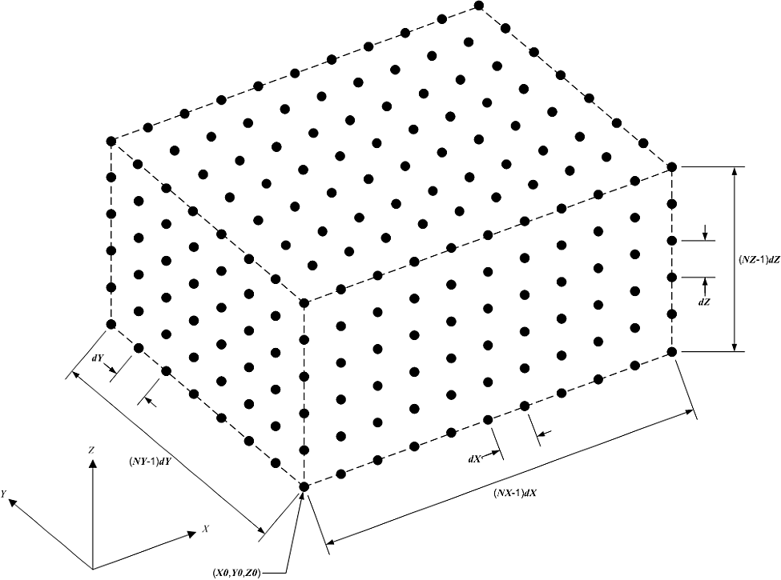
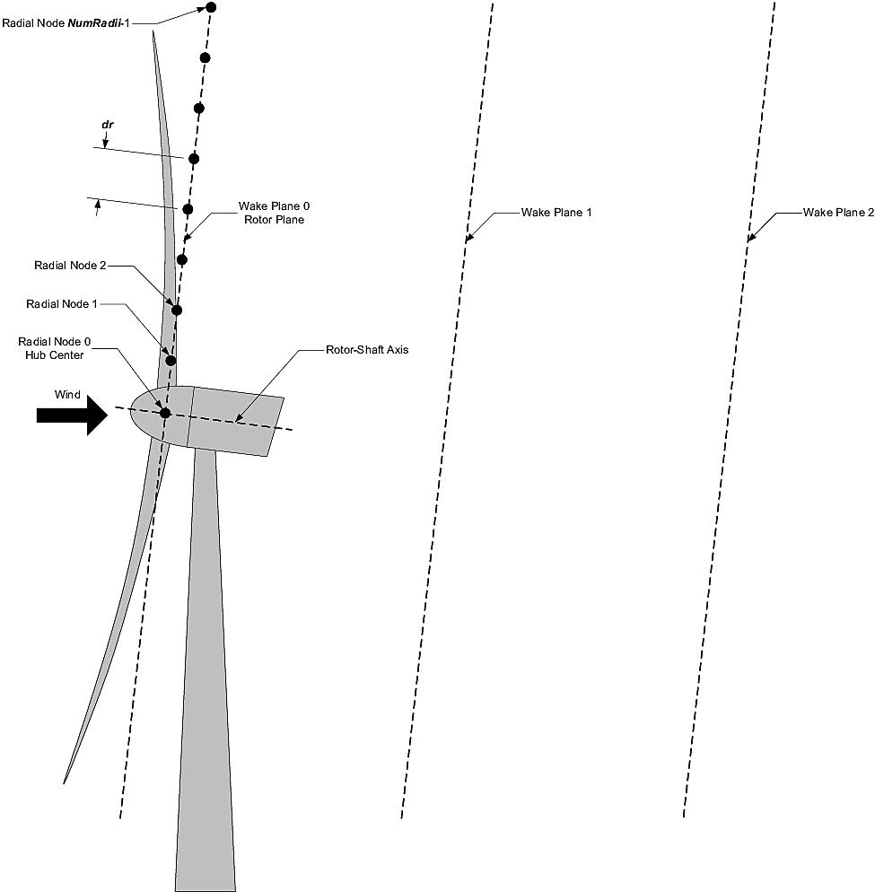

.. _FF:Input:

Input Files
===========

The primary FAST.Farm input file defines ambient wind, the wind turbine
layout within the wind farm, the wake axisymmetric finite-difference
grid, calibrated parameters for wake dynamics, visualization output,
output file specifications, and auxiliary parameters. Ambient wind data
optionally generated from the high-fidelity precursor atmospheric
simulation are stored in separate files referenced in the primary
FAST.Farm input file. Properties for each wind turbine in the wind farm
are stored in the standard OpenFAST input files, referenced by their
primary OpenFAST input file (one for each wind turbine) in the primary
FAST.Farm input file.

No lines should be added or removed from the input files, except in
tables where the number of rows is specified.

Units
-----

FAST.Farm uses the SI system (kg, m, s, N).

.. _FF:sec:FFarminputfile:

FAST.Farm Primary Input File
----------------------------

The FAST.Farm primary input file is organized into several functional
sections:

-  Simulation Control

-  Super Controller

-  Shared Moorings

-  Ambient Wind

-  Wind Turbines

-  Wake Dynamics

-  Visualization

-  Output.

Each section corresponds to an aspect of the FAST.Farm model -- see the
subsections below. A sample FAST.Farm primary input file is given in
:numref:`FF:APP:Input`. Where there is a one-to-one equivalency between an input
parameter and a variable in the FAST.Farm theory documented in
:numref:`FF:Theory`, the variable in
:numref:`FF:Theory` is shown in parentheses after the input
parameter in the subsections below.

The input file begins with two lines of header information that is for
your use, but is not used by the software.

Simulation Control
~~~~~~~~~~~~~~~~~~

**Echo** [flag] specifies if you wish to have FAST.Farm echo the
contents of the FAST.Farm primary input file (useful for debugging
errors in the input file). If **Echo** = TRUE, an echo file will be
generated. The echo file has the naming convention of
<*RootName*>\ *.ech*, where <*RootName*> is the name of the FAST.Farm
primary input file, excluding its file extension.

**AbortLevel** [quoted string] indicating what error level should cause
an abort. Options are: “WARNING,” “SEVERE,” or “FATAL.” **AbortLevel**
in FAST.Farm is used the same way as the level set in stand-alone
OpenFAST, but the **AbortLevel** set in FAST.Farm will override the
levels set in the OpenFAST primary input file of each wind turbine in
the wind farm. Setting FAST.Farm to abort on fatal errors is typical,
but see the FAST v8 ReadMe document  for additional guidance.

**TMax** [sec] is the total length of the simulation to be run. The
first output is calculated at :math:`t=0`; the last output is calculated
at :math:`t` = **TMax**. The **TMax** set in FAST.Farm will override the
simulation length set in the OpenFAST primary input file of each wind
turbine in the wind farm.

**UseSC** [flag] indicates if the wind-farm-wide super controller is to
be used. If **UseSC** = TRUE, the super controller will be called. If
**UseSC** = FALSE, the super controller will not be called, but each
wind turbine may still have an individual controller specified in the
OpenFAST module *ServoDyn*.

**Mod_AmbWind** [switch] indicates the ambient wind source. There are
three options: 1) use ambient wind data generated by a high-fidelity
precursor simulation in VTK format **[Mod_AmbWind=1]**, 2) use ambient
wind data as defined by the FAST.Farm interface to the *InflowWind*
module, with one instance of *InflowWind* **[Mod_AmbWind=2]**, or 3) use
ambient wind data as defined by the FAST.Farm interface to the
*InflowWind* module, with multiple instances of *InflowWind*
**[Mod_AmbWind=3]**. The distinct Ambient Wind subsections below pertain
to each option.

**Mod_WaveField** [switch] indicates how the wave field should be treated.  The
two options are: 1) use individual HydroDyn inputs at each turbine without
adjustment, 2) adjust wave phases based on turbine offsets from wind farm
origin.

**Mod_SharedMooring** [switch] indicates if a farm level mooring line system
interconnects turbines.  There are presently two options: 0) No shared moorings,
3) MoorDyn.

Super Controller
~~~~~~~~~~~~~~~~

**SC_FileName** [quoted string] sets the name and location of the
dynamic library containing the super controller code. It is only used
when **UseSC** = TRUE. The dynamic library should be compiled as a
*.dll* file in Windows or a *.so* file in Linux or Mac OS. **The file
name must be in quotations** and can contain an absolute or a relative
path. The super controller is used in conjunction with individual wind
turbine controllers defined in the style of the DISCON dynamic library
of the DNV GL’s Bladed wind turbine software package, with minor
modification. See :numref:`FF:sec:SupCon` for more information.

Shared Moorings
~~~~~~~~~~~~~~~

Shared mooring lines running between platforms introduce a coupling between the
platforms that operates on the same time scales as a platform's interaction with
a regular mooring system (typically resolved at a time step of 10--30 ms in
OpenFAST simulations).  See :numref:`MoorDyn` for more information.

**SharedMoorFile** [quoted string] sets the name and location of the MoorDyn
input file for the mooring lines in the wind farm. It is only used if
**Mod_SharedMooring** = 3.  **The file name must be in quotations** and can
contain an absolute or a relative path.  The mooring lines then connect to each
of the wind turbines in the farm.  See `MoorDyn with FAST.Farm
<https://moordyn.readthedocs.io/en/latest/usage.html#moordyn-with-fast-farm>`_
documentation for details on the input file at the farm level.

**DT_Mooring** (sec) sets the timestep for the shared mooring connections with
MoorDyn. 

.. _FF:Input:VTK:

Ambient Wind: Precursor in Visualization Toolkit Format
~~~~~~~~~~~~~~~~~~~~~~~~~~~~~~~~~~~~~~~~~~~~~~~~~~~~~~~

The input parameters in this section are only used when **Mod_AmbWind**
= 1, indicating the use of ambient wind generated by a high-fidelity
precursor simulation. In this case, the ambient wind, including their
spatial discretization, must be stored in VTK format -- as described in
:numref:`FF:AmbWindVTK` -- and is used directly without modification
by FAST.Farm.

**DT_Low-VTK** [sec] (:math:`t`) sets the time step of the
low-resolution ambient wind data files and calculation, as well as the
global (driver/glue-code) time step of FAST.Farm. **DT_Low-VTK** is the
same as **DT_Low** in this documentation. The modules of FAST.Farm are
called every **DT_Low** seconds, although OpenFAST and its modules may
use a time step that is an integer multiple smaller than or equal to
**DT_Low**.

**DT_High-VTK** [sec] sets the time step of the high-resolution ambient
wind data files and calculation and **must be an integer multiple
smaller than or equal to DT_Low**. **DT_High-VTK** is the same as
**DT_High** in this documentation. It is essential that **DT_Low** and
**DT_High** are small enough to ensure solution accuracy and match the
time resolution used when generating the ambient wind data from the
high-fidelity precursor simulation. **DT_Low** should be consistent with
the timescales of wake dynamics, e.g., on the order of seconds and
smaller for higher mean wind speeds. **DT_High** should be sufficient
for accurate aerodynamic load calculations, e.g., on the order of
fractions of a second. Further guidance on choosing appropriate time
steps is given in :numref:`FF:ModGuidance`.

**WindFilePath** [quoted string] specifies the path to the directory
where the low- and high-resolution ambient wind data files are stored.
The path can be specified relative to the location of the FAST.Farm
primary input file or with an absolute path. It is recommended to use
quotes around the path. If there are spaces in the file or path names,
these quotes are required. **FAST.Farm requires that the ambient wind
data files be stored in specific subdirectories of the directory
specified by WindFilePath and with specific filenames.** The
low-resolution ambient wind data files must be named
*Amb.t<n*\ :sub:`low`\ *>.vtk* and stored in a subdirectory named
*Low*. In the file names, *<n*\ :sub:`low`\ *>* is an integer
(without leading zeros) between *0* (at :math:`t=0`) and *N-1*, where
:math:`N=FLOOR\left( \frac{TMax}{DT_\text{Low}} \right)+1` is the number
of low-resolution time steps. The high-resolution ambient wind data
files must be named *Amb.t<n*\ :sub:`high`\ *>.vtk*, where
*<n*\ :sub:`high`\ *>* is an integer (without leading zeros)
between 0 (at :math:`t=0`) and
:math:`\frac{DT_\text{Low}}{DT\_High}\left( N-1 \right)`. The files must
be stored in a subdirectory named *HighT<n*\ :sub:`t`\ *>*, where
*<n*\ :sub:`t`\ *>* is an integer (without leading zeros) between 1 and
the total number of wind turbines (**NumTurbines**). Subdirectory
*HighT<n*\ :sub:`t`\ *>* must contain the high-resolution ambient wind
data corresponding to wind turbine *<n*\ :sub:`t`\ *>*, specified in the
Wind Turbines section of the FAST.Farm primary input file -- see
:numref:`FF:Input:WT`. The VTK format of each ambient wind data
file -- for both the low-resolution and high-resolution domains -- is
identical, as described in :numref:`FF:AmbWindVTK`.

**ChkWndFiles** [flag] specifies if FAST.Farm should check the ambient
wind data files for consistency before running the simulation
(preventing a possible crash later). As this check is time intensive, it
is recommended that **ChkWndFiles** be set to FALSE (to disable the
check) if the ambient wind data have previously been checked, such as in
a prior simulation. If set to TRUE, FAST.Farm will check to ensure that:

-  The number of low-resolution ambient wind data files is sufficient to
   run the entire simulation (up to :math:`t =`\ **TMax**). If more
   files are in the subdirectory, only the first *N* will be used.

-  The number of high-resolution ambient wind data files is sufficient
   to run the entire simulation (up to :math:`t =`\ **TMax**) for all
   wind turbines. If there are more subdirectories, only the first
   **NumTurbines** will be used. If more files are in each subdirectory,
   only the first
   :math:`\frac{DT_\text{Low}}{DT\_High}\left( N-1 \right)+1` will be
   used.

-  The spatial resolution (number of grid points, origin, and spacing)
   of each low-resolution ambient wind data file is the same.

-  The spatial resolution (number of grid points, origin, and spacing)
   of each high-resolution ambient wind data file is the same for a
   given wind turbine.

-  The number of grid points in each high-resolution domain is the same
   for all wind turbines in the wind farm.

Ambient Wind: InflowWind Module
~~~~~~~~~~~~~~~~~~~~~~~~~~~~~~~

The input parameters in this section are only used when **Mod_AmbWind**
= 2 or 3, indicating the use of ambient wind through one or multiple
instances of the *InflowWInd* module. In this case, the ambient wind
specified within *InflowWInd* is interpolated to the low- and
high-resolution domains for use within FAST.Farm.

**DT_Low** [sec] (:math:`\Delta t`) sets the time step of the
low-resolution ambient wind calculation, as well as the global
(driver/glue-code) time step of FAST.Farm. The modules of FAST.Farm are
called every **DT_Low** seconds, although OpenFAST and its modules may
choose to use a time step that is an integer multiple smaller than or
equal to **DT_Low**.
When **Wake_Mod=2,3**, the stability of the algorithm will depend on the choice 
of **dr** and **DT_Low**.
(typically  :math:`\textbf{DT_Low}  \lessapprox \textbf{dr}/(2V_\text{Hub})`, 
see :numref:`FF:ModGuidance`)

**DT_High** [sec] sets the time step of the high-resolution ambient wind
data calculation and must be an integer multiple smaller than or equal
to **DT_Low**. It is essential that **DT_Low** and **DT_High** are small
enough to ensure solution accuracy. **DT_Low** should be consistent with
the timescales of wake dynamics, e.g., on the order of seconds and
smaller for higher mean wind speeds. **DT_High** should be sufficient
for accurate aerodynamic load calculations, e.g., on the order of
fractions of a second. Further guidance on choosing appropriate time
steps is given in :numref:`FF:ModGuidance`.

The next nine input parameters set the spatial discretization of the
low-resolution ambient wind domain. The low-resolution domain is stored
as a structured 3D grid of wind data points (representing the corners of
3D cells) in the global *X-Y-Z* inertial-frame coordinate system, as
illustrated generically in :numref:`FF:StrucDomains`.

   Structured 3D grid for the low- or high-resolution domains.

**NX_Low**, **NY_Low**, and **NZ_Low** [integer] set the number of wind
data points in each direction.

**X0_Low**, **Y0_Low**, and **Z0_Low** [m] set the origin of the grid
(lowest-most *X-Y-Z* coordinate).

**dX_Low**, **dY_Low**, and **dZ_Low** [m] set the spatial
discretization in each direction.

The total low-resolution domain size has dimensions
(**NX_Low**-1)\ **dX_Low** :math:`\times` (**NY_Low**-1)\ **dY_Low**
:math:`\times` (**NZ_Low**-1)\ **dZ_Low**. The low-resolution domain
should extend throughout the wind farm wherever turbines and wakes may
potentially reside with a resolution sufficient so that the spatial
averaging is accurate, e.g., on the order of tens of meters for
utility-scale wind turbines. Further guidance on choosing appropriate
spatial discretization is given in
:numref:`FF:ModGuidance`.

Like the low-resolution domain, each high-resolution domain is stored as
a structured 3D grid of wind data points in the global *X-Y-Z*
inertial-frame coordinate system -- as illustrated generically in
:numref:`FF:StrucDomains`.

**NX_High**, **NY_High**, and **NZ_High** [integer] set the number of
wind data points in each direction. These values are the same for each
wind turbine and so only need to be set once.

The origin and spatial discretization for the high-resolution wind
domain for each turbine are specified in the Wind Turbines section of
the FAST.Farm primary input file below.

**InflowFile** [quoted string] specifies the name of the primary input
file for the *InflowWind* module, which can be specified relative to the
location of the FAST.Farm primary input file or specified with an
absolute path. It is recommended to use quotes around the file name. If
there are spaces in the file or path names, these quotes are required.
See :numref:`FF:AmbWindIfW` for information on the contents of
this file.

.. _FF:Input:WT:

Wind Turbines
~~~~~~~~~~~~~

**NumTurbines** [integer] (:math:`N_t`) is the number of wind turbines
in the wind farm and determines the number of rows in the subsequent
table (after two table header lines).

For each wind turbine:

-  **WT_X**, **WT_Y**, and **WT_Z** [m] specify the origin in the global
   *X-Y-Z* inertial-frame coordinate system. The origin is defined as
   the intersection of the undeflected tower centerline and the ground
   or, for offshore systems, mean sea level.

-  **WT_FASTInFile** [quoted string] specifies the name of the OpenFAST
   primary input file associated with each turbine. Each wind turbine is
   numbered within FAST.Farm as an integer (:math:`n_t`) between 1 and
   **NumTurbines** corresponding to the row in the table. The OpenFAST
   primary input file name can be specified relative to the location of
   the FAST.Farm primary input file or with an absolute path. It is
   recommended to use quotes around the file name. Identical wind
   turbines can use the same OpenFAST primary input file, except if the
   corresponding OpenFAST model makes use of a Bladed-style controller
   in DLL format or, for offshore wind turbines, if different wave
   conditions are required for each turbine. If a Bladed-style DLL
   controller is being used, distinct Bladed-style controller DLLs must
   be used (each with a unique name). This requires the need for
   distinct *ServoDyn* primary input files, referencing the appropriate
   DLL name, and distinct OpenFAST primary input files, each referencing
   the appropriate *ServoDyn* primary input file name. If different wave
   conditions are required for each turbine, the distinct wave
   conditions (e.g., based on unique random wave seeds) for each wind
   turbine must be set in the *HydroDyn* primary input file and distinct
   OpenFAST primary input files must be used, each referencing the
   appropriate *HydroDyn* primary input file name. See
   :numref:`FF:Input:OFInput` for information on the contents of
   the OpenFAST input files.

-  When **Mod_AmbWind** = 2 or 3, the Wind Turbines table has six
   additional columns to complete the spatial discretization of the
   high-resolution wind domain for each wind turbine:

   -  **X0_High**, **Y0_High**, and **Z0_High** [m] set the origin of
      the grid.

   -  **dX_High**, **dY_High**, **dZ_High** [m] set spatial
      discretization in each direction.

The total high-resolution domain size has dimensions
(**NX_High**-1)\ **dX_High** :math:`\times` (**NY_High**-1)\ **dY_High**
:math:`\times` (**NZ_High**-1)\ **dZ_High**. Each high-resolution domain
must extend around the corresponding wind turbine, encompassing any
turbine displacement. The domains should have a resolution sufficient
for accurate aerodynamic load calculations, e.g., on the order of the
blade chord length. The high-resolution domains will occupy the same
space as portions of the low-resolution domain, requiring domains
overlap.

Wake Dynamics
~~~~~~~~~~~~~

With FAST.Farm, each wake plane is treated as a radial finite-difference
grid, as shown in :numref:`FF:RadialFD`.

   Radial finite-difference grid. For clarity of the illustration, the
   number and size of the wake planes are shown smaller than they should
   be.

Three wake formulations are available (see :numref:`FF:Theory` for more details):

**Mod_Wake** [switch] is used to switch between wake formulations.
There are three options available:
1) Polar [**Mod_Wake=1**] (default); 
the wake is axi-symmetric, defined on a polar grid, 
solved using an implicit Crank-Nicolson scheme,
satisfying both the momentum and mass conservation laws under a shear layer approximation.
2) Curled-wake model [**Mod_Wake=2**];
the wake is defined on a Cartesian grid, 
the effect of curled wake vorticies in skewed inflow is accounted for by introducing cross-flow velocities, the momentum conservation is solved using a first-order forward Euler scheme, 
mass conservation is not enforced, the effect of wake swirl may be accounted for.
The wake will adopt a "curled" shape in skewed inflow.
3) Cartesian [**Mod_Wake=3**]; corresponds to model 2 with curled-wake vortices of zero intensities, leading to an axi-symmetric wake.

When Wake_Mod=2,3, the stability of the algorithm will depend on the choice of **dr** and **DT_Low** (see the guidelines (see the guidelines given in :numref:`FF:ModGuidance`).

The wake planes are defined by the following parameters:

-  **dr** [m] sets the radial increment. To ensure the wake deficits are
   accurately computed by FAST.Farm, **dr** should be set so that
   FAST.Farm sufficiently resolves the wake deficit within each plane.
   When a cartesian grid is used (**Mod_Wake=2 or 2**), **dr** represents the 
   spacing in the y and z direction of the plane.
   When **Wake_Mod=2,3**, the stability of the algorithm will depend on the choice 
   of **dr** and **DT_Low** (see the guidelines given in :numref:`FF:ModGuidance`).

-  **NumRadii** [integer] (:math:`N_r`) sets the number of radii. To
   ensure the wake deficits are accurately computed by FAST.Farm,
   **NumRadii** should be set so that the diameter of each wake plane,
   2(**NumRadii**-1)\ **dr**, is large relative to the rotor diameter.
   When a Cartesian grid is used, the y and z coordinates extend from
   (-NumRaddi+1)*dr to  (NumRadii-1)*dr.

-  **NumPlanes** [integer] (:math:`N_p`) sets the number of wake planes.
   To ensure the wake deficits are accurately captured by FAST.Farm,
   **NumPlanes** should be set so that the wake planes propagate a
   sufficient distance downstream, preferably until the wake deficit
   decays away.

The next :math:`20` inputs are user-specified calibration parameters and
options that influence the wake-dynamics calculations. The parameters
may depend, e.g., on turbine operation or atmospheric conditions that
can be calibrated to better match experimental data or by using an HFM
benchmark. Default values have been derived for each calibrated
parameter based on `SOWFA <https://nwtc.nrel.gov/SOWFA>`__ simulations
( :cite:`ff-Doubrawa18_1`), but these can be overwritten by the
user.

**f_c** [Hz] (:math:`f_c`) is the cutoff (corner) frequency of the
low-pass time filter for the wake advection, deflection, and meandering
model and must be greater than zero. 
Preferably the filter constant should be set as follows:

.. math::  :label: fffc

     \tau_1=\frac{1.1}{1-1.3 \operatorname{min}(a_\text{avg}, 0.5)} \frac{R}{U_\infty} , \qquad f_c = \frac{2.4}{\tau_1}

where 
:math:`\tau_1` is a time scale similar to the one used in the Oye dynamic inflow model and 
:math:`a_\text{avg}` is the average axial induction factor across the rotor disk.
If the DEFAULT keyword is specified in place of a numerical value, **f_c** is set to :math:`12.5/R_\text{est}` Hz
which corresponds to :math:`U=10` m/s, :math:`a=1/3` in the equation above, and 
where the estimated rotor radius is obtained as: :math:`R_\text{est} = (dr * NumRadii) / 3`.
Changing the grid resolution will change the estimated radius, therefore it is recommended to set a numerical 
value for **f_c** directly instead of using DEFAULT. 
If numerical issues occur, you may attempt to lower the value of **f_c** to introduce more filtering of high frequencies.
In previous release, the default value was excessively small, set to :math:`0.0007` Hz.

**C_HWkDfl_O** [m] (:math:`C_{HWkDfl}^{O}`) is the calibrated parameter
for the wake deflection correction defining the horizontal offset at the
rotor. If the DEFAULT keyword is specified in place of a numerical
value, **C_HWkDfl_O** is set to :math:`0.0`.

**C_HWkDfl_OY** [m/deg] (:math:`C_{HWkDfl}^{OY}`) is the calibrated
parameter for the wake deflection correction defining the horizontal
offset at the rotor scaled with yaw error. If the DEFAULT keyword is
specified in place of a numerical value, 
**C_HWkDfl_OY** is set to :math:`0` when **Mod_Wake=2**
**C_HWkDfl_OY** is set to :math:`0.3` otherwise.

**C_HWkDfl_x** [-] (:math:`C_{HWkDfl}^{x}`) is the calibrated parameter
for the wake deflection correction defining the horizontal offset scaled
with downstream distance. If the DEFAULT keyword is specified in place
of a numerical value, **C_HWkDfl_x** is set to :math:`0.0`.

**C_HWkDfl_xY** [1/deg] (:math:`C_{HWkDfl}^{xY}`) is the calibrated
parameter for the wake deflection correction defining the horizontal
offset scaled with downstream distance and yaw error. If the DEFAULT
keyword is specified in place of a numerical value, 
**C_HWkDfl_xY** is set to :math:`0.0` when **Mod_Wake=2**.
**C_HWkDfl_xY** is set to :math:`-0.004` otherwise.

**C_NearWake** (:math:`C_{NearWake}`) [-] is the calibrated parameter
for the near-wake correction and must be greater than one. If the
DEFAULT keyword is specified in place of a numerical value,
**C_NearWake** is set to :math:`1.8`.

**k_vAmb** [-] (:math:`k_{\nu Amb}`) is the calibrated parameter for the
ambient turbulence influence in the eddy viscosity and must be greater
than zero. If the DEFAULT keyword is specified in place of a numerical
value, **k_vAmb** is set to :math:`0.05`.

**k_vShr** [-] (:math:`k_{\nu Shr}`) is the calibrated parameter for the
wake shear layer influence in the eddy viscosity and must be greater
than zero. If the DEFAULT keyword is specified in place of a numerical
value, **k_vShr** is set to :math:`0.016`.

**C_vAmb_DMin** [-] (:math:`C_{\nu Amb}^{DMin}`) is a calibrated
parameter in the eddy viscosity filter function for ambient turbulence.
It defines the transitional diameter fraction between the minimum and
exponential regions and must be greater than or equal to zero. If the
DEFAULT keyword is specified in place of a numerical value,
**C_vAmb_DMin** is set to :math:`0.0`.

**C_vAmb_DMax** [-] (:math:`C_{\nu Amb}^{DMax}`) is a calibrated
parameter in the eddy viscosity filter function for ambient turbulence.
It defines the transitional diameter fraction between the exponential
and maximum regions and must be greater than **C_vAmb_DMin**. If the
DEFAULT keyword is specified in place of a numerical value,
**C_vAmb_DMax** is set to :math:`1.0`.

**C_vAmb_FMin** [-] (:math:`C_{\nu Amb}^{FMin}`) is a calibrated
parameter in the eddy viscosity filter function for ambient turbulence.
It defines the value in the minimum region and must be between zero and
one (inclusive). If the DEFAULT keyword is specified in place of a
numerical value, **C_vAmb_FMin** is set to :math:`1.0`.

**C_vAmb_Exp** [-] (:math:`C_{\nu Amb}^{Exp}`) is a calibrated parameter
in the eddy viscosity filter function for ambient turbulence. It defines
the exponent in the exponential region and must be greater than zero. If
the DEFAULT keyword is specified in place of a numerical value,
**C_vAmb_Exp** is set to :math:`0.01`.

**C_vShr_DMin** [-] (:math:`C_{\nu Shr}^{DMin}`) is a calibrated
parameter in the eddy viscosity filter function for the wake shear
layer. It defines the transitional diameter fraction between the minimum
and exponential regions and must be greater than or equal to zero. If
the DEFAULT keyword is specified in place of a numerical value,
**C_vShr_DMin** is set to :math:`3.0`.

**C_vShr_DMax** [-] (:math:`C_{\nu Shr}^{DMax}`) is a calibrated
parameter in the eddy viscosity filter function for the wake shear
layer. It defines the transitional diameter fraction between the
exponential and maximum regions and must be greater than
**C_vShr_DMin**. If the DEFAULT keyword is specified in place of a
numerical value, **C_vShr_DMax** is set to :math:`25.0`.

**C_vShr_FMin** [-] (:math:`C_{\nu Shr}^{FMin}`) is a calibrated
parameter in the eddy viscosity filter function for the wake shear
layer. It defines the value in the minimum region and must be between
zero and one (inclusive). If the DEFAULT keyword is specified in place
of a numerical value, **C_vShr_FMin** is set to :math:`0.2`.

**C_vShr_Exp** [-] (:math:`C_{\nu Shr}^{Exp}`) is a calibrated parameter
in the eddy viscosity filter function for the wake shear layer. It
defines the exponent in the exponential region and must be greater than
zero. If the DEFAULT keyword is specified in place of a numerical value,
**C_vShr_Exp** is set to :math:`0.1`.

**Mod_WakeDiam** [switch] specifies the wake diameter calculation model
(method). There are four options: 1) use the rotor diameter
[**Mod_WakeDiam=1**]; 2) use a velocity-based method
[**Mod_WakeDiam=2**]; 3) use a mass-flux based method
[**Mod_WakeDiam=3**]; or 4) use a momentum-flux based method
[**Mod_WakeDiam=4**]. If the DEFAULT keyword is specified in place of a
numerical value, **Mod_WakeDiam** is set to :math:`1`.

**C_WakeDiam** [-] (:math:`C_{WakeDiam}`) is the calibrated parameter
for the wake diameter calculation and must be greater than zero and less
than :math:`0.99`. It is unused when **Mod_WakeDiam=1**. If the DEFAULT
keyword is specified in place of a numerical value, **C_WakeDiam** is
set to :math:`0.95`.

**Mod_Meander** [switch] specifies the spatial filter model (method) for
wake meandering. There are three options: 1) use a uniform spatial
average [**Mod_Meander=1**]; 2) use a truncated *jinc*
[**Mod_Meander=2**]; or 3) use a windowed *jinc* [**Mod_Meander=3**]. If
the DEFAULT keyword is specified in place of a numerical value,
**Mod_Meander** is set to :math:`3`.

**C_Meander** [-] (:math:`C_{Meander}`) is the calibrated parameter for
the wake meandering and must be greater than or equal to one. If the
DEFAULT keyword is specified in place of a numerical value,
**C_Meander** is set to :math:`1.9`.

*----------------Curled wake parameters------------------*

**Swirl** [switch] 
Include swirl velocities in wake [only used if [**Mod_Wake=2**]
or [**Mod_Wake=3**].

**k_VortexDecay** [-] This constant specifies the decay rate of the 
spanwise velocity components from the curled wake model. 
DEFAULT is 0.01.

**NumVortices** [-] The number of vortices in the curled wake model. 
DEFAULT is 100.

**sigma_D** [-] The width of the vortex core in the curled wake model 
non-dimesionalized by rotor diameter.  If the DEFAULT keyword is 
specified in place of a numerical value, **sigma_D** is set to 
:math:`0.2`.

**FilterInit** [switch] The number of grid points (in the `y` and `z` directions)
used to filter the initial wake plane deficit in the curled wake model.
A value of zero corresponds to no filter. The filter is used to remove strong gradients  
in the wake, and stabilize the solution.
DEFAULT is 1.

**k_vCurl** [-] Calibrated parameter for scaling the eddy viscosity in the 
curled-wake model. 
This value is a tuning parameters to increase or decrease the diffusion in the curled wake model.
We have found that this value may be a function of the thrust coefficient, with higher values recommended for higher thrust coefficients.
The following guidelines are suggested: 
:math:`k_v=0.9` for :math:`C_T=0.4`,
:math:`k_v=2.0` for :math:`C_T=0.7`,
:math:`k_v=3.0` for :math:`C_T=0.9`.
These guidelines may change in the future.
The DEFAULT value is 2.0.

**Mod_Projection** [switch] Select how the wake plane velocity is 
projected in AWAE. There are two options:
1) keep all components 
2) project against plane normal.
If DEFAULT is used, then **Mod_Projection=2** when **Mod_Wake=2**, 
and **Mod_Projection=1** otherwise.

**OutAllPlanes** [-] Output all wake planes in VTK at all time steps. 
Note: this option requires intensive writing to disk and will drastically slow down the simulation.
DEFAULT is False.

Visualize
~~~~~~~~~

**WrDisWind** [flag] specifies whether full 3D low- and high-resolution
disturbed wind data output files will be generated. These files show the
ambient wind and wake interactions across the wind farm for
visualization and are generated if **WrDisWind**\ =TRUE. The VTK data
format and spatial resolutions (number of grid points, origin, and
spacing) of these output files match those of the corresponding low- and
high-resolution ambient wind data used by the FAST.Farm simulation. The
VTK files are written to a directory named *vtk_ff* where the FAST.Farm
primary file is stored. The naming conventions of these output files are
*<RootName>.Low.Dis.<n*\ :sub:`low`\ *>.vtk* and
*<RootName>.HighT\ <n*\ :sub:`t`\ *>\ *.Dis.<n*\ :sub:`t`\ *>.vtk* for
the low- and high-resolution disturbed wind data files, respectively,
where *<RootName>* is the name of the FAST.Farm primary input file,
excluding its file extension, where *<n*\ :sub:`t`\ *>* and
*<n*\ :sub:`low`\ *>* are as specified in
:numref:`FF:Input:VTK`, but include leading zeros.

For visualization, FAST.Farm can also output low-resolution disturbed (including
wakes) wind data output files that are two-dimensional (2D) slices of the full
low-resolution domain, specified by the following 7 inputs. Up to ninety-nine 2D
slices parallel to the *X-Y*, *Y-Z*, and/or *X-Z* planes can be output.

-  **NOutDisWindXY** [integer] specifies the number of 2D slices
   parallel to the *X-Y* plane where low-resolution disturbed wind data
   output files are output (:math:`0` to :math:`99`).

-  **OutDisWindZ** [m] is a list **NOutDisWindXY** values long of the
   *Z* coordinates of each plane that will be output. These values are
   in the **global inertial-frame coordinate system**, separated by any
   combination of commas, semicolons, spaces, and/or tabs.

-  **NOutDisWindYZ** [integer] specifies the number of 2D slices
   parallel to the *Y-Z* plane where low-resolution disturbed wind data
   output files are output (:math:`0` to :math:`99`).

-  **OutDisWindX** [m] is a list **NOutDisWindYZ** values long of the
   *X* coordinates of each plane that will be output. These values are
   in the **global inertial-frame coordinate system**, separated by any
   combination of commas, semicolons, spaces, and/or tabs.

-  **NOutDisWindXZ** [integer] specifies the number of 2D slices
   parallel to the *X-Z* plane where low-resolution disturbed wind data
   output files are output (:math:`0` to :math:`99`).

-  **OutDisWindY** [m] is a list **NOutDisWindXZ** values long of the
   *Y* coordinates of each plane that will be output. These values are
   in the **global inertial-frame coordinate system**, separated by any
   combination of commas, semicolons, spaces, and/or tabs.

The VTK files are written to a directory named *vtk_ff* where the FAST.Farm
primary file is stored. The naming conventions of these output files are
*<RootName>.Low.DisXY<n*\ :sub:`Out`\ *>.<n*\ :sub:`low`\ *>.vtk*,
*<RootName>.Low.DisYZ<n*\ :sub:`Out`\ *>.<n*\ :sub:`low`\ *>.vtk*, and
*<RootName>.Low.DisXZ<n*\ :sub:`Out`\ *>.<n*\ :sub:`low`\ *>.vtk* for the *X-Y*,
*Y-Z*, and *X-Z* slices, respectively, where *<n*\ :sub:`Out`\ *>* is an integer
between :math:`1` and :math:`9` corresponding to which slice is output.
*<RootName>* and *<n*\ :sub:`low`\ *>* are as defined in :numref:`FF:Input:VTK`,
but include leading zeros.

**WrDisDT** [sec] specifies the time step (inverse of the frame rate) of
all disturbed wind data output files and must be an integer multiple
larger than or equal to **DT_Low**. This input is unused when
**WrDisWind** = FALSE and when **NOutDisWindXY**, **NOutDisWindYZ**, and
**NOutDisWindXZ** are set to zero. If the DEFAULT keyword is specified
in place of a numerical value, **WrDisDT** is set to **DT_Low**. Note
that the full high-resolution disturbed wind data output files are not
output at a frame rate of 1/**DT_High**, but are only output every
**WrDisDT** seconds.

Visualizing the ambient wind and wake interactions can be useful for
interpreting results and debugging problems. However, FAST.Farm will
generate :math:`n+1` files per output option when **WrDisWind** = TRUE
and/or when **NOutDisWindXY**, **NOutDisWindYZ**, and/or
**NOutDisWindXZ** are set greater than zero. This file generation will
slow down FAST.Farm and take up a lot of disk space, especially when
generating full low- and high-resolution disturbed wind data files.
Therefore, disabling visualization is recommended when running many
FAST.Farm simulations. See :numref:`FF:Output:Vis` for
visualization output file details.

Output
~~~~~~

**SumPrint** [flag] specifies if a summary file is generated. The file
is generated if **SumPrint**\ =TRUE, with the name <*RootName*>\ *.sum*,
where <*RootName*> is as defined above. See
:numref:`FF:Output:Sum` for summary file details.

**ChkptTime** [sec] specifies how frequently checkpoint files are
written for a potential restart, but **is currently unused by
FAST.Farm.**

**TStart** [sec] specifies the simulation time at which FAST.Farm will
begin writing data in the time-series results output file. Note that
output files may not be generated at **TStart** seconds if **TStart** is
not an integer multiple of **DT_Low**.

**OutFileFmt** [switch] specifies which type of time-series results
output file will be generated. Three options are available, and are the
same as those in OpenFAST: 1) generates an ASCII text file
[**OutFileFmt=1**]; 2) generates a binary file [**OutFileFmt=2**]; or 3)
generates both ASCII text and binary files [**OutFileFmt=3**].
**However, FAST.Farm currently only supports text-based output files.
Therefore, OutFileFmt must be set to 1**.

**TabDelim** [flag] specifies how columns in the ASCII text output
time-series results are delimited. If **TabDelim** = TRUE, the columns
are tab-delimited. Otherwise, the columns are delimited with spaces.
**TabDelim** is not used when **OutFileFmt** = 2.

**OutFmt** [string] specifies the ASCII text-based output file channel
format (excluding the time channel). Values printed in the time-series
results output file should result in a field that is 10 characters long;
“ES10.3E2” is a common setting for **OutFmt**. The time channel is
printed using the “F10.4” format. **OutFmt** is not used when
**OutFileFmt** = 2. See :numref:`FF:Output:Time` for
details on time-series results files.

FAST.Farm can output wake-related quantities for up to 9 individual
turbines, not considering the effects of wake merging, at up to 20
radial nodes and up to 9 downstream distances. These outputs are
specified with the 4 following inputs:

-  **NOutRadii** [integer] specifies the number of radial nodes to be
   outputted (0 to 20).

-  **OutRadii** [integer] specifies the node numbers between 0 (at the
   wake center) and **NumRadii**-1 (at the outer extent of the radial
   finite-difference grid). Values are a list of length **NOutRadii**,
   separated by any combination of commas, semicolons, spaces, and/or
   tabs.

-  **NOutDist** [integer] specifies the number of downstream distances
   that output is requested for (0 to 9).

-  **OutDist** [m] specifies the downstream distances (not wake-plane
   numbers) and each must be greater or equal to zero. Values are a list
   of length **NOutDist**, separated by any combination of commas,
   semicolons, spaces, and/or tabs. The downstream distances are
   measured normal to the wake planes and **an OutDist of zero
   corresponds to the rotor plane**. Wake output quantities are linearly
   interpolated between wake planes. Only wake-related quantities for
   the first 9 turbines can be output and all wakes have the same output
   radial node numbers and downstream distances. The outputs specified
   in the **OutList** section determine which quantities are actually
   output at these output radial node numbers and downstream distances.

FAST.Farm can also output ambient wind velocities (not including wakes)
and disturbed wind velocities (including wakes) at up to nine points
(positions) in the low-resolution wind domain, defined with the
following inputs:

-  **NWindVel** [integer] specifies the number of points where wind will
   be output (0 to 9).

-  **WindVelX**, **WindVelY**, and **WindVelZ** [m] specifies *X*, *Y*,
   *Z* and coordinates, respectively, in the **global inertial-frame
   coordinate system**. Values are lists of length **NWindVel**
   separated by any combination of commas, semicolons, spaces, and/or
   tabs. The outputs specified in the **OutList** section determine
   which wind velocities are actually output at these points.

-  **OutList** [quoted strings] controls output quantities generated by
   FAST.Farm. Enter one or more lines containing quoted strings that in
   turn contain one or more output parameter names. Separate output
   parameter names by any combination of commas, semicolons, spaces,
   and/or tabs. If you prefix a parameter name with a minus sign, “-”;
   underscore, “\_”; or the characters “m” or “M”, FAST.Farm will
   multiply the value for that channel by :math:`-1` before writing the
   data. The output columns are written in the order they are listed in
   the input file. FAST.Farm allows for the use of multiple lines so
   that lists can be broken into meaningful groups and so the lines can
   be shorter. Comments may be entered after the closing quote on any of
   the lines. Entering a line with the string “END” at the beginning of
   the line or at the beginning of a quoted string found at the
   beginning of the line will cause FAST.Farm to quit scanning for more
   lines of channel names. Wake-related output quantities are generated
   for the requested output radial node numbers and downstream distances
   through the **OutRadii** and **OutDist** lists above. Ambient and
   disturbed wind velocities are generated for the requested points
   through the **WindVelX**, **WindVelY**, and **WindVelZ** lists above.
   If FAST.Farm encounters an unknown/invalid channel name, it warns the
   users but will remove the suspect channel from the output file.
   Please refer to :numref:`FF:APP:Output` for a complete list of possible output
   parameters.

.. _FF:AmbWindVTK:

Ambient Wind Precursor Files in Visualization Toolkit Format
------------------------------------------------------------

When using ambient wind generated by a high-fidelity precursor
simulation with **Mod_AmbWind** = 1, ambient wind data files for both
the low- and high-resolution domains must be pre-generated. Each of
these ambient wind data files must follow the `simple legacy serial VTK
file
format <https://www.vtk.org/wp-content/uploads/2015/04/file-formats.pdf>`__.
A sample VTK-formatted file is given in :numref:`FF:APP:Wind`.

FAST.Farm requires that the ambient wind data files be stored in
specific subdirectories of the directory specified by **WindFilePath**
and with specific file names. The low-resolution ambient wind data files
must be stored in a subdirectory named *Low* and be named
*Amb.t<n*\ :sub:`low`\ *>.vtk*, where *<n*\ :sub:`low`\ *>* is
as specified in :numref:`FF:Input:VTK`. The high-resolution
ambient wind data files must be stored in a subdirectory named
*HighT<n*\ :sub:`t`\ *>* and be named
*Amb.t<n*\ :sub:`high`\ *>.vtk*, where *<n*\ :sub:`t`\ *>* and
*<n*\ :sub:`high`\ *>* are as specified in
:numref:`FF:Input:VTK`. Subdirectory *HighT<n*\ :sub:`t`\ *>*
should contain the high-resolution ambient wind data corresponding to
wind turbine *n*\ :sub:`t` specified in the Wind Turbines section of
the FAST.Farm primary input file -- see :numref:`FF:Input:WT`.

Each VTK-formatted input file begins with a file version and identifier,
but is not checked by FAST.Farm. The second line is the header
information that is for identifying specific cases, but is not used by
FAST.Farm. The third line must include the single word ASCII,
designating the file format currently supported by FAST.Farm.

The fourth line must contain the words *DATASET STRUCTURED_POINTS*,
designating the data set structure currently supported by FAST.Farm. The
next three lines set the spatial discretization of the domain. Each
domain is stored as a structured 3D grid of wind data points
(representing the corners of 3D cells) in the global *X-Y-Z*
inertial-frame coordinate system -- as illustrated generically in
:numref:`FF:StrucDomains`. The number of wind data points in each
direction are set by DIMENSIONS followed by three integers separated by
white space representing **NX**, **NY**, and **NZ**; the origin of the
grid (lowest-most *X-Y-Z* coordinate) is set by ORIGIN followed by three
floating real numbers separated by white space representing **X0**,
**Y0**, and **Z0**; and the spatial discretization in each direction are
set by SPACING followed by three floating real numbers separated by
white space representing **dX**, **dY**, and **dZ**. The total domain
size has dimensions (**NX**-1)\ **dX** :math:`\times` (**NY**-1)\ **dY**
:math:`\times` (**NZ**-1)\ **dZ**.

The eighth line must contain the word *POINT_DATA* followed by an
integer number specifying the number of wind data points, i.e., **NX**
:math:`\times` **NY** :math:`\times` **NZ**. The ninth line must contain
the word *VECTORS* followed by the data name (not used by FAST.Farm) and
*FLOAT*, which defines the format of the data stored on the grid.
Alternatively, the ninth line must contain the word *FIELD* followed by
the data name (not used by FAST.Farm) and 1 and the tenth line must
contain the array name (not used by FAST.Farm) followed by 3, the number
of wind data points, i.e., **NX** :math:`\times` **NY** :math:`\times`
**NZ**, and *FLOAT*. The remaining **NX** :math:`\times` **NY**
:math:`\times` **NZ** lines of the file contain the *X-Y-Z* components
of the ambient wind velocity at each wind data point stored as three
floating real numbers separated by white space. The first data point
corresponds to the *ORIGIN* and the remaining points involve looping
through *X*, then *Y*, and then *Z*. For a ground or wave surface that
is not flat and level -- e.g., complex terrain or time-varying sea-surface
elevation for offshore systems -- the wind velocity components at a given
wind data point should be written as NaN (not a number) [1]_ if that
point is below the surface (not exposed to the atmosphere).

.. _FF:AmbWindIfW:

Ambient Wind with InflowWind Module Input Files
-----------------------------------------------

When using ambient wind through the interface to the *InflowWind* module
with **Mod_AmbWind** = 2 or 3, the ambient wind is specified within
standard *InflowWind* input files described in the OpenFAST
documentation. The name of the primary *InflowWind* input file is
specified by input parameter **InflowFile** in FAST.Farm. Please note
that **InflowFile** is independent of the *InflowWind* primary input
file used by the OpenFAST model of each wind turbine.

The *InflowWind* primary input file is processed the same when running
FAST.Farm simulations as it would when running simulations in
stand-alone OpenFAST. The only difference is that input parameter
**OutList** in the *InflowWind* primary input file is ignored and
replaced with equivalent output settings in FAST.Farm. All wind file
type options and their associated input options are supported by
FAST.Farm. Wind file type options are specified with input parameter
**WindType** in the *InflowWind* primary input file. The available input
options include steady wind, uniform time-varying wind, e.g., discrete
gusts, and, full-field turbulent wind (in TurbSim, Bladed, and HAWC
formats).

The wind data specified within *InflowWind* must encompass the entire
low- and high-resolution domains defined within FAST.Farm for the entire
simulation. This is because the ambient wind data specified within
*InflowWind* will be interpolated to low- and high-resolution domains
for use within FAST.Farm. To ensure this when using full-field turbulent
wind data in *InflowWind*, it is recommend that:

-  The full-field wind data files be generated periodically so that the
   wind domain in *InflowWind* effectively extends forever along the
   wind propagation direction.

-  The input parameter **PropagationDir** in the *InflowWind* primary
   input file be set to :math:`0`, :math:`\pm90`, or :math:`180` degrees
   so that the wind propagates along the :math:`\pm X` or :math:`\pm Y`
   axes of the FAST.Farm inertial-frame coordinate system (the exact
   direction should depend on the orientation of the wind turbines and
   farm).

When using full-field turbulent wind data in *InflowWind*, it is
recommended that the 2D grid where the full-field turbulent wind data
are defined be coincident with either the *Y-Z* grid of the
high-resolution domain when **PropogationDir** = :math:`0` or
:math:`180` degrees or the *X-Z* grid of the high-resolution domain when
**PropogationDir** = :math:`\pm90` degrees for each wind turbine. This
is done to avoid doubly interpolating the wind data (once by FAST.Farm
when generating the high-resolution domain and once by OpenFAST when
accessing high-resolution wind at turbine analysis nodes).

When using ambient wind through multiple instances of the *InflowWind*
module, i.e, when **Mod_AmbWind** = 3, only one *InflowWind* input file
is specified. However, multiple wind data files are used, each with a
different name. Specifically, the file name in the *InflowWind* input
file in this case specifically refers only to the directory path of the
wind files. The wind file root names are required to be *Low* for the
low-resolution domain and *HighT<n*\ :sub:`t`\ *>* for the
high-resolution domain associated with turbine :math:`n_\text{t}`.  [2]_
Setting **Mod_AmbWind** to 2 or 3 has no influence when steady inflow is
used (**WindType** = 1). When using full-field turbulent wind data in
*InflowWind* with **Mod_AmbWind** = 3, it is required that:

-  The full-field wind data files be generated periodically. This
   effectively extends the wind domain forever along the wind
   propagation direction.

-  The input parameter **PropagationDir** in the *InflowWind* input file
   be set to :math:`0` degrees so that the wind propagates along the *X*
   axis of the FAST.Farm inertial-frame coordinate system.

-  The wind data files associated with the high-resolution ambient wind
   be spatially and temporally synchronized with the low-resolution wind
   data file. The spatial synchronization must be based on the global
   *X-Y-Z* offsets of each turbine origin relative to the origin of the
   inertial frame coordinate system.

.. _FF:Input:OFInput:

OpenFAST Input Files
--------------------

In addition to the FAST.Farm-specific input files, the OpenFAST model of
each wind turbine also requires input files.

**WT_FASTInFile** [quoted string] specifies the OpenFAST primary input
file for each wind turbine, including path. This is required in addition
to the FAST.Farm-specific input files. The OpenFAST primary file, in
turn, identifies several module-level input files. These OpenFAST input
files are described in the OpenFAST documentation. Identical wind
turbines can use the same OpenFAST primary input file, except if the
corresponding OpenFAST model makes use of a Bladed-style controller in
DLL format or, for offshore wind turbines, if different wave conditions
are required for each turbine. If a Bladed-style DLL controller is being
used, distinct Bladed-style controller DLLs must be used (each with a
unique name). This requires the need for distinct *ServoDyn* primary
input files, referencing the appropriate DLL name, and distinct OpenFAST
primary input files, each referencing the appropriate *ServoDyn* primary
input file name. If different wave conditions are required for each
turbine, the distinct wave conditions (e.g., based on unique random wave
seeds) for each wind turbine must be set in the *HydroDyn* primary input
file and distinct OpenFAST primary input files must be used, each
referencing the appropriate *HydroDyn* primary input file name.

**Please note that the following input parameters in OpenFAST are
interpreted differently when running FAST.Farm simulations than when
running simulations in stand-alone OpenFAST.**

**AbortLevel** in the OpenFAST primary input file is ignored and
replaced with the equivalent input set in the FAST.Farm primary input.

**TMax** in the OpenFAST primary input file is ignored and replaced with
the equivalent input set in the FAST.Farm primary input.

**CompInflow** in the OpenFAST primary input file must be set to 1 (to
use the *InflowWind* module).

**CompAero** in the OpenFAST primary input file must be set to 2 (to use
the *AeroDyn v15* module).

**WindType** and its associated input parameters in the OpenFAST
*InflowWind* module primary input file are ignored and replaced with the
disturbed wind (including wakes) computed across the high-resolution
domain for each wind turbine.

**PropogationDir** in the OpenFAST *InflowWind* module primary input
file is ignored.

**PCMode**, **VSContrl**, **HSSBRMode**, and **YCMode** in the OpenFAST
*ServoDyn* module primary input file must not be set to 4 because the
Simulink/Labview interface is not currently supported by FAST.Farm.

All input parameters across the various OpenFAST input files pertaining
to the wind turbine geometry defined relative to the origin of the
OpenFAST inertial-frame coordinate system remain unchanged. Turbine
origins are defined as the intersection of the undeflected tower
centerline and the ground or, for offshore systems, mean sea level.
Note, however, this origin ((:math:`0`,\ :math:`0`,\ :math:`0`) in the
OpenFAST inertial-frame coordinate system) is located at
(**WT_X**,\ **WT_Y**,\ **WT_Z**) in the FAST.Farm global *X-Y-Z*
inertial-frame coordinate system.

.. [1]
   FAST.Farm will treat such wind data points as outside the domain, and
   so, not used in any calculations.

.. [2]
   When HAWC format is used (**WindType** = 5), :math:`\_u`,
   :math:`\_v`, :math:`\_w` must be appended to the file names.
