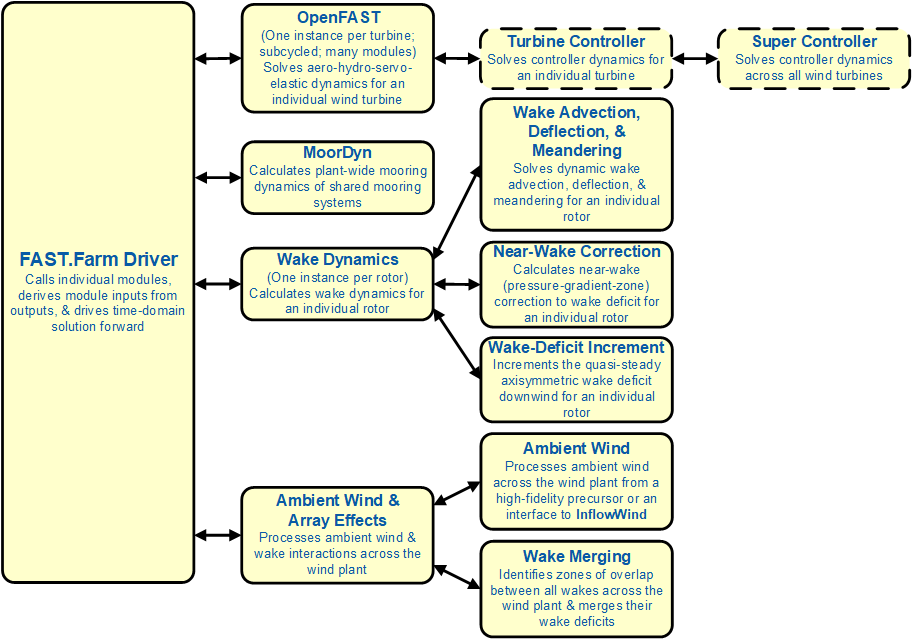

.. _FF:Intro:

Introduction
============

FAST.Farm is a midfidelity
multiphysics engineering tool for predicting the power performance and
structural loads of wind turbines within a wind farm. FAST.Farm uses
`OpenFAST <https://github.com/OpenFAST/openfast>`__ to solve the
aero-hydro-servo-elastic dynamics of each individual turbine, but
considers additional physics for wind farm-wide ambient wind in the
atmospheric boundary layer; a wind-farm super controller; and wake
deficits, advection, deflection, meandering, and merging. FAST.Farm is
based on some of the principles of the dynamic wake meandering (DWM)
model -- including passive tracer modeling of wake meandering -- but addresses
many of the limitations of previous DWM implementations. FAST.Farm
maintains low computational cost to support the often highly iterative
and probabilistic design process. Applications of FAST.Farm include
reducing wind farm underperformance and loads uncertainty, developing
wind farm controls to enhance operation, optimizing wind farm siting and
topology, and innovating the design of wind turbines for the wind-farm
environment. The existing implementation of FAST.Farm also forms a solid
foundation for further development of wind farm dynamics modeling as
wind farm physics knowledge grows from future computations and
experiments.

The main idea behind the DWM model is to capture key wake features
pertinent to accurate prediction of wind farm power performance and wind
turbine loads, including the wake-deficit evolution (important for
performance) and the wake meandering and wake-added turbulence
(important for loads). The wake-deficit evolution and wake meandering
are illustrated in :numref:`FF:WakeMeandering`.

   Axisymmetric wake deficit (left) and meandering (right) evolution.

Although fundamental laws of physics are applied, appropriate
simplifications have been made to minimize the computational expense,
and high-fidelity modeling (HFM) solutions, e.g., using the Simulator
fOr Wind Farm Applications (`SOWFA <https://nwtc.nrel.gov/SOWFA>`__),
have been used to inform and calibrate the submodels. In the DWM model,
the wake-flow processes are treated via the “splitting of scales,” in
which small turbulent eddies (less than two diameters) affect
wake-deficit evolution and large turbulent eddies (greater than two
diameters) affect wake meandering.

FAST.Farm is a nonlinear time-domain multiphysics engineering tool
composed of multiple submodels, each representing different physics
domains of the wind farm. FAST.Farm is implemented as open-source
software that follows the programming requirements of the FAST
modularization framework,
whereby the submodels are implemented as modules interconnected through
a driver code. The submodel hierarchy of FAST.Farm is illustrated in
:numref:`FF:FFarm`.

   FAST.Farm submodel hierarchy.

Wake advection, deflection, and meandering; near-wake correction; and
wake-deficit increment are submodels of the wake-dynamics (*WD*) model,
implemented in a single module. Ambient wind and wake merging are
submodels of the ambient wind and array effects (*AWAE*) model,
implemented in a single module. Combined with the super controller
(*SC*) and OpenFAST (*OF*) modules, FAST.Farm has four modules and one
driver. There are multiple instances of the *OF* and *WD* modules -- one
instance for each wind turbine/rotor.

FAST.Farm Driver
----------------

The FAST.Farm driver, also known as the “glue code,” is the code that
couples individual modules together and drives the overall time-domain
solution forward. Additionally, the FAST.Farm driver reads an input file
of simulation parameters, checks the validity of these parameters,
initializes the modules, writes results to a file, and releases memory
at the end of the simulation.

Super Controller Module
-----------------------

The *SC* module of FAST.Farm -- essentially identical to the super
controller available in `SOWFA <https://github.com/NREL/SOWFA>`__ allows
wind-farm-wide control logic to be implemented by the user, including
sending and receiving commands from the individual turbine controllers
in OpenFAST. The logic of such a super controller could be developed
through the application of the National Renewable Energy Laboratory
(NREL) code FLOw Redirection and Induction in Steady state
(`FLORIS <https://github.com/WISDEM/FLORISSE>`__).

OpenFAST Module
---------------

The *OF* module of FAST.Farm is a wrapper that enables the coupling of
`OpenFAST <https://github.com/OpenFAST/openfast>`__ to FAST.Farm.
OpenFAST models the dynamics (loads and motions) of distinct turbines in
the wind farm, capturing the environmental excitations (wind inflow and,
for offshore systems, waves, current, and ice) and coupled system
response of the full system (the rotor, drivetrain, nacelle, tower,
controller, and, for offshore systems, the substructure and
station-keeping system). OpenFAST itself is an interconnection of
various modules, each corresponding to different physical domains of the
coupled aero-hydro-servo-elastic solution. There is one instance of the
*OF* module for each wind turbine, which, in parallel mode, are
parallelized through open multiprocessing (OpenMP). At initialization,
the number of wind turbines, associated OpenFAST primary input file(s),
and turbine origin(s) in the global *X-Y-Z* inertial-frame coordinate
system are specified by the user of FAST.Farm. Turbine origins are
defined as the intersection of the undeflected tower centerline and the
ground or, for offshore systems, the mean sea level. The global
inertial-frame coordinate system is defined with *Z* directed vertically
upward (opposite gravity), *X* directed horizontally nominally downwind
(along the zero-degree wind direction), and *Y* directed horizontally
transversely. This coordinate system is not tied to specific compass
directions. Among other time-dependent inputs from FAST.Farm, OpenFAST
uses the disturbed wind (ambient plus wakes) across a high-resolution
wind domain (in both time and space) around the turbine as input. This
high-resolution domain ensures that the individual turbine loads and
responses calculated by OpenFAST are accurately driven by flow through
the wind farm, including wake and array effects.

Wake Dynamics Module
--------------------

The *WD* module of FAST.Farm calculates wake dynamics for an individual
rotor, including wake advection, deflection, and meandering; a near-wake
correction; and a wake-deficit increment. The near-wake correction
treats the near-wake (pressure-gradient zone) correction of the wake
deficit. The wake-deficit increment shifts the quasi-steady-state
axisymmetric wake deficit nominally downwind. There is one instance of
the *WD* module for each rotor. The wake-dynamics calculations involve
many user-specified parameters that may depend, e.g., on turbine
operation or atmospheric conditions and can be calibrated to better
match experimental data or by using an HFM solution as a benchmark.
Default values have been derived for each calibrated parameter based on
`SOWFA <https://github.com/NREL/SOWFA>`__ simulations, but these can be
overwritten by the user.

The wake-deficit evolution is solved in discrete time on an axisymmetric
finite-difference grid consisting of a fixed number of wake planes, each
with a fixed radial grid of nodes. The radial finite-difference grid can
be considered a plane because the wake deficit is assumed to be
axisymmetric. A wake plane can be thought of as a cross section of the
wake wherein the wake deficit is calculated.

ke-deflection correction (offset from the rotor centerline).
   :name: FF:WakeDefl
   :width: 55%
   :align: center 

   Wake deflection resulting from inflow skew, including a horizontal wake-deflection correction. The lower dashed line represents the rotor centerline, the upper dashed line represents the wind direction, and the solid blue line represents the horizontal wake-deflection correction (offset from the rotor centerline).

   Wake advection for a single turbine resulting from a step change in yaw angle.

By simple extensions to the passive tracer solution for transverse
(horizontal and vertical) wake meandering, the wake-dynamics solution in
FAST.Farm is extended to account for wake deflection, as illustrated in
:numref:`FF:WakeDefl`, and wake advection, as illustrated in
:numref:`FF:WakeAdv`, among other physical improvements such as:

#. Calculating the wake-plane velocities by spatially averaging the
   disturbed wind instead of the ambient wind (in the AWAE module)

#. Orientating the wake planes with the rotor centerline instead of the
   wind direction

#. Low-pass time filtering the local conditions at the rotor, as input
   to the wake dynamics module, to account for transients in inflow,
   turbine control, and/or turbine motion instead of considering
   time-averaged conditions.

With these extensions, the passive tracer solution enables:

#. The wake centerline to deflect based on inflow skew, because in
   skewed inflow, the wake deficit normal to the disk introduces a
   velocity component that is not parallel to the ambient flow

#. The wake to accelerate from near wake to far wake, because the wake
   deficits are stronger in the near wake and weaken downwind

#. The wake-deficit evolution to change based on conditions at the
   rotor, because low-pass time filtering conditions are used instead of
   time-averaging

#. The wake to meander axially in addition to transversely, because
   local axial winds are considered

#. The wake shape to be elliptical instead of circular in skewed flow
   when looking downwind (the wake shape remains circular when looking
   down the rotor centerline).

From item 1 above, a horizontally asymmetric correction to the wake
deflection is accounted for, i.e., a correction to the wake deflection
resulting from the wake-plane velocity, which physically results from
the combination of wake rotation and shear not modeled directly in the
*WD* module (see :numref:`FF:WakeDefl` for an illustration). This
horizontal wake deflection correction is a simple linear correction
(with a slope and offset), similar to the correction implemented in the
wake model of `FLORIS <https://github.com/WISDEM/FLORISSE>`__. Such a
correction is important for accurate modeling of nacelle-yaw-based
wake-redirection (wake-steering) wind farm control.

From item 3, low-pass time filtering is important because the wake
reacts slowly to changes in local conditions at the rotor and because
the wake evolution is treated in a quasi-steady-state fashion.

The near-wake correction submodel of the *WD* module computes the
wake-velocity deficits at the rotor disk, as an inlet boundary condition
for the wake-deficit evolution. To improve the accuracy of the far-wake
solution, the near-wake correction accounts for the drop-in wind speed
and radial expansion of the wake in the pressure-gradient zone behind
the rotor that is not otherwise accounted for in the solution for the
wake-deficit evolution.

As with most DWM implementations, the *WD* module of FAST.Farm models
the wake-deficit evolution via the thin shear-layer approximation of the
Reynolds-averaged Navier-Stokes equations under quasi-steady-state
conditions in axisymmetric coordinates, with turbulence closure captured
by using an eddy-viscosity formulation. The thin shear-layer
approximation drops the pressure term and assumes that the velocity
gradients are much bigger in the radial direction than in the axial
direction.

Ambient Wind and Array Effects Module
-------------------------------------

The *AWAE* module of FAST.Farm processes ambient wind and wake
interactions across the wind farm, including the ambient wind submodel,
which processes ambient wind across the wind farm and the wake-merging
submodel, which identifies zones of overlap between all wakes across the
wind farm and merges their wake deficits. The calculations in the *AWAE*
module make use of wake volumes, which are volumes formed by a (possibly
curved) cylinder starting at a wake plane and extending to the next
adjacent wake plane along a line connecting the centers of the two wake
planes. If the adjacent wake planes (top and bottom of the cylinder) are
not parallel, e.g., for transient simulations involving variations in
nacelle-yaw angle, the centerline will be curved.
:numref:`FF:FFarmDomains` illustrates some of the concepts.

   Wake planes, wake volumes, and zones of wake overlap for a
   two-turbine wind farm, with the upwind turbine yawed. The yellow
   points represent the low-resolution wind domain and the green points
   represent the high-resolution wind domains around each turbine. The
   blue points and arrows represent the centers and orientations of the
   wake planes, respectively, with the wake planes identified by the
   blue lines normal to their orientations. The gray dashed lines
   represent the mean trajectory of the wake and the blue curves
   represent the instantaneous [meandered] trajectories. The wake
   volumes associated with the upwind turbine are represented by the
   upward hatch patterns, the wake volumes associated with the downwind
   turbine are represented by the downward hatch patterns, and the zones
   of wake overlap are represented by the crosshatch patterns. (For
   clarity of the illustration, the instantaneous (meandered) wake
   trajectory is shown as a smooth curve, but will be modeled as
   piece-wise linear between wake planes when adjacent wake planes are
   parallel. The wake planes and volumes are illustrated with a diameter
   equal to twice the wake diameter, but the local diameter depends on
   the calculation. As illustrated, a wake plane or volume may extend
   beyond the boundaries of the low-resolution domain of ambient wind
   data.)

The calculations in the *AWAE* module also require looping through all
wind data points, turbines, and wake planes; these loops have been sped
up in the parallel mode of FAST.Farm by implementation of open
multiprocessing (OpenMP) parallelization.

Ambient wind may come from either a high-fidelity precursor simulation
or an interface to the *InflowWind* module in OpenFAST. The use of the
*InflowWind* module enables the use of simple ambient wind, e.g.,
uniform wind, discrete wind events, or synthetically generated turbulent
wind data. Synthetically generated turbulence can be generated from,
e.g., TurbSim or the Mann model, in
which the wind is propagated through the wind farm using Taylor’s
frozen-turbulence assumption. This method is most applicable to small
wind farms or a subset of wind turbines within a larger wind farm.
FAST.Farm can also use ambient wind generated by a high-fidelity
precursor large-eddy simulation (LES) of the entire wind farm (without
wind turbines present), such as the atmospheric boundary layer solver
(ABLSolver) preprocessor of `SOWFA <https://github.com/NREL/SOWFA>`__.
This atmospheric precursor simulation captures more physics than
synthetic turbulence -- as illustrated in
:numref:`FF:ABLSolver` -- including atmospheric stability,
wind-farm-wide turbulent length scales, and complex terrain effects.

   Example flow generated by ABLSolver.

This method is more computationally expensive than using the ambient
wind modeling options of InflowWind, but it is much less computationally
expensive than a SOWFA simulation with wind turbines present. FAST.Farm
requires ambient wind to be available in two different resolutions in
both space and time. Because wind will be spatially averaged across wake
planes within the *AWAE* module, FAST.Farm needs a low-resolution wind
domain throughout the wind farm wherever turbines may potentially
reside. For accurate load calculation by OpenFAST, FAST.Farm also needs
high-resolution wind domains around each wind turbine (encompassing any
turbine displacement). The high-resolution domains will occupy the same
space as portions of the low-resolution domain, requiring domain
overlap.

When using ambient wind generated by a high-fidelity precursor
simulation, the *AWAE* module reads in the three-component wind-velocity
data across the high- and low-resolution domains that were computed by
the high-fidelity solver within each time step. These values are stored
in files for use in a given driver time step. The wind data files,
including spatial discretizations, must be in Visualization Toolkit
(VTK) format and are specified by users of FAST.Farm at initialization.
`Visualization Toolkit <http://www.vtk.org/>`__ is an open-source,
freely available software system for three-dimensional (3D) computer
graphics, image processing, and visualization. When using the
*InflowWind* inflow option, the ambient wind across the high- and
low-resolution domains are computed by calling the *InflowWind* module.
In this case, the spatial discretizations are specified directly within
the FAST.Farm primary input file. These wind data from the combined low-
and high-resolution domains within a given driver time step represent
the largest memory requirement of FAST.Farm.

In previous implementations of DWM, the wind turbine and wake dynamics
were solved individually or serially, not considering two-way
wake-merging interactions. Additionally, there was no method available
to calculate the disturbed wind in zones of wake overlap. Wake merging
is illustrated by the FAST.Farm simulation of
:numref:`FF:WakeMerg`.

.. figure:: Pictures/FFarm_Merging.png
   :alt: Wake merging for closely spaced rotors.
   :name: FF:WakeMerg
   :width: 70% 
   :align: center 

   Wake merging for closely spaced rotors.

In FAST.Farm, the wake-merging submodel of the *AWAE* module identifies
zones of wake overlap between all wakes across the wind farm by finding
wake volumes that overlap in space. Wake deficits are superimposed in
the axial direction based on the root-sum-squared (RSS) method.
Transverse components (radial wake deficits) are superimposed by vector
sum. The RSS method assumes that the local kinetic energy of the axial
deficit in a merged wake equals the sum of the local energies of the
axial deficits for each wake at the given wind data point. The RSS
method only applies to an array of scalars. This method works well for
axial deficits because overlapping wakes likely have similar axial
directions; therefore, only the magnitude of the vector is important in
the superposition. A vector sum is applied to the transverse components
(radial wake deficits) because any given radial direction is dependent
on the azimuth angle in the axisymmetric coordinate system.

To visualize the ambient wind and wake interactions across the wind
farm, FAST.Farm includes visualization capability through the generation
of output files in VTK format.
`OpenFAST <https://github.com/OpenFAST/openfast>`__ can further generate
VTK-formatted output files for visualizing the wind turbine based on
either surface or stick-figure geometry. The VTK files generated by
FAST.Farm and OpenFAST can be read with standard open-source
visualization packages such as `ParaView <http://www.paraview.org/>`__
or `VisIt <https://wci.llnl.gov/simulation/computer-codes/visit/>`__.

FAST.Farm Parallelization
-------------------------

FAST.Farm can be compiled and run in serial or parallel mode.
Parallelization has been implemented in FAST.Farm through OpenMP, which
allows FAST.Farm to take advantage of multicore computers by dividing
computational tasks among the cores/threads within a node (but not
between nodes) to speed up a single simulation. The size of the wind
farm and number of wind turbines is limited only by the available
random-access memory (RAM). In parallel mode, each instance of the
OpenFAST submodel can be run in parallel on separate threads at the same
time the ambient wind within the *AWAE* module is being read in another
thread. Thus, the fastest simulations require at least one more core
than the number of wind turbines in the wind farm. Furthermore, the
output calculations within the *AWAE* module are parallelized into
separate threads. Because of the small timescales involved and
sophisticated physics, the *OF* submodel is the computationally slowest
FAST.Farm module. The output calculation of the *AWAE* module is the
only major calculation that cannot be solved in parallel to OpenFAST;
therefore, at best, the parallelized FAST.Farm solution may execute only
slightly more slowly than stand-alone OpenFAST
simulations -- computationally inexpensive enough to run the many
simulations necessary for wind turbine/farm design and analysis.

To support the modeling of large wind farms, single simulations
involving memory parallelization and parallelization between nodes of a
multinode high-performance computer (HPC) through a message-passing
interface (MPI) is likely required. MPI has not yet been implemented
within FAST.Farm.

Organization of the Guide
-------------------------

The remainder of this documentation is structured as follows:
:numref:`FF:Running` details how to obtain the FAST.Farm
software archive and how to run FAST.Farm. :numref:`FF:Input`
describes the FAST.Farm input files. :numref:`FF:Output`
discusses the output files generated by FAST.Farm.
:numref:`FF:ModGuidance` provides modeling guidance when
using FAST.Farm. The FAST.Farm theory is covered in
:numref:`FF:Theory`. :numref:`FF:FutureWork`
outlines future work, and the bibliography provides background and other
information sources. Example FAST.Farm primary input and ambient wind
data files are shown in :numref:`FF:App:Input`
and :numref:`FF:App:Wind`. A summary of available output channels
is found in :numref:`FF:App:Output`.

