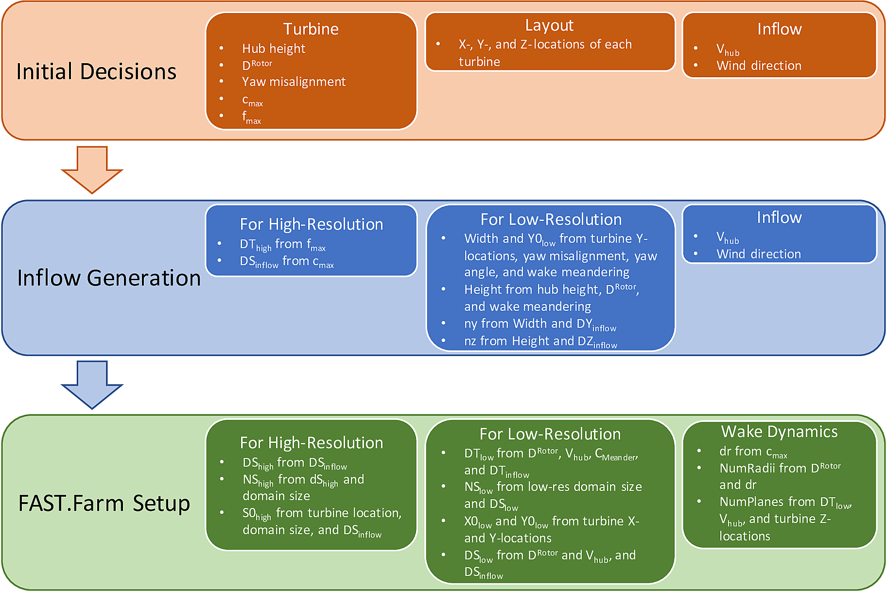
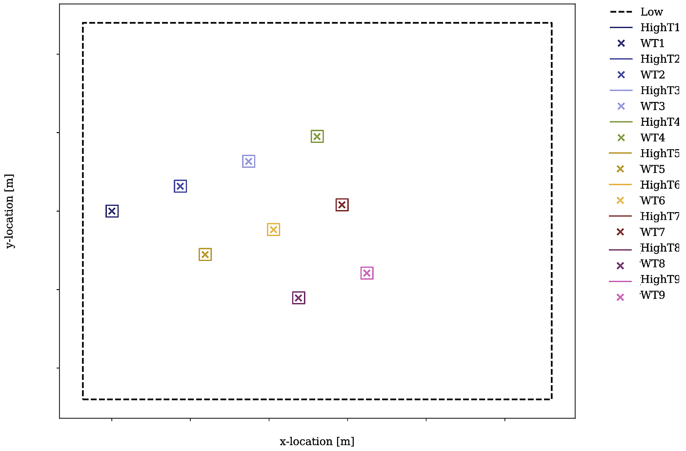

.. _FF:ModGuidance:

Modeling Guidance
=================

This chapter includes modeling guidance for setting up and running a
FAST.Farm simulation. This includes guidance on inflow wind generation;
low- and high-resolution grid discretization; parameter selection; super
controller use; and solutions for commonly encountered errors.

.. _FF:sec:setup:

FAST.Farm Setup Overview
------------------------

This section includes a high-level overview of how to set up ambient
inflow and FAST.Farm simulations in particular, the information needed
to calculate various parameters, as shown in
:numref:`FF:FFarmSetup`.

   Information flowchart for setting up inflow generation and FAST.Farm
   simulations. Here, *S* = *X*, *Y*, or *Z*.

Note that this schematic only includes information relevant to FAST.Farm
simulations. Typically, additional inflow information is required to
generate inflow and the OpenFAST models. The specific equations that
should be used to compute the input parameters are discussed in
:numref:`FF:sec:paramselect`. It is highly recommended that the
Python notebooks provided in the FAST.Farm `tools repository
<https://github.com/OpenFAST/python-toolbox/tree/main/pyFAST/fastfarm>`__ be
used when setting up new inflow or a FAST.Farm case. Improperly setting these
parameters can lead to common errors and/or excessive interpolation, which
should be avoided. Note that this chapter assumes a wind direction of
:math:`0^\circ`\ -- i.e., ambient wind that propagates along the *+X* axis of
the global inertial frame coordinate system.

When generating a FAST.Farm simulation setup and corresponding inflow, planning
is important. Improper planning could results in FAST.Farm errors and/or needing
to regenerate the inflow. Values that should be known *a priori* are:

   - wind turbine rotor diameter (:math:`D^\text{Rotor}`);
   - wind turbine hub height;
   - maximum turbine chord length (:math:`c_\text{max}`);
   - maximum turbine natural frequency (:math:`f_\text{max}`);
   - *X*, *Y*, and *Z* locations of all turbines in the wind farm;
   - desired mean inflow hub-height wind velocity; and
   - mean inflow wind direction.

The values that must be computed using this information are:

   - inflow and FAST.Farm domain size (height, width, and length); 
   - FAST.Farm high- and low-resolution domain origin locations (**S0_High** and
     **S0_Low**, where *S* = *X*, *Y*, or *Z*);
   - high- and low-resolution temporal discretization values (**DT_High** and
     **DT_Low**);
   - high- and low-resolution spatial discretization values (**DS_High** and **DS_Low**);
   - number of grid points in the high- and low-resolution domains (**NS_High** and **NS_Low**);
   - actual mean inflow hub-height wind velocity (:math:`V_\text{hub}`);
   - additional wake dynamics properties (**dr**, **NumRadii**, and
     **NumPlanes**).

With this information, inflow generation can begin. Though not required, it is
recommended to complete inflow generation before setting up the FAST.Farm
simulation.  This is because the realized spatial discretization values and/or
mean hub height velocity can differ from what is desired. Having the correct
values of these parameters leads to less interpolation of the wind data in
FAST.Farm simulations, which would otherwise reduce the ambient turbulence.

When setting up the inflow generation, the recommended spatial and
temporal discretizations should be used, as discussed in
:numref:`FF:sec:DiscRecs`. If using:

   - **Mod\_AmbWind** = 1, a high-fidelity must be generated and all
     discretization values can be specified as the exact desired value.
   - **Mod\_AmbWind** = 2, a single synthetic inflow (TurbSim or Mann) must be
     generated using the high-resolution discretization values recommended
     herein.
   - **Mod\_AmbWind** = 3, multiple synthetic inflows must be generated. In
     this case, the recommended high-resolution discretizations should be used
     for all high-resolution inflows generated. For the low-resolution inflow
     generation, the recommended high-resolution temporal discretization and
     low-resolution spatial discretization should be used.

If using synthetic inflow (TurbSim or Mann), the inflow streamwise spatial
discretization, **DX_Inflow**, is not specified by the user, but is instead
based on Taylor's frozen-turbulence assumption. Because the streamwise
discretization of the FAST.Farm domain should be based on the inflow streamwise
discretization, the user should compute this value using the inflow time step
(**DT_High**) and the advection speed of the synthetic wind data,
:math:`V_\text{Advect}`. The :math:`V_\text{Advect}` may differ from the actual
wind speed at hub height, :math:`V_\text{Hub}`, as discussed in
:numref:`FF:sec:Synthetic`, and should be computed directly from the generated
synthetic inflow.  Therefore, the exact resulting **DX_Inflow** will not be
known until after the inflow has been generated.  Additionally, **DX_Inflow**
will likely be much smaller than the desired values of **DX_Low** and
**DX_High**.

When setting up the FAST.Farm simulation itself, many of the values that were
used for inflow generation will be used again here to specify the FAST.Farm
domain. Note that this domain specification in FAST.Farm is only needed when
using synthetic turbulence inflow. The origin of the low-resolution domain
(**X0_Low**, **Y0_Low**, and **Z0_Low**) should be determined based on:

   - the minimum turbine *X*- and *Y*-locations;
   - turbine yaw misalignment;
   - inflow wind direction; and
   - the expected range of wake meandering.

Specifically, **X0_Low** must accommodate all turbine
locations as well as allow enough room to analyze the undisturbed inflow
upstream of the wind farm, if desired. **Y0_Low** must accommodate all
turbine locations as well as the horizontal wake meandering. When using
TurbSim, which cannot generate wind at ground level, **Z0_Low** should
be close to but above ground level.

The FAST.Farm domain width and height are then computed using:

   - the turbine locations;
   - the calculated **Y0_Low** and **Z0_Low** values;
   - the horizontal and vertical meandering distance requirements;
   - turbine yaw misalignment; and
   - the inflow wind direction.

The domain length should be based on the streamwise extent of the wind farm and,
if desired, allow enough room to analyze the waked outflow downstream of the
wind farm.

The low-resolution domain in FAST.Farm (**DY_Low** and **DZ_Low**) and number of
grid points (**NY_Low** and **NZ_Low**) can then be computed using:

    - the domain width and height;
    - the lateral and vertical spacing of the generated inflow; and
    - DY_Inflow and DZ_Inflow.

The low-resolution temporal discretization (**DT_Low**)
should be computed using:

    - the turbine diameter;
    - inflow hub-height velocity; and
    - the inflow temporal discretization.

The streamwise spacing and number of grid points (**DX_Low** and **NX_Low**)
should also be based on **DT_Low** and the mean wind speed.

The final domain parameters to calculate are the
locations of the high-resolution domains (**X0_High**, **Y0_High**, and
**Z0_High**) and the number of grid points required to make up the
domains (**NX_High**, **NY_High**, and **NZ_High**). These quantities
should be determined from:

   - **DS_High** values;
   - turbine locations; and
   - the size of the high-resolution domains.

The **DS_High** values should be selected based on recommended high-resolution
domain discretization criteria, discussed in :numref:`FF:sec:DiscRecs`.

Additional wake dynamics quantities are needed when specifying the FAST.Farm
input file, as discussed further in :numref:`FF:wake-dynamics-parameters`.
It is recommended to base **dr** on :math:`c_\text{max}`;
**NumRadii** on wake diameter and **dr**; and **NumPlanes** on **DT_Low**,
inflow hub-height velocity, and the distance between turbine locations.

A sample turbine layout and domain locations are shown in
:numref:`FF:FFarmLayout`.

   Schematic of example 9-turbine wind farm layout, including low- and
   high-resolution domains and turbine locations.

Inflow Wind Generation
----------------------

This section includes guidelines by which turbulent inflow should be
generated for use with FAST.Farm.

High-Fidelity Precursor Ambient Inflow
~~~~~~~~~~~~~~~~~~~~~~~~~~~~~~~~~~~~~~

There are many different methods by which high-fidelity precursor
ambient inflow can be generated. This section focuses on generating such
inflow using
`SOWFA <https://github.com/NREL/SOWFA-6/blob/ee5b13875ea8f1088f4ca79ba41ff8be34870761/SOWFA_Training.NAWEA.2017_web.pdf>`__.

When using SOWFA to generate FAST.Farm precursor inflow, the *ABLSolver*
preprocessor is used. It is important to note the baseline high-fidelity
solution is not directly used as inflow for FAST.Farm, but is instead
sampled within a specified domain and discretization. This sampling is
done through SOWFA and specified in a SOWFA input file. The inflow data
are written out in 3D volume VTK-formatted files, as described in
:numref:`FF:AmbWindVTK`. These are large ASCII-formatted
files; as such, decreasing the precision to, e.g., 3 digits is
recommended. The domain size and low-resolution domain discretization
used for SOWFA simulations is much larger than what is required for
FAST.Farm simulations. Therefore, sampling files must be set up to
generate boundary conditions for use with FAST.Farm, based on FAST.Farm
discretization suggestions detailed in :numref:`FF:sec:DiscRecs`.
Two sampling files are needed: one for the low-resolution sampling for
the farm-scale domain and one for the high-resolution sampling for the
turbine-scale domains. Each sampling file defines the spatial and
temporal discretization that will be used in the FAST.Farm simulations.
The low-resolution domain file defines a single low-resolution domain
that will be used for the FAST.Farm simulations; the high-resolution
domain file defines each high-resolution domain that will be used for
the FAST.Farm simulations. Thus, it is important to know exactly where
all turbines will be located in the FAST.Farm simulation before
generating the inflow. Note that this FAST.Farm sampling step can be
computationally expensive. Therefore, it is recommended that users make
sure all inputs are correct before executing SOWFA, including turbine
locations and discretization levels.

An example Python notebook is provided in the FAST.Farm `tools repository
<https://github.com/OpenFAST/python-toolbox/tree/main/pyFAST/fastfarm>`__ to
assist in setting up these files for a given FAST.Farm simulation.

Complex Terrain
~~~~~~~~~~~~~~~

Complex terrain, or a time-varying sea-surface elevation for offshore
systems, can be modeled in FAST.Farm by providing ambient inflow data
that are terrain following, e.g., by modeling the surface boundary
condition in an LES precursor. The VTK format used by FAST.Farm is
spatially uniform. To accommodate complex terrain or waves with a
uniform grid, the wind speed for points below the terrain surface should
be set to NaN. Any NaN value will be trapped by FAST.Farm and marked as
outside of the domain, and so, unused by calculations within the AWAE
module. When the ambient wind inflow is terrain following, the wakes
will naturally follow the terrain as well, even though FAST.Farm does
not include any explicit models for complex terrain, flow recirculation
or separation, or local pressure gradients.

If using a SOWFA inflow precursor, the complex terrain is accounted for
in the SOWFA inflow precursor generation, and so, no modification to the
*vtk* files is required to account for complex terrain when sampling for
a FAST.Farm simulation.

.. _FF:sec:Synthetic:

Synthetic Turbulence Ambient Inflow
~~~~~~~~~~~~~~~~~~~~~~~~~~~~~~~~~~~

Synthetically generated turbulent inflow can be used in FAST.Farm to
accurately predict turbine response and wake dynamics across different
atmospheric conditions. There are several ways to achieve this; any
method can be used as long as it produces an output file in a format
supported by *InflowWind*. Modeling guidance for TurbSim and the Mann
model are discussed next.

TurbSim
^^^^^^^

When using the NREL tool `TurbSim
v2 <https://github.com/OpenFAST/openfast/tree/master/modules/turbsim>`__,
different options are available to drive the synthetic turbulence
towards specific desired outcomes, e.g.;

#. standard or user-defined time-averaged wind profile (shear, veer);

#. standard or user-defined velocity spectra in three directions (along
   the wind, u, and transverse, v and w);

#. standard or user-defined spatial point-to-point coherence; and

#. standard or user-defined component-to-component correlations
   (Reynolds stresses).

Additionally, TurbSim v2 allows the user to generate turbulent wind that
is consistent with user-defined three-component wind time series at one
or more points (i.e., constrained wind). These options can be used
separately or in some combination (though user-defined spectra and
user-defined time series can not be used together). When defined
appropriately, all these methods can result in good statistical
comparison of turbine response and wake dynamics between FAST.Farm
results and a reference data set, e.g., compared with an LES precursor
or physically measured inflow. However, attention must be paid when
generating these inflows to ensure atmospheric conditions are modeled
properly.

In particular, TurbSim generates wind velocities transversely throughout
the domain using u-, v-, and w-spatial-coherence models based on a
selection of coherence model equations and their associated parameters.
These models and parameters can either be specified explicitly or left
as *default* values in TurbSim. When the IEC spatial-coherence model is
selected, spatial coherence is computed using
Eq. :eq:`eq:IECCoh` (:cite:`ff-TurbSim_1`).

.. math::
   Coh_{i,j_K}(f)=exp\left(-a_K\sqrt{\left(\frac{fr}{V_\text{Advect}}\right)^2+(rb_K)^2}~\right)
   :label: eq:IECCoh

where :math:`V_\text{Advect}` is the average wind speed at the hub height
specified in TurbSim, which is also the advection speed in *InflowWind*;
:math:`Coh_{i,j_K}` is the spatial coherence between points :math:`i`
and :math:`j` for the velocity components :math:`K=u,v,w`; :math:`r` is
the distance between points :math:`i` and :math:`j`; :math:`a_K` is the
coherence decrement parameter; and :math:`b_K` is the coherence offset
parameter. It was discovered in :cite:`ff-Shaler19_1` that the
use of the IEC coherence model with default coherence parameters
together with the IEC Kaimal spectra results in negligible wake
meandering. This is because the default v- and w-coherence parameters in
TurbSim are set such that :math:`a_K` are very large numbers and
:math:`b_K=0`, effectively resulting in no coherence
(:math:`Coh_{i,j_K}(f)=0`) (:cite:`ff-TurbSim_1`).  [1]_ This
lack of meandering is nonphysical and will have a nonphysical impact on
the response of downstream turbines. Instead of using the default
values, the v- and w-coherence parameters were specified
in :cite:`ff-Shaler19_1` to identically equal the u-coherence
parameters specified in the IEC standard, such that:
:math:`SCMod2=SCMod3=IEC`; :math:`a_K=12.0` and :math:`b_K=0.00035273`
m\ :math:`^{-1}`; and
:math:`CohExp=0.0`. (:cite:`ff-TurbSim_1`). Properly setting
spatial coherence parameters for the transverse wind velocity components
is necessary to accurately predict wake meandering. It is also important
to note that, in TurbSim, the :math:`a_K` and :math:`b_K` values must be
specified within quotation marks (e.g., ``"12.0 0.00035273"``) or, at
present, the values are set to :math:`0`.

When using TurbSim to generate the full-field turbulent wind data for
FAST.Farm, one often wants the TurbSim grid to extend well above the hub
height to capture vertical wake meandering due to the :math:`w`
component of turbulence. Because TurbSim requires that
**HubHt**\ :math:`> 0.5*`\ **GridHeight**, it is often necessary to
specify an artificially high **HubHt** in TurbSim. To properly set the
**HubHt** parameter, the following equation is suggested:

.. math::
   \textbf{HubHt} = z_\text{bot}+\textbf{GridHeight}-0.5D_\text{grid}

where :math:`z_\text{bot}` is the desired bottom vertical location of
the grid (just above ground level) and
:math:`D_\text{grid}=MIN\left( \textbf{GridWidth}, \textbf{GridHeight}\right)`.
Note that the **HubHt** parameter is used by TurbSim as the reference
height for the wind speed used (:math:`V_\text{Advect}`) to define the
wind-speed standard deviations and spatial coherence in the IEC turbulence
models, as well as the advection speed (in *InflowWind*) for all models. Thus,
the resulting wind-speed standard deviations and spatial coherence in the IEC
turbulence models will not be what is expected without explicit consideration of
the difference in wind speeds between the **HubHt** used by TurbSim and the
actual turbine hub height. The advection speed (in *InflowWind*) will likely
also be faster than it would be when the actual hub height speed is used. A
separate reference height (**RefHt**) is specified in TurbSim, which is the
height at which, e.g., the reference wind speed is enforced. This value is also
used to properly set the power law velocity profile. Future work is needed to
`decouple the HubHt parameter from the TurbSim grid generation
<https://github.com/OpenFAST/openfast/issues/199>`__.

It is generally recommended that the full-field wind data files be
generated periodically. This effectively extends the wind domain forever
along the wind propagation direction.

When using ambient wind through multiple instances of the *InflowWind*
module, i.e, when **Mod_AmbWind** = 3, only one *InflowWind* input file
is specified. However, multiple wind data files are used, each with a
different name. Specifically, the file name in the *InflowWind* input
file in this case refers only to the directory path of the wind files.
The wind file root names are required to be *Low* for the low-resolution
domain and *HighT<n\ :math:`_\text{t}`>* for the high-resolution domain
associated with turbine :math:`n_\text{t}`.  [2]_ When steady inflow in
*InflowWind* is used (**WindType** = 1), setting **Mod_AmbWind** to 2 or
3 produces identical results. When using full-field turbulent wind data
in *InflowWind* with **Mod_AmbWind** = 3, it is required that:

-  The full-field wind data files be generated periodically. This
   effectively extends the wind domain forever along the wind
   propagation direction.

-  The input parameter **PropagationDir** in the *InflowWind* input file
   be set to :math:`0` degrees so that the wind propagates along the *X*
   axis of the FAST.Farm inertial-frame coordinate system.

-  The wind data files associated with the high-resolution ambient wind
   be spatially and temporally synchronized with the low-resolution wind
   data file. The spatial synchronization must be based on the global
   *X-Y-Z* offsets of each turbine origin relative to the origin of the
   inertial frame coordinate system. For each wind turbine, the velocity
   time series at the turbine location should be extracted from the
   low-resolution TurbSim domain. To account for turbine downstream
   distance, each time series should then be offset in time based on the
   freestream velocity and turbine location. This time series should
   then be used to generate the high-resolution TurbSim inflow for each
   turbine. The TurbSim user’s manual contains details on how to
   generate a TurbSim inflow using a specified time
   series :cite:`ff-TurbSim_1`.

Mann Model
^^^^^^^^^^

When generating stochastic turbulence with the Mann model, :math:`11`
user-defined inputs are required: **prefix**, **alpha_epsilon**, **L**,
**gamma**, **seed**, **nx**, **ny**, **nz**, **dx**, **dy**, and **dz**.
The parameters that should be selected in conjunction with FAST.Farm
parameters are discussed here.

**dx**, **dy**, and **dz** -- These parameters should be selected based on
the high-resolution spatial discretization recommendations discussed
below in :numref:`FF:sec:DiscRecs`.

**nx** -- This value is required to be a power of :math:`2`. To ensure no
repetition of the turbulence box for the duration of the simulation, the
following equation is recommended:

.. only:: html

   .. math::
      \textbf{nx} = 2^{CEILING\big[log_2
         \left(\frac{V_\text{Advect}\textbf{T_Max}}
            {\textbf{dx}}\right)\big]}

.. only:: not html

   .. math::
      \textbf{nx} = 2^{CEILING\big[log_2
         \left(\frac{V_\text{Advect}\textbf{T\_Max}}
            {\textbf{dx}}\right)\big]}

where :math:`V_\text{Advect}` is the advection speed of the Mann box and
:math:`CEILING\big[x\big]` rounds :math:`x` to the next highest integer. This
equation ensures that the turbulence box will not repeat during the simulation
and also that the power of two criteria is satisfied.

**ny** and **nz** -- These values are also required to be powers of
:math:`2`. With this requirement in mind, these values should be
selected to ensure the entire desired domain width (*Y*) and height
(*Z*) are captured, as discussed below in
:numref:`FF:sec:lowres`.

The *InflowWind* input file has a specific section for using a Mann turbulence
box. This section requires the input of **nx**, **ny**, **nz**, **dx**, **dy**,
**dz**, **RefHt**, and **URef**. These values should be specified exactly as
those used to generate the inflow. Note that **dx**, **dy**, and **dz**
specified in *InflowWind* should be the same as **dX_High**, **dY_High**, and
**dZ_High** in FAST.Farm, respectively.  **RefHt** should be defined as follows:

.. math::
   \textbf{RefHt} = 0.5\textbf{dz}(\textbf{nz} - 1)+z_\text{bot}

where **URef** is the mean wind speed at the reference height, and dictates the
advection speed of the Mann box, identified here as :math:`V_\text{Advect}`.

When using a Mann box, it is important to know that **the x-axis
direction is opposite the convention used by InflowWind. Although the
interpretation in InflowWind (including OpenFAST and FAST.Farm) is
consistent with how Mann boxes are used in other aeroelastic software,
the interpretation is nonphysical**. If desired, the user can adjust the
FAST.Farm source code to read the x-axis in reverse. Correcting this
error universally across all aeroelastic software that use Mann boxes is
needed `future
work <https://github.com/OpenFAST/openfast/issues/256>`__.

.. _FF:sec:DiscRecs:

Low- and High-Resolution Domain Discretization
----------------------------------------------

Spatial and temporal discretization can affect wake meandering, turbine
structural response, and resulting wake and load calculations. This
section summarizes recommendations for discretization values in terms of
geometry and wind speed that will ensure a converged solution, while
maximizing computational efficiency. For details on how these
recommendations were formed, see :cite:`ff-Shaler19_2`. Though
developed for FAST.Farm use, these guidelines are likely applicable to
any DWM-type model or aeroelastic analysis.

Low-Resolution Domain
~~~~~~~~~~~~~~~~~~~~~

The low-resolution domain in FAST.Farm is primarily responsible for wake
meandering and merging. As such, convergence was assessed by comparing
trends in standard deviation of horizontal and vertical meandering wake
center positions for the wakes behind each turbine at various distances
downstream. It was found that the mean horizontal and vertical wake
trajectories have negligible dependence of **DT_Low** or **DS_Low**. The
following equation can be used to ensure convergence of wake meandering
in the low-resolution domain:

.. only:: html

   .. math::
      \textbf{DT_Low} \le
         \frac{C_\text{Meander}D^\text{Wake}}{10V_\text{Hub}}

.. only:: not html

   .. math::
      \textbf{DT\_Low} \le
         \frac{C_\text{Meander}D^\text{Wake}}{10V_\text{Hub}}

This equation is based on the low-pass cutoff frequency for wake
meandering
:math:`\left(\frac{V_\text{Hub}}{C_\text{Meander}D^\text{Wake}}\right)`
from :cite:`ff-Larsen08_1` (in which
:math:`C_\text{Meander}=2`, but :math:`C_\text{Meander}` defaults to
:math:`1.9` in FAST.Farm) and effectively specifies that the highest
frequency of wake meandering should be resolved by at least :math:`10`
time steps. Note that :math:`D^\text{Wake}` can be approximated as
:math:`D^\text{Rotor}` in this calculation.

Spatial discretization convergence was assessed in the same manner as
temporal discretization. Minimal sensitivity to spatial discretization
was found for the low-resolution domain in the range of spatial
discretizations considered. Nonetheless, the following equation is
recommended for identifying the maximum suggested **DS_Low**, where
:math:`S` refers to :math:`X`, :math:`Y`, or :math:`Z` and the
denominator has the units [m/s]:

.. only:: html

   .. math::
      \textbf{DS_Low} \le
         \frac{C_\text{Meander}D^\text{Wake}V_\text{Hub}}{150 m/s}
         = \frac{\textbf{DT_Low}V_\text{Hub}^2}{15 m/s}

.. only:: not html

   .. math::
      \textbf{DS\_Low} \le
         \frac{C_\text{Meander}D^\text{Wake}V_\text{Hub}}{150 m/s}
         = \frac{\textbf{DT\_Low}V_\text{Hub}^2}{15 m/s}

For all synthetic turbulence methods, it is recommended that
**DX_Low**\ :math:`= V_\text{Advect}`\ **DT_Low** to avoid interpolating in
X-direction. Note the use of the advection speed, :math:`V_\text{Advect}`, to
calculate **DX_Low**, rather than the actual hub-height wind speed,
:math:`V_\text{Hub}`. Additionally, **X0_Low** should be an integer multiple of
**DX_Low**.

High-Resolution Domain
~~~~~~~~~~~~~~~~~~~~~~

The high-resolution wind domain in FAST.Farm is primarily responsible
for ambient and waked inflow local to a turbine. As such, convergence
was assessed by comparing trends in mean and standard deviation of
turbine structural motions and loads for each turbine.

.. only:: html

   Required discretization levels vary depending on the quantity of
   interest. Thus, it is important to decide what structural components
   will be considered when selecting a high-resolution discretization
   level. Most notably, tower-base moments are the most sensitive to
   **DT_High**, whereas generator power and blade deflections and moments
   show little dependence on this value. To capture the full structural
   response, **DT_High** should be selected based on the highest
   frequencies influencing the structural excitation, including rotational
   sampling of turbulence and response, i.e., natural frequencies, of the
   pertinent structural components, :math:`f_\text{max}` (in Hz), as in
   Equation :eq:`eq:dtHigh:a`, where the factor of :math:`2` is taken
   from the Nyquist sampling theorem. This is a frequently used rule of
   thumb in wind turbine aeroelastic analysis under excitation from
   turbulent inflow.

   .. math::
      \textbf{DT_High} \le \frac{1}{2f_\text{max}}
      :label: eq:dtHigh:a

   The required **DS_High** approximately corresponds to the maximum blade
   chord length of the turbine, :math:`c_\text{max}`, as in
   Equation :eq:`eq:dsHigh:a`. Selecting a **DS_High** equivalent to
   this value has long been a rule-of-thumb in wind turbine aeroelastic
   analysis under excitation from turbulent inflow.

   .. math::
      \textbf{DS_High} \le c_\text{max}
      :label: eq:dsHigh:a

.. only:: not html

   Required discretization levels vary depending on the quantity of
   interest. Thus, it is important to decide what structural components
   will be considered when selecting a high-resolution discretization
   level. Most notably, tower-base moments are the most sensitive to
   **DT_High**, whereas generator power and blade deflections and moments
   show little dependence on this value. To capture the full structural
   response, **DT_High** should be selected based on the highest
   frequencies influencing the structural excitation, including rotational
   sampling of turbulence and response, i.e., natural frequencies, of the
   pertinent structural components, :math:`f_\text{max}` (in Hz), as in
   Equation :eq:`eq:dtHigh:b`, where the factor of :math:`2` is taken
   from the Nyquist sampling theorem. This is a frequently used rule of
   thumb in wind turbine aeroelastic analysis under excitation from
   turbulent inflow.

   .. math::
      \textbf{DT\_High} \le \frac{1}{2f_\text{max}}
      :label: eq:dtHigh:b

   The required **DS_High** approximately corresponds to the maximum blade
   chord length of the turbine, :math:`c_\text{max}`, as in
   Equation :eq:`eq:dsHigh:b`. Selecting a **DS_High** equivalent to
   this value has long been a rule-of-thumb in wind turbine aeroelastic
   analysis under excitation from turbulent inflow.

   .. math::
      \textbf{DS\_High} \le c_\text{max}
      :label: eq:dsHigh:b

.. _FF:sec:paramselect:

Parameter Selection
-------------------

Setting up a FAST.Farm simulation can involve specifying a large number
of parameters, especially if the *InflowWind* module is used for the
ambient wind. This section summarizes best practices for selecting some
of these parameters. References are made to desired versus realized
values. The discrepancies between these values are discussed in
:numref:`FF:sec:setup`.

InflowWind Domain Parameters
~~~~~~~~~~~~~~~~~~~~~~~~~~~~

Care must be taken when setting up a FAST.Farm simulation using the *InflowWind*
ambient wind inflow option. It is highly recommended that the distributed
`Python notebooks
<https://github.com/OpenFAST/python-toolbox/tree/main/pyFAST/fastfarm>`__ be
used when setting up a new case. Improperly setting these parameters can lead to
common errors and/or excessive interpolation, which should be avoided.  The
methods and rules of thumb that are used in those Python notebooks are also
discussed here.

.. _FF:sec:lowres:

Low-Resolution Domain
^^^^^^^^^^^^^^^^^^^^^

**NX_Low**, **NY_Low**, **NZ_Low** -- These quantities should be based on
**DS_Low** and the desired domain size (*Sdist_Low*), where *S*\ =\ *X*,
*Y* or *Z*. This integer quantity should be computed as:

.. only:: html

   .. math::
      \textbf{NS_Low} = CEILING\left(
         \frac{{Sdist\_Low}}{\textbf{DS_Low}}\right)+1

.. only:: not html

   .. math::
      \textbf{NS\_Low} = CEILING\left(
         \frac{{Sdist\_Low}}{\textbf{DS\_Low}}\right)+1

**X0_Low** -- This quantity must be less than the *X* location of the
furthest upstream turbine. It is recommended to set this value further
upstream to allow for analysis of the ambient inflow. If using a Mann
box, this value should be 0.

**Y0_Low** -- This quantity must be less than the lowest *Y* location of
any turbine (**WT_Y_**). Additional clearance is required to
accommodate wake meandering, wake deflection, and spatial averaging used
in the *AWAE* module. This value may be computed as:

.. only:: html

   .. math::
      \textbf{Y0_Low} \le \textbf{WT_Y_min}-3D^\text{Rotor}

.. only:: not html

   .. math::
      \textbf{Y0\_Low} \le \textbf{WT\_Y\_min}-3D^\text{Rotor}

Additional clearance should be allowed for appreciable wake meandering
and/or yaw. For **Mod_AmbWind** = 2, the synthetic inflow data are
centered around Y=0. Because of this, **Y0_Low** should equal
-*Ydist_Low*/2. This is the same for the low-resolution domain with
**Mod_AmbWind** = 3.

**Z0_Low** -- It is recommended that this value be set close to but above
ground level. When using TurbSim, this value can not be at or below
ground level because TurbSim cannot generate wind at these locations.

**DX_Low**, **DY_Low**, **DZ_Low** -- Desired spatial values are not
discussed here, as they are covered in detail in
:numref:`FF:sec:DiscRecs`. However, the actual quantities used
might differ from the desired values when using synthetic inflow, as
discussed in :numref:`FF:sec:Synthetic`. To determine the actual
quantity, the following equation is suggested when using synthetic
inflow:

.. only:: html

   .. math::
      \textbf{DS_Low} = FLOOR\left( \frac{{DS\_Low\_Desired}}
         {\textbf{DS_High}} \right)*\textbf{DS_High}

.. only:: not html

   .. math::
      \textbf{DS\_Low} = FLOOR\left( \frac{{DS\_Low\_Desired}}
         {\textbf{DS\_High}} \right)*\textbf{DS\_High}

Use of this equation is the best way to ensure that **DS_Low** will be a
multiple integer of **DS_High**, reducing interpolation smoothing.

.. _FF:high-resolution-domain-1:

High-Resolution Domain
^^^^^^^^^^^^^^^^^^^^^^

*Xdist_High*, *Ydist_High*, *Zdist_High* -- Though not direct inputs, these
lengths, widths, and heights of the high-resolution domains should be
selected based on the size and location of the turbines. The following
values are recommended:

.. only:: html

   .. math::
      \textbf{Xdist_High} = \textbf{Ydist_High}
         = \textbf{Zdist_High} \ge 1.1 D^\text{Rotor}

.. only:: nohtml

   .. math::
      \textbf{Xdist\_High} = \textbf{Ydist\_High}
         = \textbf{Zdist\_High} \ge 1.1 D^\text{Rotor}

If tower aerodynamic loads are desired, the high-resolution domain
should span the entire tower and rotor:

.. only:: html

   .. math::
      \textbf{Zdist_High} = \textbf{HubHt}
         + \frac{1.1\ D^\text{Rotor}}{2}

.. only:: not html

   .. math::
      \textbf{Zdist\_High} = \textbf{HubHt}
         + \frac{1.1\ D^\text{Rotor}}{2}

These parameters might need to be increased to account for large
structural motion, such as for floating offshore wind applications.

**NX_High**, **NY_High**, **NZ_High** -- These quantities should be based
on **DS_High** and the desired domain size (*Sdist_High*), where
*S*\ =\ *X*, *Y*, or *Z*. This integer quantity should be computed as:

.. only:: html

   .. math::
      \textbf{NS_High} = \text{CEILING}\left(
         \frac{{Sdist\_High}}{\textbf{DS_High}}\right)+1

.. only:: nohtml

   .. math::
      \textbf{NS\_High} = \text{CEILING}\left(
         \frac{\textbf{Sdist\_High}}{\textbf{DS\_High}}\right)+1

**X0_High**, **Y0_High**, **Z0_High** -- These quantities are set for each
turbine. They should be based on turbine location and set so that the
turbine is contained inside the high-resolution domain. It is
recommended that **X0_High** and **Y0_High** are set approximately
:math:`1.1D^\text{Rotor}/2` lower than the turbine location. For the
high-resolution domains with **Mod_AmbWind** = 3, the synthetic inflow
data are centered around each turbine, based on **WT_X/Y/Z**.

**DX_High**, **DY_High**, **DZ_High** -- Desired spatial values are not
discussed here, as they are covered in detail in
:numref:`FF:sec:DiscRecs`.

.. _FF:wake-dynamics-parameters:

Wake Dynamics Parameters
~~~~~~~~~~~~~~~~~~~~~~~~

Wake dynamics parameters define the axisymmetric finite-difference grid
used for each wake plane. These planes are defined by the following
parameters:

-  **dr** -- This value should be set so that FAST.Farm sufficiently
   resolves the wake deficit within each plane. The following value is
   suggested:

   .. math::
      \textbf{dr} \le c_\text{max}

-  **NumRadii** -- To ensure the wake deficits are accurately computed by
   FAST.Farm, **NumRadii** should be set so that the diameter of each
   wake plane, 2(**NumRadii**\ -1)\ **dr**, is large relative to the rotor
   diameter. The following value is suggested:

   .. math::
      \textbf{NumRadii} \ge \frac{3D^{Rotor}}{2\ \textbf{dr}}+1

-  **NumPlanes** -- To ensure the wake deficits are accurately captured by
   FAST.Farm, **NumPlanes** should be set so that the wake planes
   propagate a sufficient distance downstream, preferably until the wake
   deficit decays away (:math:`x_\text{dist}`), with typical values
   between :math:`10-20\times D^{Rotor}`. The following value is
   suggested:

   .. only:: html

      .. math::
         \textbf{NumPlanes} \ge \frac{x_\text{dist}}
            {\textbf{DT_Low}\overline{V}}

   .. only:: not html

      .. math::
         \textbf{NumPlanes} \ge \frac{x_\text{dist}}
            {\textbf{DT\_Low}\overline{V}}

   where :math:`\overline{V}` is the average convection speed of the
   wake, which can be approximated as

   .. math::
      \overline{V} = V_\text{Hub}\left( 1-\frac{\overline{a}}{2}\right)

   where :math:`\overline{a}` is the time- and spatial-temporal-average
   of the axial induction at the rotor disk. :math:`\overline{a}` is
   expected to be around :math:`1/3` below rated wind speed (for optimal
   aerodynamic efficiency) and decreases above rated wind speed to near
   zero before the cut-out wind speed.

.. only:: html

   Note that because new wake planes are added each time step as the
   simulation begins, increasing **NumPlanes** will also increase the
   initial transient time of the simulation. The start-up transient time is
   estimated by Equation :eq:`eq:startup:a`.

   .. math::
      t_\text{startup}=\textbf{DT_Low}(\textbf{NumPlanes}-2)
      :label: eq:startup:a

.. only:: not html

   Note that because new wake planes are added each time step as the
   simulation begins, increasing **NumPlanes** will also increase the
   initial transient time of the simulation. The start-up transient time is
   estimated by Equation :eq:`eq:startup:b`.

   .. math::
      t_\text{startup}=\textbf{DT\_Low}(\textbf{NumPlanes}-2)
      :label: eq:startup:b

-  **Mod_WakeDiam** -- A value of **1** is recommended. For further details
   on the options for this parameter, see Equation :eq:`eq:DWake`.

-  **Mod_Meander** -- A value of **3** is recommended. For further details
   on the options for this parameter, see Equation :eq:`eq:wn`.

The remaining :math:`20` inputs are user-specified calibration
parameters and options that influence the wake-dynamics calculations.
The parameters may depend, e.g., on turbine operation or atmospheric
conditions that can be calibrated to better match experimental data or
by using an HFM benchmark. Default values have been derived for each
calibrated parameter based on `SOWFA <https://nwtc.nrel.gov/SOWFA>`__
simulations for the NREL 5MW turbine
( :cite:`ff-Doubrawa18_1`), but these can be overwritten by the
user.

.. _FF:sec:SupCon:

Super Controller
----------------

When **UseSC** is set to TRUE, the super controller is enabled. The
super controller code must be compiled as a dynamic library file -- a
*.dll* file in Windows or a *.so* file in Linux or Mac OS. This super
controller dynamic library is essentially identical to the super
controller available in `SOWFA <https://nwtc.nrel.gov/SOWFA>`__. The
super controller is used in conjunction with individual wind turbine
controllers defined in the style of the DISCON dynamic library of the
DNV GL’s Bladed wind turbine software package, with minor modification.

The inputs to the super controller are commands or measurements from
individual turbine controllers. [3]_ The outputs of super controller
module are the global controller commands and individual turbine
controller commands.

The super controller dynamic library must be compiled with five
procedures, whose arguments are outlined in :numref:`FF:tab:SC_DLL`.

.. table:: Arguments for Each Procedure of the Super Controller Dynamic Library
   :name: FF:tab:SC_DLL

   +---------------------+---------------------------------------------------+---------------------------------------------------+-------------------------------------------------------------+
   | **Procedure**       | **Inputs**                                        | **Outputs**                                       | **Comments**                                                |
   +=====================+===================================================+===================================================+=============================================================+
   | ``sc_init``         | - ``nTurbines``                                   | - ``nInpGlobal``                                  | -  Set numbers of inputs, outputs, states, and  parameters  |
   |                     |                                                   | - ``NumCtrl2SC``                                  | - ``nInpGlobal`` must currently be set to zero in FAST.Farm |
   |                     |                                                   | - ``NumParamGlobal``                              |                                                             |
   |                     |                                                   | - ``NumParamTurbine``                             |                                                             |
   |                     |                                                   | - ``NumStatesGlobal``                             |                                                             |
   |                     |                                                   | - ``NumStatesTurbine``                            |                                                             |
   |                     |                                                   | - ``NumSC2CtrlGlob``                              |                                                             |
   |                     |                                                   | - ``NumSC2Ctrl``                                  |                                                             |
   |                     |                                                   | - ``errStat``                                     |                                                             |
   |                     |                                                   | - ``errMsg``                                      |                                                             |
   +---------------------+---------------------------------------------------+---------------------------------------------------+-------------------------------------------------------------+
   | ``sc_getinitData``  | - ``nTurbines``                                   | - ``ParamGlobal(1:NumParamGlobal)``               | - Set parameters                                            |
   |                     | - ``NumParamGlobal``                              | - ``ParamTurbine(1:NumParamTurbine*nTurbines)``   | - Initialize states at time zero                            |
   |                     | - ``Num ParamTurbine``                            | - ``from_SCglob(1:NumSC2CtrlGlob)``               | - Initial outputs are not currently used by FAST.Farm       |
   |                     | - ``NumSC2CtrlGlob``                              | - ``from_SC(1:NumSC2Ctrl*nTurbines)``             |                                                             |
   |                     | - ``NumSC2Ctrl``                                  | - ``from_SCglob(1:NumSC2CtrlGlob)``               |                                                             |
   |                     | - ``NumStatesGlobal``                             | - ``from_SC(1:NumSC2Ctrl*nTurbines)``             |                                                             |
   |                     | - ``NumStatesTurbine``                            | - ``StatesGlob(1:NumStatesGlobal)``               |                                                             |
   |                     |                                                   | - ``StatesTurbine(1:NumStatesTurbine*nTurbines)`` |                                                             |
   |                     |                                                   | - ``errStat``                                     |                                                             |
   |                     |                                                   | - ``errMsg``                                      |                                                             |
   +---------------------+---------------------------------------------------+---------------------------------------------------+-------------------------------------------------------------+
   | ``sc_calcOutputs``  | - ``nTurbines``                                   | - ``from_SCglob(1:NumSC2CtrlGlob)``               | -  Calculate outputs at the current time step               |
   |                     | - ``NumParamGlobal``                              | - ``from_SC(1:NumSC2Ctrl*nTurbines)``             | - ``nInpGlobal`` is currently zero in FAST.Farm             |
   |                     | - ``ParamGlobal(1:NumParamGlobal)``               | -  ``errStat``                                    | - ``to_SCglob`` is currently null in FAST.Farm              |
   |                     | - ``NumParamTurbine``                             | -  ``errMsg``                                     |                                                             |
   |                     | - ``ParamTurbine(1:NumParamTurbine*nTurbines)``   |                                                   |                                                             |                                      
   |                     | - ``nInpGlobal``                                  |                                                   |                                                             |
   |                     | - ``to_SCglob(1:nInpGlobal)``                     |                                                   |                                                             |
   |                     | - ``NumCtrl2SC``                                  |                                                   |                                                             |
   |                     | - ``to_ SC(1:NumCtrl2SC*nTurbines)``              |                                                   |                                                             |
   |                     | - ``NumStatesGlobal``                             |                                                   |                                                             |
   |                     | - ``StatesGlob(1:NumStatesGlobal)``               |                                                   |                                                             |
   |                     | - ``NumStatesTurbine``                            |                                                   |                                                             |
   |                     | - ``StatesTurbine(1:NumStatesTurbine*nTurbines)`` |                                                   |                                                             |
   |                     | -  ``NumSC2CtrlGlob``                             |                                                   |                                                             |
   |                     | - ``NumSC2Ctrl``                                  |                                                   |                                                             |
   +---------------------+---------------------------------------------------+---------------------------------------------------+-------------------------------------------------------------+
   | ``sc_updateStates`` | - ``nTurbines``                                   | - ``StatesGlob(1:NumStatesGlobal)``               | -  Update states from one time step to the next             |
   |                     | - ``NumParamGlobal``                              | - ``StatesTurbine(1:NumStatesTurbine*nTurbines)`` | - ``nInpGlobal`` Is currently zero in FAST.Farm             |
   |                     | - ``ParamGlobal(1:NumParamGlobal)``               | - ``errStat``                                     | - ``to_SCglob`` Is currently null in FAST.Farm              |
   |                     | - ``NumParamTurbine``                             | - ``errMsg``                                      |                                                             |
   |                     | - ``ParamTurbine(1:NumParamTurbine*nTurbines)``   |                                                   |                                                             |
   |                     | - ``nInpGlobal``                                  |                                                   |                                                             |
   |                     | - ``to_SCglob(1:nInpGlobal)``                     |                                                   |                                                             |
   |                     | - ``NumCtrl2SC``                                  |                                                   |                                                             |
   |                     | - ``to_SC(1:NumCtrl2SC*nTurbines)``               |                                                   |                                                             |
   |                     | - ``NumStatesGlobal``                             |                                                   |                                                             |
   |                     | - ``NumStatesTurbine``                            |                                                   |                                                             |
   +---------------------+---------------------------------------------------+---------------------------------------------------+-------------------------------------------------------------+
   | ``sc_end``          |                                                   | - ``errStat``                                     | - Release memory                                            |
   |                     |                                                   | - ``errMsg``                                      | - Close files                                               |
   +---------------------+---------------------------------------------------+---------------------------------------------------+-------------------------------------------------------------+

To interact with the super controller, the individual turbine
controllers within each instance of OpenFAST must also be compiled as a
dynamic library. The single procedure, ``DISCON``, is unchanged from the
standard ``DISCON`` interface for the Bladed wind turbine software
package, as defined by DNV GL, but with three extra arguments, as
outlined in :numref:`FF:tab:DISCON`.

.. table:: Arguments of the ``DISCON`` Procedure for Individual Turbine Controller Dynamic Library, Updated for the Super Controller
   :name: FF:tab:DISCON

   +---------------+--------------------------------------+---------------------------+--------------------------------+
   | **Procedure** | **Inputs**                           | **Outputs**               | **Comments**                   |
   +===============+======================================+===========================+================================+
   | ``DISCON``    | -  ``avrSWAP(*)``                    | - ``avrSWAP(*)``          | - New inputs: ``from_SCglob``  |
   |               | -  ``from_SCglob(1:NumSC2CtrlGlob)`` | - ``to_SC(1:NumCtrl2SC)`` |    and ``from_SC``             |
   |               | -  ``from_SC(1:NumSC2Ctrl)``         | - ``aviFAIL``             | -  New output: ``to_SC``       |
   |               | - ``accInFILE``                      | - ``avcMSG``              |                                |
   |               | - ``avcOUTNAME``                     |                           |                                |
   +---------------+--------------------------------------+---------------------------+--------------------------------+

Note that at time zero, the super controller output calculation
(``sc_calcOutputs``) is called before the call to the individual turbine
controllers (``DISCON``). So, the initial outputs from the super
controller (``from_SC``, ``from_SCglob``) are sent as inputs to the
individual turbine controllers, but the initial inputs to the super
controller from the individual turbine controller outputs (``to_SC``) at
time zero are always zero. At subsequent time steps, the individual
turbine controllers (``DISCON``) are called before the output
calculation of the super controller (``sc_calcOutputs``). As a result,
at each time step other than time zero, the outputs from the super
controller (``from_SC``, ``from_SCglob``) are extrapolated in time based
on past values within *OF* before being sent as input to the individual
turbine controllers. Thus, care should be taken to ensure that the
outputs from the super controller (``from_SC``, ``from_SCglob``) vary
smoothly over time (without steps). See
Figure :numref:`FF:Parallel` for more information.

Commonly Encountered Errors
---------------------------

This section covers errors that have been commonly encountered by users
during the development, verification, and use of FAST.Farm. Submit any
additional errors or questions to the `NWTC
forum <https://wind.nrel.gov/forum/wind/>`__.

InflowWind Errors
~~~~~~~~~~~~~~~~~

*InflowWind* errors tend to be related to improperly setting the high-
or low-resolution domain sizes. Two such common errors are detailed
here.

Turbine Leaving the Domain
^^^^^^^^^^^^^^^^^^^^^^^^^^

The following error is commonly encountered:

::

   T<n_t>:<routine name>:FAST_Solution0:CalcOutputs_And_SolveForInputs: 
   SolveOption2:InflowWind_CalcOutput:CalcOutput:IfW_4Dext_CalcOutput
   [position=(-1.8753, 0, 32.183) in wind-file coordinates]:Interp4D:Outside
   the grid bounds.

This error occurs when a turbine leaves the specified high-resolution
domain. This typically happens through improper domain specification or
large blade deflections/structural motions. Note that coordinates in
this error are in the local frame of reference of the turbine and are
case dependent.

If the cause is improper domain specification, the error will trigger in
the initialization stage of the simulation (*<routine
name>=FARM_InitialCO:FWrap_t0*). In this case, a review of the primary
FAST.Farm input file is suggested. In particular, the values of
**NX_High**, **NY_High**, **NZ_High**, **X0_High**, **Y0_High**,
**Z0_High**, **dX_High**, **dY_High**, and **dZ_High**, as these
parameters define the size and location of the high-resolution domain.
Note that the error specifies which turbine (T<*n*\ :math:`_t`\>) the
error has occurred for, which will aid in debugging where the error is.

If the cause is large blade deflection or structural motion, the error
will trigger at some point during the simulation (*<routine
name>=FARM_UpdateStates:FWrap_t0*). In this case, increasing the overall
size of the high-resolution domain could alleviate this problem.
However, the user should first confirm that such large
deflections/motions are expected and realistic and not due to a turbine
modeling error.

Undefined Location
^^^^^^^^^^^^^^^^^^

The following error is commonly encountered:

::

   Farm_Initialize:InflowWind_CalcOutput:CalcOutput:IfW_TSFFWind_CalcOutput
   [position=(5, 565, 5) in wind-file coordinates]: FF wind array boundaries
   violated: Grid too small in Y direction. Y=565; Y boundaries =
   [-555, 555]

This error occurs when FAST.Farm tries to access a point in the
low-resolution domain that is not contained in the ambient wind file.
Note that coordinates in this error are in the global frame of reference
and are case dependent. For this error, a review of the primary
FAST.Farm input file is suggested. In particular, the values of
**NX_Low**, **NY_Low**, **NZ_Low**, **X0_Low**, **Y0_Low**, **Z0_Low**,
**dX_Low**, **dY_Low**, and **dZ_Low**, as these parameters define the
size and location of the low-resolution domain. The error specifies
along which axis the error has occurred, aiding in debugging.

.. [1]
   TurbSim effectively neglects the spatial v- and w-coherence in the
   default IEC case because these are not prescribed by the IEC design
   standards.

.. [2]
   When HAWC format is used (**WindType** = 5), `_u`,
   `_v`, `_w` must be appended to the file names.

.. [3]
   The super controller also has as input a placeholder for future
   global (e.g., wind) measurements in addition to commands or
   measurements from the individual turbine controllers. But the global
   inputs are currently null.

