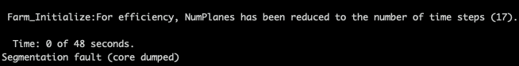

.. _FF:Running:

Running FAST.Farm
=================

As FAST.Farm is a module of OpenFAST, the process of downloading, compiling,
and running FAST.Farm is the same as that for OpenFAST. Such instructions are
available in the :ref:`installation` documentation.

.. note::
   To improve the speed of OpenFAST compiled with FAST.Farm enabled, the user
   may wish to compile in single precision with `OpenMP`.  To do so, add the
   `-DDOUBLE_PRECISION:BOOL=OFF -DOPENMP=ON` options with CMake.

.. note::
   Checkpoint-restart capability has not yet been implemented within FAST.Farm.

Troubleshooting
---------------

Segmentation fault at start
~~~~~~~~~~~~~~~~~~~~~~~~~~~

Very large FAST.Farm simulations may experience a segmentation fault if
insufficient stack memory is set aside for OpenMP.  This may appear on
simulations with more than 50 turbines spaced over tens of kilometers.  If this
is the case, the fault is likely to occur right after screen displays the T=0
timestep.

To increase the stack assigned to the OpenMP process on linux based machines,
the environment variable `OMP_STACKSIZE` can be increased from the default 4 MB
(Intel compiled) to 32 MB (or more) by

.. code-block::

      export OMP_STACKSIZE="32 M"

If this solves the segmentation fault, then the root cause is from the
parallelization with OpenMP not having sufficient stack reserve.  If this does
not solve the issue, then there may be other problems that should be reported.

For further reading on segmentation faults with OpenMP, see `stackoverflow
comment
<https://stackoverflow.com/questions/13264274/why-segmentation-fault-is-happening-in-this-openmp-code/13266595#13266595>`_
and `Intel OpenMP documentation
<https://www.intel.com/content/www/us/en/developer/articles/troubleshooting/openmp-stacksize-common-error.html>`_.
