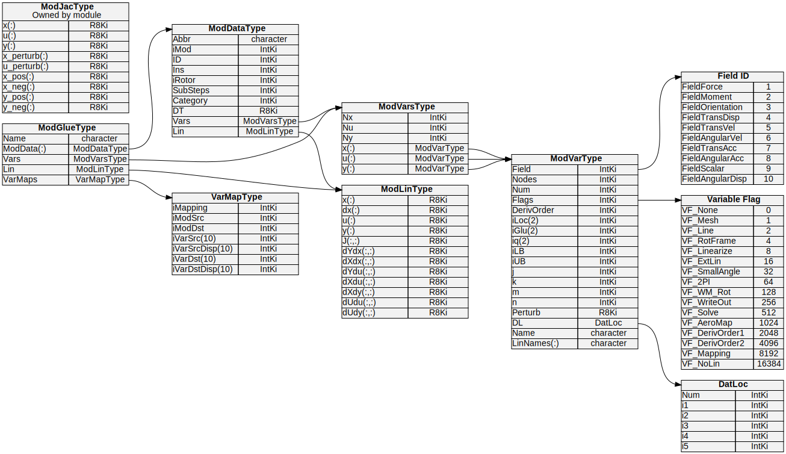

.. _glue-code-modglue:

ModGlue – Combining Modules into Global Arrays
===============================================

``ModGlue_CombineModules`` is the single routine that transforms the
per-module variable descriptions registered by ``MV_AddVar`` /
``MV_AddMeshVar`` / ``MV_AddModule`` (see :ref:`glue-code-modvar`) into a
*monolithic* view of the coupled system.  The output of the routine is a
``ModGlueType`` structure whose ``Vars`` member holds globally indexed
arrays for every state, input, and output variable that belongs to a
specified set of modules.  These global arrays underpin both the solver
Jacobian construction (:ref:`glue-code-solver`) and the linearization
procedure (:ref:`glue-code-linearization`).

.. _fig-modvar-types:

   Complete data-structure hierarchy used by the glue code.  Types shown on
   the left (``DatLoc``, ``Field ID``, ``Variable Flag``) are referenced from
   each ``ModVarType``.  ``ModDataType`` (centre, per module) is collected into
   the top-level ``ModGlueType`` (right) by ``ModGlue_CombineModules``.

.. contents::
   :local:
   :depth: 2

The ``ModGlueType`` structure
------------------------------

``ModGlueType`` is defined in ``modules/openfast-library/src/Glue_Types.f90``:

.. code-block:: fortran

   type ModGlueType
      character(ChanLen)                    :: Name     ! Label (e.g. 'Solver', 'Lin')
      type(ModDataType), allocatable        :: ModData(:) ! Per-module view
      type(ModVarsType)                     :: Vars       ! Combined variable arrays
      type(ModLinType)                      :: Lin        ! Linearization matrices
      type(VarMapType),  allocatable        :: VarMaps(:) ! Relevant mappings
   end type ModGlueType

Key members:

.. list-table::
   :header-rows: 1
   :widths: 20 80

   * - Member
     - Description
   * - ``ModData(:)``
     - One entry per module included in this glue instance.  Each entry is a
       filtered copy of the original ``ModDataType``, containing only the
       variable subset selected by ``FlagFilter``.  Index ordering matches the
       ``iModAry`` argument passed to ``ModGlue_CombineModules``.
   * - ``Vars%x(:)``
     - Concatenated array of ``ModVarType`` descriptors for all *continuous-state*
       variables across the selected modules.
   * - ``Vars%u(:)``
     - Concatenated array of ``ModVarType`` descriptors for all *input* variables.
   * - ``Vars%y(:)``
     - Concatenated array of ``ModVarType`` descriptors for all *output* variables.
   * - ``Vars%Nx / %Nu / %Ny``
     - Total number of scalar values in each group (sum of ``Var%Num`` across
       all variables in ``Vars%x / %u / %y`` respectively).  These are the
       row/column dimensions of the global data arrays and Jacobian matrices.
   * - ``Lin``
     - Holds linearization operating-point arrays (``x``, ``dx``, ``u``, ``y``)
       and the full-system matrices (``dXdx``, ``dXdu``, ``dYdx``, ``dYdu``,
       ``dUdu``, ``dUdy``).  Only allocated when ``Linearize=.true.``.
   * - ``VarMaps(:)``
     - Filtered subset of the global ``Mappings`` array containing only the
       mappings whose source **and** destination modules both appear in
       ``iModAry``.  Used during Jacobian finite-differencing to account for
       output-to-input coupling.

The ``iLoc`` index range
-------------------------

After ``ModGlue_CombineModules`` returns, each variable in
``ModGlue%Vars%x / %u / %y`` carries an ``iLoc(1:2)`` range that locates it
inside the *glue-level* data vectors.  Specifically, for a variable at position
*k* in ``ModGlue%Vars%x``:

* ``iLoc(1)`` – index of its first scalar value in a length-``Vars%Nx`` array.
* ``iLoc(2)`` – index of its last scalar value.

This is the *glue-local* index after filtration; the corresponding
per-module position is still available through the variable's ``iGlu`` range
(set earlier by ``FAST_SolverInit → CalcVarGlobalIndices``).
The ``iLoc / iGlu`` separation means the same variable descriptor can live
simultaneously in the per-module ``ModData`` view, the solver ``m%Mod``
view, and the linearization ``m%ModGlue`` view with consistent, non-overlapping
index ranges in each context.

What ``ModGlue_CombineModules`` does
--------------------------------------

The subroutine signature is:

.. code-block:: fortran

   subroutine ModGlue_CombineModules(ModGlue, ModDataAry, Mappings, &
                                      iModAry, FlagFilter, Linearize, &
                                      ErrStat, ErrMsg, Name)

.. list-table::
   :header-rows: 1
   :widths: 22 12 66

   * - Argument
     - Intent
     - Description
   * - ``ModGlue``
     - ``out``
     - The ``ModGlueType`` structure to populate.
   * - ``ModDataAry(:)``
     - ``in``
     - Full array of per-module data registered by the glue code.
   * - ``Mappings(:)``
     - ``in``
     - Full array of mesh and variable mappings.
   * - ``iModAry(:)``
     - ``in``
     - Ordered list of indices into ``ModDataAry`` specifying *which* modules
       to include and in *what order*.  The order determines the row/column
       layout of the global vectors and Jacobians.
   * - ``FlagFilter``
     - ``in``
     - Bitmask of ``VF_*`` flags.  Only variables that have **at least one** of
       these flags set (i.e. ``MV_HasFlagsAny(Var, FlagFilter)`` is true) are
       copied into the glue ``Vars`` arrays.
   * - ``Linearize``
     - ``in``
     - When ``.true.``, allocates the ``Lin`` operating-point arrays and the
       full-system Jacobian matrices.
   * - ``Name``
     - ``in`` (optional)
     - Human-readable label stored in ``ModGlue%Name`` (e.g. ``'Solver'``,
       ``'Lin'``).

The four main steps performed internally are:

1. **Count and allocate**.  Iterate over each module in ``iModAry`` and count
   how many variable descriptors (and how many total scalar values) pass the
   ``FlagFilter`` test for each of the *x*, *u*, *y* groups.  Allocate
   ``ModGlue%Vars%x / %u / %y`` to exactly those sizes.

2. **Copy and re-index**.  For each module, copy the filtered
   ``ModVarType`` descriptors into ``ModGlue%Vars`` and assign contiguous
   ``iLoc`` ranges so the glue-level index is consecutive across all
   modules.  The per-module ``ModGlue%ModData(i)%Vars`` sub-arrays receive
   the same descriptors with the same ``iLoc`` so that
   scatter/gather routines can operate directly on global vectors.
   Linear name prefixes (e.g. ``"ED "``, ``"BD_1 "``) are prepended to
   ``LinNames`` at this step to produce globally unique channel labels.

3. **Filter mappings**.  Iterate over the full ``Mappings`` array and retain
   only those where both ``iModSrc`` and ``iModDst`` appear in ``iModAry``.
   Re-index the retained entries against the local ``ModData`` position (not
   the global ``ModDataAry`` position) and store them in
   ``ModGlue%VarMaps``.

4. **Allocate linearization storage** (only when ``Linearize=.true.``).
   Allocate the ``Lin`` operating-point vectors (``x``, ``dx``, ``u``, ``y``)
   and all six Jacobian matrices (``dXdx``, ``dXdu``, ``dYdx``, ``dYdu``,
   ``dUdu``, ``dUdy``) dimensioned by ``Vars%Nx`` and ``Vars%Nu / Ny``.

Where ``ModGlue_CombineModules`` is called
------------------------------------------

The routine is called twice during OpenFAST initialisation, producing two
distinct ``ModGlueType`` instances with different variable selections:

``m%Mod`` – the Solver glue module (in ``FAST_SolverInit``)
~~~~~~~~~~~~~~~~~~~~~~~~~~~~~~~~~~~~~~~~~~~~~~~~~~~~~~~~~~~~~

.. code-block:: fortran

   iMod = [p%iModTC, p%iModOpt1]   ! TC + Option-1 indices

   call ModGlue_CombineModules(m%Mod, GlueModData, GlueModMaps, iMod, &
                               VF_Solve, .true., ErrStat2, ErrMsg2, &
                               Name='Solver')

* **Modules included**: tight-coupling (TC) modules plus Option-1 modules.
* **Variable filter**: ``VF_Solve``.  This flag is set by
  ``FAST_SolverInit → SetVarSolveFlags`` on every variable that must appear
  in the Newton iteration: TC continuous states, motion/load mesh
  inputs/outputs involved in inter-module couplings, and any
  variable-to-variable mapped inputs/outputs (see :ref:`glue-code-solver`
  for the full selection criteria).
* **Linearize**: ``.true.`` — the Jacobian matrices are allocated here
  because the solver's Newton linear system reuses the same storage as the
  operating-point linearization.
* **Result**: ``m%Mod%Vars%Nx`` equals the number of TC displacement/velocity
  scalars (``p%NumQ``); ``m%Mod%Vars%Nu`` covers all TC and Option-1 inputs
  flagged ``VF_Solve``.  The Jacobian dimension ``p%NumJ = p%NumQ + p%NumU``
  follows directly.

``m_FAST%ModGlue`` – the Linearization glue module (in ``ModGlue_Init``)
~~~~~~~~~~~~~~~~~~~~~~~~~~~~~~~~~~~~~~~~~~~~~~~~~~~~~~~~~~~~~~~~~~~~~~~~~

.. code-block:: fortran

   LinFlags = VF_Linearize + VF_Mapping + VF_Mesh

   call ModGlue_CombineModules(m%ModGlue, m%ModData, m%Mappings, &
                               p%Lin%iMod, LinFlags, &
                               p_FAST%Linearize, ErrStat2, ErrMsg2, &
                               Name="Lin")

* **Modules included**: all modules participating in linearization, in the
  canonical order set by ``p%Lin%iMod`` (InflowWind → SeaState → ServoDyn →
  ElastoDyn → BeamDyn → AeroDyn → HydroDyn → SubDyn → MAP++ → MoorDyn).
* **Variable filter**: ``VF_Linearize + VF_Mapping + VF_Mesh``.  The
  ``VF_Linearize`` flag is applied per variable according to the
  ``LinInputs`` / ``LinOutputs`` settings in the input file;
  ``VF_Mapping`` / ``VF_Mesh`` ensure that mesh-coupled variables are always
  included so that coupling Jacobians can be assembled even when a variable
  is not a formal linearization output.
* **Linearize**: ``p_FAST%Linearize`` — only allocates the full full-system
  matrices when linearization is requested.
* **Result**: ``m%ModGlue%Vars%Nx / %Nu / %Ny`` give the dimensions of the
  **A**, **B**, **C**, **D**, **dUdu**, **dUdy** matrices written to the
  ``.lin`` file.

How the global index enables matrix assembly
--------------------------------------------

Because every variable descriptor carries its ``iLoc`` range in the glue
``Vars`` array, scatter and gather operations on global data vectors become
trivial index-range assignments.  For example, to pack a module's state
vector into the global solver vector ``x_global``:

.. code-block:: fortran

   do iVar = 1, size(ModData%Vars%x)
      associate (Var => ModData%Vars%x(iVar))
         x_global(Var%iLoc(1):Var%iLoc(2)) = x_mod(Var%iGlu(1):Var%iGlu(2))
      end associate
   end do

And the corresponding gather from the global Jacobian column into a
per-module sub-column requires no offset arithmetic: the ``iLoc`` index
already encodes the correct global position.

Similarly, the ``VarMaps`` array stored in ``ModGlueType`` makes the
Jacobian coupling terms self-contained.  During
``BuildJacobianTC`` / ``BuildJacobianIO`` (in ``FAST_Solver.f90``) and
``ModGlue_Linearize_OP`` (in ``FAST_ModGlue.f90``), the loop is simply:

.. code-block:: fortran

   do i = 1, size(ModGlue%VarMaps)
      ! perturb source output, evaluate destination input change
      ! scatter result into J(iVarDst%iLoc, iVarSrc%iLoc)
   end do

No module-specific knowledge is needed at this level — the ``ModGlueType``
instance is fully self-describing.
