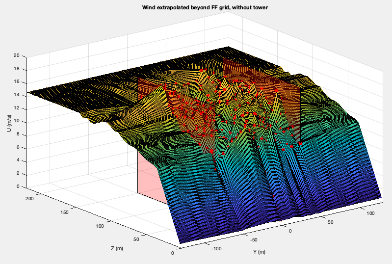
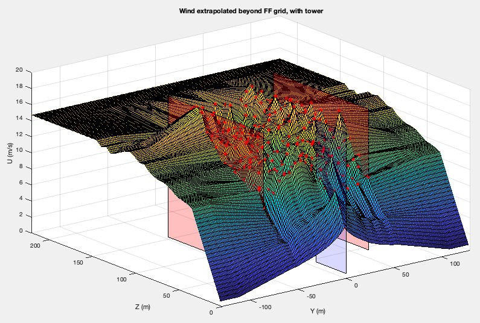

InflowWind Driver
=================
Example input files are
included in :numref:`ifw_appendix`.

Command-line syntax for InflowWind driver:

::

    InflowWind_Driver <filename> [options]

          where:  <filename>     --   Name of driver input file to use
        options:  /ifw           --   treat <filename> as name of InflowWind input file (no driver input file)

        The following options will override values in the driver input file:
                  /DT[#]          --  timestep
                  /TStart[#]      --  start time
                  /TSteps[#]      --  number of timesteps
                  /xrange[#:#]    --  range of x (#'s are reals)
                  /yrange[#:#]    --  range of y
                  /zrange[#:#]    --  range in z (ground = 0.0)
                  /Dx[#]          --  spacing in x
                  /Dy[#]          --  spacing in y
                  /Dz[#]          --  spacing in z
                  /points[FILE]   --  calculates at x,y,z coordinates specified in a white space delimited FILE
                  /v              --  verbose output
                  /vv             --  very verbose output
                  /hawc           --  convert wind file specified in InflowWind to HAWC format
                  /bladed         --  convert wind file specified in InflowWind to Bladed format
                  /vtk            --  convert wind file specified in InflowWind to VTK format
                  /accel          --  output acceleration when processing a points file
                  /BoxExceedAllow --  set flag to extrapolate values of points outside FF wind box
                  /help           --  print this help menu and exit

::

    Notes:
    -   Unspecified ranges and resolutions default to what is in the file.
    -   If no XRange is specified, assumed to be only at X=0
    -   Options are not case sensitive.

The `InflowWind Manual <https://wind.nrel.gov/nwtc/docs/InflowWind_Manual.pdf>`__
contains a description of file formats that it can read.

Specifying the InflowWind Input File
------------------------------------

The InflowWind driver input file requires that an InflowWind input file
be specified within it. See an example InflowWind input
file in :numref:`ifw_appendix`.

Within the InflowWind input file, if the wind file being specified is
Bladed native format (``WindType = 7``), please also see 
:numref:`ifw_native_bladed`.

Wind-file output formats
------------------------

The InflowWind driver is capable of writing the wind data read from the
input wind file into wind files of various formats.

HAWC2
~~~~~

This format generates the following files:

- three binary files, one for each component:
  ``<RootName>-HAWC.u``, ``<RootName>-HAWC.v``, and ``<RootName>-HAWC.w``

- a text summary file in the style of HAWC2 input files:
  ``<RootName>-HAWC.sum``

In the conversion script, the u component will have the (approximate)
mean removed at each height. The mean value that was removed is
displayed as comments in the text summary file. The turbulence is not
scaled, so it will have the same scaling as the original file.

Bladed
~~~~~~

This format generates a packed binary file and a text summary file.

This output format is in the Bladed-style format that TurbSim generates. That
means that **the shear is included** in the file.

VTK
~~~

This format creates files in a subdirectory called ``vtk``. There is one
vtk file for each time in the full-field data structure, and the entire
Y-Z grid is printed in each file. This format can be used to visualize
the wind field using a viewer such as ParaView.

Uniform Wind
~~~~~~~~~~~~

This format generates a text file in the uniform wind format. Converting to this format will 
generally lose information in the file because it specifies the wind speed and direction
at only one point and approximates the shear as a power-law exponent.
   

Converting uniform wind to full-field wind format
-------------------------------------------------

When converting from a uniform wind file to a full-field wind format,
the following assumptions are used: - The advection speed is the
time-averaged horizontal wind speed in the uniform wind file (it does
not include the gust speed). - The constant time-step used in the output
file is the smallest difference between any two entries in the
hub-height file. - The maximum time in the uniform wind file will be
used as the maximum time in the FF binary file. - The grid is generated
with 5-m resolution in the lateral (Y) and horizontal (Z) directions. -
The size of the grid is based on the ``RefLength`` parameter in the
InflowWind input file. The converter adds approximately 10% to the grid
width, with the exact size determined by achieving the desired grid
resolution. The grid is centered in the lateral direction; it extends
vertically above ``RefHt`` by the same distance as the grid width, and
extends below ``RefHt`` to the ground (or within one grid point of the
ground).

Note that there is a potential time shift between the uniform and
full-field wind files, equal to the time it takes to travel the distance
of half the grid width. When using the resulting full-field files, care
must be taken that the aeroelastic code does not treat it as periodic.

Converting from a full-field wind format to uniform wind format
---------------------------------------------------------------

When converting from a full-field wind format to a uniform wind file, the following assumptions are used:

- The gust speed, horizontal shear, and vertical linear shear are all 0.
- The Uniform Wind reference height is on a full-field grid point.
- The upflow is calculated using the mean upflow value at the reference point.
- The mean wind direction and upflow are removed from the reference grid point before writing the velocities to the Uniform Wind file.
- The wind direction in the file is the sum of the mean wind direction and the instantaneous direction calculated between instantaneous U and V wind components.
- The power law exponent is either
  
  1. The power-law exponent specified in InflowWind (if a power law wind profile is used to add to the turbulence with native-Bladed or HAWC2 files), or
  2. Calculated by using the mean wind speeds at two points: the reference (hub) height and the uppermost height on the grid.

accel flag
-------------------

The ability to calculate the acceleration of the flow field was added to
InflowWind to support the analysis of MHK, underwater, turbines. The
acceleration is needed to calculate the fluid-inertia effects of the fluid
interacting with the rotor. Calculation of the acceleration is supported for
Uniform/Steady Wind and grid based wind profiles (Turbsim, HAWC, and Bladed
files). Enabling this flag causes the driver to output the flow field
acceleration for points defined in the Points file in addition to the velocities
at those same points.

BoxExceedAllow flag
-------------------

A feature was added to InflowWind to allow some requested points to lie
outside the full field wind grid. This allows for a continuous exptrapolation of
values beyond the grid that approaches an average level.

Purpose
~~~~~~~

When InflowWind is coupled to OpenFAST, wind points corresponding to the free
vortex wake module (OLAF) in AeroDyn 15 and LidarSim module may be outside the
full-field wind data.  No other wind data points may be outside the grid
(AeroDyn15 blades must be within the wind box).  The wake from OLAF may over
time stray outside the full-field wind box, in which case it should be
sufficiently far from the turbine that any inacuracies in the reported wind
value should have little to no effect on the turbine.  The method employed here
should allow the wake to continue evolving without flow reversals or other
oddities due to a discontinuity at the wind grid boundary.  However, to limit
the impact of the approximation used, the wake should not be allowed to exit the
box until far from the turbine.

The other use case is when the LidarSim requests data far from the turbine that
may lie outside the wind box, such as a yawed, or floating turbine where the
sensing beam periodically exits the wind box.

Method
~~~~~~

During initialization, a flag and corresponding index are passed to tell IfW to
allow points in the requested position array to lie outside the full-field wind
and tower grids starting at this index.  The values for these points are then
extrapolated using the data from the full-field wind as follows:

   1. The average wind value at each Z height at each timestep is calculated and
      stored during initialization (averaged across the Y dimension).
   2. Wind above the full field wind grid is linearly interpolated between the
      value at the top of the grid the average of the top of the grid.  This
      linear interpolation zone extends from the top of grid to the top of the
      grid + one half grid height (``FFZHWid``).  Values beyond that are held
      constant.
   3. Values beyond the +/-Y grid edges are linearly interpolated between the
      value at the edge of the grid and the average for that Z elevation in the
      grid.  The interpolation zone is between the edge of the grid and one half
      grid width further along Y at ``+/-2*FFYHWid``.
   4. When no tower data is present, the values below the grid are linearly
      interpolated between the bottom of the grid and 0 at the ground.
   5. When tower data is present, points below the grid are interpolated between
      the tower and grid and the ground (0 value at ``+/-2*FFYHWid``).  Linear
      interpolation is then used beyond the edge of the grid.

Testing with driver
~~~~~~~~~~~~~~~~~~~

To test this feature, the driver accepts the flag ``BoxExceedAllow`` and will
signal to InflowWind that all windgrid points may be beyond the edge of the
grid.  To use this, setup a driver input file with an output wind grid that is
larger than the full-field grid from the wind file referenced in the
corresponding InflowWind input file.  Then the following command can be used
(Linux syntax, Windows is slightly different):

.. code-block:: bash
	
    > inflowwind_driver -BoxExceedAllow MyDriverFile.inp

For a single YZ plane from the resulting wind grid output file at time T, the
results for extrapolated data points can be plotted and should show
characteristics similar to the following plots.

           
   Extrapolation of wind values beyond the full field wind grid when no tower data is present. The semi-transparent red planes indicate the edges of the full-field wind grid, and the red points are the locations of wind grid data in this example case. All other points shown on the surface are interpolated/extrapolated.
  

   Extrapolation of wind values beyond the full field wind grid when tower data is present. The semi-transparent red planes indicate the edges of th e full-field wind grid, blue semi-transparent plane indicates the tower grid, and the red points indcate the data points from the wind grid and tower.  All other points shown on the surface are interpolated/extrapolated.

