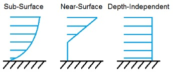

Input Files
===========

The user configures the sea state model parameters via a primary SeaState input file.
When used in standalone mode, an additional driver input file is
required. This driver file specifies initialization inputs normally
provided to SeaState by OpenFAST.

No lines should be added or removed from the input files, except in
tables where the number of rows is specified.

THIS DOCUMENTATION COMES FROM THE OLD HYDRODYN DOCUMENTATION AND MUST BE UPDATED FOR SEASTATE

Units
~~~~~
SeaState uses the SI system (kg, m, s, N).

.. _sea-driver-input:

SeaState Driver Input File
~~~~~~~~~~~~~~~~~~~~~~~~~~
The driver input file is only needed for the standalone version of
SeaState and contains inputs normally generated by OpenFAST or the 
HydroDyn driver, and are
necessary to control the sea state conditions for uncoupled models. A
sample SeaState driver input file is given in Appendix B.

.. _sea-primary-input:

SeaState Primary Input File
~~~~~~~~~~~~~~~~~~~~~~~~~~~

Environmental Conditions
------------------------
Environmental conditions are now specified in the driver input file but are left in
the primary input file for legacy compatibility. Use the keyword 
DEFAULT to pass in values specified by the driver input file. Otherwise, 
values given in the primary input file will overwrite those given in the
driver input file. **WtrDens** specifies the water density and must be a value greater than
or equal to zero; a typical value of seawater is around 1025
kg/m\ :sup:`3`. **WtrDpth** specifies the water depth (depth of the flat
seabed), based on the reference MSL, and must be a value greater than
zero. **MSL2SWL** is the offset between the MSL and SWL, positive
upward. This parameter is useful when simulating the effect of tides or
storm-surge sea-level variations without having to alter the
substructure geometry information. This parameter is unused with
**WaveMod** = 6 and must be set to zero if you are using a
potential-flow model (**PotMod** = 1 or 2).

Waves
-----

The WAVES section of the input file controls the internal generation of
first-order waves or the use of externally generated waves, used by both
the strip-theory and potential-flow solutions. The wave spectrum
settings in this section only pertain to the first-order wave frequency
components. When second-order terms are optionally enabled—see the
:ref:`sea-2nd_order_waves_input` and :ref:`hd-2nd_order_floating_platform_forces_input`
sections below—the second-order terms are calculated using the
first-order wave-component amplitudes and extra energy is added to the
wave spectrum (at the difference and sum frequencies).

**WaveMod** specifies the incident wave kinematics model. The options
are:

* 0: none = still water

* 1: regular (periodic) waves

* 1P#: regular (periodic) waves with user-specified phase, for example
  1P20.0 for regular waves with a 20˚ phase (without P#, the phase
  will be random, based on **WaveSeed**); 0˚ phase represents a
  cosine function, starting at the peak and decreasing in time

* 2: Irregular (stochastic) waves based on the JONSWAP or
  Pierson-Moskowitz frequency spectrum

* 3: Irregular (stochastic) waves based on a white-noise frequency
  spectrum

* 4: Irregular (stochastic) waves based on a user-defined frequency
  spectrum from routine *UserWaveSpctrm()*; see Appendix D for
  compiling instructions

* 5: Externally generated wave-elevation time series

* 6: Externally generated full wave-kinematics time series

Option 4 requires that the *UserWaveSpctrm()* subroutine of the
*Waves.f90* source file be implemented by the user, and will require
recompiling either the standalone HydroDyn program or FAST. Option 5
allows the use of externally generated wave-elevation time series, from
which the hydrodynamic loads in the potential-flow solution or the wave
kinematics used in the strip-theory solution are derived internally.
Option 6 allows the use of full externally generated wave kinematics for
use with the strip-theory solution (but not the potential-flow
solution). With options 5 and 6, the externally generated wave data is
provided through input files, all of which have the root name given by
the **WvKinFile** parameter below.

This version does not include the ability to model stretching of
internally generated incident wave kinematics to the instantaneous free
surface; you must set **WaveStMod** = 0.

**WaveTMax** sets the length of the incident wave kinematics time
series, but it also determines the frequency step used in the inverse
FFT, from which the internal wave time series are derived (*Δω* =
2\ *π*/**WaveTMax**). If **WaveTMax** is less than the total simulation
time, HydroDyn implements repeating wave kinematics that have a period
of **WaveTMax**; **WaveTMax** must not be less than the total simulation
time when **WaveMod** = 5. **WaveDT** determines the time step for the
wave kinematics time series, but it also determines the maximum
frequency in the inverse FFT (*ω\ max* = *π*/**WaveDT**). When modeling
irregular sea states, we recommend that **WaveTMax** be set to at least
1 hour (3600 s) and that **WaveDT** be a value in the range between 0.1
and 1.0 s to ensure sufficient resolution of the wave spectrum and wave
kinematics. When HydroDyn is coupled to FAST, **WaveDT** may be
specified arbitrarily independently from the glue code time step of FAST
(the wave kinematics will be interpolated in time as necessary);
**WaveDT** must equal the glue code time step of FAST when **WaveMod** =
6.

For internally generated waves, the wave height (crest-to-trough, twice
the amplitude) for regular waves and the significant wave height for
irregular waves is set using **WaveHs** (only used when **WaveMod** = 1,
2, or 3). The wave period for regular waves and the peak-spectral wave
period for irregular waves is controlled with the **WaveTp** parameter
(only used when **WaveMod** = 1 or 2). **WavePkShp** is the peak-shape
parameter of JONSWAP irregular wave spectrum (only used when **WaveMod**
= 2). Set **WavePkShp** to DEFAULT to obtain the value recommended in
the IEC 61400-3 Annex B, derived based on the peak-spectral period and
significant wave height [IEC, 2009]. Set **WavePkShp** to 1.0 for the
Pierson-Moskowitz spectrum.

**WvLowCOff** and **WvHiCOff** control the lower and upper cut-off
frequencies (in rad/s) of the first-order wave spectrum; the first-order
wave-component amplitudes are zeroed below and above these cut-off
frequencies, respectively. **WvLowCOff** may be set lower than the
low-energy limit of the first-order wave spectrum to minimize
computational expense. Setting a proper upper cut-off frequency
(**WvHiCOff**) also minimizes computational expense and is important to
prevent nonphysical effects when approaching of the breaking-wave limit
and to avoid nonphysical wave forces at high frequencies (i.e., at short
wavelengths) when using a strip-theory solution. **WvLowCOff** and
**WvHiCOff** are unused when **WaveMod** = 0, 1, or 6.

**WaveDir** (unused when **WaveMod** = 0 or 6) is the mean wave
propagation heading direction (in degrees), and must be in the range
(-180,180]. A heading of 0 corresponds to wave propagation in the
positive X-axis direction. And a heading of 90 corresponds to wave
propagation in the positive Y-axis direction. **WaveDirMod** specifies
the wave directional spreading model (only used when **WaveMod** = 2, 3,
or 4). Setting **WaveDirMod** to 0 disables directional spreading,
resulting in long-crested (plane-progressive) sea states propagating in
the **WaveDir** direction. Setting **WaveDirMod** to 1 enables the
modeling of short-crested sea states, with a mean propagation direction
of **WaveDir**, through the commonly used cosine spreading function
(COS:sup:`2\ S`) to define the directional spreading spectrum, based on
the spreading coefficient (*S*) defined via **WaveDirSpread**. The wave
directional spreading spectrum is discretized with an equal-energy
method using **WaveNDir** number of equal-energy bins. **WaveNDir** is
an odd-valued integer greater or equal to 1 (1 or 3 or 5…), but HydroDyn
may slightly increase the specified value of **WaveNDir** to ensure that
there is the same number of wave components within each direction bin;
setting **WaveNDir** = 1 is equivalent to setting **WaveDirMod** = 0.
The range of the directional spread (in degrees) is defined via
**WaveDirSpread**. The equal-energy method assumes that the directional
spreading spectrum is the product of a frequency spectrum and a
spreading function i.e. *S*\ (*ω*,\ *β*) = *S*\ (*ω*)\ *D*\ (*β*).
Directional spreading is not permitted when using Newman’s approximation
of the second-order difference-frequency potential-flow loads.

**WaveSeed(1)** and **WavedSeed(2)** (unused when **WaveMod** = 0, 5, or
1) combined determine the initial seed (starting point) for the internal
pseudorandom number generator (pRNG) needed to derive the internal wave
kinematics from the wave frequency and direction spectra. If both are 
numeric values, the Fortran intrinsic pRNG is used. If **WaveSeed(2)**
is the string "RANLUX", an alternative pRNG included with the NWTC Library
is used and the value of **WaveSeed(1)** is the seed. If you want to
run different time-domain realizations for given boundary conditions (of
significant wave height, and peak-spectral period, etc.), you should
change one or both seeds between simulations. While the phase of each
wave frequency and direction component of the wave spectrum is always
based on a uniform distribution (except when using the 1P# **WaveMod**
option), the amplitude of the wave frequency spectrum can also be
randomized (following a normal distribution) by setting **WaveNDAmp** to
TRUE. Setting **WaveNDAmp** to FALSE means that the amplitude of the
wave frequency spectrum always matches the target spectrum.
**WaveNDAmp** is only used with **WaveMod** = 2, 3, or 4.

When using externally generated wave data (**WaveMod** = 5 or 6), input
parameter **WvKinFile** should be set to the root name of the input
file(s) (without extension) containing the data.

Using externally generated wave-elevation time series (**WaveMod** = 5)
requires a text-formatted input data file with the extension *.Elev*
containing two columns of data—the first is time (starting at zero) (in
s) and the second is the wave elevation at (0,0) (in m), separated by
whitespace. Header lines (identified as those not beginning with a
number) are ignored. The time series must be at least **WaveTMax** in
length and not less than the total simulation time and the time step
must match **WaveDT**. The wave-elevation time series specified is
assumed to be of first order and long-crested, but is not checked for
physical correctness. When second-order terms are optionally enabled—see
the 2\ :sup:`ND`-ORDER WAVES and 2\ :sup:`ND`-ORDER FLOATING PLATFORM
FORCES sections below—the second-order terms are calculated using the
wave-component amplitudes derived from the provided wave-elevation time
series and extra energy is added to the wave spectrum (at the difference
and sum frequencies).

Using full externally generated wave kinematics (**WaveMod** = 6)
requires eight text-formatted input data files, all without headers.
Seven files with extensions *.Vxi*, *.Vyi*, *.Vzi*, *.Axi*, *.Ayi*,
*.Azi*, and *.DynP* correspond to the *X*, *Y*, and *Z* velocities (in
m/s) and accelerations (in m/s\ :sup:`2`) in the global inertial-frame
coordinate system and the dynamic pressure (in Pa) time series. Each of
these files must have exactly **WaveTMax**/**DT** rows and *N*
whitepace-separated columns, where *N* is the total number of internal
HydroDyn analysis nodes (corresponding exactly to those written to the
HydroDyn summary file). Time is absent from the files, but is assumed to
go from zero to **WaveTMax** – **WaveDT** in steps of **WaveDT**. To use
this feature, it is the burden of the user to generate wave kinematics
data at each of HydroDyn’s time steps and analysis nodes. HydroDyn will
not interpolate the data; as such, when HydroDyn is coupled to FAST,
**WaveDT** must equal the glue code time step of FAST. A numerical value
(including 0) in a file is assumed to be valid data (with 0
corresponding to 0 m/s, 0 m/s\ :sup:`2`, or 0 Pa); a nonnumeric string
will designate that the node is outside of the water at that time step
(above the instantaneous water elevation or below the seabed)—externally
generated wave kinematics used with **WaveMod** = 6 are not limited to
the domain between a flat seabed and SWL and may consider wave
stretching, higher-order wave theories, or an uneven seabed. All seven
files must have nonnumeric strings in the same locations within the
file. The eighth file, with extension *.Elev*, must contain the wave
elevation (in m) at each of the **NWaveElev** points on the SWL where
wave elevations can be output—see below; this data is required for
output purposes only and is not used by HydroDyn for other means. This
file must have exactly **WaveTMax**/**DT** rows and **NWaveElev**
whitepace-separated columns and only valid numeric data is allowed (the
file will have **NWaveElev** + ( **WaveElevNX** × **WaveElevNY** )
columns when HydroDyn is operated in standalone mode). The data in these
files is not processed (filtered, etc.) or checked for physical
correctness (other than for consistency in the location of the
nonnumeric strings). Full externally generated wave kinematics
(**WaveMod** = 6) cannot be used in conjunction with the potential-flow
solution.

You can generate up to 9 wave elevation outputs. **NWaveElev**
determines the number (between 0 and 9), and the whitespace-separated
lists of **WaveElevxi** and **WaveElevyi** determine the locations of
these **NWaveElev** number of points on the SWL plane in the global
inertial-frame coordinate system.

.. _sea-2nd_order_waves_input:

2\ :sup:`nd`-Order Waves
------------------------
The 2\ :sup:`ND`-ORDER WAVES section (unused when **WaveMod** = 0 or 6)
of the input file allows the option of adding second-order contributions
to the wave kinematics used by the strip-theory solution. When
second-order terms are optionally enabled, the second-order terms are
calculated using the first-order wave-component amplitudes and extra
energy is added to the wave spectrum (at the difference and sum
frequencies). The second-order terms cannot be computed without also
including the first-order terms from the WAVES section above. Enabling
the second-order terms allows one to capture some of the nonlinearities
of real surface waves, permitting more accurate modeling of sea states
and the associated wave loads at the expense of greater computational
effort (mostly at HydroDyn initialization).

While the cut-off frequencies in this section apply to both the
second-order wave kinematics used by strip theory and the second-order
diffraction loads in potential-flow theory, the second-order terms
themselves are enabled separately. The second-order wave kinematics used
by strip theory are enabled in this section while the second-order
diffraction loads in potential-flow theory are enabled in the
:ref:`hd-2nd_order_floating_platform_forces_input` section below. While the
second-order effects are included when enabled, the wave elevations
output from HydroDyn will only include the second-order terms when the
second-order wave kinematics are enabled in this section.

To use second-order wave kinematics in the strip-theory solution, set
**WvDiffQTF** and/or **WvSumQTF** to TRUE. When **WvDiffQTF** is set to
TRUE, second-order difference-frequency terms, calculated using the full
difference-frequency QTF, are incorporated in the wave kinematics. When
**WvSumQTF** is set to TRUE, second-order sum-frequency terms,
calculated using the full sum-frequency QTF, are incorporated in the
wave kinematics. The full difference- and sum-frequency wave kinematics
QTFs are implemented analytically following [Sharma and Dean, 1981],
which extends Stokes second-order theory to irregular multidirectional
waves. A setting of FALSE disregards the second-order contributions to
the wave kinematics in the strip-theory solution.

**WvLowCOffD** and **WvHiCOffD** control the lower and upper cut-off
frequencies (in rad/s) of the second-order difference-frequency terms;
the second-order difference-frequency terms are zeroed below and above
these cut-off frequencies, respectively. The cut-offs apply directly to
the physical difference frequencies, not the two individual first-order
frequency components of the difference frequencies. When enabling
second-order potential-flow theory, a setting of **WvLowCOffD** = 0 is
advised to avoid eliminating the mean-drift term (second-order wave
kinematics do not have a nonzero mean). **WvHiCOffD** need not be set
higher than the peak-spectral frequency of the first-order wave spectrum
(*ω\ p* = 2\ *π*/**WaveTp**) to minimize computational expense.

Likewise, **WvLowCOffS** and **WvHiCOffS** control the lower and upper
cut-off frequencies (in rad/s) of the second-order sum-frequency terms;
the second-order sum-frequency terms are zeroed below and above these
cut-off frequencies, respectively. The cut-offs apply directly to the
physical sum frequencies, not the two individual first-order frequency
components of the sum frequencies. **WvLowCOffS** need not be set lower
than the peak-spectral frequency of the first-order wave spectrum
(*ω\ p* = 2\ *π*/**WaveTp**) to minimize computational expense. Setting
a proper upper cut-off frequency (**WvHiCOffS**) also minimizes
computational expense and is important to (1) ensure convergence of the
second-order summations, (2) avoid unphysical "bumps" in the wave
troughs, (3) prevent nonphysical effects when approaching of the
breaking-wave limit, and (4) avoid nonphysical wave forces at high
frequencies (i.e., at short wavelengths) when using a strip-theory
solution.

Because the second-order terms are calculated using the first-order
wave-component amplitudes, the second-order cut-off frequencies
(**WvLowCOffD**, **WvHiCOffD**, **WvLowCOffS**, and **WvHiCOffS**) are
used in conjunction with the first-order cut-off frequencies
(**WvLowCOff** and **WvHiCOff**) from the WAVES section. However, the
second-order cut-off frequencies are not used by Newman’s approximation
of the second-order difference-frequency potential-flow loads, which are
derived solely from first-order effects.

Current
-------
You can include water velocity due to a current model by setting
**CurrMod** = 1. If **CurrMod** is set to zero, then the simulation will
not include current. **CurrMod** = 2 requires that the *UserCurrent()*
subroutine of the *Current.f90* source file be implemented by the user,
and will require recompiling either the standalone HydroDyn program or
FAST. Current induces steady hydrodynamic loads through the viscous-drag
terms (both distributed and lumped) of strip-theory members. Current is
not used in the potential-flow solution or when **WaveMod** = 6.

HydroDyn’s standard current model includes three sub-models:
near-surface, sub-surface, and depth-independent, as illustrated in
:numref:`sea-fig:current_sub_model`. All three currents are vector summed,
along with the wave particle kinematics velocity.

  Standard Current Sub-Models

The sub-surface current model follows a power law,

.. math::
  :label: SubsurfacePowerLaw

  U_{SS}(Z) = U_{0_{SS}} \left( \frac{Z+d}{d} \right)^{ \frac{1}{7} }

where :math:`Z` is the local depth below the SWL (negative downward), :math:`d` is the
water depth (equal to **WtrDpth** + **MSL2SWL**), and :math:`U_{0_{SS}}` is the current
velocity at SWL, corresponding to **CurrSSV0**. The heading of the
sub-surface current is defined using **CurrSSDir** following the same
convention as **WaveDir**.

The near-surface current model follows a linear relationship down to a
reference depth such that,

.. math::
  :label: NearsurfacePowerLaw

  U_{NS}(Z) = U_{0_{NS}} \left( \frac{Z+h_{ref}}{h_{ref}} \right), Z\in[-h_{ref},0]

otherwise,

.. math::
  :label: NearsurfaceDeep

  U_{NS}(Z) = 0

where :math:`h_{ref}` is the reference depth corresponding to **CurrNSRef** and must be
positive valued. :math:`U_{0_{NS}}` is the current velocity at SWL, corresponding to
**CurrNSV0**. The heading of the near-surface current is defined using
**CurrNSDir**, following the same convention as **WaveDir**.

The depth-independent current velocity everywhere equals **CurrDIV**.
This current has a heading direction **CurrDIDir**, following the same
convention as **WaveDir**.

Output Channels
---------------
This section controls output quantities generated by HydroDyn. Enter one
or more lines containing quoted strings that in turn contain one or more
output parameter names. Separate output parameter names by any
combination of commas, semicolons, spaces, and/or tabs. If you prefix a
parameter name with a minus sign, "-", underscore, "_", or the
characters "m" or "M", HydroDyn will multiply the value for that channel
by –1 before writing the data. The parameters are not necessarily
written in the order they are listed in the input file. HydroDyn allows
you to use multiple lines so that you can break your list into
meaningful groups and so the lines can be shorter. You may enter
comments after the closing quote on any of the lines. Entering a line
with the string "END" at the beginning of the line or at the beginning
of a quoted string found at the beginning of the line will cause
HydroDyn to quit scanning for more lines of channel names. Member- and
joint-related quantities are generated for the requested 
:ref:`hd-member-output-list` and :ref:`hd-joint-output-list`.
If HydroDyn encounters an unknown/invalid
channel name, it warns the users but will remove the suspect channel
from the output file. Please refer to Appendix C for a complete list of
possible output parameters.
