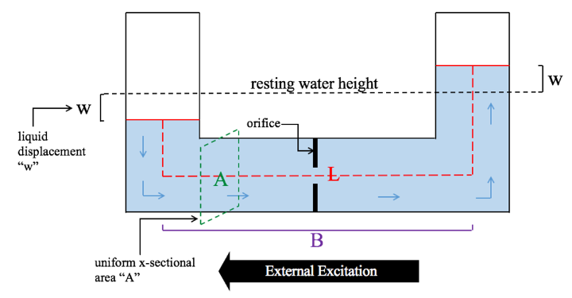

.. _TLCD_Theory:

TLCD: Derivations of Equation of Motion
=======================================

..  _TLCDfig:

   Schematic of TLCD design.

Definitions:
------------

.. container::
   :name: tab:TLCDdefs

   .. table:: TLCD Definitions

      +-----------------+-------------------+
      | Variable        | Description       |
      +=================+===================+
      |  |O_eq|         |  |O_desc|         |
      +-----------------+-------------------+
      |  |P_eq|         |  |P_desc|         |
      +-----------------+-------------------+
      |  |W_R_eq|       |  |W_R_desc|       |
      +-----------------+-------------------+
      |  |W_L_eq|       |  |W_L_desc|       |
      +-----------------+-------------------+
      |  |G_eq|         |  |G_desc|         |
      +-----------------+-------------------+
      |  |N_eq|         |  |N_desc|         |
      +-----------------+-------------------+
      |  |w_eq|         |  |w_desc|         |
      +-----------------+-------------------+
      |  |g_eq|         |  |g_desc|         |
      +-----------------+-------------------+

.. |O_eq|            replace:: :math:`O`
.. |O_desc|          replace:: origin point of global inertial reference frame, located at center of base of resting turbine
.. |P_eq|            replace:: :math:`P`
.. |P_desc|          replace:: origin point of local reference frame (_e.g._ fixed to nacelle), in the center of the horizontal liquid column
.. |W_R_eq|          replace:: :math:`W_R`
.. |W_R_desc|        replace:: point attached to the top center of the right liquid column (moving)
.. |W_L_eq|          replace:: :math:`W_L``
.. |W_L_desc|        replace:: point attached to the top center of the left liquid column (moving)
.. |G_eq|            replace:: :math:`i`
.. |G_desc|          replace:: axis orientation of inertial reference frame (global)
.. |N_eq|            replace:: :math:`l`
.. |N_desc|          replace:: axis orientation of local reference frame
.. |w_eq|            replace:: :math:`w`
.. |w_desc|          replace:: position of the liquid water column as defined in Figure :numref:`TLCDfig` 
.. |g_eq|            replace:: :math:`g`
.. |g_desc|          replace:: gravity vector in the inertial reference frame (global)

Right Vertical Liquid Column
----------------------------

Starting with the right vertical column, we define the following vector
expressions:

.. container::
   :name: tab:TLCD_r_vectors

      +--------------------+-----------------------+
      | Variable           | Description           |
      +====================+=======================+
      |  |iVecR_O2P_eq|    |  |iVecR_O2P_desc|     |
      +--------------------+-----------------------+
      |  |lVecR_P2Wr_eq|   |  |lVecR_P2Wr_desc|    |
      +--------------------+-----------------------+
      |  |iVecW_l_eq|      |  |iVecW_l_desc|       |
      +--------------------+-----------------------+
      |  |iVecR_O2Wr_eq|   |  |iVecR_O2Wr_desc|    |
      +--------------------+-----------------------+

.. |iVecR_O2P_eq|       replace:: :math:`\vec{r}_{i}^{O \rightarrow P} = \left[ \begin{array}{c} x \\ y \\ z \end{array} \right]_{i} ^{O \rightarrow P}`
.. |iVecR_O2P_desc|     replace:: position vector from point :math:`O` to point :math:`P` in inertial coordinate system
.. |lVecR_P2Wr_eq|      replace:: :math:`\vec{r}_{l}^{P \rightarrow W_R} = \left[ \begin{array}{c} x \\ y \\ z \end{array} \right]_{l} ^{P \rightarrow W_R}`
.. |lVecR_P2Wr_desc|    replace:: position vector from point :math:`P` to point :math:`W_R` in local coordinate system
.. |iVecW_l_eq|         replace:: :math:`\vec{\omega}_{i}^{l} = \left[ \begin{array}{c} \theta \\ \phi \\ \psi \end{array} \right]_{i} ^{l}`
.. |iVecW_l_desc|       replace:: angular velicity frame :math:`l` with respect to inertial reference frame :math:`i`
.. |iVecR_O2Wr_eq|      replace:: :math:`\vec{r}_{i}^{O \rightarrow W_R} = \vec{r}_{i}^{O \rightarrow P} + \vec{r}_{l}^{P \rightarrow W_R} = \left[ \begin{array}{c} x \\ y \\ z \end{array} \right]_{i} ^{O \rightarrow W_R}`
.. |iVecR_O2Wr_desc|    replace:: position vector from point :math:`P` to point :math:`W_R` in local coordinate system

Taking the derivative of the last expression for :math:`\vec{r}_{i}^{O
\rightarrow W_R}` yields the velocity of point :math:`W_R` in the global
reference frame:

.. math::

   \dot{\vec{r}}_{i}^{W_R}
         =  \dot{\vec{r}}_{i}^{P}
         +  \dot{\vec{r}}_{l}^{W_R}
         +  \vec{\omega}_{i}^{l} \times \vec{r}_{l}^{P \rightarrow W_R}.

Repeating this step once more yields its acceleration:

.. math::

   \ddot{\vec{r}}_{i}^{W_R}
         =  \dot{\vec{r}}_{i}^{P}
         +  \ddot{\vec{r}}_{l}^{W_R}
         +  2 \vec{\omega}_{i}^{l} \times \dot{\vec{r}}_{l}^{W_R}
         +  \vec{\alpha}_{i}^{l} \times \vec{r}_{i}^{P \rightarrow W_R}
         +  \vec{\omega}_{i}^{l} \times \left( \vec{\omega}_{i}^{l} \times \vec{r}_{l}^{P \rightarrow W_R}\right)

Following Newton’s Second Law, the left part of this expression can be
replaced with a force balance:

.. math:: 

   \ddot{\vec{r}}_{i}^{W_R}
         = \frac{1}{m_R}
            \left[\begin{array}{c}
               \sum{F_x}\\
               \sum{F_y}\\
               \sum{F_z}
            \end{array}\right] ^ {W_R}
         = \frac{1}{m_R}
            \left[\begin{array}{c}
               F_x^{W_R/S} + m_R g_{x} \\
               F_y^{W_R/S} + m_R g_{y} \\
               m_R g_{z}
            \end{array}\right] ^ {W_R}

where :math:`g` is the gravity vector in the inertial frame.  The vector
describing the position of the right hand column in the local reference frame
(:math:`i`) can be written as:

.. math::

   \vec{r}_{l}^{P \rightarrow W_R}
         = \left[ \begin{array}{c}
            B/2   \\
            0     \\
            \frac{L-B}{2} + w
         \end{array}\right]_{l} ^{P \rightarrow W_R}.

Movement of the liquid in the vertical columns is restricted to the
z-direction in reference frame N, thus the expression for the
acceleration of the right liquid column becomes:

.. math::

   \frac{1}{m_R}
         \left[\begin{array}{c}
            F_x^{W_R/S} + m_R g_{x} \\
            F_y^{W_R/S} + m_R g_{y} \\
            m_R g_{z}
         \end{array}\right] ^{W_R}
   &  =  \quad\left[\begin{array}{c}
            \ddot{x} \\
            \ddot{y} \\
            \ddot{z}
         \end{array}\right]_{i}^{P}
      +  \left[\begin{array}{c}
            0     \\
            0     \\
            \ddot{\omega}
         \end{array}\right]_{l}^{W_R}  \\
   &  \quad
      + 2\left[\begin{array}{c}
            \dot{\theta}   \\
            \dot{\phi}     \\
            \dot{\psi}
         \end{array}\right]_{i}^{l}
      \times
         \left[\begin{array}{c}
            0        \\
            0        \\
            \dot{\omega}
         \end{array}\right]_{l}^{W_R}  \\
   &  \quad
      +  \left[\begin{array}{c}
            \ddot{\theta}  \\
            \ddot{\phi}    \\
            \ddot{\psi}
         \end{array}\right]_{i}^{l}
      \times
         \left[\begin{array}{c}
            B/2   \\
            0     \\
            \frac{L-B}{2} + w
         \end{array}\right]_{l}^{P \rightarrow W_R}  \\
   &  \quad
      +  \left[\begin{array}{c}
            \dot{\theta}   \\
            \dot{\phi}     \\
            \dot{\psi}
         \end{array}\right]_{i}^{l}
      \times\left(
         \left[\begin{array}{c}
            \dot{\theta}   \\
            \dot{\phi}     \\
            \dot{\psi}
         \end{array}\right]_{i}^{l}
         \times
         \left[\begin{array}{c}
            B/2   \\
            0     \\
            \frac{L-B}{2} + w
         \end{array}\right]_{l}^{P \rightarrow W_R}
      \right)

Computing all cross-products yields three distinct expressions in the x,
y, and z dimensions:

.. math::
   x: &  \quad
         \frac{1}{m_R} \left( F_x^{W_R/S} + m_R g_{x} \right)
      &=&
         \ddot{x}_{i}^{P}
      + 2\dot{\phi}\dot{w}
      +  \ddot{\phi} \left(\frac{L-B}{2} + w \right)
      -  \dot{\phi}^2 \frac{B}{2}
      -  \dot{\psi}^2 \frac{B}{2}
      +  \dot{\psi}\dot{\theta}  \left(\frac{L-B}{2} + w \right)   \\
   y: &  \quad
         \frac{1}{m_R}           \left( F_y^{W_R/S} + m_R g_{y} \right)
      &=&
         \ddot{y}_{i}^{P}
      - 2\dot{\theta}\dot{w}
      +  \ddot{\psi} \frac{B}{2}
      -  \ddot{\theta}           \left(\frac{L-B}{2} + w \right)
      +  \dot{\psi}\dot{\phi}    \left(\frac{L-B}{2} + w \right)
      +  \dot{\theta}\dot{\phi}\frac{B}{2} \\
   z: &  \quad
         g_z
      &=&
         \ddot{z}_{i}^{P}
      +  \ddot{w}
      -  \ddot{\phi} \frac{B}{2}
      +  \dot{\theta}\dot{\psi} \frac{B}{2}
      -  \dot{\theta}^2          \left(\frac{L-B}{2} + w \right)
      -  \dot{\phi}^2            \left(\frac{L-B}{2} + w \right)   \\
         
   

Left Vertical Liquid Column
---------------------------

Following the same methodology as above the equations describing the
movement of the left vertical liquid column can be determined.

Similarly, the acceleration of the left liquid column can be replaced by
a force balance:

.. math:: 

   \ddot{\vec{r}}_{i}^{W_L}
         = \frac{1}{m_L}
            \left[\begin{array}{c}
               \sum{F_x}\\
               \sum{F_y}\\
               \sum{F_z}
            \end{array}\right] ^ {W_L}
         = \frac{1}{m_L}
            \left[\begin{array}{c}
               F_x^{W_L/S} + m_L g_{x} \\
               F_y^{W_L/S} + m_L g_{y} \\
               m_L g_{z}
            \end{array}\right] ^ {W_L}

where :math:`g` is the gravity vector in the inertial frame.  The vector
describing the position of the left hand column in the local reference frame
(:math:`i`) can be written as:

.. math::

   \vec{r}_{l}^{P \rightarrow W_L}
         = \left[ \begin{array}{c}
           -B/2   \\
            0     \\
            \frac{L-B}{2} - w
         \end{array}\right]_{l} ^{P \rightarrow W_L}.

The final equation for the acceleration of the left liquid column
becomes:

.. math::

   \frac{1}{m_L}
         \left[\begin{array}{c}
            F_x^{W_L/S} + m_L g_{x} \\
            F_y^{W_L/S} + m_L g_{y} \\
            m_L g_{z}
         \end{array}\right] ^{W_L}
   &  =  \quad\left[\begin{array}{c}
            \ddot{x} \\
            \ddot{y} \\
            \ddot{z}
         \end{array}\right]_{i}^{P}
      +  \left[\begin{array}{c}
            0     \\
            0     \\
            - \ddot{w}
         \end{array}\right]_{l}^{W_L}  \\
   &  \quad
      + 2\left[\begin{array}{c}
            \dot{\theta}   \\
            \dot{\phi}     \\
            \dot{\psi}
         \end{array}\right]_{i}^{l}
      \times
         \left[\begin{array}{c}
            0        \\
            0        \\
            - \dot{w}
         \end{array}\right]_{l}^{W_L}  \\
   &  \quad
      +  \left[\begin{array}{c}
            \ddot{\theta}  \\
            \ddot{\phi}    \\
            \ddot{\psi}
         \end{array}\right]_{i}^{l}
      \times
         \left[\begin{array}{c}
            -B/2  \\
            0     \\
            \frac{L-B}{2} - w
         \end{array}\right]_{l}^{P \rightarrow W_L}  \\
   &  \quad
      +  \left[\begin{array}{c}
            \dot{\theta}   \\
            \dot{\phi}     \\
            \dot{\psi}
         \end{array}\right]_{i}^{l}
      \times\left(
         \left[\begin{array}{c}
            \dot{\theta}   \\
            \dot{\phi}     \\
            \dot{\psi}
         \end{array}\right]_{i}^{l}
         \times
         \left[\begin{array}{c}
            -B/2  \\
            0     \\
            \frac{L-B}{2} - w
         \end{array}\right]_{l}^{P \rightarrow W_L}
      \right)

The x, y, and z equations then become:

.. math::
   x: &  \quad
         \frac{1}{m_L} \left( F_x^{W_L/S} + m_L g_{x} \right)
      &=&
         \ddot{x}_{i}^{P}
      - 2\dot{\phi}\dot{w}
      +  \ddot{\phi} \left(\frac{L-B}{2} - w \right)
      +  \dot{\phi}^2 \frac{B}{2}
      +  \dot{\psi}^2 \frac{B}{2}
      +  \dot{\psi}\dot{\theta}  \left(\frac{L-B}{2} - w \right)   \\
   y: &  \quad
         \frac{1}{m_L}           \left( F_y^{W_L/S} + m_L g_{y} \right)
      &=&
         \ddot{y}_{i}^{P}
      + 2\dot{\theta}\dot{w}
      -  \ddot{\psi} \frac{B}{2}
      -  \ddot{\theta}           \left(\frac{L-B}{2} - w \right)
      +  \dot{\psi}\dot{\phi}    \left(\frac{L-B}{2} - w \right)
      -  \dot{\theta}\dot{\phi}\frac{B}{2} \\
   z: &  \quad
         g_z
      &=&
         \ddot{z}_{i}^{P}
      -  \ddot{w}
      +  \ddot{\phi} \frac{B}{2}
      -  \dot{\theta}\dot{\psi} \frac{B}{2}
      -  \dot{\theta}^2          \left(\frac{L-B}{2} - w \right)
      -  \dot{\phi}^2            \left(\frac{L-B}{2} - w \right)   \\

Horizontal Liquid Column
------------------------

As the movement of the liquid in the horizontal column (:math:`H`) is restricted to
the x-dimension in local reference frame, :math:`l`, the position vector can be
expressed as:

.. math::

   \vec{r}_{l}^{P \rightarrow W_H}
         = \left[ \begin{array}{c}
            w     \\
            0     \\
            0
         \end{array}\right]_{l} ^{P \rightarrow W_H}.

Furthermore, the force balance on the horizontal liquid column is...

.. math:: 

   \ddot{\vec{r}}_{i}^{W_H}
         = \frac{1}{m_H}
            \left[\begin{array}{c}
               \sum{F_x}\\
               \sum{F_y}\\
               \sum{F_z}
            \end{array}\right] ^ {W_H}
         = \frac{1}{m_H}
            \left[\begin{array}{c}
               m_H g_{x} - \frac{1}{2} \rho A \xi \left|\dot{w}\right| \dot{w} \\
               F_y^{W_H/S} + m_H g_{y} \\
               F_z^{W_H/S} + m_H g_{z}
            \end{array}\right] ^ {W_H}

where the :math:`\rho` term represents the damping force applied to the liquid as
it passes through the restricted orifice, and :math:`g` is the gravity vector in
the inertial frame.

The final expression for the acceleration of the water through
the horizontal column becomes:

.. math::

   \frac{1}{m_H}
         \left[\begin{array}{c}
            m_H g_{x} - \frac{1}{2} \rho A \xi \left|\dot{w}\right| \dot{w} \\
            F_y^{W_H/S} + m_H g_{y} \\
            F_z^{W_H/S} + m_H g_{z}
         \end{array}\right] ^ {W_H}
   &  =  \quad\left[\begin{array}{c}
            \ddot{x} \\
            \ddot{y} \\
            \ddot{z}
         \end{array}\right]_{i}^{P}
      +  \left[\begin{array}{c}
            \ddot{w} \\
            0        \\
            0
         \end{array}\right]_{l}^{W_H}  \\
   &  \quad
      + 2\left[\begin{array}{c}
            \dot{\theta}   \\
            \dot{\phi}     \\
            \dot{\psi}
         \end{array}\right]_{i}^{l}
      \times
         \left[\begin{array}{c}
            \dot{w}  \\
            0        \\
            0
         \end{array}\right]_{l}^{W_H}  \\
   &  \quad
      +  \left[\begin{array}{c}
            \ddot{\theta}  \\
            \ddot{\phi}    \\
            \ddot{\psi}
         \end{array}\right]_{i}^{l}
      \times
         \left[\begin{array}{c}
            w     \\
            0     \\
            0 
         \end{array}\right]_{l}^{P \rightarrow W_H}  \\
   &  \quad
      +  \left[\begin{array}{c}
            \dot{\theta}   \\
            \dot{\phi}     \\
            \dot{\psi}
         \end{array}\right]_{i}^{l}
      \times\left(
         \left[\begin{array}{c}
            \dot{\theta}   \\
            \dot{\phi}     \\
            \dot{\psi}
         \end{array}\right]_{i}^{l}
         \times
         \left[\begin{array}{c}
            w     \\
            0     \\
            0
         \end{array}\right]_{l}^{P \rightarrow W_H}
      \right)

The x, y, and z equations thus become:

.. math::

   x: &  \quad
         g_{x} - \frac{1}{m_H} \left( \frac{1}{2} \rho A \xi \left|\dot{w}\right| \dot{w} \right)
      &=&
         \ddot{x}_{i}^{P} + \ddot{w} - \dot{\phi}^2 w - \dot{\psi}^2 w \\
   y: &  \quad
         \frac{1}{m_H} \left( F_y^{W_H/S} + m_H g_{y} \right)
      &=&
         \ddot{y}_{i}^{P} + 2 \dot{\psi} \dot{w} + \ddot{\psi} w + \dot{\theta} \dot{\phi} w  \\
   z: &  \quad
         \frac{1}{m_H} \left( F_z^{W_H/S} + m_H g_{z} \right)
      &=&
         \ddot{z}_{i}^{P} - \dot{\phi}\dot{w} -\ddot{\phi} w + \dot{\theta} \dot{\psi} w  \\

Recalling that the displacement of the liquid in the horizontal column,
:math:`w` is zero, as the center of mass of the liquid in the horizontal
column always remains at point :math:`l` even as liquid accelerates through
the pipe. Consequently, removing the :math:`w` terms from these equations
gives the expressions:

.. math::

   x: &  \quad
         g_{x} - \frac{1}{m_H} \left( \frac{1}{2} \rho A \xi \left|\dot{w}\right| \dot{w} \right)
      &=&
         \ddot{x}_{i}^{P} + \ddot{w}   \\
   y: &  \quad
         \frac{1}{m_H} \left( F_y^{W_H/S} + m_H g_{y} \right)
      &=&
         \ddot{x}_{i}^{P} + 2 \dot{\psi} \dot{w}   \\
   z: &  \quad
         \frac{1}{m_H} \left( F_z^{W_H/S} + m_H g_{z} \right)
      &=&
         \ddot{z}_{i}^{P} - \dot{\phi}\dot{w}   \\

Now that the accelerations of the three liquid columns have been
determined individually, we can extract the inertial forces and derive a
singular equation to describe the acceleration of the liquid in the
column.

The inertial forces are then written as:

.. math::

   F_{x}^{W_{R}/S}
      &  = m_{R} \left(
            \ddot{x}_{i}^{P}
         + 2 \dot{\phi} \dot{w}
         +  \ddot{\phi}          \left( \frac{L-B}{2} + w \right)
         -  \dot{\phi}^2 \frac{B}{2}
         -  \dot{\psi}^2 \frac{B}{2}
         +  \dot{\psi}\dot{\phi} \left( \frac{L-B}{2} + w \right)
         -  g_{x} \right)\\
   F_{y}^{W_{R}/S}
      &  = m_{R} \left(
            \ddot{y}_{i}^{P}
         - 2 \dot{\theta} \dot{w}
         +  \ddot{\psi} \frac{B}{2}
         -  \ddot{\theta}        \left( \frac{L-B}{2} + w \right)
         +  \dot{\psi}\dot{\phi} \left( \frac{L-B}{2} + w \right)
         +  \dot{\theta}\dot{\phi} \frac{B}{2}
         -  g_{y} \right)\\
   F_{x}^{W_{L}/S}
      &  = m_{L} \left(
            \ddot{x}_{i}^{P}
         -  2\dot{\phi}\dot{w}
         +  \ddot{\phi}          \left( \frac{L-B}{2} - w \right)
         +  \dot{\phi}^2 \frac{B}{2}
         +  \dot{\psi}^2 \frac{B}{2}
         +  \dot{\psi}\dot{\phi} \left( \frac{L-B}{2} - w \right)
        -  g_{x} \right)\\
   F_{y}^{W_{L}/S}
      &  = m_{L} \left(
            \ddot{y}_{i}^{P}
         + 2 \dot{\theta} \dot{w}
         -  \ddot{\psi} \frac{B}{2}
         -  \ddot{\theta}        \left( \frac{L-B}{2} - w \right)
         +  \dot{\psi}\dot{\phi} \left( \frac{L-B}{2} - w \right)
         -  \dot{\theta}\dot{\phi} \frac{B}{2}
         -  g_{y} \right)\\
   F_{y}^{W_{H}/S}
      &  = m_{H} \left(
            \ddot{y}_{i}^{P}
         + 2\dot{\psi}\dot{w}
         -  g_{y} \right)\\
   F_{z}^{W_{H}/S}
      &  = m_{H} \left(
            \ddot{z}_{i}^{P}
         -  \dot{\phi}\dot{w}
         -  g_{z} \right)

Equation for :math:`\ddot{w}` from right liquid column (z-dimension):

.. math::

   \ddot{w} =
         -  \ddot{z}_{i}^{P}
         +  \ddot{\phi} \frac{B}{2}
         -  \dot{\theta}{\psi} \frac{B}{2}
         +  \dot{\theta}^2 \left( \frac{L-B}{2} + w \right)
         +  \dot{\phi}^2   \left( \frac{L-B}{2} + w \right)
         +  g_{z}

Equation for :math:`\ddot{w}` from left liquid column (z-dimension):

.. math::

   \ddot{w} =
            \ddot{z}_{i}^{P}
         +  \ddot{\phi} \frac{B}{2}
         -  \dot{\theta}{\psi} \frac{B}{2}
         -  \dot{\theta}^2 \left( \frac{L-B}{2} - w \right)
         -  \dot{\phi}^2   \left( \frac{L-B}{2} - w \right)
         -  g_{z}

Equation for :math:`\ddot{w}` from horizontal liquid column
(x-dimension):

.. math::

   \ddot{w} =
         -  \ddot{x}_{i}^{P}
         +  g_{x}
         - \frac{1}{m_H} \left( \frac{1}{2} \rho A \xi \left|\dot{w}\right| \dot{w} \right)

From Newton’s Second Law, we know that the acceleration of the
total liquid mass can be described accordingly:

.. math::

   m_{T} \ddot{w} =
         m_{R}\left( \ddot{w} \right)
         m_{L}\left( \ddot{w} \right)
         m_{H}\left( \ddot{w} \right)

Where

.. math::

   m_{T} &= \rho A L \\
   m_{R} &= \rho A \left( \frac{L-B}{2} + w \right)   \\
   m_{R} &= \rho A \left( \frac{L-B}{2} - w \right)   \\
   m_{H} &= \rho A B

Combining the above equations gives us the expression:

.. math::

   \rho A L \ddot{w}
      &  = \rho A \left( \frac{L-B}{2} + w \right)
       \left[ -  \ddot{z}_{i}^{P}
            +  \ddot{\phi} \frac{B}{2}
            - \dot{\theta} \dot{\psi} \frac{B}{2}  \right.\\
      &  \qquad\qquad\qquad\qquad\qquad \left. 
            +  \dot{\theta}^2 \left( \frac{L-B}{2} + w \right)
            +  \dot{\phi}^2   \left( \frac{L-B}{2} + w \right)
            +  g_{z} \right]\\
      & \quad + \rho A B \left(
            -  \ddot{x}_{i}^{P}
            +  g_{x}
            -  \frac{1}{m_{H}} \left( 
               \frac{1}{2} \rho A \xi \left|\dot{w}\right|\dot{w}
               \right)
            \right)
            

Finally, simplifying this expression gives us the final equation,
describing the movement of the liquid through the TLCD:

.. math::

   \rho A L \ddot{w}
      &   =  - 2\rho A w \ddot{z}_{i}^{P}
            +  \rho A B \ddot{\phi} \left( \frac{L-B}{2} \right)
            -  \rho A B \dot{\theta}\dot{\psi} \left( \frac{L-B}{2} \right)\\
      & \qquad \qquad
            + 2\rho A w \dot{\theta}^2 \left( L - B \right)
            + 2\rho A w \dot{\phi}^2   \left( L - B \right)\\
      & \qquad \qquad
            + 2\rho A w g_{z}
            -  \rho A B \ddot{x}_{i}^{P}
            +  \rho A B g_{x}\\
      & \qquad \qquad
            -  \frac{1}{2} \rho A B \xi \left|\dot{w}\right|\dot{w}

Orthogonal TLCD
---------------

Following the same methodology as above in the side-side orientation (as
opposed to fore-aft) yields the following equations for the front, back,
and horizontal orthogonal columns:

Back Vertical Orthogonal Liquid Column
~~~~~~~~~~~~~~~~~~~~~~~~~~~~~~~~~~~~~~

.. math::

   x: &  \quad
         \frac{1}{m_B} \left( F_x^{W_B/S} + m_B g_{x} \right)
      &=&
         \ddot{x}_{i}^{P}
      + 2\dot{\phi}\dot{w_o}
      +  \ddot{\phi} \left(\frac{L-B}{2} + w_o \right)
      +  \dot{\psi}^2            \frac{B}{2}
      -  \dot{\phi}\dot{\theta}  \frac{B}{2}
      +  \dot{\psi}\dot{\theta}  \left(\frac{L-B}{2} + w_o \right)   \\
   y: &  \quad
         \frac{1}{m_B}           \left( F_y^{W_B/S} + m_B g_{y} \right)
      &=&
         \ddot{y}_{i}^{P}
      - 2\dot{\theta}\dot{w_o}
      -  \ddot{\theta}           \left(\frac{L-B}{2} + w_o \right)
      +  \dot{\psi}\dot{\phi}    \left(\frac{L-B}{2} + w_o \right)
      +  \dot{\psi}^2   \frac{B}{2}
      +  \dot{\theta}^2 \frac{B}{2} \\
   z: &  \quad
         g_z
      &=&
         \ddot{z}_{i}^{P}
      +  \ddot{w_o}
      -  \ddot{\theta} \frac{B}{2}
      -  \dot{\theta}^2          \left(\frac{L-B}{2} + w_o \right)
      -  \dot{\phi}^2            \left(\frac{L-B}{2} + w_o \right)
      -  \dot{\phi}\dot{\psi} \frac{B}{2}
       

Front Vertical Orthogonal Liquid Column
~~~~~~~~~~~~~~~~~~~~~~~~~~~~~~~~~~~~~~~

.. math::

   x: &  \quad
         \frac{1}{m_F} \left( F_x^{W_F/S} + m_F g_{x} \right)
      &=&
         \ddot{x}_{i}^{P}
      - 2\dot{\phi}\dot{w_o}
      +  \ddot{\phi} \left(\frac{L-B}{2} - w_o \right)
      -  \dot{\psi}^2            \frac{B}{2}
      +  \dot{\phi}\dot{\theta}  \frac{B}{2}
      +  \dot{\psi}\dot{\theta}  \left(\frac{L-B}{2} - w_o \right)   \\
   y: &  \quad
         \frac{1}{m_F}           \left( F_y^{W_F/S} + m_F g_{y} \right)
      &=&
         \ddot{y}_{i}^{P}
      + 2\dot{\theta}\dot{w_o}
      -  \ddot{\theta}           \left(\frac{L-B}{2} - w_o \right)
      +  \dot{\psi}\dot{\phi}    \left(\frac{L-B}{2} - w_o \right)
      -  \dot{\psi}^2   \frac{B}{2}
      -  \dot{\theta}^2 \frac{B}{2} \\
   z: &  \quad
         g_z
      &=&
         \ddot{z}_{i}^{P}
      -  \ddot{w_o}
      +  \ddot{\theta} \frac{B}{2}
      -  \dot{\theta}^2          \left(\frac{L-B}{2} - w_o \right)
      -  \dot{\phi}^2            \left(\frac{L-B}{2} - w_o \right)
      +  \dot{\phi}\dot{\psi} \frac{B}{2}
       

Horizontal Orthogonal Liquid Column
~~~~~~~~~~~~~~~~~~~~~~~~~~~~~~~~~~~

.. math::

   x: &  \quad
         \frac{1}{m_H} \left( F_x^{W_H/S} + m_H g_{x} \right)
      &=&
         \ddot{x}_{i}^{P} - 2 \dot{\psi}\dot{w_o}  \\
   y: &  \quad
         \frac{1}{m_H} \left( m_H g_{y} - \frac{1}{2} \rho A \xi \left|\dot{w_o}\right| \dot{w_o} \right)
      &=&
         \ddot{y}_{i}^{P} + \ddot{w_o} \\
   z: &  \quad
         \frac{1}{m_H} \left( F_z^{W_H/S} + m_H g_{z} \right)
      &=&
         \ddot{z}_{i}^{P} + 2 \dot{\theta}\dot{w_o}

Extracting the inertial forces from these equations leaves us with:

.. math::

   F_{x}^{W_{B}/S}
      &  = m_{B} \left(
            \ddot{x}_{i}^{P}
         + 2 \dot{\phi} \dot{w_o}
         +  \ddot{\phi}             \left( \frac{L-B}{2} + w_o \right)
         +  \ddot{\psi}             \frac{B}{2}
         -  \dot{\phi}\dot{\theta}  \frac{B}{2}
         +  \dot{\psi}\dot{\theta}  \left( \frac{L-B}{2} + w_o \right)
         -  g_{x} \right)\\
   F_{y}^{W_{B}/S}
      &  = m_{B} \left(
            \ddot{y}_{i}^{P}
         - 2\dot{\theta} \dot{w_o}
         -  \ddot{\theta}           \left( \frac{L-B}{2} + w_o \right)
         +  \dot{\psi}\dot{\phi}    \left( \frac{L-B}{2} + w_o \right)
         +  \dot{\psi}^2            \frac{B}{2}
         +  \dot{\theta}^2          \frac{B}{2}
         -  g_{y} \right)\\
   F_{x}^{W_{F}/S}
      &  = m_{F} \left(
            \ddot{x}_{i}^{P}
         -  2\dot{\phi}\dot{w_o}
         +  \ddot{\phi}             \left( \frac{L-B}{2} - w_o \right)
         -  \ddot{\psi}             \frac{B}{2}
         +  \dot{\phi}\dot{\theta}  \frac{B}{2}
         +  \dot{\psi}\dot{\theta}  \left( \frac{L-B}{2} - w_o \right)
        -  g_{x} \right)\\
   F_{y}^{W_{F}/S}
      &  = m_{F} \left(
            \ddot{y}_{i}^{P}
         + 2 \dot{\theta} \dot{w_o}
         -  \ddot{\theta}        \left( \frac{L-B}{2} - w_o \right)
         +  \dot{\psi}\dot{\phi} \left( \frac{L-B}{2} - w_o \right)
         -  \dot{\psi}^2   \frac{B}{2}
         -  \dot{\theta}^2 \frac{B}{2}
         -  g_{y} \right)\\
   F_{x}^{W_{H}/S}
      &  = m_{H} \left(
            \ddot{x}_{i}^{P}
         - 2\dot{\psi}\dot{w_o}
         -  g_{x} \right)\\
   F_{z}^{W_{H}/S}
      &  = m_{H} \left(
            \ddot{z}_{i}^{P}
         + 2\dot{\theta}\dot{w_o}
         -  g_{z} \right)
.. there might be a descrepency with the 2 in the last term.  Doesn't match the
   other case.

The remaining equations, when combined, yield the final equation:

.. math::

   \rho A L \ddot{w}
      &  = \rho A \left( \frac{L-B}{2} + w_o \right)
       \left[ -  \ddot{z}_{i}^{P}
            +  \ddot{\theta} \frac{B}{2}
            +  \dot{\theta}^2 \left( \frac{L-B}{2} + w_o \right) \right.\\
      &  \qquad\qquad\qquad\qquad\qquad \left. 
            +  \dot{\phi}^2   \left( \frac{L-B}{2} + w_o \right)
            +  \dot{\phi}\dot{\psi} \frac{B}{2}
            +  g_{z} \right]\\
      &  + \rho A \left( \frac{L-B}{2} - w_o \right)
       \left[  \ddot{z}_{i}^{P}
            +  \ddot{\theta} \frac{B}{2}
            -  \dot{\theta}^2 \left( \frac{L-B}{2} - w_o \right) \right.\\
      &  \qquad\qquad\qquad\qquad\qquad \left. 
            -  \dot{\phi}^2   \left( \frac{L-B}{2} - w_o \right)
            +  \dot{\phi}\dot{\psi} \frac{B}{2}
            -  g_{z} \right]\\
      & \quad + \rho A B \left(
            -  \ddot{y}_{i}^{P}
            +  g_{y} \right)
            -  \frac{1}{2} \rho A \xi \left|\dot{w_o}\right|\dot{w_o}
 
Which can be simplified to become:

.. math::

   \rho A L \ddot{w_o}
      &   = - 2\rho A w_o \ddot{z}_{i}^{P}
            +  \rho A B \ddot{\theta} \left( \frac{L-B}{2} \right)
            -  \rho A B \dot{\phi}\dot{\psi} \left( \frac{L-B}{2} \right)\\
      & \qquad \qquad
            + 2\rho A w_o \dot{\theta}^2  \left( L - B \right)
            + 2\rho A w_o \dot{\phi}^2    \left( L - B \right) \\
      & \qquad \qquad
            + 2\rho A w_o g_{z}
            -  \rho A B \ddot{y}_{i}^{P}
            +  \rho A B g_{y}\\
      & \qquad \qquad
            -  \frac{1}{2} \rho A B \xi \left|\dot{w_o}\right|\dot{w_o}

