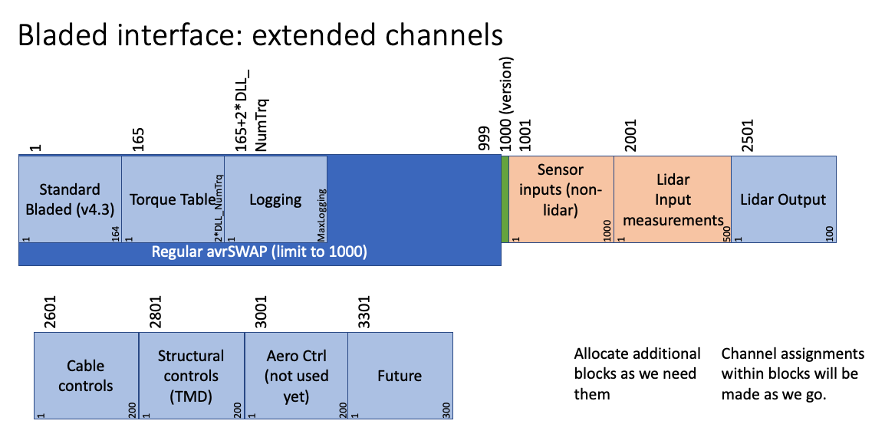

.. _exbladed:

Extended Bladed Interface
=========================

The Bladed style DLL controller interface was extended to allow for a
significant number of new channels arranged in channel groups in reserved
ranges. This is shown in :numref:`fig:BlEx` below.

   Channel scheme for extension to the Bladed DLL interface.

The ServoDyn summary file contains a summary of all DLL inteface channels in
use, as well as blocks of channels that are reserved.

.. container::
   :name: SrvDSum 

   .. literalinclude:: SrvD--Ex.sum
      :language: none

