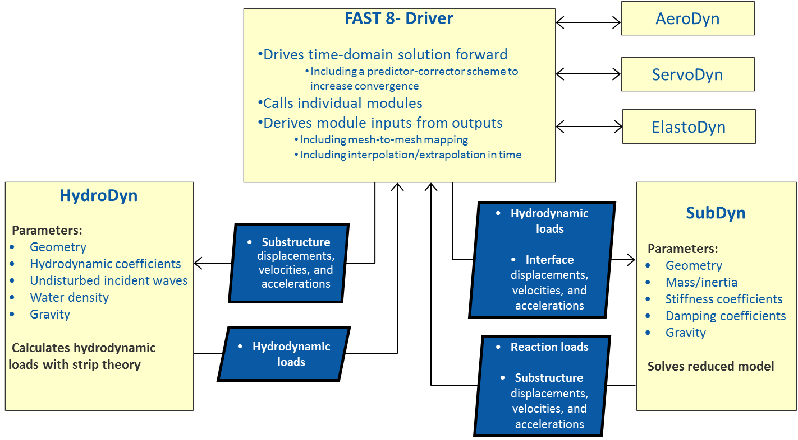

.. _sd_intro:

Introduction
============

`SubDyn <https://nwtc.nrel.gov/SubDyn>`__ is a time-domain
structural-dynamics module for multimember fixed-bottom substructures
created by the National Renewable Energy Laboratory (NREL) through U.S.
Department of Energy Wind and Water Power Program support. The module
has been coupled into the FAST aero-hydro-servo-elastic computer-aided
engineering (CAE) tool. Substructure types supported by SubDyn include
monopiles, tripods, jackets, and other non-floating lattice-type
substructures common for offshore wind installations in shallow and
transitional water depths. SubDyn can also be used to model lattice
support structures for land-based wind turbines.

The new SubDyn module follows the requirements of the FAST
modularization framework, couples to
`OpenFAST <http://wind.nrel.gov/designcodes/simulators/fast8/>`__, and
provides new capabilities (relative to prior released versions of the
software) for modeling the dynamic loading on multimember substructures.
(Refer to Appendix E and the *changelog.txt* file that is provided in
the archives for more details about changes among different versions.)
SubDyn can also be driven as a standalone code to compute the mode
shapes, natural frequencies, and time-domain responses of substructures
under prescribed motion at the interface to the tower, uncoupled from
FAST and in the absence of external loading other than gravity.

SubDyn relies on two main engineering schematizations: (1) a linear
frame finite-element beam model (LFEB), and (2) a dynamics system
reduction via the Craig-Bampton(C-B) method, together with a
static-improvement method (SIM), greatly reducing the number of modes
needed to obtain an accurate solution. More details can be found in
Section 6, and in :cite:`song2013`, :cite:`damiani2013`, 
:cite:`damiani2013omae`, :cite:`jonkmantcf`.

In SubDyn, the substructure is considered to be either clamped or
supported by springs at the seabed, and rigidly connected to the
transition piece (TP) at the substructure top nodes (interface nodes).
The spring constants are provided by the user to simulate
soil-structure-interaction (SSI). Other restraint formulations may be
implemented in the future. Only the substructure structural dynamics are
intended to be modeled within SubDyn. When integrated with FAST, the
structural dynamics of the TP, tower, and rotor-nacelle assembly (RNA)
are modeled within FAST’s ElastoDyn module and hydrodynamics are modeled
within FAST’s `HydroDyn <https://nwtc.nrel.gov/HydroDyn>`__ module. For
full lattice support structures or other structures with no transition
piece, however, the entire support structure up to the yaw bearing may
be modeled within SubDyn. Modeling the tower in SubDyn as opposed to
ElastoDyn, for example, allows for the possibility of including more
than the first two fore-aft and side-to-side bending modes, thus
accounting for more general flexibility of the tower and its segments.
However, for tubular towers, the structural model in ElastoDyn tends to
be more accurate because ElastoDyn considers geometric nonlinearities
not treated in SubDyn.

Loads and responses are transferred between SubDyn, HydroDyn, and
ElastoDyn via the FAST driver program (glue code) to enable
hydro-elastic interaction at each coupling time step. At the interface
nodes, the TP six degree-of-freedom (DOF) displacements (three
translations and three rotations), velocities, and accelerations are
inputs to SubDyn from ElastoDyn; and the six reaction loads at the TP
(three forces and three moments) are outputs from SubDyn to ElastoDyn.
SubDyn also outputs the local substructure displacements, velocities,
and accelerations to HydroDyn in order to calculate the local
hydrodynamic loads that become inputs for SubDyn. In addition, SubDyn
can calculate member internal reaction loads, as requested by the user
(see Figure 1).

.. _sd_flow-chart:

           
   SubDyn, HydroDyn, and FAST 8 coupled interaction

The input file defines the substructure geometry, material properties,
restraints and SSI data files, finite-element resolution, number of
retained modes in the dynamics system reduction, modal damping
coefficients, and auxiliary parameters. The geometry is defined by joint
coordinates in the global reference system (inertial-frame coordinate
system shown in ), with the origin at the intersection of the
undeflected tower centerline with mean sea level (MSL) or ground level
for land-based structures. A member connects two joints; multiple
members may use a common joint. Nodes are the result of the member
refinement into multiple (***NDiv*** input parameter) elements (nodes
are located at the ends of each element, as shown in ), and they are
calculated by the module.

In the current release, the geometry of a member is defined by its outer
diameter and wall thickness (assuming a tubular geometry), and the
material properties are defined by its Young’s modulus, shear modulus,
and mass density. Member properties are specified at the joints; if
properties change from one joint to the other, they will be linearly
interpolated for the inner elements. Thus, a tapered member will be
treated as a cylindrical member with step-wise variation of its
properties. In a future release, a tapered finite-element formulation
will be implemented, and a more accurate representation of a tapered
member will become available.

The hydrodynamic loads (including buoyancy) are computed by HydroDyn and
transferred by the glue code at those nodes that are underwater
(submerged nodes). Additionally, the self-weight distributed load
components (from gravity) are calculated by SubDyn and applied at all
the nodes. Note that other load and inertial properties may be input via
the HydroDyn module input file, where marine growth and
flooding/ballasting of the members can be specified.

This document is organized as follows. Section :ref:`running-subdyn` details how to obtain
the SubDyn and FAST software archives and run either the stand-alone
version of SubDyn or SubDyn coupled to FAST. Section :ref:`sd_input-files` describes the
SubDyn input files. Section 4 discusses the :ref:`sd_output-files` generated by
SubDyn; these include echo files, a summary file, and the results file.
Section 5 provides modeling guidance when using SubDyn. The SubDyn
theory is covered in Section :ref:`subdyn-theory`. Section :ref:`sd_future-work` outlines future work, and
Section 8 contains a list of references. Example input files are shown
in Appendices :numref:`sd_appendix_A` and B. A summary of available output channels are found
in Appendix :ref:`sd_appendix_D`. Instructions for compiling the stand-alone SubDyn program
are detailed in Appendix D. Appendix E tracks the major changes that
have been made to SubDyn for each public release.
   
