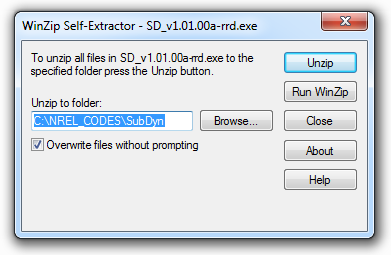

.. _running-subdyn:

Running SubDyn
===============

This section discusses how to obtain and execute SubDyn from a personal
computer. Both the stand-alone version and the FAST-coupled version of
the software are considered.

Downloading the SubDyn Software
--------------------------------

There are two forms of the SubDyn software to choose from: stand alone
and coupled to the FAST simulator. Although the user may not necessarily
need both forms, he/she would likely need to be familiar with and run
the stand-alone model if building a model of the substructure from
scratch. The stand-alone version is also helpful for model
troubleshooting and may benefit users who are interested in conducting
aero-hydro-servo-elastic simulations of an offshore wind turbine. For
this reason, SubDyn can be obtained from two different repositories: one
for the stand-alone SubDyn and one for the coupled solution through
FAST.

Stand-Alone SubDyn Archive
~~~~~~~~~~~~~~~~~~~~~~~~~~~

Users can refer to :numref:`installation` download the stand-alone SubDyn archive from our Web server at
`*https://nwtc.nrel.gov/SubDyn* <https://nwtc.nrel.gov/SubDyn>`__. The
file has a name similar to *SD\_v1.03.00a-rrd.exe*, but may have a
different version number. The user can then download the self-extracting
archive (.exe) to expand the archive into a folder he/she specifies.

.. _self-extractor:

           
   WinZip Self-Extractor main window --TO REPLACE WITH CURRENT
ARCHIVE METHODS ETC.

The archive contains the **bin**, **CertTest**, **Compiling**,
**Documentation**, and **Source** folders. The **bin** folder
includes the main executable file, *SubDyn\_win32.exe*, which is used to
execute the stand-alone SubDyn program. The **CertTest** folder
contains a collection of sample SubDyn input files and driver input
files that can be used as templates for the user’s own models. If the
user runs the *CertTest.bat* DOS script, he/she can compare the results
to the ones stored in the **NREL\_Results** subfolder. This manual may
be found in the **Documentation** folder. The **Compiling** folder
contains files for compiling the stand-alone *SubDyn\_win32.exe* file
with either Visual Studio or gFortran. The Fortran source code is
located in the **Source** folder.

FAST Archive
~~~~~~~~~~~~

Download the FAST archive, which includes a coupling to SubDyn, from our
Web server at https://nwtc.nrel.gov/FAST8. The file has a name similar
to *FAST\_v8.08.00.exe*, but may have a different version number. Run
the downloaded self-extracting archive (*.exe*) to expand the archive
into a user-specified folder. The FAST executable file is located in the
archive’s **bin** folder. Example models using the NREL 5-MW reference
turbine and various substructures are located in the **CertTest**
folder. These include Test19: OC3-Monopile, Test20: OC3-Tripod, Test21:
OC4-jacket.

Running SubDyn
---------------

Running the Stand-Alone SubDyn Program
~~~~~~~~~~~~~~~~~~~~~~~~~~~~~~~~~~~~~~~

The stand-alone SubDyn program, *SubDyn\_win32.exe*, simulates
substructure dynamic responses of the user’s input model, without
coupling to FAST. Unlike the coupled version, the stand-alone software
requires the use of a driver file in addition to the primary SubDyn
input file. This driver file specifies inputs normally provided to
SubDyn by FAST, including motions of the TP reference point. Both the
SubDyn summary file and the results output file are available when using
the stand-alone SubDyn (see Section 4 for more information regarding the
SubDyn output files).

Run the standalone SubDyn software from a DOS command prompt by typing,
for example:

.. code-block:: bash
	
    >SubDyn_win32.exe MyDriverFile.dvr

where, *MyDriverFile.dvr* is the name of the SubDyn driver file, as
described in Section :numref:`main-input-file`. The SubDyn primary input file is described in
Section :numref:`driver-input-file`.

Running SubDyn Coupled to FAST  
~~~~~~~~~~~~~~~~~~~~~~~~~~~~~~~

Run the coupled FAST software from a DOS command prompt by typing, for
example:

.. code-block:: bash

    >FAST_Win32.exe Test21.fst

where, *Test21.fst* is the name of the primary FAST input file. This
input file has a feature switch to enable or disable the SubDyn
capabilities within FAST, and a corresponding reference to the SubDyn
input file. See the documentation supplied with FAST for further
information.
