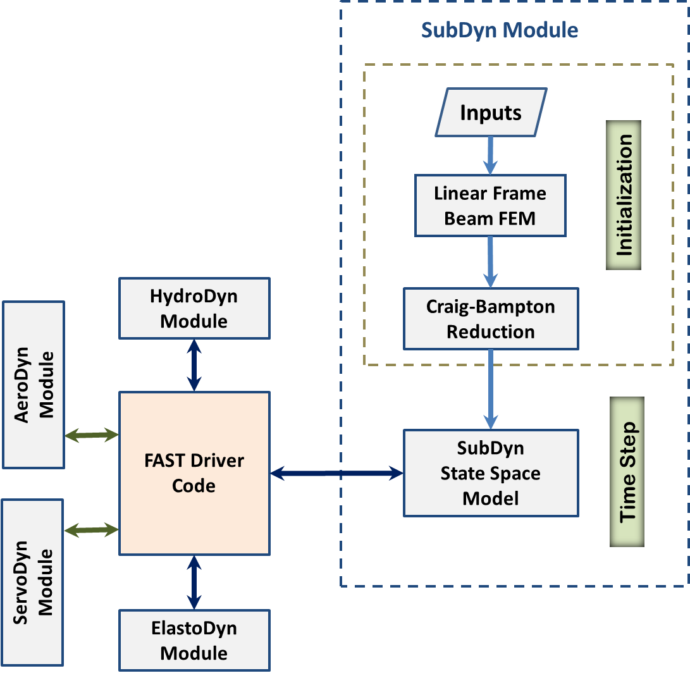
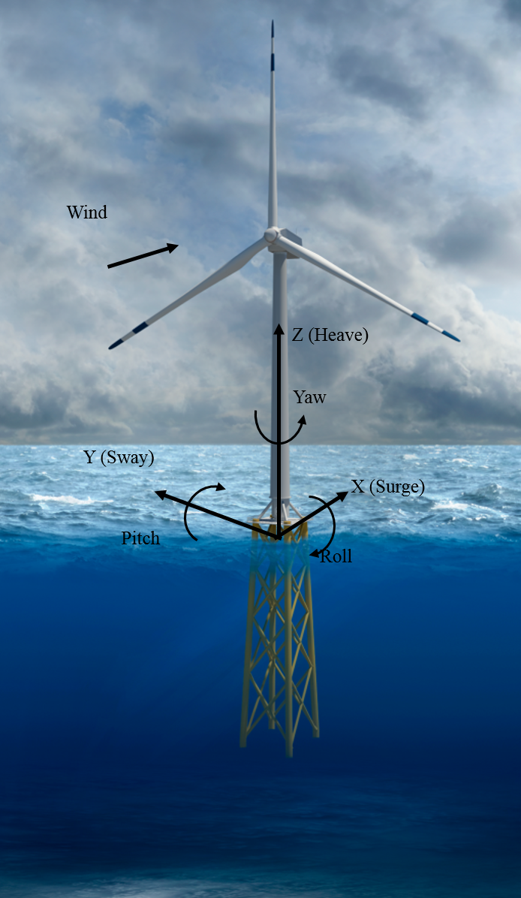
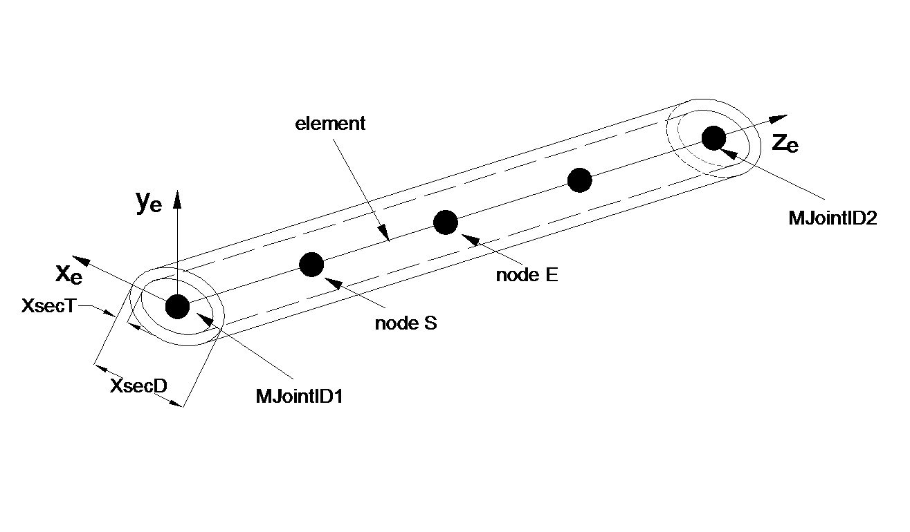
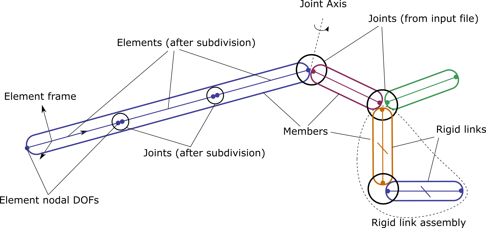
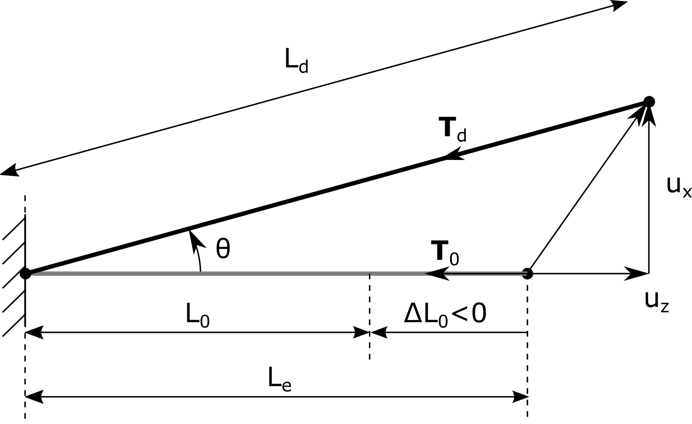
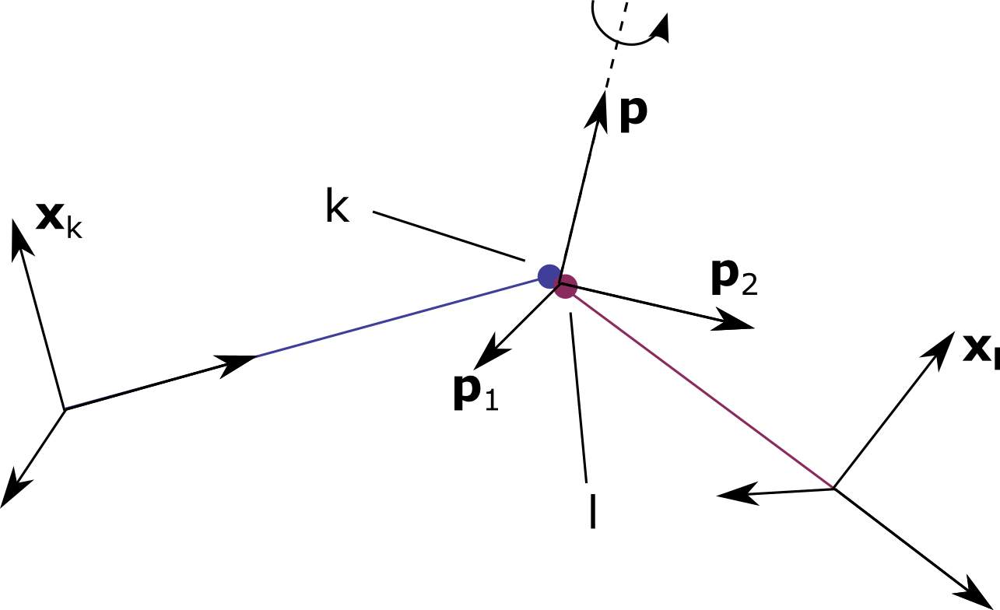
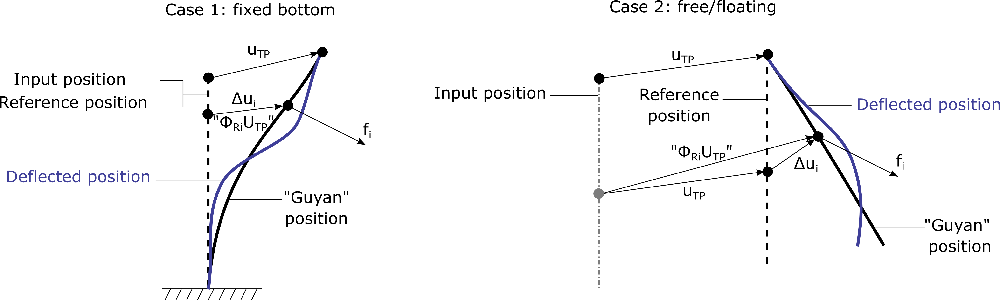

.. _subdyn-theory:

SubDyn Theory
=============

Overview
--------

This section focuses on the theory behind the SubDyn module.

SubDyn relies on two main engineering approaches: (1) a linear frame
finite-element model (LFEM), and (2) a dynamics system reduction
via the Craig-Bampton (C-B) method together with a static-improvement
method (SIM), greatly reducing the number of modes needed to obtain an
accurate solution.

There are many nonlinearities present in offshore wind substructure
models, including material nonlinearity, axial shortening caused by
bending, large displacements, and so on. The material nonlinearity is
not considered here because most offshore multimember support structures
are designed to use steel and the maximum stress is intended to be below
the yield strength of the material. :cite:`damiani2013omae` demonstrate
that a linear finite-element method is suitable when analyzing wind
turbine substructures. In this work, several wind turbine configurations
that varied in base geometry, load paths, sizes, supported towers, and
turbine masses were analyzed under extreme loads using nonlinear and
linear models. The results revealed that the nonlinear behavior was
mainly caused by the mono-tower response and had little effect on the
multimember support structures. Therefore, an LFEM model for the
substructure is considered appropriate for wind turbine substructures.
The LFEM can accommodate different element types, including
Euler-Bernoulli and Timoshenko beam elements of either constant or
longitudinally tapered cross sections (Timoshenko beam elements account
for shear deformation and are better suited to represent low aspect
ratio beams that may be used within frames and to transfer the loads
within the frame).

The large number of DOFs (~ :math:`{10^3}`) associated with a standard
finite-element analysis of a typical multimember structure would hamper
computational efficiency during wind turbine system dynamic simulations.
As a result, the C-B system reduction was implemented to speed up
processing time while retaining a high level of fidelity in the overall
system response. The C-B reduction is used to recharacterize the
substructure finite-element model into a reduced DOF model that
maintains the fundamental low-frequency response modes of the structure.
In the SubDyn initialization step, the large substructure physical DOFs
(displacements) are reduced to a small number of modal DOFs and
interface (boundary) DOFs, and during each time step, only the equations
of motion of these DOFs need to be solved. SubDyn only solves the
equations of motion for the modal DOFs, the motion of the interface
(boundary) DOFs are either prescribed when running SubDyn in stand-alone
mode or solved through equations of motion in ElastoDyn when SubDyn is
coupled to FAST.

Retaining just a few DOFs may, however, lead to the exclusion of axial
modes (normally of very high frequencies), which are important to
capture static load effects, such as those caused by gravity and
buoyancy. The so-called SIM was implemented to mitigate this problem.
SIM computes two static solutions at each time step: one based on the
full system stiffness matrix and one based on the C-B reduced stiffness
matrix. At each time step the time-varying, C-B based, dynamic solution
is superimposed on the difference between the two static solutions,
which amounts to quasi-statically accounting for the contribution of
those modes not directly included within the dynamic solution.

In SubDyn, the substructure is considered to be clamped, or connected
via linear spring-like elements, at the bottom nodes (normally at the
seabed) and rigidly connected to the TP at the substructure top nodes
(interface nodes). The user can provide 6x6, equivalent stiffness and
mass matrices for each of the bottom nodes to account for soil-pile
interaction. As described in other sections of this document, the input
file defines the substructure geometry, material properties, and
constraints. Users can define: element types; full finite-element mode
or C-B reduction; the number of modes to be retained in the C-B
reduction; modal damping coefficients; whether to take advantage of SIM;
and the number of elements for each member.

The following sections discuss the integration of SubDyn within the FAST
framework, the main coordinate systems used in the module, and the
theory pertaining to the LFEM, the C-B reduction, and SIM. The
state-space formulations to be used in the time-domain simulation are
also presented. The last section discusses the calculation of the base
reaction calculation. For further details, see also :cite:`song2013`.

Integration with the FAST Modularization Framework
--------------------------------------------------

Based on a new modularization framework :cite:`jjonkman2013`, FAST joins an
aerodynamics module, a hydrodynamics module, a control and electrical
system (servo) module, and structural-dynamics (elastic) modules to
enable coupled nonlinear aero-hydro-servo-elastic analysis of land-based
and offshore wind turbines in the time domain.  :numref:`flow-chart2` shows the basic
layout of the SubDyn module within the FAST modularization framework.

.. _flow-chart2:

           
   SubDyn layout within the modularization framework

In the existing loosely coupled time-integration scheme, the glue-code
transfers data at each time step. Such data includes hydrodynamic loads,
substructure response, loads transmitted to the TP, and TP response
among SubDyn, HydroDyn, and ElastoDyn. At the interface nodes, the TP
displacement, rotation, velocity, and acceleration are inputs to SubDyn
from ElastoDyn, and the reaction forces at the TP are outputs of SubDyn
for input to ElastoDyn. SubDyn also outputs the substructure
displacements, velocities, and accelerations for input to HydroDyn to
calculate the hydrodynamic loads that become inputs for SubDyn. In
addition, SubDyn can calculate the member forces, as requested by the
user. Within this scheme, SubDyn tracks its states and integrates its
equations through its own solver.

In a tightly coupled time-integration scheme (yet to be implemented),
SubDyn sets up its own equations, but its states and those of other
modules are tracked and integrated by a solver within the glue-code that
is common to all of the modules.

SubDyn is implemented in a state-space formulation that forms the
equation of motion of the substructure system with physical DOFs at the
boundaries and modal DOFs representing all interior motions. At each
time step, loads and motions are exchanged between modules through the
driver code; the modal responses are calculated inside SubDyn’s
state-space model; and the next time-step responses are calculated by
the SubDyn integrator for loose coupling and the global system
integrator for tight coupling.

Coordinate Systems
------------------

.. _global-cs:

           
   Global (coincident with the substructure) coordinate system.
   Also shown are the DOFs associated with the TP reference point.

Global and Substructure Coordinate System: (*X*, *Y*, *Z*) or (:math:`{X_{SS}, Y_{SS}, Z_{SS}}`) (:numref:`global-cs`)
~~~~~~~~~~~~~~~~~~~~~~~~~~~~~~~~~~~~~~~~~~~~~~~~~~~~~~~~~~~~~~~~~~~~~~~~~~~~~~~~~~~~~~~~~~~~~~~~~~~~~~~~~~~~~~~~~~~~~~

-  The global axes are represented by the unit vectors :math:`{\hat{I}, \hat{J}}`, and :math:`{\hat{K}}`.

-  The origin is set at the intersection between the undeflected tower
   centerline and the horizontal plane identified by the mean sea level
   (MSL) for offshore systems or ground level for land-based systems.

-  The positive *Z* (:math:`{Z_{SS}}`) axis is vertical and pointing upward, opposite
   gravity.

-  The positive *X* (:math:`{X_{SS}}`) axis is along the nominal (zero-degree)
   wind and wave propagation direction.

-  The *Y* (:math:`{Y_{SS}}`) axis is transverse and can be found assuming a
   right-handed Cartesian coordinate system (directed to the left when
   looking in the nominal downwind direction).

Member or Element Local Coordinate System (:math:`{x_e, y_e, z_e}`) (:numref:`element-cs`) 
~~~~~~~~~~~~~~~~~~~~~~~~~~~~~~~~~~~~~~~~~~~~~~~~~~~~~~~~~~~~~~~~~~~~~~~~~~~~~~~~~~~~~~~~~~

-  Axes are represented by the unit vectors :math:`{\hat{i}_e, \hat{j}_e, \hat{k}_e}`.

-  The origin is set at the shear center of the cross section at the
   start node (S,MJointID1).

-  The local  :math:`z_{e}` axis is along the elastic axis of the member, directed from
   the start node (S) to the end node (E,MJointID2). Nodes are ordered
   along the member main axis directed from start joint to end joint
   (per user's input definition).

-  The local  :math:`x_{e}` axis is parallel to the global :math:`\text{XY}` plane, and
   directed such that a positive, less than or equal to 180 :math:`^\circ` rotation
   about it, would bring the local :math:`z_{e}` axis parallel to the global *Z* axis.

-  The local :math:`y_{e}` axis can be found assuming a right-handed Cartesian
   coordinate system.

.. _element-cs:

           
   The element coordinate system. The sketched member contains four elements, and the second element is called out with nodes S and E.

Local to Global Transformation
~~~~~~~~~~~~~~~~~~~~~~~~~~~~~~

The transformation from local to global coordinate system can be
expressed by the following equation:

   .. math:: 	:label: loc2glb
   
      \begin{bmatrix} \Delta X \\ \Delta Y \\ \Delta Z \end{bmatrix}  =  [ \mathbf{D_c} ]  \begin{bmatrix} \Delta x_e \\ \Delta y_e \\ \Delta z_e \end{bmatrix} 
	
where :math:`\begin{bmatrix} \Delta x_e \\ \Delta y_e \\ \Delta z_e \end{bmatrix}` is a generic vector in the local coordinate system, and 
:math:`\begin{bmatrix} \Delta X \\ \Delta Y \\ \Delta Z \end{bmatrix}` the same
vector but in the global coordinate system; and :math:`[ \mathbf{D_c} ]` is the direction cosine
matrix of the member axes and can be obtained as follows:
   
   .. math:: 	:label: Dc
   
      [ \mathbf{D_c} ] = \begin{bmatrix}  
                         \frac{Y_E-Y_S}{L_{exy}}  & \frac{ \left ( X_E-X_S \right) \left ( Z_E-Z_S \right)}{L_{exy} L_{e}} & \frac{X_E-X_S}{L_{e}} \\
                         \frac{-X_E+X_S}{L_{exy}} & \frac{ \left ( Y_E-Y_S \right) \left ( Z_E-Z_S \right)}{L_{exy} L_{e}} & \frac{Y_E-Y_S}{L_{e}} \\
                         0                        & \frac{ -L_{exy} }{L_{e}} & \frac{Z_E-Z_S}{L_{e}} 
                         \end{bmatrix}
                         
Where :math:`{\left ( X_s,Y_s,Z_s \right )}` and :math:`{\left ( X_E,Y_E,Z_E \right )}`
are the start and end joints of the member (or nodes of the element of interest) in global coordinate system ; 
:math:`{L_{exy}= \sqrt{ \left ( X_E-X_S \right )^2 + \left ( Y_E-Y_S \right )^2}}` and :math:`{L_{e}= \sqrt{ \left ( X_E-X_S \right )^2 + \left ( Y_E-Y_S \right )^2 + \left ( Z_E-Z_S \right )^2}}`.

If :math:`{X_E = X_S}` and :math:`{Z_E = Z_S}`, the :math:`{[ \mathbf{D_c} ]}` matrix can be found as follows:

if :math:`{Z_E >= Z_S}` then

 .. math:: 	:label: Dc_spec1
   
      [ \mathbf{D_c} ] = \begin{bmatrix}  
                         1  & 0 & 0 \\
                         0  & 1 & 0 \\
                         0  & 0 & 1
                         \end{bmatrix}

else

 .. math:: 	:label: Dc_spec2
   
      [ \mathbf{D_c} ] = \begin{bmatrix}  
                         1  & 0  & 0 \\
                         0  & -1 & 0 \\
                         0  & 0  & -1
                         \end{bmatrix}

In the current SubDyn release, the transpose (global to local) of these
direction cosine matrices for each member is returned in the summary
file. Given the circular shape of the member cross sections, the
direction cosine matrices have little importance on the member load
verification. To verify joints following the standards (e.g., :cite:`iso19902` :cite:`api2014`
), however, the bending moments need to be decomposed into
in-plane and out-of-plane components, where the plane is that defined by
either a pair of braces (for an X-joint), or by the pair brace(s) plus
leg (for a K-joint). It is therefore important to have the direction
cosines of the interested members readily available to properly
manipulate and transform the local shear forces and bending moments.

When member cross sections other than circular are allowed in future
releases, the user will need to input cosine matrices to indicate the
final orientation of the member principal axes with respect to the
global reference frame.

.. _SD_FEM:

Finite-Element Model - Elements and Constraints
-----------------------------------------------

Definitions
~~~~~~~~~~~

Figure :numref:`fig:ElementsDefinitions` is used to illustrate some of the definitions used. 
The model of the substructure is assumed to consists of
different members. 
A member is delimited by two joints. 
A joint is defined by the coordinates of a point of the
undeflected structure and a type (*JointType*). The type of a joint defines the
boundary condition or constraint of all the members that are attached to
this joint.
The following joints are supported: 

- Cantilever joints (*JointType=1*)

- Universal joint (*JointType=2*)

- Pin joint (*JointType=3*)

- Ball joint (*JointType=4*)

A member is one of the three following types:

- Beams (*MType=1*), Euler-Bernoulli (*FEMMod=1*) or Timoshenko (*FEMMod=3*)

- Pretension cables (*MType=2*)

- Rigid link (*MType=3*)

Beam members may be split into several elements to increase the accuracy of the model (using
the input parameter *NDiv*). Member of other types (rigid links and
pretension cables) are not split. In this document, the term *element*
refers to: a sub-division of a beam member or a member of another type
than beam (rigid-link or pretension cable). The term *joints* refers to
the points defining the extremities of the members. Some joints are
defined in the input file, while others arise from the subdivision of
beam members. The end points of an elements are called nodes and each
node consists of 6 degrees of freedom (DOF) for the element implemented.
In the current implementation, no geometrical offsets are assumed between a joint and the node of an
element, or between the nodes of connected elements.

   Definitions of members, element, joints, nodes and rigid assemblies.

.. _SD_FEM_Process:

FEM process - from elements to system matrices
~~~~~~~~~~~~~~~~~~~~~~~~~~~~~~~~~~~~~~~~~~~~~~~

The process to obtain a FE representation of the system (performed at initialization) is as follows:

- Elements: The mass and stiffness matrices of each element are computed and transformed to global coordinates using directional cosine matrices

- Assembly: The element matrices are inserted into the full system matrices. The DOFs of cantilever joints are mapped to each other. The translational DOFs of the nodes linked by a joint different from a cantilever joint are mapped to each other, but the rotational DOFs of each individual nodes are retained in this system. The vector of degrees of freedom of this full system is noted :math:`\boldsymbol{x}`

- Constraints elimination: A direct-elimination technique is used to apply the constraints introduced by the joints and the rigid links. The elimination consists in forming a matrix :math:`\boldsymbol{T}` and a reduced set of degrees of freedom :math:`\boldsymbol{\tilde{x}}` such that :math:`\boldsymbol{x}=\boldsymbol{T} \boldsymbol{\tilde{x}}`.

- CB-reduction: The Craig-Bampton reduction technique is used to obtain a reduced set of degrees of freedom (interface DOFs and Craig-Bampton modes)

- Boundary conditions: The displacements boundary conditions are then applied (e.g. for a fixed bottom foundation) 

The remaining of the section focuses on the element matrices, 
and the account of the constraints introduced by the joints and rigid links.
The Craig-Bampton reduction is described in :numref:`GenericCBReduction`. 

Self-Weight Loads  
~~~~~~~~~~~~~~~~~
The loads caused by self-weight are precomputed during initialization
based on the undisplaced configuration. It is therefore assumed that the
displacements will be small and that P-delta effects are small for the
substructure. 
The "extra" moment may be accounted for using the flag **GuyanLoadCorrection**, 
see section :numref:`SD_ExtraMoment`.
For a nontapered beam element, the lumped loads caused by
gravity to be applied at the end nodes are as follows (in the global
coordinate system):

.. math::  :label: FG

	\left\{ F_G \right\} = \rho A_z g 
                       \begin{bmatrix} 0 \\
                       0 \\
                       -\frac{L_e}{2} \\
		       -\frac{L_e^2}{12} D_{c2,3} \\
		        \frac{L_e^2}{12} D_{c1,3} \\
		       0\\
		       0\\
		       0\\
                       -\frac{L_e}{2}\\
		        \frac{L_e^2}{12} D_{c2,3}\\
		       -\frac{L_e^2}{12} D_{c1,3}\\
		       0
		     \end{bmatrix}

Note also that if lumped masses exist (selected by the user at
prescribed joints), their contribution will be included as concentrated
forces along global *Z* at the relevant nodes.

Beam Element Formulation    
~~~~~~~~~~~~~~~~~~~~~~~~

The uniform and tapered Euler-Bernoulli beam elements are
displacement-based and use third-order interpolation functions that
guarantee the displacement and rotation continuity between elements. The
uniform Timoshenko beam element is derived by introducing the shear
deformation into the uniform Euler-Bernoulli element, so the
displacements are represented by third-order interpolation functions as
well.
Following the classic Timoshenko beam theory, the generic two-node
element stiffness and consistent mass matrices can be written as follows
(see, for instance, :cite:`panzer2009`):

.. raw:: latex

    \renewcommand*{\arraystretch}{1.0}

.. math:: 	:label: ke0

    \setcounter{MaxMatrixCols}{20}

    {\scriptstyle
    [k_e]= 
            \begin{bmatrix}
                         \frac{12 E J_y} {L_e^3 \left(  1+ K_{sy} \right)} & 0                                                & 0                 & 0                                                                      & \frac{6 E J_y}{L_e^2 \left(  1+ K_{sy} \right)}                        & 0                 & -\frac{12 E J_y}{L_e^3 \left(  1+ K_{sy} \right)}  & 0                                                   & 0                  & 0                                                                     & \frac{6 E J_y}{L_e^2 \left(  1+ K_{sy} \right)}                       & 0 \\
                                                                           & \frac{12 E J_x}{L_e^3 \left(  1+ K_{sx} \right)} & 0                 & -\frac{6 E J_x}{L_e^2 \left (  1+ K_{sx} \right )}                     & 0                                                                      & 0                 & 0                                                  & -\frac{12 E J_x}{L_e^3 \left (  1+ K_{sx} \right )} & 0                  & -\frac{6 E J_x}{L_e^2 \left (  1+ K_{sx} \right )}                    & 0                                                                     & 0 \\
                                                                           &                                                  & \frac{E A_z}{L_e} & 0                                                                      & 0                                                                      & 0                 & 0                                                  & 0                                                   & -\frac{E A_z}{L_e} & 0                                                                     & 0                                                                     & 0 \\
                                                                           &                                                  &                   & \frac{\left(4 + K_{sx} \right) E J_x}{L_e \left (  1+ K_{sx} \right )} & 0                                                                      & 0                 & 0                                                  & \frac{6 E J_x}{L_e^2 \left (  1+ K_{sx} \right )}   & 0                  & \frac{\left( 2-K_{sx} \right) E J_x}{L_e \left (  1+ K_{sx} \right )} & 0                                                                     & 0  \\
                                                                           &                                                  &                   &                                                                        & \frac{\left(4 + K_{sy} \right) E J_y}{L_e \left (  1+ K_{sy} \right )} & 0                 & -\frac{6 E J_y}{L_e^2 \left (  1+ K_{sy} \right )} & 0                                                   & 0                  & 0                                                                     & \frac{\left( 2-K_{sy} \right) E J_y}{L_e \left (  1+ K_{sy} \right )} & 0  \\
                                                                           &                                                  &                   &                                                                        &                                                                        & \frac{G J_z}{L_e} & 0                                                  & 0                                                   & 0                  & 0                                                                     & 0                                                                     & -\frac{G J_z}{L_e} \\
                                                                           &                                                  &                   &                                                                        &                                                                        &                   & k_{11}                                             & 0                                                   & 0                  & 0                                                                     & -\frac{6 E J_y}{L_e^2 \left (  1+ K_{sy} \right )}                    & 0  \\
                                                                           &                                                  &                   &                                                                        &                                                                        &                   &                                                    & k_{22}                                              & 0                  & \frac{6 E J_x}{L_e^2 \left (  1+ K_{sx} \right )}                     & 0                                                                     & 0  \\
                                                                           &                                                  &                   &                                                                        &                                                                        &                   &                                                    &                                                     & k_{33}             & 0                                                                     & 0                                                                     & 0 \\
                                                                           &                                                  &                   &                                                                        &                                                                        &                   &                                                    &                                                     &                    & k_{44}                                                                & 0                                                                     & 0   \\
                                                                           &                                                  &                   &                                                                        &                                                                        &                   &                                                    &                                                     &                    &                                                                       & k_{55}                                                                & 0   \\
                                                                           &                                                  &                   &                                                                        &                                                                        &                   &                                                    &                                                     &                    &                                                                       &                                                                       & k_{66} \\
                 \end{bmatrix}
     }

.. math:: 	:label: me0

	[m_e]= \rho \\
            \left[\begin{array}{*{12}c}
                         \frac{13 A_z L_e}{35}+\frac{6 J_y}{5 L_e} & 0                                                  & 0                 & 0                                                                      & \frac{11 A_z L_e^2}{210}+\frac{J_y}{5 L_e}                             & 0                 & \frac{9 A_z L_e}{70}-\frac{6 J_y}{5 L_e}           & 0                                                   & 0                  & 0                                                                      & -\frac{13 A_z L_e^2}{420}+\frac{J_y}{10}                               & 0 \\
                                                                   & \frac{12 E J_x}{L_e^3 \left (  1+ K_{sx} \right )} & 0                 & -\frac{6 E J_x}{L_e^2 \left (  1+ K_{sx} \right )}                     & 0                                                                      & 0                 & 0                                                  & -\frac{12 E J_x}{L_e^3 \left (  1+ K_{sx} \right )} & 0                  & -\frac{6 E J_x}{L_e^2 \left (  1+ K_{sx} \right )}                     & 0                                                                      & 0 \\
                                                                   &                                                    & \frac{E A_z}{L_e} & 0                                                                      & 0                                                                      & 0                 & 0                                                  & 0                                                   & -\frac{E A_z}{L_e} & 0                                                                      & 0                                                                      & 0 \\
                                                                   &                                                    &                   & \frac{\left(4 + K_{sx} \right) E J_x}{L_e \left (  1+ K_{sx} \right )} & 0                                                                      & 0                 & 0                                                  & \frac{6 E J_x}{L_e^2 \left (  1+ K_{sx} \right )}   & 0                  & \frac{\left( 2-K_{sx} \right) E J_x}{L_e \left (  1+ K_{sx} \right )}  & 0                                                                      & 0  \\
                                                                   &                                                    &                   &                                                                        & \frac{\left(4 + K_{sy} \right) E J_y}{L_e \left (  1+ K_{sy} \right )} & 0                 & -\frac{6 E J_y}{L_e^2 \left (  1+ K_{sy} \right )} & 0                                                   & 0                  & 0                                                                      & \frac{\left( 2-K_{sy} \right) E J_y}{L_e \left (  1+ K_{sy} \right )}  & 0  \\
                                                                   &                                                    &                   &                                                                        &                                                                        & \frac{G J_z}{L_e} & 0                                                  & 0                                                   & 0                  & 0                                                                      & 0                                                                      & -\frac{G J_z}{L_e} \\
                                                                   &                                                    &                   &                                                                        &                                                                        &                   & \frac{12 E J_y}{L_e^3 \left (  1+ K_{sy} \right )} & 0                                                   & 0                  & 0                                                                      & -\frac{6 E J_y}{L_e^2 \left (  1+ K_{sy} \right )}                     & 0  \\
                                                                   &                                                    &                   &                                                                        &                                                                        &                   &                                                    & \frac{12 E J_x}{L_e^3 \left (  1+ K_{sx} \right )}  & 0                  & \frac{6 E J_x}{L_e^2 \left (  1+ K_{sx} \right )}                      & 0                                                                      & 0  \\
                                                                   &                                                    &                   &                                                                        &                                                                        &                   &                                                    &                                                     & \frac{E A_z}{L_e}  & 0                                                                      & 0                                                                      & 0 \\
                                                                   &                                                    &                   &                                                                        &                                                                        &                   &                                                    &                                                     &                    & \frac{\left(4 + K_{sx} \right) E J_x}{L_e \left (  1+ K_{sx} \right )} & 0                                                                      & 0   \\
                                                                   &                                                    &                   &                                                                        &                                                                        &                   &                                                    &                                                     &                    &                                                                        & \frac{\left(4 + K_{sy} \right) E J_y}{L_e \left (  1+ K_{sy} \right )} & 0   \\
                                                                   &                                                    &                   &                                                                        &                                                                        &                   &                                                    &                                                     &                    &                                                                        &                                                                        & \frac{G J_z}{L_e}\\
                 \end{array}\right]
                 
where :math:`A_z` is the element cross-section area, :math:`J_x, J_y, J_z` are the area second moments of
inertia with respect to principal axes of the cross section; :math:`L_e` is the
length of the undisplaced element from start-node to end-node; :math:`\rho, E, \textrm{and}\quad G` are material density, Young’s, and Shear moduli, respectively;
:math:`K_{sx}, K_{sy}` are shear correction factors as shown below (they are set to zero if
the E-B formulation is chosen):

.. math:: 	:label: Ksxy

	K_{sx}= \frac{12 E J_y}{G A_{sx} L_e^2} 
	
	K_{sy}= \frac{12 E J_x}{G A_{sy} L_e^2}
	
where the shear areas along the local *x* and *y* (principal) axes are
defined as:

.. math:: 	:label: Asxy

	A_{sx}= k_{ax} A_z
	
	A_{sy}= k_{ay} A_z

and

.. math:: 	:label: kaxy

   k_{ax} = k_{ay} = \dfrac{ 6 (1 + \mu)^2 \left(1 + \left( \frac{D_i}{D_o} \right)^2 \right)^2 } { \left(1+  \left( \frac{D_i}{D_o} \right)^2 \right)^2 (7 + 14 \mu + 8 \mu^2) + 4 \left( \frac{D_i}{D_o} \right)^2 (5+10 \mu +4 \mu^2)} 
   
   	

Eq. :eq:`kaxy` is from :cite:`steinboeck2013` for hollow circular cross sections,
with :math:`\mu` denoting Poisson’s ratio.

Before assembling the global system stiffness (*K*) and mass (*M*)
matrices, the individual :math:`{[k_e]}` and math:`{[m_e]}` are modified to the global coordinate
system via :math:`{[ \mathbf{D_c} ]}` as shown in the following equations:

.. math:: 	:label: ke1

	[k] =  \begin{bmatrix}     
                         [\mathbf{D_c}] & 0 & 0 & 0 \\
                         & [\mathbf{D_c}] & 0 & 0  \\
                         & & [\mathbf{D_c}] & 0  \\
                         & & & [\mathbf{D_c}] 
                 \end{bmatrix}  [k_e] \begin{bmatrix}    
                         [\mathbf{D_c}] & 0 & 0 & 0 \\
                         & [\mathbf{D_c}] & 0 & 0  \\
                         & & [\mathbf{D_c}] & 0  \\
                         & & & [\mathbf{D_c}] 
                 \end{bmatrix}^T  

.. math:: 	:label: me1

	[m] =  \begin{bmatrix}     
                         [\mathbf{D_c}] & 0 & 0 & 0 \\
                         & [\mathbf{D_c}] & 0 & 0  \\
                         & & [\mathbf{D_c}] & 0  \\
                         & & & [\mathbf{D_c}] 
                 \end{bmatrix}  [m_e] \begin{bmatrix}    
                         [\mathbf{D_c}] & 0 & 0 & 0 \\
                         & [\mathbf{D_c}] & 0 & 0  \\
                         & & [\mathbf{D_c}] & 0  \\
                         & & & [\mathbf{D_c}] 
                 \end{bmatrix}^T  

where *m* and *k* are element matrices in the global coordinate system.

.. _SD_PretensionCable:

Pretension Cable Element Formulation
~~~~~~~~~~~~~~~~~~~~~~~~~~~~~~~~~~~~

The master stiffness equations of FEM assumes that the forces vanish if
all displacements also vanish, that is, the relation between force and
displacement is linear,
:math:`\boldsymbol{f}=\boldsymbol{K}\boldsymbol{u}`. This assumption
does not hold if the material is subject to so-called initial strain,
initial stress of prestress. Such effects may be produced by temperature
changes and pretensions (or lack-of-fit fabrications). These effects are
for instance discussed in the notes of
Felippa :cite:`felippa`.

Pretension cables may be modelled by assuming an initial elongation of a
truss element and considering the restoring force this initial
elongation may have in both the longitudinal and orthogonal direction.

Derivation
^^^^^^^^^^

A pretension cable oriented along the :math:`z`-direction is considered.
To simplify the derivation, the left point is assumed fixed and only the
right point deflects. The notations are illustrated in :numref:`fig:FEPreTension`.

   Notations used for the derivation of the pretension cable equation

The length of the element prior to the pretension is written
:math:`L_0`, and its axial stiffness is :math:`k=EA/L_0`. In this
equilibrium position the stress in the cable is zero. The user inputs
for this elements are selected as: the un-displaced joint locations
(while pre-tensioned) :math:`\boldsymbol{x}_1` and
:math:`\boldsymbol{x}_2`, the elongation stiffness :math:`EA`, and the
change in length :math:`\Delta L_0 = L_0-L_e` (:math:`<0`). The
pretension force :math:`T_0` is a derived input. The following
quantities are defined:

.. math::

   \begin{aligned}
       L_e=\lVert\boldsymbol{x}_2-\boldsymbol{x}_1\rVert
       ,\quad
       \epsilon_0=\frac{T_0}{EA}
       ,\quad
       L_0=\frac{L_e}{1+\epsilon_0}\end{aligned}

The different variables are defined as function of the inputs as
follows:

.. math::

   \begin{aligned}
       L_0=L_e+\Delta L_0
       \qquad
       T_0= - E A \frac{\Delta L_0}{L_0}
       ,\qquad
       \epsilon_0=\frac{T_0}{EA} = \frac{-\Delta L_0}{L_0} = \frac{-\Delta L_0}{L_e+\Delta L_0 }\end{aligned}

The degrees of freedom for the deflections of the cable,
:math:`(u_x, u_z)`, are measured from a position which is not the
equilibrium position, but a position that is offset from the equilibrium
position, such that the pretensioned length of the element is
:math:`L_e>L_0`. The stress in the cable for :math:`u_z=0` is noted
:math:`\epsilon_0=(L_e-L_0)/L_0`, or :math:`L_e=L_0(1+\epsilon_0)`. The
initial tension in the cable is
:math:`\boldsymbol{T}_0=-k(L_e-L_0)\,\boldsymbol{e}_z=-  E A \epsilon_0\, \boldsymbol{e}_z`.
In its deflected position, the length of the cable is:

.. math::

   \begin{aligned}
      L_d =\sqrt{(L_e+u_z)^2 + u_x^2}
      =L_e\sqrt{1+\frac{2u_z}{L_e} + \frac{u_z^2}{L-e^2}+\frac{u_x^2}{L_e^2}}
      \approx L_e \left(1+\frac{u_z}{L_e}\right)
      \label{eq:PreTensionLength}\end{aligned}

where the deflections are assumed small compared to the element length
:math:`L_e`, :math:`u_x\ll L_e` and :math:`u_z\ll L_e`, and only the
first order terms are kept. The tension force in the deflected cable is
then :math:`\boldsymbol{T}_d=-k(L_d-L_0) \boldsymbol{e}_r` where the
radial vector is the vector along the deflected cable such that:

.. math::

   \begin{aligned}
       \boldsymbol{e}_r=\cos\theta \boldsymbol{e}_z +\sin\theta  \boldsymbol{e}_x 
           ,\quad\text{with}\quad
              \cos\theta=\frac{L_e+u_z}{L_d} 
               \approx 1
           ,\quad
             \sin\theta= \frac{u_x}{L_d} 
               \approx \frac{u_x}{L_e}(1-\frac{u_z}{L_e})
               \approx \frac{u_x}{L_e}
      \label{eq:PreTensionRadial}\end{aligned}

The components of the tension force are then:

.. math::

   \begin{aligned}
    T_{d,z}&= -k(L_d-L_0)\cos\theta \approx -\frac{EA}{L_0}(L_e-L_0+u_z)\,  1\,
        = -EA\epsilon_0-\frac{EA}{L_0}u_z 
        \nonumber
        \\
    T_{d,x}&= -k(L_d-L_0)\sin\theta \approx -\frac{EA}{L_0}(L_e-L_0+u_z)\frac{u_x}{L_e}
        \approx -EA\epsilon_0\frac{u_x}{L_e}
        = -\frac{EA\epsilon_0}{L_0(1+\epsilon_0)}u_x
            \label{eq:PreTensionForce}\end{aligned}

Finite element formulation of a pretension cable
^^^^^^^^^^^^^^^^^^^^^^^^^^^^^^^^^^^^^^^^^^^^^^^^

The rotational degrees of freedom are omitted for conciseness since
these degrees of freedom are not considered in this cable element. The
linear formulation from is applied to both nodes of a finite element,
interpreting the force at each node as the internal force that the
element exert on the nodes. Using this convention, the pretension cable
element can be represented with an element stiffness matrix
:math:`\boldsymbol{K}_e` and an additional nodal load vector
:math:`\boldsymbol{f}_{e,0}` such that the static equilibrium equation
of the element writes
:math:`\boldsymbol{f}_e=\boldsymbol{K}_e\boldsymbol{u}+\boldsymbol{f}_{e,0}`,
with:

.. math:: :label: StiffnessMatrixCable

   \begin{aligned}
     \begin{bmatrix} 
       f_{x,1}\\
       f_{y,1}\\
       f_{z,1}\\
       f_{x,2}\\
       f_{y,2}\\
       f_{z,2}\\
     \end{bmatrix} 
       =
           \frac{EA}{L_0}
     \begin{bmatrix} 
       \frac{\epsilon_0}{1+\epsilon_0}  & 0                                & 0  & -\frac{\epsilon_0}{1+\epsilon_0} & 0                                & 0 \\
       0                                & \frac{\epsilon_0}{1+\epsilon_0}  & 0  & 0                                & -\frac{\epsilon_0}{1+\epsilon_0} & 0 \\
       0                                & 0                                & 1  & 0                                & 0                                & -1\\
       -\frac{\epsilon_0}{1+\epsilon_0} & 0                                & 0  & \frac{\epsilon_0}{1+\epsilon_0}  & 0                                & 0 \\
       0                                & -\frac{\epsilon_0}{1+\epsilon_0} & 0  & 0                                & \frac{\epsilon_0}{1+\epsilon_0}  & 0 \\
       0                                & 0                                & -1 & 0                                & 0                                & 1 \\
       \end{bmatrix}
     \begin{bmatrix} 
       u_{x,1}\\
       u_{y,1}\\
       u_{z,1}\\
       u_{x,2}\\
       u_{y,2}\\
       u_{z,2}\\
     \end{bmatrix} 
       +
           EA\epsilon_0
     \begin{bmatrix} 
       0\\
       0\\
       -1\\
       0\\
       0\\
       1\\
     \end{bmatrix} 
       \end{aligned}

The relation above is expressed in the element coordinate system. The
stiffness matrix and force vector are transferred to the global system
during the assembly process. Inserting :math:`\epsilon_0=0` in the above
equations leads to the formulation of a truss element. The linear model
above is only valid for :math:`L_d-L_0>0`, that is
:math:`(L_e-L_0+u_{z,2}-u_{z,1})>0`, and the implementation should abort
if this condition is not reached at a given time. If the cable has a
positive mass density :math:`\rho`, the mass matrix of the element is
given by:

.. math::

   \begin{aligned}
   \boldsymbol{M}_e = \rho L_e
   \left[
   \begin{array}{*{12}c}
   13/35 & 0       & 0   & &         & & 9/70  & 0       & 0   & &         & \\
   0     & 13/35   & 0   & & \boldsymbol{0}_3 & & 0     & 9/70    & 0   & & \boldsymbol{0}_3 & \\
   0     & 0       & 1/3 & &         & & 0     & 0       & 1/6 & &         & \\
         &         &     & &         & &       &         &     & &         & \\
         & \boldsymbol{0}_3 &     & & \boldsymbol{0}_3 & &       & \boldsymbol{0}_3 &     & & \boldsymbol{0}_3 & \\
         &         &     & &         & &       &         &     & &         & \\
   9/70  & 0       & 0   & &         & & 13/35 & 0       & 0   & &         & \\
   0     & 9/70    & 0   & & \boldsymbol{0}_3 & & 0     & 13/35   & 0   & & \boldsymbol{0}_3 & \\
   0     & 0       & 1/6 & &         & & 0     & 0       & 1/3 & &         & \\
         &         &     & &         & &       &         &     & &         & \\
         & \boldsymbol{0}_3 &     & & \boldsymbol{0}_3 & &       & \boldsymbol{0}_3 &     & & \boldsymbol{0}_3 & \\
         &         &     & &         & &       &         &     & &         & \\
   \end{array}
   \right]
   \label{eq:MassMatrixPreTension}\end{aligned}

with :math:`L_e` the *undisplaced* length of the element (not
:math:`L_0`).

.. _SD_ControlCable:

Controlled pretension cable
^^^^^^^^^^^^^^^^^^^^^^^^^^^

The controller changes the rest length of the cable at each time step, effectively changing the pretension properties of the cable.
At a given time, the restlength of the cable is :math:`L_r(t)=L_e + \Delta L` (instead
of :math:`L_0`), and the pretension force is :math:`T(t)` (instead of
:math:`T_0`). The pretension force is given as:

.. math:: :label: tensionUnsteady

   \begin{aligned}
       T(t)= E A \frac{-\Delta L(t)}{L_r(t)} = E A \frac{-\Delta L(t)}{L_e + \Delta L(t)}
   \end{aligned}

At :math:`t=0`, when no controller action is present, the pretension force and length are:

.. math:: :label: tensionZero

   \begin{aligned}
           T(0) =T_0= E A \frac{-\Delta L_0}{L_e + \Delta L_0}
           ,\quad
           \Delta L(0) = \Delta L_0 = \frac{-L_e T_0}{EA+T_0}
   \end{aligned}

The quantity :math:`\Delta L` is the change in restlength, and it is given as:

.. math:: :label: DeltaLTot

   \begin{aligned}
       \Delta L(t) = \Delta L_0 + \Delta L_c(t)
   \end{aligned}

where :math:`\Delta L_c` is the change of length prescribed by the controller, and :math:`\Delta  L_0` 
is the change of length attributed to the initial pretension. This choice is such that the controller input is nominally 0. Cable extension beyond the element length
(:math:`L_e`) is not allowed in SubDyn, therefore :math:`\Delta L` is limited to
negative values (:math:`L_r=L_e+\Delta L <= L_e`). 
The tension force at a given time is given by inserting :eq:`DeltaLTot` into :eq:`tensionUnsteady`:

.. math::

   \begin{aligned}
       T(t)=- E A \frac{\Delta L_0 + \Delta L_c }{L_e + \Delta L_0 + \Delta L_c}
   \end{aligned}

In the following we provide details on the implementation and the approximation introduced.
The “equations of motions” for a cable element are written:

.. math::

   \begin{aligned}
       \boldsymbol{M}_e\boldsymbol{\ddot{u}}_e&= \boldsymbol{f}_e\end{aligned}

If the pretension force is constant (equal to :math:`T_0`), and additional external loads are neglected, then the element force is:

.. math::  :label: CstCableA

   \begin{aligned}
   \boldsymbol{f}_e=\boldsymbol{f}_e (t,T_0) &=-\boldsymbol{K}_c(T_0) \boldsymbol{u}_e + \boldsymbol{f}_c(T_0)+ \boldsymbol{f}_g 
        \end{aligned}

where :math:`\boldsymbol{f}_c(T_0)` and :math:`\boldsymbol{K}_c(T_0)`
are given in :eq:`StiffnessMatrixCable`. If the pretension force is varying with time
(:math:`T=T(t)`), then the force is:

.. math::  :label: VaryingCableA

   \begin{aligned}
      \boldsymbol{f}_e (t) =-\boldsymbol{K}_c(T) \boldsymbol{u}_e + \boldsymbol{f}_c(T)+ \boldsymbol{f}_g 
   \end{aligned}

where :eq:`VaryingCableA` is evaluated with :math:`\epsilon=\frac{T}{EA}` and
:math:`L=\frac{L_e}{1+\epsilon}`. We seek to express :eq:`VaryingCableA`, as a correction
term added to the equation of a constant pretension cable (i.e. :eq:`CstCableA`, with
:math:`T(0)=T_0`). We add :math:`\pm\boldsymbol{f}_e(t,T_0)` to ,
leading to:

.. math::

   \begin{aligned}
      \boldsymbol{f}_e (t) &= \left [-\boldsymbol{K}_c(T_0) \boldsymbol{u}_e+ \boldsymbol{f}_c(T_0) + \boldsymbol{f}_g \right] - \left [-\boldsymbol{K}_c(T_0) \boldsymbol{u}_e + \boldsymbol{f}_c(T_0) + \boldsymbol{f}_g \right]  +  \left [-\boldsymbol{K}_c(T) \boldsymbol{u}_e + \boldsymbol{f}_c(T) + \boldsymbol{f}_g\right]\nonumber  \\
                  &= \left [-\underbrace{\boldsymbol{K}_c(T_0) \boldsymbol{u}_e}_{\text{in }CB}+ \underbrace{\boldsymbol{f}_c(T_0) + \boldsymbol{f}_g}_{\text{in } F_G} \right] +\boldsymbol{f}_{c,\text{control}}(T)\end{aligned}

where :math:`\boldsymbol{f}_{c,\text{control}}` is the correction term
accounting for the time variation of :math:`T`:

.. math::

   \begin{aligned}
   \boldsymbol{f}_{c,\text{control}}(T) &= \left( \boldsymbol{K}_c(T_0)-\boldsymbol{K}_c(T)\right) \boldsymbol{u}_e + \boldsymbol{f}_c(T) - \boldsymbol{f}_c(T_0)\end{aligned}

This equation is transformed to the global system using the direction
cosine matrices of the element. The part involving
:math:`\boldsymbol{u}` introduces non-linearities, and is currently
neglected. Using , the additional control force for a given element is:

.. math::

   \begin{aligned}
   \boldsymbol{f}_{c,\text{control}}(T) &\approx \boldsymbol{f}_c(T) - \boldsymbol{f}_c(T_0) = (T-T_0)
     \begin{bmatrix} 
       0\\
       0\\
       -1\\
       0\\
       0\\
       1\\
     \end{bmatrix} \end{aligned}

Constraints introduced by Rotational Joints
~~~~~~~~~~~~~~~~~~~~~~~~~~~~~~~~~~~~~~~~~~~

As mentioned in :numref:`SD_FEM_Process`, the account of constraints is done via a direct elimination technique.
The technique is implemented by computing a transformation matrix :math:`\boldsymbol{T}` 
which gives the relationship between the reduced set of DOF (accounting for constraints)
and the full set of DOFs.
When no constraints are present this matrix is the identity matrix.
This section describes how the :math:`\boldsymbol{T}` matrix is obtained for rotational joints.

**Formulation** 
Joints between two nodes :math:`k` and :math:`l` are
here considered. Before accounting for the constraint introduced by the
joints, :math:`12` degrees of freedom are present:
:math:`(\boldsymbol{u}_k,\boldsymbol{\theta}_k,\boldsymbol{u}_l,\boldsymbol{\theta}_l)`.
After application of the constraints, the new set of degrees of freedom
is noted
:math:`(\boldsymbol{\tilde{u}}_{kl},  \boldsymbol{\tilde{\theta}}_{kl})`.
The degrees of freedom retained for each joint type is shown in the table below. The
meaning of the different :math:`\theta`-variable will be made explicit
in the subsequent paragraphs.

.. table:: Nodal degrees of freedom (DOF) for different joint types.

   ============== =================================== ===================================== =================================== =====================================================================================
   **Joint type** :math:`\boldsymbol{n}_\text{c}`     :math:`\boldsymbol{n}_\text{DOF}`     :math:`\boldsymbol{\tilde{u}}_{kl}` :math:`\boldsymbol{\tilde{\theta}}_{kl}`
   ============== =================================== ===================================== =================================== =====================================================================================
   Cantilever     :math:`6`                           :math:`12 \to 6`                      :math:`u_x,u_y,u_z`                 :math:`\theta_x,\theta_y,\theta_k`
   Pin            :math:`5`                           :math:`12 \to 7`                      :math:`u_x,u_y,u_z`                 :math:`\theta_1,\theta_2,\theta_3,\theta_4`
   Universal      :math:`4`                           :math:`12 \to 8`                      :math:`u_x,u_y,u_z`                 :math:`\theta_1,\theta_2,\theta_3,\theta_4,\theta_5`
   Ball           :math:`3`                           :math:`12 \to 9`                      :math:`u_x,u_y,u_z`                 :math:`\theta_{x,k},\theta_{y,k},\theta_{z,k},\theta_{x,l},\theta_{y,l},\theta_{z,l}`
   ============== =================================== ===================================== =================================== =====================================================================================

For all the joints considered, the translational DOF of the two nodes
are made equal, which may be formally expressed as:

.. math::

   \begin{aligned}
       \begin{bmatrix}
       \boldsymbol{u}_{k} \\
       \boldsymbol{u}_{l}
       \end{bmatrix}
       =
       \begin{bmatrix}
       \boldsymbol{I}_3 \\
       \boldsymbol{I}_3 \\
       \end{bmatrix}
       \boldsymbol{\tilde u}_{kl}\end{aligned}

Since this relation is the same for all the joints, the relation between
the degrees of freedom is taken care in the assembly step. 
The constraints of each joints will hence be expressed in the following form:

.. math::

   \begin{aligned}
       \begin{bmatrix}
       \boldsymbol{\theta}_{k} \\
       \boldsymbol{\theta}_{l}
       \end{bmatrix}
       =\boldsymbol{T}_{kl}
       \boldsymbol{\tilde\theta}_{kl}
       \label{eq:RotationalDOFJoint}\end{aligned}

**Cantilever joint** For a cantilever joint between two elements, the reduction is:

.. math::

   \begin{aligned}
       \begin{bmatrix}
       \boldsymbol{\theta}_{k} \\
       \boldsymbol{\theta}_{l}
       \end{bmatrix}
       =
       \boldsymbol{T}_{kl}
       \boldsymbol{\tilde\theta}_{kl}
       ,\qquad
           \text{with}
       \quad
       \boldsymbol{\tilde\theta}_{kl}
       =
       \begin{bmatrix}
       \boldsymbol{\theta}_{k} \\
       \end{bmatrix}
       ,\qquad
       \boldsymbol{T}_{kl}=
       \begin{bmatrix}
       \boldsymbol{I}_3 \\
       \boldsymbol{I}_3 \\
       \end{bmatrix}\end{aligned}

This relationship is taken care of during the assembly process directly, and readily extended to :math:`n` elements.

**Ball/spherical joint** For a spherical joint between two elements, the reduction is as follows:

.. math::

   \begin{aligned}
       \begin{bmatrix}
       \boldsymbol{\theta}_{k} \\
       \boldsymbol{\theta}_{l}
       \end{bmatrix}
       =
       \boldsymbol{T}_{kl}
       \boldsymbol{\tilde\theta}_{kl}
       ,\qquad
           \text{with}
       \quad
       \boldsymbol{\tilde\theta}_{kl}
       =
       \begin{bmatrix}
       \boldsymbol{\theta}_{k} \\
       \boldsymbol{\theta}_{l} \\
       \end{bmatrix}
       ,\qquad
       \boldsymbol{T}_{kl}=
       \begin{bmatrix}
       \boldsymbol{I}_3 & \boldsymbol{0} \\
       \boldsymbol{0}   &  \boldsymbol{I}_3 \\
       \end{bmatrix}\end{aligned}

For :math:`n` elements :math:`[e_1,\cdots, e_n]` connected by a ball
joint (constraint :math:`c`), the relationship is extended as follows:

.. math::

   \begin{aligned}
       \begin{bmatrix}
       \boldsymbol{\theta}_{e_1} \\
       \cdots\\
       \boldsymbol{\theta}_{e_n}
       \end{bmatrix}
       =
       \boldsymbol{T}^c
       \boldsymbol{\tilde\theta}^c
       ,\qquad
           \text{with}
       \quad
       \boldsymbol{\tilde\theta}^c
       =
       \begin{bmatrix}
       \boldsymbol{\theta}_{e_1} \\
       \cdots\\
       \boldsymbol{\theta}_{e_n} \\
       \end{bmatrix}
       ,\qquad
       \boldsymbol{T}^c = 
       \begin{bmatrix}
       \boldsymbol{I}_3 &        & \boldsymbol{0}   \\
       \       & \ddots &         \\
       \boldsymbol{0}   &        & \boldsymbol{I}_3 \\
       \end{bmatrix}
       \label{eq:BallJointMulti}\end{aligned}

**Pin/revolute joint**   A pin joint is characterized by a direction
around which no moment is transferred. The unit vector indicating this
direction is noted :math:`\boldsymbol{\hat{p}}`. Two orthogonal vectors
:math:`\boldsymbol{p}_1` and :math:`\boldsymbol{p}_2` are then defined,
forming an orthonormal base with :math:`\hat{p}`, oriented arbitrarily (see :numref:`fig:FEJointPin`).

   Notations used for the derivation of the pin-joint constraint

The variables :math:`\tilde{\theta}_1..\tilde{\theta}_4` are then
defined as:

.. math::

   \begin{aligned}
   \tilde{\theta}_1&=
       \boldsymbol{p}_1^t\cdot\boldsymbol{\theta}_k
      =                        
       \boldsymbol{p}_1^t\cdot\boldsymbol{\theta}_l \\
   \tilde{\theta}_2&=
       \boldsymbol{p}_2^t\cdot\boldsymbol{\theta}_k
      =       
       \boldsymbol{p}_2^t\cdot\boldsymbol{\theta}_l \\
   \tilde{\theta}_3&=
             \boldsymbol{\hat{p}}^t \cdot\boldsymbol{\theta}_k\\
   \tilde{\theta}_4&=
             \boldsymbol{\hat{p}}^t \cdot\boldsymbol{\theta}_l\end{aligned}

which may be written in matrix form as:

.. math::

   \begin{aligned}
   \begin{bmatrix}
   \tilde{\theta}_1 \\
   \tilde{\theta}_2 \\
   \tilde{\theta}_3 \\
   \tilde{\theta}_4 \\
   \end{bmatrix}
   =
   \boldsymbol{A}
   \begin{bmatrix}
   \boldsymbol{\theta}_k \\
   \boldsymbol{\theta}_l \\
   \end{bmatrix}
   =
   \begin{bmatrix}
   \boldsymbol{p}_1^t/2 & \boldsymbol{p}_1^t/2 \\
   \boldsymbol{p}_2^t/2 & \boldsymbol{p}_2^t/2 \\
   \boldsymbol{\hat{p}}^t & \boldsymbol{0}   \\
   \boldsymbol{0} & \boldsymbol{\hat{p}}^t   \\
   \end{bmatrix}
   \begin{bmatrix}
   \boldsymbol{\theta}_k \\
   \boldsymbol{\theta}_l \\
   \end{bmatrix}\end{aligned}

The relations are inverted using a pseudo inverse, defined as
:math:`\boldsymbol{A}^{-1^\ast}=\boldsymbol{A}^t(\boldsymbol{A}\boldsymbol{A}^t)^{-1}`.
Using the pseudo-inverse, this equation is rewritten in the form of as:

.. math::

   \begin{aligned}
       \begin{bmatrix}
       \boldsymbol{\theta}_{k} \\
       \boldsymbol{\theta}_{l}
       \end{bmatrix}
       =
       \boldsymbol{T}_{kl}
       \boldsymbol{\tilde\theta}_{kl}
       ,\qquad
           \text{with}
       \quad
       =
       \boldsymbol{\tilde\theta}_{kl}
       \begin{bmatrix}
           \tilde{\theta}_1 \\
           \tilde{\theta}_2 \\
           \tilde{\theta}_3 \\
           \tilde{\theta}_4 \\
       \end{bmatrix}
       ,\qquad
       \boldsymbol{T}_{kl}=
       \begin{bmatrix}
       \boldsymbol{p}_1^t/2 & \boldsymbol{p}_1^t/2 \\
       \boldsymbol{p}_2^t/2 & \boldsymbol{p}_2^t/2 \\
       \boldsymbol{\hat{p}}^t & \boldsymbol{0}   \\
       \boldsymbol{0} & \boldsymbol{\hat{p}}^t   \\
       \end{bmatrix}^{-1^\ast}\end{aligned}

If :math:`n` elements :math:`[e_1,\cdots, e_n]`, are connected at a pin
joint (constraint :math:`c`), the relationship is extended as follows:

.. math::

   \begin{aligned}
       \begin{bmatrix}
       \boldsymbol{\theta}_{e_1} \\
       \cdots\\
       \boldsymbol{\theta}_{e_n}
       \end{bmatrix}
       =
       \boldsymbol{T}^c
       \boldsymbol{\tilde\theta}^c
       ,\qquad
           \text{with}
       \quad
       \boldsymbol{\tilde\theta}^c
       =
       \begin{bmatrix}
           \tilde{\theta}_1 \\
           \tilde{\theta}_2 \\
           \tilde{\theta}_{e_1} \\
           \cdots \\
           \tilde{\theta}_{e_n} \\
       \end{bmatrix}
       ,\qquad
       \boldsymbol{T}^c = 
       \begin{bmatrix}
       \boldsymbol{p}_1^t/n & \cdots &\boldsymbol{p}_1^t/n \\
       \boldsymbol{p}_2^t/n & \cdots &\boldsymbol{p}_2^t/n \\
       \boldsymbol{\hat{p}}^t &  & \boldsymbol{0}   \\
                & \ddots &    \\
       \boldsymbol{0} &  & \boldsymbol{\hat{p}}^t   \\
       \end{bmatrix}^{-1^\ast}
       \label{eq:PinJointMulti}\end{aligned}

**Universal joint** A universal joint transfers the rotational moment
around two misaligned axes. Such joints are connecting only two
elements, labelled :math:`j` and :math:`k`, and the axes are taken as
the :math:`z` axis of each element. The axis vectors are expressed in
the global coordinates system and written :math:`\boldsymbol{\hat{z}}_j`
and :math:`\boldsymbol{\hat{z}}_k`. Similar notations are used for the
:math:`x` and :math:`y` axes. The DOF corresponding to the shared
rotation between the two axes is written :math:`\tilde{\theta}_1`. Each
element has two additional DOFs that are free to rotate, noted
:math:`\tilde{\theta}_x` and :math:`\tilde{\theta}_y`. The constraint
relationship between the original DOFs and the reduced DOFs is obtained
by projecting the rotational DOFs of each element against the different
axes. The relations are inverted using the pseudo-inverse, defined as
:math:`\boldsymbol{A}^{-1^\ast}=\boldsymbol{A}^t(\boldsymbol{A}\boldsymbol{A}^t)^{-1}`.
The constraints are then defined with:

.. math::

   \begin{aligned}
       \boldsymbol{\tilde\theta}_c
           =
       \begin{bmatrix}
           \tilde{\theta}_1 \\
           \tilde{\theta}_{x_j} \\
           \tilde{\theta}_{y_j} \\
           \tilde{\theta}_{x_k} \\
           \tilde{\theta}_{y_k} \\
       \end{bmatrix}
           ,\quad
       \boldsymbol{T}_c=
       \begin{bmatrix}
       \boldsymbol{\hat{z}}_j/2 & \boldsymbol{\hat{z}}_k/2 \\
       \boldsymbol{\hat{x}}_j & 0             \\
       \boldsymbol{\hat{y}}_j & 0             \\
       0             & \boldsymbol{\hat{x}}_k \\
       0             & \boldsymbol{\hat{y}}_k \\
       \end{bmatrix}^{-1^\ast}\end{aligned}

.. math::

   \begin{aligned}
       \tilde{\theta}_c
           =
       \begin{Bmatrix}
           \tilde{\theta}_1 \\
           \tilde{\theta}_{x,{e_1}} \\
           \tilde{\theta}_{y,{e_1}} \\
           \vdots\\
           \tilde{\theta}_{x,{e_n}} \\
           \tilde{\theta}_{y,{e_n}} \\
       \end{Bmatrix}
           ,\quad
       T_c=
       \begin{bmatrix}
       \hat{z}_{e_1}^t/2 & \cdots & \hat{z}_{e_n}^t/n \\
       \hat{x}_{e_1}^t   &        & 0                     \\
       \hat{y}_{e_1}^t   &        & 0                     \\
       0                     & \ddots & 0                     \\
       0                     &        & \hat{x}_{e_n}^t   \\
       0                     & \cdots & \hat{y}_{e_n}^t   \\
       \end{bmatrix}^{-1^\ast}\end{aligned}

.. _SD_RigidLinks:

Rigid-links
~~~~~~~~~~~

Rigid links and rigid elements impose a relationship between several
degrees of freedom, and as such, can be treated as *linear* *multipoint*
constraints. Rigid members can be used to join dissimilar elements
together or model a link of large stiffness between two elastic bodies
(see Cook :cite:`cook`). Mass properties for
rigid link may be provided in the input file, in which case the mass
matrix of a beam element is used for this rigid link.

A rigid link between the nodes :math:`j` and :math:`k` is considered,
referred to as the element :math:`j-k`. The six degrees of freedom of a
given node, three displacements and three rotations, are noted
:math:`\boldsymbol{x}=[u_x,u_y,u_z,\theta_x,\theta_y,\theta_z]^t` in the
global system.  The fact that the nodes :math:`j` and :math:`k` are rigidly connected is
formally expressed as follows: 

.. math::  :label: RigidLinkElem

   \begin{aligned}
      \boldsymbol{x}_k= \boldsymbol{A}_{jk} \boldsymbol{x}_j
     ,\qquad
      \boldsymbol{A}_{jk}=
      \begin{bmatrix}
       1 & 0 & 0 & 0                     & \phantom{-} (z_k-z_j) & -(y_k-y_j)            \\
       0 & 1 & 0 & -(z_k-z_j)            & 0                     & \phantom{-} (x_k-x_j) \\
       0 & 0 & 1 & \phantom{-} (y_k-y_j) & -(x_k-x_j)            & 0                     \\
       0 & 0 & 0 & 1                     & 0                     & 0                     \\
       0 & 0 & 0 & 0                     & 1                     & 0                     \\
       0 & 0 & 0 & 0                     & 0                     & 1                     \\
      \end{bmatrix}
   ,\qquad
      \begin{bmatrix}
      \boldsymbol{x}_j\\
      \boldsymbol{x}_k'\\
      \end{bmatrix}
      =
      \boldsymbol{T}
      \boldsymbol{x}_j
      =
      \begin{bmatrix}
       \boldsymbol{I}_6\\
       \boldsymbol{A}_{jk}'\\
      \end{bmatrix}
      \boldsymbol{x}_j
          \end{aligned}

where the nodal coordinates :math:`(x,y,z)` are expressed in the global
system. The matrix :math:`\boldsymbol{T}` expresses the relation between
the condensed coordinates and the original coordinates.

In the general case, several joints may be coupled together with rigid
links. An assembly of :math:`n` joints is here assumed with the 6-DOFs
of each joints written :math:`\boldsymbol{x}_1,\cdots,\boldsymbol{x}_n`.
It is further assumed that the first joint is selected as leader. For each
joint :math:`j\in \{2,\cdots,n\}` a matrix :math:`\boldsymbol{A}_{1j}`
is formed according to :eq:`RigidLinkElem`. 
The matrices are built using the global coordinates of
each joint pairs. For this given rigid assembly (or constraint
:math:`c`), the relation between the joint DOFs and the reduced leader
DOF is:

.. math::

   \begin{aligned}
      \boldsymbol{x}^c = \boldsymbol{T}^c \boldsymbol{\tilde{x}}^c
          \quad
          \text{with}
          \quad
      \boldsymbol{x}^c=
           \begin{bmatrix}
           \boldsymbol{x}_1\\
           \boldsymbol{x}_2\\
           \cdots\\
           \boldsymbol{x}_n\\
           \end{bmatrix}
      ,\quad
       \boldsymbol{T}^c=
          \begin{bmatrix}
           \boldsymbol{I}_6\\
           \boldsymbol{A}_{12}\\
           \cdots\\
           \boldsymbol{A}_{1n}\\
           \end{bmatrix}
      ,\quad
       \boldsymbol{\tilde{x}}^c=\boldsymbol{x}_1
      \label{eq:RigidLinkGlobMulti}\end{aligned}

SubDyn detects rigid link assemblies and selects a leader node for the assembly.
If one of the node is an interface node, it is selected as a leader node.
The following restriction apply: the follower node cannot be a boundary node.

The constraint are applied after the full system has been assembled.

.. _GenericCBReduction:

Craig-Bampton Reduction (theory)
--------------------------------

Full system
~~~~~~~~~~~

The FEM equations of motion of SubDyn are written as follows:

.. math::  :label: main

         [M] \{ \ddot{U} \} +[C] \{ \dot{U} \} + [K] \{ U \} = \{ F \}
	

where :math:`{[M]}` and :math:`{[K]}` are the global mass and stiffness matrices of the substructure
beam frame, assembled from the element mass and stiffness matrices.
Additionally, :math:`{[M]}` and :math:`{[K]}` contain the contribution from any specified :math:`{[M_{SSI}]}` and :math:`{[K_{SSI}]}`  that
are directly added to the proper partially restrained node DOF rows and
column indexed elements.

:math:`{{U}}` and :math:`{{F}}` are the displacements and external forces along all of the DOFs of
the assembled system. The damping matrix :math:`{[C]}` is not assembled from the
element contributions, because those are normally unknown, but can be specified in different ways, as discussed in :numref:`SD_DampingSpecifications`.
A derivative with respect to time is represented by a dot, so that :math:`{\dot{U}}` and :math:`{\ddot{U}}` are
the first- and second-time derivatives of :math:`{{U}}`, respectively.

The number of DOFs associated with Eq. :eq:`main` can easily grow to the thousands
for typical beam frame substructures. That factor, combined with the
need for time-domain simulations of turbine dynamics, may seriously slow
down the computational efficiency of aeroelastic codes such as FAST
(note that a typical wind turbine system model in ElastoDyn has about 20
DOFs). For this reason, a C-B methodology was used to recharacterize the
substructure finite-element model into a reduced DOF model that
maintains the fundamental low-frequency response modes of the structure.
With the C-B method, the DOFs of the substructure can be reduced to
about 10 (user defined, see also Section :numref:`CBguide`). This system reduction method
was first introduced by :cite:`hurty1964` and later expanded by :cite:`craig1968`.

CB-reduced system
~~~~~~~~~~~~~~~~~
In this section we present the generic Craig-Bampton technique. 
The specific application in SubDyn is presented in following sections.
In a C-B reduction, the structure nodes are separated into two
groups: 1) the boundary nodes (identified with a subscript “\ *R*\ ” in
what follows) that include the nodes fully restrained at the base of the
structure and the interface nodes; and 2) the interior nodes (or
leftover nodes, identified with a subscript “\ *L*\ ”).  Note that the DOFs of partially restrained or “free”
nodes at the base of the structure are included in the “L” subset in
this version of SubDyn that contains SSI capabilities.

The derivation of the system reduction is shown below. The system equation of motion of Eq. :eq:`main` can be partitioned as
follows:

.. math::  :label: main2

        \begin{bmatrix} 
        	M_{RR} & M_{RL} \\
             M_{LR} & M_{LL} 
        \end{bmatrix} 
        \begin{bmatrix} 
        	\ddot{U}_R \\ 
            \ddot{U}_L 
        \end{bmatrix} +
        \begin{bmatrix} 
	         	C_{RR} & C_{RL} \\
	            C_{LR} & C_{LL} \\
        \end{bmatrix}
         \begin{bmatrix} 
	        	\dot{U}_R \\ 
	            \dot{U}_L 
        \end{bmatrix} +
        \begin{bmatrix}
            K_{RR} & K_{RL} \\
			K_{LR} & K_{LL} \\
        \end{bmatrix} 
        \begin{bmatrix} 
        	U_R \\ 
            U_L \\
        \end{bmatrix} =
        \begin{bmatrix}
            F_R \\
            F_L \\
         \end{bmatrix}  

where the subscript *R* denotes the boundary DOFs (there are *R* DOFs), and
the subscript *L* the interior DOFs (there are *L* DOFs).
In Eq. :eq:`main2`, the applied forces include external forces (e.g., hydrodynamic
forces and those transmitted through the TP to the substructure), gravity and pretension forces which are considered static forces lumped at each node.

The fundamental assumption of the C-B method is that the contribution to
the displacement of the interior nodes can be simply approximated by a
subset :math:`q_m` ( :math:`{q_m \leq L}` ) of the interior generalized DOFs ( :math:`q_L` ). The relationship
between physical DOFs and generalized DOFs can be written as:

.. math::  :label: CB1

        \begin{bmatrix} 
        	U_R \\ 
            U_L 
        \end{bmatrix} =
	  \begin{bmatrix} 
        	I & 0 \\
           \Phi_R & \Phi_L 
        \end{bmatrix} 
        \begin{bmatrix} 
        	U_R \\ 
            q_L 
        \end{bmatrix}
      
where *I* is the identity matrix; :math:`{\Phi_R}` is the (*L*\ ×\ *R*) matrix of Guyan modes, 
which represents the
physical displacements of the interior nodes for static, rigid body
motions at the boundary (interface nodes’ DOFs, because the restrained
nodes DOFs are locked by definition). By considering the homogeneous,
static version of :eq:`main2`, the second row can be manipulated to yield:

.. math::  :label: CB2

	[K_{LR}] {U_R} + [K_{LL}]{U_L} ={0}

Rearranging and considering yields:

.. math::  :label: PhiR

	\Phi_R = -K_{LL}^{-1} K_{LR}

where the brackets have been removed for simplicity.
If the structure is unconstrained, the matrix :math:`{\Phi_R}`
corresponds to rigid body modes, ensuring that the internal nodes follow the rigid body
displacements imposed by the interface DOFs. This has been verified analytically using the
stiffness matrix of a single beam element.  
:math:`{\Phi_L}` (*L*\ ×\ *L* matrix) represents the internal eigenmodes, i.e., the
natural modes of the system restrained at the boundary (interface and
bottom nodes), and can be obtained by solving the eigenvalue problem:

.. math::  :label: PhiL1

	K_{LL} \Phi_L = \omega^2 M_{LL} \Phi_L

The eigenvalue problem in Eq. :eq:`PhiL1` leads to the reduced basis of generalized
modal DOFs :math:`q_m`, which are chosen as the first few (*m*) eigenvectors that
are arranged by increasing eigenfrequencies. :math:`\Phi_L` is mass normalized, so
that:

.. math::  :label: PhiL2

	\Phi_L^T  M_{LL} \Phi_L = I

By then reducing the number of generalized DOFs to *m* ( :math:`{\le L}`),
:math:`{\Phi_m}` is the matrix (:math:`{(L\times m)}` ) 
chosen to denote the truncated set of :math:`{\Phi_L}` (keeping *m* of the total internal
modes, hence *m* columns), and  :math:`{\Omega_m}` is the diagonal (*m*\ ×\ *m*) matrix
containing the corresponding eigenfrequencies (i.e., :math:`\Phi_m^T K_{LL} \Phi_m=\Omega_m^2`).
In SubDyn, the user
decides how many modes to retain, including possibly zero or all modes.
Retaining zero modes corresponds to a Guyan (static) reduction;
retaining all modes corresponds to keeping the full finite-element
model.

The C-B transformation is therefore represented by the coordinate transformation matrix 
:math:`T_{\Phi_m}` as:

.. math::  :label: CB3

        \begin{bmatrix} 
        	U_R \\ 
            U_L \\
        \end{bmatrix} =
        T_{\Phi_m} 
        \begin{bmatrix} 
        	U_R \\ 
            q_m \\
        \end{bmatrix}
        ,\qquad
        T_{\Phi_m} =
        \begin{bmatrix} 
              I     & 0 \\
             \Phi_R & \Phi_m 
        \end{bmatrix} 
        
By using Eq. :eq:`CB3`, the interior DOFs are hence transformed from physical
DOFs to modal DOFs. By pre-multiplying both sides of Eq. :eq:`main2` by :math:`T_{\Phi_m}^T` on the left and :math:`T_{\Phi_m}` on the right, and making use of Eq. :eq:`PhiL2`, Eq. :eq:`main2` can be rewritten as:

.. math::  :label: main3

        \begin{bmatrix} 
        	M_{BB} & M_{Bm} \\
            M_{mB} & I 
        \end{bmatrix} 
        \begin{bmatrix} 
        	\ddot{U}_R \\ 
            \ddot{q}_m 
        \end{bmatrix} +
        \begin{bmatrix} 
        	C_{BB} & C_{Bm} \\
            C_{mB} & C_{mm} 
        \end{bmatrix}
         \begin{bmatrix} 
	       	\dot{U}_R \\ 
	        \dot{q}_m 
        \end{bmatrix} +
        \begin{bmatrix}
             K_{BB} & 0 \\
		  	 0      & K_{mm}
        \end{bmatrix} 
        \begin{bmatrix} 
        	U_R \\ 
            q_m 
        \end{bmatrix} =
        \begin{bmatrix}
            F_B \\
            F_m
        \end{bmatrix}  

where

.. math:: :label: partitions
    :nowrap:

    \begin{align}
    M_{BB} &= M_{RR} + M_{RL} \Phi_R + \Phi_R^T M_{LR} + \Phi_R^T M_{LL} \Phi_R     \\
    C_{BB} &= C_{RR} + C_{RL} \Phi_R + \Phi_R^T C_{LR} + \Phi_R^T C_{LL} \Phi_R  \nonumber \\
    K_{BB} &= K_{RR} + K_{RL} \Phi_R                                             \nonumber \\
    M_{mB} &= \Phi_m^T M_{LR} + \Phi_m^T M_{LL} \Phi_R                           \nonumber \\
    C_{mB} &= \Phi_m^T C_{LR} + \Phi_m^T C_{LL} \Phi_R                           \nonumber \\
    K_{mm} & =\Phi_m^T K_{LL} \Phi_m = \Omega_m^2  \nonumber \\
    C_{mm} &= \Phi_m^T C_{LL} \Phi_m  \nonumber  \\
    F_B    &= F_R +\Phi_R^T F_L \nonumber\\
    F_m    &= \Phi_m^T F_L  \nonumber
    \end{align}
    
and :math:`M_{Bm} = M_{mB}^T`, :math:`C_{Bm} =C_{mB}^T`.

FEM formulation in SubDyn
-------------------------

.. _TP2Interface:

Boundary nodes: fixed DOFs and rigid connection to TP
~~~~~~~~~~~~~~~~~~~~~~~~~~~~~~~~~~~~~~~~~~~~~~~~~~~~~

In this section we present the treatment of the boundary nodes: fixed DOFs are eliminated, and interface DOFs are condensed via a rigid connection to the TP reference point. 

The boundary nodes are partitioned into those at the interface, :math:`{\bar{U}_R}`,
and those at the bottom, which are fixed:

.. math:: :label: UR

	U_R = \begin{bmatrix}
		\bar{U}_R \\
		0 
	      \end{bmatrix}
		

The overhead bar here and below denotes matrices/vectors after the
fixed-bottom boundary conditions are applied. 

The interface nodes are
assumed to be rigidly connected among one another and to the TP reference point, hence it is convenient to use
rigid-body TP DOFs (one node with 6 DOFs at the TP reference point) in
place of the interface DOFs. The interface DOFs, :math:`{\bar{U}_R}`, and the TP DOFs are
related to each other as follows:

.. math:: :label: UTP

	\bar{U}_R = T_I U_{TP}

where :math:`T_I` is a :math:`{\left(6 NIN \right) \times 6}` matrix, :math:`NIN` is the number of interface nodes, and :math:`{U_{TP}}` is the 6 DOFs
of the rigid transition piece. The matrix :math:`T_I` can be written as follows:

.. math:: :label: TI

   T_I=	\begin{bmatrix}
	1 & 0 & 0 & 0           & \Delta Z_1 & - \Delta Y_1 \\
	0 & 1 & 0 & -\Delta Z_1 & 0 & - \Delta X_1 \\
	0 & 0 & 1 & \Delta Y_1 &  - \Delta X_1 & 0 \\
	0 & 0 & 0 & 1 & 0 & 0 \\
	0 & 0 & 0 & 0 & 1 & 0  \\
	0 & 0 & 0 & 0 & 0 & 1   \\
	\vdots & \vdots & \vdots & \vdots &  \vdots & \vdots \\
	1 & 0 & 0 & 0           & \Delta Z_i & - \Delta Y_i \\
	0 & 1 & 0 & -\Delta Z_i & 0 & - \Delta X_i \\
	0 & 0 & 1 & \Delta Y_i &  - \Delta X_i & 0 \\
	0 & 0 & 0 & 1 & 0 & 0 \\
	0 & 0 & 0 & 0 & 1 & 0  \\
	0 & 0 & 0 & 0 & 0 & 1   \\
	\vdots & \vdots & \vdots & \vdots &  \vdots & \vdots \\
	\end{bmatrix}, \left( i= 1, 2, \cdots,NIN \right)

with

.. math:: :label: DXYZ
    :nowrap:

    \begin{align}
        \Delta X_i &= X_{INi} - X_{TP} \nonumber\\
        \Delta Y_i &= Y_{INi} - Y_{TP}  \\
        \Delta Z_i &= Z_{INi} - Z_{TP} \nonumber 
    \end{align}

where :math:`{ \left( X_{INi}, Y_{INi}, Z_{INi} \right) }` are the coordinates 
of the :math:`{i^{th}}` interface node and :math:`{ \left( X_{TP}, Y_{TP}, Z_{TP} \right) }`
are the coordinates of the TP reference point within the global coordinate system.

In terms of TP DOFs, the system equation of motion :eq:`main3` after the boundary
constraints are applied (the rows and columns corresponding to the DOFs
of the nodes that are restrained at the seabed are removed from the
equation of motion) becomes:

.. math:: :label: main4

        \begin{bmatrix} 
        	\tilde{M}_{BB} & \tilde{M}_{Bm} \\
            \tilde{M}_{mB} & I 
        \end{bmatrix} 
        \begin{bmatrix} 
        	\ddot{U}_{TP} \\ 
            \ddot{q}_m 
        \end{bmatrix} +
        \begin{bmatrix} 
	          \tilde{C}_{BB} & \tilde{C}_{Bm} \\
	          \tilde{C}_{mB} &   C_{mm} 
        \end{bmatrix}
         \begin{bmatrix} 
	        	\dot{U}_{TP} \\ 
	            \dot{q}_m 
        \end{bmatrix} +
        \begin{bmatrix} 
             \tilde{K}_{BB} & 0 \\
			0      &           K_{mm} 
        \end{bmatrix} 
        \begin{bmatrix} 
        	U_{TP} \\ 
            q_m 
        \end{bmatrix} =
        \begin{bmatrix}
             \tilde{F}_{TP} \\
             F_m  
         \end{bmatrix}  

with

.. math:: :label: tilde_partitions0
    :nowrap:
    
    \begin{align}
        \tilde{M}_{BB} &= T_I^T \bar{M}_{BB} T_I, \quad
        \tilde{C}_{BB}  = T_I^T \bar{C}_{BB} T_I, \quad 
        \tilde{K}_{BB}  = T_I^T \bar{K}_{BB} T_I   \\
        \tilde{M}_{Bm} &= T_I^T \bar{M}_{Bm}, \quad
        \tilde{C}_{Bm}  = T_I^T \bar{C}_{Bm}  \nonumber \\
        \tilde{F}_{TP} &= T_I^T F_B  \nonumber 
    \end{align}

..        \tilde{F}_{TP} &= F_{TP} + T_I^T \left[ \bar{F}_{HDR}+ \bar{F}_{Rg} + \bar{\Phi}_{R}^T \left( F_{L,e} + F_{L,g} \right) \right] \nonumber \\
..        \tilde{C}_{mm} &= C_{mm}, \quad
..        \tilde{K}_{mm} = K_{mm} = \Omega_m^2\nonumber \\
..        \tilde{F}_{m}  &= \Phi_m^T \left( F_{L,e} + F_{L,g} \right)  \nonumber
                           
and :math:`\tilde{M}_{mB}= \tilde{M}_{Bm}^T`, :math:`\tilde{C}_{mB} = \tilde{C}_{Bm}^T`. 

Equation :eq:`main4` represents the equations of motion of the substructure after
the C-B reduction. The total DOFs of the substructure are reduced from
(6 x total number of nodes) to (6 + *m*).

During initialization, SubDyn calculates: the parameter matrices :math:`{\tilde{M}_{BB}, \tilde{M}_{mB}, \tilde{M}_{Bm}, \tilde{K}_{BB}, \Phi_m, \Phi_R, T_I}`; constant load arrays ; and the internal frequency matrix :math:`\Omega_m` . The
substructure response at each time step can then be obtained by using
the state-space formulation discussed in the next section.

Floating or fixed-bottom structure
~~~~~~~~~~~~~~~~~~~~~~~~~~~~~~~~~~

Different formulations are used in SubDyn depending if the structure is "fixed-bottom" or "floating". 

The structure is considered to be "floating" if there is no reaction nodes.

The structure is considered to be "fixed-bottom" in any other case.

.. _SD_Loads:

Loads 
~~~~~

In this section, we detail the loads acting on the boundary (*R*) and interior (*L*) nodes, and the transition piece (*TP*) node.

External loads that are accounted for by SubDyn, such as the gravity loads or the pretension loads, are noted with the subscript *g*.
External loads acting on the substructure and coming from additional modules, constisting for instance of hydrodynamic, mooring or soil loads, are noted with the subscript *e*.
The coupling loads that ElastoDyn would transmit to SubDyn are noted with the subscript *cpl*.
In the modular implementation, SubDyn does not receive these coupling loads from ElastoDyn, but instead receives displacements of the transition piece, and outputs the corresponding loads. This will be relevant for the state-space formulation, but for the purpose of this section, the coupling loads can be thought to be coming from ElastoDyn.

The external loads at the boundary nodes (*R*) consist of the SubDyn gravitational and cable loads (*g*), the ElastoDyn coupling loads (*cpl*), and the external loads from other modules (*e*):

.. math:: :label: FR

	F_R =F_{R,e} + F_{R,g} + F_{R, \text{cpl}} 

The external loads acting on the internal nodes are similarly decomposed:

.. math:: :label: FL

	F_L =F_{L,e} + F_{L,g}

The loads at the transition piece node (*TP*) are related to the interface boundary nodes (:math:`\bar{R}`) via the transformation matrix :math:`T_I`, which assumes that the :math:`\bar{R}` and *TP* nodes are rigidly connected:

.. math:: :label: FTP1
	
	F_{TP} = T_I^T \bar{F}_{R} 

In particular, the coupling force exchanged between ElastoDyn and SubDyn is: 

.. math:: :label: FTP1cpl
	
	F_{TP,cpl} = T_I^T \bar{F}_{R,\textit{cpl}} 

The Guyan TP force, :math:`\tilde{F}_{TP}`, and the CB force, :math:`F_m`, given in Eq. :eq:`tilde_partitions0` are then decomposed as follows:

.. math:: :label: FTPtilde
	
       \tilde{F}_{TP} &= F_{TP,cpl} + T_I^T \left[ \bar{F}_{R,e}+ \bar{F}_{R,g} + \bar{\Phi}_{R}^T \left( F_{L,e} + F_{L,g} \right) \right]

       F_m &= \Phi_m^t \left(F_{L,e}  +  F_{L,g}\right)

.. _SD_Rotated Loads:
.. _SD_ExtraMoment:

Corrections to the baseline formulation ("GuyanLoadCorrection")
~~~~~~~~~~~~~~~~~~~~~~~~~~~~~~~~~~~~~~~~~~~~~~~~~~~~~~~~~~~~~~~

The baseline FEM implementation needs to be corrected to account for the fact that loads are provided to SubDyn at the displaced positions, and to account for the rigid body motions in the floating case.
The corrections are activated by setting the parameter **GuyanLoadCorrection** to True.

**Rotation of coordinate system for floating**

In the floating case, the FEM formulation needs to be rotated to the body frame. This is done  when **GuyanLoadCorrection** is set to True. The CB and static modes are solved in a rotating frame of reference, that follows the rigid-body rotation of the Guyan modes. More details on this special case is found in section :numref:`SD_summary`.

**Additional lever arm from external loads**

The external loads that are applied on the substructure are computed at the location of the deflected stucture. 
On the other hand, the finite element formulation expect loads to be provided relative to the undeflected position of the structure, or, if rigid body motions are present, relative to a reference undeflected position (see Figure :numref:`sd_fig_extramoment`).
Nodal forces at a displaced node can be directly applied to the reference nodal position, but the mapping introduces a moment at the reference nodal position.

The parameter **GuyanLoadCorrection** in the input file is used to account for this extra nodal moment occurring due to the fact that the finite element loads are expected to be expressed at a reference position and not at the displaced position.

The mapping of nodal forces is done as follows when the parameter **GuyanLoadCorrection** is set to True.
First, a reference undeflected position of the structure is defined, with two possible configurations whether the structure is "fixed" at the sea bed, or not. The two configurations are illustrated in Figure :numref:`sd_fig_extramoment`. 

.. _sd_fig_extramoment:

           
   Illustration for the additional moment occurring due to the distance between the deflected position of the structure and the reference position used for the finite element representation. For simplicity, the loads are assumed to act at the Guyan position instead of the true deflected position.

Second, the external loads are assumed to be applied on the "Guyan" deflected structure, instead of the fully deflected structure. The Craig-Bampton displacements are omitted to avoid the non-linear dependency between the input loads and the Craig-Bampton states.
With this assumption, the external loads at the Guyan position are mapped to the reference position.

The additional moment is included for all external forces, including the gravitational forces.
For a given node :math:`i \in [R,L]`, and nodal force :math:`f_i=f_{i,g} +f_{i,e}`, the following additional moment is computed:  

.. math::

   \Delta m_i= \Delta u_i \times \left[ f_i,g + f_i,e  \right]

with the vector :math:`\Delta u_i=\{\Delta u_{ix},\Delta u_{iy},\Delta u_{iz}\}`, defined differently depending on the reference position (fixed or free) and whether the node is an internal (*L*) or boundary node (*R*):   

.. math:: :label: eqextramom
    :nowrap:
                 
    \begin{align}
          \text{(fixed bottom:)}\qquad
          \Delta u_{ij} = [\bar{\Phi}_{R}T_I]_{ij} U_{TP} \quad \text{for } i\in L 
          \ 
          &\text{, and, }
          \quad 
          \Delta u_{ij} = [T_{I}]_{ij} U_{TP} \quad \text{for } i \in \bar{R}
          \\
          \text{(free/floating:)}\qquad
          \Delta u_{ij} = [\bar{\Phi}_{R}T_I]_{ij} U_{TP} - U_{TP} \quad \text{for } i\in L 
          \ 
          &\text{, and, }
          \quad 
          \Delta u_{ij} = [T_{I}]_{ij} U_{TP} - U_{TP} \quad \text{for } i \in \bar{R}
    \end{align}

where :math:`j \in [x,y,z]` and the subscript :math:`ij` in :math:`[\bar{\Phi}_R T_I]_{ij}` indicates the row corresponding to node i and translational degree of freedom j.
Boundary DOFs that are fixed have no displacements and thus no extra moment contribution. Boundary DOFs that are free are part of the internal DOF *L* in the implementation. 
The gravitational and cable forces at each node (that were computed at the initialization and stored in the constant vector :math:`F_G`) are used to obtain :math:`f_{i,g}`. It is noted that the *g*-contribution to the moment , :math:`\Delta m_i`, is not a constant and needs to be computed at each time step.

To avoid adding more notations, all the load vectors used in this document will have the additional moment implicitely included when **GuyanLoadCorrection=True**.
This applies e.g.: to :math:`F_{R,e}, F_{L,e}, F_{R,g}, F_{L,g}`, where the following replacement is implied:

.. math:: 

    F_{R,e} 
    = \begin{Bmatrix}
       \vdots\\
       f_{ix, e}\\
       f_{iy, e}\\
       f_{iz, e}\\
       m_{ix, e}\\
       m_{iy, e}\\
       m_{iz, e}\\
       \vdots\\
     \end{Bmatrix}
     \quad
    \longrightarrow
     \quad
    F_{R,e} =
    \begin{Bmatrix}
       \vdots\\
       f_{ix, e}\\
       f_{iy, e}\\
       f_{iz, e}\\
       m_{ix, e} + \Delta m_{ix, e}\\
       m_{iy, e} + \Delta m_{iy, e}\\
       m_{iz, e} + \Delta m_{iz, e}\\
       \vdots\\
     \end{Bmatrix}
     \ 
     \text{(GuyanLoadCorrection=True)}

The dependency of the load vectors on :math:`U_{TP}` introduces some complications for the state space representation, where for instance the :math:`B` and  :math:`F_X` matrices should be modified to account for the dependency in :math:`U_{TP}` in Eq. :eq:`ABFx`.
The equation remains valid even if :math:`F_{L,e}` and :math:`F_{L,g}` contains a dependency in :math:`U_{TP}`, but the matrix :math:`B` shouldn't be used for the linearization (numerical differentiation is then prefered for simplicity).
Similar considerations apply for Eq. :eq:`bigY2`.

The coupling load :math:`F_{{TP},cpl}` given in Eq. :eq:`bigY1` corresponds to the rection force at the TP reference position. 
In the "free boundary condition" (floating) case, there is no need to correct this output load since the reference position is at the deflected position.
For the "fixed boundary condition" case, the reference position does not correspond to the deflected position, so the reaction moment needs to be transfered to the deflected position as follows:

.. math::

    F_{TP,cpl}
    =
   \begin{Bmatrix}
   f_{TP,cpl} \\
   m_{TP,cpl} \\
   \end{Bmatrix}
     \quad
    \longrightarrow
     \quad
    F_{TP,cpl}  =
   \begin{Bmatrix}
   f_{TP,cpl} \\
   m_{TP,cpl} -u_{TP} \times f_{TP,cpl} \\
   \end{Bmatrix}
     \ 
     \text{(GuyanLoadCorrection=True and Fixed BC)}

The output equation :math:`y_1= -F_{TP,cpl}` is then modified to include this extra contribution.

.. _SD_DampingSpecifications:

Damping specifications
~~~~~~~~~~~~~~~~~~~~~~

There are three ways to specify the damping associated with the motion
of the interface node in SubDyn: no damping, Rayleigh damping or user defined 6x6 matrix.

NOTE: Damping associated with joints is not documented yet and would change the developments below.

When **GuyanDampMod=0**, SubDyn assumes zero damping for the Guyan modes, and modal damping for the CB modes, with no cross couplings:

.. math::  :label: dampingassumptions

            C_{BB} =  \tilde{C}_{BB} &=0 

        C_{Bm} =C_{mB} = \tilde{C}_{Bm}=\tilde{C}_{mB}&=0 

            C_{mm} = \tilde{C}_{mm} &=  2\zeta \Omega_m                

In other words, the only damping matrix term retained is the one
associated with internal DOF damping. This assumption has implications
on the damping at the interface with the turbine system, as discussed in
Section :ref:`TowerTurbineCpling`. The diagonal (*m*\ ×\ *m*) :math:`\zeta` matrix contans the modal
damping ratios corresponding to each retained internal mode. In SubDyn,
the user provides damping ratios (in percent of critical damping
coefficients) for the retained modes.

When **GuyanDampMod=1**, SubDyn assumes Rayleigh Damping for the Guyan modes, and modal damping for the CB modes, with no cross couplings:

.. math::  :label: dampingRayleigh

        \tilde{C}_{BB}&=\alpha \tilde{M}_{BB} + \beta \tilde{K}_{BB}

        \tilde{C}_{Bm}=\tilde{C}_{mB}&=0 

        \tilde{C}_{mm} &=  2\zeta \Omega_m  

where :math:`\alpha` and :math:`\beta` are the mass and stiffness proportional Rayleigh damping coefficients.  The damping is directly applied to the tilde matrices, that is, the matrices related to the 6 DOF of the TP node.

The case **GuyanDampMod=2**, is similar to the previous case, except that the user specifies the :math:`6\times6` terms of :math:`\tilde{C}_{BB}`.

.. _sim:
.. _SD_SIM:

Static-Improvement Method
~~~~~~~~~~~~~~~~~~~~~~~~~
To account for the effects of static gravity (member self-weight) and
buoyancy forces, one would have to include all of the structural axial
modes in the C-B reduction. This inclusion often translates into
hundreds of modes to be retained for practical problems. An alternative
method is thus promoted to reduce this limitation and speed up SubDyn.
This method is denoted as SIM, and computes two static solutions at each
time step: one based on the full system stiffness matrix and one based
on the reduced stiffness matrix. The dynamic solution then proceeds as
described in the previous sections, and at each time step the
time-varying dynamic solution is superimposed on the difference between
the two static solutions, which amounts to quasi-statically accounting
for the contribution of those modes not directly included within the
dynamic solution.

The SIM formulation provides a correction for the displacements of the
internal nodes. The uncorrected displacements are now noted :math:`{\hat{U}}_{L}`, while
the corrected displacements are noted :math:`U_L`. The SIM correction
consists in an additional term :math:`U_{L,\text{SIM}}` obtained 
as the static deflection of all the internal DOFs (:math:`U_{L0}`)
minus the static deflection associated
with C-B modes (:math:`U_{L0m}`), as cast in :eq:`SIM` :

.. math::   :label: SIM

   U_L = \hat{U}_L + U_{L,\text{SIM}} =\hat{U}_L+  \underbrace{U_{L0} - U_{L0m}}_{U_{L,\text{SIM}}} = \underbrace{\Phi_R U_R + \Phi_m q_m}_{\hat{U}_L}  +  \underbrace{\Phi_L q_{L0}}_{U_{L0}} - \underbrace{\Phi_m q_{m0}}_{U_{L0m}} 
 

.. where the expression for :math:`U_{L0}` and :math:`U_{L0m}` will be derived in the next paragraph.
   will be derived in the next paragraph. Eq. :eq:`SIM` can be rewritten as:
            \begin{bmatrix} 
                U_R \\ 
                    U_L 
            \end{bmatrix} =
          \begin{bmatrix} 
                I & 0 & 0 & 0 \\
               \Phi_R & \Phi_m & \Phi_L & -\Phi_m 
            \end{bmatrix} 
            \begin{bmatrix} 
                U_R \\ 
                    q_m \\
                    q_{L0} \\
                    q_{m0}
            \end{bmatrix}
    with:
        U_{L0} = \Phi_L q_{L0}, \qquad U_{L0m} = \Phi_m q_{m0}

where :math:`{q_{m0}}` and :math:`{q_{L0}}` are the *m* and *L* modal coefficients that are assumed to be
operating in a static fashion. These coefficients are
calculated under the C-B hypothesis that the boundary nodes are fixed.
The static displacement vectors can be calculated as follows:

.. math::  :label: SIM3
	
	K_{LL} U_{L0} = F_{L,e} + F_{L,g}

By pre-multiplying both sides times , Eq. :eq:`SIM3` can be
rewritten as: :math:`{\Phi_L^T K_{LL} \Phi_L q_{L0} = \Phi_L^T  \left( F_{L,e} + F_{L,g} \right) = \tilde{F}_L }` or, recalling that :math:`{\Phi_L^T K_{LL} \Phi_L = \Omega_L^2}`, as: :math:`{\Omega_L^2 q_{L0} =\tilde{F}_L }`, or equivalently in terms of :math:`U_{L0}`:

.. math::  :label: UL02

	U_{L0} = \Phi_L \left[ \Omega_L^2 \right]^{-1} \tilde{F}_L 

Similarly:

.. math::  :label: UL0m2

   K_{LL} U_{L0m} = F_{L,e} + F_{L,g} \quad\rightarrow \quad U_{L0m} = \Phi_m \left[ \Omega_m^2 \right]^{-1} \tilde{F}_m 

with :math:`\tilde{F}_m =\Phi_m^T(F_{L,e} + F_{L,g})`.
Note that: :math:`{ \dot{U}_{L0} = \dot{q}_{L0} = \dot{U}_{L0m} = \dot{q}_{m0} =0 }` and :math:`{ \ddot{U}_{L0} = \ddot{q}_{L0} = \ddot{U}_{L0m} = \ddot{q}_{m0} =0 }`.

In the floating case the loads :math:`F_L` is rotated to the body coordinate system when "GuyanLoadCorrection" is True (see :numref:`SD_ExtraMoment` for more details and :numref:`SD_summary` for the final equations used).

.. _SSformulation:

State-Space Formulation    
-----------------------

A state-space formulation of the substructure structural dynamics
problem was devised to integrate SubDyn within the FAST modularization
framework. The state-space formulation was developed in terms of inputs,
outputs, states, and parameters. The notations highlighted here are
consistent with those used in Jonkman (2013). Inputs (identified by *u*)
are a set of values supplied to SubDyn that, along with the states, are
needed to calculate future states and the system’s output. Outputs (*y*)
are a set of values calculated by and returned from SubDyn that depend
on the states, inputs, and/or parameters through output equations (with
functions *Y*). States are a set of internal values of SubDyn that are
influenced by the inputs and used to calculate future state values and
the output. In SubDyn, only continuous states are considered. Continuous
states (*x*) are states that are differentiable in time and
characterized by continuous time differential equations (with functions
*X*). Parameters (*p*) are a set of internal system values that are
independent of the states and inputs. Furthermore, parameters can be
fully defined at initialization and characterize the system’s state
equations and output equations.

In SubDyn, the inputs are defined as:

.. math:: :label: inputs

	u = \begin{bmatrix}
		u_1 \\ 
		u_2 \\
		u_3 \\
		u_4 \\
		u_5 \\
	     \end{bmatrix} = \begin{bmatrix}
	     			U_{TP} \\
	     			\dot{U}_{TP}  \\
	     			\ddot{U}_{TP}  \\
	     			F_{L,e} \\
	     			F_{R,e} \\
	     		     \end{bmatrix}
	     			

where :math:`F_L` are the hydrodynamic forces on every interior node of the
substructure from HydroDyn, and :math:`F_{HDR}` are the analogous forces at the boundary
nodes; :math:`{ U_{TP},\dot{U}_{TP},\text{ and } \ddot{U}_{TP}}` are TP deflections (6 DOFs), velocities, and
accelerations, respectively. For SubDyn in stand-alone mode (uncoupled
from FAST), :math:`F_{L,e}` and :math:`F_{R,e}` are assumed to be zero.

In first-order form, the states are defined as:

.. math:: :label: states

	x = \begin{bmatrix}
		x_1 \\ 
		x_2 \\
     \end{bmatrix} 
     = \begin{bmatrix}
        q_m  \\
        \dot{q}_m  \\
     \end{bmatrix}
	     		     
	     		     
From the system equation of motion, the state equation corresponding to
Eq. :eq:`main4` can be written as a standard linear system state equation:

.. math:: :label: state_eq

	\dot{x} = X = A x +Bu + F_X

These state matrices are obtained by isolating the mode accelerations, :math:`\ddot{q}_m` from the second block row of Eq. :eq:`main4` as:

.. math:: :label: ddotqm
    :nowrap:
                 
    \begin{align}
    \ddot{q}_m =  \underbrace{\Phi_m^T(F_{L,e} + F_{L,g})}_{F_m}
                - \tilde{M}_{mB} \ddot{U}_{TP}
                - \tilde{C}_{mB} \dot{U}_{TP}
                - \tilde{C}_{mm} \dot{q}_m
                - \tilde{K}_{mm} q_m
     \end{align}

leading to the following identification:

.. math:: :label: ABFx

    A = \begin{bmatrix}
        0 & I \\ 
        -\tilde{K}_{mm} & -\tilde{C}_{mm}
        \end{bmatrix}
    ,\quad
    B = \begin{bmatrix}
        0 & 0  & 0 & 0 & 0 \\ 
        0 & -\tilde{C}_{mB} & -\tilde{M}_{mB} & \Phi_m^T & 0
    \end{bmatrix} 
    ,\qquad
    F_X = \begin{bmatrix}
        0 \\ 
        \Phi_m^T F_{L,g}
    \end{bmatrix} 

In SubDyn, the outputs to the ElastoDyn module are the coupling (reaction) forces at the transition piece :math:`F_{TP,cpl}`:

.. math:: :label: smally1

	y1 = Y_1 =-F_{TP,cpl}

By examining Eq. :eq:`main4` and Eq. :eq:`FTPtilde`, the force is extracted from the first block row as:

.. math:: :label: FTP2
    :nowrap:
                 
    \begin{align}
	F_{TP,cpl} =& \tilde{M}_{BB}\ddot{U}_{TP} +   \tilde{M}_{Bm} \ddot{q}_m 
            \\
           &+ \tilde{C}_{BB}\dot{U}_{TP} +  \tilde{C}_{Bm} \dot{q}_m 
            + \tilde{K}_{BB} U_{TP} 
            - T_I^T \left(\bar{F}_{R,e} + \bar{F}_{R,g} + \bar{\Phi}_R(F_{L,e} + F_{L,g}) \right)
              \nonumber
    \end{align}

Inserting the expression of  :math:`\ddot{q}_m` into :math:`F_{TP}` leads to:

.. math:: :label: FTP3
    :nowrap:
                 
    \begin{align}
     F_{TP,cpl} =& 
      \left[              - \tilde{M}_{Bm}\tilde{K}_{mm}  \right] q_m
     +\left[\tilde{C}_{Bm}- \tilde{M}_{Bm}\tilde{C}_{mm}  \right] \dot{q}_m
     \\ 
     &+\left[\tilde{K}_{BB}                                \right]  U_{TP} 
     +\left[\tilde{C}_{BB} -\tilde{M}_{Bm} \tilde{C}_{mB} \right] \dot{U}_{TP}            
     +\left[\tilde{M}_{BB} -\tilde{M}_{Bm} \tilde{M}_{mB} \right] \ddot{U}_{TP}            
    \nonumber \\ 
     &+\left[\tilde{M}_{Bm}\Phi_m^T - T_I^T \bar{\Phi}_R^T \right] \left(F_{L,e} + F_{L,g}\right)
     +\left[ -T_I^T \right]\left(\bar{F}_{R,e} + \bar{F}_{R,g}\right)
    \nonumber
    \end{align}

The output equation for :math:`y_1` can now be identified as:

.. math:: :label: bigY1

	 -Y_1 = F_{TP,cpl} = C_1 x + D_1 \bar{u} + F_{Y1}
	 
where

.. math:: :label: C1D1FY1u
    :nowrap:

    \begin{align}
        C_1 &= \begin{bmatrix} 
        -\tilde{M}_{Bm} \tilde{K}_{mm} & \tilde{C}_{Bm}-\tilde{M}_{Bm} \tilde{C}_{mm} 
        \end{bmatrix}
            \nonumber\\
        D_1 &= \begin{bmatrix} 
            \tilde{K}_{BB} & \tilde{C}_{BB} -\tilde{M}_{Bm} \tilde{C}_{mB} & \tilde{M}_{BB} - \tilde{M}_{Bm} \tilde{M}_{mB} & \tilde{M}_{Bm} \Phi_m^T - T_I^T \bar{\Phi}_R^T  & -T_I^T
            \end{bmatrix}
    \nonumber\\
        F_{Y1} &= \begin{bmatrix}  \tilde{M}_{Bm} \Phi_m^T F_{L,g} - T_I^T \left( \bar{F}_{R,g} + \bar{\Phi}_R^T F_{L,g} \right) \end{bmatrix}
    \\
        \bar{u} &= \begin{bmatrix}
        U_{TP} \\
        \dot{U}_{TP}  \\
        \ddot{U}_{TP}  \\
        F_{L,e} \\
        \bar{F}_{R,e} 
        \end{bmatrix}
    \nonumber
    \end{align}
        
        
Note that the overbar is used on the input vector to denote that the
forces apply to the interface nodes only.

The outputs to HydroDyn and other modules are the deflections,
velocities, and accelerations of the substructure. 
Two meshes are introduced to store these motions, noted :math:`y_2` and :math:`y_3`.
The two meshes have different displacements for th floating case, where :math:`y_2` 
only has the Guyan motion, whereas :math:`y_3` has the full elastic motion. 
This distinction is not made in the following equations. The full elastic motion is assumed 
in :math:`y_2` in this section. For more details, see section :numref:`SD_summary`.
The output motion is: 

.. math:: :label: y2

	y_2= Y_2 = \begin{bmatrix}
        	\bar{U}_R \\
                     U_L  \\
           	\dot{\bar{U}}_R  \\
           	\dot{U}_L \\
           	\ddot{\bar{U}}_R  \\
           	\ddot{U}_L \\
	     \end{bmatrix}

From the CB coordinate transformation (Eq. :eq:`CB3`), and the link between boundary nodes and TP node (Eq. :eq:`UTP`) the motions are given as:

.. math:: :label: y2motions

        \bar{U}_R  &= T_I U_{TP} 
        ,\qquad
        \bar{U}_L  = \bar{\Phi}_R \bar{U}_R + \Phi_m q_m + \boldsymbol{U_{L,SIM}}

        \dot{\bar{U}}_R  &= T_I \dot{U}_{TP} 
        ,\qquad
        \dot{\bar{U}}_L  = \bar{\Phi}_R \dot{\bar{U}}_R + \Phi_m \dot{q}_m

        \ddot{\bar{U}}_R  &= T_I \ddot{U}_{TP} 
        ,\qquad
        \ddot{\bar{U}}_L  = \bar{\Phi}_R \ddot{\bar{U}}_R + \Phi_m \ddot{q}_m

The expression for :math:`y2motions` contains the optional SIM contribution (see :numref:`SD_SIM`).
Using the expression of :math:`\ddot{q}_m` from Eq. :eq:`ddotqm`, the internal accelerations are:

.. math:: :label: y2internalacc

        \ddot{\bar{U}}_L  = \bar{\Phi}_R T_I \ddot{U}_{TP} + \Phi_m\left[\Phi_m^T(F_{L,e} + F_{L,g})
                - \tilde{M}_{mB} \ddot{U}_{TP}
                - \tilde{C}_{mB} \dot{U}_{TP}
                - \tilde{C}_{mm} \dot{q}_m
                - \tilde{K}_{mm} q_m \right]

In the floating case, some subtles changes are introduced: 1) the Guyan part of the motion are replaced by the analytical rigid body motion, 
2) the elastic displacements are set to zero to avoid a coupling issue with HydroDyn (see details in section :numref:`SD_summary`). 
Because of 2), a third mesh was introduced, :math:`y_3`, which always contains the full elastic motion (full elastic displacements, velocities and accelerations, including the analytical tigid body motion in the floating case). 
The third mesh is used for instance by Moordyn.

The output equation for :math:`y_2`: can then be written as:

.. math:: :label: bigY2

  Y_2 = C_2 x + D_2 u + F_{Y2}
  
  
where

.. math:: :label:  C2D2FY2
    
    C_2 &= \begin{bmatrix}
           0 & 0 \\
           \Phi_m & 0 \\
           0 & 0 \\
           0 & \Phi_m \\
           0 & 0 \\
       -\Phi_m \tilde{K}_{mm} & -\Phi_m \tilde{C}_{mm} \\
          \end{bmatrix}

    D_2 &= \begin{bmatrix}
           T_I & 0 & 0 & 0 & 0 \\
           \bar{\Phi}_R T_I & 0 & 0 & 0 & 0 \\
           0 & T_I  & 0 & 0 & 0 \\
           0 & \bar{\Phi}_R T_I & 0 & 0 & 0 \\
           0 & 0 & T_I  & 0 & 0  \\
           0 & -\Phi_m \tilde{C}_{mB} & \bar{\Phi}_R T_I - \Phi_m \tilde{M}_{mB} &  \Phi_m \Phi_m^T & 0 
          \end{bmatrix}

    F_{Y2}& = \begin{bmatrix}
           0 \\
	       \boldsymbol{U_{L,\text{SIM}}} \\
           0 \\
           0 \\
           0 \\
           0 \\
           \Phi_m \Phi_m^T F_{L,g} 
          \end{bmatrix}

Outputs and Time Integration
----------------------------

.. _SD_MemberForce:

Nodal Loads Calculation
~~~~~~~~~~~~~~~~~~~~~~~~

We start by introducing how element loads are computed, before detailling how nodal loads are obtained.

**Element Loads**: 

SubDyn calculates 12-vector element loads in the element coordinate system using the global motion of the element:

.. math:: :label: el_loads

	\text{Element Inertia load:} ~~ F_{I,12}^e   &= [D_{c,12}]^T [m] \ddot{U}_{e,12}
	
	\text{Element Stiffness load:} ~~ F_{S,12}^e &= [D_{c,12}]^T [k] \left[ \hat{U}_e + U_{L,\text{SIM}} \right]_{12}
 
where [*k*] and [*m*] are element stiffness and mass matrices expressed in the global frame, 
:math:`D_{c,12}` is a 12x12 matrix of DCM for a given element, 
the subscript 12 indicates that the 12 degrees of freedom of the element are considered,
and :math:`U_e` and :math:`\ddot{U}_e` are element nodal deflections and accelerations respectively,
which can be obtained from Eq. :eq:`y2` and may contain the static displacement contribution :math:`U_{L,\text{SIM}}`.  There is no good way to quantify the damping forces for each element, so
the element damping forces are not calculated.

**Nodal loads**

For a given element node, the loads are the 6-vector with index 1-6 or 7-12 for the first or second node respectively. By convention, the 6-vector is multiplied by -1 for the first node and +1 for the second node of the element:

.. math:: :label: nd_loads

         F_{6}^{n_1}  = - F_{12}^e(1:6)
         ,\quad
         F_{6}^{n_2}  = + F_{12}^e(7:12)

The above applies for the inertial and stiffness loads.
 

**Member nodal loads requested by the user**

The user can output nodal loads for a set of members (see :numref:`SD_Member_Output`).

For the user requested member nodal outputs, the loads are either: 1) the appropriate 6-vector at the member end nodes, or, 2) the average of the 6-vectors from the two elements surrounding a node for the nodes in the middle of a member. When averaging is done, the 12-vectors of both surrounding elements are expressed using the DCM of the member where outputs are requested.

**"AllOuts" nodal loads**

For "AllOuts" nodal outputs, the loads are not averaged and the 6-vector (with the appropriate signs) are directly written to file.

**Reaction nodal loads**
(See :numref:`SD_Reaction`)

.. _SD_Reaction:

Reaction Calculation
~~~~~~~~~~~~~~~~~~~~

The reactions at the base of the structure are the nodal loads at the
base nodes. 

Additionally, the user may request an overall reaction
:math:`\overrightarrow{R}` (six forces and moments) lumped at the center
of the substructure (tower centerline) and mudline, i.e., at the
reference point (0,0,-**WtrDpth**) in the global reference frame, with
**WtrDpth** denoting the water depth. 

To obtain this overall reaction, the forces and moments at the :math:`N_\text{React}` restrained
nodes are expressed in the global coordinate frame and gathered into the vector :math:`F_{\text{React}}`, which is a (6*N\ :sub:`React`) array.
For a given reaction node, the 6-vector of loads is obtained by summing the nodal load contributions from all the elements connected to that node expressed in the global frame (no account of the sign is done here), and subtracting the external loads (:math:`F_{HDR}`) applied on this node.
The loads from all nodes, :math:`F_{\text{React}}`, are then rigidly-transferred to :math:`(0,0,-\text{WtrDpth})` to obtain the overall six-element array :math:`\overrightarrow{R}`:

.. math:: :label: reaction

	\overrightarrow{R} = \begin{bmatrix}
				F_{X} \\
 				\vdots \\
				M_{Z} \\
			     \end{bmatrix} = T_{\text{React}} F_{\text{React}}
			     
where :math:`T_{\text{React}}` is a
( :math:`{6×6 N_{\text{React}}}` ) matrix, as follows:

.. math:: :label: Treact

	T_{\text{React}} = \begin{bmatrix}
		1  & 0 & 0 & 0 & 0 & 0 & \cdots & 1 & 0 & 0 & 0 & 0 & 0 \\
		0  & 1 & 0 & 0 & 0 & 0 & \cdots & 0 & 1 & 0 & 0 & 0 & 0 \\
		0  & 0 & 1 & 0 & 0 & 0 & \cdots & 0 & 0 & 1 & 0 & 0 & 0 \\
		0  & -\Delta Z_1 & \Delta Y_1   & 1 & 0 & 0 & \cdots & 0                 & -\Delta Z_{Nreact} & \Delta Y_{Nreact}   & 1 & 0 & 0 \\
		\Delta Z_1 & 0   & -\Delta X_1  & 0 & 1 & 0 & \cdots & \Delta Z_{Nreact} & 0                  &  -\Delta X_{Nreact} & 0 & 1 & 0 \\
		\Delta Y_1 & \Delta X_1     & 0 & 0 & 0 & 1 & \cdots & \Delta Y_{Nreact} & \Delta X_{Nreact}  & 0                   & 0 & 0 & 1 
			\end{bmatrix}

where :math:`{X_i,~Y_i}`, and :math:`Z_i` (:math:`{i = 1 .. N_{\text{React}}}`) are coordinates of
the boundary nodes with respect to the reference point. 

.. _TimeIntegration:

Time Integration  
~~~~~~~~~~~~~~~~~

At time :math:`{t=0}`, the initial states are specified as initial conditions (all
assumed to be zero in SubDyn) and the initial inputs are supplied to
SubDyn. During each subsequent time step, the inputs and states are
known values, with the inputs :math:`u(t)` coming from ElastoDyn and HydroDyn, and
the states :math:`x(t)` known from the previous time-step integration. All of the
parameter matrices are calculated in the SubDyn initiation module. With
known :math:`u(t)` and :math:`x(t)`, :math:`{\dot{x}(t)}` can be calculated using the state equation :math:`{\dot{x}(t)=X(u,x,t)}` (see Eq. :eq:`state_eq`), and
the outputs :math:`y_1(t)` and :math:`y_2(t)` can be calculated solving Eqs. :eq:`bigY1` and :eq:`bigY2`. The element forces
can also be calculated using Eq. :eq:`el_loads`. The next time-step states :math:`{x(t + \Delta t)}` are
obtained by integration:

.. math:: :label: integration

	\left [ u(t), \dot{x}(t), x(t) \right ] \xrightarrow[]{\text{Integrate}}  x(t + \Delta t)
	
	
For loose coupling, SubDyn uses its own integrator, whereas for tight
coupling, the states from all the modules will be integrated
simultaneously using an integrator in the glue-code. SubDyn’s built-in
time integrator options for loose coupling are:

-  Fourth-order explicit Runge-Kutta

-  Fourth-order explicit Adams-Bashforth predictor

-  Fourth-order explicit Adams-Bashforth-Moulton predictor-corrector

-  Implicit second-order Adams-Moulton.

For more information, consult any numerical methods reference, e.g.,
:cite:`chapra2010`.

.. _SD_summary:

Summary of the formulation implemented 
--------------------------------------

This section summarizes the equations currently implemented in SubDyn, with the distinction between floating and fixed bottom cases.
We introduce the operators :math:`R_{g2b}` (rotation global to body) and :math:`R_{b2g}` (rotation body to global), which act on the array on the right of the operator. The operators rotate the individual 3-vectors present in an array. When applied to load vectors (e.g. :math:`F_L`), the rotations actually is applied to the loads on the full system, before the loads are transferred to the reduced system by use of the :math:`\boldsymbol{T}` matrix.

State equation
~~~~~~~~~~~~~~

**Fixed-bottom case**

.. math:: 
    :nowrap:
                 
    \begin{align}
    \ddot{q}_m =  \Phi_m^T F_L
                - \tilde{M}_{mB} \ddot{U}_{TP}
                - \tilde{C}_{mm} \dot{q}_m
                - \tilde{K}_{mm} q_m
     \end{align}

Note: :math:`F_L` contains the "extra moment" if user-requested with **GuyanLoadCorrection**.

**Floating case without "GuyanLoadCorrection"**

.. math:: 
    :nowrap:
                 
    \begin{align}
    \ddot{q}_m =  \Phi_m^T F_L 
                - \tilde{M}_{mB} \ddot{U}_{TP}
                - \tilde{C}_{mm} \dot{q}_m
                - \tilde{K}_{mm} q_m
     \end{align}

Notes: :math:`F_L` *does not* contain the "extra moment".

**Floating case with "GuyanLoadCorrection"**

.. math:: 
    :nowrap:
                 
    \begin{align}
    \ddot{q}_m =  \Phi_m^T R_{g2b} F_L 
                - \tilde{M}_{mB} R_{g2b} \ddot{U}_{TP}
                - \tilde{C}_{mm} \dot{q}_m
                - \tilde{K}_{mm} q_m
     \end{align}

Notes: :math:`F_L` *does not* contain the "extra moment". The (external + gravity) loads and the acceleration of the TP are rotated to the body coordinate system.

Output: interface reaction
~~~~~~~~~~~~~~~~~~~~~~~~~~

**Fixed bottom case**

.. math:: 
    :nowrap:
                 
    \begin{align}
     -Y_1 =F_{TP,cpl} =
       \begin{Bmatrix}
       f_{TP,cpl} \\
       m_{TP,cpl} \\
       \end{Bmatrix}
     & =
      \left[              - \tilde{M}_{Bm}\tilde{K}_{mm}  \right] q_m
     +\left[- \tilde{M}_{Bm}\tilde{C}_{mm}  \right] \dot{q}_m
     \\ 
     &+\left[\tilde{K}_{BB}                                \right]  U_{TP} 
     +\left[\tilde{C}_{BB} \right] \dot{U}_{TP}            
     +\left[\tilde{M}_{BB} -\tilde{M}_{Bm} \tilde{M}_{mB} \right] \ddot{U}_{TP}            
    \nonumber \\ 
     &+\left[\tilde{M}_{Bm}\Phi_m^T\right] F_L  +\left[- T_I^T \bar{\Phi}_R^T \right] F_{L}
     +\left[ -T_I^T \right] \bar{F}_R
    \nonumber
    \end{align}

Note: :math:`F_L` and :math:`\bar{F}_R` contains the "extra moment" if user-requested.
If this is the case, the following additional term is added to the moment part of :math:`Y_1`, 
:math:`m_{Y_1,\text{extra}}=u_{TP} \times f_{TP,cpl}`.

**Floating case without "GuyanLoadCorrection"**

.. math:: 
    :nowrap:
                 
    \begin{align}
     -Y_1 =F_{TP,cpl} =& 
      \left[              - \tilde{M}_{Bm}\tilde{K}_{mm}  \right] q_m
     + \left[- \tilde{M}_{Bm}\tilde{C}_{mm}  \right] \dot{q}_m
     \\ 
     &+\left[\tilde{K}_{BB}                                \right]  U_{TP} 
     +\left[\tilde{C}_{BB} \right] \dot{U}_{TP}            
     +\left[\tilde{M}_{BB} -\tilde{M}_{Bm} \tilde{M}_{mB} \right] \ddot{U}_{TP}            
    \nonumber \\ 
     &+ \left[\tilde{M}_{Bm}\Phi_m^T\right] F_L  +\left[- T_I^T \bar{\Phi}_R^T \right] F_{L}
     +\left[-T_I^T \right] \bar{F}_R
    \nonumber
    \end{align}

Note: :math:`F_L` and :math:`\bar{F}_R` *do not* contain the "extra moment".

**Floating case with "GuyanLoadCorrection"**

.. math:: 
    :nowrap:
                 
    \begin{align}
     -Y_1 =F_{TP,cpl} =& 
       R_{b2g}\left[              - \tilde{M}_{Bm}\tilde{K}_{mm}  \right] q_m
     + R_{b2g}\left[- \tilde{M}_{Bm}\tilde{C}_{mm}  \right] \dot{q}_m
     \\ 
     &+\left[\tilde{K}_{BB}                                \right]  U_{TP} 
     +\left[\tilde{C}_{BB} \right] \dot{U}_{TP}            
     +\left[\tilde{M}_{BB} -\tilde{M}_{Bm} \tilde{M}_{mB} \right] \ddot{U}_{TP}            
    \nonumber \\ 
     &+ R_{b2g}\left[\tilde{M}_{Bm}\Phi_m^T\right] R_{g2b} F_L  +\left[- T_I^T \bar{\Phi}_R^T \right] F_{L,\text{extra}}
     +\left[-T_I^T \right] \bar{F}_{R,\text{extra}}
    \nonumber
    \end{align}

Notes: 1) :math:`F_{L,\text{extra}}` and :math:`F_{R,\text{extra}}` contain the "extra moment" in the Guyan contribution; 2) For the Craig-Bampton contribution, the loads are rotated to the body coordinate system using the operator :math:`R_{g2b}` (global to body); 3) The rotation :math:`R_{b2g}\tilde{M}_{Bm} \tilde{M}_{mB}R_{g2b}` is not carried out since it introduced stability issues.

Output: nodal motions
~~~~~~~~~~~~~~~~~~~~~

**Fixed-bottom case**

.. math:: :label: nodalMotionFixed

        \bar{U}_R  &= T_I U_{TP} 
        ,\qquad
        \bar{U}_L  = \bar{\Phi}_R \bar{U}_R + \Phi_m q_m + U_{L,\text{SIM}}

        \dot{\bar{U}}_R  &= T_I \dot{U}_{TP} 
        ,\qquad
        \dot{\bar{U}}_L  = \bar{\Phi}_R \dot{\bar{U}}_R + \Phi_m \dot{q}_m

        \ddot{\bar{U}}_R  &= T_I \ddot{U}_{TP} 
        ,\qquad
        \ddot{\bar{U}}_L  = \bar{\Phi}_R \ddot{\bar{U}}_R  + \Phi_m\left[\Phi_m^T F_L
                - \tilde{M}_{mB} \ddot{U}_{TP}
                - \tilde{C}_{mm} \dot{q}_m
                - \tilde{K}_{mm} q_m \right]

Note: :math:`F_L` contains the "extra moment" if user-requested with **GuyanLoadCorrection**.
The meshes :math:`y_2` and :math:`y_3` are identical (Guyan displacements computed using :math:`Phi_R`, elastic displacements are included, together with the elastic velocities/accelerations).

**Floating case**

.. math:: :label: nodalMotionFloating

        \bar{U}_R  &= U_{R,\text{rigid}}
        ,\qquad
        \bar{U}_L  = U_{L,\text{rigid}} + 0\cdot R_{b2g} \left(\Phi_m q_m +  U_{L,\text{SIM}}\right)

        \dot{\bar{U}}_R  &= \dot{U}_{R,\text{rigid}} 
        ,\qquad
        \dot{\bar{U}}_L  = \dot{U}_{L,\text{rigid}} + R_{b2g} \Phi_m \dot{q}_m

        \ddot{\bar{U}}_R  &= \ddot{U}_{R,\text{rigid}}
        ,\qquad
        \ddot{\bar{U}}_L  = \ddot{U}_{L,\text{rigid}}  + R_{b2g}\Phi_m\left[\Phi_m^T R_{g2b} F_L
                - \tilde{M}_{mB} R_{g2b}\ddot{U}_{TP}
                - \tilde{C}_{mm} \dot{q}_m
                - \tilde{K}_{mm} q_m \right]

where: 1) :math:`F_L` does not contain the extra moment, 
2) the operators :math:`R_{g2b}` and :math:`R_{b2g}` are when GuyanLoadCorrection is True,  
3) the elastic displacements are set to 0 for stability purposes (assuming that these are small) in :math:`y_2` (used by HydroDyn), but not set to 0 for :math:`y_3` (used by MoorDyn).
4) the Guyan motion (:math:`U_{L,\text{rigid}}`) is computed using the exact rigid body motions. 
For a given node :math:`P`, located at the position :math:`r_{IP,0}` from the interface in the undisplaced configuration, the position (from the interface point), displacement, translational velocity and acceleration due to the rigid body motion are:

.. math::
        r_{IP} &=  R_{b2g} r_{IP,0}
        ,\quad
        u_P = r_{IP} - r_{IP,0} + u_{TP}
          ,\quad

       \dot{u}_P &= \dot{u}_{TP} + \omega_{TP} \times r_{IP} 
       ,\quad
       \ddot{u}_P= \ddot{u}_{TP} + \dot{\omega}_{TP} \times r_{IP}  + \omega_{TP} \times (\omega_{TP} \times r_{IP})

where :math:`\omega_{TP}` is the angular velocity at the transition piece. The small angle rotations, angular velocities and accelerations of each nodes, due to the rigid body rotation, are the same as the interface values, :math:`\theta_{TP}`, :math:`\omega_{TP}` and :math:`\dot{\omega}_{TP}`, so that:

.. math::
      U_{P,\text{rigid}} = \{u_P \ ;  \theta_{TP}\}^T
      ,\quad
      \dot{U}_{P,\text{rigid}} = \{\dot{u}_P \ ;  \omega_{TP}\}^T
      ,\quad
      \ddot{U}_{P,\text{rigid}} = \{\ddot{u}_P \ ;  \dot{\omega}_{TP}\}^T

where :math:`P` is a point belonging to the R- or L-set of nodes.

Outputs to file:
~~~~~~~~~~~~~~~~

**Motions**: nodal motions written to file are in global coordinates.
For the fixed-bottom case, they are :math:`\bar{U}_L  = \bar{\Phi}_R \bar{U}_R +     \Phi_m q_m + U_{L,\text{SIM}}`
(see Eq. :eq:`nodalMotionFixed`).
For the floating case, they are     :math:`\bar{U}_L  = U_{L,\text{rigid}} + R_{b2g}(\Phi_m q_m +  U_{L,\text{SIM}})`.
Note that the outputs for the floating case contains the elastic motions (similar to what is returned to MoorDyn), whereas these motions are not returned to the glue code for HydroDyn (see the "0" present in Eq. :eq:`nodalMotionFloating`). 

**Loads**: Nodal loads are written to file in the element coordinate system. The procedure are the same for fixed-bottom and floating cases. 

